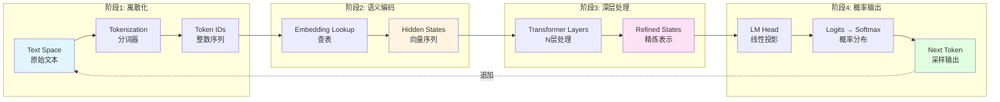
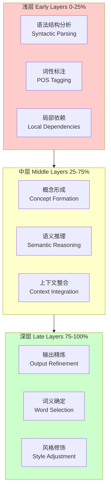
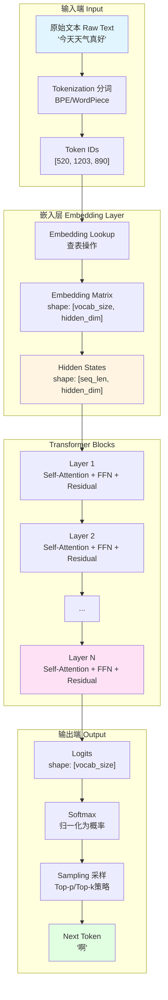
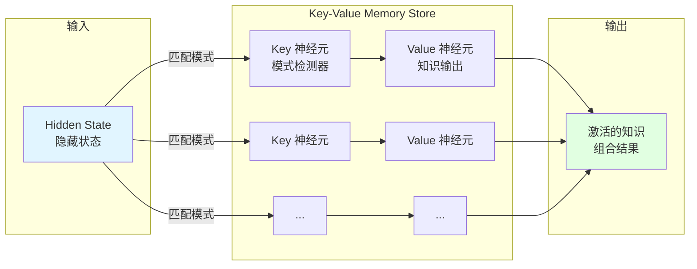
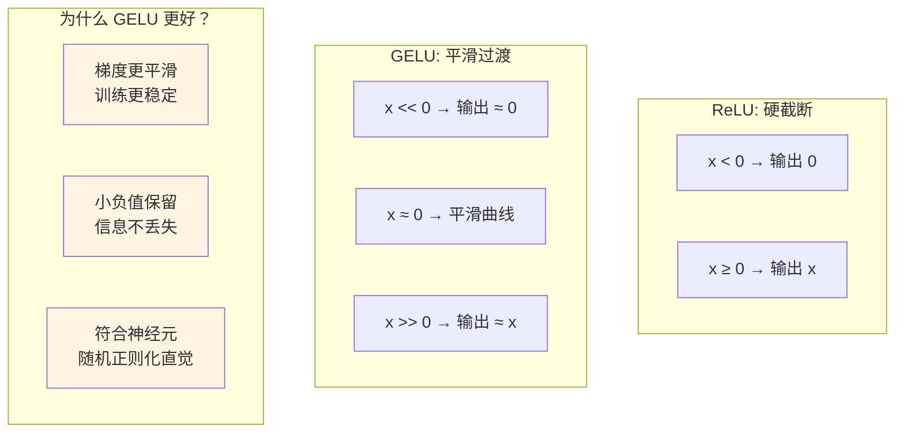
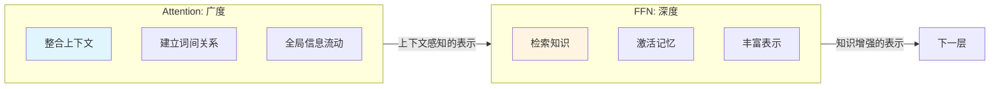
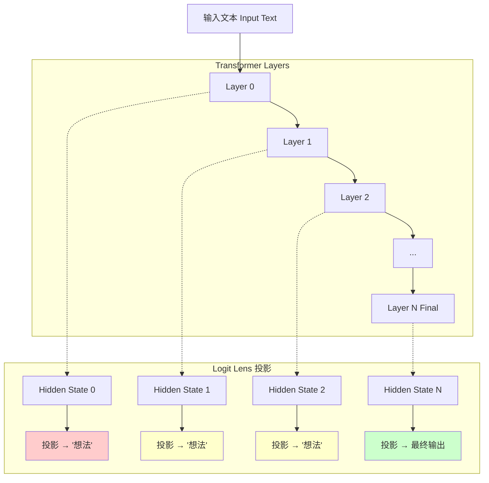
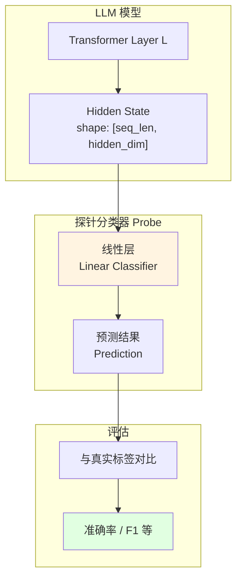

# 大语言模型内部基础架构：从黑盒子到透明盒子

> 基于 [李宏毅教授《生成式人工智慧與機器學習導論 2025》](https) 第3讲的核心知识点总结
>
> **课程标题：** 解剖大型語言模型（Dissecting Large Language Models）
>
> **核心主题：** 从"黑盒子"到"透明盒子"——探究 LLM 内部每一层到底在"想"什么

---

# 第一部分：宏观视角——整体架构流水线

## 一、LLM 的本质：一个巨大的函数

### 1.1 函数式理解

**大语言模型（LLM）本质上是一个数学函数：**

$$f(\text{输入}) = \text{下一个 Token 的概率分布}$$

这个函数的特点：

| 特性 | 说明 |
|------|------|
| **确定性** | 相同的输入 + 相同的参数 = 相同的输出 |
| **自回归** | 逐字生成，前一个字的输出是下一个字的输入 |
| **随机采样** | 基于概率分布采样，创造多样性 |

### 1.2 核心隐喻：文字接龙机器

LLM 的工作原理可以用一个简单的循环来描述：

```
输入 → 概率预测 → 采样 → 输出 → （循环）→ 概率预测 → ...
```

**示例：**
```
输入："今天天气"
↓
预测：["真不错" (0.3), "不太好" (0.2), "..." (0.5)]
↓
采样："真不错"
↓
新输入："今天天气真不错"
↓
（继续预测下一个字）
```

---

## 二、数据流转的三阶段

### 2.1 整体流程图



### 2.2 阶段一：Text Space → Vector Space（文字到向量）

#### 什么是 Tokenization？

**Tokenization（分词）** 将连续的文本拆分成离散的 Token。

| 分词方法 | 说明 | 示例 |
|----------|------|------|
| **BPE（字节对编码）** | 从字符级别逐步合并常见对 | "unhappiness" → "un", "happi", "ness" |
| **WordPiece** | 基于词频和子词 | "playing" → "play", "##ing" |
| **SentencePiece** | 统一分词框架 | 适用于多语言 |

**关键点：**
- 文本被转换为 Token ID（整数索引）
- 不同的分词策略影响模型表现
- 英文平均 1 Token ≈ 4 字符，中文 ≈ 1.5 字符

#### 什么是 Embedding？

**Embedding（嵌入）** 将离散的 Token ID 映射为连续的向量。

| 维度 | Text Space | Vector Space |
|------|------------|--------------|
| **数据类型** | 离散符号（字符串） | 连续数值（浮点数） |
| **可计算性** | 无法计算相似度 | 可以计算距离、角度 |
| **语义表达** | 隐含在符号中 | 显式编码在向量中 |

**核心概念：**

1. **语义空间**
   - 语义相近的词，在向量空间中距离更近
   - 可通过余弦相似度（Cosine Similarity）衡量

2. **向量维度**
   - 小模型：768 维（如 BERT-base）
   - 大模型：4096 维或更高（如 GPT-4）

**可视化：**

```
          苹果
           ↑
           |
    狗 ← 香蕉 → 猫
           |
           ↓
          橙子

（语义相近的词聚集在向量空间中）
```

---

### 2.3 阶段二：Vector Space 内部处理（向量空间流动）

#### Hidden States 是什么？

**Hidden States（隐藏状态）** 是数据在模型各层之间流动的中间表示。

| 特性 | 说明 |
|------|------|
| **形状** | `[batch_size, sequence_length, hidden_dim]` |
| **含义** | 模型在每一层对输入的"理解" |
| **变化** | 从浅层的字面理解，到深层的语义抽象 |

#### 数据流动的三个层次



**分层理解：**

| 层次 | 功能 | 示例 |
|------|------|------|
| **浅层** | 处理语法、词性 | 识别"动词"在句中的位置 |
| **中层** | 形成概念、初步推理 | 理解"苹果"是水果而非科技公司 |
| **深层** | 最终决策、输出修饰 | 决定使用"好吃"还是"美味" |

---

### 2.4 阶段三：Vector Space → Probability Space（向量到概率）

#### Logits 是什么？

**Logits（对数概率）** 是模型对词汇表中每个 Token 的原始预测分数。

| 概念 | 说明 |
|------|------|
| **形状** | `[batch_size, sequence_length, vocab_size]` |
| **词汇表大小** | 小模型 32K，大模型 100K+ |
| **含义** | 模型"认为"每个字出现的可能性 |

#### Softmax 的作用

**Softmax** 将 Logits 转换为概率分布（所有概率和为 1）。

**核心机制：**
- Logits 越大 → 概率越高
- 温度参数（Temperature）控制分布的平滑度
- 温度 = 0：确定性选择（取最大值）
- 温度 = 1：正常采样
- 温度 > 1：增加随机性和创造力

---

## 三、完整架构流水线

### 3.1 整体数据流



### 3.2 关键组件作用

| 组件 | 输入 | 输出 | 核心作用 |
|------|------|------|----------|
| **Tokenization** | 文本 | Token IDs | 离散化 |
| **Embedding** | Token IDs | 向量 | 连续化、语义编码 |
| **Attention** | Hidden States | 上下文融合 | 整合全局信息 |
| **FFN** | 上下文向量 | 知识处理 | 存储和检索知识 |
| **Layer Norm** | 向量 | 归一化向量 | 稳定训练 |
| **Unembedding** | Hidden States | Logits | 投影回词汇表 |
| **Softmax** | Logits | 概率 | 归一化 |

---

# 第二部分：微观解剖——Transformer 内部组件

## 四、Embedding Layer（嵌入层）

### 4.1 核心功能

**Embedding Layer 是模型的"词典"，将每个 Token ID 映射为固定的向量。**

### 4.2 Embedding Matrix 的本质

| 属性 | 说明 |
|------|------|
| **形状** | `[vocab_size, hidden_dim]` |
| **参数数量** | 词汇表大小 × 向量维度 |
| **可学习性** | 训练过程中自动优化 |

**示例：**
```
词汇表大小：50,000
向量维度：768
参数数量：50,000 × 768 = 38,400,000 个参数
```

### 4.3 语义相似性

**核心发现：**

1. **距离关系**
   - "猫"和"狗"的向量距离 < "猫"和"苹果"的距离
   - "国王" - "男人" + "女人" ≈ "女王"

2. **类比推理**
   - 向量空间支持数学运算
   - 模型通过向量关系进行语义推理

**可视化：**

```
       国王
        ↑
        | 男人
   女王 ←───|─── 女王
        ↓
        | 女人
       国王
```

---

## 五、Attention Module（注意力机制）

### 5.1 核心功能

**Attention 负责上下文融合（Context Integration），让模型"关注"重要的信息。**

### 5.2 解决的问题

| 问题 | 之前 | 之后 |
|------|------|------|
| **长距离依赖** | 无法记住前面的信息 | 通过注意力直接连接 |
| **上下文理解** | 局部信息 | 整句甚至全段信息 |

**示例：**

```
句子："那个穿红衣服的女孩，她喜欢吃苹果。"

读到"她"时，Attention 会"回头看"：
- 穿红衣服（强度：高）
- 喜欢吃苹果（强度：中）
- 那个（强度：低）
```

### 5.3 工作机制

#### Q、K、V 的比喻

| 符号 | 全称 | 比喻 | 作用 |
|------|------|------|------|
| **Q** | Query | "我想找什么" | 当前 Token 的查询请求 |
| **K** | Key | "我有什么标签" | 所有 Token 的标签 |
| **V** | Value | "我的内容是什么" | 所有 Token 的实际内容 |

**流程：**

1. **计算注意力分数**
   - Q 与所有 K 点乘（计算匹配度）
   - 得到"应该关注哪些 Token"

2. **归一化**
   - Softmax 将分数转为概率

3. **加权求和**
   - 根据概率加权 V
   - 得到上下文融合后的表示

### 5.4 多头注意力（Multi-Head Attention）

| 维度 | 单头 | 多头 |
|------|------|------|
| **关注点** | 单一语义 | 多种语义 |
| **能力** | 某一方面 | 全面理解 |
| **示例** | 只关注语法 | 同时关注语法、语义、指代 |

**多头的好处：**
- 头 1：关注语法结构
- 头 2：关注语义关系
- 头 3：关注指代消解
- 头 4：关注情感倾向
- ...

---

## 六、FFN / MLP（前馈网络）

### 6.1 核心功能

**FFN（Feed-Forward Network）负责知识处理与记忆（Knowledge & Memory）。**

在 Transformer 架构中，FFN 是仅次于 Attention 的第二大参数模块，通常占据模型约 2/3 的参数量。

### 6.2 键值记忆假设（Key-Value Memory Hypothesis）

> 这是 2020-2025 年 LLM 可解释性研究的重要发现之一

**核心假设：FFN 充当一个巨大的「联想记忆数据库」。**



#### Key-Value 记忆的工作原理

| 组件 | 类比 | 功能 | 示例 |
|------|------|------|------|
| **Key 权重矩阵** | 索引/目录 | 检测输入中的模式 | "法国" + "首都" → 激活特定神经元 |
| **Value 权重矩阵** | 内容/数据 | 存储对应的输出知识 | 被激活的神经元输出 "巴黎" |
| **激活函数** | 过滤器 | 决定哪些记忆被启用 | 只保留强匹配的记忆 |

#### 具体案例：事实检索

```
输入句子："法国的首都是巴黎。"

FFN 处理过程：
┌─────────────────────────────────────────────────────┐
│ Layer 10 (早期层)                                   │
│   Key 激活: "法国" → 地理概念神经元                  │
│   Value 输出: 强化"国家"相关表示                    │
├─────────────────────────────────────────────────────┤
│ Layer 15 (中层)                                     │
│   Key 激活: "法国" + "首都" → 查询模式              │
│   Value 输出: 开始激活 "巴黎" 相关神经元            │
├─────────────────────────────────────────────────────┤
│ Layer 20 (深层)                                     │
│   Key 激活: 完整事实模式匹配                        │
│   Value 输出: 强烈激活 "巴黎" Token                 │
└─────────────────────────────────────────────────────┘
```

#### 为什么这个假设重要？

1. **可解释性**：我们可以定位存储特定知识的神经元
2. **可控性**：通过修改特定神经元可以编辑模型知识
3. **高效性**：稀疏激活意味着只有相关记忆被使用

### 6.3 激活函数：ReLU 与 GELU

**激活函数是 FFN 的「开关」，决定神经元是否被激活。**

#### ReLU（Rectified Linear Unit）

$$\text{ReLU}(x) = \max(0, x)$$

| 特性 | 说明 |
|------|------|
| **计算简单** | 只需比较和置零 |
| **稀疏激活** | 负值全部归零，产生稀疏表示 |
| **死亡神经元** | 负值区域梯度为零，可能「死掉」 |

```
输入: [-2, -1, 0, 1, 2]
ReLU: [ 0,  0, 0, 1, 2]
```

#### GELU（Gaussian Error Linear Unit）

$$\text{GELU}(x) = x \cdot \Phi(x)$$

其中 $\Phi(x)$ 是标准正态分布的累积分布函数。

| 特性 | 说明 |
|------|------|
| **平滑过渡** | 在零附近有平滑的曲线 |
| **非单调** | 小负值也有微小输出 |
| **性能更好** | 在 Transformer 中表现优于 ReLU |

```
输入:  [-2, -1,   0,    1,    2]
GELU: [~0, ~0.15, 0, 0.84, 1.95]
```

#### 对比图示



#### 激活函数在 FFN 中的作用

在键值记忆框架下，激活函数可以理解为：

| 角度 | 解释 |
|------|------|
| **模式过滤器** | 只有匹配度足够高（正值）的记忆才会被激活 |
| **稀疏化器** | 大部分神经元被置零，只保留最相关的知识 |
| **非线性来源** | 使模型能够学习复杂的知识模式 |

### 6.4 FFN 两层结构

```
Hidden State [d_model=768]
        │
        ▼
┌───────────────────────┐
│  Linear 1: [768→3072] │  ← Key 矩阵：扩展匹配空间
│  扩展 4 倍维度        │
└───────────────────────┘
        │
        ▼
┌───────────────────────┐
│  Activation: GELU     │  ← 稀疏激活：选择相关记忆
│  稀疏化 + 非线性      │
└───────────────────────┘
        │
        ▼
┌───────────────────────┐
│  Linear 2: [3072→768] │  ← Value 矩阵：组合激活的知识
│  压缩回原维度         │
└───────────────────────┘
        │
        ▼
Output: Refined Hidden State
```

**为什么扩展再压缩？**

| 设计 | 理由 |
|------|------|
| **扩展 4 倍** | 更大的「记忆空间」，存储更多知识模式 |
| **中间激活** | 稀疏选择，只激活相关的记忆子集 |
| **压缩回原维度** | 将激活的知识融合到原始表示中 |

### 6.5 FFN 与 Attention 的协作



**比喻：**
- **Attention** = 图书馆的目录系统，帮你找到相关的书架
- **FFN** = 书架上的书籍，存储具体的知识内容

---

## 七、其他关键组件

### 7.1 残差连接（Residual Connection）

**残差连接是模型的"高速公路"。**

| 作用 | 说明 |
|------|------|
| **保留信息** | 原始信息不丢失 |
| **稳定训练** | 避免梯度消失 |
| **微调模式** | 深层网络只需"做加法"微调 |

**数学原理：**
```
输出 = 输入 + 处理(输入)
```

**可视化：**

```
输入 ──────────────────┐
                       ├─→ 输出
      ↓ 处理 ───────────┘
```

### 7.2 层归一化（Layer Normalization）

**Layer Norm 稳定模型的内部表示。**

| 作用 | 说明 |
|------|------|
| **归一化** | 将向量值限制在合理范围 |
| **加速训练** | 避免数值不稳定 |
| **标准化** | 保持一致的分布 |

**对比：**

| Layer Norm | Batch Norm |
|------------|------------|
| 独立处理每个样本 | 跨样本归一化 |
| 适合序列模型 | 适合图像模型 |

---

# 第三部分：打开黑盒子——可解释性工具

## 八、Logit Lens（逻辑透镜）

### 8.1 核心思想

**通常我们只看最后一层的输出，但中间层在干嘛？**

Logit Lens 的创新之处：**将中间某一层的 Hidden State 直接投影到词汇表，强行让模型"说出"它现在的想法。**

### 8.2 工作原理



### 8.3 分层推理的发现

#### 浅层（Early Layers）：处理浅层信息

| 发现 | 说明 |
|------|------|
| **语法处理** | 识别词性、句法结构 |
| **直接复制** | 有时直接复制输入的字 |

**示例：**

```
输入："翻译成中文：Hello"

浅层 Logit Lens 输出：
- "Hello"（直接复制）
- "翻译"（识别任务类型）
```

#### 中层（Middle Layers）：形成概念

| 发现 | 说明 |
|------|------|
| **概念形成** | 开始理解语义 |
| **中间语言** | 有时先翻译成其他语言 |

**示例：**

```
输入："将'cat'翻译成中文"

中层 Logit Lens 输出：
- Layer 10：可能输出"猫"（已经理解）
- Layer 15：可能输出"cat"（回退到原文）
- Layer 20：输出"猫咪"（开始修饰）

暗示：模型可能以某种"通用语言"思考
```

#### 深层（Late Layers）：精炼输出

| 发现 | 说明 |
|------|------|
| **最终决策** | 确定准确的用词 |
| **格式修饰** | 调整输出风格 |

**示例：**

```
深层 Logit Lens 输出：
- "猫咪"（比"猫"更可爱）
- "小猫"（更口语化）
```

### 8.4 核心洞察

**模型的"思考"是分层、连续的渐进过程：**

```
浅层：看到字面意思
  ↓
中层：形成概念、初步推理
  ↓
深层：精炼、确定最终输出
```

**不是在最后一步突然想出答案，而是在中间层就已经酝酿出概念。**

---

## 九、Probing（探针）

### 9.1 核心思想

**训练一个简单的分类器（Probe），插入到模型的某一层，测试该层是否包含特定信息。**

### 9.2 工作机制



### 9.3 应用示例

#### 语法探针

| 测试内容 | 发现 |
|----------|------|
| 词性标注 | 浅层即可完成 |
| 句法树 | 中层表现最好 |

#### 语义探针

| 测试内容 | 发现 |
|----------|------|
| 情感分析 | 中层已经包含情感信息 |
| 主题分类 | 深层效果更好 |

#### 事实探针

| 测试内容 | 发现 |
|----------|------|
| 知识检索 | FFN 层存储事实 |
| 实体识别 | 多层共同作用 |

### 9.4 证明模型分层编码信息

**探针实验证明：**

1. **句法信息**：浅层编码
2. **语义信息**：中层编码
3. **事实知识**：深层或 FFN 编码

---

# 第四部分：2025 特别视角——实践与验证

## 十、Hands-on（实作要点）

### 10.1 使用开源小模型

**推荐模型：**

| 模型 | 大小 | 适用场景 |
|------|------|----------|
| **Gemma-2B** | 20亿参数 | 快速实验 |
| **Llama-3-8B** | 80亿参数 | 平衡性能与速度 |

### 10.2 观察权重矩阵

**关键操作：**

| 操作 | 目的 |
|------|------|
| **打印 Embedding 矩阵** | 看词汇如何编码为向量 |
| **计算 Token 相似度** | 验证"猫"和"狗"比"猫"和"苹果"更近 |
| **查看 Attention 权重** | 看模型关注哪些词 |

**验证示例：**

```python
# 伪代码（仅作概念说明）
similarity_cat_dog = cosine_similarity(embedding["猫"], embedding["狗"])
# 结果：0.78（高相似度）

similarity_cat_apple = cosine_similarity(embedding["猫"], embedding["苹果"])
# 结果：0.32（低相似度）
```

### 10.3 Logit Lens 实践

**操作步骤：**

1. 加载开源模型
2. 在每一层插入 Logit Lens
3. 输入测试句子
4. 记录每层的"想法"
5. 分析分层推理过程

---

## 十一、核心洞察总结

### 11.1 LLM 的本质理解

| 维度 | 理解 |
|------|------|
| **外观** | 文字接龙机器 |
| **内部** | 分层推理系统 |
| **机制** | 注意力 + 知识存储 |

### 11.2 两大核心组件

| 组件 | 作用 | 比喻 |
|------|------|------|
| **Attention** | 上下文融合 | "看全局"的广度 |
| **FFN** | 知识处理 | "查知识"的深度 |

### 11.3 残差连接的意义

**残差连接是模型的基础设施：**

```
输入 ──────────────────────┐
                          ├─→ 输出
      ↓ 每层微调 ──────────┘
```

- 保留原始信息
- 允许深层网络只做"加法"调整
- 确保信息不丢失

### 11.4 分层推理的发现

**Logit Lens 的核心洞察：**

1. **答案不是突然出现的**
   - 在中间层已经酝酿概念

2. **模型会"回退"**
   - 有时正确答案 → 错误答案 → 正确答案

3. **通用语言假设**
   - 模型可能以某种内部语言思考

---

# 附录：速查表

## 十二、整体架构速查

### 数据流转三阶段

| 阶段 | 输入 | 输出 | 核心操作 |
|------|------|------|----------|
| **阶段 1** | Text Space | Vector Space | Tokenization + Embedding |
| **阶段 2** | Vector Space | Refined Space | Transformer Layers |
| **阶段 3** | Refined Space | Probability | Unembedding + Softmax |

### 关键组件速查

| 组件 | 作用 | 核心发现 |
|------|------|----------|
| **Embedding** | 文字→向量 | 语义相近距离更近 |
| **Attention** | 上下文融合 | Q、K、V 机制 |
| **FFN** | 知识存储 | Key-Value Memory Hypothesis |
| **Activation** | 稀疏激活 | GELU 优于 ReLU |
| **Logit Lens** | 观察中间层 | 分层推理过程 |

---

## 十三、2025 新增重点速查

| 主题 | 新增内容 | 实践要点 |
|------|----------|----------|
| **FFN 记忆机制** | Key-Value Memory Hypothesis | 定位知识存储神经元 |
| **激活函数** | GELU vs ReLU 对比 | 理解稀疏激活原理 |
| **Logit Lens** | 分层推理发现 | 观察中间层输出 |
| **Hands-on** | 实践验证 | 使用 Gemma/Llama |
| **Token 相似度** | 可视化分析 | 计算向量距离 |

---

## 十四、常见问题速答

### Q1：为什么需要 Embedding？

**A：** 文字无法计算相似度，但向量可以。Embedding 将离散符号转换为连续数值，让模型能够"理解"语义。

### Q2：Attention 和 FFN 的区别？

**A：**
- **Attention**：负责"看全局"，融合上下文信息
- **FFN**：负责"查知识"，存储和处理具体信息

### Q3：什么是 Logit Lens？

**A：** 一个工具，将模型中间层的 Hidden State 直接投影到词汇表，让我们看到模型在每一层"想"什么。

### Q4：为什么说模型的思考是分层的？

**A：** 通过 Logit Lens 发现，浅层处理语法，中层形成概念，深层精炼输出。答案是在层层传递中逐渐清晰的。

### Q5：残差连接有什么用？

**A：** 保留原始信息，让深层网络只需做"加法"微调，避免信息丢失。

---

# 结语

## 从黑盒子到透明盒子

李宏毅教授在第 3 讲中带我们打开了 LLM 的"黑盒子"：

**你学到了什么？**

| 层次 | 理解 |
|------|------|
| **宏观** | LLM 是一个从输入到输出的流水线函数 |
| **微观** | Transformer 的每个组件都有明确作用 |
| **可解释性** | Logit Lens 让我们看到中间层的推理过程 |
| **实践** | 可以通过开源模型验证理论 |

**核心隐喻：**

- **外观**：文字接龙机器
- **解剖刀**：Logit Lens
- **内部构造**：
  - Embedding：把字变成意思
  - Attention：看全局（广度）
  - FFN：查知识（深度）
  - Residual：保留信息的高速公路
  - Unembedding：把意思变回字

**2025 特别视角：**

不只懂原理，还能：
- 用代码加载模型
- 观察 Embedding 矩阵
- 计算 Token 相似度
- 使用 Logit Lens 看中间层

---

## 下一步学习

| 章节 | 标题 | 核心内容 |
|------|------|----------|
| **第 4 讲** | RAG 技术 | 检索增强生成 |
| **第 5 讲** | Agent 系统 | 智能体架构 |
| **第 6 讲** | 提示工程 | Prompt 优化 |
| **第 7 讲** | 模型训练 | Pre-train / SFT / RLHF |

---

> **文档版本：** v1.1
>
> **最后更新：** 2026-02-12
>
> **来源：** 李宏毅教授《生成式人工智慧與機器學習導論 2025》第3讲
>
> **课程标题：** 解剖大型語言模型（Dissecting Large Language Models）
>
> **核心主题：** 从"黑盒子"到"透明盒子"——探究 LLM 内部每一层到底在"想"什么
>
> **整理者：** AI Study Group
>
> **关键词：** LLM, Transformer, Attention, FFN, Key-Value Memory, Activation Function, GELU, ReLU, Logit Lens, Embedding, 可解释性, 分层推理
