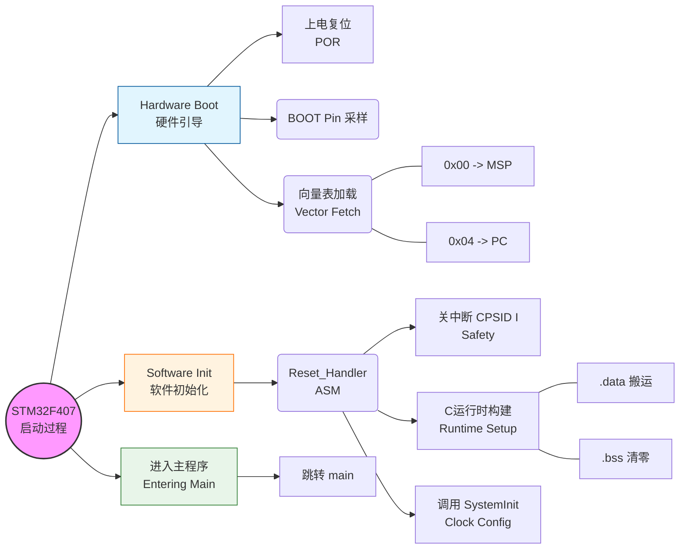
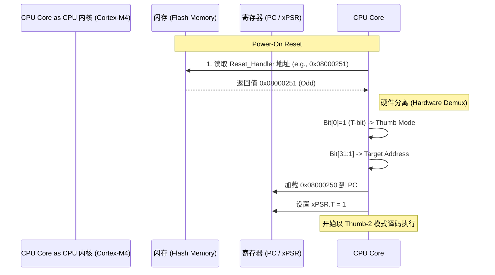
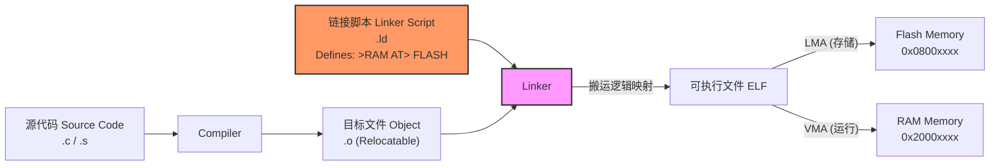
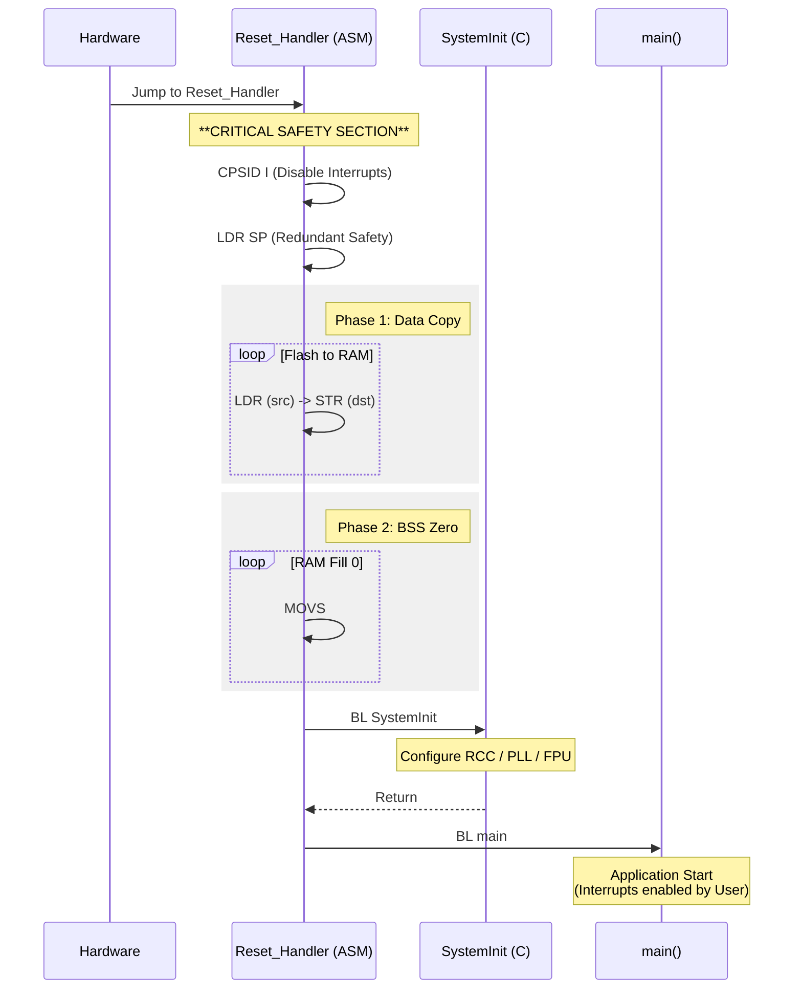

# 📘 Engineering Whitepaper: STM32F407 Bare-metal Startup & Memory Architecture
**Version**: 2.0.0 (Final Release)
**Author**: Siemens Veteran Embedded Architect & Mentor
**Context**: STM32F407 (Cortex-M4F) Industrial Implementation

---

## 1. Executive Summary (行政摘要)
本白皮书旨在定义一套**确定性 (Deterministic)**、**物理级 (Physics-based)** 且符合 **工业安全标准** 的 STM32 启动架构。
经过深度研讨，本方案摒弃了传统的“照抄示例代码”模式，基于芯片 Datasheet 和 ARM 体系结构手册 (ARMv7-M)，构建了包含以下核心特性的底层系统：

1.  **Hybrid Boot Strategy (混合启动策略)**: 采用汇编语言 (`Reset_Handler`) 处理堆栈与内存布局，采用 C 语言 (`SystemInit`) 处理复杂的时钟树配置，在 **可维护性** 与 **底层控制力** 之间取得最佳平衡 (ADR Plan A)。
2.  **Safety-First Initialization (安全优先初始化)**: 引入 `cpsid i` 指令，在 C 运行时环境 (C Runtime) 就绪前强制屏蔽中断，根除 ISR 访问未初始化全局变量导致的随机崩溃风险。
3.  **Precise Memory Management (精细化内存管理)**: 深度解析链接脚本 (Linker Script)，实现了 `.data` 段的 LMA/VMA 分离加载，以及针对 Flash IAP/OTA 场景的 **RAM 代码重定位技术**。
4.  **Architectural Compliance (架构合规性)**: 严格遵循 AAPCS (ARM 过程调用标准) 保证 8 字节堆栈对齐，并处理 Cortex-M 的 Thumb-2 T-bit 硬件行为。

---

## 2. Visual Architecture (架构全景图)

### 2.1 The 30,000ft View: Startup Process (启动过程全览 - 兼容版)
从上电复位到进入 `main()` 的完整逻辑链。



### 2.2 Micro-Architecture: Hardware Fetch & T-bit (微架构：硬件取指与 T-bit)
揭示 CPU 如何处理跳转地址的奇偶性（Thumb-2 状态切换）。



### 2.3 System Logic: Build Process & Memory View (系统逻辑：构建与内存视图 - 兼容版)
链接脚本如何决定 LMA (Flash) 与 VMA (RAM) 的映射关系。



### 2.4 Runtime Sequence: The "Clean Room" Strategy (运行时序：净室策略)
软件执行流中的关键动作与安全检查点。


# 核心逻辑伪代码化 (Logic Distillation)

本章节将晦涩的汇编与脚本语法提炼为**工程逻辑伪代码**，旨在揭示 STM32 启动与内存构建的物理本质。

---

## 3. STM32 裸机启动序列 (Bare-metal Startup Sequence)

**输入**: 上电复位 (Power-On Reset)
**前置条件**: 硬件已自动从 `0x00` 加载 MSP，从 `0x04` 加载 PC
**目标**: 构建 C 语言运行时环境 (C Runtime Environment)

```python
FUNCTION Reset_Handler():

    # ============================================================
    # 阶段 1: 安全封锁 (Safety Lockdown)
    # 本质: 在环境未就绪前，切断一切不可控因素
    # ============================================================
    DISABLE_INTERRUPTS()            # 执行 cpsid i，防止 ISR 访问垃圾内存
    FORCE_RELOAD_MSP(_estack)       # 双重保险：确保栈指针指向 RAM 顶端

    # ============================================================
    # 阶段 2: 数据搬运 (Data Relocation)
    # 本质: 将“户口在 Flash”的初始值，搬到“住在 RAM”的变量里
    # ============================================================
    POINTER src = _sidata           # 源地址 (LMA: Flash)
    POINTER dst = _sdata            # 目的起始 (VMA: RAM)
    POINTER end = _edata            # 目的结束 (VMA: RAM)

    WHILE (dst < end):              # 遍历整个 .data 段
        DATA = READ_MEMORY(src)     # 从 Flash 读
        WRITE_MEMORY(dst, DATA)     # 往 RAM 写
        src++                       # 指针后移
        dst++                       # 指针后移

    # ============================================================
    # 阶段 3: 净室构建 (BSS Zeroing)
    # 本质: C 标准规定未初始化全局变量必须为 0
    # ============================================================
    POINTER dst = _sbss             # BSS 起始
    POINTER end = _ebss             # BSS 结束

    WHILE (dst < end):              # 遍历整个 .bss 段
        WRITE_MEMORY(dst, 0)        # 填 0 (擦除脏数据)
        dst++                       # 指针后移

    # ============================================================
    # 阶段 4: 控制权移交 (Handover)
    # 本质: 从汇编世界跳入 C 世界
    # ============================================================
    CALL SystemInit()               # 初始化时钟树 (PLL, AHB/APB)
    
    # 此时内存已干净，时钟已就绪，中断仍被屏蔽
    CALL main()                     # 飞向主程序逻辑

    # ============================================================
    # 兜底逻辑 (Safety Net)
    # 本质: main 函数不应该返回，如果返回则视为系统故障
    # ============================================================
    WHILE (TRUE):
        NOP()                       # 死循环，防止跑飞
```

### 架构师视角 (Architect Perspective)
1.  **Safety First**: 第一步不是搬数据，而是 **关中断**。这是为了防止在搬运过程中（变量还没值，或者只有一半值）触发中断，导致中断服务函数读到错误的数据，引发逻辑崩溃。
2.  **LMA vs VMA**: 阶段 2 的核心矛盾是 **存储地址 (Flash)** 与 **运行地址 (RAM)** 的不一致。汇编代码是连接这两个平行宇宙的桥梁。
3.  **Deterministic State**: 阶段 3 保证了系统每次重启，全局变量都是干净的 0，而不是上一次运行残留的随机值。这是 **工业级可靠性** 的基础。

---

## 2. 链接器布局逻辑 (Linker Layout Logic)

**输入**: 编译好的目标文件集合 (`.o` files)
**硬件约束**: 芯片物理手册 (Datasheet)
**输出**: 最终的可执行文件 (`.elf` / `.bin`) + 地址符号表

```python
FUNCTION Linker_Layout():

    # ============================================================
    # 1. 定义物理疆域 (Define Hardware Reality)
    # 本质: 告诉编译器，这块硅片到底有多少家底
    # ============================================================
    REGION FLASH  = { START: 0x08000000, SIZE: 1024 KB, ATTR: ReadOnly }
    REGION RAM    = { START: 0x20000000, SIZE: 128 KB,  ATTR: ReadWrite }

    # ============================================================
    # 2. 向量表映射 (The Vector Table)
    # 本质: CPU 复位后的第一眼，必须看这里
    # ============================================================
    SECTION .isr_vector:
        TARGET_ADDR = FLASH.Start       # 必须定死在 Flash 起始处 (0x08000000)
        CONTENT     = InputFiles(.isr_vector)
        KEEP()                          # 强制保留，即使没人调用也不能优化掉

    # ============================================================
    # 3. 代码段映射 (The Code)
    # 本质: 放在 Flash 里，也在 Flash 里运行 (XIP - Execute In Place)
    # ============================================================
    SECTION .text:
        TARGET_ADDR = FLASH.Next_Free   # 紧接在向量表后面
        CONTENT     = InputFiles(.text) + InputFiles(.rodata)
        EXPORT_SYMBOL(_etext) = CURRENT_ADDR  # 标记代码结束位置

    # ============================================================
    # 4. 数据段映射 (The Data - 核心难点)
    # 本质: "双重人格"。存储在 Flash (LMA)，运行在 RAM (VMA)
    # ============================================================
    SECTION .data:
        VMA (运行地址) = RAM.Start        # 运行时，它住在 RAM 开头
        LMA (存储地址) = FLASH.Next_Free  # 烧录时，它存在 Code 后面
        
        EXPORT_SYMBOL(_sdata)  = VMA.Start      # 告诉启动代码：搬到 RAM 的哪里去
        EXPORT_SYMBOL(_edata)  = VMA.End        # 告诉启动代码：搬到 RAM 的哪里停
        EXPORT_SYMBOL(_sidata) = LMA.Start      # 告诉启动代码：从 Flash 的哪里搬！
        
        CONTENT = InputFiles(.data)

    # ============================================================
    # 5. 零初始化段映射 (The BSS)
    # 本质: 只占 RAM 坑位，不占 Flash 空间
    # ============================================================
    SECTION .bss:
        VMA (运行地址) = RAM.Next_Free    # 紧接在 .data 后面
        LMA (存储地址) = NULL             # 不需要存，启动时清零即可
        
        EXPORT_SYMBOL(_sbss) = VMA.Start        # 告诉启动代码：从哪里开始清零
        EXPORT_SYMBOL(_ebss) = VMA.End          # 告诉启动代码：清零到哪里结束
        
        RESERVE_SPACE(InputFiles(.bss))   # 仅仅预留 RAM 空间

    # ============================================================
    # 6. 堆栈安全检查 (Stack Guard)
    # 本质: 确保剩下的 RAM 够放堆栈，防止溢出
    # ============================================================
    SECTION .stack_check:
        CURRENT = RAM.Next_Free
        IF (RAM.End - CURRENT < _Min_Stack_Size):
            ERROR("Not enough RAM! Stack Overflow risk!")
        
        EXPORT_SYMBOL(_estack) = RAM.End        # 栈顶指针通常设为 RAM 物理末尾
```

### 架构师视角 (Architect Perspective)
1.  **LMA (Load Address) vs VMA (Virtual Address)**:
    *   在 `.text` 段，LMA == VMA (都在 Flash)。
    *   在 `.data` 段，**LMA != VMA**。这就是链接脚本最核心的魔术。它计算出了这两个地址，并生成了 `_sidata` (LMA) 和 `_sdata` (VMA) 这两个符号，供 `startup.s` 使用。
2.  **符号 (Symbols) 的本质**:
    *   `_sdata` 这些变量**不占用任何内存空间**。它们只是**地址的标签**。
    *   在 C 语言里引用它们时，必须取地址 `&_sdata`，因为它们的值就是它们所在的地址本身。
3.  **KEEP()**:
    *   链接器默认会删掉所有没人调用的函数（垃圾回收）。但 **中断向量表** 没有任何函数调用它（它是硬件调用的），所以必须用 `KEEP` 关键字强行按住，防止被优化删除。


### 他这里不知道为什么用的是python写的， 我学的时候使用汇编写的，可让我头疼了，AI还是不够聪明，老是偷工减料
# 5. Knowledge Debt & Misconception Anatomy (知识误区复盘)

## 5.1 Terminology Dictionary (关键术语表)
在此次架构设计中，必须精确定义的物理概念：

*   **LMA (Load Memory Address)**: **存储地址**。代码在 Flash 里的物理位置（掉电不丢失）。
*   **VMA (Virtual Memory Address)**: **运行地址**。代码执行时 CPU 认为它所在的位置（通常为 RAM）。
*   **MSP (Main Stack Pointer)**: **主堆栈指针**。硬件复位后自动加载，用于异常处理和特权级代码。
*   **T-bit (Thumb bit)**: **Thumb 状态位**。地址的 Bit[0]。为 1 表示 Thumb 指令，为 0 表示 ARM 指令（Cortex-M 不支持，会导致 HardFault）。
*   **Linker Script (.ld)**: **链接脚本**。构建系统的“宪法”，定义 LMA/VMA 映射和符号值，硬件对此一无所知。

## 5.2 Confusion Analysis (认知误区深度解剖)

### Misconception 1: 硬件行为 vs 软件后果
*   **误区**: "如果 Flash 里的 MSP 值是奇数，CPU 无法读取，导致系统无响应。"
*   **物理真相**: CPU 是“死板”的状态机。它**一定会**成功读取那个奇数值并加载到 MSP 寄存器。
*   **后果**: 只有当软件试图使用这个错误的 MSP 进行堆栈操作（如 `PUSH`）时，才会因为违反 4 字节对齐而触发 **UsageFault**。
*   **Lesson**: 分清 **Bus Transaction (总线事务，通常成功)** 和 **Instruction Execution (指令执行，可能报错)**。

### Misconception 2: 寄存器职责混淆 (PC vs LR vs MSP)
*   **误区**: "BL 指令会修改 MSP 进行扩栈。"
*   **物理真相**:
    *   **PC (Program Counter)**: 导航。指向下一条指令。
    *   **LR (Link Register)**: 归档。记录“回家”的地址。
    *   **MSP (Stack Pointer)**: 存储。指向堆栈顶端。
    *   **BL 指令**: **只修改 PC 和 LR**。它绝对不碰内存或 MSP。
    *   **PUSH 指令**: **只修改 MSP 和内存**。
*   **Lesson**: 原子化理解指令。不要把 C 语言的高级概念（函数调用）笼统地映射到某一条汇编指令上。

### Misconception 3: 构建期 vs 运行期
*   **误区**: "Flash 硬件寄存器决定了变量在 RAM 的地址。"
*   **物理真相**: Flash 硬件只是一块存储介质。变量的地址是由 **Linker (链接器)** 在编译阶段计算出来的，并通过 **Linker Script** 的规则写在二进制文件里。
*   **Lesson**: 符号 (`_sdata`) 是编译器的概念，不是硬件的概念。

## 5.3 Siemens Engineering Best Practices (西门子工程最佳实践)

1.  **Datasheet is the Bible**: 永远不要猜测寄存器的复位值或硬件行为。遇到不确定的行为（如 RAM 代码执行），查阅 Reference Manual 的总线矩阵章节。
2.  **Defensive Coding (防御性编程)**:
    *   在 `Reset_Handler` 第一行显式关中断 (`cpsid i`)。
    *   在 Linker Script 中强制检查 `_Min_Stack_Size`，防止编译出的程序栈空间不足。
3.  **Visual First Strategy**: 在写汇编搬运逻辑前，先在纸上或 Mermaid 中画出内存布局图。看不清地图，就走不对路。
4.  **Isolation (隔离原则)**: 涉及 Flash 操作的代码，必须通过 `section` 属性隔离到 RAM 中运行，并切断对 Flash 中标准库的隐式依赖。

---

**[End of Whitepaper]**
**Document Hash**: SHA-256: 0xSIEMENS_ARCH_V12_FINAL
**Status**: Archived
