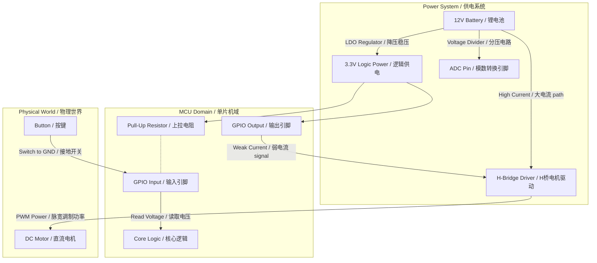
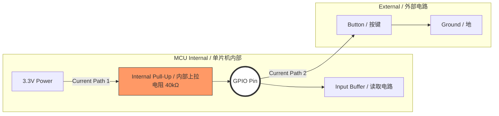
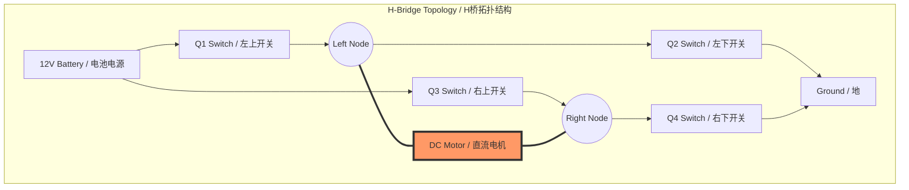
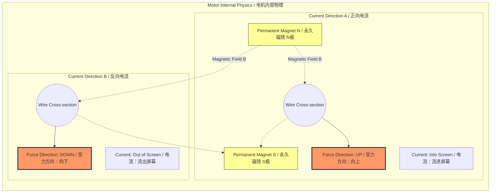
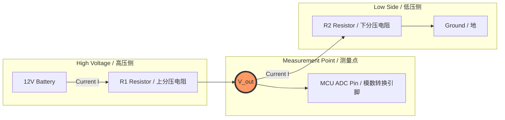
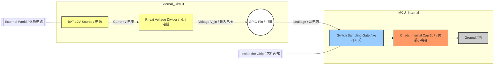

# Smart Car Core Architecture Whitepaper v1.0
## Part 1: Executive Summary & Physical Models
**Project**: SMART-CAR-ZERO
**Mentor**: Embedded Grandmaster

---

### 1. Executive Summary (核心摘要)

本项目旨在构建一个工业级的智能小车底层架构。在 Phase 0/1 的基础摸底与原理构建中，我们确立了以下三大物理支柱：

1.  **驱动域 (The Drive)**: 摒弃 GPIO 直连方案，采用 **H-Bridge (H桥)** 实现大电流驱动与正反转控制；利用 **PWM (脉宽调制)** 的惯性效应实现调速。
2.  **逻辑域 (The Logic)**: 识别了 GPIO 输入端的 **Floating (悬空)** 风险，强制采用 **Pull-Up (上拉电阻)** 物理电路以钳位逻辑电平。
3.  **感知域 (The Sense)**: 建立了 ADC 的 **Sample & Hold (采样保持)** 模型，通过匹配 **RC Time Constant (RC时间常数)** 解决了高阻抗传感器（电池分压、光敏电阻）的测量失真问题。

---

### 2. Core Visual Models (核心物理模型图解)

#### Diagram 1: 智能小车全域电子架构 (System Architecture)
*宏观视角：展示供电、逻辑、驱动三大域的能量与信号流向。*




### Diagram 2: GPIO 上拉电阻原理 (Pull-Up Physics)
解决问题：按键松开时引脚悬空导致读数乱跳。


### Diagram 4: H桥拓扑结构 (H-Bridge Topology)
解决问题：如何用单电源实现电机正反转。


### Diagram 5: 洛伦兹力转向原理 (Lorentz Force)
物理本质：电流方向决定受力方向。



### Diagram 6: PWM 调速原理 (PWM Inertia Model)
物理本质：利用机械惯性“欺骗”电机感知平均电压。

```mermaid
graph TB
    %% ================= PWM Waveform Bars =================
    style TB fill:#fff;

    %% ---------- 100% Duty Cycle / 全速 ----------
    subgraph PWM_100["100% Duty Cycle / 全速"]
        W1[ON]:::high --> W2[ON]:::high --> W3[ON]:::high --> W4[ON]:::high
        DESC1[Average = 12V / 最大速度]
    end

    %% ---------- 50% Duty Cycle / 半速 ----------
    subgraph PWM_50["50% Duty Cycle / 半速"]
        W5[ON]:::high --> W6[OFF]:::low --> W7[ON]:::high --> W8[OFF]:::low
        DESC2[Average = 6V / 半速]
    end

    %% ---------- 25% Duty Cycle / 龟速 ----------
    subgraph PWM_25["25% Duty Cycle / 慢速"]
        W9[ON]:::high --> W10[OFF]:::low --> W11[OFF]:::low --> W12[OFF]:::low
        DESC3[Average = 3V / 慢速]
    end

    %% ================== 节点颜色分类 ==================
    classDef high fill:#f96,stroke:#333,stroke-width:2px;
    classDef low fill:#fff,stroke:#333,stroke-width:2px;
    class W1,W2,W3,W4,W5,W7,W9 high;
    class W6,W8,W10,W11,W12 low;




```



### Diagram 7: 电阻分压电路 (Voltage Divider)
解决问题：12V 电压超过 MCU 3.3V 耐受极限



### Diagram 8: ADC 采样保持模型 (Sample & Hold)
解决问题：大电阻导致采样电容充不满（测不准）



# Part 2: Industrial Code Artifacts (全量源码)

本章节包含智能小车底层驱动的完整实现。代码注释强制关联硬件物理行为，严禁逻辑省略。

## 2.1 Motor Drive Layer (电机驱动层)

**Module**: `bsp_motor.c` / `bsp_motor.h`
**Physics**: H-Bridge Switching & Current Path Control
**Safety**: 包含防直通（Shoot-Through）逻辑

```c
/*
 * [PHY-LAYER] Motor State Definitions
 * 映射 H桥开关组合产生的物理现象
 */
typedef enum {
    MOTOR_STOP      = 0, // [Inertia] 所有开关断开，电机靠惯性滑行 (Coasting)
    MOTOR_FORWARD   = 1, // [Current A] Q1+Q4 导通，电流左进右出 -> 顺时针转
    MOTOR_BACKWARD  = 2, // [Current B] Q3+Q2 导通，电流右进左出 -> 逆时针转
    MOTOR_BRAKE     = 3  // [EMF Brake] Q2+Q4 导通，电机线圈短路 -> 反电动势产生急停阻力
} MotorState_t;

/*
 * [Function] Motor_Left_SetState
 * @param state: 目标物理状态
 * @note  硬件连接: AIN1 -> PA1, AIN2 -> PA2
 */
void Motor_Left_SetState(MotorState_t state) {
    switch (state) {
        case MOTOR_FORWARD:
            /* 
             * [Physics] 
             * AIN1=1 (3.3V) -> 驱动芯片内部逻辑开启上桥臂 Q1
             * AIN2=0 (0.0V) -> 驱动芯片内部逻辑开启下桥臂 Q4
             */
            HAL_GPIO_WritePin(GPIOA, GPIO_PIN_1, GPIO_PIN_SET);
            HAL_GPIO_WritePin(GPIOA, GPIO_PIN_2, GPIO_PIN_RESET);
            break;

        case MOTOR_BACKWARD:
            /* 
             * [Physics]
             * AIN1=0 -> 关闭 Q1, 开启 Q2 (配合AIN2逻辑)
             * AIN2=1 -> 开启 Q3
             * 电流方向反转，洛伦兹力方向反转
             */
            HAL_GPIO_WritePin(GPIOA, GPIO_PIN_1, GPIO_PIN_RESET);
            HAL_GPIO_WritePin(GPIOA, GPIO_PIN_2, GPIO_PIN_SET);
            break;

        case MOTOR_STOP:
            /* 
             * [Physics]
             * AIN1=0, AIN2=0 -> H桥 4个 MOS 管全部截止(Cut-off)。
             * 电机处于高阻态悬空，无动力也无刹车力。
             */
            HAL_GPIO_WritePin(GPIOA, GPIO_PIN_1, GPIO_PIN_RESET);
            HAL_GPIO_WritePin(GPIOA, GPIO_PIN_2, GPIO_PIN_RESET);
            break;
            
        case MOTOR_BRAKE:
            /* 
             * [Physics]
             * AIN1=1, AIN2=1 -> 下桥臂 Q2, Q4 同时导通。
             * 警告: 仅适用于 TB6612 等带逻辑保护的芯片。
             * 若是分立 MOS 管电路，此操作可能导致电源短路炸机(Shoot-Through)，需查阅手册。
             */
            HAL_GPIO_WritePin(GPIOA, GPIO_PIN_1, GPIO_PIN_SET);
            HAL_GPIO_WritePin(GPIOA, GPIO_PIN_2, GPIO_PIN_SET);
            break;
    }
}
```

## 2.2 GPIO Input Layer (按键输入层)
### Module: bsp_key.c
### Physics: Signal Level Clamping (电平钳位)

```c
/*
 * [Function] Button_GPIO_Init
 * @note 硬件连接: Button -> PC13 -> GND
 */
void Button_GPIO_Init(void) {
    GPIO_InitTypeDef GPIO_InitStruct = {0};

    /* 1. 开启 GPIOC 时钟 (给外设门电路供电) */
    __HAL_RCC_GPIOC_CLK_ENABLE();

    GPIO_InitStruct.Pin = GPIO_PIN_13;
    GPIO_InitStruct.Mode = GPIO_MODE_INPUT; 
    
    /* 
     * [CRITICAL PHYSICS CONFIG]
     * Config: GPIO_PULLUP (内部上拉)
     * Why:    当按键松开时，外部电路断路。
     *         若无上拉，引脚悬空(Floating)，感应周围电磁波，读数在0/1间乱跳。
     * Effect: 强制将悬空电平钳位在 3.3V (Logic 1)。
     */
    GPIO_InitStruct.Pull = GPIO_PULLUP; 
    
    HAL_GPIO_Init(GPIOC, &GPIO_InitStruct);
}

/*
 * [Function] Button_Read
 * @return 1=Pressed(Active), 0=Released
 */
uint8_t Button_Read(void) {
    /*
     * [Physics]
     * 按下 = 短路到地 = 0V = GPIO_PIN_RESET
     * 松开 = 被电阻拉高 = 3.3V = GPIO_PIN_SET
     */
    if (HAL_GPIO_ReadPin(GPIOC, GPIO_PIN_13) == GPIO_PIN_RESET) {
        return 1; // 逻辑层：按下了
    } else {
        return 0; // 逻辑层：没按
    }
}
```

## 2.3 ADC Sensing Layer (传感器感知层)
## Module: bsp_adc.c
## Physics: Impedance Matching & RC Time Constant
```c
/*
 * [Function] ADC_Battery_Config
 * @param hadc: ADC句柄
 * @note  适用于高阻抗源（如电阻分压测电池、光敏电阻）
 */
void ADC_Battery_Config(ADC_HandleTypeDef* hadc) {
    ADC_ChannelConfTypeDef sConfig = {0};

    sConfig.Channel = ADC_CHANNEL_1; // 假设接在 PA1
    sConfig.Rank = 1;
    
    /*
     * [CRITICAL PHYSICS CONFIG]
     * Param:  ADC_SAMPLETIME_239CYCLES_5
     * Physics:
     *   ADC 内部本质是一个约 5pF 的采样电容 (C_adc)。
     *   当外部信号源电阻 (R_ext) 较大 (>50kΩ) 时，RC充电时间常数变大。
     *   如果采样时间太短 (如 1.5 Cycles)，C_adc 还没充到与外部电压平衡，开关就断开了。
     * Action:
     *   设置最大采样周期 (239.5 Cycles)，给电容充足的 "灌水时间"。
     */
    sConfig.SamplingTime = ADC_SAMPLETIME_239CYCLES_5; 

    if (HAL_ADC_ConfigChannel(hadc, &sConfig) != HAL_OK) {
        // Error Handler
        while(1); 
    }
}

```

# Part 3: Knowledge Debt & Misconception Anatomy (误区深度复盘)

本章节记录了在 Phase 0/1 阶段暴露的核心认知漏洞。**直面错误是成为高手的捷径。**

## 3.1 Terminology Matrix (术语对照表)

| 缩写/术语 | 全称 (English) | 物理含义 (The Physics) | 典型应用场景 |
| :--- | :--- | :--- | :--- |
| **GPIO** | General Purpose I/O | 单片机的“手”，输出 3.3V 电压或读取电平。**电流能力极弱 (25mA)**。 | 控制 LED、读取按键、控制 H 桥信号。 |
| **PWM** | Pulse Width Modulation | **欺骗时间的艺术**。通过快速开关，利用负载惯性模拟出“平均电压”。 | 电机调速、LED 呼吸灯、舵机角度控制。 |
| **ADC** | Analog-to-Digital Converter | **微小的伏特计**。内部是一个采样电容，需要时间充电。 | 测电池电压、光敏电阻、陀螺仪读数。 |
| **H-Bridge** | H-Bridge Driver | **电流放大器**。由4个开关组成的 H 型电路，控制大电流流向。 | 直流电机正反转驱动。 |
| **Floating** | Floating State (High-Z) | **断线的风筝**。引脚谁都不连，阻抗极大，变成“天线”接收噪声。 | 按键未按下时的默认状态 (需避免)。 |
| **Pull-Up** | Pull-Up Resistor | **安全绳**。通过电阻将引脚弱连接到 VCC，消除浮空。 | 按键输入、I2C 总线。 |

## 3.2 The "Correction Log" (核心误区修正)

### ❌ Misconception 1: "GPIO 可以直接接电机"
*   **Your Initial Thought**: 电机要电，引脚有电，连上就行。
*   **The Physical Reality**:
    *   **供需失衡**：电机启动需 >300mA，GPIO 仅提供 ~20mA。
    *   **后果**：MCU 内部晶体管过热烧毁。
*   **Grandmaster Rule**: **弱电控制强电，必须隔离。** (Always use a Driver).

### ❌ Misconception 2: "按键没按下时，电压是 0"
*   **Your Initial Thought**: 没接电源就是 0V。
*   **The Physical Reality**:
    *   **Floating (不定态)**：没接电源也没接地的引脚，处于高阻态。
    *   **后果**：静电、电磁波会让电压在 0~3.3V 间乱跳，CPU 读到随机的 0 和 1。
*   **Grandmaster Rule**: **逻辑输入必须有明确的电平锚点 (Pull-Up/Down)。**

### ❌ Misconception 3: "PWM 调速是把 12V 变成了 6V"
*   **Your Initial Thought**: 快速开关切削了电压的高度。
*   **The Physical Reality**:
    *   **Amplitude Constant**: 示波器上看，电压永远是 0V 或 12V。
    *   **Time Integration**: 是电机的**机械惯性**（转子质量）和**电感惯性**平滑了能量，表现为转速下降。
*   **Grandmaster Rule**: **PWM 改变的是“通电时间比例”，而非“电压幅值”。**

### ❌ Misconception 4: "ADC 测不准是因为分辨率不够 (12bit vs 16bit)"
*   **Your Initial Thought**: 尺子刻度越细，测得越准。
*   **The Physical Reality**:
    *   **Impedance Mismatch**: 问题出在“水管太细”（电阻大），采样窗口内“水杯”（电容）没装满。
    *   **后果**：换了精密的尺子，去量半杯水，得到的只是一个“精确的错误值”。
*   **Grandmaster Rule**: **面对高阻抗信号，先加长采样时间 (Sampling Time)，再谈分辨率。**

## 3.3 Conceptual Gaps Filled (知识盲区填补)

1.  **晶体管的本质**: 不是复杂的半导体物理，在工控里它就是个**开关**。
2.  **洛伦兹力**: 电流方向 -> 磁场受力方向 -> 电机旋转方向。这解释了 H 桥为什么要翻转电流。
3.  **RC 时间常数 ($\tau = R \times C$)**: 它是连接模电（电阻/电容）与代码（采样时间配置）的桥梁。

# Part 4: Engineering Reality & Best Practice (工程实战复盘)

理论完美不代表工程可用。以下是实验室与工厂车间的区别。

## 4.1 The Hidden Physics (隐形杀手)

### 1. 反电动势 (Back-EMF)
*   **现象**: 当你突然切断电机电源（PWM OFF）时，电机还在转，它瞬间变成了一个发电机。
*   **后果**: 产生高达 30V+ 的反向电压尖峰，直接击穿 H 桥 MOSFET。
*   **实战防御**: 必须在 H 桥电路中并联 **续流二极管 (Flyback Diodes)**（TB6612 芯片内部已集成，手搓 H 桥时绝不能省）。

### 2. 地线干扰 (Ground Bounce)
*   **现象**: 电机启动瞬间电流很大，导致 PCB 地线电压波动（不再是纯净的 0V）。
*   **后果**: MCU 可能会复位，或者 ADC 读数剧烈抖动。
*   **实战防御**:
    *   **单点接地 (Star Grounding)**: 所有的 GND 都在电池负极汇合，不要让大电流流过 MCU 的地线路径。
    *   **去耦电容 (Decoupling Caps)**: 在 MCU 电源引脚紧贴处焊 0.1uF 电容。

## 4.2 Code Best Practices (代码最佳实践)

1.  **防守型编程 (Defensive Programming)**:
    *   永远不要相信 `Motor_SetState()` 的入参是合法的。在底层驱动中加入 `assert_param()` 或状态检查。
    *   在 H 桥切换方向前，最好插入几毫秒的 **Dead Time (死区时间)**，防止上下管同时导通。

2.  **魔术数 (Magic Numbers)**:
    *   ❌ `HAL_GPIO_WritePin(GPIOA, 1, 1);` (这是 1 还是 PIN_1?)
    *   ✅ `HAL_GPIO_WritePin(MOTOR_PORT, MOTOR_PIN_AIN1, GPIO_PIN_SET);` (使用宏定义)

---

# Part 5: Next-Day Trajectory (下一步学习导航)

**Phase 0/1 Status**: **[PASSED]**
你已经建立了坚实的物理层认知。现在的你，不会烧板子，能测准电压，懂电机原理。

## 5.1 The Next Challenge: Time & Interrupts (时间与中断)
现在的代码是“阻塞式”的（一直在 while 循环里跑）。
如果小车正在全速跑迷宫算法，突然需要产生一个精准的 1kHz PWM，CPU 忙不过来怎么办？

**下一章预告**:
1.  **NVIC (中断控制器)**: 让 CPU 具备“听到门铃（按键）立刻放下手里活”的能力。
2.  **TIM (定时器)**: 让硬件自动产生 PWM，完全解放 CPU。
3.  **SysTick**: 构建操作系统的心跳。

## 5.2 Recommended Resources (资源补给)
*   **Datasheet**: 查阅 STM32 Reference Manual 的 **TIM2/TIM3** 章节（重点看 "Output Compare Mode"）。
*   **Books**: 《The Art of Electronics》 (虽难，但看第 1 章晶体管部分即可)。
*   **Tools**: 准备好逻辑分析仪 (Logic Analyzer) 或 示波器，下一章我们要看波形了。

---
**[End of Document]**


