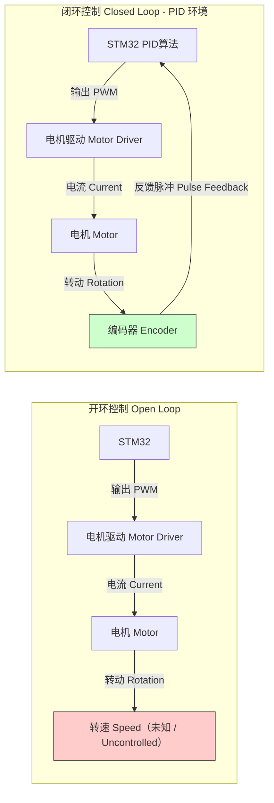
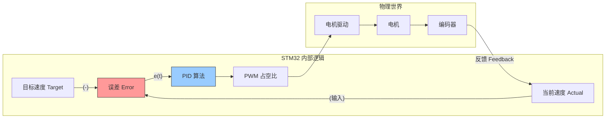
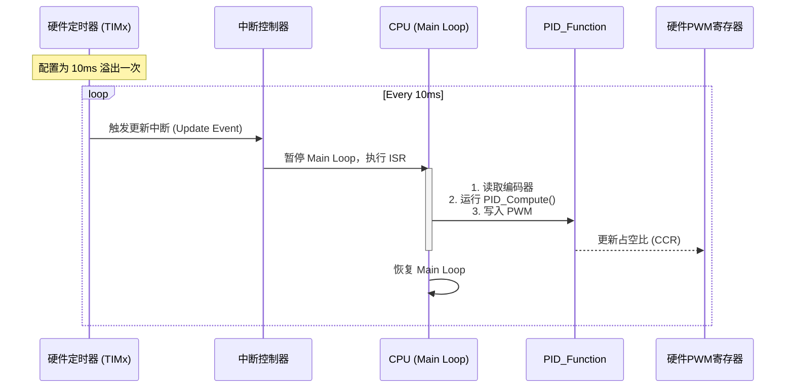
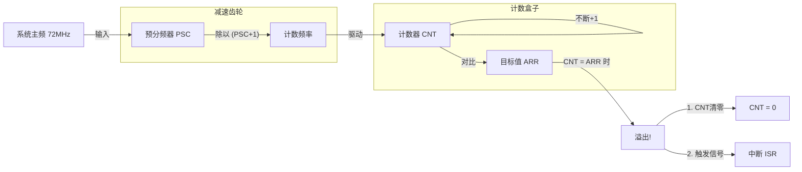
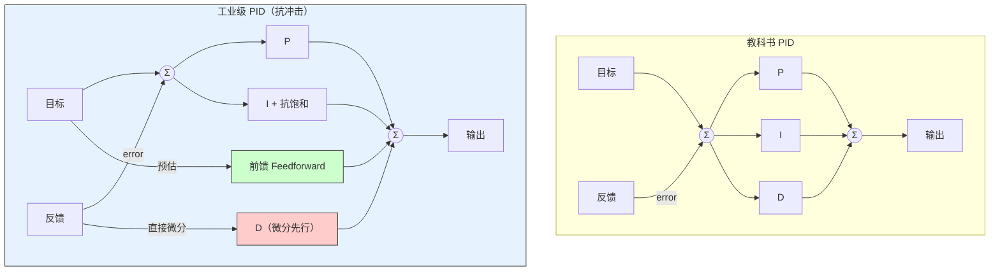
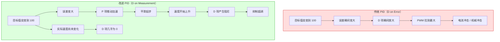
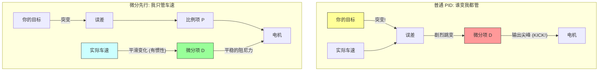

# Phase 4: STM32 PID 闭环控制系统白皮书 (v1.0)

## 1. Executive Summary (核心摘要)

本白皮书旨在构建一套工业级 STM32 直流电机闭环控制系统。系统基于 **离散 PID 控制理论**，解决了传统开环控制中无法应对负载变化和精度缺失的问题。

### 核心技术栈：
*   **硬件层**：利用 STM32 硬件定时器（TIMx）实现高精度编码器脉冲采集与 PWM 生成。
*   **驱动层**：采用 **10ms 硬件中断** 作为控制系统的绝对时间基准（Time Base），消除软件延时不确定性。
*   **算法层**：
    *   实现了标准 PID（比例-积分-微分）算法。
    *   引入 **Anti-Windup (抗积分饱和)** 保护电机与驱动器。
    *   引入 **Derivative on Measurement (微分先行)** 消除设定值突变带来的物理冲击。
    *   引入 **Feedforward (前馈控制)** 提升系统动态响应速度。

--

## 2. Visual Architecture & Roadmap (核心视觉资产库)

以下是系统设计的 7 张核心逻辑图表（Mermaid 源码），涵盖硬件架构、底层时序、算法原理及调参流程。

### Figure 1: 硬件与闭环控制总览 (System Hardware Loop)
*展示 STM32 与物理世界的交互闭环，强调编码器反馈路径。*

### Figure 4: 基础 PID 三项原理 (Basic PID Components)

*拆解 P, I, D 三个项的物理意义及其对输出的贡献*



### Figure 3: 实时系统时序图 (Real-Time Timing Sequence)

*展示 CPU 在主循环与中断之间的切换逻辑，强调中断处理的原子性与快速性*



### Figure 2: STM32 定时器时钟树 (Timer Clock Tree)

*解释 PSC (预分频) 与 ARR (自动重装载) 如何协同工作以产生精准的采样周期*




### Figure 5: 工业级 PID 拓扑结构 (Advanced Industrial PID)
*集成抗积分饱和、微分先行 (Derivative on Measurement) 与前馈控制 (Feedforward) 的高级架构。*



### Figure 6: 微分冲击对比 (Derivative Kick vs Smooth)

*直观展示“微分先行”如何消除设定目标突变时的物理冲击。*


### Figure 7: 调参流程状态机 (Tuning State Machine)

*标准化工程调参步骤指南*




# Phase 4: STM32 PID 闭环控制系统白皮书 (v1.0) - Source Code

## Step 4.2: Full Source Code Artifacts (全量代码资产)

本章节提供工业级 PID 控制器的完整 C 语言实现。该实现已集成 **Anti-Windup (抗积分饱和)**、**Derivative on Measurement (微分先行)** 及 **Feedforward (前馈控制)** 技术。

### Artifact 1: 控制器头文件 (`pid.h`)
*定义控制对象结构体，封装数据以支持多电机控制。*

```c
/*
 * File: pid.h
 * Author: Embedded Grandmaster
 * Standard: Industrial Closed-Loop Control
 */

#ifndef __PID_H
#define __PID_H

#include <stdint.h>

/* PID 控制器对象结构体 */
typedef struct {
    // === 调参参数 (Tuning Parameters) ===
    float Kp;           // 比例系数 (Proportional Gain) - 决定响应速度
    float Ki;           // 积分系数 (Integral Gain) - 消除稳态误差
    float Kd;           // 微分系数 (Derivative Gain) - 提供阻尼/防抖
    float K_ff;         // 前馈系数 (Feedforward Gain) - 提升动态跟随性

    // === 运行时状态 (Runtime State) ===
    float target_val;   // 目标值 (Setpoint)
    float actual_val;   // 实际测量值 (Measurement)
    float err;          // 当前误差 (Error = Target - Actual)
    
    // [关键修改] 微分先行专用
    // 记录上一次的"测量值"而非"误差"，防止目标突变引发 D 项冲击
    float actual_last;  
    
    float integral;     // 积分累计值 (Integrator State)

    // === 物理限制 (Physical Limits) ===
    float output_limit;   // 总输出限幅 (对应 PWM ARR 寄存器值)
    float integral_limit; // 积分抗饱和限幅 (通常设为输出限幅的 80%~100%)
    
    float output_val;     // 最终计算出的控制量

} PID_TypeDef;

/* API 函数声明 */
// 初始化函数：设置参数与限幅，并清空历史状态
void PID_Init(PID_TypeDef *pid, float p, float i, float d, float ff, float limit);

// 核心计算函数：必须在固定时间间隔 (dt) 的中断中调用
float PID_Compute_Advanced(PID_TypeDef *pid, float target, float measure);

#endif /* __PID_H */
```


# Artifact 2: 核心算法实现 (pid.c)

*实现改进型 PID 逻辑，重点在于处理边界条件与物理保护。*

```c


/*
 * File: pid.c
 * Description: Advanced Discrete PID Implementation
 */

#include "pid.h"

/**
 * @brief  PID 初始化
 * @param  pid: 句柄指针
 * @param  p, i, d: PID 参数
 * @param  ff: 前馈参数
 * @param  limit: 输出限幅 (绝对值)
 */
void PID_Init(PID_TypeDef *pid, float p, float i, float d, float ff, float limit) {
    pid->Kp = p;
    pid->Ki = i;
    pid->Kd = d;
    pid->K_ff = ff;
    
    pid->output_limit = limit;
    pid->integral_limit = limit; // 积分限幅默认等于输出限幅
    
    // 复位所有历史状态，防止上次运行的残余值影响
    pid->target_val = 0.0f;
    pid->actual_val = 0.0f;
    pid->actual_last = 0.0f;
    pid->err = 0.0f;
    pid->integral = 0.0f;
    pid->output_val = 0.0f;
}

/**
 * @brief  工业级 PID 计算 (抗饱和 + 微分先行 + 前馈)
 * @note   必须在定时器中断中以固定周期调用 (e.g., 10ms)
 * @param  pid: 句柄
 * @param  target: 目标值
 * @param  measure: 实际反馈值
 * @return float: 计算后的 PWM 占空比或电流指令
 */
float PID_Compute_Advanced(PID_TypeDef *pid, float target, float measure) {
    pid->target_val = target;
    pid->actual_val = measure;
    
    // 1. 计算误差
    pid->err = pid->target_val - pid->actual_val;
    
    // 2. 积分项计算 (I Term)
    pid->integral += pid->err;
    
    // [物理保护: Anti-Windup]
    // 解释: 若电机堵转或无法达到目标，积分项会无限累加。
    // 必须限制在由 integral_limit 设定的安全范围内。
    if (pid->integral > pid->integral_limit) {
        pid->integral = pid->integral_limit;
    } else if (pid->integral < -pid->integral_limit) {
        pid->integral = -pid->integral_limit;
    }
    
    // 3. 微分项计算 (D Term - Derivative on Measurement)
    // 公式: D = Kd * (Measure - Last_Measure)
    // 解释: 我们对“实际速度的变化”进行微分，而不是对误差微分。
    // 这避免了当目标值(target)突变时产生巨大的 D 项冲击(Kick)。
    // 注意：因为测量值增加代表误差减小，所以最终公式里这一项是减号。
    float differential = pid->actual_val - pid->actual_last;
    
    // 4. 前馈项计算 (Feedforward)
    // 解释: 根据物理模型预估的输出量，提高响应速度。
    // 例如: 目标 100RPM 大概需要 500 PWM，直接加上去。
    float feedforward = pid->K_ff * pid->target_val;
    
    // 5. 总输出计算
    // Output = P + I - D + FF
    float out = (pid->Kp * pid->err) + 
                (pid->Ki * pid->integral) - 
                (pid->Kd * differential) + 
                feedforward;
    
    // 6. 更新历史状态
    pid->actual_last = pid->actual_val;
    
    // [物理保护: Output Saturation]
    // 解释: PWM 寄存器有物理最大值 (ARR)，严禁溢出。
    if (out > pid->output_limit) {
        out = pid->output_limit;
    } else if (out < -pid->output_limit) {
        out = -pid->output_limit;
    }
    
    pid->output_val = out;
    return out;
}


```

# Artifact 3: 硬件集成逻辑 (stm32_integration.c)

*展示如何在 STM32 的硬件定时器中断中正确调用 PID*

```c
/*
 * File: stm32_integration.c
 * Description: Hardware Timer Integration Example
 */

#include "main.h"
#include "pid.h"

// 假设使用 TIM3 作为 PID 节拍器 (10ms)，TIM2 为编码器，TIM1 为 PWM
extern TIM_HandleTypeDef htim1; // PWM
extern TIM_HandleTypeDef htim2; // Encoder
extern TIM_HandleTypeDef htim3; // Timebase

PID_TypeDef motor1_pid;
float global_target_velocity = 0.0f; // 由其他逻辑(如遥控)修改

// 系统启动时的初始化序列
void System_Control_Init(void) {
    // 1. 初始化 PID 参数 (需根据实际电机调试)
    // Kp=2.0, Ki=0.1, Kd=0.5, FF=0.0, Limit=1000(ARR)
    PID_Init(&motor1_pid, 2.0f, 0.1f, 0.5f, 0.0f, 1000.0f);
    
    // 2. 启动硬件定时器
    HAL_TIM_Encoder_Start(&htim2, TIM_CHANNEL_ALL); // 启动编码器计数
    HAL_TIM_PWM_Start(&htim1, TIM_CHANNEL_1);        // 启动 PWM 输出
    HAL_TIM_Base_Start_IT(&htim3);                   // 启动 10ms 中断
}

// HAL 库定时器中断回调
void HAL_TIM_PeriodElapsedCallback(TIM_HandleTypeDef *htim) {
    // 确保只在 PID 专用定时器中断中执行
    if (htim->Instance == TIM3) {
        
        // Step A: 采集反馈 (Feedback Acquisition)
        // 读取 CNT 并转换为带符号的速度值
        int16_t enc_count = (int16_t)__HAL_TIM_GET_COUNTER(&htim2);
        
        // 清零计数器，测量的是"这段时间内的脉冲增量" (即速度)
        __HAL_TIM_SET_COUNTER(&htim2, 0); 
        
        // 简单的单位转换 (Pulse per 10ms)
        float current_speed = (float)enc_count;
        
        // Step B: 算法计算 (Algorithm Computation)
        float pwm_duty = PID_Compute_Advanced(&motor1_pid, global_target_velocity, current_speed);
        
        // Step C: 执行输出 (Actuation)
        if (pwm_duty >= 0) {
            // 正转
            __HAL_TIM_SET_COMPARE(&htim1, TIM_CHANNEL_1, (uint32_t)pwm_duty);
            HAL_GPIO_WritePin(GPIOA, GPIO_PIN_1, GPIO_PIN_SET);
            HAL_GPIO_WritePin(GPIOA, GPIO_PIN_2, GPIO_PIN_RESET);
        } else {
            // 反转 (取绝对值)
            __HAL_TIM_SET_COMPARE(&htim1, TIM_CHANNEL_1, (uint32_t)(-pwm_duty));
            HAL_GPIO_WritePin(GPIOA, GPIO_PIN_1, GPIO_PIN_RESET);
            HAL_GPIO_WritePin(GPIOA, GPIO_PIN_2, GPIO_PIN_SET);
        }
    }
}


```


# Phase 4: STM32 PID 闭环控制系统白皮书 (v1.0) - Knowledge Archive

## Step 4.3: Knowledge Debt & Side-Quest Archive (知识债务与支线库)

本章节归档了在开发过程中触发的所有**支线任务 (Side-Quests)** 与 **核心疑问 (Crucial Questions)**。这些内容构成了 PID 系统的理论基石。

### 1. 核心疑问回顾 (User Questions Archive)

#### Q1: 积分的时间($t$)在 MCU 中是如何控制的？如何在单片机上实现实时运行？
*   **Context**: 用户意识到数学公式中的 $\int dt$ 在代码中没有体现时间变量，且担忧代码执行的实时性。
*   **Solution: 离散化与硬件中断 (Discretization & Hardware IRQ)**
    *   **数学层面**: 在离散系统中，$\int e(t)dt \approx \sum (error \times T_s)$。我们将采样周期 $T_s$ (例如 0.01s) 视为常数 1，或者是融合进 $K_i$ 参数中。
    *   **工程层面**: 严禁使用 `HAL_Delay` 或 `while` 循环来控制 PID 周期。必须使用 **硬件定时器 (Hardware Timer)** 产生固定的中断（如 10ms）。
    *   **铁律**: PID 运算必须在定时器中断回调函数 (`HAL_TIM_PeriodElapsedCallback`) 中执行，确保 $T_s$ 绝对恒定，否则积分项失效，微分项震荡。

#### Q2: 预分频器 (PSC) 和 自动重装载值 (ARR) 到底是什么？
*   **Context**: 用户对 STM32 定时器基础参数表示困惑。
*   **Solution: 秒表工厂类比**
    *   **PSC (Prescaler)**: **分装员**。决定计数器“数一下”有多快。
        *   公式: $f_{CNT} = f_{CLK} / (PSC + 1)$。
        *   作用: 将 72MHz 的超快主频降速到可读的频率 (如 1MHz, 即 1us 数一下)。
    *   **ARR (Auto-Reload Register)**: **包装盒大小**。决定数多少下触发一次中断（闹钟）。
        *   公式: $T_{update} = (ARR + 1) \times T_{step}$。
        *   作用: 决定 PID 的采样频率 (如 10ms 触发一次)。

#### Q3: “微分先行” (Derivative on Measurement) 难以理解，为什么它能消除冲击？
*   **Context**: 用户直觉上难以区分“对误差微分”和“对测量微分”的区别，且经历了认知阻滞。
*   **Solution: 弹簧减震器模型**
    *   **传统 PID ($D_{error}$)**: D 项盯着“误差”看。当你瞬间改变目标 (Target 0->100)，误差瞬间爆炸。D 以为发生了剧烈震荡，于是输出巨大反向力（冲击）。
    *   **微分先行 ($D_{measure}$)**: D 项盯着“实际速度”看。虽然你心里想让车加速 (Target 变了)，但车因为惯性还没动 (Measure 没变)。D 看到 Measure 没变，就保持安静。等车真的动起来了，D 才介入提供阻尼。
    *   **结论**: 想要丝滑起步，必须把 D 项移到反馈通路上。

#### Q4: 工业现场有哪些常见坑？有什么更有意思的算法？
*   **Context**: 用户不满足于基础 PID，寻求进阶知识。
*   **Solution: 进阶控制图谱**
    *   **积分饱和 (Windup)**: 电机卡死导致积分项无限累加 -> 增加抗饱和 (Clamping)。
    *   **微分噪声 (Noise)**: 编码器抖动导致 D 项发疯 -> 增加低通滤波 (LPF)。
    *   **前馈控制 (Feedforward)**: 已知目标直接给油门 -> 提升响应速度 (Open-loop Assist)。
    *   **ADRC (自抗扰)**: 取代 PID 的国产高阶算法，核心是观测器 (ESO) 抵消所有扰动。

---

### 2. 生僻术语表 (Terminology)

| 术语 (Term) | 全称 (Full Name) | 解释 (Explanation) |
| :--- | :--- | :--- |
| **SetPoint (SP)** | Target Value | 你的目标值（如：希望车速 100）。 |
| **Feedback (PV)** | Process Value | 传感器读回来的实际值（如：编码器读到 98）。 |
| **Steady State Error** | - | **静差**。系统稳定下来后，目标与实际之间死活消除不掉的那点差距（靠 I 项解决）。 |
| **Overshoot** | - | **超调**。车冲过头了（靠 D 项抑制）。 |
| **Anti-Windup** | - | **抗积分饱和**。防止积分器在执行器饱和时持续累积误差。 |
| **Kick** | Derivative Kick | **微分冲击**。由于目标值阶跃变化导致的控制量尖峰。 |
| **Dead Zone** | - | **死区**。PWM 给小了电机不动（摩擦力），需要给一个基础电压补偿。 |

---

### 3. 认知复盘 (Confusion Analysis)

*   **Logic Trap**: 在“巡线小车”场景中，用户曾误选“前馈控制”来应对未知弯道。
*   **Correction**: 
    *   **前馈 (Feedforward)** 必须基于**已知信息**（如果你知道前面是弯道，或者知道目标速度要变了）。
    *   **模糊/自适应 (Fuzzy/Adaptive)** 才是应对**未知环境**（不知道前面有多弯）的正确选择。
*   **Takeaway**: 算法没有银弹，只有适用场景。**已知用前馈，未知用反馈/模糊。**


# Phase 5: Next-Day Trajectory (明日学习导航)

## 1. Performance Review (今日表现复盘)

*   **初始状态**: 典型的“单腿走路”。只知 PWM (执行器) 而不知 编码器 (传感器)，处于 **Open-Loop (开环)** 的盲视状态。
*   **高光时刻**: 
    *   敏锐地提出了 **积分时间 ($t$)** 在代码中如何体现的问题，直击离散控制系统的核心。
    *   快速理解了 **STM32 定时器硬件中断** 对实时性的决定性作用。
    *   在 **微分冲击 (Derivative Kick)** 的物理直觉测试中，成功修正了对数学公式的死板依赖。
*   **待补短板**: 
    *   **硬件抽象层 (HAL)** 的熟练度不足。对 PSC/ARR 的计算需要依赖公式推导，尚未形成直觉。
    *   **C 语言工程化** 能力较弱。对结构体封装、模块化编程 (.h/.c) 的意识刚开始建立。

**宗师评级**: **Level 1 - Apprentice (入门学徒)**。你已经从“瞎子”变成了“只有一只眼的工兵”，虽然能看见路了，但走得还不够稳。

---

## 2. Resource Supply (资源补给站)

为了巩固今日所学，请在未来 48 小时内完成以下“营养补充”：

### A. 必读文档 (Datasheet / Manual)
*   **文档**: STM32F103 (或你手头芯片) **Reference Manual (参考手册)**
*   **锁定章节**: 
    *   **TIM (Timer) Section**: 重点看 **Counter Modes** (计数模式) 和 **Encoder Interface Mode** (编码器接口模式)。
    *   **Interrupts & Events**: 理解 Update Event (UIE) 是如何触发的。
*   **任务**: 找到手册中关于 `TIMx_CNT`, `TIMx_PSC`, `TIMx_ARR` 三个寄存器的具体描述页。

### B. 视频/实战教程 (Visual Learning)
*   **搜索关键词**:
    *   `STM32 Encoder Mode HAL` (学习如何配置 CubeMX)。
    *   `PID Anti-windup derivative kick explanation` (看老外的可视化动画，加深物理理解)。
*   **推荐工具**: 
    *   **SerialPlot** 或 **Vofa+**: 这是一个串口绘图工具。**这一步至关重要**。不把 PID 波形画出来，你永远在瞎调参。

### C. 代码规范 (Coding Standard)
*   **书籍**: 《C Primer Plus》 或 任何 C 语言进阶书。
*   **关注点**: `struct` (结构体) 的使用、指针传递结构体 (`PID_TypeDef *pid`) 的写法。

---

## 3. Next Challenge (明日实战挑战)

既然你已经掌握了 **单环 PID (速度环)**，明天我们要挑战更复杂的物理场景。

**任务：双环控制 (Dual Loop Control) 或 差速转向**
1.  **场景**: 让小车不仅能稳速跑，还能**走直线**（即使两个电机性能不一样）。
2.  **难点**: 
    *   如何同时控制两个电机？
    *   如果有两个 PID (左轮、右轮)，它们的参数是一样的吗？
    *   **进阶思考**: 如何把“巡线传感器”的信号加入进来，把“误差”变成“左右轮的速度差”？

**预习公式**: 
$$ V_{Left} = V_{Target} + V_{Turn} $$
$$ V_{Right} = V_{Target} - V_{Turn} $$

---

## 4. Mental Model (宗师心法)

> **"PID 不是数学计算，它是对物理惯性的管理。"**
> 
> *   **P** 是你的**欲望**（想多快到达目标）。
> *   **I** 是你的**执念**（不达目标誓不罢休，小心走火入魔/饱和）。
> *   **D** 是你的**恐惧**（害怕冲过头，所以时刻准备刹车）。
> 
> 调参，就是平衡欲望、执念与恐惧的过程。

---

**[End of Session]**
特训结束。带上你的代码，去炸两个电机试试吧。实践出真知。


* 学习视频

[PID Controlle](https://www.youtube.com/watch?v=sFqFrmMJ-sg&list=PLln3BHg93SQ_Ejn6godXbxromegXSMYOl)

