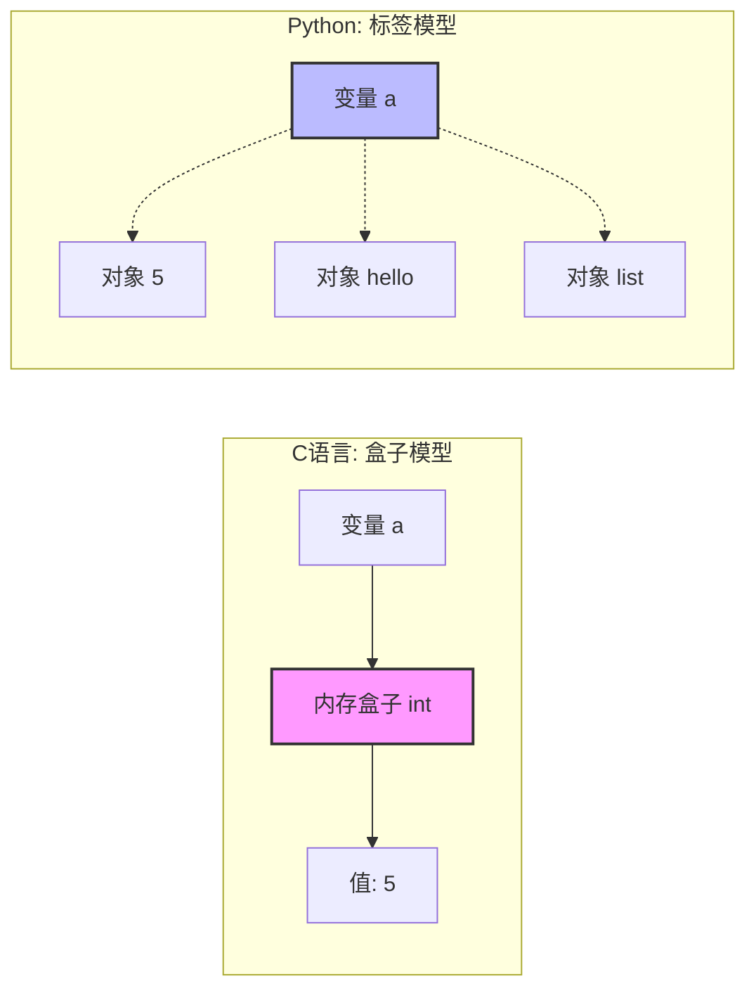

---
tags:
  - copilot-conversation
---

**user**: 优化一下
[Context: Notes: 嵌入式/语言/Python/一日速通基础Python.md]
[Timestamp: 2026/04/12 18:18:48]

**ai**: # 一日速通基础 Python

## 重点理解

- Python 没有 `#include`，用 `import`；没有头文件概念
- Python 没有 `switch/case`（3.10+ 有 `match/case`）
- Python **一切皆对象，`int` 也是对象（有方法）**
- Python 没有 `++`/`--` 运算符

## 1.2 动态类型 — 你最大的思维转变

C 是静态类型：编译器在编译时就确定每个变量的类型和大小。
Python 是动态类型：变量只是一个名字标签，贴到任何对象上。

```c
// C：盒子模型 —— 变量是装东西的盒子
int a = 5;       // 盒子a，只能装int
a = "hello";     // ❌ 编译错误
```

```python
# Python：标签模型 —— 变量是贴在对象上的便签
a = 5            # 便签"a"贴在整数对象5上
a = "hello"      # OK，撕下来贴到字符串对象上
a = [1, 2, 3]    # OK，再贴到列表对象上
```



*但这不是“没有类型”*：

```python
x = 5
print(type(x))       # <class 'int'>
x = "hello"
print(type(x))       # <class 'str'>
# 对标 C 的 typeof 或编译器内部类型信息
```

实战影响：读项目时，你不会看到类型声明。判断类型靠：

1. 上下文推断
2. `type()` 函数查看
3. 好的项目会有类型注解（Python 3.5+）：

```python
# 这是你会在现代项目中看到的写法
def read_sensor(port: str, baudrate: int = 115200) -> bytes:
    ...
```

> 这和 C 的函数签名 `bytes read_sensor(char* port, int baudrate)` 逻辑一致，但 Python 中注解只是提示，不强制。

## 1.4 运算符差异速查

| 功能 | C/C++ | Python | 说明 |
| :--- | :--- | :--- | :--- |
| 整除 | `a / b`（整数相除得整数） | `a // b` | Python 的 `/` 总是浮点除 |
| 取余 | `a % b` | `a % b` | 一样 |
| 幂运算 | `pow(a, b)` | `a ** b` | Python 原生支持 |
| 自增 | `i++` / `++i` | `i += 1` | Python 没有 `++` |
| 逻辑与 | `&&` | `and` | |
| 逻辑或 | `||` | `or` | |
| 逻辑非 | `!x` | `not x` | |
| 位运算 | `&` `|` `^` `~` `<<` `>>` | `&` `|` `^` `~` `<<` `>>` | 完全一样 |
| 三元表达式 | `cond ? a : b` | `a if cond else b` | 顺序反了 |
[Timestamp: 2026/04/12 18:20:17]