**user**: 你是一位嵌入式大师，我现在想要理解了解一下DSP架构，从他的物理上的布局，到设计特点，到芯片的选择，到嵌入式等层面来介绍这个
[Context: Notes: 嵌入式/芯片/DSP/DSP架构.md]
[Timestamp: 2026/04/28 15:28:56]

**ai**: **工程师你好，我是你的嵌入式导师。你的开发板上电了吗？今天遇到了什么棘手的技术问题？无论是HardFault、时序错乱，还是系统架构优化，随时抛给我。**

---

好问题！DSP（Digital Signal Processor）是嵌入式领域一个非常重要的分支。很多工程师对MCU很熟悉，但对DSP往往一知半解。今天我从**物理架构→设计哲学→芯片选型→工程应用**四个维度，带你系统性地理解DSP。

---

## 一、DSP的物理架构：为什么它"天生"适合信号处理？

### 1.1 核心矛盾：通用MCU处理信号的瓶颈

先看一个典型场景：**FIR滤波器**

```c
// 标准FIR滤波器实现
int32_t fir_filter(int16_t *input, int16_t *coeff, int N) {
    int32_t acc = 0;
    for (int i = 0; i < N; i++) {
        acc += (int32_t)input[i] * (int32_t)coeff[i];  // 乘法+累加
    }
    return acc;
}
```

在Cortex-M4上，这段代码的**每一条乘累加操作**需要：
- 取指令（1周期）
- 取数据input[i]（可能等待总线）
- 取数据coeff[i]（可能等待总线）
- 执行乘法（1周期）
- 执行加法（1周期）
- 循环判断与跳转（1-2周期）

**一个N阶FIR滤波器，可能需要 5N~8N 个时钟周期！**

而DSP的设计目标就是：**让这个循环在 N 个周期内完成**。

---

### 1.2 DSP的物理布局：哈佛架构+多总线

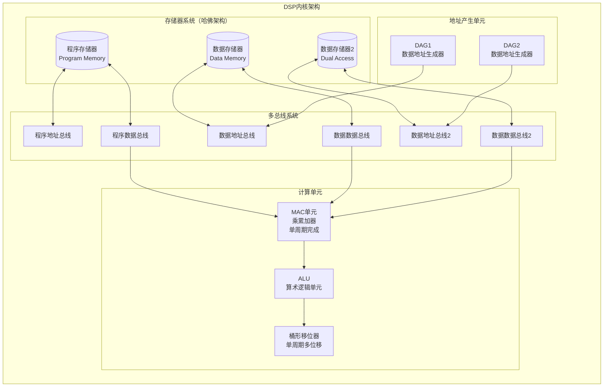
```mermaid
flowchart TB
    subgraph DSP_Core["DSP内核架构"]
        direction TB
        
        subgraph Memory["存储器系统（哈佛架构）"]
            PM[("程序存储器<br/>Program Memory")]
            DM[("数据存储器<br/>Data Memory")]
            DM2[("数据存储器2<br/>Dual Access")]
        end
        
        subgraph Buses["多总线系统"]
            PAB["程序地址总线"]
            PDB["程序数据总线"]
            DAB["数据地址总线"]
            DDB["数据数据总线"]
            DAB2["数据地址总线2"]
            DDB2["数据数据总线2"]
        end
        
        subgraph Compute["计算单元"]
            MAC["MAC单元<br/>乘累加器<br/>单周期完成"]
            ALU["ALU<br/>算术逻辑单元"]
            SHIFTER["桶形移位器<br/>单周期多位移"]
        end
        
        subgraph AddressGen["地址产生单元"]
            DAG1["DAG1<br/>数据地址生成器"]
            DAG2["DAG2<br/>数据地址生成器"]
        end
    end
    
    PM <--> PAB
    PM <--> PDB
    DM <--> DAB
    DM <--> DDB
    DM2 <--> DAB2
    DM2 <--> DDB2
    
    PDB --> MAC
    DDB --> MAC
    DDB2 --> MAC
    
    DAG1 --> DAB
    DAG2 --> DAB2
    
    MAC --> ALU
    ALU --> SHIFTER
```

**关键设计特点：**

| 特性 | 通用MCU | DSP | 优势 |
|------|---------|-----|------|
| 架构 | 冯·诺依曼（程序数据共用总线） | 改进哈佛（多总线并行） | 可同时取指、取两个操作数 |
| 乘法器 | 可选，多周期 | 硬件乘法器，单周期 | MAC单周期完成 |
| 循环开销 | 软件判断+跳转 | 硬件零开销循环 | 循环边界零额外周期 |
| 地址计算 | 通用ALU | 独立DAG（地址产生单元） | 地址计算与数据运算并行 |
| 数据宽度 | 8/16/32位 | 定点16/32位 或 浮点32/64位 | 针对信号处理优化 |

---

### 1.3 DSP的"杀手锏"：硬件级并行

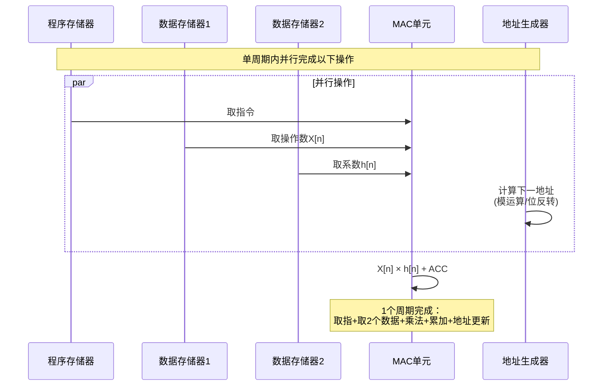
```mermaid
sequenceDiagram
    participant P as 程序存储器
    participant D1 as 数据存储器1
    participant D2 as 数据存储器2
    participant MAC as MAC单元
    participant DAG as 地址生成器
    
    Note over P,DAG: 单周期内并行完成以下操作
    
    par 并行操作
        P->>MAC: 取指令
        D1->>MAC: 取操作数X[n]
        D2->>MAC: 取系数h[n]
        DAG->>DAG: 计算下一地址<br/>(模运算/位反转)
    end
    
    MAC->>MAC: X[n] × h[n] + ACC
    
    Note over MAC: 1个周期完成：<br/>取指+取2个数据+乘法+累加+地址更新
```

**这就是DSP的核心竞争力：单周期内完成多个并行操作。**

---

## 二、DSP的设计哲学：为实时信号处理而生

### 2.1 零开销循环

传统MCU的循环：
```asm
; ARM汇编 - 循环需要额外指令
MOV     R0, #100        ; 循环次数
loop:
    ; ... 循环体 ...
    SUBS    R0, R0, #1  ; 计数器减1，设置标志位
    BNE     loop        ; 条件跳转（可能产生流水线气泡）
```

DSP的硬件循环：
```asm
; DSP汇编 - 零开销循环
RPT     #99            ; 硬件循环寄存器，自动递减判断
    MAC     *AR0+, *AR1+, A   ; 循环体，无额外开销
```

**硬件自动管理循环计数器、判断、跳转，不占用任何额外周期。**

---

### 2.2 特殊寻址模式：信号处理的"专用武器"

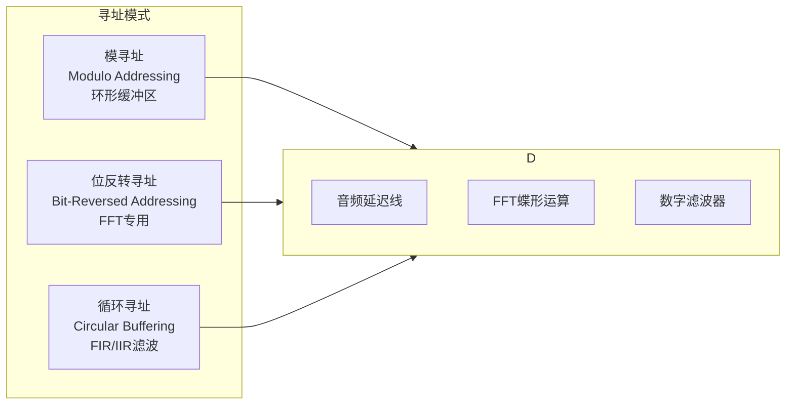
```mermaid
flowchart LR
    subgraph 寻址模式
        direction TB
        A["模寻址<br/>Modulo Addressing<br/>环形缓冲区"]
        B["位反转寻址<br/>Bit-Reversed Addressing<br/>FFT专用"]
        C["循环寻址<br/>Circular Buffering<br/>FIR/IIR滤波"]
    end
    
    A --> D["应用场景"]
    B --> D
    C --> D
    
    subgraph D
        E["音频延迟线"]
        F["FFT蝶形运算"]
        G["数字滤波器"]
    end
```

**位反转寻址示例（FFT）：**

FFT运算要求输入数据按**位反转顺序**排列。传统MCU需要软件计算：
```c
// 软件位反转 - 需要额外计算
for (int i = 0; i < N; i++) {
    int j = bit_reverse(i, log2(N));  // 额外开销
    fft_input[j] = input[i];
}
```

DSP硬件自动完成：
```asm
; DSP自动位反转寻址
FFT_LOOP:
    MOV     *BR0+, *AR1+   ; BR0是位反转指针，硬件自动计算
```

---

### 2.3 饱和运算：防止信号"溢出失真"

```c
// 通用MCU处理溢出
int32_t result = a + b;
if (result > INT16_MAX) result = INT16_MAX;  // 软件判断
if (result < INT16_MIN) result = INT16_MIN;

// DSP硬件饱和
// 硬件自动检测溢出，单周期内完成饱和
```

**音频处理中，溢出会产生严重的"咔嗒"噪声，饱和运算是DSP的标配。**

---

## 三、芯片选型：主流DSP芯片对比

### 3.1 DSP芯片分类矩阵

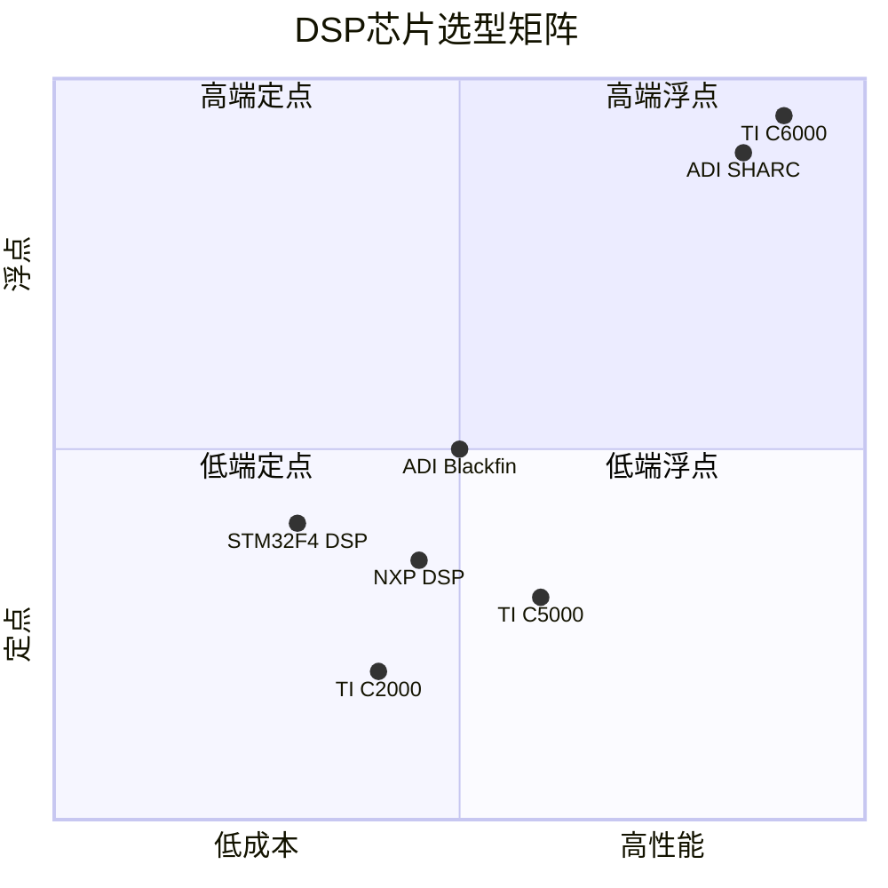
```mermaid
quadrantChart
    title DSP芯片选型矩阵
    x-axis "低成本" --> "高性能"
    y-axis "定点" --> "浮点"
    quadrant-1 "高端浮点"
    quadrant-2 "高端定点"
    quadrant-3 "低端定点"
    quadrant-4 "低端浮点"
    
    "TI C6000": [0.9, 0.95]
    "ADI SHARC": [0.85, 0.9]
    "TI C5000": [0.6, 0.3]
    "TI C2000": [0.4, 0.2]
    "STM32F4 DSP": [0.3, 0.4]
    "ADI Blackfin": [0.5, 0.5]
    "NXP DSP": [0.45, 0.35]
```

### 3.2 主流DSP厂商与系列

| 厂商 | 系列 | 定点/浮点 | 典型应用 | 特点 |
|------|------|-----------|----------|------|
| **TI** | C2000 | 定点 | 电机控制、电源 | 集成PWM、ADC，控制专用 |
| **TI** | C5000 | 定点 | 语音、音频 | 低功耗，便携设备 |
| **TI** | C6000 | 定点+浮点 | 图像、通信、雷达 | 高性能，多核 |
| **ADI** | SHARC | 浮点 | 专业音频、医疗 | 超高精度浮点 |
| **ADI** | Blackfin | 定点+浮点 | 多媒体、工业 | DSP+MCU混合架构 |
| **NXP** | DSP56000 | 定点 | 音频、通信 | 经典架构 |

---

### 3.3 选型决策树

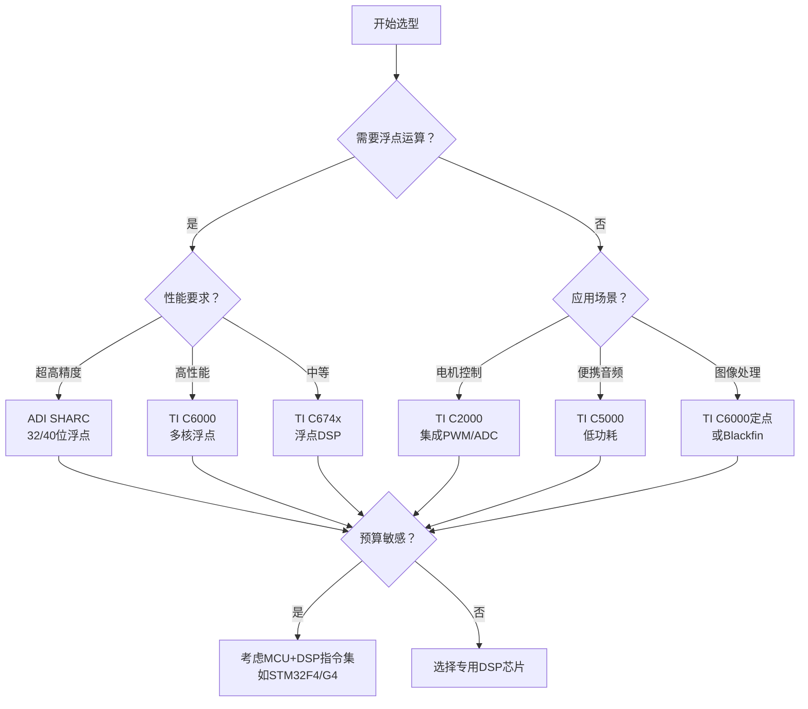
```mermaid
flowchart TD
    A[开始选型] --> B{需要浮点运算？}
    
    B -->|是| C{性能要求？}
    B -->|否| D{应用场景？}
    
    C -->|超高精度| E["ADI SHARC<br/>32/40位浮点"]
    C -->|高性能| F["TI C6000<br/>多核浮点"]
    C -->|中等| G["TI C674x<br/>浮点DSP"]
    
    D -->|电机控制| H["TI C2000<br/>集成PWM/ADC"]
    D -->|便携音频| I["TI C5000<br/>低功耗"]
    D -->|图像处理| J["TI C6000定点<br/>或Blackfin"]
    
    E --> K{预算敏感？}
    F --> K
    G --> K
    H --> K
    I --> K
    J --> K
    
    K -->|是| L["考虑MCU+DSP指令集<br/>如STM32F4/G4"]
    K -->|否| M["选择专用DSP芯片"]
```

---

### 3.4 MCU+DSP混合方案：现代趋势

很多现代MCU已经集成了DSP指令集：

```c
// STM32F4 (Cortex-M4F) 使用DSP指令
#include "arm_math.h"

// CMSIS-DSP库，底层使用DSP指令
arm_fir_instance_f32 fir_inst;
arm_fir_init_f32(&fir_inst, NUM_TAPS, coeff, state, block_size);
arm_fir_f32(&fir_inst, input, output, block_size);
```

**对比：**

| 方案 | 优点 | 缺点 | 适用场景 |
|------|------|------|----------|
| 专用DSP | 极致性能、专用外设 | 开发门槛高、成本高 | 专业音频、雷达、通信 |
| MCU+DSP指令 | 开发简单、成本低 | 性能有上限 | 消费电子、工业控制 |
| FPGA+DSP | 灵活、可定制 | 开发难度最高 | 高端仪器、通信设备 |

---

## 四、嵌入式工程应用：DSP的实际战场

### 4.1 典型应用场景

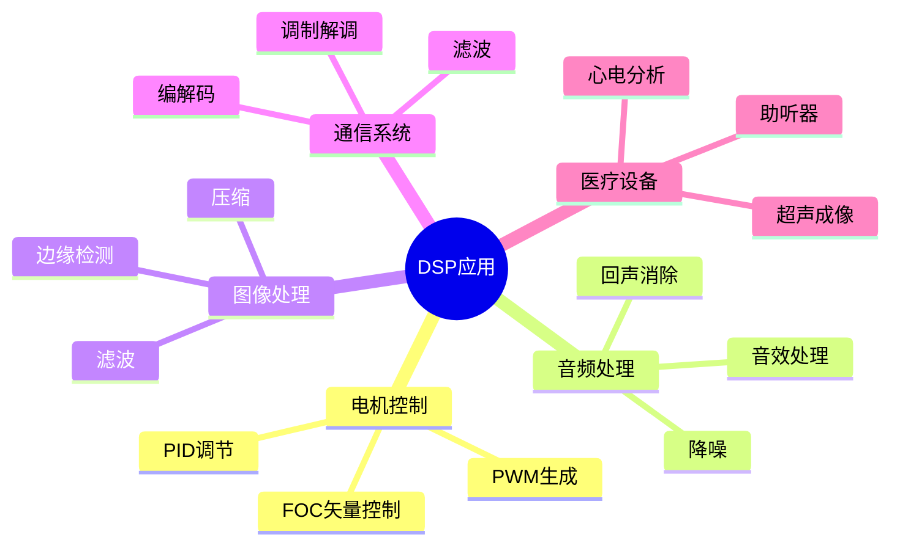
```mermaid
mindmap
  root((DSP应用))
    电机控制
      FOC矢量控制
      PID调节
      PWM生成
    音频处理
      降噪
      回声消除
      音效处理
    图像处理
      边缘检测
      滤波
      压缩
    通信系统
      调制解调
      滤波
      编解码
    医疗设备
      超声成像
      心电分析
      助听器
```

### 4.2 实战案例：电机FOC控制

```c
// TI C2000 FOC控制核心代码
void FOC_Control(FOC_Handle *handle) {
    // 1. Clarke变换（硬件加速）
    Clarke_Transform(&handle->Iab, &handle->Iabc);
    
    // 2. Park变换（需要三角函数，查表+插值）
    Park_Transform(&handle->Idq, &handle->Iab, &handle->theta);
    
    // 3. PID控制（定点运算，注意饱和）
    handle->Vd = PID_Calc(&handle->pid_d, handle->Id_ref, handle->Idq.d);
    handle->Vq = PID_Calc(&handle->pid_q, handle->Iq_ref, handle->Idq.q);
    
    // 4. 反Park变换
    InvPark_Transform(&handle->Vab, &handle->Vdq, &handle->theta);
    
    // 5. SVPWM调制（硬件PWM模块）
    SVPWM_Generate(&handle->Vab, handle->dc_bus);
}
```

**C2000的优势：**
- 集成高精度PWM（150ps分辨率）
- 12位ADC，多通道同步采样
- 三角函数硬件加速器（TMU）
- 专为电机控制优化的外设

---

### 4.3 实战案例：音频处理

```c
// ADI SHARC 音频处理链
void Audio_Processing_Chain(float *input, float *output, int frames) {
    // 1. 降噪（自适应滤波）
    Adaptive_Noise_Cancellation(input, frames);
    
    // 2. 均衡器（多段IIR滤波）
    for (int band = 0; band < NUM_BANDS; band++) {
        IIR_Filter(&eq_bands[band], input, frames);
    }
    
    // 3. 动态压缩
    Dynamic_Range_Compression(input, frames, &compressor_params);
    
    // 4. 混响（延迟线+反馈）
    Reverb_Process(input, output, frames, &reverb_params);
}
```

**SHARC的优势：**
- 32/40位浮点，动态范围>120dB
- 零等待状态存储器
- 多通道DMA，支持多声道
- 专业音频接口（SPDIF, I2S）

---

## 五、大师的工程建议

### 5.1 何时选择DSP？

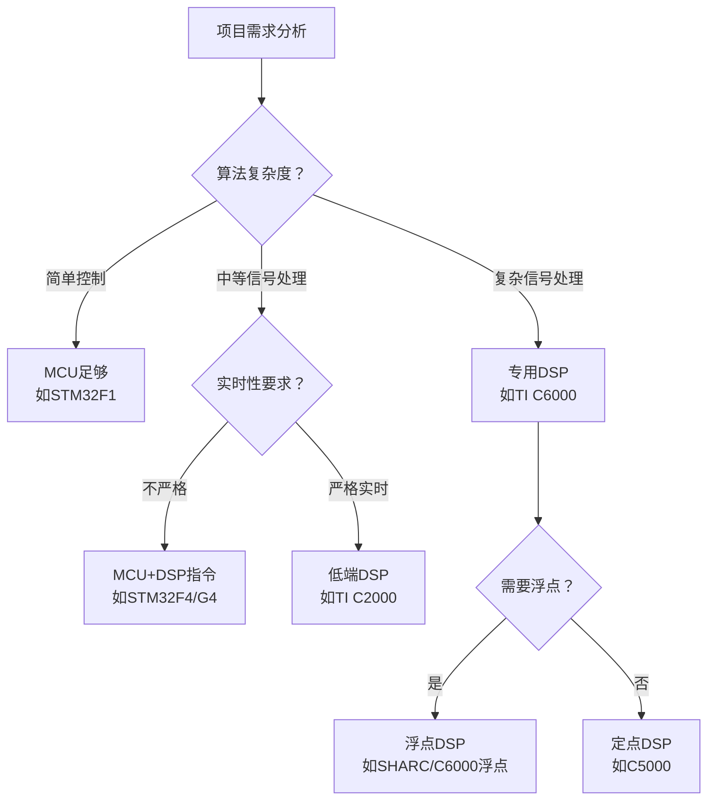
```mermaid
flowchart TD
    A[项目需求分析] --> B{算法复杂度？}
    
    B -->|简单控制| C["MCU足够<br/>如STM32F1"]
    B -->|中等信号处理| D{实时性要求？}
    B -->|复杂信号处理| E["专用DSP<br/>如TI C6000"]
    
    D -->|不严格| F["MCU+DSP指令<br/>如STM32F4/G4"]
    D -->|严格实时| G["低端DSP<br/>如TI C2000"]
    
    E --> H{需要浮点？}
    H -->|是| I["浮点DSP<br/>如SHARC/C6000浮点"]
    H -->|否| J["定点DSP<br/>如C5000"]
```

### 5.2 DSP开发避坑指南

| 坑点 | 表现 | 解决方案 |
|------|------|----------|
| **定点溢出** | 信号突然变成噪声 | 使用饱和运算、Q格式定点 |
| **精度损失** | 滤波器不稳定 | 使用双精度累加器、检查系数量化 |
| **内存对齐** | 性能下降或崩溃 | 使用`#pragma DATA_ALIGN` |
| **Cache一致性** | 数据不一致 | 使用Cache冻结或手动回写 |
| **中断延迟** | 实时性不达标 | 使用DMA、优化中断优先级 |

### 5.3 学习路径建议


```mermaid
flowchart LR
    A["理论基础<br/>数字信号处理<br/>DSP原理"] --> B["工具链<br/>CCS/VDSP<br/>仿真器"]
    B --> C["算法实现<br/>FIR/IIR/FFT<br/>CMSIS-DSP"]
    C --> D["外设集成<br/>ADC/PWM/DMA"]
    D --> E["系统优化<br/>流水线<br/>内存布局"]
```

---

## 总结

DSP不是"更快的MCU"，而是**为信号处理重新设计的架构**：
- **哈佛架构+多总线** → 并行取指取数
- **硬件MAC+零开销循环** → 单周期乘累加
- **特殊寻址模式** → FFT/滤波零开销
- **饱和运算** → 信号处理安全网

选型时，先明确**算法复杂度**和**实时性要求**，再在成本和性能间权衡。

---

**工程师，你现在手头有具体的项目需求吗？是想做电机控制、音频处理，还是通信系统？我可以帮你做更具体的选型建议。**
[Timestamp: 2026/04/28 15:30:47]

**user**: 以同样的标准介绍一下SMP架构
[Context: Notes: 嵌入式/芯片/SMP/SMP 架构.md]
[Timestamp: 2026/04/28 15:31:18]

**ai**: **工程师你好，SMP（对称多处理）架构是现代嵌入式系统向高性能演进的关键技术。从手机SoC到汽车域控制器，SMP无处不在。让我用同样的深度带你系统理解。**

---

## 一、SMP的物理架构：多核如何"协同作战"？

### 1.1 核心矛盾：单核的性能瓶颈

单核处理器提升性能的三条路：
- **提高主频** → 功耗随频率立方增长，散热无解
- **超标量/流水线** → 复杂度爆炸，边际效益递减
- **多核并行** → **SMP的答案**

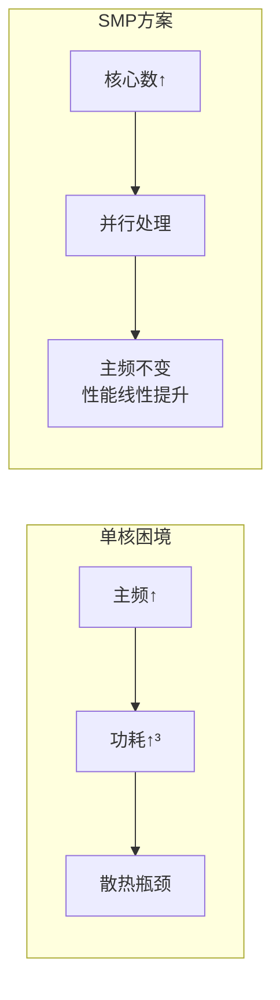
```mermaid
flowchart LR
    subgraph 单核困境
        A["主频↑"] --> B["功耗↑³"]
        B --> C["散热瓶颈"]
    end
    
    subgraph SMP方案
        D["核心数↑"] --> E["并行处理"]
        E --> F["主频不变<br/>性能线性提升"]
    end
```

---

### 1.2 SMP的物理布局：共享一切，平等竞争

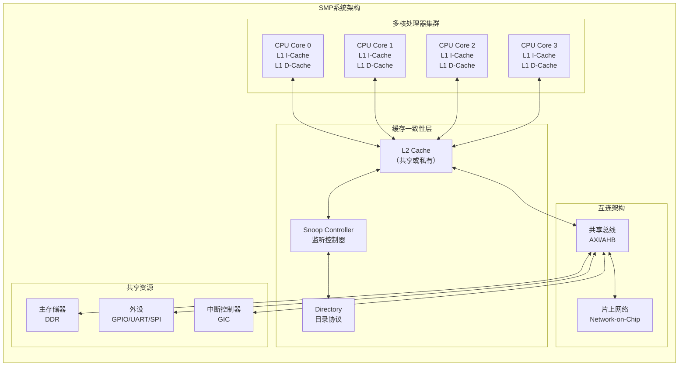
```mermaid
flowchart TB
    subgraph SMP_System["SMP系统架构"]
        direction TB
        
        subgraph Cores["多核处理器集群"]
            direction LR
            Core0["CPU Core 0<br/>L1 I-Cache<br/>L1 D-Cache"]
            Core1["CPU Core 1<br/>L1 I-Cache<br/>L1 D-Cache"]
            Core2["CPU Core 2<br/>L1 I-Cache<br/>L1 D-Cache"]
            Core3["CPU Core 3<br/>L1 I-Cache<br/>L1 D-Cache"]
        end
        
        subgraph CacheCoherency["缓存一致性层"]
            L2["L2 Cache<br/>（共享或私有）"]
            Snoop["Snoop Controller<br/>监听控制器"]
            Dir["Directory<br/>目录协议"]
        end
        
        subgraph Interconnect["互连架构"]
            Bus["共享总线<br/>AXI/AHB"]
            NoC["片上网络<br/>Network-on-Chip"]
        end
        
        subgraph Shared["共享资源"]
            Mem["主存储器<br/>DDR"]
            Periph["外设<br/>GPIO/UART/SPI"]
            IntCtrl["中断控制器<br/>GIC"]
        end
    end
    
    Core0 <--> L2
    Core1 <--> L2
    Core2 <--> L2
    Core3 <--> L2
    
    L2 <--> Snoop
    Snoop <--> Dir
    
    L2 <--> Bus
    Bus <--> NoC
    
    Bus <--> Mem
    Bus <--> Periph
    Bus <--> IntCtrl
```

**SMP的核心定义：**
- 所有核心**地位平等**，无主从之分
- 所有核心**共享同一内存空间**，统一编址
- 所有核心**共享同一操作系统**，统一调度
- 所有核心**共享同一外设**，统一访问

---

### 1.3 SMP vs AMP：多核架构的两种哲学

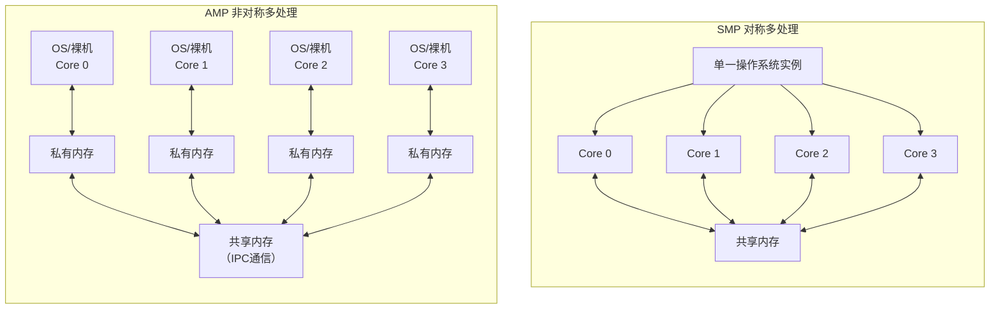
```mermaid
flowchart TB
    subgraph SMP["SMP 对称多处理"]
        direction TB
        OS_SMP["单一操作系统实例"]
        Core0_SMP["Core 0"]
        Core1_SMP["Core 1"]
        Core2_SMP["Core 2"]
        Core3_SMP["Core 3"]
        Mem_SMP["共享内存"]
        
        OS_SMP --> Core0_SMP
        OS_SMP --> Core1_SMP
        OS_SMP --> Core2_SMP
        OS_SMP --> Core3_SMP
        
        Core0_SMP <--> Mem_SMP
        Core1_SMP <--> Mem_SMP
        Core2_SMP <--> Mem_SMP
        Core3_SMP <--> Mem_SMP
    end
    
    subgraph AMP["AMP 非对称多处理"]
        direction TB
        OS0["OS/裸机<br/>Core 0"]
        OS1["OS/裸机<br/>Core 1"]
        OS2["OS/裸机<br/>Core 2"]
        OS3["OS/裸机<br/>Core 3"]
        Mem0["私有内存"]
        Mem1["私有内存"]
        Mem2["私有内存"]
        Mem3["私有内存"]
        SharedMem["共享内存<br/>（IPC通信）"]
        
        OS0 <--> Mem0
        OS1 <--> Mem1
        OS2 <--> Mem2
        OS3 <--> Mem3
        
        Mem0 <--> SharedMem
        Mem1 <--> SharedMem
        Mem2 <--> SharedMem
        Mem3 <--> SharedMem
    end
```

| 特性 | SMP | AMP |
|------|-----|-----|
| **操作系统** | 单一实例，统一调度 | 每核独立系统 |
| **内存模型** | 完全共享，统一地址空间 | 私有+共享，需IPC |
| **负载均衡** | 操作系统自动调度 | 手动分配任务 |
| **开发复杂度** | 中等（需处理同步） | 高（需设计通信协议） |
| **故障隔离** | 差（一个核崩溃可能影响全局） | 好（核间独立） |
| **典型应用** | 通用计算、服务器 | 实时控制、安全关键系统 |

---

### 1.4 缓存一致性：SMP的"心脏"

**问题场景：**

```c
// Core 0 执行
int shared_data = 100;
cache_flush();  // 数据在L1中

// Core 1 执行（稍后）
int local = shared_data;  // 从哪里读？L1？L2？内存？
```

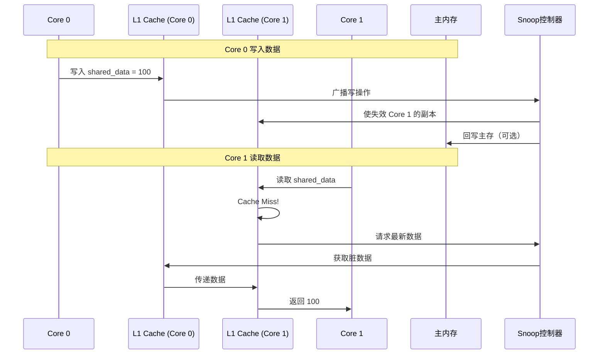
```mermaid
sequenceDiagram
    participant C0 as Core 0
    participant L0 as L1 Cache (Core 0)
    participant L1 as L1 Cache (Core 1)
    participant C1 as Core 1
    participant Mem as 主内存
    participant Snoop as Snoop控制器
    
    Note over C0,Mem: Core 0 写入数据
    C0->>L0: 写入 shared_data = 100
    L0->>Snoop: 广播写操作
    Snoop->>L1: 使失效 Core 1 的副本
    Snoop->>Mem: 回写主存（可选）
    
    Note over C0,Mem: Core 1 读取数据
    C1->>L1: 读取 shared_data
    L1->>L1: Cache Miss!
    L1->>Snoop: 请求最新数据
    Snoop->>L0: 获取脏数据
    L0->>L1: 传递数据
    L1->>C1: 返回 100
```

**MESI协议状态机：**

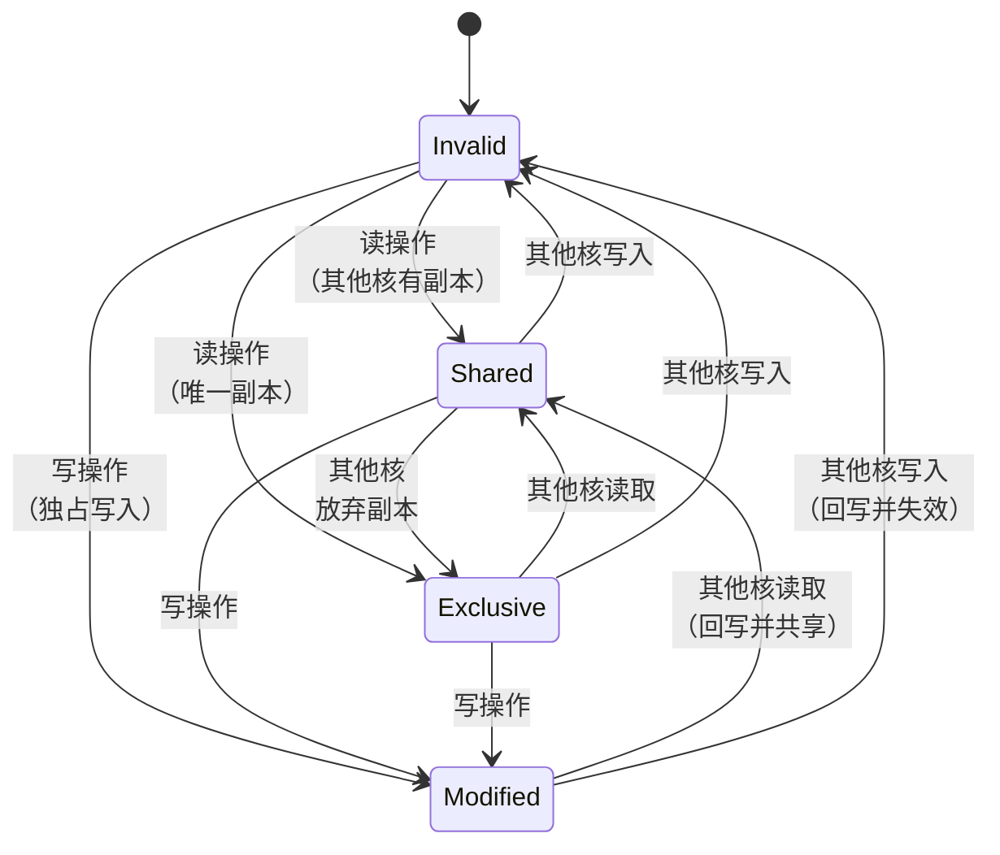
```mermaid
stateDiagram-v2
    [*] --> Invalid
    
    Invalid --> Shared: 读操作<br/>（其他核有副本）
    Invalid --> Exclusive: 读操作<br/>（唯一副本）
    Invalid --> Modified: 写操作<br/>（独占写入）
    
    Shared --> Exclusive: 其他核<br/>放弃副本
    Shared --> Modified: 写操作
    Shared --> Invalid: 其他核写入
    
    Exclusive --> Modified: 写操作
    Exclusive --> Shared: 其他核读取
    Exclusive --> Invalid: 其他核写入
    
    Modified --> Shared: 其他核读取<br/>（回写并共享）
    Modified --> Invalid: 其他核写入<br/>（回写并失效）
```

| 状态 | 含义 | 可读 | 可写 |
|------|------|------|------|
| **M**odified | 已修改，仅本核持有 | ✓ | ✓ |
| **E**xclusive | 独占，未修改 | ✓ | ✓（无总线事务） |
| **S**hared | 共享，未修改 | ✓ | ✗（需总线仲裁） |
| **I**nvalid | 无效 | ✗ | ✗ |

---

## 二、SMP的设计哲学：透明并行，操作系统接管一切

### 2.1 负载均衡：操作系统的核心职责

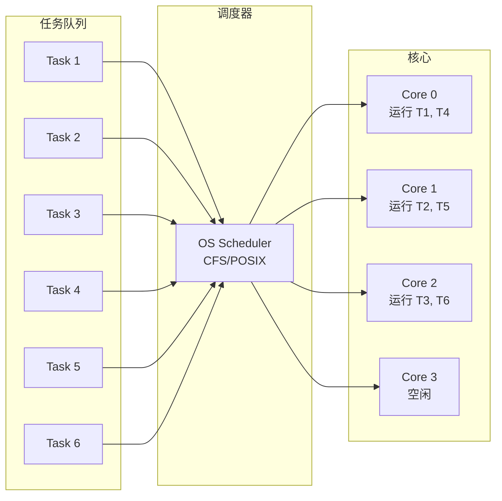
```mermaid
flowchart LR
    subgraph 任务队列
        T1["Task 1"]
        T2["Task 2"]
        T3["Task 3"]
        T4["Task 4"]
        T5["Task 5"]
        T6["Task 6"]
    end
    
    subgraph 调度器
        Sched["OS Scheduler<br/>CFS/POSIX"]
    end
    
    subgraph 核心
        C0["Core 0<br/>运行 T1, T4"]
        C1["Core 1<br/>运行 T2, T5"]
        C2["Core 2<br/>运行 T3, T6"]
        C3["Core 3<br/>空闲"]
    end
    
    T1 --> Sched
    T2 --> Sched
    T3 --> Sched
    T4 --> Sched
    T5 --> Sched
    T6 --> Sched
    
    Sched --> C0
    Sched --> C1
    Sched --> C2
    Sched --> C3
```

**调度策略：**

| 策略 | 原理 | 适用场景 |
|------|------|----------|
| **CFS**（完全公平调度） | 红黑树按虚拟运行时间排序 | 通用Linux |
| **SCHED_FIFO** | 实时优先级队列，不抢占 | 实时任务 |
| **SCHED_RR** | 时间片轮转的实时调度 | 实时任务 |
| **Affinity** | 绑定任务到特定核心 | 缓存亲和性优化 |

---

### 2.2 同步原语：多核协作的"交通规则"

```c
// 自旋锁：忙等待，适用于短临界区
spinlock_t lock;
spin_lock(&lock);
// 临界区代码
spin_unlock(&lock);

// 互斥锁：可睡眠，适用于长临界区
struct mutex mtx;
mutex_lock(&mtx);
// 临界区代码
mutex_unlock(&mtx);

// 原子操作：无锁编程基础
atomic_t counter;
atomic_inc(&counter);  // 原子递增

// 内存屏障：防止指令重排
smp_wmb();  // 写内存屏障
smp_rmb();  // 读内存屏障
smp_mb();   // 全内存屏障
```

**自旋锁 vs 互斥锁：**

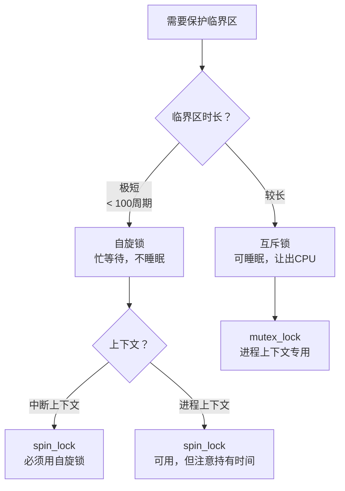
```mermaid
flowchart TD
    A[需要保护临界区] --> B{临界区时长？}
    
    B -->|极短<br/>< 100周期| C["自旋锁<br/>忙等待，不睡眠"]
    B -->|较长| D["互斥锁<br/>可睡眠，让出CPU"]
    
    C --> E{上下文？}
    E -->|中断上下文| F["spin_lock<br/>必须用自旋锁"]
    E -->|进程上下文| G["spin_lock<br/>可用，但注意持有时间"]
    
    D --> H["mutex_lock<br/>进程上下文专用"]
```

---

### 2.3 中断亲和性：中断分发到特定核心

```c
// Linux 设置中断亲和性
// 将中断IRQ 42 绑定到 Core 0 和 Core 1
echo "0-1" > /proc/irq/42/smp_affinity

// 代码中设置
struct cpumask mask;
cpumask_clear(&mask);
cpumask_set_cpu(0, &mask);
cpumask_set_cpu(1, &mask);
irq_set_affinity(42, &mask);
```

**设计考量：**
- **网络中断**：绑定到特定核心，提高缓存命中率
- **磁盘I/O**：分散到多核，避免单核瓶颈
- **实时任务**：独占核心，避免中断干扰

---

## 三、芯片选型：主流SMP处理器对比

### 3.1 SMP处理器分类

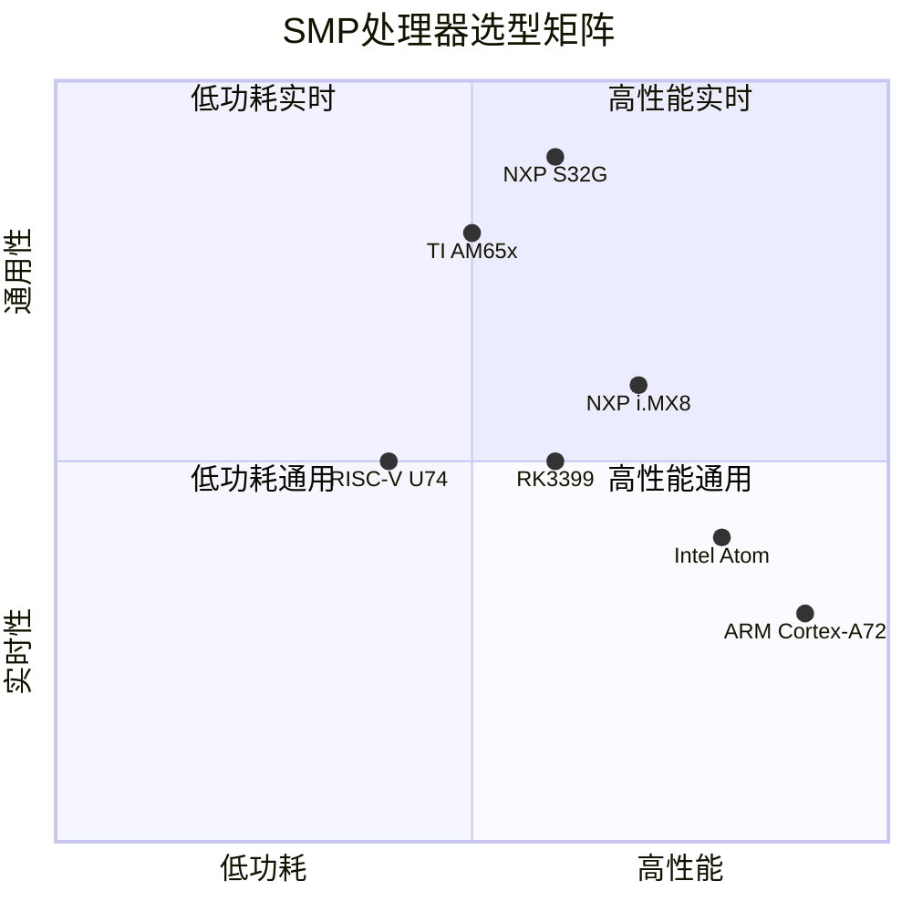
```mermaid
quadrantChart
    title SMP处理器选型矩阵
    x-axis "低功耗" --> "高性能"
    y-axis "实时性" --> "通用性"
    quadrant-1 "高性能实时"
    quadrant-2 "低功耗实时"
    quadrant-3 "低功耗通用"
    quadrant-4 "高性能通用"
    
    "NXP i.MX8": [0.7, 0.6]
    "RK3399": [0.6, 0.5]
    "TI AM65x": [0.5, 0.8]
    "Intel Atom": [0.8, 0.4]
    "ARM Cortex-A72": [0.9, 0.3]
    "RISC-V U74": [0.4, 0.5]
    "NXP S32G": [0.6, 0.9]
```

### 3.2 主流SMP芯片对比

| 芯片 | 架构 | 核心数 | 主频 | 典型应用 | 特点 |
|------|------|--------|------|----------|------|
| **NXP i.MX8QM** | Cortex-A72+A53 | 2+4 | 1.6GHz | 汽车IVI、工业 | 大小核架构 |
| **RK3399** | Cortex-A72+A53 | 2+4 | 1.8GHz | 平板、边缘计算 | 国产化、高性价比 |
| **TI AM6548** | Cortex-A53 | 4 | 1.1GHz | 工业控制 | 集成PRU实时单元 |
| **NXP S32G2** | Cortex-A53 | 4 | 1.0GHz | 汽车网关 | ASIL-D功能安全 |
| **Intel Atom x6000** | x86 Tremont | 4 | 3.0GHz | 工业PC | x86生态兼容 |
| **SiFive U74-MC** | RISC-V U74 | 4 | 1.4GHz | AIoT | 开源架构 |

---

### 3.3 大小核架构：性能与功耗的平衡

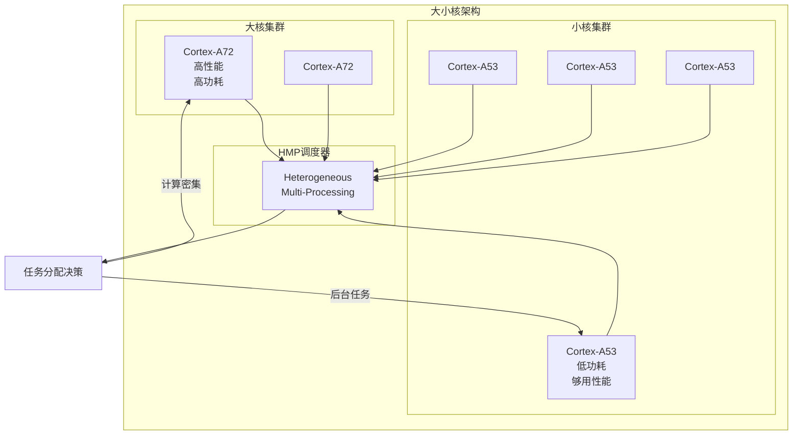
```mermaid
flowchart TB
    subgraph BigLittle["大小核架构"]
        direction TB
        
        subgraph BigCluster["大核集群"]
            Big0["Cortex-A72<br/>高性能<br/>高功耗"]
            Big1["Cortex-A72"]
        end
        
        subgraph LittleCluster["小核集群"]
            Little0["Cortex-A53<br/>低功耗<br/>够用性能"]
            Little1["Cortex-A53"]
            Little2["Cortex-A53"]
            Little3["Cortex-A53"]
        end
        
        subgraph Scheduler["HMP调度器"]
            HMP["Heterogeneous<br/>Multi-Processing"]
        end
    end
    
    Big0 --> HMP
    Big1 --> HMP
    Little0 --> HMP
    Little1 --> HMP
    Little2 --> HMP
    Little3 --> HMP
    
    HMP --> Task["任务分配决策"]
    
    Task -->|"计算密集"| Big0
    Task -->|"后台任务"| Little0
```

**调度策略：**

| 任务类型 | 分配策略 | 原因 |
|----------|----------|------|
| UI渲染 | 大核 | 响应速度优先 |
| 视频编解码 | 大核 | 计算密集 |
| 后台同步 | 小核 | 功耗优先 |
| 音频播放 | 小核 | 计算量小 |
| 游戏 | 大核+小核 | 混合负载 |

---

### 3.4 选型决策树

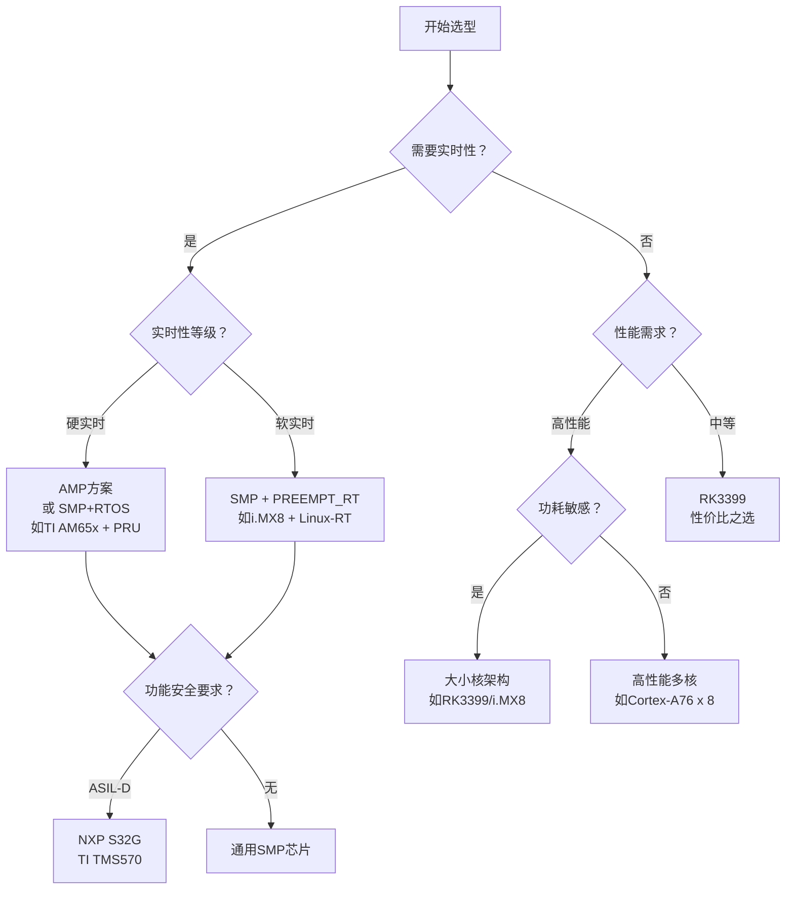
```mermaid
flowchart TD
    A[开始选型] --> B{需要实时性？}
    
    B -->|是| C{实时性等级？}
    B -->|否| D{性能需求？}
    
    C -->|硬实时| E["AMP方案<br/>或 SMP+RTOS<br/>如TI AM65x + PRU"]
    C -->|软实时| F["SMP + PREEMPT_RT<br/>如i.MX8 + Linux-RT"]
    
    D -->|高性能| G{功耗敏感？}
    D -->|中等| H["RK3399<br/>性价比之选"]
    
    G -->|是| I["大小核架构<br/>如RK3399/i.MX8"]
    G -->|否| J["高性能多核<br/>如Cortex-A76 x 8"]
    
    E --> K{功能安全要求？}
    F --> K
    
    K -->|ASIL-D| L["NXP S32G<br/>TI TMS570"]
    K -->|无| M["通用SMP芯片"]
```

---

## 四、嵌入式工程应用：SMP的实际战场

### 4.1 典型应用场景

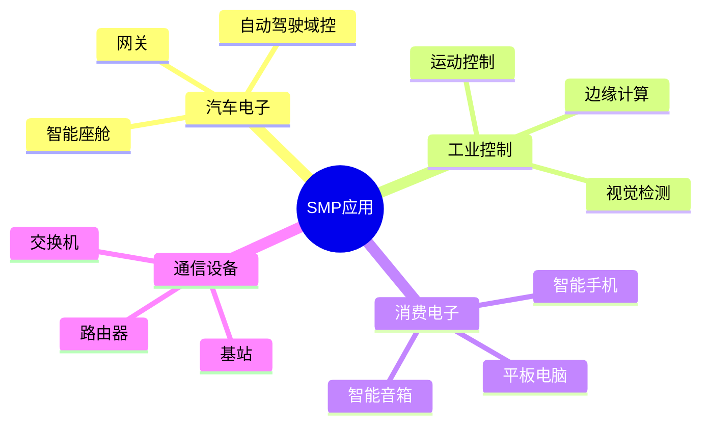
```mermaid
mindmap
  root((SMP应用))
    汽车电子
      智能座舱
      自动驾驶域控
      网关
    工业控制
      运动控制
      视觉检测
      边缘计算
    消费电子
      智能手机
      平板电脑
      智能音箱
    通信设备
      基站
      路由器
      交换机
```

### 4.2 实战案例：汽车智能座舱

```c
// SMP架构下的任务分配
// i.MX8QM: 2x A72 + 4x A53

// 大核 (A72) 任务
void cluster_big_tasks(void) {
    // 绑定到 CPU 0-1
    cpu_set_t cpuset;
    CPU_ZERO(&cpuset);
    CPU_SET(0, &cpuset);
    CPU_SET(1, &cpuset);
    
    // 高负载任务
    pthread_setaffinity_np(ui_thread, sizeof(cpuset), &cpuset);
    pthread_setaffinity_np(navigation_thread, sizeof(cpuset), &cpuset);
    pthread_setaffinity_np(voice_recognition_thread, sizeof(cpuset), &cpuset);
}

// 小核 (A53) 任务
void cluster_little_tasks(void) {
    // 绑定到 CPU 2-5
    cpu_set_t cpuset;
    CPU_ZERO(&cpuset);
    CPU_SET(2, &cpuset);
    CPU_SET(3, &cpuset);
    CPU_SET(4, &cpuset);
    CPU_SET(5, &cpuset);
    
    // 后台任务
    pthread_setaffinity_np(log_thread, sizeof(cpuset), &cpuset);
    pthread_setaffinity_np(ota_thread, sizeof(cpuset), &cpuset);
    pthread_setaffinity_np(diagnostic_thread, sizeof(cpuset), &cpuset);
}
```

---

### 4.3 实战案例：工业视觉检测

```c
// 多核并行图像处理
typedef struct {
    uint8_t *image;
    int start_row;
    int end_row;
    int width;
    int result;
} ImageTask;

void* process_image_region(void *arg) {
    ImageTask *task = (ImageTask *)arg;
    
    // 处理分配的图像区域
    for (int y = task->start_row; y < task->end_row; y++) {
        for (int x = 0; x < task->width; x++) {
            // 边缘检测、滤波等
            process_pixel(&task->image[y * task->width + x]);
        }
    }
    
    return NULL;
}

void parallel_image_process(uint8_t *image, int height, int width) {
    int num_cores = sysconf(_SC_NPROCESSORS_ONLN);
    pthread_t threads[num_cores];
    ImageTask tasks[num_cores];
    
    int rows_per_core = height / num_cores;
    
    for (int i = 0; i < num_cores; i++) {
        tasks[i].image = image;
        tasks[i].start_row = i * rows_per_core;
        tasks[i].end_row = (i == num_cores - 1) ? height : (i + 1) * rows_per_core;
        tasks[i].width = width;
        
        pthread_create(&threads[i], NULL, process_image_region, &tasks[i]);
    }
    
    for (int i = 0; i < num_cores; i++) {
        pthread_join(threads[i], NULL);
    }
}
```

---

## 五、大师的工程建议

### 5.1 SMP开发的核心陷阱

| 陷阱 | 表现 | 根因 | 解决方案 |
|------|------|------|----------|
| **伪共享** | 多核性能反而下降 | 不同核频繁修改同一缓存行 | 对齐到缓存行大小（64字节） |
| **锁竞争** | 核心空转，CPU利用率低 | 锁粒度过粗 | 细粒度锁、RCU、无锁数据结构 |
| **缓存一致性风暴** | 总线带宽耗尽 | 频繁跨核数据访问 | 数据局部性优化、NUMA感知 |
| **优先级反转** | 高优先级任务被阻塞 | 锁被低优先级任务持有 | 优先级继承协议 |
| **负载不均衡** | 部分核心过载 | 调度策略不当 | 手动设置亲和性、cgroups |

---

### 5.2 伪共享问题详解

```c
// 问题代码：伪共享
struct Counter {
    int value;  // 4字节
} __attribute__((packed));

struct Counter counters[4];  // 4个计数器，可能共享缓存行

// 多核各自递增
void increment_counter(int id) {
    counters[id].value++;  // 导致整个缓存行失效
}

// 修复：缓存行对齐
struct Counter {
    int value;
    char padding[60];  // 填充到64字节
} __attribute__((aligned(64)));

// 或使用宏
#define CACHE_LINE_SIZE 64
struct Counter {
    int value;
} __attribute__((aligned(CACHE_LINE_SIZE)));
```

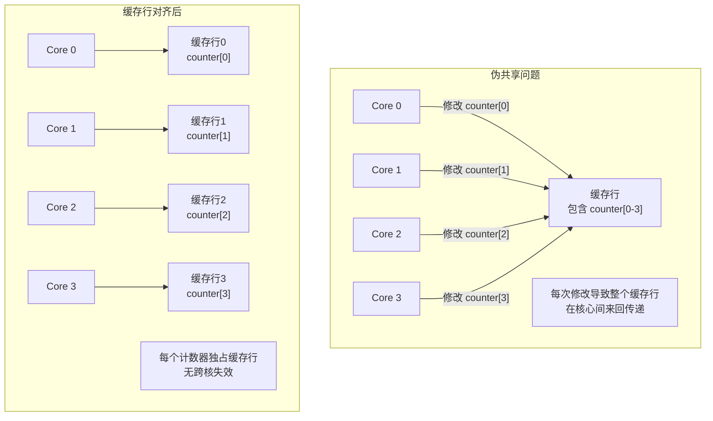
```mermaid
flowchart TB
    subgraph 问题["伪共享问题"]
        direction LR
        C0["Core 0"] -->|"修改 counter[0]"| CL1["缓存行<br/>包含 counter[0-3]"]
        C1["Core 1"] -->|"修改 counter[1]"| CL1
        C2["Core 2"] -->|"修改 counter[2]"| CL1
        C3["Core 3"] -->|"修改 counter[3]"| CL1
        
        Note1["每次修改导致整个缓存行<br/>在核心间来回传递"]
    end
    
    subgraph 修复["缓存行对齐后"]
        direction LR
        C0_["Core 0"] --> CL0_["缓存行0<br/>counter[0]"]
        C1_["Core 1"] --> CL1_["缓存行1<br/>counter[1]"]
        C2_["Core 2"] --> CL2_["缓存行2<br/>counter[2]"]
        C3_["Core 3"] --> CL3_["缓存行3<br/>counter[3]"]
        
        Note2["每个计数器独占缓存行<br/>无跨核失效"]
    end
```

---

### 5.3 无锁编程示例

```c
// 无锁队列（单生产者-单消费者）
typedef struct {
    void *buffer[QUEUE_SIZE];
    volatile uint32_t head;
    volatile uint32_t tail;
} LockFreeQueue;

bool enqueue(LockFreeQueue *q, void *data) {
    uint32_t next_head = (q->head + 1) % QUEUE_SIZE;
    if (next_head == q->tail) {
        return false;  // 队列满
    }
    
    q->buffer[q->head] = data;
    smp_wmb();  // 内存屏障，确保写入顺序
    q->head = next_head;
    
    return true;
}

void* dequeue(LockFreeQueue *q) {
    if (q->tail == q->head) {
        return NULL;  // 队列空
    }
    
    void *data = q->buffer[q->tail];
    smp_rmb();  // 内存屏障
    q->tail = (q->tail + 1) % QUEUE_SIZE;
    
    return data;
}
```

---

### 5.4 学习路径建议

```mermaid
flowchart LR
    A["理论基础<br/>计算机体系结构<br/>并行计算原理"] --> B["操作系统<br/>Linux内核调度<br/>同步原语"]
    B --> C["编程实践<br/>多线程编程<br/>无锁数据结构"]
    C --> D["性能优化<br/>缓存优化<br/>NUMA感知"]
    D --> E["系统设计<br/>负载均衡<br/>容错设计"]
```

---

## 总结

SMP架构的本质是**共享一切、透明并行**：

| 维度 | 核心特点 |
|------|----------|
| **物理架构** | 共享内存、统一编址、缓存一致性协议 |
| **设计哲学** | 操作系统统一调度、负载均衡、透明并行 |
| **开发挑战** | 同步与锁、缓存一致性、伪共享、负载均衡 |
| **选型考量** | 核心数、大小核、实时性需求、功能安全 |

**SMP不是"多个CPU拼在一起"，而是一套完整的并行计算生态系统。**

---

**工程师，你手头有SMP相关的项目吗？是做智能座舱、边缘计算，还是工业控制？我可以针对具体场景给你更深入的架构建议。**
[Timestamp: 2026/04/28 15:33:01]

**user**: 你给我介绍一下MCU架构
[Context: Notes: 嵌入式/芯片/MCU/MCU架构.md]
[Timestamp: 2026/04/28 15:33:53]

**ai**: **工程师你好，MCU（微控制器）是嵌入式开发的基石。从8位到32位，从裸机到RTOS，MCU承载了绝大多数嵌入式应用场景。让我用同样的深度带你系统理解。**

---

## 一、MCU的物理架构：小而全的"瑞士军刀"

### 1.1 核心定位：单芯片解决方案

MCU的本质是**将CPU、存储器、外设集成在单一芯片上**，形成完整的微型计算机系统。

```mermaid
flowchart TB
    subgraph MCU_System["MCU片上系统架构"]
        direction TB
        
        subgraph Core["处理器核心"]
            CPU["CPU核心<br/>Cortex-M0/M3/M4/M7<br/>RISC-V/8051"]
            NVIC["NVIC<br/>嵌套向量中断控制器"]
            SysTick["SysTick<br/>系统定时器"]
            Debug["Debug接口<br/>SWD/JTAG"]
        end
        
        subgraph Memory["存储器系统"]
            Flash[("Flash<br/>程序存储器<br/>64KB~2MB")]
            SRAM[("SRAM<br/>数据存储器<br/>8KB~512KB")]
            EEPROM[("EEPROM<br/>非易失数据<br/>可选")]
        end
        
        subgraph Buses["总线矩阵"]
            ICode["ICode总线<br/>取指"]
            DCode["DCode总线<br/>数据访问"]
            System["System总线<br/>外设访问"]
            AHB["AHB总线<br/>高速外设"]
            APB1["APB1总线<br/>低速外设"]
            APB2["APB2总线<br/>高速外设"]
        end
        
        subgraph Peripherals["外设集群"]
            direction LR
            GPIO["GPIO"]
            UART["UART/USART"]
            SPI["SPI"]
            I2C["I2C"]
            CAN["CAN"]
            USB["USB"]
            ETH["Ethernet"]
            ADC["ADC"]
            DAC["DAC"]
            TIM["Timer/PWM"]
            DMA["DMA控制器"]
            RTC["RTC"]
            WDT["看门狗"]
        end
        
        subgraph ClockPower["时钟与电源"]
            PLL["PLL<br/>锁相环"]
            OSC["振荡器<br/>HSE/LSE/HSI/LSI"]
            PWR["电源管理<br/>LDO/DCDC"]
            LPM["低功耗模式<br/>Sleep/Stop/Standby"]
        end
    end
    
    CPU <--> ICode
    CPU <--> DCode
    CPU <--> System
    
    ICode <--> Flash
    DCode <--> Flash
    DCode <--> SRAM
    
    System <--> AHB
    AHB <--> APB1
    AHB <--> APB2
    
    AHB <--> DMA
    AHB <--> ETH
    AHB <--> USB
    
    APB1 <--> UART
    APB1 <--> SPI
    APB1 <--> I2C
    APB1 <--> CAN
    APB1 <--> TIM
    APB1 <--> RTC
    APB1 <--> WDT
    
    APB2 <--> GPIO
    APB2 <--> ADC
    APB2 <--> DAC
    
    PLL <--> OSC
    PLL <--> CPU
    PWR <--> LPM
```

---

### 1.2 MCU vs MPU vs DSP：定位差异

```mermaid
flowchart LR
    subgraph 定位对比
        direction TB
        
        MCU["MCU<br/>微控制器<br/>单芯片集成<br/>低功耗实时控制"]
        MPU["MPU<br/>微处理器<br/>外扩存储器<br/>高性能计算"]
        DSP["DSP<br/>数字信号处理器<br/>专用运算单元<br/>信号处理"]
    end
    
    MCU --> |"应用场景"| MCU_App["家电控制<br/>工业控制<br/>汽车电子<br/>物联网"]
    MPU --> |"应用场景"| MPU_App["智能手机<br/>平板电脑<br/>服务器<br/>边缘计算"]
    DSP --> |"应用场景"| DSP_App["音频处理<br/>电机控制<br/>通信系统<br/>图像处理"]
```

| 特性 | MCU | MPU | DSP |
|------|-----|-----|-----|
| **存储器** | 片上Flash+SRAM | 外扩DDR | 片上/外扩混合 |
| **主频** | 48MHz~480MHz | 800MHz~3GHz | 100MHz~1GHz |
| **功耗** | μW~mW级 | W级 | mW~W级 |
| **实时性** | 确定性响应 | 依赖OS调度 | 确定性+高吞吐 |
| **开发模式** | 裸机/RTOS | Linux/Android | 专用SDK |
| **典型应用** | 控制类 | 计算类 | 信号处理类 |

---

### 1.3 总线架构：MCU的"血管系统"

```mermaid
flowchart TB
    subgraph STM32F4_Bus["STM32F4 总线矩阵示例"]
        direction TB
        
        subgraph Masters["主设备"]
            CPU_M["Cortex-M4"]
            DMA1_M["DMA1"]
            DMA2_M["DMA2"]
            ETH_M["Ethernet DMA"]
        end
        
        subgraph Matrix["总线矩阵<br/>Arbiter仲裁"]
            Arbiter["多主仲裁<br/>Round-Robin/Fixed"]
        end
        
        subgraph Slaves["从设备"]
            Flash_S[("Flash")]
            SRAM1_S[("SRAM1")]
            SRAM2_S[("SRAM2")]
            AHB_S["AHB外设"]
            APB_S["APB外设"]
        end
    end
    
    CPU_M --> Arbiter
    DMA1_M --> Arbiter
    DMA2_M --> Arbiter
    ETH_M --> Arbiter
    
    Arbiter --> Flash_S
    Arbiter --> SRAM1_S
    Arbiter --> SRAM2_S
    Arbiter --> AHB_S
    Arbiter --> APB_S
```

**总线层级：**

| 总线 | 速率 | 典型外设 |
|------|------|----------|
| **AHB** | 高速（与CPU同频） | DMA、ETH、USB、Flash控制器 |
| **APB2** | 中速（AHB/2） | GPIO、ADC、TIM高级定时器 |
| **APB1** | 低速（AHB/4） | UART、I2C、SPI、CAN、TIM通用定时器 |

---

### 1.4 存储器布局：MCU的"地图"

```mermaid
block-beta
    columns 1
    
    block:mem["STM32F4 存储器映射 (32位地址空间)"]
        columns 1
        
        block:code["代码区 (0x0000_0000 - 0x1FFF_FFFF)"]
            columns 1
            A["Flash (0x0800_0000)<br/>程序代码 + 常量"]
            B["System Memory (0x1FFF_0000)<br/>Bootloader"]
        end
        
        block:sram["SRAM区 (0x2000_0000 - 0x3FFF_FFFF)"]
            columns 1
            C["SRAM1/2/3<br/>数据 + 堆栈"]
            D["CCM RAM (0x1000_0000)<br/>Core Coupled Memory<br/>DMA不可访问"]
        end
        
        block:periph["外设区 (0x4000_0000 - 0x5FFF_FFFF)"]
            columns 1
            E["APB1外设"]
            F["APB2外设"]
            G["AHB外设"]
        end
        
        block:sys["系统区 (0xE000_0000 - 0xFFFF_FFFF)"]
            columns 1
            H["PPB (Private Peripheral Bus)<br/>NVIC, SysTick, SCB"]
        end
    end
```

**关键地址区域：**

| 区域 | 起始地址 | 用途 | 特点 |
|------|----------|------|------|
| **Flash** | 0x0800_0000 | 程序代码 | 非易失，可擦写 |
| **SRAM** | 0x2000_0000 | 运行数据 | 易失，零等待 |
| **CCM** | 0x1000_0000 | 核心专用数据 | 无DMA，零等待 |
| **外设** | 0x4000_0000 | 寄存器映射 | 位带操作支持 |
| **PPB** | 0xE000_0000 | 内核寄存器 | 仅CPU可访问 |

---

## 二、MCU的设计哲学：确定性、实时性、低功耗

### 2.1 确定性响应：中断延迟可预测

```mermaid
sequenceDiagram
    participant Ext as 外部事件
    participant NVIC as NVIC
    participant CPU as CPU核心
    participant ISR as 中断服务程序
    
    Note over Ext,ISR: MCU中断响应流程
    
    Ext->>NVIC: 触发中断请求
    NVIC->>NVIC: 优先级仲裁<br/>(硬件自动完成)
    NVIC->>CPU: 发送中断信号
    
    Note over CPU: 12周期延迟<br/>(Cortex-M4典型值)
    
    CPU->>CPU: 完成当前指令<br/>压栈保存现场
    CPU->>NVIC: 读取中断向量
    NVIC->>ISR: 跳转到ISR入口
    
    ISR->>ISR: 执行中断处理
    ISR->>CPU: 返回指令
    CPU->>CPU: 出栈恢复现场
    CPU->>Ext: 继续原任务
```

**Cortex-M系列中断延迟：**

| 核心 | 最小延迟 | 典型延迟 | 特点 |
|------|----------|----------|------|
| Cortex-M0 | 16周期 | 16-20周期 | 简单设计 |
| Cortex-M3 | 12周期 | 12-16周期 | 优化流水线 |
| Cortex-M4 | 12周期 | 12-16周期 | 同M3+DSP |
| Cortex-M7 | 12周期 | 12-16周期 | 双发射+Cache |

**对比MPU（Linux）：**
- 典型中断延迟：**数十微秒到毫秒级**
- 原因：调度器延迟、关中断区域、Cache未命中

---

### 2.2 低功耗设计：电池供电的核心诉求

```mermaid
stateDiagram-v2
    [*] --> Run
    
    Run --> Sleep: WFI/WFE<br/>CPU停止<br/>外设运行
    Sleep --> Run: 中断唤醒
    
    Run --> Stop: 深度睡眠<br/>时钟停止<br/>SRAM保持
    Stop --> Run: EXTI唤醒
    
    Run --> Standby: 最低功耗<br/>仅保持备份域
    Standby --> Run: 复位/WKUP引脚
    
    note right of Run : 全速运行<br/>功耗最高
    note right of Sleep : CPU休眠<br/>外设工作
    note right of Stop : 深度休眠<br/>快速唤醒
    note right of Standby : 接近断电<br/>唤醒需复位
```

**功耗对比（STM32L4为例）：**

| 模式 | 典型功耗 | 唤醒时间 | 保持状态 |
|------|----------|----------|----------|
| **Run** | 100μA/MHz | - | 全部 |
| **Sleep** | 1.2mA | 7周期 | 全部 |
| **Stop2** | 1.5μA | 5μs | SRAM+寄存器 |
| **Standby** | 0.4μA | 50ms | 仅备份域 |

---

### 2.3 外设集成：单芯片解决方案

```c
// MCU外设初始化典型流程
void MCU_Init(void) {
    // 1. 时钟配置
    RCC_Config();       // PLL配置，系统时钟
    
    // 2. GPIO配置
    GPIO_Config();      // 引脚复用、上下拉
    
    // 3. 外设配置
    UART_Init();        // 串口通信
    SPI_Init();         // SPI外设
    I2C_Init();         // I2C外设
    TIM_Init();         // 定时器
    ADC_Init();         // 模数转换
    
    // 4. 中断配置
    NVIC_Config();      // 优先级设置
    
    // 5. DMA配置
    DMA_Config();       // 数据搬运
}
```

**集成优势：**

| 方案 | BOM成本 | PCB面积 | 可靠性 | 开发周期 |
|------|---------|---------|--------|----------|
| MCU集成 | 低 | 小 | 高 | 短 |
| MPU+外扩 | 高 | 大 | 中 | 长 |

---

## 三、芯片选型：主流MCU对比

### 3.1 MCU架构分类

```mermaid
quadrantChart
    title MCU选型矩阵
    x-axis "低成本" --> "高性能"
    y-axis "低功耗" --> "高性能"
    quadrant-1 "高性能高功耗"
    quadrant-2 "低功耗高性能"
    quadrant-3 "低功耗低成本"
    quadrant-4 "高性能低成本"
    
    "STM32F1": [0.4, 0.4]
    "STM32F4": [0.7, 0.6]
    "STM32H7": [0.9, 0.85]
    "STM32L4": [0.5, 0.3]
    "ESP32": [0.6, 0.5]
    "NXP LPC": [0.5, 0.45]
    "GD32": [0.3, 0.35]
    "CH32": [0.2, 0.3]
    "TI MSP430": [0.35, 0.2]
    "Nordic nRF52": [0.55, 0.25]
    "Raspberry Pi Pico": [0.35, 0.5]
    "Infineon XMC": [0.5, 0.55]
```

### 3.2 主流MCU厂商与系列

| 厂商 | 系列 | 核心 | 主频 | 特点 | 典型应用 |
|------|------|------|------|------|----------|
| **ST** | STM32F0/F1 | Cortex-M0/M3 | 48-72MHz | 性价比高，生态完善 | 工业控制、消费电子 |
| **ST** | STM32F4 | Cortex-M4F | 168MHz | DSP指令，丰富外设 | 电机控制、音频 |
| **ST** | STM32H7 | Cortex-M7 | 480MHz | 双核，高性能 | 工业网关、图像处理 |
| **ST** | STM32L4 | Cortex-M4F | 80MHz | 超低功耗 | 电池设备、IoT |
| **Espressif** | ESP32 | Xtensa双核 | 240MHz | WiFi+BLE集成 | 智能家居、IoT |
| **NXP** | LPC系列 | Cortex-M0/M3/M4 | 50-150MHz | 汽车级认证 | 汽车电子 |
| **GigaDevice** | GD32 | Cortex-M3/M4 | 108-240MHz | 国产替代，高性价比 | 工业控制 |
| **WCH** | CH32 | RISC-V/ARM | 48-144MHz | 超低成本 | 消费电子 |
| **TI** | MSP430 | 16位 proprietary | 25MHz | 超低功耗 | 仪表、传感器 |
| **Nordic** | nRF52 | Cortex-M4F | 64MHz | BLE优化 | 可穿戴设备 |

---

### 3.3 选型决策树

```mermaid
flowchart TD
    A[开始选型] --> B{需要联网？}
    
    B -->|WiFi/BLE| C{性能需求？}
    B -->|无需联网| D{实时性要求？}
    
    C -->|高性能| E["ESP32-S3<br/>双核240MHz<br/>WiFi+BLE"]
    C -->|低功耗| F["nRF52系列<br/>BLE优化<br/>超低功耗"]
    C -->|平衡| G["ESP32-C3<br/>RISC-V<br/>WiFi+BLE"]
    
    D -->|硬实时| H{功能安全？}
    D -->|一般| I{成本敏感？}
    
    H -->|ASIL-D| J["NXP S32K<br/>Infineon Aurix"]
    H -->|无| K["STM32F4/H7<br/>GD32F4"]
    
    I -->|极度敏感| L["CH32系列<br/>GD32F1"]
    I -->|一般| M["STM32F1/F4<br/>LPC系列"]
    
    E --> N{功耗敏感？}
    F --> N
    G --> N
    J --> N
    K --> N
    L --> N
    M --> N
    
    N -->|是| O["选择L系列<br/>如STM32L4/MSP430"]
    N -->|否| P["选择F系列<br/>如STM32F4/H7"]
```

---

### 3.4 国产替代方案

| 原厂型号 | 国产替代 | 兼容性 | 优势 | 注意事项 |
|----------|----------|--------|------|----------|
| STM32F103 | GD32F103 | 引脚/寄存器兼容 | 主频更高(108MHz) | ADC性能略差 |
| STM32F103 | CH32F103 | 引脚兼容 | 成本极低 | 外设数量减少 |
| STM32F407 | GD32F407 | 引脚/寄存器兼容 | 主频更高(168MHz) | 功耗略高 |
| STM32F4 | APM32F4 | 引脚兼容 | 工业级温度范围 | 生态较小 |
| ESP32 | ESP32-C3/S3 | 软件兼容 | RISC-V架构 | 外设差异 |

---

## 四、嵌入式工程应用：MCU的实际战场

### 4.1 典型应用场景

```mermaid
mindmap
  root((MCU应用))
    消费电子
      家电控制
      玩具
      遥控器
    工业控制
      PLC
      变频器
      传感器
    汽车电子
      车身控制
      座椅调节
      车窗升降
    物联网
      智能家居
      可穿戴
      环境监测
    医疗设备
      血糖仪
      体温计
      输液泵
```

### 4.2 实战案例：工业控制器

```c
// MCU工业控制器架构
typedef struct {
    // 输入处理
    void (*input_scan)(void);      // DI扫描
    void (*adc_sample)(void);       // AI采样
    
    // 控制逻辑
    void (*control_logic)(void);    // PLC逻辑
    
    // 输出处理
    void (*output_update)(void);    // DO更新
    void (*pwm_output)(void);       // PWM输出
    
    // 通信
    void (*modbus_process)(void);   // Modbus协议
    void (*can_process)(void);      // CAN通信
    
} IndustrialController;

// 主循环架构
void main_loop(void) {
    while (1) {
        // 1. 输入扫描（确定性时序）
        input_scan();       // ~100μs
        
        // 2. ADC采样（DMA自动搬运）
        adc_sample();       // ~50μs
        
        // 3. 控制逻辑运算
        control_logic();    // ~500μs
        
        // 4. 输出更新
        output_update();    // ~50μs
        pwm_output();       // 硬件自动
        
        // 5. 通信处理（空闲时）
        if (modbus_request) {
            modbus_process();
        }
        
        // 6. 看门狗喂狗
        WDT_Feed();
        
        // 7. 周期等待（硬件定时器）
        wait_for_cycle(10); // 10ms周期
    }
}
```

---

### 4.3 实战案例：物联网节点

```c
// 低功耗IoT节点架构
void iot_node_task(void) {
    // 初始化
    sensors_init();
    radio_init();
    
    while (1) {
        // 1. 传感器采集
        float temp = read_temperature();
        float humi = read_humidity();
        
        // 2. 数据打包
        uint8_t payload[16];
        pack_sensor_data(payload, temp, humi);
        
        // 3. 无线发送
        radio_send(payload, sizeof(payload));
        
        // 4. 等待ACK
        if (radio_wait_ack(100)) {
            led_blink(1);  // 发送成功
        }
        
        // 5. 进入低功耗
        enter_stop_mode();
        
        // 6. RTC定时唤醒（如每5分钟）
        // ... 睡眠中 ...
        
        // 7. 唤醒后继续
    }
}

// 功耗分析
// - 活动态: 10mA × 100ms = 1mAh
// - 睡眠态: 2μA × 299.9s = 0.0017mAh
// - 平均功耗: (1 + 0.0017) / 300 ≈ 3.4μA
// - 电池寿命(1000mAh): 1000 / 0.0034 / 24 / 365 ≈ 33年
```

---

## 五、大师的工程建议

### 5.1 MCU开发核心陷阱

| 陷阱 | 表现 | 根因 | 解决方案 |
|------|------|------|----------|
| **栈溢出** | 随机崩溃、HardFault | 局部变量过大/递归过深 | 增大栈空间、使用静态分配 |
| **中断优先级反转** | 高优先级响应慢 | 低优先级占用资源 | 合理设置优先级组 |
| **DMA配置错误** | 数据错乱 | 地址对齐/缓存一致性问题 | 使用`__attribute__((aligned))` |
| **时钟配置错误** | 外设不工作 | 总线时钟未使能 | 检查RCC时钟树 |
| **Flash擦写失败** | 数据丢失 | 擦写时中断干扰 | 擦写前关中断 |
| **看门狗超时** | 系统复位 | 循环时间过长 | 优化代码/分片处理 |

---

### 5.2 时钟树配置详解

```mermaid
flowchart TB
    subgraph ClockTree["STM32时钟树"]
        direction TB
        
        HSE["HSE<br/>外部晶振<br/>8-25MHz"]
        HSI["HSI<br/>内部RC<br/>16MHz"]
        LSE["LSE<br/>外部32.768kHz<br/>RTC专用"]
        LSI["LSI<br/>内部32kHz<br/>看门狗专用"]
        
        HSE --> PLL["PLL<br/>锁相环"]
        HSI --> PLL
        
        PLL --> SYSCLK["SYSCLK<br/>系统时钟<br/>最高168MHz(F4)"]
        
        SYSCLK --> AHB["AHB<br/>HCLK<br/>最高168MHz"]
        AHB --> APB1["APB1<br/>PCLK1<br/>最高42MHz"]
        AHB --> APB2["APB2<br/>PCLK2<br/>最高84MHz"]
        
        APB1 --> TIM1["TIMx<br/>定时器时钟"]
        APB2 --> TIM2["TIMx<br/>定时器时钟"]
        
        AHB --> AHB_Periph["AHB外设<br/>DMA/ETH/USB"]
        APB1 --> APB1_Periph["APB1外设<br/>UART/I2C/SPI"]
        APB2 --> APB2_Periph["APB2外设<br/>GPIO/ADC"]
    end
```

**时钟配置要点：**

```c
// STM32F4 时钟配置示例
void SystemClock_Config(void) {
    RCC_OscInitTypeDef RCC_OscInitStruct = {0};
    RCC_ClkInitTypeDef RCC_ClkInitStruct = {0};
    
    // 1. 配置PLL
    RCC_OscInitStruct.OscillatorType = RCC_OSCILLATORTYPE_HSE;
    RCC_OscInitStruct.HSEState = RCC_HSE_ON;
    RCC_OscInitStruct.PLL.PLLState = RCC_PLL_ON;
    RCC_OscInitStruct.PLL.PLLSource = RCC_PLLSOURCE_HSE;
    RCC_OscInitStruct.PLL.PLLM = 8;     // HSE/8 = 1MHz
    RCC_OscInitStruct.PLL.PLLN = 336;   // 1MHz × 336 = 336MHz
    RCC_OscInitStruct.PLL.PLLP = 2;     // 336/2 = 168MHz (SYSCLK)
    RCC_OscInitStruct.PLL.PLLQ = 7;     // 336/7 = 48MHz (USB)
    HAL_RCC_OscConfig(&RCC_OscInitStruct);
    
    // 2. 配置总线分频
    RCC_ClkInitStruct.ClockType = RCC_CLOCKTYPE_HCLK | 
                                   RCC_CLOCKTYPE_SYSCLK |
                                   RCC_CLOCKTYPE_PCLK1 | 
                                   RCC_CLOCKTYPE_PCLK2;
    RCC_ClkInitStruct.SYSCLKSource = RCC_SYSCLKSOURCE_PLLCLK;
    RCC_ClkInitStruct.AHBCLKDivider = RCC_SYSCLK_DIV1;   // 168MHz
    RCC_ClkInitStruct.APB1CLKDivider = RCC_HCLK_DIV4;    // 42MHz
    RCC_ClkInitStruct.APB2CLKDivider = RCC_HCLK_DIV2;    // 84MHz
    HAL_RCC_ClockConfig(&RCC_ClkInitStruct, FLASH_LATENCY_5);
}
```

---

### 5.3 内存分区优化

```c
// 链接脚本内存分区
MEMORY {
    FLASH (rx)  : ORIGIN = 0x08000000, LENGTH = 512K
    SRAM1 (rwx) : ORIGIN = 0x20000000, LENGTH = 96K
    SRAM2 (rwx) : ORIGIN = 0x20018000, LENGTH = 16K
    CCM   (rwx) : ORIGIN = 0x10000000, LENGTH = 64K
}

// 代码中指定变量位置
__attribute__((section(".ccm"))) uint8_t dma_buffer[1024];  // CCM中
__attribute__((section(".sram2"))) uint8_t backup_data[256]; // SRAM2中

// 栈和堆的配置
_stack_size = 0x2000;   // 8KB栈
_heap_size = 0x4000;    // 16KB堆
```

---

### 5.4 学习路径建议

```mermaid
flowchart LR
    A["基础入门<br/>GPIO/UART/定时器<br/>中断机制"] --> B["外设进阶<br/>SPI/I2C/ADC/DMA<br/>PWM/CAN"]
    B --> C["系统架构<br/>时钟树/总线矩阵<br/>存储器映射"]
    C --> D["RTOS应用<br/>FreeRTOS/RT-Thread<br/>任务/信号量/队列"]
    D --> E["高级主题<br/>低功耗设计<br/>Bootloader/OTA<br/>功能安全"]
```

---

## 总结

MCU架构的本质是**单芯片集成、确定性响应、低功耗设计**：

| 维度 | 核心特点 |
|------|----------|
| **物理架构** | CPU+存储器+外设集成，总线矩阵互联 |
| **设计哲学** | 确定性中断响应、低功耗模式、丰富外设 |
| **开发模式** | 裸机轮询或RTOS调度，直接硬件操作 |
| **选型考量** | 性能/功耗/成本平衡，生态与工具链 |

**MCU不是"低性能的CPU"，而是为控制类应用优化的完整系统。**

---

**工程师，你手头有MCU相关的项目吗？是做工业控制、物联网节点，还是消费电子？我可以针对具体场景给你更深入的架构建议。**
[Timestamp: 2026/04/28 15:36:35]

**user**: 以上述的要求给我讲一下AMP架构
[Context: Notes: 嵌入式/芯片/AMP/AMP架构.md]
[Timestamp: 2026/04/28 15:43:42]

**ai**: **工程师你好，AMP（非对称多处理）架构是多核系统中实现"隔离与协同"的关键技术。在功能安全、实时控制、异构计算领域，AMP是不可替代的方案。让我用同样的深度带你系统理解。**

---

## 一、AMP的物理架构：独立王国，按需结盟

### 1.1 核心矛盾：SMP的局限性

SMP架构面临的挑战：

```mermaid
flowchart TB
    subgraph SMP问题
        A["单一OS崩溃"] --> B["全系统瘫痪"]
        C["实时任务被抢占"] --> D["响应时间不可控"]
        E["共享资源竞争"] --> F["锁开销随核心数增加"]
        G["安全认证"] --> H["全系统需达到最高等级"]
    end
```

**AMP的解决思路：分而治之，各司其职**

```mermaid
flowchart LR
    subgraph AMP方案
        A["核心隔离"] --> B["故障不扩散"]
        C["独立调度"] --> D["实时性保证"]
        E["私有资源"] --> F["无锁竞争"]
        G["分区认证"] --> H["降低认证成本"]
    end
```

---

### 1.2 AMP的物理布局：独立内存空间 + 共享通信区

```mermaid
flowchart TB
    subgraph AMP_System["AMP系统架构"]
        direction TB
        
        subgraph Core0_Cluster["核心0集群"]
            Core0["CPU Core 0<br/>Cortex-A53"]
            L1_0["L1 Cache"]
            OS0["Linux<br/>通用操作系统"]
            Mem0[("私有内存<br/>DDR Region 0<br/>256MB")]
        end
        
        subgraph Core1_Cluster["核心1集群"]
            Core1["CPU Core 1<br/>Cortex-R5"]
            L1_1["L1 Cache"]
            OS1["RTOS/裸机<br/>实时系统"]
            Mem1[("私有内存<br/>DDR Region 1<br/>64MB")]
        end
        
        subgraph Core2_Cluster["核心2集群"]
            Core2["CPU Core 2<br/>DSP"]
            L2_2["L2 Cache"]
            OS2["DSP BIOS<br/>信号处理"]
            Mem2[("私有内存<br/>DDR Region 2<br/>128MB")]
        end
        
        subgraph SharedRegion["共享资源区"]
            SharedMem[("共享内存<br/>IPC通信缓冲<br/>16MB")]
            Hypervisor["Hypervisor<br/>可选：分区管理"]
            InterConnect["互连架构<br/>AXI/NoC"]
        end
        
        subgraph Peripherals["外设分区"]
            Periph0["外设组0<br/>分配给Core0"]
            Periph1["外设组1<br/>分配给Core1"]
            Periph2["外设组2<br/>分配给Core2"]
        end
    end
    
    Core0 <--> L1_0
    Core1 <--> L1_1
    Core2 <--> L2_2
    
    L1_0 <--> Mem0
    L1_1 <--> Mem1
    L2_2 <--> Mem2
    
    Mem0 <--> SharedMem
    Mem1 <--> SharedMem
    Mem2 <--> SharedMem
    
    Core0 <--> InterConnect
    Core1 <--> InterConnect
    Core2 <--> InterConnect
    
    InterConnect <--> Periph0
    InterConnect <--> Periph1
    InterConnect <--> Periph2
```

---

### 1.3 AMP vs SMP vs BMP：多核架构全景

```mermaid
flowchart TB
    subgraph SMP["SMP 对称多处理"]
        direction TB
        S_OS["单一OS实例"]
        S_C0["Core 0"] --> S_Mem["共享内存"]
        S_C1["Core 1"] --> S_Mem
        S_C2["Core 2"] --> S_Mem
        S_C3["Core 3"] --> S_Mem
        S_OS --> S_C0
        S_OS --> S_C1
        S_OS --> S_C2
        S_OS --> S_C3
    end
    
    subgraph AMP["AMP 非对称多处理"]
        direction TB
        A_OS0["Linux"] --> A_C0["Core 0"]
        A_OS1["RTOS"] --> A_C1["Core 1"]
        A_OS2["裸机"] --> A_C2["Core 2"]
        A_OS3["DSP BIOS"] --> A_C3["Core 3"]
        
        A_C0 --> A_M0["私有内存"]
        A_C1 --> A_M1["私有内存"]
        A_C2 --> A_M2["私有内存"]
        A_C3 --> A_M3["私有内存"]
        
        A_M0 <--> A_SM["共享内存IPC"]
        A_M1 <--> A_SM
        A_M2 <--> A_SM
        A_M3 <--> A_SM
    end
    
    subgraph BMP["绑定多处理"]
        direction TB
        B_OS["单一OS实例"]
        B_C0["Core 0<br/>任务A绑定"]
        B_C1["Core 1<br/>任务B绑定"]
        B_C2["Core 2<br/>任务C绑定"]
        B_C3["Core 3<br/>任务D绑定"]
        
        B_OS --> B_C0
        B_OS --> B_C1
        B_OS --> B_C2
        B_OS --> B_C3
        
        B_C0 <--> B_Mem["共享内存"]
        B_C1 <--> B_Mem
        B_C2 <--> B_Mem
        B_C3 <--> B_Mem
    end
```

| 特性 | SMP | AMP | BMP |
|------|-----|-----|-----|
| **操作系统** | 单一实例 | 每核独立 | 单一实例 |
| **内存模型** | 完全共享 | 私有+共享 | 完全共享 |
| **任务调度** | 全局调度 | 各核独立 | 绑定调度 |
| **故障隔离** | 差 | 好 | 中 |
| **开发复杂度** | 中 | 高 | 中 |
| **实时性** | 依赖OS | 可保证 | 可保证 |
| **典型场景** | 通用计算 | 安全关键系统 | 实时控制 |

---

### 1.4 内存分区：AMP的核心设计

```mermaid
block-beta
    columns 1
    
    block:mem["AMP内存分区布局 (DDR地址空间)"]
        columns 1
        
        block:core0["Core 0 区域 (0x0000_0000 - 0x0FFF_FFFF)"]
            columns 1
            A["代码段 .text"]
            B["数据段 .data/.bss"]
            C["堆区 Heap"]
            D["栈区 Stack"]
        end
        
        block:core1["Core 1 区域 (0x1000_0000 - 0x13FF_FFFF)"]
            columns 1
            E["代码段 .text"]
            F["数据段 .data/.bss"]
            G["堆区 Heap"]
            H["栈区 Stack"]
        end
        
        block:shared["共享区域 (0x1F00_0000 - 0x1FFF_FFFF)"]
            columns 1
            I["IPC控制块"]
            J["数据缓冲区"]
            K["环形队列"]
        end
    end
```

**链接脚本示例：**

```c
// Core 0 链接脚本
MEMORY {
    CODE  (rx)  : ORIGIN = 0x00000000, LENGTH = 128M
    DATA  (rwx) : ORIGIN = 0x08000000, LENGTH = 128M
    SHARED(rwx) : ORIGIN = 0x1F000000, LENGTH = 16M
}

// Core 1 链接脚本
MEMORY {
    CODE  (rx)  : ORIGIN = 0x10000000, LENGTH = 32M
    DATA  (rwx) : ORIGIN = 0x12000000, LENGTH = 32M
    SHARED(rwx) : ORIGIN = 0x1F000000, LENGTH = 16M  // 相同共享区
}
```

---

## 二、AMP的设计哲学：隔离、确定性、异构协同

### 2.1 故障隔离：安全关键系统的基石

```mermaid
sequenceDiagram
    participant C0 as Core 0 (Linux)
    participant C1 as Core 1 (RTOS)
    participant SM as 共享内存
    participant WD as 看门狗
    
    Note over C0,WD: 正常运行
    
    C0->>SM: 发送控制命令
    C1->>SM: 读取命令
    C1->>C1: 执行实时控制
    C1->>SM: 写入状态数据
    C0->>SM: 读取状态
    
    Note over C0,WD: Core 0 Linux崩溃
    
    C0->>C0: Kernel Panic!
    
    Note over C1: Core 1 继续运行<br/>不受影响
    
    C1->>C1: 继续执行控制逻辑
    C1->>WD: 喂狗（独立看门狗）
    
    Note over C0,WD: Core 0 重启恢复
    
    C0->>C0: 重启Linux
    C0->>SM: 重新建立通信
    C1->>SM: 恢复数据交换
```

**功能安全等级分区：**

| 核心 | 运行系统 | 安全等级 | 功能 |
|------|----------|----------|------|
| Core 0 | Linux | QM (无要求) | HMI、日志、网络 |
| Core 1 | RTOS | ASIL-B | 通信网关 |
| Core 2 | 裸机 | ASIL-D | 电机控制 |
| Core 3 | 安全监控 | ASIL-D | 看门狗、诊断 |

---

### 2.2 IPC通信：核心间的"外交协议"

```mermaid
flowchart TB
    subgraph IPC机制
        direction TB
        
        subgraph 共享内存
            SM["共享内存区域"]
            RingBuffer["环形缓冲区"]
            Mailbox["邮箱机制"]
        end
        
        subgraph 中断通知
            SGI["SGI 软件中断<br/>核间中断"]
            Doorbell["Doorbell<br/>门铃机制"]
            Semaphore["硬件信号量"]
        end
        
        subgraph 协议层
            RPMsg["RPMsg<br/>远程处理器消息"]
            MCAPI["MCAPI<br/>多核通信API"]
            OpenAMP["OpenAMP<br/>开源AMP框架"]
        end
    end
    
    SM --> RingBuffer
    SM --> Mailbox
    
    RingBuffer --> RPMsg
    Mailbox --> MCAPI
    
    SGI --> RPMsg
    Doorbell --> MCAPI
    Semaphore --> OpenAMP
```

**IPC通信流程：**

```mermaid
sequenceDiagram
    participant App0 as Core 0 应用
    participant RPMsg0 as RPMsg端点0
    participant SM as 共享内存
    participant RPMsg1 as RPMsg端点1
    participant App1 as Core 1 应用
    
    Note over App0,App1: 发送消息
    
    App0->>RPMsg0: rpmsg_send(data, len)
    RPMsg0->>SM: 写入共享缓冲区
    RPMsg0->>RPMsg1: 触发SGI中断
    
    Note over RPMsg1: 中断处理
    
    RPMsg1->>SM: 读取共享缓冲区
    RPMsg1->>App1: 回调函数通知
    
    Note over App0,App1: 接收确认
    
    App1->>RPMsg1: rpmsg_send(ack)
    RPMsg1->>SM: 写入确认缓冲区
    RPMsg1->>RPMsg0: 触发SGI中断
    
    RPMsg0->>App0: 接收确认
```

---

### 2.3 OpenAMP框架：标准化的AMP通信

```c
// OpenAMP 通信示例
// Core 0 (Linux主核)
#include <openamp/open_amp.h>
#include <metal/device.h>

struct rpmsg_endpoint ept;
struct rpmsg_virtio_device rvdev;

// 端点回调函数
int endpoint_cb(struct rpmsg_endpoint *ept, void *data, 
                size_t len, uint32_t src, void *priv) {
    printf("Received from remote: %s\n", (char *)data);
    return 0;
}

// 初始化AMP通信
void amp_master_init(void) {
    // 1. 初始化共享内存资源表
    struct metal_device *shm_dev;
    metal_device_open("generic", "shm", &shm_dev);
    
    // 2. 创建RPMsg设备
    rpmsg_virtio_init_shm(&rvdev, shm_dev, ...);
    
    // 3. 创建端点
    rpmsg_create_ept(&ept, &rvdev.rdev, "ep0", 
                     RPMSG_ADDR_ANY, RPMSG_ADDR_ANY,
                     endpoint_cb, NULL);
}

// 发送消息
void amp_send(const char *msg, int len) {
    rpmsg_send(&ept, msg, len);
}
```

```c
// Core 1 (RTOS从核)
#include <openamp/open_amp.h>
#include <metal/device.h>

struct rpmsg_endpoint ept;

// 端点回调函数
int endpoint_cb(struct rpmsg_endpoint *ept, void *data,
                size_t len, uint32_t src, void *priv) {
    // 处理接收到的命令
    process_command(data, len);
    
    // 发送响应
    rpmsg_send(ept, "ACK", 3);
    return 0;
}

// 从核初始化
void amp_remote_init(void) {
    // 1. 初始化资源表（由主核配置）
    remoteproc_resource_init(&rsc_table, ...);
    
    // 2. 创建端点
    rpmsg_create_ept(&ept, &rdev, "ep0",
                     RPMSG_ADDR_ANY, RPMSG_ADDR_ANY,
                     endpoint_cb, NULL);
    
    // 3. 等待主核连接
    while (!is_rpmsg_ept_ready(&ept)) {
        // 等待...
    }
}
```

---

### 2.4 启动流程：主从核协同启动

```mermaid
sequenceDiagram
    participant Boot as Boot ROM
    participant Main as 主核 (Core 0)
    participant FS as Flash存储
    participant Remote as 从核 (Core 1)
    participant SM as 共享内存
    
    Note over Boot,SM: 系统上电
    
    Boot->>Main: 执行Boot ROM代码
    Main->>FS: 加载主核固件
    Main->>Main: 初始化Linux
    
    Note over Main: Linux启动完成
    
    Main->>FS: 加载从核固件
    Main->>SM: 配置资源表
    Main->>SM: 写入固件到共享内存
    
    Note over Main: 启动从核
    
    Main->>Remote: 设置启动地址
    Main->>Remote: 释放从核复位
    
    Remote->>Remote: 从核开始执行
    Remote->>SM: 读取资源表
    Remote->>Remote: 初始化RTOS
    
    Note over Main,Remote: AMP系统就绪
    
    Main->>SM: 发送初始化命令
    Remote->>SM: 接收并响应
```

---

## 三、芯片选型：主流AMP处理器对比

### 3.1 AMP处理器分类

```mermaid
quadrantChart
    title AMP处理器选型矩阵
    x-axis "低集成度" --> "高集成度"
    y-axis "通用AMP" --> "专用AMP"
    quadrant-1 "高集成专用"
    quadrant-2 "低集成专用"
    quadrant-3 "低集成通用"
    quadrant-4 "高集成通用"
    
    "TI AM65x": [0.8, 0.7]
    "NXP i.MX8": [0.7, 0.5]
    "Xilinx Zynq": [0.6, 0.6]
    "Infineon Aurix": [0.9, 0.95]
    "NXP S32G": [0.85, 0.9]
    "TI TMS570": [0.5, 0.85]
    "STM32MP1": [0.55, 0.4]
    "RK3308": [0.4, 0.3]
```

### 3.2 主流AMP芯片对比

| 芯片 | 架构组合 | 核心配置 | 典型应用 | 特点 |
|------|----------|----------|----------|------|
| **TI AM6548** | A53 + R5F | 4×A53 + 2×R5F | 工业控制 | PRU实时单元，TSN支持 |
| **NXP i.MX8QM** | A72 + A53 + M4 | 2×A72 + 4×A53 + 2×M4 | 汽车IVI | 大小核+实时核 |
| **STM32MP157** | A7 + M4 | 2×A7 + 1×M4 | 工业HMI | 低成本AMP方案 |
| **Xilinx Zynq MP** | A53 + R5 + FPGA | 4×A53 + 2×R5 + FPGA | 通信、仪器 | 可编程逻辑加速 |
| **Infineon Aurix TC3xx** | TriCore | 3×TriCore | 汽车安全 | ASIL-D原生支持 |
| **NXP S32G2** | A53 + M7 | 4×A53 + 2×M7 | 汽车网关 | ASIL-D，LLCE加速 |
| **TI TMS570** | Cortex-R5 | 2×R5 (锁步) | 航空航天 | 锁步运行，安全认证 |

---

### 3.3 异构AMP架构示例

```mermaid
flowchart TB
    subgraph TI_AM65x["TI AM65x AMP架构"]
        direction TB
        
        subgraph A53_Cluster["A53集群 (Linux)"]
            A53_0["A53 Core 0"]
            A53_1["A53 Core 1"]
            A53_2["A53 Core 2"]
            A53_3["A53 Core 3"]
        end
        
        subgraph R5F_Cluster["R5F集群 (RTOS)"]
            R5F_0["R5F Core 0<br/>FreeRTOS"]
            R5F_1["R5F Core 1<br/>FreeRTOS"]
        end
        
        subgraph PRU_Cluster["PRU集群 (裸机)"]
            PRU_0["PRU 0<br/>工业协议"]
            PRU_1["PRU 1<br/>工业协议"]
            PRU_2["PRU 2"]
            PRU_3["PRU 3"]
        end
        
        subgraph Shared["共享资源"]
            DDR["DDR4<br/>分区管理"]
            MSMC["MSMC SRAM<br/>多核共享"]
            GIC["GIC中断控制器"]
        end
    end
    
    A53_Cluster <--> DDR
    R5F_Cluster <--> DDR
    PRU_Cluster <--> MSMC
    
    A53_Cluster <--> MSMC
    R5F_Cluster <--> MSMC
    
    GIC --> A53_Cluster
    GIC --> R5F_Cluster
```

**任务分配示例：**

| 核心 | 操作系统 | 任务 | 安全等级 |
|------|----------|------|----------|
| A53 x 4 | Linux | HMI、数据记录、网络通信 | QM |
| R5F 0 | FreeRTOS | 运动控制、IO处理 | ASIL-B |
| R5F 1 | FreeRTOS | 安全监控、诊断 | ASIL-C |
| PRU 0-1 | 裸机 | EtherCAT主站 | ASIL-B |
| PRU 2-3 | 裸机 | 编码器接口 | ASIL-B |

---

### 3.4 选型决策树

```mermaid
flowchart TD
    A[开始选型] --> B{功能安全要求？}
    
    B -->|ASIL-D| C{应用场景？}
    B -->|ASIL-B/C| D{性能需求？}
    B -->|无要求| E{是否需要实时核？}
    
    C -->|汽车| F["Infineon Aurix<br/>NXP S32G<br/>TI TMS570"]
    C -->|工业| G["TI AM65x<br/>Xilinx Zynq"]
    
    D -->|高性能| H["NXP i.MX8<br/>TI AM65x"]
    D -->|中等| I["STM32MP1<br/>i.MX8M Mini"]
    
    E -->|是| J["STM32MP1<br/>i.MX8M"]
    E -->|否| K["考虑SMP方案<br/>如RK3399"]
    
    F --> L{需要FPGA加速？}
    G --> L
    H --> L
    I --> L
    J --> L
    
    L -->|是| M["Xilinx Zynq MP<br/>Intel Cyclone V SoC"]
    L -->|否| N["选择纯MCU/MPU方案"]
```

---

## 四、嵌入式工程应用：AMP的实际战场

### 4.1 典型应用场景

```mermaid
mindmap
  root((AMP应用))
    汽车电子
      域控制器
      网关
      动力系统
    工业控制
      运动控制器
      PLC
      机器人
    通信设备
      基站
      交换机
      协议转换
    航空航天
      飞控系统
      航电设备
      卫星控制
    医疗设备
      影像设备
      手术机器人
      生命监护
```

### 4.2 实战案例：汽车域控制器

```c
// AMP架构下的汽车域控制器
// NXP S32G2: 4×A53 + 2×M7

// ========== Core 0-3: Linux (A53) ==========
// 信息娱乐、OTA、诊断

void infotainment_task(void) {
    while (1) {
        // 处理HMI显示
        update_display();
        
        // 处理网络请求
        process_http_request();
        
        // OTA更新管理
        check_ota_update();
        
        // 通过IPC与实时核通信
        struct vehicle_state state;
        rpmsg_send(&ept, &state, sizeof(state));
    }
}

// ========== Core 4: RTOS (M7) ==========
// 实时控制、通信网关

void realtime_control_task(void) {
    // 初始化CAN/LIN通信
    can_init();
    lin_init();
    
    while (1) {
        // 读取传感器数据
        sensor_data_t sensors = read_sensors();
        
        // 执行控制算法
        control_output_t output = pid_control(&sensors);
        
        // 输出到执行器
        write_actuators(&output);
        
        // 通过IPC上报状态
        rpmsg_send(&ept, &sensors, sizeof(sensors));
        
        // 周期控制 (1ms)
        rtos_delay(1);
    }
}

// ========== Core 5: 安全监控 (M7) ==========
// ASIL-D安全监控

void safety_monitor_task(void) {
    while (1) {
        // 监控实时核心跳
        if (!check_heartbeat()) {
            // 触发安全状态
            enter_safe_state();
        }
        
        // 监控内存完整性
        if (!check_memory_integrity()) {
            enter_safe_state();
        }
        
        // 监控看门狗
        wdt_feed();
        
        rtos_delay(10);
    }
}
```

---

### 4.3 实战案例：工业运动控制器

```c
// TI AM65x AMP架构
// A53 (Linux) + R5F (RTOS) + PRU (裸机)

// ========== A53: Linux主控 ==========
void motion_controller_main(void) {
    // 初始化IPC
    ipc_init();
    
    // 加载R5F固件
    remoteproc_load("firmware/r5f_control.elf");
    remoteproc_start();
    
    // 加载PRU固件
    pru_load("firmware/pru_encoder.bin");
    pru_start();
    
    while (1) {
        // 接收用户指令 (网络/串口)
        motion_cmd_t cmd = receive_command();
        
        // 发送到实时核
        ipc_send(IPC_R5F_0, &cmd, sizeof(cmd));
        
        // 接收状态反馈
        motion_status_t status;
        ipc_recv(IPC_R5F_0, &status, sizeof(status));
        
        // 更新HMI显示
        update_hmi(&status);
    }
}

// ========== R5F: 实时运动控制 ==========
void motion_control_task(void) {
    // 初始化PRU编码器接口
    pru_encoder_init();
    
    // 初始化PWM
    pwm_init(PWM_FREQ_20KHZ);
    
    while (1) {
        // 读取编码器 (通过PRU)
        int32_t position = pru_get_position();
        int32_t velocity = pru_get_velocity();
        
        // 读取命令
        motion_cmd_t cmd;
        if (ipc_recv_nb(&cmd, sizeof(cmd))) {
            // 更新目标位置
            target_position = cmd.target;
        }
        
        // PID控制
        int32_t error = target_position - position;
        int32_t output = pid_compute(&pid, error);
        
        // 输出PWM
        pwm_set_duty(output);
        
        // 上报状态
        motion_status_t status = {
            .position = position,
            .velocity = velocity,
            .error = error
        };
        ipc_send(IPC_A53, &status, sizeof(status));
        
        // 1kHz控制周期
        rtos_delay(1);
    }
}

// ========== PRU: 编码器接口 ==========
// 汇编级代码，纳秒级响应
PRU_ENCODER:
    // 读取编码器A/B相信号
    MOV     r0, GPIO_IN
    AND     r1, r0, #ENCODER_MASK
    
    // 四倍频计数
    CALL    quadrature_decode
    
    // 更新共享内存
    SBBO    &position, SHARED_MEM, 0, 4
    SBBO    &velocity, SHARED_MEM, 4, 4
    
    // 循环
    JMP     PRU_ENCODER
```

---

## 五、大师的工程建议

### 5.1 AMP开发核心陷阱

| 陷阱 | 表现 | 根因 | 解决方案 |
|------|------|------|----------|
| **内存踩踏** | 随机崩溃、数据错乱 | 私有内存边界未保护 | MPU配置、内存分区 |
| **IPC死锁** | 核心间通信卡死 | 双向等待、资源竞争 | 超时机制、无锁队列 |
| **缓存一致性** | 数据不同步 | 共享内存未刷新 | Cache维护操作 |
| **启动顺序** | 从核启动失败 | 主从核同步问题 | 握手协议、状态机 |
| **中断路由** | 中断丢失 | 中断控制器配置错误 | 检查GIC亲和性 |
| **资源冲突** | 外设访问异常 | 多核同时访问 | 外设分区、互斥锁 |

---

### 5.2 缓存一致性处理

```mermaid
flowchart TB
    subgraph Cache问题
        A["Core 0写入共享内存"] --> B["数据在Core 0 L1/L2"]
        B --> C["Core 1读取共享内存"]
        C --> D["Core 1 Cache Miss<br/>从DDR读取旧数据"]
    end
    
    subgraph 解决方案
        E["方案1: Cache禁用"] --> F["共享区域设为Device属性<br/>性能下降"]
        G["方案2: 手动维护"] --> H["写入后Clean<br/>读取前Invalidate"]
        I["方案3: 硬件一致性"] --> J["启用硬件Cache一致性<br/>如CCI/CMN"]
    end
```

**手动Cache维护代码：**

```c
// 共享内存缓冲区
#define SHARED_BUF_ADDR  0x1F000000
#define SHARED_BUF_SIZE  4096

// Core 0 写入数据后
void core0_write_data(void *data, int len) {
    memcpy((void *)SHARED_BUF_ADDR, data, len);
    
    // Cache Clean: 将L1/L2数据写回DDR
    // ARMv8指令
    __asm__ volatile (
        "dc cvac, %0\n"      // Clean by VA to PoC
        "dsb sy\n"           // Data Synchronization Barrier
        :: "r"(SHARED_BUF_ADDR)
    );
    
    // 通知对端核
    send_sgi(1, SGI_ID_DATA_READY);
}

// Core 1 读取数据前
void core1_read_data(void *data, int len) {
    // 等待通知
    wait_for_sgi(SGI_ID_DATA_READY);
    
    // Cache Invalidate: 使L1/L2缓存失效，强制从DDR读取
    __asm__ volatile (
        "dc ivac, %0\n"      // Invalidate by VA to PoC
        "dsb sy\n"
        :: "r"(SHARED_BUF_ADDR)
    );
    
    memcpy(data, (void *)SHARED_BUF_ADDR, len);
}
```

---

### 5.3 IPC设计最佳实践

```c
// 无锁环形缓冲区 (单生产者-单消费者)
typedef struct {
    volatile uint32_t head;  // 写指针 (生产者维护)
    volatile uint32_t tail;  // 读指针 (消费者维护)
    uint32_t size;           // 缓冲区大小
    uint8_t data[];          // 数据区
} RingBuffer;

// 生产者 (Core 0)
bool ringbuf_write(RingBuffer *rb, const void *data, uint32_t len) {
    uint32_t next_head = (rb->head + len) % rb->size;
    
    // 检查空间
    if (next_head == rb->tail) {
        return false;  // 缓冲区满
    }
    
    // 写入数据
    memcpy(&rb->data[rb->head], data, len);
    
    // 内存屏障
    __sync_synchronize();
    
    // 更新指针
    rb->head = next_head;
    
    return true;
}

// 消费者 (Core 1)
bool ringbuf_read(RingBuffer *rb, void *data, uint32_t len) {
    // 检查数据
    if (rb->head == rb->tail) {
        return false;  // 缓冲区空
    }
    
    // 内存屏障
    __sync_synchronize();
    
    // 读取数据
    memcpy(data, &rb->data[rb->tail], len);
    
    // 更新指针
    rb->tail = (rb->tail + len) % rb->size;
    
    return true;
}
```

---

### 5.4 学习路径建议

```mermaid
flowchart LR
    A["理论基础<br/>多核架构<br/>内存一致性"] --> B["IPC机制<br/>共享内存<br/>中断通知"]
    B --> C["框架学习<br/>OpenAMP<br/>RPMsg"]
    C --> D["实践项目<br/>STM32MP1<br/>TI AM65x"]
    D --> E["高级主题<br/>功能安全<br/>Hypervisor"]
```

---

## 总结

AMP架构的本质是**隔离与协同**：

| 维度 | 核心特点 |
|------|----------|
| **物理架构** | 独立内存空间、共享通信区、外设分区 |
| **设计哲学** | 故障隔离、确定性实时、异构协同 |
| **通信机制** | 共享内存+中断通知、OpenAMP框架 |
| **选型考量** | 功能安全等级、异构需求、生态支持 |

**AMP不是"多个系统拼在一起"，而是为安全关键和异构计算场景设计的系统级解决方案。**

---

**工程师，你手头有AMP相关的项目吗？是做汽车域控、工业控制，还是通信设备？我可以针对具体场景给你更深入的架构建议。**
[Timestamp: 2026/04/28 15:48:20]

**user**: 你以同样的要求介绍一下MPU架构
[Context: Notes: 嵌入式/芯片/MPU/MPU架构.md]
[Timestamp: 2026/04/28 15:53:59]

**ai**: **工程师你好，MPU（微处理器）是嵌入式系统向高性能计算演进的关键节点。从工业网关到边缘AI，MPU承载了需要复杂操作系统和高算力的应用场景。让我用同样的深度带你系统理解。**

---

## 一、MPU的物理架构：外扩一切，追求极致性能

### 1.1 核心定位：高性能计算的核心

MPU的本质是**将CPU核心做到极致，存储器和外设通过高速接口外扩**，形成灵活的高性能计算平台。

```mermaid
flowchart TB
    subgraph MPU_System["MPU系统架构"]
        direction TB
        
        subgraph MPU_Chip["MPU芯片内部"]
            direction TB
            
            subgraph Core["处理器核心集群"]
                CPU0["CPU Core 0<br/>Cortex-A72/A53<br/>RISC-V U74"]
                CPU1["CPU Core 1"]
                CPU2["CPU Core 2"]
                CPU3["CPU Core 3"]
                L1_I["L1 I-Cache<br/>32-64KB/核"]
                L1_D["L1 D-Cache<br/>32-64KB/核"]
                L2["L2 Cache<br/>256KB-1MB/集群"]
            end
            
            subgraph Internal["内部高速模块"]
                GPU["GPU<br/>Mali/Adreno"]
                NPU["NPU/AI加速器<br/>可选"]
                VPU["VPU<br/>视频编解码"]
                ISP["ISP<br/>图像信号处理"]
            end
            
            subgraph MemoryCtrl["存储控制器"]
                DDR_Ctrl["DDR控制器<br/>DDR4/LPDDR4<br/>32-64位"]
            end
            
            subgraph HighSpeed["高速接口"]
                PCIe["PCIe 3.0/4.0<br/>x1/x2/x4"]
                SATA["SATA 3.0<br/>6Gbps"]
                USB["USB 3.0/3.1<br/>5-10Gbps"]
                ETH["千兆以太网MAC<br/>RGMII/SGMII"]
            end
            
            subgraph Peripherals["外设接口"]
                SDIO["SDIO/eMMC"]
                SPI["SPI"]
                I2C["I2C"]
                UART["UART"]
                GPIO["GPIO"]
                I2S["I2S/PDM"]
            end
            
            subgraph Security["安全模块"]
                TrustZone["TrustZone<br/>安全世界"]
                Crypto["加密引擎<br/>AES/RSA/SHA"]
                SecureBoot["安全启动<br/>OTP/efuse"]
            end
        end
        
        subgraph External["片外器件"]
            DDR[("DDR4/LPDDR4<br/>512MB-8GB<br/>外扩")]
            Flash[("NAND Flash/eMMC<br/>4GB-64GB<br/>外扩")]
            Storage[("SSD/HDD<br/>PCIe/SATA<br/>外扩")]
            Network["网络PHY<br/>外扩"]
            Display["显示屏<br/>HDMI/MIPI-DSI"]
        end
    end
    
    CPU0 <--> L1_I
    CPU0 <--> L1_D
    CPU1 <--> L1_I
    CPU1 <--> L1_D
    
    L1_I <--> L2
    L1_D <--> L2
    
    L2 <--> DDR_Ctrl
    DDR_Ctrl <--> DDR
    
    L2 <--> Internal
    L2 <--> HighSpeed
    L2 <--> Peripherals
    
    PCIe <--> Storage
    ETH <--> Network
    VPU <--> Display
```

---

### 1.2 MPU vs MCU vs DSP：定位全景

```mermaid
flowchart TB
    subgraph 对比
        direction LR
        
        subgraph MCU["MCU 微控制器"]
            M_Core["单核/双核<br/>Cortex-M"]
            M_Mem["片上Flash+SRAM<br/>64KB-2MB"]
            M_Perf["48-480MHz<br/>低功耗"]
            M_OS["裸机/RTOS"]
            M_App["控制类应用"]
        end
        
        subgraph MPU["MPU 微处理器"]
            P_Core["多核<br/>Cortex-A/RISC-V"]
            P_Mem["外扩DDR<br/>512MB-8GB"]
            P_Perf["1-3GHz<br/>高性能"]
            P_OS["Linux/Android"]
            P_App["计算类应用"]
        end
        
        subgraph DSP["DSP 信号处理器"]
            D_Core["专用核心<br/>TI C6000/ADI"]
            D_Mem["片上/外扩混合"]
            D_Perf["100MHz-1GHz<br/>专用运算"]
            D_OS["专用SDK/RTOS"]
            D_App["信号处理"]
        end
    end
```

| 特性 | MCU | MPU | DSP |
|------|-----|-----|-----|
| **存储器** | 片上Flash+SRAM | 外扩DDR | 片上/外扩混合 |
| **容量** | KB-MB级 | GB级 | MB级 |
| **主频** | 48-480MHz | 1-3GHz | 100MHz-1GHz |
| **Cache** | 无或小容量L1 | L1+L2+L3 | 专用设计 |
| **MMU** | 无（仅MPU） | 有（虚拟内存） | 可选 |
| **操作系统** | 裸机/RTOS | Linux/Android | 专用SDK |
| **功耗** | μW-mW | W-TW | mW-W |
| **典型应用** | 实时控制 | 人机交互、边缘计算 | 信号处理 |

---

### 1.3 存储器层次结构：MPU性能的关键

```mermaid
flowchart TB
    subgraph MemoryHierarchy["MPU存储器层次结构"]
        direction TB
        
        subgraph L1["L1 Cache (最快)"]
            L1I["L1 I-Cache<br/>32-64KB/核<br/>2-4周期"]
            L1D["L1 D-Cache<br/>32-64KB/核<br/>2-4周期"]
        end
        
        subgraph L2["L2 Cache (快)"]
            L2Cache["L2 Cache<br/>256KB-1MB/集群<br/>8-12周期"]
        end
        
        subgraph L3["L3 Cache (较快)"]
            L3Cache["L3 Cache<br/>可选<br/>2-8MB<br/>20-40周期"]
        end
        
        subgraph Main["主存储器 (中等)"]
            DDR["DDR4/LPDDR4<br/>512MB-8GB<br/>100-150ns"]
        end
        
        subgraph Storage["存储器 (慢)"]
            Flash["NAND Flash/eMMC<br/>4GB-64GB<br/>μs-ms"]
            SSD["SSD<br/>PCIe NVMe<br/>10-100μs"]
        end
    end
    
    CPU["CPU核心"] --> L1I
    CPU --> L1D
    L1I --> L2Cache
    L1D --> L2Cache
    L2Cache --> L3Cache
    L3Cache --> DDR
    DDR --> Flash
    DDR --> SSD
```

**访问延迟对比：**

| 存储层级 | 容量 | 访问延迟 | 带宽 |
|----------|------|----------|------|
| L1 Cache | 32-64KB | 2-4周期 | >100GB/s |
| L2 Cache | 256KB-1MB | 8-12周期 | 50-80GB/s |
| L3 Cache | 2-8MB | 20-40周期 | 30-50GB/s |
| DDR4 | 512MB-8GB | 100-150ns | 12-25GB/s |
| eMMC 5.1 | 4-64GB | 100-500μs | 100-400MB/s |
| NVMe SSD | 128GB-1TB | 10-100μs | 1-4GB/s |

---

### 1.4 MMU与虚拟内存：MPU的核心能力

```mermaid
flowchart TB
    subgraph MMU["MMU内存管理单元"]
        direction TB
        
        subgraph VA["虚拟地址空间 (用户态)"]
            VA_Code["代码段<br/>0x0000_0000"]
            VA_Data["数据段<br/>0x1000_0000"]
            VA_Heap["堆区<br/>动态增长"]
            VA_Stack["栈区<br/>向下增长"]
            VA_Mmap["内存映射<br/>文件/设备"]
        end
        
        subgraph Translation["地址转换"]
            TLB["TLB<br/>快表缓存"]
            PageTable["页表<br/>4KB/2MB/1GB页"]
            Walk["页表遍历<br/>硬件自动"]
        end
        
        subgraph PA["物理地址空间"]
            PA_DDR["DDR物理内存"]
            PA_Periph["外设寄存器"]
            PA_Reserved["保留区域"]
        end
    end
    
    VA_Code --> TLB
    VA_Data --> TLB
    VA_Heap --> TLB
    VA_Stack --> TLB
    VA_Mmap --> TLB
    
    TLB --> |"命中"| PA_DDR
    TLB --> |"未命中"| PageTable
    PageTable --> Walk
    Walk --> PA_DDR
```

**MMU的核心功能：**

| 功能 | 作用 | 优势 |
|------|------|------|
| **虚拟地址** | 每个进程独立地址空间 | 进程隔离、安全 |
| **分页管理** | 4KB/2MB/1GB页 | 灵活内存分配 |
| **内存保护** | 读写执行权限控制 | 防止非法访问 |
| **按需调页** | 缺页中断加载 | 高效内存利用 |
| **共享内存** | 多进程共享物理页 | 高效IPC |

---

### 1.5 总线架构：高性能数据通路

```mermaid
flowchart TB
    subgraph BusArch["MPU总线架构 (ARM SoC)"]
        direction TB
        
        subgraph Cores["处理器集群"]
            A72_0["Cortex-A72 #0"]
            A72_1["Cortex-A72 #1"]
            A53_0["Cortex-A53 #0"]
            A53_1["Cortex-A53 #1"]
        end
        
        subgraph CacheInterconnect["缓存一致性互连"]
            CCI["CCI-400/500<br/>Cache Coherent Interconnect<br/>硬件缓存一致性"]
            DMC["DMC-500<br/>DDR Memory Controller"]
        end
        
        subgraph SystemBus["系统总线"]
            NIC["NIC-400<br/>Network Interconnect<br/>AXI4总线"]
        end
        
        subgraph Masters["主设备"]
            GPU_M["GPU"]
            VPU_M["VPU"]
            DMA_M["DMA"]
            USB_M["USB"]
        end
        
        subgraph Slaves["从设备"]
            Periph["外设控制器"]
            Security["安全模块"]
            Bridge["APB桥"]
        end
    end
    
    A72_0 --> CCI
    A72_1 --> CCI
    A53_0 --> CCI
    A53_1 --> CCI
    
    CCI --> DMC
    DMC --> DDR["DDR4"]
    
    CCI --> NIC
    GPU_M --> NIC
    VPU_M --> NIC
    DMA_M --> NIC
    USB_M --> NIC
    
    NIC --> Periph
    NIC --> Security
    NIC --> Bridge
```

---

## 二、MPU的设计哲学：吞吐量优先，操作系统接管

### 2.1 高吞吐量设计：Cache与流水线

```mermaid
flowchart LR
    subgraph 单核性能提升
        A["提高主频"] --> B["深流水线<br/>10-15级"]
        B --> C["分支预测<br/>降低气泡"]
        C --> D["乱序执行<br/>指令级并行"]
        D --> E["超标量<br/>多发射"]
    end
    
    subgraph 多核扩展
        F["增加核心数"] --> G["并行计算"]
        G --> H["线程级并行"]
    end
    
    subgraph 存储优化
        I["多级Cache"] --> J["降低延迟"]
        J --> K["预取技术"]
        K --> L["隐藏访存延迟"]
    end
```

**Cortex-A72 vs Cortex-M4 流水线对比：**

| 特性 | Cortex-M4 | Cortex-A72 |
|------|-----------|------------|
| 流水线深度 | 3级 | 15级 |
| 发射宽度 | 单发射 | 3发射 |
| 乱序执行 | 无 | 有 |
| 分支预测 | 静态 | 动态2级 |
| L1 Cache | 可选 | 48KB I + 32KB D |
| L2 Cache | 无 | 512KB-1MB |
| MMU | 无 | 有 |

---

### 2.2 操作系统支持：复杂软件生态

```mermaid
flowchart TB
    subgraph Linux["Linux系统架构"]
        direction TB
        
        subgraph UserSpace["用户空间"]
            App1["应用程序"]
            App2["应用程序"]
            Libs["C库/glibc"]
        end
        
        subgraph KernelSpace["内核空间"]
            Kernel["Linux内核<br/>调度/内存/驱动"]
            Drivers["设备驱动"]
            FS["文件系统<br/>ext4/f2fs/ubifs"]
            Net["网络协议栈"]
        end
        
        subgraph Hardware["硬件抽象"]
            HAL["HAL层"]
            DT["设备树<br/>Device Tree"]
        end
    end
    
    App1 --> Libs
    App2 --> Libs
    Libs --> |"系统调用"| Kernel
    Kernel --> Drivers
    Kernel --> FS
    Kernel --> Net
    Drivers --> HAL
    HAL --> DT
```

**MPU操作系统选择：**

| 操作系统 | 特点 | 适用场景 |
|----------|------|----------|
| **Linux** | 开源、生态丰富、功能完整 | 工业网关、边缘计算 |
| **Android** | 触屏交互、应用生态 | 智能终端、POS机 |
| **RTOS + Linux** | AMP架构，实时+通用 | 工业控制、汽车 |
| **FreeBSD** | 网络性能优异 | 网络设备 |
| **VxWorks** | 实时性、安全认证 | 航空航天、国防 |

---

### 2.3 启动流程：从Boot ROM到Linux

```mermaid
sequenceDiagram
    participant ROM as Boot ROM
    participant SPL as SPL/TPL
    participant Bootloader as U-Boot
    participant DT as 设备树
    participant Kernel as Linux内核
    participant Rootfs as 根文件系统
    participant Init as Init进程
    
    Note over ROM,Init: MPU启动流程
    
    ROM->>ROM: 上电执行Boot ROM
    ROM->>SPL: 加载SPL到SRAM<br/>(从SD/eMMC/Flash)
    
    SPL->>SPL: 初始化DDR
    SPL->>Bootloader: 加载U-Boot到DDR
    
    Bootloader->>Bootloader: 初始化外设
    Bootloader->>DT: 加载设备树
    Bootloader->>Kernel: 加载内核镜像
    
    Kernel->>Kernel: 解压内核
    Kernel->>DT: 解析设备树
    Kernel->>Kernel: 初始化驱动
    Kernel->>Rootfs: 挂载根文件系统
    
    Rootfs->>Init: 启动init进程
    Init->>Init: 启动系统服务
    
    Note over ROM,Init: 系统启动完成
```

**启动阶段详解：**

| 阶段 | 存储位置 | 功能 | 典型大小 |
|------|----------|------|----------|
| Boot ROM | 芯片内部 | 第一级启动，加载SPL | 32-128KB |
| SPL/TPL | 外部存储 | 初始化DDR，加载U-Boot | 64-256KB |
| U-Boot | 外部存储 | 引导加载，内核参数 | 512KB-2MB |
| Linux内核 | 外部存储 | 操作系统核心 | 5-20MB |
| 设备树 | 外部存储 | 硬件描述 | 20-100KB |
| 根文件系统 | 外部存储 | 用户空间 | 100MB-数GB |

---

### 2.4 设备树：硬件描述的标准方式

```dts
// 设备树示例 (RK3399)
/ {
    compatible = "rockchip,rk3399";
    
    cpus {
        #address-cells = <2>;
        #size-cells = <0>;
        
        cpu0: cpu@0 {
            device_type = "cpu";
            compatible = "arm,cortex-a53";
            reg = <0x0 0x0>;
            clocks = <&cru ARMCLKL>;
        };
        
        cpu4: cpu@100 {
            device_type = "cpu";
            compatible = "arm,cortex-a72";
            reg = <0x0 0x100>;
            clocks = <&cru ARMCLKB>;
        };
    };
    
    memory@0 {
        device_type = "memory";
        reg = <0x0 0x80000000 0x0 0x80000000>;  // 2GB DDR
    };
    
    uart2: serial@ff1a0000 {
        compatible = "rockchip,rk3399-uart";
        reg = <0x0 0xff1a0000 0x0 0x100>;
        interrupts = <GIC_SPI 149 IRQ_TYPE_LEVEL_HIGH>;
        clocks = <&cru SCLK_UART2>, <&cru PCLK_UART2>;
        status = "okay";
    };
};
```

---

## 三、芯片选型：主流MPU处理器对比

### 3.1 MPU处理器分类

```mermaid
quadrantChart
    title MPU处理器选型矩阵
    x-axis "低功耗" --> "高性能"
    y-axis "通用计算" --> "专用加速"
    quadrant-1 "高性能专用"
    quadrant-2 "低功耗专用"
    quadrant-3 "低功耗通用"
    quadrant-4 "高性能通用"
    
    "RK3399": [0.6, 0.4]
    "i.MX8M": [0.5, 0.45]
    "AM62x": [0.4, 0.35]
    "RK3588": [0.85, 0.6]
    "i.MX8QM": [0.75, 0.55]
    "AM62A7": [0.7, 0.8]
    "Jetson Orin": [0.95, 0.95]
    "RK3566": [0.35, 0.3]
    "STM32MP1": [0.3, 0.25]
```

### 3.2 主流MPU厂商与系列

| 厂商 | 系列 | 架构 | 核心配置 | 主频 | 典型应用 |
|------|------|------|----------|------|----------|
| **NXP** | i.MX8M Mini | Cortex-A53 | 4核 | 1.8GHz | 工业HMI、边缘网关 |
| **NXP** | i.MX8QM | Cortex-A72+A53 | 2+4核 | 1.6GHz | 汽车IVI、医疗 |
| **Rockchip** | RK3399 | Cortex-A72+A53 | 2+4核 | 1.8GHz | 平板、边缘计算 |
| **Rockchip** | RK3588 | Cortex-A76+A55 | 4+4核 | 2.4GHz | AI边缘、NVR |
| **TI** | AM62x | Cortex-A53 | 4核 | 1.4GHz | 工业控制、HMI |
| **TI** | AM62A7 | Cortex-A53 | 4核+DSP | 1.4GHz | 机器视觉 |
| **ST** | STM32MP157 | Cortex-A7+M4 | 2核+1核 | 650MHz | 工业HMI、低成本 |
| **NVIDIA** | Jetson Orin | Cortex-A78AE | 8核 | 2.2GHz | 自动驾驶、机器人 |
| **AMD** | RZ/G2L | Cortex-A55 | 2核 | 1.2GHz | 工业网关 |

---

### 3.3 选型决策树

```mermaid
flowchart TD
    A[开始选型] --> B{需要AI加速？}
    
    B -->|是| C{AI算力需求？}
    B -->|否| D{性能需求？}
    
    C -->|高 (>20 TOPS)| E["NVIDIA Jetson Orin<br/>RK3588 + NPU"]
    C -->|中 (5-20 TOPS)| F["RK3588<br/>i.MX8M Plus"]
    C -->|低 (<5 TOPS)| G["AM62A7<br/>RK3568"]
    
    D -->|高性能| H{需要实时核？}
    D -->|中等| I{成本敏感？}
    D -->|入门级| J["STM32MP1<br/>AM62x单核"]
    
    H -->|是| K["i.MX8QM<br/>AM62x + M4"]
    H -->|否| L["RK3399<br/>i.MX8M Mini"]
    
    I -->|是| M["RK3399<br/>国产替代"]
    I -->|否| N["i.MX8M<br/>工业级"]
    
    E --> O{功能安全要求？}
    F --> O
    G --> O
    K --> O
    L --> O
    M --> O
    N --> O
    
    O -->|ASIL-B以上| P["i.MX8安全系列<br/>TI TMS570"]
    O -->|无| Q["通用MPU方案"]
```

---

### 3.4 国产MPU方案

| 芯片 | 架构 | 核心配置 | 对标产品 | 特点 |
|------|------|----------|----------|------|
| **RK3399** | A72+A53 | 2+4核 | i.MX8QM | 高性价比、生态完善 |
| **RK3588** | A76+A55 | 4+4核 | i.MX8M Plus | 自研NPU、高性能 |
| **RK3568** | A55 | 4核 | i.MX8M Mini | 低功耗、工业级 |
| **全志T507** | A53 | 4核 | AM62x | 超低成本 |
| **晶晨S905** | A53 | 4核 | - | 消费电子、机顶盒 |
| **飞腾FT-2000/4** | ARMv8 | 4核 | - | 国产自主、信创 |

---

## 四、嵌入式工程应用：MPU的实际战场

### 4.1 典型应用场景

```mermaid
mindmap
  root((MPU应用))
    工业互联网
      边缘网关
      工业HMI
      数据采集
    智能终端
      自助终端
      POS机
      广告机
    边缘AI
      机器视觉
      智能安防
      机器人
    汽车电子
      智能座舱
      T-Box
      行车记录仪
    医疗设备
      医疗影像
      便携诊断
      远程医疗
```

### 4.2 实战案例：工业边缘网关

```c
// MPU工业边缘网关架构
// RK3399: 2×A72 + 4×A53 + Mali-T860

// ========== 系统架构 ==========
// Linux (用户空间)
// ├── 数据采集服务
// ├── 协议转换服务
// ├── 边缘计算服务
// ├── 通信服务 (MQTT/HTTP)
// └── 管理服务 (Web UI)

// ========== 数据采集服务 ==========
void data_acquisition_service(void) {
    // 初始化Modbus主站
    modbus_t *ctx = modbus_new_tcp("192.168.1.100", 502);
    modbus_connect(ctx);
    
    // 数据缓冲区
    uint16_t registers[256];
    
    while (1) {
        // 读取PLC数据
        int rc = modbus_read_registers(ctx, 0, 100, registers);
        
        if (rc > 0) {
            // 数据预处理
            process_sensor_data(registers, rc);
            
            // 发布到消息队列
            mqtt_publish("factory/sensor/data", registers, rc * 2);
        }
        
        // 周期采集
        sleep(1);
    }
}

// ========== 边缘计算服务 ==========
void edge_computing_service(void) {
    // 初始化TensorFlow Lite
    tflite::Interpreter *interpreter;
    // ... 加载模型 ...
    
    while (1) {
        // 从消息队列获取数据
        sensor_data_t data;
        mqtt_subscribe("factory/sensor/data", &data);
        
        // AI推理 (使用NPU加速)
        float prediction[10];
        interpreter->Invoke();
        
        // 异常检测
        if (prediction[ANOMALY_CLASS] > THRESHOLD) {
            // 触发告警
            mqtt_publish("factory/alert", &alert, sizeof(alert));
        }
    }
}

// ========== 通信服务 ==========
void communication_service(void) {
    // MQTT连接云平台
    MQTTClient client;
    MQTTClient_create(&client, "tcp://cloud.example.com:1883", 
                      "gateway_001", MQTTCLIENT_PERSISTENCE_NONE, NULL);
    MQTTClient_connect(client, &conn_opts);
    
    // 数据上报
    while (1) {
        // 聚合本地数据
        report_data_t report = aggregate_local_data();
        
        // 上传云端
        MQTTClient_publishMessage(client, "device/report", 
                                  &report, sizeof(report));
        
        // 等待响应
        MQTTClient_receive(client, &topic, &topicLen, 
                           &payload, &payloadlen, 5000);
        
        sleep(60);  // 每分钟上报
    }
}
```

---

### 4.3 实战案例：智能安防NVR

```c
// RK3588 智能NVR架构
// 4×A76 + 4×A55 + Mali-G610 + NPU 6 TOPS

// ========== 视频采集线程 ==========
void *video_capture_thread(void *arg) {
    int channel = *(int *)arg;
    
    // 初始化摄像头 (MIPI-CSI)
    int fd = open("/dev/video0", O_RDWR);
    
    // 配置视频格式
    struct v4l2_format fmt;
    fmt.type = V4L2_BUF_TYPE_VIDEO_CAPTURE;
    fmt.fmt.pix.width = 1920;
    fmt.fmt.pix.height = 1080;
    fmt.fmt.pix.pixelformat = V4L2_PIX_FMT_NV12;
    ioctl(fd, VIDIOC_S_FMT, &fmt);
    
    // 申请缓冲区
    struct v4l2_requestbuffers req;
    req.count = 4;
    req.type = V4L2_BUF_TYPE_VIDEO_CAPTURE;
    req.memory = V4L2_MEMORY_MMAP;
    ioctl(fd, VIDIOC_REQBUFS, &req);
    
    // 开始采集
    enum v4l2_buf_type type = V4L2_BUF_TYPE_VIDEO_CAPTURE;
    ioctl(fd, VIDIOC_STREAMON, &type);
    
    while (running) {
        // 获取帧
        struct v4l2_buffer buf;
        ioctl(fd, VIDIOC_DQBUF, &buf);
        
        // 发送到处理队列
        frame_queue_push(channel, buf);
        
        // 归还缓冲区
        ioctl(fd, VIDIOC_QBUF, &buf);
    }
    
    return NULL;
}

// ========== AI检测线程 ==========
void *ai_detection_thread(void *arg) {
    // 加载YOLO模型 (NPU加速)
    rknn_context ctx;
    rknn_init(&ctx, model_data, model_size, 0, NULL);
    
    while (running) {
        // 获取帧
        video_frame_t frame;
        frame_queue_pop(&frame);
        
        // NPU推理
        rknn_input inputs[1];
        inputs[0].buf = frame.data;
        inputs[0].size = frame.size;
        rknn_run(ctx, inputs);
        
        // 后处理
        detect_result_t results[100];
        int num = post_process(outputs, results);
        
        // 目标检测回调
        if (num > 0) {
            on_detection(frame, results, num);
        }
    }
    
    return NULL;
}

// ========== 视频存储线程 ==========
void *video_storage_thread(void *arg) {
    // 初始化编码器 (VPU硬件编码)
    MppCtx ctx;
    MppApi *mpi;
    mpp_create(&ctx, &mpi);
    mpp_init(ctx, MPP_CTX_ENC, MPP_VIDEO_CodingAVC);
    
    // 配置编码参数
    MppEncCfg cfg;
    mpp_enc_cfg_set_s32(cfg, "prep:width", 1920);
    mpp_enc_cfg_set_s32(cfg, "prep:height", 1080);
    mpp_enc_cfg_set_s32(cfg, "rc:mode", MPP_ENC_RC_MODE_CBR);
    mpi->control(ctx, MPP_ENC_SET_CFG, cfg);
    
    // 打开存储文件
    FILE *fp = fopen("/data/record/channel0.h264", "wb");
    
    while (running) {
        // 获取帧
        video_frame_t frame;
        frame_queue_pop(&frame);
        
        // 硬件编码
        MppPacket packet;
        mpi->encode_put_frame(ctx, frame.mpp_frame);
        mpi->encode_get_packet(ctx, &packet);
        
        // 写入文件
        fwrite(packet.data, 1, packet.size, fp);
        
        mpp_packet_deinit(&packet);
    }
    
    return NULL;
}
```

---

## 五、大师的工程建议

### 5.1 MPU开发核心陷阱

| 陷阱 | 表现 | 根因 | 解决方案 |
|------|------|------|----------|
| **DDR初始化失败** | 无法启动 | 时序参数错误 | 使用厂商DDR工具配置 |
| **设备树错误** | 外设不工作 | 兼容性/地址错误 | 检查dts语法和硬件手册 |
| **Cache一致性** | 数据不同步 | DMA与CPU缓存冲突 | 使用dma_sync_single_for_cpu |
| **电源域配置** | 外设无响应 | 电源域未使能 | 检查PMIC和电源域配置 |
| **热管理** | 系统卡死 | 过热降频 | 优化散热、监控温度 |
| **启动时间过长** | 用户体验差 | 初始化冗余 | 优化启动流程、并行初始化 |

---

### 5.2 启动优化策略

```mermaid
flowchart LR
    subgraph 优化前
        A["Boot ROM<br/>~100ms"]
        B["SPL<br/>~500ms"]
        C["U-Boot<br/>~2s"]
        D["Kernel<br/>~5s"]
        E["Rootfs<br/>~3s"]
        F["App启动<br/>~2s"]
        
        A --> B --> C --> D --> E --> F
        
        Note1["总计: ~12.6s"]
    end
    
    subgraph 优化后
        A2["Boot ROM<br/>~100ms"]
        B2["SPL<br/>~300ms"]
        C2["U-Boot<br/>~500ms"]
        D2["Kernel<br/>~2s"]
        E2["Rootfs<br/>~1s"]
        F2["App启动<br/>~500ms"]
        
        A2 --> B2 --> C2 --> D2 --> E2 --> F2
        
        Note2["总计: ~4.4s"]
    end
```

**优化措施：**

| 阶段 | 优化方法 | 效果 |
|------|----------|------|
| SPL | 精简代码、优化DDR训练 | 减少200ms |
| U-Boot | 跳过自检、快速启动模式 | 减少1.5s |
| Kernel | 裁剪模块、并行初始化 | 减少3s |
| Rootfs | 使用initramfs、异步服务 | 减少2s |
| App | 预加载、延迟加载 | 减少1.5s |

---

### 5.3 热设计考量

```c
// 温度监控与热管理
void thermal_monitor(void) {
    FILE *fp = fopen("/sys/class/thermal/thermal_zone0/temp", "r");
    
    while (1) {
        int temp;
        fscanf(fp, "%d", &temp);
        temp /= 1000;  // 转换为摄氏度
        
        if (temp > 85) {
            // 高温告警
            syslog(LOG_WARNING, "Temperature too high: %d°C", temp);
            
            // 降低CPU频率
            system("echo conservative > /sys/devices/system/cpu/cpu0/cpufreq/scaling_governor");
            
            // 降低GPU频率
            system("echo 200000000 > /sys/class/devfreq/fb000000.gpu/max_freq");
        }
        
        if (temp > 95) {
            // 触发紧急关机
            syslog(LOG_EMERG, "Emergency shutdown due to overheating");
            system("poweroff");
        }
        
        sleep(1);
    }
}
```

---

### 5.4 学习路径建议

```mermaid
flowchart LR
    A["基础入门<br/>Linux系统编程<br/>多线程/网络编程"] --> B["嵌入式Linux<br/>Bootloader/内核<br/>设备树/驱动"]
    B --> C["系统优化<br/>启动优化/功耗优化<br/>性能调优"]
    C --> D["高级主题<br/>多媒体/AI加速<br/>安全启动/OTA"]
```

---

## 总结

MPU架构的本质是**外扩存储、高性能计算、操作系统驱动**：

| 维度 | 核心特点 |
|------|----------|
| **物理架构** | 外扩DDR、多级Cache、高速接口 |
| **设计哲学** | 高吞吐量、MMU虚拟内存、操作系统支持 |
| **开发模式** | Linux/Android、用户空间+内核空间 |
| **选型考量** | 性能/功耗/成本、AI加速需求、生态支持 |

**MPU不是"高性能MCU"，而是为复杂软件生态和高吞吐计算设计的完整平台。**

---

**工程师，你手头有MPU相关的项目吗？是做工业网关、边缘AI，还是智能终端？我可以针对具体场景给你更深入的架构建议。**
[Timestamp: 2026/04/28 15:56:51]

**user**: quadrantChart
    title 嵌入式处理器分类图谱
    x-axis 低算力 --> 高算力
    y-axis 专用 --> 通用
    quadrant-1 高性能通用
    quadrant-2 高性能专用
    quadrant-3 低功耗专用
    quadrant-4 低功耗通用
    MCU: [0.25, 0.35]
    MPU: [0.75, 0.80]
    DSP: [0.55, 0.70]
    SMP: [0.85, 0.75]
    AMP: [0.80, 0.65]优化一下，无法输出
[Context: Notes: 嵌入式/芯片/_芯片架构总览.md]
[Timestamp: 2026/04/28 22:55:43]

**ai**: **工程师你好，这个问题我帮你诊断一下。**

---

## 问题诊断

`quadrantChart` 是 Mermaid 9.3+ 版本才支持的新图表类型，很多 Obsidian 版本内置的 Mermaid 还不支持。我来给你提供**两个解决方案**：

---

## 方案一：修复 quadrantChart 语法（如果你的环境支持）

```mermaid
quadrantChart
    title 嵌入式处理器分类图谱
    x-axis 低算力 --> 高算力
    y-axis 专用 --> 通用
    quadrant-1 高性能通用
    quadrant-2 高性能专用
    quadrant-3 低功耗专用
    quadrant-4 低功耗通用
    MCU: [0.25, 0.35]
    MPU: [0.75, 0.80]
    DSP: [0.55, 0.70]
    SMP: [0.85, 0.75]
    AMP: [0.80, 0.65]
```

**如果还是无法渲染，说明你的环境不支持，请用方案二。**

---

## 方案二：用 flowchart 替代（兼容性最好）

```mermaid
flowchart TB
    subgraph 分类图谱["嵌入式处理器分类图谱"]
        direction TB
        
        subgraph Q1["高性能通用"]
            MPU["MPU<br/>i.MX8 / RK3399"]
            SMP["SMP<br/>多核A53/A72"]
        end
        
        subgraph Q2["高性能专用"]
            DSP["DSP<br/>TI C2000 / SHARC"]
            AMP["AMP<br/>异构多核"]
        end
        
        subgraph Q3["低功耗专用"]
            DSP_L["低功耗DSP<br/>TI C5000"]
            MCU_RT["实时MCU<br/>MSP430"]
        end
        
        subgraph Q4["低功耗通用"]
            MCU["MCU<br/>STM32 / ESP32"]
            MCU_S["简单MCU<br/>8051 / M0"]
        end
    end
    
    Q1 --- Q2
    Q2 --- Q3
    Q3 --- Q4
    Q4 --- Q1
```

---

## 方案三：用表格替代（最稳定）

| | **专用** | **通用** |
|------|----------|----------|
| **高算力** | DSP（信号处理专用）<br/>AMP（异构隔离） | MPU（Linux平台）<br/>SMP（多核并行） |
| **低算力** | 低功耗DSP<br/>实时MCU | MCU（控制类）<br/>简单MCU |

---

## 大师建议

**推荐使用方案三（表格）**，原因：
1. **兼容性最好**：所有Markdown环境都支持
2. **信息密度高**：一眼看清分类逻辑
3. **易于维护**：后续修改方便

如果你需要更直观的可视化，可以用方案二的 flowchart，它比 quadrantChart 兼容性好得多。

---

**工程师，你是在整理芯片架构的笔记吗？需要我帮你把这个分类图谱整合到你的 `_芯片架构总览.md` 文件中吗？**
[Timestamp: 2026/04/28 22:56:33]

**user**: ISA有点像通讯协议一样的对吧只不过他是符合硬件的上的沟通
[Context: Notes: 嵌入式/芯片/指令集.md]
[Timestamp: 2026/04/28 23:03:05]

**ai**: **工程师你好，这个直觉非常精准！ISA 确实就是"硬件层面的通信协议"。让我帮你把这个类比展开，建立更深刻的理解。**

---

## 一、协议视角：ISA vs 通信协议

```mermaid
flowchart TB
    subgraph 通信协议["通信协议（如 UART/SPI/CAN）"]
        direction TB
        TX["发送方<br/>MCU"]
        CH["信道<br/>导线/无线"]
        RX["接收方<br/>外设/另一MCU"]
        
        TX -->|"编码<br/>起始位+数据+校验+停止位"| CH
        CH -->|"解码<br/>按约定解析"| RX
    end
    
    subgraph ISA["指令集架构（如 ARMv7E-M）"]
        direction TB
        COMP["发送方<br/>编译器"]
        MEM["信道<br/>Flash/内存"]
        CPU["接收方<br/>CPU译码器"]
        
        COMP -->|"编码<br/>操作码+寄存器+立即数"| MEM
        MEM -->|"解码<br/>按ISA规范解析"| CPU
    end
    
    通信协议 ~|"本质相同"| ISA
```

---

## 二、协议要素对比

| 协议要素 | 通信协议 | ISA |
|----------|----------|-----|
| **发送方** | 应用程序/驱动 | 编译器 |
| **接收方** | 外设/对端设备 | CPU 译码器 |
| **信道** | 导线/无线介质 | Flash/内存总线 |
| **帧格式** | 起始位+数据+校验+停止位 | 操作码+寄存器+立即数 |
| **编码规则** | NRZ/曼彻斯特/4B5B | Thumb-2/RISC-V/x86 |
| **版本兼容** | CAN 2.0 → CAN FD | ARMv7-M → ARMv8-M |
| **扩展机制** | 自定义帧类型 | SIMD/FPU/向量扩展 |

---

## 三、具体实例：UART 帧 vs ARM Thumb 指令

### 3.1 UART 帧格式

```
起始位(1) + 数据位(8) + 校验位(1) + 停止位(1) = 11 位
    ↓           ↓          ↓          ↓
   同步      有效载荷    完整性校验   帧边界
```

### 3.2 ARM Thumb `ADD R0, R1, R2` 编码

```
| 15 14 13 12 11 10  9  8  7  6  5  4  3  2  1  0 |
|  0  0  0  1  1  0  0 |  Rm(3)  |  Rdn(3)       |
|--- 操作码 (6bit) ----|--- 操作数 -------|
         ↓                    ↓
       "做什么"           "对谁做"
```

**本质相同**：都是**约定好的位排列**，发送方按规则编码，接收方按规则解码。

---

## 四、协议视角下的 ISA 设计问题

### 4.1 编码效率 vs 解码复杂度

```mermaid
flowchart LR
    subgraph 通信协议类比
        A["固定长度帧<br/>如CAN 11位ID<br/>解码简单，带宽浪费"]
        B["可变长度帧<br/>如Ethernet<br/>解码复杂，带宽高效"]
    end
    
    subgraph ISA类比
        C["定长指令<br/>RISC-V 32位<br/>译码简单，Flash浪费"]
        D["变长指令<br/>x86 1-15字节<br/>译码复杂，Flash高效"]
    end
    
    A ~|"相同权衡"| C
    B ~|"相同权衡"| D
```

### 4.2 版本兼容性

| 场景 | 通信协议 | ISA |
|------|----------|-----|
| **向后兼容** | USB 3.0 设备可在 2.0 口降速运行 | ARMv8-M 可运行 ARMv7-M 代码 |
| **前向不兼容** | USB 2.0 设备无法使用 3.0 特性 | ARMv7-M 无法运行 ARMv8-M 新指令 |
| **扩展协商** | TLS 握手协商加密套件 | CPUID 寄存器查询支持的扩展 |

---

## 五、本质差异：协议是"时序"，ISA 是"空间"

```mermaid
flowchart TB
    subgraph 通信协议["通信协议：时序驱动"]
        direction LR
        T1["t0: 起始位"] --> T2["t1-t8: 数据位"] --> T3["t9: 校验位"] --> T4["t10: 停止位"]
        
        Note1["接收方必须按时钟<br/>在正确时刻采样"]
    end
    
    subgraph ISA["ISA：空间驱动"]
        direction LR
        A["地址 0x0800_0000<br/>指令1"] --> B["地址 0x0800_0002<br/>指令2"] --> C["地址 0x0800_0004<br/>指令3"]
        
        Note2["CPU 按地址取指<br/>与时间无关"]
    end
```

**关键差异**：

| 维度 | 通信协议 | ISA |
|------|----------|-----|
| **数据组织** | 按时间到达 | 按地址排列 |
| **错误处理** | 重传/校验 | 异常/故障 |
| **信道不确定性** | 高（噪声/干扰） | 低（片内总线可靠） |
| **实时性要求** | 必须按时钟采样 | 取指延迟可变 |

---

## 六、协议视角的工程启发

### 6.1 编译器 = 协议栈

```mermaid
flowchart LR
    subgraph 网络协议栈
        APP["应用层<br/>HTTP/FTP"]
        TRANS["传输层<br/>TCP/UDP"]
        NET["网络层<br/>IP"]
        LINK["链路层<br/>Ethernet"]
        PHY["物理层<br/>RJ45/光纤"]
    end
    
    subgraph 编译链路
        C["C代码<br/>高级抽象"]
        IR["IR中间表示<br/>平台无关优化"]
        SEL["指令选择<br/>ISA相关"]
        ALLOC["寄存器分配<br/>ABI相关"]
        BIN["机器码<br/>二进制编码"]
    end
    
    APP --> TRANS --> NET --> LINK --> PHY
    C --> IR --> SEL --> ALLOC --> BIN
```

### 6.2 ABI = 应用层协议

**ABI（应用二进制接口）** 就像应用层协议，定义了：
- 函数参数如何传递（R0-R3？栈？）
- 返回值放在哪里（R0？R0+R1？）
- 调用者/被调用者保存哪些寄存器
- 栈帧布局

```c
// AAPCS（ARM ABI）就像一个"函数调用协议"
int add(int a, int b, int c, int d, int e) {
    // a → R0, b → R1, c → R2, d → R3
    // e → 栈（第5个参数超出寄存器约定）
    return a + b + c + d + e;
}
```

---

## 七、大师总结

> [!quote] 本质
> **ISA 是 CPU 与编译器之间的"通信协议"**，定义了软件如何"编码"意图，硬件如何"解码"执行。

**协议视角的价值**：
- 理解**编码效率 vs 解码复杂度**的权衡
- 理解**版本兼容**的设计考量
- 理解**扩展机制**的必要性

**下一步思考**：既然 ISA 是协议，那**微架构**就是协议的"实现"——就像 TCP 协议栈可以用不同算法实现（Reno/Cubic/BBR），同一 ISA 也可以有不同微架构（Cortex-M3/M4/M7 都是 ARMv7E-M）。

---

**工程师，这个类比帮你建立了更深的理解吗？需要我进一步展开某个方面吗？**
[Timestamp: 2026/04/28 23:04:20]

**user**: 所以X86指令的本质也是RISC-V指令集吗
[Context: Notes: 嵌入式/芯片/指令集.md]
[Timestamp: 2026/04/28 23:19:38]

**ai**: **工程师你好，这个问题问得非常好！但答案是：不是。让我帮你澄清这个关键概念。**

---

## 一、核心结论：x86 和 RISC-V 是"不同的协议"

```mermaid
flowchart TB
    subgraph 类比["协议类比"]
        direction TB
        
        subgraph 网络协议
            TCP["TCP 协议<br/>可靠传输<br/>面向连接"]
            UDP["UDP 协议<br/>不可靠传输<br/>无连接"]
        end
        
        subgraph 指令集
            X86["x86 ISA<br/>CISC 复杂指令集<br/>变长编码"]
            RISCV["RISC-V ISA<br/>RISC 精简指令集<br/>定长编码"]
        end
    end
    
    TCP ~|"不同协议"| UDP
    X86 ~|"不同协议"| RISCV
    
    Note1["TCP ≠ UDP<br/>但都是传输层协议"]
    Note2["x86 ≠ RISC-V<br/>但都是指令集架构"]
```

**关键理解**：
- x86 和 RISC-V 是**两种不同的"语言"**
- 就像 TCP 和 UDP 是**两种不同的"协议"**
- 它们**不兼容**，代码不能互相移植

---

## 二、为什么会产生这个误解？

### 2.1 现代x86的"外CISC内RISC"设计

```mermaid
flowchart LR
    subgraph X86_Internal["现代 x86 处理器内部"]
        direction LR
        
        Code["x86 机器码<br/>CISC 指令"]
        Decoder["译码器<br/>复杂"]
        uOp["μop 微操作<br/>类似 RISC"]
        Exec["执行单元<br/>RISC 风格"]
        
        Code --> Decoder
        Decoder --> |"翻译"| uOp
        uOp --> Exec
    end
    
    Note["表面是 CISC<br/>内部执行类似 RISC"]
```

**这就是误解的来源**：现代 x86 CPU 内部确实会将复杂的 CISC 指令**翻译**成类似 RISC 的微操作（μop）。

### 2.2 但这不意味着 x86 "本质是 RISC"

| 层面 | x86 | RISC-V |
|------|-----|--------|
| **ISA（协议层）** | CISC，复杂指令 | RISC，简单指令 |
| **编码格式** | 1-15 字节变长 | 16/32 位定长 |
| **程序员可见** | 复杂指令如 `REP MOVSB` | 简单指令如 `LOAD/STORE` |
| **微架构（实现层）** | 内部翻译成 μop | 直接执行 |

**类比**：

```mermaid
flowchart TB
    subgraph 类比["语言翻译类比"]
        direction TB
        
        subgraph X86["x86 就像中文"]
            CN["中文句子<br/>一个字可能包含复杂含义"]
            Translate["翻译器<br/>大脑/字典"]
            Meaning["语义<br/>通用概念"]
        end
        
        subgraph RISCV["RISC-V 就像英文"]
            EN["英文句子<br/>单词组合表达含义"]
            Direct["直接理解<br/>无需翻译"]
            Meaning2["语义<br/>通用概念"]
        end
    end
    
    CN --> Translate
    Translate --> Meaning
    
    EN --> Direct
    Direct --> Meaning2
    
    Note["中文 ≠ 英文<br/>但表达的"语义"是通用的"]
```

---

## 三、ISA vs 微架构：关键区分

```mermaid
flowchart TB
    subgraph ISA_Layer["ISA 层（协议层）"]
        direction TB
        
        X86_ISA["x86 ISA<br/>CISC 指令集<br/>程序员可见"]
        RISCV_ISA["RISC-V ISA<br/>RISC 指令集<br/>程序员可见"]
        ARM_ISA["ARM ISA<br/>RISC 指令集<br/>程序员可见"]
    end
    
    subgraph MicroArch["微架构层（实现层）"]
        direction TB
        
        Intel["Intel Core<br/>x86 ISA → μop → 执行"]
        AMD["AMD Zen<br/>x86 ISA → μop → 执行"]
        Apple["Apple M1<br/>ARM ISA → 直接执行"]
        SiFive["SiFive U74<br/>RISC-V ISA → 直接执行"]
    end
    
    X86_ISA --> Intel
    X86_ISA --> AMD
    ARM_ISA --> Apple
    RISCV_ISA --> SiFive
    
    Note["同一 ISA 可以有多种微架构实现<br/>同一微架构风格可以支持不同 ISA"]
```

**关键理解**：

| 概念 | 含义 | 类比 |
|------|------|------|
| **ISA** | 指令集规范（"说什么语言"） | 中文 vs 英文 |
| **微架构** | 硬件实现方式（"怎么说"） | 大脑处理语言的方式 |

---

## 四、x86 内部的 μop 翻译机制

```mermaid
sequenceDiagram
    participant Mem as 内存
    participant Decoder as 译码器
    participant uOpCache as μop缓存
    participant Exec as 执行单元
    
    Note over Mem,Exec: 复杂 x86 指令执行流程
    
    Mem->>Decoder: 读取 x86 指令<br/>REP MOVSB (2字节)
    
    Decoder->>Decoder: 译码复杂指令
    
    alt 首次执行
        Decoder->>Decoder: 翻译成多个 μop
        Note over Decoder: REP MOVSB →<br/>μop1: LOAD<br/>μop2: STORE<br/>μop3: DEC ECX<br/>μop4: JNZ
        Decoder->>uOpCache: 缓存 μop
    else 再次执行
        uOpCache->>Exec: 直接提供缓存的 μop
    end
    
    Decoder->>Exec: 发送 μop
    Exec->>Exec: 执行 RISC 风格操作
```

**x86 的"RISC 内核"是微架构层面的优化**，不是 ISA 层面的本质。

---

## 五、为什么 x86 要这样设计？

```mermaid
flowchart TB
    subgraph 历史["历史包袱"]
        A["1978年: 8086<br/>16位 CISC 设计"]
        B["1985年: 386<br/>32位，保持兼容"]
        C["1995年: Pentium Pro<br/>引入 μop 翻译"]
        D["2024年: Core Ultra<br/>仍兼容 8086 代码"]
        
        A --> B --> C --> D
    end
    
    subgraph 权衡["设计权衡"]
        E["保持软件兼容性<br/>40年代码可运行"]
        F["内部用 RISC 技术<br/>提升性能"]
        G["译码器复杂<br/>功耗高"]
    end
    
    历史 --> 权衡
```

**x86 的选择**：
- **优势**：软件生态无敌，40 年前的代码还能跑
- **代价**：译码器极其复杂，功耗高

**RISC-V 的选择**：
- **优势**：设计简洁，译码器简单，功耗低
- **代价**：没有历史包袱，但也意味着没有现成软件生态

---

## 六、本质是什么？

```mermaid
flowchart TB
    subgraph 本质["指令的本质"]
        direction TB
        
        A["所有指令的本质都是：<br/>二进制位序列 → 控制信号"]
        
        B["x86 指令"]
        C["RISC-V 指令"]
        D["ARM 指令"]
        E["MIPS 指令"]
        
        F["最终都变成：<br/>ALU 操作码 + 操作数 + 目标寄存器"]
    end
    
    B --> A
    C --> A
    D --> A
    E --> A
    
    A --> F
```

**本质相同的是**：
- 所有指令最终都变成**控制信号**驱动硬件
- 所有指令都描述**做什么操作 + 对谁操作**

**本质不同的是**：
- **编码格式**：如何用二进制位表示
- **指令语义**：一条指令做多少事
- **程序员可见性**：复杂度是否暴露给程序员

---

## 七、大师总结

> [!quote] 核心结论
> **x86 和 RISC-V 是两种不同的"协议"（ISA），但它们的"实现"（微架构）可以采用相似的技术。**

| 问题 | 答案 |
|------|------|
| x86 本质是 RISC-V 吗？ | **不是**，它们是不同的 ISA |
| x86 内部用 RISC 技术吗？ | **是**，现代 x86 将指令翻译成 μop |
| 它们有共同点吗？ | **有**，都是"指令集架构"，都是软件与硬件的协议 |

**类比总结**：
- x86 就像**中文**：历史悠久，一个字可能包含复杂含义
- RISC-V 就像**世界语**：设计简洁，规则统一
- 它们是**不同的语言**，但表达的**思想是通用的**

---

**工程师，这个区分清楚了吗？需要我进一步解释 ISA 和微架构的关系吗？**
[Timestamp: 2026/04/28 23:20:49]

**user**: 指令集本质就是编码过程吗ARM Thumb-2和ARMv-M不是一样的吗
[Context: Notes: 嵌入式/芯片/指令集.md]
[Timestamp: 2026/04/28 23:31:30]

**ai**: **工程师你好，这两个问题都触及了 ISA 的核心概念。让我逐一帮你澄清。**

---

## 问题一：指令集本质就是编码过程吗？

### 1.1 编码只是 ISA 的一部分

```mermaid
flowchart TB
    subgraph ISA_Complete["ISA 完整定义（协议全貌）"]
        direction TB
        
        subgraph Encoding["编码格式"]
            E1["指令二进制编码<br/>操作码+寄存器+立即数"]
            E2["指令长度<br/>16位/32位/可变"]
        end
        
        subgraph Register["寄存器模型"]
            R1["通用寄存器<br/>R0-R15"]
            R2["特殊寄存器<br/>SP/LR/PC/xPSR"]
            R3["系统寄存器<br/>CONTROL/PRIMASK"]
        end
        
        subgraph Memory["内存模型"]
            M1["寻址模式<br/>立即/寄存器/偏移"]
            M2["内存序<br/>强序/弱序"]
            M3["对齐要求<br/>字对齐/半字对齐"]
        end
        
        subgraph Exception["异常模型"]
            EX1["中断/异常类型"]
            EX2["优先级机制"]
            EX3["入栈/出栈规则"]
        end
        
        subgraph Privilege["特权级模型"]
            P1["Thread/Handler 模式"]
            P2["特权/非特权访问"]
        end
    end
    
    Note["编码只是 ISA 的"语法"<br/>其他部分是"语义"和"行为规则""]
```

### 1.2 协议类比

```mermaid
flowchart TB
    subgraph 网络协议["网络协议（如 TCP）"]
        direction TB
        TCP_Format["报文格式<br/>源端口+目的端口+序号..."]
        TCP_State["状态机<br/>SYN_SENT/ESTABLISHED..."]
        TCP_Behavior["行为规则<br/>超时重传/流量控制"]
    end
    
    subgraph 指令集["指令集架构（如 ARMv7-M）"]
        direction TB
        ISA_Encoding["指令编码<br/>操作码+寄存器+立即数"]
        ISA_State["处理器状态<br/>寄存器/标志位"]
        ISA_Behavior["行为规则<br/>异常处理/内存访问"]
    end
    
    TCP_Format ~|"对应"| ISA_Encoding
    TCP_State ~|"对应"| ISA_State
    TCP_Behavior ~|"对应"| ISA_Behavior
```

**结论**：指令集是**完整的协议规范**，编码只是其中"报文格式"的部分。

---

## 问题二：ARM Thumb-2 和 ARMv7-M 的关系

### 2.1 关键区分：技术 vs 规范

```mermaid
flowchart TB
    subgraph 关系["层次关系"]
        direction TB
        
        ARMv7["ARMv7 架构家族"]
        
        ARMv7_A["ARMv7-A<br/>应用Profile<br/>Cortex-A8/A9"]
        ARMv7_R["ARMv7-R<br/>实时Profile<br/>Cortex-R4/R5"]
        ARMv7_M["ARMv7-M<br/>微控制器Profile<br/>Cortex-M3/M4/M7"]
        
        ARMv7 --> ARMv7_A
        ARMv7 --> ARMv7_R
        ARMv7 --> ARMv7_M
        
        Thumb2["Thumb-2 指令集<br/>编码技术"]
        
        ARMv7_A -.->|"使用"| Thumb2
        ARMv7_R -.->|"使用"| Thumb2
        ARMv7_M -.->|"使用"| Thumb2
    end
```

### 2.2 准确的关系

| 概念 | 类型 | 含义 |
|------|------|------|
| **ARMv7-M** | ISA 规范 | 定义了 Cortex-M 系列的完整架构 |
| **Thumb-2** | 编码技术 | 定义了指令如何编码成二进制 |
| **Cortex-M4** | 微架构 | ARMv7-M 的一种硬件实现 |

**关系**：
- ARMv7-M **采用** Thumb-2 作为其指令编码方式
- Thumb-2 **不仅用于** ARMv7-M，也用于 ARMv7-A/R
- 它们**不是同一个东西**，是"规范"与"技术"的关系

### 2.3 类比理解

```mermaid
flowchart TB
    subgraph 类比["语言类比"]
        direction TB
        
        subgraph 规范["语言规范"]
            English["英语语言规范<br/>定义语法、词汇、语义"]
            Chinese["中文语言规范<br/>定义语法、词汇、语义"]
        end
        
        subgraph 编码["书写系统"]
            Latin["拉丁字母<br/>A-Z 26个字母"]
            Pinyin["拼音<br/>用拉丁字母表示中文"]
            Hanzi["汉字<br/>表意文字"]
        end
        
        English -->|"使用"| Latin
        Chinese -->|"可用"| Pinyin
        Chinese -->|"主要使用"| Hanzi
    end
    
    subgraph ARM类比["ARM 类比"]
        direction TB
        
        subgraph ISA["ISA 规范"]
            ARMv7M["ARMv7-M<br/>定义寄存器、异常、内存模型"]
        end
        
        subgraph Encoding["编码方式"]
            Thumb2["Thumb-2<br/>16/32位混合编码"]
            ARM32["ARM 32位<br/>传统32位编码"]
        end
        
        ARMv7M -->|"使用"| Thumb2
        Note["ARMv7-M 只支持 Thumb-2<br/>不支持传统 ARM 32位编码"]
    end
```

---

## 三、更精确的技术细节

### 3.1 ARMv7-M 的指令集特点

```mermaid
flowchart TB
    subgraph ARMv7M_ISA["ARMv7-M ISA 特点"]
        direction TB
        
        A["只支持 Thumb-2 指令集<br/>不支持传统 ARM 32位指令"]
        B["16位和32位混合编码<br/>代码密度高"]
        C["硬件除法指令<br/>UDIV/SDIV"]
        D["位域操作指令<br/>BFI/BFC/UBFX"]
        E["条件执行<br/>IT 指令块"]
    end
```

### 3.2 Thumb-2 的前世今生

```mermaid
timeline
    title ARM 指令集演进
    section 早期
        1994 : ARM7TDMI<br/>引入 Thumb (16位)<br/>代码密度优化
    section 发展
        2003 : ARM11 : Thumb-2 发布<br/>16/32位混合<br/>功能完整
    section 成熟
        2006 : Cortex-M3 : ARMv7-M 发布<br/>只使用 Thumb-2<br/>不再支持 ARM 32位
        2010 : Cortex-M4 : ARMv7E-M<br/>增加 DSP/FPU 扩展
```

### 3.3 为什么 ARMv7-M 只用 Thumb-2？

| 原因 | 解释 |
|------|------|
| **代码密度** | 16位指令节省 Flash 空间 |
| **简化译码** | 不需要支持两套指令集 |
| **成本优化** | MCU 对成本敏感，Flash 越小越好 |
| **性能足够** | 32位 Thumb-2 指令功能完整 |

---

## 四、完整的关系图

```mermaid
flowchart TB
    subgraph ARM_Family["ARM 架构家族"]
        direction TB
        
        subgraph v7["ARMv7 架构"]
            v7A["ARMv7-A<br/>Cortex-A 系列"]
            v7R["ARMv7-R<br/>Cortex-R 系列"]
            v7M["ARMv7-M<br/>Cortex-M3/M4"]
        end
        
        subgraph v8["ARMv8 架构"]
            v8A["ARMv8-A<br/>64位 + 32位"]
            v8M["ARMv8-M<br/>M33/M35P"]
        end
    end
    
    subgraph Encoding["编码方式"]
        ARM32["ARM 32位指令<br/>传统编码"]
        Thumb["Thumb (16位)<br/>早期压缩编码"]
        Thumb2["Thumb-2 (16/32位)<br/>现代混合编码"]
        A64["AArch64<br/>64位编码"]
    end
    
    v7A -->|"支持"| ARM32
    v7A -->|"支持"| Thumb2
    v7R -->|"支持"| ARM32
    v7R -->|"支持"| Thumb2
    v7M -->|"只支持"| Thumb2
    
    v8A -->|"支持"| A64
    v8A -->|"兼容"| ARM32
    v8A -->|"兼容"| Thumb2
    v8M -->|"只支持"| Thumb2
    
    Note["ARMv7-M 是规范<br/>Thumb-2 是它采用的编码方式"]
```

---

## 五、大师总结

### 问题一答案

> [!quote] 结论
> **指令集不只是编码过程。** 它是完整的"协议规范"，包括：
> - 编码格式（语法）
> - 寄存器模型（状态）
> - 内存模型（访问规则）
> - 异常模型（行为）
> - 特权级模型（权限）

### 问题二答案

> [!quote] 结论
> **ARM Thumb-2 和 ARMv7-M 不是同一个东西。**
> - **ARMv7-M** = ISA 规范（定义"是什么"）
> - **Thumb-2** = 编码技术（定义"怎么表示"）
> - ARMv7-M **采用** Thumb-2 作为其指令编码方式

**类比**：
- ARMv7-M 就像"英语语言规范"
- Thumb-2 就像"拉丁字母书写系统"
- 英语使用拉丁字母，但英语 ≠ 拉丁字母

---

**工程师，这两个概念区分清楚了吗？需要我进一步解释 ARM 架构家族的其他细节吗？**
[Timestamp: 2026/04/28 23:32:54]

**user**: 所以说到底现在有哪几种指令集
[Context: Notes: 嵌入式/芯片/指令集.md]
[Timestamp: 2026/04/28 23:33:32]

**ai**: **工程师你好，这个问题问得好！让我给你一个全局视角，把当今主流指令集架构一网打尽。**

---

## 一、指令集全景图

```mermaid
flowchart TB
    subgraph ISA_World["指令集架构全景"]
        direction TB
        
        subgraph CISC["CISC 复杂指令集"]
            X86["x86/x86-64<br/>Intel/AMD<br/>桌面/服务器霸主"]
        end
        
        subgraph RISC["RISC 精简指令集"]
            ARM["ARM (ARMv7/v8/v9)<br/>移动/嵌入式霸主"]
            RISCV["RISC-V<br/>开源新星"]
            MIPS["MIPS<br/>传统 RISC"]
            PPC["PowerPC<br/>高端嵌入式/超算"]
        end
        
        subgraph 专用["专用指令集"]
            DSP["DSP ISA<br/>TI/ADI 专用"]
            GPU["GPU ISA<br/>NVIDIA/AMD"]
            VLIW["VLIW<br/>TI C6000"]
        end
        
        subgraph 国产["国产自主"]
            LoongArch["龙芯 LoongArch"]
            Sunway["申威 SW-64"]
        end
    end
```

---

## 二、主流 ISA 详细对比

| ISA | 类型 | 所有者 | 主要厂商 | 典型应用 | 特点 |
|------|------|--------|----------|----------|------|
| **x86-64** | CISC | Intel/AMD | Intel, AMD | PC、服务器、云 | 生态最强，功耗高 |
| **ARMv8/v9** | RISC | Arm Ltd | Apple, Qualcomm, MediaTek | 手机、嵌入式、服务器 | 能效最优，生态完善 |
| **RISC-V** | RISC | 开源社区 | SiFive, 阿里平头哥, 赛昉 | IoT、AI、国产芯片 | 免费开源，模块化 |
| **MIPS** | RISC | Wave Computing | 龙芯(早期)、联发科(早期) | 嵌入式、路由器 | 历史悠久，生态萎缩 |
| **PowerPC** | RISC | IBM | NXP, IBM | 汽车、超算 | 高可靠，实时性好 |
| **LoongArch** | RISC | 龙芯中科 | 龙芯 | 信创PC、服务器 | 国产自主，兼容MIPS |

---

## 三、按应用领域分类

```mermaid
flowchart TB
    subgraph 桌面服务器["桌面/服务器"]
        X86_D["x86-64<br/>Intel Core/Xeon<br/>AMD Ryzen/EPYC"]
        ARM_S["ARMv9<br/>AWS Graviton<br/>Ampere Altra"]
        Loong["LoongArch<br/>龙芯3A5000"]
    end
    
    subgraph 移动终端["移动终端"]
        ARM_M["ARMv9<br/>Apple A/M系列<br/>骁龙/天玑"]
    end
    
    subgraph 嵌入式MCU["嵌入式 MCU"]
        ARM_E["ARMv7-M/v8-M<br/>STM32/NXP/GD32"]
        RISCV_E["RISC-V<br/>ESP32-C3/BL602"]
        MIPS_E["MIPS<br/>路由器芯片"]
    end
    
    subgraph 汽车电子["汽车电子"]
        ARM_A["ARMv8-A<br/>NXP i.MX/Infineon"]
        PPC_A["PowerPC<br/>NXP MPC系列"]
        RISCV_A["RISC-V<br/>芯驰/地平线"]
    end
    
    subgraph 专用领域["专用领域"]
        DSP_S["DSP ISA<br/>TI C2000/ADI"]
        GPU_S["GPU ISA<br/>NVIDIA/AMD"]
    end
```

---

## 四、三大主流 ISA 深度对比

### 4.1 x86-64：桌面/服务器霸主

```mermaid
flowchart LR
    subgraph X86_Eco["x86 生态"]
        direction TB
        
        A["1978: 8086 (16位)"]
        B["1985: 386 (32位)"]
        C["2003: AMD64 (64位)"]
        D["2024: Intel Core Ultra"]
        
        A --> B --> C --> D
    end
    
    subgraph X86_Pro["优势"]
        P1["软件生态无敌<br/>Windows/Linux/macOS"]
        P2["性能天花板<br/>单核性能最强"]
        P3["服务器统治<br/>云数据中心90%+"]
    end
    
    subgraph X86_Con["劣势"]
        C1["功耗高<br/>不适合移动设备"]
        C2["历史包袱重<br/>译码器复杂"]
        C3["授权壁垒<br/>只有Intel/AMD"]
    end
```

### 4.2 ARM：移动/嵌入式霸主

```mermaid
flowchart LR
    subgraph ARM_Eco["ARM 生态"]
        direction TB
        
        A["1985: ARM2 (32位)"]
        B["1990: ARM6 (商业化)"]
        C["2011: ARMv8 (64位)"]
        D["2021: ARMv9"]
        
        A --> B --> C --> D
    end
    
    subgraph ARM_Pro["优势"]
        P1["能效最优<br/>手机95%+"]
        P2["授权模式<br/>Apple/高通/三星"]
        P3["生态完善<br/>Android/iOS"]
    end
    
    subgraph ARM_Con["劣势"]
        C1["授权费用高<br/>Arm Ltd 收税"]
        C2["碎片化<br/>各厂商定制"]
        C3["服务器起步中<br/>生态待完善"]
    end
```

### 4.3 RISC-V：开源新星

```mermaid
flowchart LR
    subgraph RISCV_Eco["RISC-V 生态"]
        direction TB
        
        A["2010: 伯克利启动"]
        B["2015: 基金会成立"]
        C["2020: 中国爆发"]
        D["2024: AI芯片首选"]
        
        A --> B --> C --> D
    end
    
    subgraph RISCV_Pro["优势"]
        P1["完全开源免费<br/>无授权费"]
        P2["模块化设计<br/>按需扩展"]
        P3["中国自主可控<br/>信创首选"]
    end
    
    subgraph RISCV_Con["劣势"]
        C1["生态不成熟<br/>软件少"]
        C2["高性能缺位<br/>还在追赶"]
        C3["碎片化风险<br/>扩展不统一"]
    end
```

---

## 五、ISA 选择决策树

```mermaid
flowchart TD
    A[项目需求] --> B{应用领域？}
    
    B -->|桌面/服务器| C{成本敏感？}
    B -->|移动终端| D["ARM<br/>唯一选择"]
    B -->|嵌入式MCU| E{性能需求？}
    B -->|汽车电子| F{功能安全？}
    B -->|AI加速| G{自主可控？}
    
    C -->|否| H["x86-64<br/>Intel/AMD"]
    C -->|是| I["ARM 服务器<br/>AWS Graviton"]
    
    E -->|高性能| J["ARM Cortex-A<br/>或 RISC-V 64位"]
    E -->|实时控制| K["ARM Cortex-M<br/>或 RISC-V 32位"]
    E -->|超低成本| L["RISC-V<br/>国产替代"]
    
    F -->|ASIL-D| M["PowerPC<br/>或 ARM 安全版"]
    F -->|一般| N["ARM Cortex-A/R"]
    
    G -->|是| O["RISC-V<br/>平头哥/赛昉"]
    G -->|否| P["ARM + NPU<br/>或 x86 + GPU"]
```

---

## 六、国产 ISA 现状

| ISA | 厂商 | 自主程度 | 典型产品 | 应用 |
|------|------|----------|----------|------|
| **LoongArch** | 龙芯中科 | 完全自主 | 龙芯3A5000 | 信创PC、服务器 |
| **申威 SW-64** | 江南计算所 | 完全自主 | 申威26010 | 超算、专用 |
| **RISC-V** | 平头哥、赛昉、芯原 | 基于开源 | 玄铁C910、惊鸿710 | IoT、AI、MCU |
| **ARM** | 华为海思 | 授权 | 麒麟9000 | 手机、服务器 |
| **x86** | 海光、兆芯 | 授权 | 海光7000 | 服务器、PC |

---

## 七、未来趋势

```mermaid
flowchart TB
    subgraph 趋势["ISA 发展趋势"]
        direction TB
        
        A["x86: 守住服务器<br/>向AI加速演进"]
        B["ARM: 进军服务器<br/>统一移动生态"]
        C["RISC-V: IoT爆发<br/>AI芯片首选"]
        D["专用ISA: AI加速<br/>领域专用架构"]
    end
    
    subgraph 中国["中国自主路线"]
        direction TB
        
        E["信创: LoongArch + RISC-V"]
        F["汽车: RISC-V + ARM"]
        G["AI: RISC-V 自研扩展"]
    end
```

---

## 八、大师总结

| 问题 | 答案 |
|------|------|
| **主流 ISA 有几种？** | 三大主流：x86、ARM、RISC-V |
| **谁最强？** | x86 性能最强，ARM 能效最优，RISC-V 最开放 |
| **嵌入式选什么？** | MCU 选 ARM Cortex-M 或 RISC-V 32位 |
| **国产自主选什么？** | 信创选 LoongArch，IoT/AI 选 RISC-V |

> [!quote] 核心认知
> **ISA 是生态的基石。选择 ISA 不只是技术决策，更是生态选择。**

---

**工程师，这个全景图清晰了吗？需要我针对某个 ISA 深入讲解吗？**
[Timestamp: 2026/04/28 23:34:45]

**user**: ESP32	ESP32-C3/S3	软件兼容	RISC-V架构	外设差异不是你说ESP32是MCU架构为什么你又说是RSIC-V，可是RSIC-V是指令集啊
[Context: Notes: 嵌入式/芯片/MCU/MCU架构.md]
[Timestamp: 2026/04/28 23:52:31]

**ai**: **工程师你好，这个问题问得非常好！你敏锐地发现了概念混淆的问题。让我帮你彻底理清。**

---

## 一、核心问题：MCU 和 RISC-V 是不同维度的概念

```mermaid
flowchart TB
    subgraph 概念层次["概念层次关系"]
        direction TB
        
        subgraph 产品层["产品形态层（是什么）"]
            MCU["MCU 微控制器<br/>单芯片集成方案<br/>控制类应用"]
            MPU["MPU 微处理器<br/>外扩存储方案<br/>计算类应用"]
        end
        
        subgraph ISA层["指令集层（用什么语言）"]
            ARM["ARM ISA<br/>Cortex-M/A"]
            RISCV["RISC-V ISA<br/>开源指令集"]
            Xtensa["Xtensa ISA<br/>Cadence专有"]
        end
        
        subgraph 实现层["微架构层（怎么实现）"]
            Core_M4["Cortex-M4 核心"]
            Core_RV32["SiFive E3/U3 核心"]
            Core_LX6["Xtensa LX6 核心"]
        end
    end
    
    MCU -->|"可以使用"| ARM
    MCU -->|"可以使用"| RISCV
    MCU -->|"可以使用"| Xtensa
    
    ARM --> Core_M4
    RISCV --> Core_RV32
    Xtensa --> Core_LX6
```

---

## 二、类比理解

```mermaid
flowchart TB
    subgraph 类比["汽车类比"]
        direction TB
        
        subgraph 产品形态
            Sedan["轿车<br/>载人为主"]
            Truck["卡车<br/>载货为主"]
        end
        
        subgraph 发动机类型
            Gas["汽油发动机"]
            Diesel["柴油发动机"]
            Electric["电动机"]
        end
        
        Sedan -->|"可以装"| Gas
        Sedan -->|"可以装"| Diesel
        Sedan -->|"可以装"| Electric
        Truck -->|"可以装"| Gas
        Truck -->|"可以装"| Diesel
    end
    
    subgraph 芯片类比["芯片类比"]
        direction TB
        
        subgraph 产品类型
            MCU_Type["MCU<br/>控制类应用"]
            MPU_Type["MPU<br/>计算类应用"]
        end
        
        subgraph 指令集
            ARM_ISA["ARM ISA"]
            RISCV_ISA["RISC-V ISA"]
            Xtensa_ISA["Xtensa ISA"]
        end
        
        MCU_Type -->|"可以使用"| ARM_ISA
        MCU_Type -->|"可以使用"| RISCV_ISA
        MCU_Type -->|"可以使用"| Xtensa_ISA
        MPU_Type -->|"可以使用"| ARM_ISA
        MPU_Type -->|"可以使用"| RISCV_ISA
    end
```

**关键理解**：
- **MCU** = 轿车（产品形态）
- **RISC-V** = 汽油发动机（核心技术）
- 轿车可以装汽油发动机，但**轿车 ≠ 汽油发动机**

---

## 三、ESP32 家族详解

```mermaid
flowchart TB
    subgraph ESP32_Family["ESP32 家族"]
        direction TB
        
        subgraph Original["ESP32 原版"]
            ESP32_O["ESP32<br/>MCU产品形态"]
            Core_O["Xtensa LX6 双核<br/>专有ISA"]
            Feature_O["WiFi + BLE<br/>240MHz"]
        end
        
        subgraph C3["ESP32-C3"]
            ESP32_C3["ESP32-C3<br/>MCU产品形态"]
            Core_C3["RISC-V RV32IMC<br/>开源ISA"]
            Feature_C3["WiFi + BLE<br/>160MHz"]
        end
        
        subgraph S3["ESP32-S3"]
            ESP32_S3["ESP32-S3<br/>MCU产品形态"]
            Core_S3["Xtensa LX7 双核<br/>专有ISA"]
            Feature_S3["WiFi + BLE 5.0<br/>240MHz + AI加速"]
        end
        
        subgraph C6["ESP32-C6"]
            ESP32_C6["ESP32-C6<br/>MCU产品形态"]
            Core_C6["RISC-V RV32IMAC<br/>开源ISA"]
            Feature_C6["WiFi 6 + Zigbee<br/>160MHz"]
        end
    end
    
    ESP32_O --> Core_O
    ESP32_C3 --> Core_C3
    ESP32_S3 --> Core_S3
    ESP32_C6 --> Core_C6
```

---

## 四、对比表格

| 芯片 | 产品形态 | 指令集(ISA) | CPU核心 | 主频 | 特点 |
|------|----------|-------------|---------|------|------|
| **ESP32** | MCU | Xtensa | LX6 双核 | 240MHz | 经典款，生态成熟 |
| **ESP32-C3** | MCU | **RISC-V** | RV32IMC 单核 | 160MHz | 开源ISA，低成本 |
| **ESP32-S3** | MCU | Xtensa | LX7 双核 | 240MHz | AI加速，高性能 |
| **ESP32-C6** | MCU | **RISC-V** | RV32IMAC 单核 | 160MHz | WiFi6，Zigbee |
| **STM32F4** | MCU | ARM | Cortex-M4 | 168MHz | 传统MCU |
| **GD32VF103** | MCU | **RISC-V** | Bumblebee | 108MHz | 国产RISC-V MCU |

---

## 五、为什么 ESP32-C3/S3 换成 RISC-V？

```mermaid
flowchart LR
    subgraph 原因["切换到 RISC-V 的原因"]
        direction TB
        
        A["1. 成本<br/>无授权费用"]
        B["2. 生态<br/>开源社区支持"]
        C["3. 自主可控<br/>不依赖专有技术"]
        D["4. 工具链<br/>GCC/LLVM 原生支持"]
    end
    
    subgraph 代价["代价"]
        direction TB
        
        E["性能略降<br/>C3比原版慢"]
        F["生态迁移<br/>工具链切换"]
    end
```

---

## 六、概念层次总结

```mermaid
flowchart TB
    subgraph 层次["三层概念模型"]
        direction TB
        
        L1["第一层：产品形态<br/>MCU / MPU / DSP<br/>回答"是什么""]
        L2["第二层：指令集架构<br/>ARM / RISC-V / Xtensa<br/>回答"用什么语言""]
        L3["第三层：微架构实现<br/>Cortex-M4 / SiFive E31<br/>回答"怎么实现""]
    end
    
    L1 --> L2 --> L3
    
    Example["示例：<br/>ESP32-C3 = MCU(产品) + RISC-V(ISA) + RV32IMC(微架构)"]
```

---

## 七、大师总结

> [!quote] 核心认知
> **MCU 是产品形态，RISC-V 是指令集架构，它们是不同维度的概念。**

| 问题 | 答案 |
|------|------|
| ESP32 是 MCU 吗？ | **是**，它是 MCU 产品形态 |
| ESP32-C3 是 RISC-V 吗？ | **它的 CPU 使用 RISC-V ISA** |
| MCU 和 RISC-V 是一回事吗？ | **不是**，MCU 是产品，RISC-V 是指令集 |
| MCU 可以用 RISC-V 吗？ | **可以**，如 ESP32-C3、GD32VF103 |

**类比**：
- MCU = 轿车
- RISC-V = 汽油发动机
- ARM = 柴油发动机
- 轿车可以装汽油发动机，也可以装柴油发动机

---

**工程师，这个概念层次清楚了吗？需要我进一步解释其他芯片的分类吗？**
[Timestamp: 2026/04/28 23:53:40]

**user**: 所有说DSP到底是架构还是指令集，常见的指令集不就是ARM,RISC-V和x86吗
[Context: Notes: 嵌入式/芯片/DSP/DSP架构.md]
[Timestamp: 2026/04/29 10:20:32]

**ai**: **工程师你好，这个问题问到了点子上！DSP 这个词确实容易混淆。让我帮你彻底理清。**

---

## 一、DSP 的三重含义

```mermaid
flowchart TB
    subgraph DSP_Meanings["DSP 的三重含义"]
        direction TB
        
        subgraph 技术["技术领域"]
            Tech["数字信号处理<br/>Digital Signal Processing<br/>算法/理论"]
        end
        
        subgraph 产品["产品形态"]
            Chip["数字信号处理器<br/>Digital Signal Processor<br/>专用芯片"]
        end
        
        subgraph ISA["指令集扩展"]
            Ext["DSP 指令扩展<br/>DSP Extension<br/>附加在通用ISA上"]
        end
    end
    
    Note["同一个词，三个不同层次的概念"]
```

---

## 二、DSP 芯片使用什么指令集？

### 2.1 专用 DSP 芯片使用专有指令集

```mermaid
flowchart TB
    subgraph 专用DSP["专用 DSP 芯片"]
        direction TB
        
        TI_C2000["TI C2000<br/>专有 ISA<br/>电机控制"]
        TI_C6000["TI C6000<br/>专有 ISA<br/>高性能信号处理"]
        ADI_SHARC["ADI SHARC<br/>专有 ISA<br/>专业音频"]
        ADI_Blackfin["ADI Blackfin<br/>专有 ISA<br/>混合架构"]
    end
    
    subgraph 专有ISA["专有指令集"]
        Note["这些 DSP 使用厂商自研的专有 ISA<br/>不是 ARM / RISC-V / x86"]
    end
    
    TI_C2000 --> 专有ISA
    TI_C6000 --> 专有ISA
    ADI_SHARC --> 专有ISA
    ADI_Blackfin --> 专有ISA
```

**关键理解**：TI、ADI 等 DSP 厂商有自己的专有指令集，**不公开、不授权**，只用于自家芯片。

### 2.2 通用 MCU + DSP 指令扩展

```mermaid
flowchart TB
    subgraph 通用MCU["通用 MCU + DSP 扩展"]
        direction TB
        
        STM32F4["STM32F4<br/>ARM Cortex-M4F<br/>+ DSP 指令扩展"]
        STM32H7["STM32H7<br/>ARM Cortex-M7<br/>+ DSP 指令扩展"]
        ESP32_P4["ESP32-P4<br/>RISC-V RV32<br/>+ P 扩展(DSP)"]
        K210["K210<br/>RISC-V RV64<br/>+ DSP 扩展"]
    end
    
    subgraph 基础ISA["基础指令集"]
        ARM["ARM ISA"]
        RISCV["RISC-V ISA"]
    end
    
    subgraph DSP_Ext["DSP 扩展"]
        ARM_DSP["ARM DSP 扩展<br/>SIMD/MAC 指令"]
        RISCV_P["RISC-V P 扩展<br/>SIMD/DSP 指令"]
    end
    
    STM32F4 --> ARM
    STM32F4 --> ARM_DSP
    STM32H7 --> ARM
    STM32H7 --> ARM_DSP
    
    ESP32_P4 --> RISCV
    ESP32_P4 --> RISCV_P
    K210 --> RISCV
    K210 --> RISCV_P
```

---

## 三、指令集全景图

```mermaid
flowchart TB
    subgraph ISA_Full["指令集架构全景"]
        direction TB
        
        subgraph 通用ISA["通用指令集（主流）"]
            X86["x86/x86-64<br/>Intel/AMD<br/>桌面/服务器"]
            ARM["ARM ISA<br/>Arm Ltd<br/>移动/嵌入式"]
            RISCV["RISC-V ISA<br/>开源<br/>IoT/新兴"]
        end
        
        subgraph 专有ISA["专有指令集（DSP专用）"]
            TI_ISA["TI C2000/C6000 ISA<br/>德州仪器"]
            ADI_ISA["ADI SHARC ISA<br/>亚德诺"]
            CEVA_ISA["CEVA ISA<br/>授权IP"]
        end
        
        subgraph 其他ISA["其他指令集"]
            MIPS["MIPS<br/>逐渐边缘化"]
            PPC["PowerPC<br/>高端嵌入式"]
            Loong["LoongArch<br/>国产自主"]
        end
    end
```

---

## 四、回答你的问题

### 问题一：DSP 到底是架构还是指令集？

| 情况 | DSP 含义 | 说明 |
|------|----------|------|
| **TI C2000** | 产品形态 + 专有 ISA | DSP 芯片，使用 TI 自研指令集 |
| **ARM DSP 扩展** | 指令集扩展 | 附加在 ARM ISA 上的 DSP 指令 |
| **数字信号处理** | 技术领域 | FFT/FIR/IIR 等算法 |

**答案**：DSP 这个词**既不是架构也不是指令集**，而是一个**产品类别**或**技术领域**。专用 DSP 芯片使用**专有指令集**，通用 MCU 可以添加 **DSP 指令扩展**。

### 问题二：常见的指令集不就是 ARM、RISC-V、x86 吗？

**答案**：这三个是**主流通用指令集**，但不是全部。

| 类型 | 指令集 | 市场地位 |
|------|--------|----------|
| **主流通用** | x86、ARM、RISC-V | 占据 90%+ 市场 |
| **DSP 专有** | TI ISA、ADI ISA、CEVA ISA | 专用领域，不公开 |
| **其他** | MIPS、PowerPC、LoongArch | 特定领域 |

---

## 五、类比理解

```mermaid
flowchart TB
    subgraph 类比["汽车类比"]
        direction TB
        
        subgraph 车型["产品形态"]
            Sedan["轿车<br/>载人"]
            Truck["卡车<br/>载货"]
            Sports["跑车<br/>速度"]
        end
        
        subgraph 发动机["核心技术"]
            Gas["汽油发动机"]
            Diesel["柴油发动机"]
            Electric["电动机"]
        end
        
        Sedan --> Gas
        Sedan --> Electric
        Truck --> Diesel
        Sports --> Gas
    end
    
    subgraph 芯片类比["芯片类比"]
        direction TB
        
        subgraph 产品["产品形态"]
            MCU["MCU<br/>控制"]
            MPU["MPU<br/>计算"]
            DSP_Chip["DSP<br/>信号处理"]
        end
        
        subgraph ISA["指令集"]
            ARM_ISA["ARM"]
            RISCV_ISA["RISC-V"]
            Proprietary["专有ISA<br/>(TI/ADI)"]
        end
        
        MCU --> ARM_ISA
        MCU --> RISCV_ISA
        MPU --> ARM_ISA
        DSP_Chip --> Proprietary
    end
```

**类比**：
- DSP = 跑车（产品形态）
- ARM/RISC-V = 汽油/柴油发动机（通用技术）
- TI/ADI 专有 ISA = 专用赛车发动机（专有技术）
- 跑车可以用专用发动机，也可以用改装的通用发动机

---

## 六、实际案例对比

| 芯片 | 产品形态 | 基础 ISA | DSP 能力来源 |
|------|----------|----------|--------------|
| **TI C2000** | DSP 芯片 | TI 专有 ISA | 专有指令集 |
| **ADI SHARC** | DSP 芯片 | ADI 专有 ISA | 专有指令集 |
| **STM32F4** | MCU | ARM Cortex-M4 | ARM DSP 扩展 |
| **STM32H7** | MCU | ARM Cortex-M7 | ARM DSP 扩展 |
| **ESP32-P4** | MCU | RISC-V | RISC-V P 扩展 |
| **K210** | MCU | RISC-V | 自定义 DSP 扩展 |

---

## 七、大师总结

> [!quote] 核心认知
> **DSP 是产品类别，不是指令集。专用 DSP 芯片使用厂商自研的专有 ISA，通用 MCU 可以添加 DSP 指令扩展。**

| 问题 | 答案 |
|------|------|
| DSP 是架构还是指令集？ | **都不是**，是产品类别或技术领域 |
| 常见指令集只有 ARM/RISC-V/x86 吗？ | **不是**，还有 DSP 专有 ISA、MIPS、PowerPC 等 |
| DSP 芯片用什么指令集？ | **厂商自研专有 ISA**（TI/ADI）或 **通用 ISA + DSP 扩展** |
| ARM 可以做 DSP 吗？ | **可以**，通过 DSP 指令扩展（如 Cortex-M4F） |

---

**工程师，这个概念层次清楚了吗？需要我进一步解释某个 DSP 芯片的具体指令集吗？**
[Timestamp: 2026/04/29 10:21:39]