**user**: 帮我优化和调整这个笔记，必要的笔记属性和mermiad图片
[Context: Notes: 嵌入式/硬件与芯片/开发板/ESP32-D0WDQ6.md]
[Timestamp: 2026/04/26 13:51:00]

**ai**: ---
tags:
  - 嵌入式
  - 硬件
  - ESP32
  - 摄像头
  - 开发板
created: 2026-04-12
modified: 2026-04-26
status: 已整理
---

# ESP32-D0WDQ6

## 二、ESP32-D0WDQ6 核心参数

| 参数 | 规格 | 说明 |
| --- | --- | --- |
| CPU 架构 | `Xtensa` 双核 `LX6` | `Core 0` (`PRO cpu`) + `Core 1` (`APP cpu`) |
| 主频 | `160MHz` ~ `240MHz` | 可调，默认 `240MHz` |
| SRAM | `520 KB` | 其中 `320KB` 可自由分配 |
| ROM | `448 KB` | 固化启动代码，不可写 |
| 外部 Flash | 板载 `4MB` `SPI Flash` | 存储固件 + 文件系统 |
| Wi-Fi | `802.11 b/g/n`，`2.4GHz` | 支持 `Station` / `AP` / 混合模式 |
| 蓝牙 | `BLE 4.2` + `Classic BT` | 与 `Wi-Fi` 共享天线 |
| 工作电压 | `3.3V`（`I/O`）/ `1.8V`~`3.3V`（可选） | 供电 `5V` via `5V` 引脚 |
| 功耗 | 活跃：`160`~`260mA` / 深睡眠：`10μA` | 摄像头工作时额外 `+30`~`100mA` |

---

## 三、GPIO 完整映射表（AI-Thinker 板）

这是**最关键的内容**，很多初学者踩坑就是因为引脚被占用了不知道：

### 可用 GPIO（共 11 个，非常紧张）

| GPIO | 功能 | 默认用途 |
| --- | --- | --- |
| `GPIO 0` | 可用 | ⚠️ `Boot` 按钮（拉低进入下载模式） |
| `GPIO 1` | `TXD` | 串口发送 |
| `GPIO 2` | 可用 | ⚠️ 板载 `LED`（低电平点亮） |
| `GPIO 3` | `RXD` | 串口接收 |
| `GPIO 4` | 可用 | ⚠️ 摄像头 `Flash LED`（板载） |
| `GPIO 12` | 可用 | ⚠️ `HS2_DATA2`（`SD`卡） |
| `GPIO 13` | 可用 | `HS2_DATA3`（`SD`卡） |
| `GPIO 14` | 可用 | `HS2_CLK`（`SD`卡） |
| `GPIO 15` | 可用 | `HS2_CMD`（`SD`卡） |
| `GPIO 16` | ⚠️ 极特殊 | `PSRAM` 片选信号 |
| `GPIO 33` | 可用 | `LED Flash`（板载常亮，可 `PWM`） |

### 被摄像头独占的 GPIO（OV2640 接口）

| GPIO | 摄像头信号 |
| --- | --- |
| `GPIO 5` | `CAM_SDA`（`SCCB`/`I2C` 数据） |
| `GPIO 18` | `CAM_SCLK`（`SCCB`/`I2C` 时钟） |
| `GPIO 19` | `CAM_VSYNC` |
| `GPIO 21` | `CAM_HREF` |
| `GPIO 22` | `CAM_PCLK` |
| `GPIO 23` | `CAM_HSD` / `CAM_D0` |
| `GPIO 25` | `CAM_D1` |
| `GPIO 26` | `CAM_D2` |
| `GPIO 27` | `CAM_D3` |
| `GPIO 32` | `CAM_D4` |
| `GPIO 34` | `CAM_D5` |
| `GPIO 35` | `CAM_D6` |
| `GPIO 36` | `CAM_D7` |
| `GPIO 39` | `CAM_HSC`（行选通） |

### GPIO 分配总结图

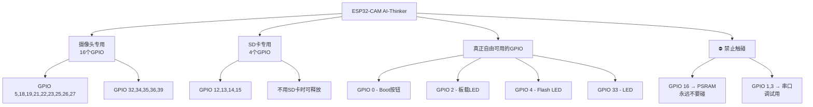

---

## 四、摄像头 OV2640 参数

| 参数 | 规格 |
| --- | --- |
| 传感器 | `1/4` 英寸 `CMOS`，`200` 万像素 |
| 最大分辨率 | `UXGA`（`1600×1200`） |
| 有效输出 | 最高 `2MP`，常用 `UXGA`/`SVGA`/`CIF`/`QVGA` |
| 像素格式 | `YUV422` / `YCbCr422` / `RGB565` / `JPEG`（硬件编码） |
| JPEG 输出 | 板载 `DSP` 硬件压缩，支持 `UXGA@15fps` `JPEG` 直出 |
| 帧率 | `UXGA`: ~`15fps` / `SVGA`: ~`25fps` / `QVGA`: ~`60fps` |
| 镜头视角 | 约 `66°`（可换 `M12` 或鱼眼镜头模组） |
| 接口 | `SCCB`（兼容 `I2C`）配置 + `8-bit` 并行数据输出 |
| SCCB 地址 | `0x30`（写） / `0x31`（读） |

### 分辨率与帧率对照（实测参考）

分辨率选择建议：

| 分辨率 | 像素 | 帧率约 | 推荐用途 |
| --- | --- | --- | --- |
| `QVGA` | `320×240` | `50-60fps` | 人脸检测/运动追踪 |
| `CIF` | `400×296` | `40-50fps` | 快速识别 |
| `VGA` | `640×480` | `25-30fps` | 通用监控 |
| `SVGA` | `800×600` | `20-25fps` | `Web` 流媒体 |
| `XGA` | `1024×768` | `15-20fps` | 静态拍照 |
| `UXGA` | `1600×1200` | `10-15fps` | 最高画质拍照 |

---

## 五、PSRAM（关键特性）

| 参数 | 说明 |
| --- | --- |
| 型号 | `ESP-PSRAM32`（`ESP32` 内部集成方案） |
| 容量 | `4MB`（实际可用约 `3.6MB`） |
| 接口 | 与 `Flash` 共享 `SPI`/`HSPI` 总线 |
| 为什么重要 | 摄像头一帧 `UXGA` 图像 = `1600×1200×2` = `3.75MB`，内部 `520KB` `SRAM` 根本放不下！ |

### 内存分配逻辑

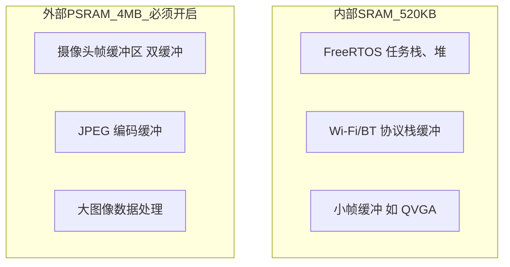

### 配置要点

在 `Arduino IDE` 中必须启用：

- `Tools` → `Partition Scheme` → `"Huge APP (3MB No OTA/1MB SPIFFS)"`
- `Tools` → `PSRAM` → `"Enabled"`

---

## 六、板载硬件资源

`ESP32-CAM AI-Thinker` 实物接口：

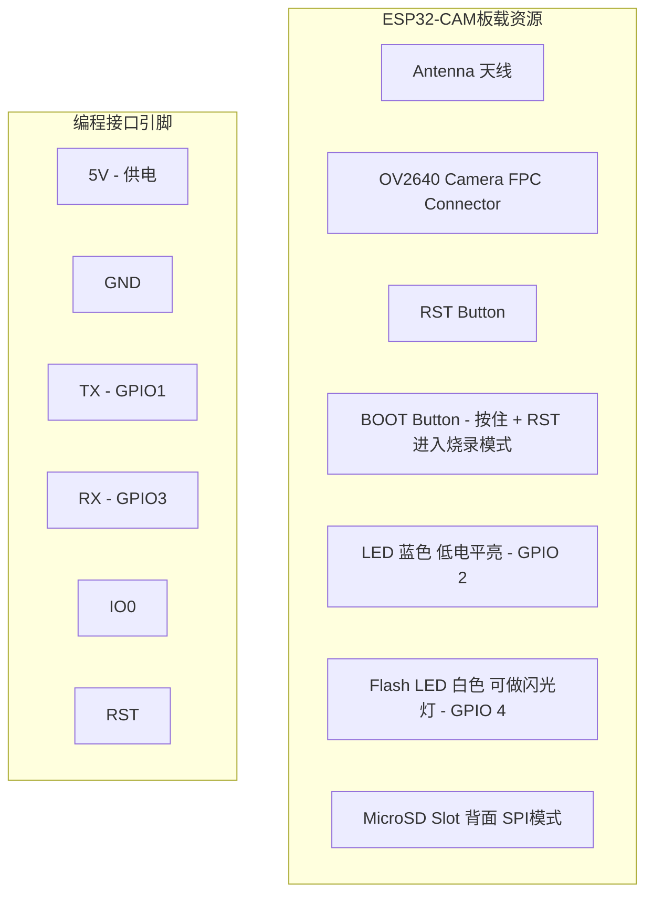

---

## 七、电气参数

| 参数 | 值 |
| --- | --- |
| 输入电压 | `5V`（推荐 `5V 2A`） |
| 工作电流（空载） | ~`180mA` |
| 工作电流（摄像头+`Wi-Fi`） | `300`~`500mA` |
| `Flash LED` 电流 | 每颗 ~`100mA` |
| 深睡眠电流 | ~`10μA` |
| `I/O` 高电平 | `3.3V` |
| `I/O` 驱动电流 | 最大 `40mA`/引脚 |
| 工作温度 | `-40°C` ~ `85°C` |
| `PCB` 尺寸 | `27×40.5mm` |

---

## 八、烧录方式（初学者必看）

> [!warning] ESP32-CAM 没有板载 USB-Serial 芯片！
> 你需要一个外部 `USB-TTL` 模块（如 `CH340` / `CP2102` / `FT232`）

### 接线方式

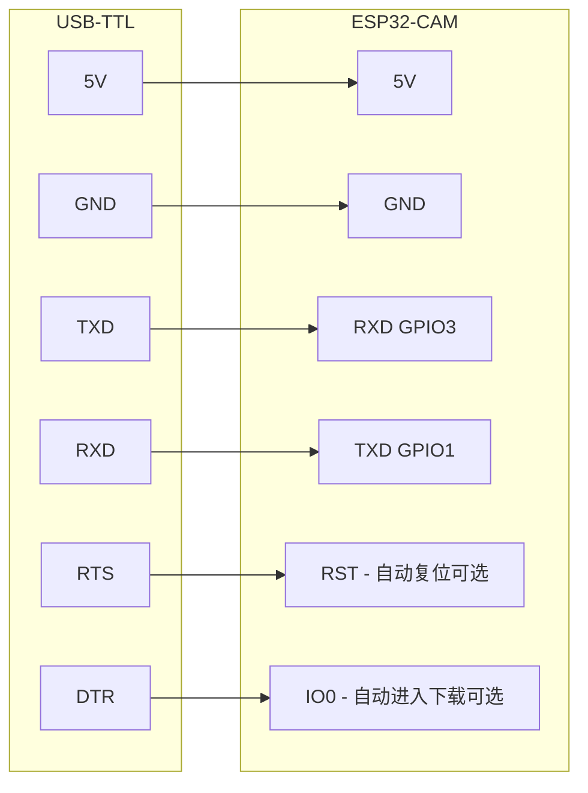

### 手动烧录步骤（无自动复位电路时）

1. `GPIO 0` 接 `GND`
2. 按一下 `RST` 按钮
3. 点击上传
4. 等待 `"Connecting........"` 变成开始写入
5. 烧录完成后断开 `GPIO 0` 的 `GND`
6. 再按一下 `RST`，程序运行

---

## 九、关键避坑总结

| # | 坑 | 解决方案 |
| --- | --- | --- |
| 1 | `GPIO 16` 不能用 | 被 `PSRAM` 占用，配置为输出会直接 `Hard Fault` |
| 2 | 供电不足导致重启 | 用 `5V 2A` 电源，不要用电脑 `USB` 直连 |
| 3 | 摄像头初始化失败 | 检查 `FPC` 排线是否插紧、方向是否正确（触点朝下） |
| 4 | 拍照花屏/条纹 | `PSRAM` 未启用，或帧缓冲被覆盖 |
| 5 | 上传报 `Brownout` | 供电电压不足，加电容或换电源 |
| 6 | 找不到摄像头 | `SCCB` 地址是 `0x30`，不是标准 `I2C` 地址 |
| 7 | `GPIO` 不够用 | 用 `I2C` 扩展器（`PCF8574`）或移位寄存器扩展 |
| 8 | `Wi-Fi` 传输卡顿 | 降低分辨率到 `SVGA` 以下，用 `JPEG` 直出模式 |
[Timestamp: 2026/04/26 13:51:48]

**user**: 优化这个笔记，使他简单可靠，并且易于阅读，加入笔记属性和必要的mermaid图片
[Context: Notes: 嵌入式/语言/C/工程/幂等保护.md]
[Timestamp: 2026/04/26 14:35:46]

**ai**: ---
tags:
  - 嵌入式
  - C语言
  - 设计模式
  - 鲁棒性
created: 2026-03-15
modified: 2026-04-26
status: 已整理
---

# 幂等保护

## 一、核心概念

> **幂等性**：同一个操作执行一次和执行多次，对系统状态产生的影响是相同的。

在嵌入式系统中，幂等保护的核心目的是：**防止重复操作带来的副作用**。

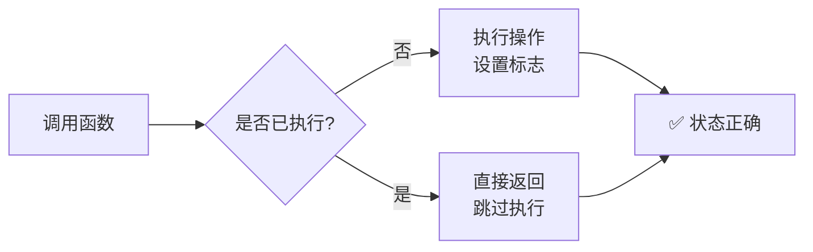

---

## 二、为什么需要幂等保护？

| 场景 | 非幂等的风险 |
| --- | --- |
| 外设初始化 | 重复配置寄存器导致时序错乱 |
| 内存申请 | 重复 `malloc` 导致内存泄漏 |
| 中断使能/禁用 | 嵌套调用导致中断状态不一致 |
| 状态机切换 | 重复触发进入/退出动作 |
| 通信协议 | 重复发送命令导致对端状态异常 |

---

## 三、四种典型实现模式

### 模式一：Guard Flag（标志位保护）

**适用场景**：初始化、一次性动作

```c
typedef struct {
    bool b_isInitialized;
} UartDriver_t;

static UartDriver_t s_uart1 = { .b_isInitialized = false };

void UART1_Init(void)
{
    if (s_uart1.b_isInitialized) return;  /* 幂等保护 */
    
    /* 真正的初始化代码 */
    __HAL_RCC_USART1_CLK_ENABLE();
    /* ... */
    
    s_uart1.b_isInitialized = true;
}
```

---

### 模式二：Reference Counting（引用计数）

**适用场景**：嵌套调用、临界区保护

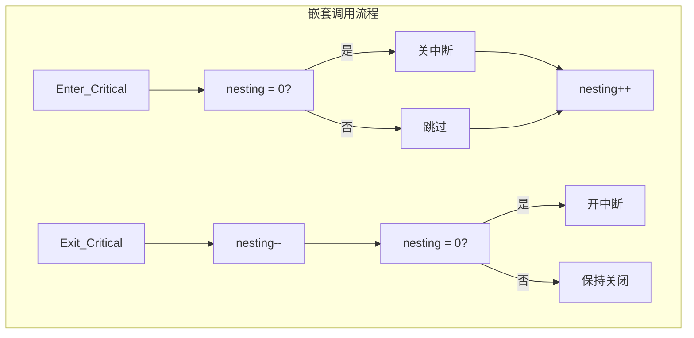

```c
static volatile uint8_t s_criticalNesting = 0;

void Enter_Critical(void)
{
    if (s_criticalNesting == 0) __disable_irq();
    s_criticalNesting++;
}

void Exit_Critical(void)
{
    if (s_criticalNesting > 0) {
        s_criticalNesting--;
        if (s_criticalNesting == 0) __enable_irq();
    }
}
```

---

### 模式三：State Comparison（状态比对）

**适用场景**：模式切换、状态机

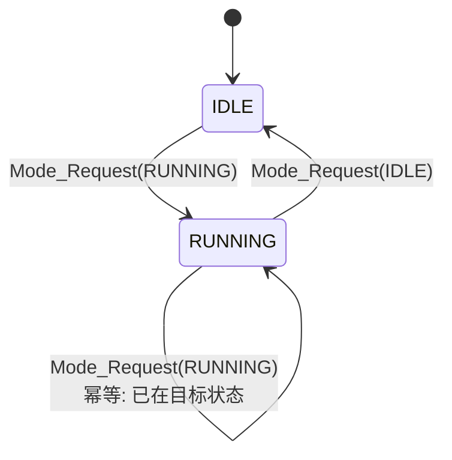

```c
typedef struct {
    e_ModeType pendingMode;
    e_ModeType activeMode;
    bool       b_requestPending;
} ModeManager_t;

bool Mode_Request(e_ModeType newMode)
{
    /* Case 1: 已在目标模式 */
    if (!s_modeMgr.b_requestPending && 
        s_modeMgr.activeMode == newMode) return true;
    
    /* Case 2: 相同请求已在等待 */
    if (s_modeMgr.b_requestPending && 
        s_modeMgr.pendingMode == newMode) return true;
    
    /* 真正切换 */
    s_modeMgr.pendingMode      = newMode;
    s_modeMgr.b_requestPending = true;
    return true;
}
```

---

### 模式四：Last-Command-Wins（最后命令生效）

**适用场景**：配置更新、参数设置

```c
void Set_SamplingRate(uint32_t rate)
{
    static uint32_t s_currentRate = 0;
    
    if (s_currentRate == rate) return;  /* 相同配置，跳过 */
    
    s_currentRate = rate;
    ADC_SetRate(rate);  /* 只在变化时执行 */
}
```

---

## 四、工程建议

### 调试 vs 发布策略

```c
void Peripheral_Init(void)
{
    if (s_isInitialized) {
        DEBUG_LOG("WARN: Duplicate init");  /* 调试可见 */
        return;  /* 发布安全 */
    }
    /* ... */
}
```

### 什么时候不需要幂等？

| 不需要幂等 | 原因 |
| --- | --- |
| `LED_Toggle()` | 每次调用都有意义 |
| `UART_SendByte()` | 数据操作，每次都有效 |
| `ADC_Read()` | 每次读取都是新数据 |

---

## 五、总结速查表

| 模式 | 适用场景 | 实现方式 |
| --- | --- |
| **Guard Flag** | 初始化、一次性动作 | `bool` 标志位 |
| **Reference Counting** | 嵌套调用、临界区 | `uint8_t` 计数器 |
| **State Comparison** | 模式切换、状态机 | 比对当前状态 |
| **Last-Command-Wins** | 配置更新 | 比对上次值 |
[Timestamp: 2026/04/26 14:36:03]

**ai**: ---
tags:
  - 嵌入式
  - C语言
  - 设计模式
  - 编程规范
created: 2026-03-15
modified: 2026-04-26
status: 已整理
---

# 幂等保护

**幂等性**：同一个操作执行一次和执行多次，对系统状态产生的影响是相同的。

在嵌入式系统中，幂等保护的核心目的是：**防止重复操作带来的副作用**——比如重复初始化、重复申请内存、重复发送命令、重复进入临界区。

---

## 一、为什么需要幂等保护？

| 场景 | 非幂等的风险 |
| --- | --- |
| 外设初始化 | 重复配置寄存器导致时序错乱、时钟树异常 |
| 内存申请 | 重复 `malloc` 导致内存泄漏 |
| 中断使能/禁用 | 嵌套调用导致中断状态不一致 |
| 状态机切换 | 重复触发进入/退出动作 |
| 通信协议 | 重复发送命令导致对端状态异常 |
| `RTOS` 资源 | 重复获取信号量导致死锁 |

---

## 二、核心设计模式

### 模式一：标志位保护

**适用场景**：初始化、去初始化、一次性动作。

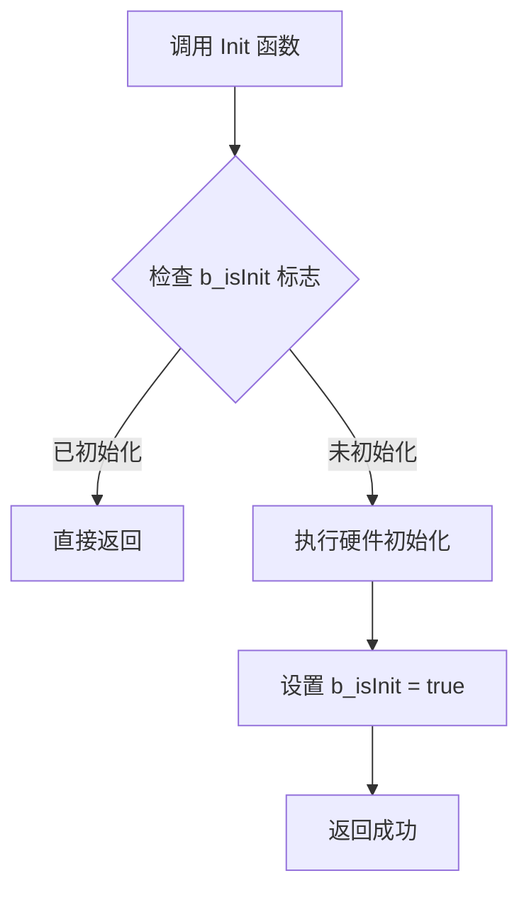

**代码实现**：

```c
typedef struct {
    bool b_isInitialized;
    /* ... 其他状态 ... */
} UartDriver_t;

static UartDriver_t s_uart1 = { .b_isInitialized = false };

void UART1_Init(void)
{
    /* 幂等保护：防止重复初始化 */
    if (s_uart1.b_isInitialized)
    {
        return;  /* 已初始化，直接返回 */
    }
    
    /* 真正的初始化代码 */
    __HAL_RCC_USART1_CLK_ENABLE();
    /* ... 配置寄存器 ... */
    
    s_uart1.b_isInitialized = true;
}
```

---

### 模式二：计数器保护

**适用场景**：临界区嵌套、资源引用计数。

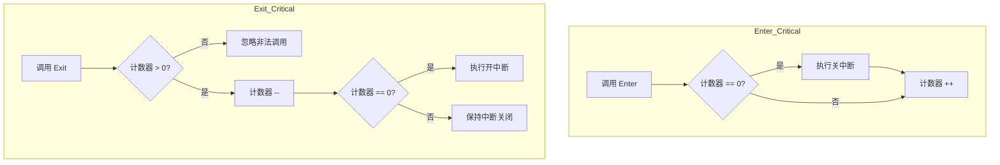

**代码实现**：

```c
static volatile uint8_t s_criticalNesting = 0;

void Enter_Critical(void)
{
    if (s_criticalNesting == 0)
    {
        __disable_irq();  /* 只在第一次真正关中断 */
    }
    s_criticalNesting++;
}

void Exit_Critical(void)
{
    if (s_criticalNesting > 0)
    {
        s_criticalNesting--;
        if (s_criticalNesting == 0)
        {
            __enable_irq();  /* 只在最后一次真正开中断 */
        }
    }
}
```

---

### 模式三：状态比对

**适用场景**：模式切换、状态机跳转。

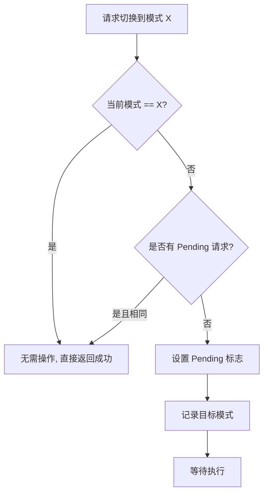

**代码实现**：

```c
typedef struct {
    e_ModeType pendingMode;      /* 待执行模式 */
    e_ModeType activeMode;       /* 当前生效模式 */
    bool       b_requestPending; /* 是否有待处理请求 */
} ModeManager_t;

bool Mode_Request(e_ModeType newMode)
{
    /* Case 1: 已在目标模式 */
    if (!s_modeMgr.b_requestPending && 
        s_modeMgr.activeMode == newMode)
    {
        return true;  /* 已在此模式，OK no-op */
    }
    
    /* Case 2: 已有相同请求在等待 */
    if (s_modeMgr.b_requestPending && 
        s_modeMgr.pendingMode == newMode)
    {
        return true;  /* 重复请求，直接OK */
    }
    
    /* 真正的模式切换请求 */
    s_modeMgr.pendingMode      = newMode;
    s_modeMgr.b_requestPending = true;
    
    return true;
}
```

---

## 三、工程实践建议

### 1. 设计策略选择

| 设计策略 | 适用场景 | 风险 |
| --- | --- | --- |
| **幂等保护** | 初始化、状态切换、资源申请 | 可能隐藏逻辑错误 |
| **断言报错** | 调试阶段、关键路径 | 发布版本需移除 |
| **返回错误码** | 需要调用者感知的场景 | 增加调用复杂度 |

**推荐做法**：调试阶段用断言，发布版本用幂等保护 + 日志记录。

```c
void Peripheral_Init(void)
{
    if (s_isInitialized)
    {
        DEBUG_LOG("WARN: Duplicate init detected");  /* 调试时可见 */
        return;  /* 发布时安全 */
    }
    /* ... */
}
```

### 2. 幂等保护的代价

- **状态变量开销**：每个需要保护的模块需要一个 `bool` 或计数器
- **逻辑复杂度**：增加代码分支，需要覆盖测试
- **隐藏 `Bug`**：如果重复调用本身就是逻辑错误，幂等保护会掩盖问题

### 3. 什么时候不需要幂等？

```c
/* 不需要幂等：每次调用都有意义 */
void LED_Toggle(void) { /* ... */ }

/* 不需要幂等：数据操作 */
void UART_SendByte(uint8_t data) { /* ... */ }
```

---

## 四、总结

| 核心原则 | 说明 |
| --- | --- |
| **Last-Command-Wins** | 重复请求时，最后一次生效 |
| **No-Op on Same State** | 已在目标状态时，跳过执行 |
| **Reference Counting** | 嵌套调用时用计数器保护 |
| **Guard Flag** | 用 `bool` 标志位保护一次性动作 |
[Timestamp: 2026/04/26 14:36:29]

**user**: 帮我优化这个笔记和上述要求一样
[Context: Notes: 嵌入式/语言/C/工程/自动初始化机制.md]
[Timestamp: 2026/04/26 15:37:38]

**ai**: ---
tags:
  - 嵌入式
  - C语言
  - 链接脚本
  - RT-Thread
  - 启动流程
created: 2026-04-13
modified: 2026-04-26
status: 已整理
---

# 自动初始化机制

## 一、核心价值

> **解耦**：模块自己注册，`main` 函数无需手动调用初始化。

```c
// ========== 传统方式 ==========
int main(void) {
    uart_init();    // 手动添加，易遗漏
    spi_init();
    i2c_init();
    // ...
}

// ========== 自动初始化 ==========
INIT_BOARD_EXPORT(uart_init);  // 模块内注册
INIT_DEVICE_EXPORT(spi_init);

int main(void) {
    // 启动时已自动完成所有初始化
}
```

---

## 二、三阶段原理


---

## 三、关键实现

### 1. 编译期：宏定义

```c
/* 核心宏 */
#define INIT_EXPORT(fn, level)                                          \
    __attribute__((used, section(".rti_fn." level)))                    \
    static const init_fn_t __rt_init_##fn = fn

/* 使用示例 */
INIT_BOARD_EXPORT(uart_init);

/* 展开结果 */
__attribute__((used, section(".rti_fn.1")))
static const init_fn_t __rt_init_uart_init = uart_init;
```

| 关键字 | 作用 |
| --- | --- |
| `used` | 防止编译器优化掉未引用的变量 |
| `section(".rti_fn.1")` | 强制放入指定段，按优先级排序 |
| `static const` | 放入 Flash，不占 RAM |

### 2. 链接期：段收集

```ld
/* 链接脚本 */
SECTIONS {
    .rti_fn : {
        . = ALIGN(4);
        __rt_init_start = .;
        KEEP(*(SORT(.rti_fn*)))  /* 收集并排序 */
        __rt_init_end = .;
        . = ALIGN(4);
    } > FLASH
}
```

### 3. 运行期：遍历调用

```c
extern const init_fn_t __rt_init_start;
extern const init_fn_t __rt_init_end;

void rt_auto_init(void) {
    const init_fn_t *fn;
    for (fn = &__rt_init_start; fn < &__rt_init_end; fn++) {
        (*fn)();
    }
}
```

---

## 四、内存布局

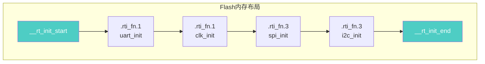

---

## 五、优先级机制

| 宏 | 级别 | 用途 |
| --- | --- | --- |
| `INIT_BOARD_EXPORT` | 1 | 板级早期初始化（时钟、GPIO） |
| `INIT_PREV_EXPORT` | 2 | 纯软件初始化 |
| `INIT_DEVICE_EXPORT` | 3 | 设备驱动注册 |
| `INIT_COMPONENT_EXPORT` | 4 | 组件初始化 |
| `INIT_APP_EXPORT` | 6 | 应用层初始化 |

---

## 六、工程避坑

| 陷阱 | 后果 | 解决方案 |
| --- | --- | --- |
| 忘记 `KEEP()` | 段被优化掉 | 链接脚本必须加 `KEEP` |
| 初始化函数阻塞 | 启动卡死 | 初始化函数要快，不能阻塞 |
| 循环依赖 | 初始化失败 | 合理设计依赖顺序 |
| 优先级错误 | 依赖未就绪 | 按依赖关系选择正确级别 |

---

## 七、一句话总结

**编译器放指针，链接器排座位，启动代码点名。**
[Timestamp: 2026/04/26 15:38:28]