**user**: 我在阅读中一篇文章的时候有几个问题：第一个线程控制模块的SP指针和CPU内部内部寄存器的SP寄存器有什么关系和联系
[Context: Notes: 源码阅读/RT-thread源码阅读/4.(Thread)线程的创建和理解.md]
[Timestamp: 2026/04/28 11:45:27]

**ai**: 
<errorChunk>Model request failed: Copilot Plus license key is not configured. Please enter your license key in the Copilot Plus section at the top of Basic Settings.</errorChunk>
[Timestamp: 2026/04/28 11:45:27]

**user**: 我在阅读中一篇文章的时候有几个问题：第一个线程控制模块的SP指针和CPU内部内部寄存器的SP寄存器有什么关系和联系第二个问题：为什么要线程栈的大小，还有就是rt_thread的初始化实际上也是虚函数对吧，调用的上层的对象的函数
[Context: Notes: 源码阅读/RT-thread源码阅读/4.(Thread)线程的创建和理解.md]
[Timestamp: 2026/04/28 11:47:09]

**ai**: 工程师你好，这两个问题问得非常到位，直击RTOS内核设计的核心！让我逐一为你剖析。

---

## 问题一：TCB中的SP与CPU的SP寄存器是什么关系？

### 【问题诊断】
你问的是**"存档点"与"当前活动值"**的关系。这是一个关于**上下文切换本质**的问题。

### 【根本原因分析】

用一张图说清楚：

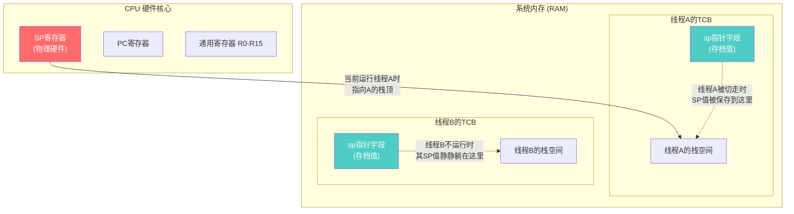

**核心结论：**

| 概念 | 本质 | 数量 | 作用 |
| --- | --- | --- | --- |
| **CPU的SP寄存器** | 物理硬件寄存器 | **全局唯一** | 永远指向**当前正在运行**的线程的栈顶 |
| **TCB中的sp字段** | 内存中的变量 | **每个线程一个** | 保存该线程**不运行时**的栈指针"快照" |

### 【线程切换时的SP流转】

```c
// 伪代码：线程切换的核心逻辑
void context_switch(rt_thread_t from, rt_thread_t to)
{
    // 第1步：保存现场
    // 把CPU当前的SP值"存档"到旧线程的TCB中
    from->sp = __get_SP();  // CPU寄存器 → 内存变量
    
    // 第2步：恢复现场
    // 从新线程的TCB中读取之前保存的SP值，加载到CPU
    __set_SP(to->sp);       // 内存变量 → CPU寄存器
    
    // 此时，CPU的SP寄存器已经指向了新线程的栈顶！
}
```

**类比理解：**
- **CPU的SP寄存器** = 你手里正在读的那本书
- **TCB中的sp字段** = 书架上每个格子里的书签
- **线程切换** = 把手里的书放回书架，夹好书签；然后从另一个格子取出另一本书，翻到书签位置继续读

---

## 问题二：为什么要指定线程栈大小？初始化是虚函数吗？

### 【问题诊断】
这里有两个子问题：
1. 栈大小指定的**必要性**
2. `rt_thread_init` 是否是**虚函数机制**

### 【根本原因分析】

#### 2.1 为什么必须指定栈大小？

**因为栈是每个线程独立的"私有工作台"，大小必须预先规划！**

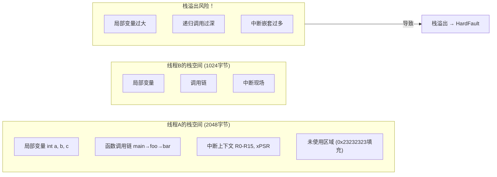

**栈里到底存了什么？**

```c
void task_entry(void *param)
{
    int buffer[256];        // 256 * 4 = 1024字节，从栈分配！
    char msg[100];          // 又是100字节
    
    for (int i = 0; i < 10; i++) {
        process(buffer[i]); // 函数调用，压栈保存返回地址
    }
}
// 如果栈只有512字节，这个函数一进来就爆了！
```

**为什么不能"自动扩容"？**
- 嵌入式系统没有虚拟内存（MMU），内存是物理连续的
- 栈溢出会直接踩踏相邻内存，导致**随机崩溃**
- 必须在创建时**静态规划**好每个线程的"地盘"

#### 2.2 `rt_thread_init` 是虚函数吗？

**严格来说：不是！** 但RT-Thread确实用了**C语言模拟面向对象**的设计模式。

**C++虚函数 vs RT-Thread的实现：**

| 特性 | C++虚函数 | RT-Thread方式 |
| --- | --- | --- |
| 机制 | vtable + 虚函数指针 | 结构体嵌套 + 函数指针 |
| 多态 | 运行时动态绑定 | 编译时静态绑定 |
| 初始化 | 构造函数自动调用 | 显式调用 `rt_thread_init` |

**RT-Thread的"伪面向对象"实现：**

```c
// rt_object 是所有内核对象的"基类"
struct rt_object
{
    char       name[RT_NAME_MAX];    // 对象名称
    rt_uint8_t type;                  // 对象类型（线程、信号量、互斥量...）
    rt_uint8_t flag;                  // 标志位
    rt_list_t  list;                  // 链表节点
};

// rt_thread "继承"自 rt_object
struct rt_thread
{
    struct rt_object parent;  // ← 嵌套结构体，模拟继承！
    
    void       *sp;           // 栈指针
    void       *stack_addr;   // 栈起始地址
    rt_uint16_t stack_size;   // 栈大小
    // ... 其他字段
};
```

**初始化函数的"多态"实现：**

```c
// rt_thread_init 内部会调用 rt_object_init
rt_err_t rt_thread_init(rt_thread_t thread, ...)
{
    // 第一步：初始化"基类"部分
    rt_object_init(&(thread->parent), RT_Object_Class_Thread, name);
    
    // 第二步：初始化"派生类"特有部分
    thread->stack_addr = stack_start;
    thread->stack_size = size;
    // ...
    
    // 第三步：调用"虚函数"（函数指针）
    // 这里不是真正的虚函数，而是显式调用
    _thread_init(thread);
}
```

### 【大师的工程建议】

1. **栈大小估算公式：**
   ```
   栈大小 = 局部变量总和 + 函数调用链深度×(返回地址+寄存器保存) 
          + 最大中断嵌套×(中断上下文) + 安全余量(20%~30%)
   ```

2. **栈水印检测法：** 在初始化时用 `0x23` 填充栈空间，运行一段时间后检查剩余的 `0x23` 数量，判断栈使用率。

3. **关于"虚函数"的理解：** RT-Thread用的是**结构体嵌套 + 约定**来模拟继承，不是真正的C++虚函数。但思想是相通的——**把公共属性抽离成"基类"，让具体对象"继承"它**。

---

还有什么疑问吗？比如想深入看看 `PendSV_Handler` 里SP切换的汇编代码？
[Timestamp: 2026/04/28 11:48:07]

**user**: 我问一个问题：对于静态创建的线程，是不是在编译的时候优先级啊，时间片那些调度器的性质已经固定了，无法用rt_thread_control来进行修改了
[Context: Notes: 源码阅读/RT-thread源码阅读/4.(Thread)线程的创建和理解.md]
[Timestamp: 2026/04/28 13:26:33]

**ai**: 工程师你好，这是一个非常容易产生的误解！让我直接给你答案：

---

## 【问题诊断】

**结论：错误！静态创建的线程，其优先级、时间片等属性完全可以在运行时通过 `rt_thread_control` 修改。**

你混淆了两个概念：
- **内存分配方式**（静态 vs 动态）
- **属性值的可修改性**

---

## 【根本原因分析】

### "静态"到底静在哪里？

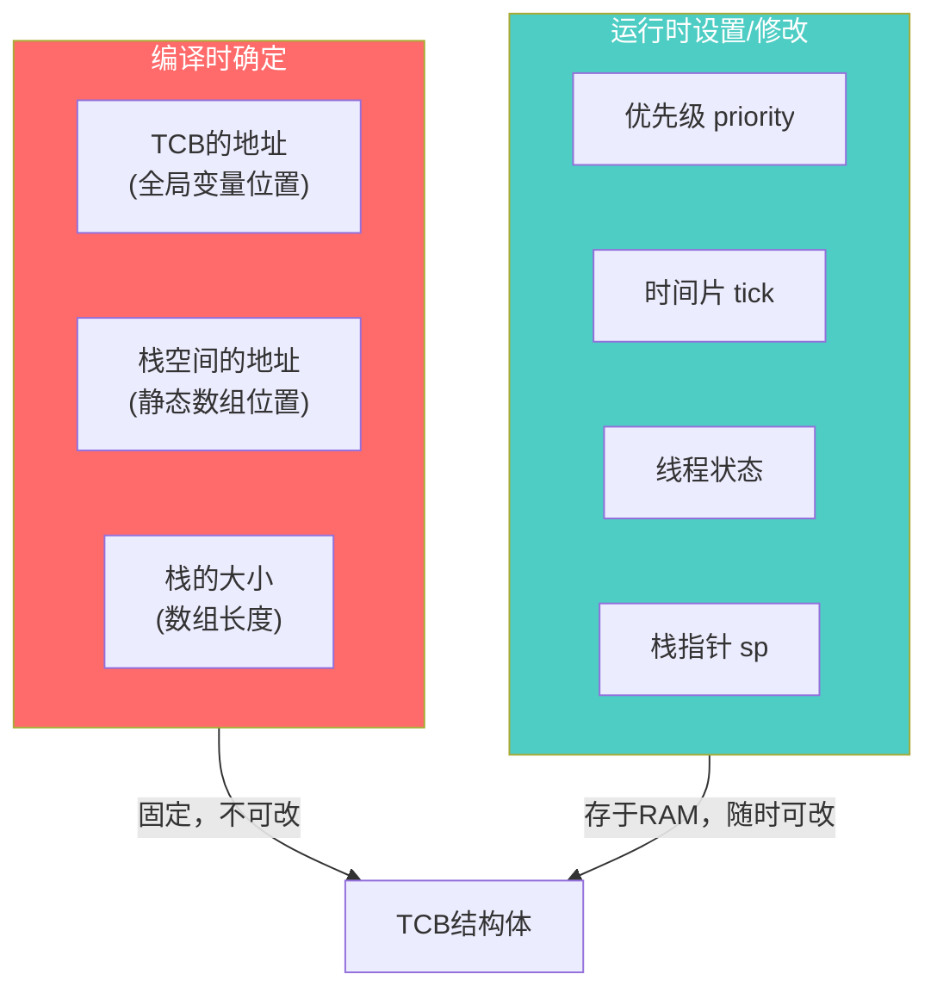

### 代码对比说明

```c
// ==================== 静态创建 ====================
static struct rt_thread thread1;        // TCB：编译时分配地址
static rt_uint8_t thread1_stack[1024];  // 栈：编译时分配地址

void create_thread(void)
{
    // 优先级5、时间片20 —— 这些是运行时传入的参数！
    rt_thread_init(&thread1,
                   "thread1",
                   entry,
                   RT_NULL,
                   &thread1_stack[0],
                   sizeof(thread1_stack),
                   5,    // ← 运行时参数，存在RAM中
                   20);  // ← 运行时参数，存在RAM中
}

// ==================== 动态创建 ====================
void create_dynamic(void)
{
    // TCB和栈都是运行时从堆里malloc出来的
    rt_thread_t thread2 = rt_thread_create("thread2",
                                           entry,
                                           RT_NULL,
                                           1024,
                                           5,    // 同样是运行时参数
                                           20);
}
```

**关键点：无论静态还是动态创建，优先级和时间片都存储在TCB结构体中，而TCB永远在RAM里！**

---

## 【验证：rt_thread_control 能修改什么？】

```c
// 修改优先级 —— 完全可以！
rt_uint8_t new_prio = 10;
rt_thread_control(&thread1, RT_THREAD_CTRL_CHANGE_PRIORITY, &new_prio);

// 修改时间片 —— 也可以！
thread1.remaining_tick = 50;  // 直接改也行

// 绑定CPU核心 —— 也可以！
rt_thread_control(&thread1, RT_THREAD_CTRL_BIND_CPU, (void *)0);
```

---

## 【什么才是真正"固定"的？】

| 属性 | 静态创建 | 动态创建 | 能否用control修改 |
| --- | --- | --- | --- |
| TCB内存位置 | 编译时固定 | 运行时分配 | ❌ 无意义 |
| 栈内存位置 | 编译时固定 | 运行时分配 | ❌ 无意义 |
| 栈大小 | 编译时固定 | 运行时确定 | ❌ 危险操作 |
| **优先级** | 运行时设置 | 运行时设置 | ✅ **可以** |
| **时间片** | 运行时设置 | 运行时设置 | ✅ **可以** |
| **线程状态** | 运行时变化 | 运行时变化 | ✅ **可以** |

---

## 【大师的工程建议】

**记住这个口诀：**

> **"静态"只管内存，不管属性。**
> **栈大小是死的，优先级是活的。**

静态创建的真正意义是：
1. **避免内存碎片**（不用malloc）
2. **确定性**（编译时就知道内存布局）
3. **适合安全关键系统**（不会出现内存分配失败）

但它**不限制**你对线程属性的运行时修改！

---

还有其他疑问吗？比如想深入看看 `rt_thread_control` 的具体实现？
[Timestamp: 2026/04/28 13:28:37]

**user**: 那么他和动态创建的区别呢
[Context: Notes: 阅读想法.md]
[Timestamp: 2026/04/28 13:31:29]

**ai**: 工程师你好，这个问题问得好！让我从**系统架构到物理内存**全方位对比这两种方式。

---

## 【核心区别全景图】

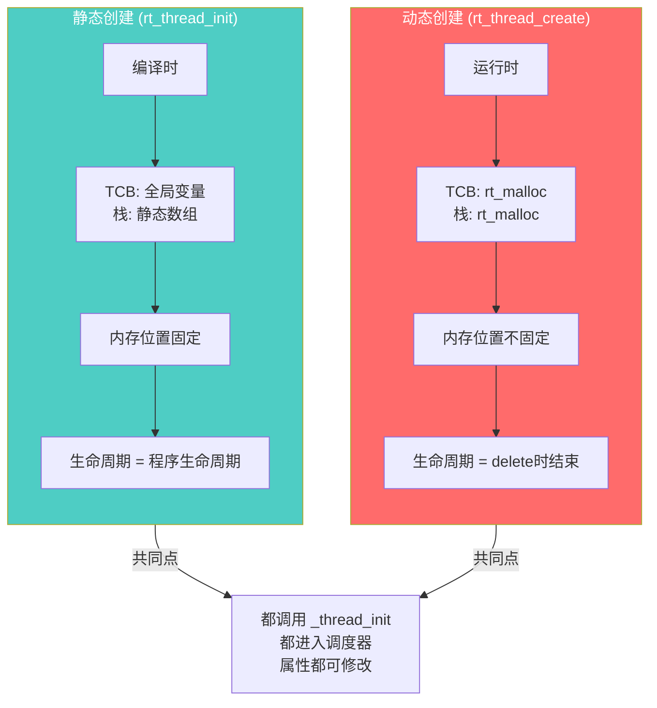

---

## 【多维度对比表】

| 维度 | 静态创建 `rt_thread_init` | 动态创建 `rt_thread_create` |
| --- | --- | --- |
| **TCB内存** | 全局变量（.bss段） | 堆内存 |
| **栈内存** | 静态数组 | 堆内存 |
| **内存位置** | 编译时确定，固定 | 运行时分配，不固定 |
| **内存碎片** | 无 | 可能产生碎片 |
| **分配失败** | 不可能 | 可能（堆不够） |
| **生命周期** | 程序结束才释放 | `delete`后即可回收 |
| **回收方式** | `rt_thread_detach` | `rt_thread_delete` |
| **实时性** | 高（无分配延迟） | 低（malloc耗时不确定） |
| **安全性** | 高（确定性） | 低（可能分配失败） |
| **灵活性** | 低（数量固定） | 高（按需创建） |

---

## 【内存布局对比】

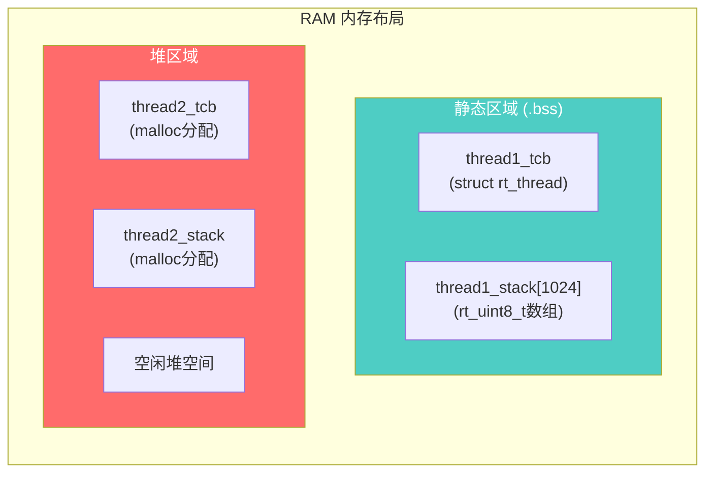

---

## 【代码层面的本质差异】

```c
// ==================== 静态创建 ====================
// 1. 内存由编译器在编译时分配
static struct rt_thread led_thread;        // TCB在.bss段
static rt_uint8_t led_stack[512];          // 栈在.bss段

void app_init(void)
{
    // 2. 只是"填充"已存在的内存
    rt_thread_init(&led_thread,            // 传入已分配的地址
                   "led",
                   led_entry,
                   RT_NULL,
                   &led_stack[0],
                   sizeof(led_stack),
                   5, 20);
}

// ==================== 动态创建 ====================
void app_init(void)
{
    // 1. 运行时申请内存
    rt_thread_t led_thread = rt_thread_create(
                   "led",
                   led_entry,
                   RT_NULL,
                   512,    // 栈大小
                   5, 20);
    
    // 2. 必须检查返回值！
    if (led_thread == RT_NULL) {
        rt_kprintf("创建失败！内存不足\n");
        return;
    }
}
```

---

## 【删除/回收的差异】

```c
// ==================== 静态线程的"删除" ====================
rt_thread_detach(&led_thread);
// 效果：从调度器移除，清理IPC资源
// 但是：TCB和栈内存不会被释放（本来就是静态的）
// 结果：内存还在，只是线程不再运行

// ==================== 动态线程的删除 ====================
rt_thread_delete(led_thread);
// 效果：从调度器移除 + 释放TCB和栈内存
// 但是：不是立即释放！而是放入"僵尸队列"
// 结果：由空闲线程异步回收内存
```

**关键差异：**
- `detach`：只清理调度状态，**不释放内存**
- `delete`：清理调度状态 + **标记内存待释放**

---

## 【工程选型建议】

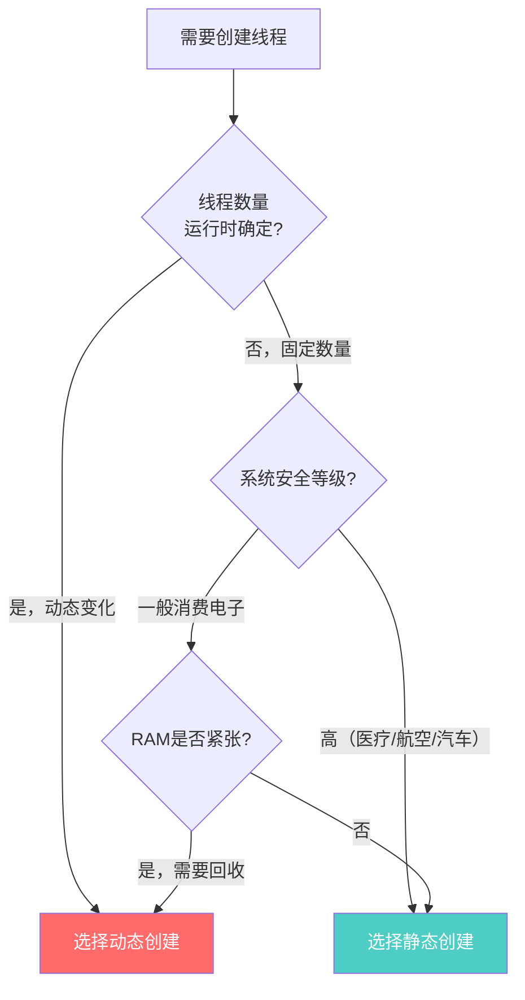

---

## 【大师的工程建议】

### 什么时候用静态？
- **安全关键系统**（医疗、汽车、航空）
- **线程数量固定**，生命周期 = 系统生命周期
- **RAM紧张**，需要精确控制内存布局
- **需要确定性**，不能接受malloc失败

### 什么时候用动态？
- **线程数量运行时确定**（如网络连接数）
- **临时任务**，用完即销毁
- **快速原型开发**，方便灵活
- **插件式架构**，模块动态加载

### 避坑指南
```c
// ❌ 错误：静态线程用delete
rt_thread_delete(&static_thread);  // 会崩溃！

// ❌ 错误：动态线程用detach
rt_thread_detach(dynamic_thread);  // 内存泄漏！

// ✅ 正确配对
rt_thread_init   ↔ rt_thread_detach
rt_thread_create ↔ rt_thread_delete
```

---

**一句话总结：**

> **静态创建 = 编译时划地盘，确定性高但不灵活**
> **动态创建 = 运行时租地盘，灵活但有风险**

还有什么疑问吗？
[Timestamp: 2026/04/28 13:31:58]

**user**: rt_thread_wakeup和rt_thread_resume有什么区别
[Context: Notes: 源码阅读/RT-thread源码阅读/4.(Thread)线程的创建和理解.md]
[Timestamp: 2026/04/28 13:43:41]

**ai**: 工程师你好，这个问题触及了 RT-Thread 内核设计的**两种唤醒哲学**。让我为你剖析它们的本质差异。

---

## 【核心区别一句话】

| 函数 | 本质 |
| --- | --- |
| `rt_thread_resume` | **直接恢复**：把线程从挂起队列挪到就绪队列，简单粗暴 |
| `rt_thread_wakeup` | **委托唤醒**：先调用预设的回调函数，再由回调决定如何恢复，灵活可控 |

---

## 【机制对比图】

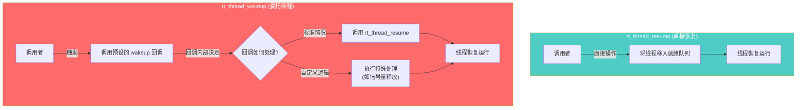

---

## 【代码层面的差异】

### `rt_thread_resume` —— 标准恢复

```c
// 源码简化版
rt_err_t rt_thread_resume(rt_thread_t thread)
{
    // 1. 安全检查
    RT_ASSERT(thread != RT_NULL);
    
    // 2. 从挂起队列移除
    rt_list_remove(&(thread->tlist));
    
    // 3. 加入就绪队列
    rt_schedule_insert_thread(thread);
    
    // 4. 触发调度
    rt_schedule();
    
    return RT_EOK;
}
```

### `rt_thread_wakeup` —— 带回调的唤醒

```c
// 源码简化版
rt_err_t rt_thread_wakeup(rt_thread_t thread)
{
    // 1. 检查是否设置了唤醒回调
    if (thread->wakeup != RT_NULL)
    {
        // 2. 调用回调，由回调决定如何处理
        return thread->wakeup(thread, thread->wakeup_data);
    }
    
    // 3. 没有回调，则执行标准恢复
    return rt_thread_resume(thread);
}

// 设置唤醒回调
void rt_thread_wakeup_set(rt_thread_t thread, 
                          rt_err_t (*wakeup)(rt_thread_t, void*),
                          void *data)
{
    thread->wakeup = wakeup;
    thread->wakeup_data = data;
}
```

---

## 【使用场景对比】

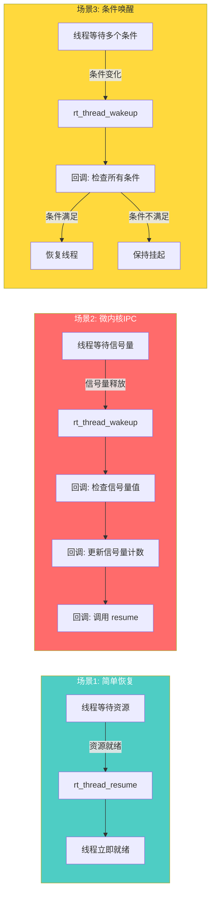

---

## 【实际应用示例】

### 场景：信号量等待中的 wakeup

```c
// 信号量释放时的内部逻辑（简化）
rt_err_t rt_sem_release(rt_sem_t sem)
{
    // 如果有线程在等待这个信号量
    if (!rt_list_isempty(&sem->parent.suspend_thread))
    {
        // 取出第一个等待的线程
        thread = rt_list_entry(sem->parent.suspend_thread.next, ...);
        
        // 使用 wakeup 唤醒（而不是直接 resume）
        // 这样可以让信号量的回调去更新 sem->value
        rt_thread_wakeup(thread);
    }
    else
    {
        // 没人等待，直接增加信号量值
        sem->value++;
    }
}
```

### 场景：自定义条件唤醒

```c
// 自定义唤醒回调
rt_err_t my_wakeup_callback(rt_thread_t thread, void *data)
{
    my_condition_t *cond = (my_condition_t *)data;
    
    // 检查条件是否满足
    if (cond->flag_a && cond->flag_b)
    {
        // 条件满足，恢复线程
        return rt_thread_resume(thread);
    }
    
    // 条件不满足，保持挂起
    return -RT_ERROR;
}

// 初始化时设置回调
void setup_thread(void)
{
    rt_thread_wakeup_set(my_thread, my_wakeup_callback, &my_cond);
}
```

---

## 【对比总结表】

| 特性 | `rt_thread_resume` | `rt_thread_wakeup` |
| --- | --- | --- |
| **调用方式** | 直接恢复 | 通过回调间接恢复 |
| **灵活性** | 低，固定行为 | 高，可自定义逻辑 |
| **复杂度** | 简单 | 需要设置回调 |
| **典型场景** | 手动恢复线程 | IPC 机制内部使用 |
| **微内核支持** | 不适用 | 专为微内核设计 |
| **条件判断** | 无 | 可在回调中判断 |

---

## 【大师的工程建议】

### 什么时候用 `resume`？
- **应用层代码**：你明确知道要恢复哪个线程
- **简单场景**：不需要额外的条件判断
- **调试阶段**：手动控制线程状态

### 什么时候用 `wakeup`？
- **实现 IPC 机制**：信号量、互斥量、消息队列内部
- **条件等待**：需要检查多个条件后才决定是否恢复
- **微内核架构**：用户态服务需要通知内核态

### 避坑指南

```c
// ❌ 错误：忘记设置回调就直接用 wakeup
rt_thread_wakeup(thread);  // 如果没设置回调，会退化成 resume

// ✅ 正确：先设置回调
rt_thread_wakeup_set(thread, my_callback, my_data);
rt_thread_wakeup(thread);

// ✅ 正确：简单场景直接用 resume
rt_thread_resume(thread);
```

---

**一句话总结：**

> **`resume` 是"直接开门"，`wakeup` 是"先敲门问一下再决定开不开"**

还有什么疑问吗？
[Timestamp: 2026/04/28 13:44:30]

**user**: 我对钩子函数的理解，其实他本质上是一种运行在莫一段函数，然后进行回调到另外一个函数，进行检测，或者实现功能，那这不就是函数的运用吗？为什么要叫做钩子函数呢
[Context: Notes: 源码阅读/RT-thread源码阅读/4.(Thread)线程的创建和理解.md]
[Timestamp: 2026/04/28 14:01:57]

**ai**: 工程师你好，这个问题问到了软件设计思想的本质！让我来剖析"钩子函数"和"普通函数调用"的根本区别。

---

## 【问题诊断】

你说得对，**从代码执行层面看，钩子函数确实就是函数调用**。但"钩子"这个名字强调的是**设计模式和控制权**的差异，而不是代码执行本身。

---

## 【核心区别：谁控制谁？】

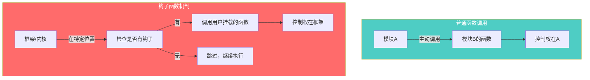

---

## 【"钩子"名字的由来】

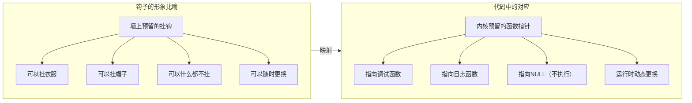

**关键点：钩子 = 预留的"挂载点"，你可以随时挂上不同的功能！**

---

## 【代码对比：普通函数 vs 钩子函数】

### 普通函数：编译时固定

```c
// 模块A的代码 —— 调用谁，写死了
void module_a_process(void)
{
    do_something();
    
    module_b_handler();  // ← 编译时就确定了，必须调用这个
    
    do_other_thing();
}
```

### 钩子函数：运行时可变

```c
// 内核代码 —— 预留"挂钩"
static void (*scheduler_hook)(rt_thread_t from, rt_thread_t to) = RT_NULL;

void rt_schedule(void)
{
    // ... 调度逻辑 ...
    
    // 钩子位置：这里有个"挂钩"
    if (scheduler_hook != RT_NULL)
    {
        scheduler_hook(from_thread, to_thread);  // ← 调用谁？运行时决定！
    }
    
    // ... 继续调度 ...
}

// 用户代码 —— 挂载自己的函数
void my_debug_hook(rt_thread_t from, rt_thread_t to)
{
    rt_kprintf("切换: %s -> %s\n", from->name, to->name);
}

void setup_hook(void)
{
    // 把我的函数"挂"上去
    rt_scheduler_sethook(my_debug_hook);
    
    // 之后每次调度，内核都会自动调用 my_debug_hook
}
```

---

## 【本质差异表】

| 特性 | 普通函数调用 | 钩子函数 |
| --- | --- | --- |
| **调用时机** | 编译时确定 | 运行时动态绑定 |
| **调用者** | 用户代码主动调用 | 框架/内核自动调用 |
| **可替换性** | 不可替换（写死） | 随时可换 |
| **可选性** | 必须调用 | 可以不挂（NULL） |
| **控制权** | 在调用者 | 在框架 |
| **设计模式** | 直接依赖 | 控制反转 |

---

## 【RT-Thread 中的实际钩子】

```c
// 1. 调度器钩子 —— 每次线程切换时触发
void rt_scheduler_sethook(void (*hook)(rt_thread_t from, rt_thread_t to));

// 2. 空闲线程钩子 —— 空闲时执行
rt_err_t rt_thread_idle_sethook(void (*hook)(void));

// 3. 内存分配钩子 —— 每次malloc时触发
void rt_mp_sethook(void (*hook)(struct rt_mempool *mp, void *block));

// 4. 设备初始化钩子
int rt_device_set_rx_indicate(rt_device_t dev, rt_err_t (*rx_ind)(rt_device_t dev, rt_size_t size));
```

---

## 【为什么叫"钩子"？图解】

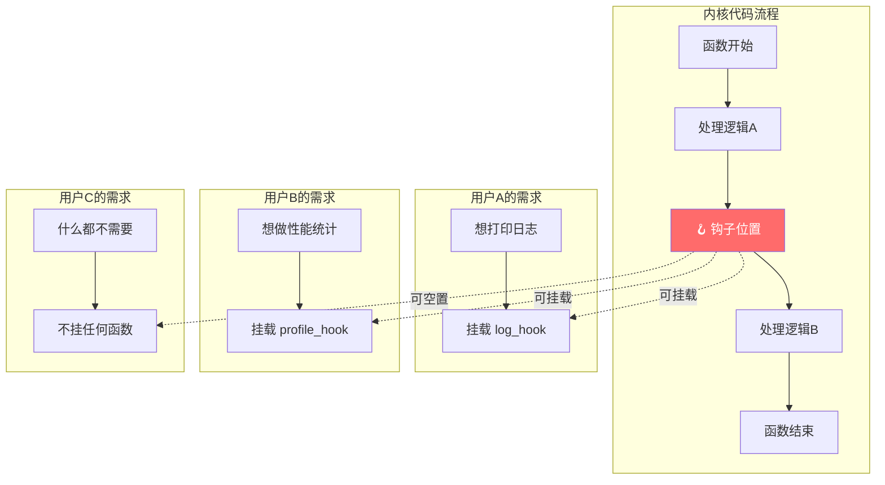

**"钩子"这个名字的精髓：内核在墙上钉了一个钉子，用户可以自由选择挂什么，或者什么都不挂。**

---

## 【大师的工程建议】

### 钩子函数的核心价值

1. **开闭原则**：对扩展开放，对修改关闭
   - 内核代码不用改，用户就能扩展功能

2. **解耦**：内核不需要知道用户代码的存在
   - 内核只管"调用钩子"，不管钩子做什么

3. **可插拔**：功能可以随时挂载/卸载
   ```c
   rt_scheduler_sethook(my_hook);   // 挂载
   rt_scheduler_sethook(RT_NULL);   // 卸载
   ```

### 避坑指南

```c
// ❌ 错误：钩子函数里做耗时操作
void my_hook(rt_thread_t from, rt_thread_t to)
{
    rt_thread_mdelay(100);  // 会阻塞整个调度器！
}

// ✅ 正确：钩子函数要快进快出
void my_hook(rt_thread_t from, rt_thread_t to)
{
    global_from = from;  // 只记录，不阻塞
    global_to = to;
}
```

---

**一句话总结：**

> **普通函数 = 你主动打电话给别人**
> **钩子函数 = 你在墙上留个号码，别人想打就打，不想打就不打**

还有什么疑问吗？
[Timestamp: 2026/04/28 14:02:39]