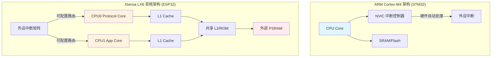
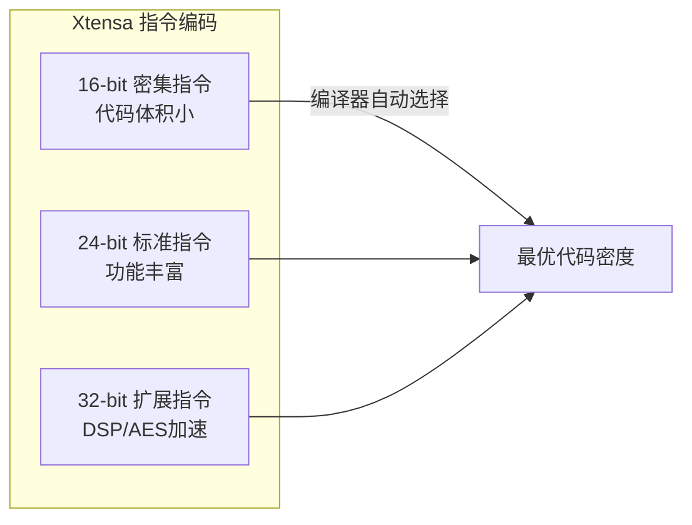
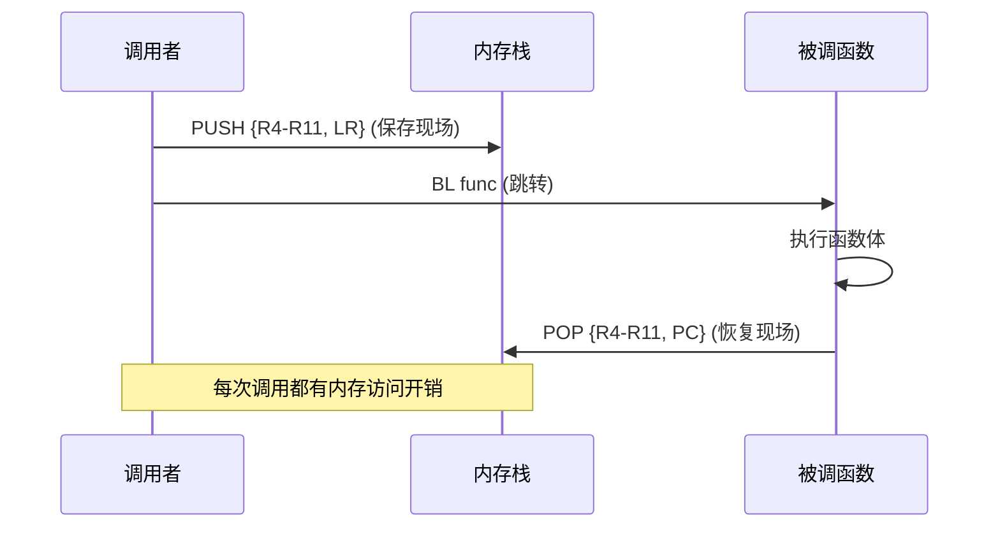
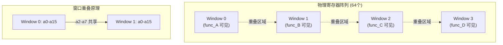
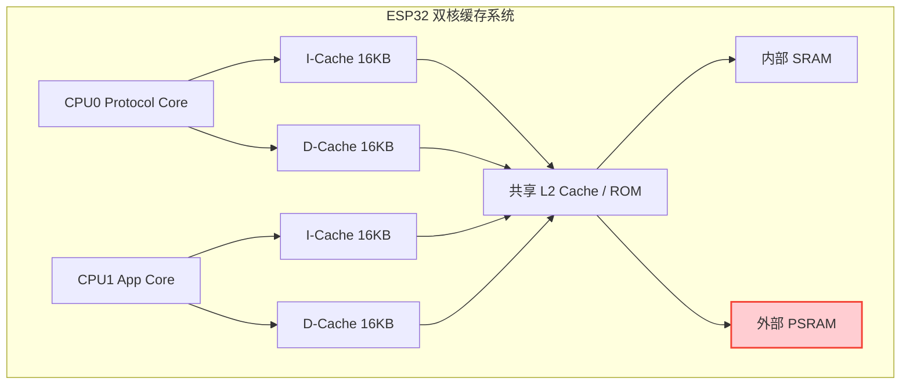
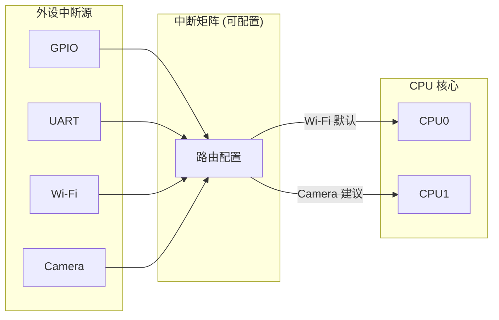

**user**: 我现在想要了解一下ESP32-CAM的内核，请你带我一步一步的了解。
[Context: Notes: 嵌入式/硬件与芯片/芯片/Xtensa LX6 双核架构.md]
[Timestamp: 2026/04/09 22:17:51]

**ai**: **工程师你好，我是你的嵌入式导师。你的开发板上电了吗？今天遇到了什么棘手的技术问题？无论是HardFault、时序错乱，还是系统架构优化，随时抛给我。**

---

好，我们来深入剖析 ESP32-CAM 的"心脏"——**Xtensa LX6 双核架构**。

既然你已经熟悉 STM32（Cortex-M 系列），我会用**对比视角**带你理解，这样你能更快建立心智模型。

---

## 【问题诊断】ESP32 内核与 Cortex-M 的本质差异

ESP32 的内核不是 ARM，而是 **Tensilica Xtensa LX6**——这是乐鑫从 Cadence 购买授权后**深度定制**的架构。它和 Cortex-M 有几个根本性的不同：

| 维度 | Cortex-M4 (STM32) | Xtensa LX6 (ESP32) |
|------|-------------------|-------------------|
| **设计哲学** | 实时性优先，确定性执行 | 性能优先，可配置扩展 |
| **流水线** | 3 级流水线 | 7 级流水线（超标量） |
| **指令集** | Thumb-2（定长为主） | Xtensa（定长+变长混合） |
| **寄存器组** | 16 个通用寄存器 (R0-R15) | 16 个通用寄存器 (a0-a15) + 特殊寄存器 |
| **中断机制** | NVIC 硬件嵌套 | 中断控制器 + 软件可配置优先级 |

---

## 【根本原因分析】为什么 ESP32 选 Xtensa 而不是 ARM？

### 1. **可配置性是核心差异**

Xtensa 架构最大的特点是**"菜单式定制"**：
- 芯片厂商可以选择性地添加/删除指令
- 可以添加**自定义指令**（比如 ESP32 专门为 Wi-Fi 加密加速设计的指令）
- 可以配置**专用硬件单元**（如 ESP32 的 SHA/AES 加速器直接挂载在内核旁）

而 ARM Cortex-M 是**固定设计**，厂商只能加外设，不能改内核指令集。

### 2. **双核架构的工程意义**

ESP32 的双核（CPU0 和 CPU1）是**真·对称多核（SMP）**：

```
┌─────────────────────────────────────────┐
│              ESP32 芯片                  │
│  ┌─────────────┐    ┌─────────────┐     │
│  │   CPU0      │    │   CPU1      │     │
│  │ (Protocol)  │    │  (Application)│   │
│  │  主跑 Wi-Fi │    │  跑用户代码  │     │
│  │  协议栈     │    │  + 摄像头    │     │
│  └──────┬──────┘    └──────┬──────┘     │
│         │                  │            │
│         └────────┬─────────┘            │
│                  ▼                      │
│         ┌───────────────┐               │
│         │  共享内存 RAM  │               │
│         │  (需同步机制)  │               │
│         └───────────────┘               │
└─────────────────────────────────────────┘
```

**工程上的坑**：
- FreeRTOS 任务默认跑在 CPU0，但 Wi-Fi 协议栈也占 CPU0
- **ESP32-CAM 的摄像头数据流**建议绑定到 CPU1，避免和 Wi-Fi 抢时间片
- 双核间通信需要用 **FreeRTOS Queue** 或 **ESP-IDF 的 IPC 机制**

---

## 【解决方案】如何正确理解和使用 ESP32 内核

### 第一步：理解寄存器模型

Xtensa LX6 的关键寄存器：

```c
// 通用寄存器（类似 R0-R15）
a0  - 返回地址（类似 LR）
a1  - 栈指针（类似 SP）
a2-a7  - 参数传递/返回值（类似 R0-R3）
a8-a15 - 临时寄存器/被调用者保存

// 特殊寄存器
PC  - 程序计数器
PS  - 处理器状态（中断使能、特权级等）
SAR - 移位辅助寄存器（Xtensa 特有，优化移位操作）
```

### 第二步：理解中断系统

ESP32 的中断比 Cortex-M 复杂：

```c
// STM32 的 NVIC 是硬件自动嵌套
// ESP32 需要手动配置优先级阈值

// 示例：配置 GPIO 中断
gpio_install_isr_service(0);  // 安装中断服务
gpio_isr_handler_add(GPIO_NUM_13, my_isr_handler, NULL);

// 注意：ESP32 中断优先级 1-7，数字越小优先级越高
// 但 FreeRTOS 临界区保护机制不同！
```

### 第三步：双核任务绑定（ESP32-CAM 关键）

```c
// 将摄像头任务绑定到 CPU1
void app_main(void)
{
    xTaskCreatePinnedToCore(
        camera_task,      // 任务函数
        "camera_task",    // 任务名
        4096,             // 栈大小
        NULL,             // 参数
        5,                // 优先级
        NULL,             // 任务句柄
        1                 // ★ 绑定到 CPU1
    );
    
    // Wi-Fi 任务默认跑在 CPU0
    wifi_init();
}
```

---

## 【大师的工程建议】

### 1. **调试时的思维转换**

| 你习惯的 STM32 思维 | ESP32 需要的新思维 |
|---------------------|-------------------|
| 单步调试看寄存器 | 双核调试需要指定 Core，GDB 命令不同 |
| 中断优先级靠 NVIC 配 | ESP32 有两级：中断控制器 + FreeRTOS 临界区 |
| HardFault 看栈回溯 | ESP32 有 **Guru Meditation Error**，信息更丰富但格式不同 |

### 2. **ESP32-CAM 的特殊约束**

```
⚠️ ESP32-CAM 的坑：
1. 摄像头模块占用大量 PSRAM（伪静态 RAM）
2. Wi-Fi + 摄像头同时工作，峰值电流可达 500mA+
3. 默认的 AI-Thinker 版本引脚资源紧张，很多 GPIO 被摄像头占用
```

### 3. **推荐的学习路径**

```
第一步：理解 Xtensa 架构基础
    ↓
第二步：掌握 FreeRTOS 在 ESP32 上的双核调度
    ↓
第三步：学习 ESP-IDF 的组件化开发（不同于 HAL 库）
    ↓
第四步：深入 Wi-Fi 协议栈与摄像头的资源竞争问题
```

---

**下一步你想深入哪个方向？**
1. 双核任务调度与同步机制（FreeRTOS Queue / Semaphore）
2. ESP32 的内存布局（IRAM / DRAM / PSRAM 的区别）
3. 摄像头驱动与 Wi-Fi 流媒体传输的架构设计
[Timestamp: 2026/04/09 22:18:53]

**user**: 你只需要深入Xtensa LX6 双核架构，从指令集到双核到中断系统到流水线的处理等，深入这些模块，从你认为值得将的第一块开始
[Context: Notes: 嵌入式/硬件与芯片/芯片/Xtensa LX6 双核架构.md]
[Timestamp: 2026/04/09 22:30:11]

**ai**: 好，那我们从最底层开始——**指令集架构（ISA）**。这是理解整个内核的基石。

---

## 第一讲：Xtensa 指令集架构（ISA）

### 【问题诊断】Xtensa 与 ARM 的根本差异

你熟悉的 Cortex-M 使用的是 **Thumb-2 指令集**，特点是：
- 指令长度固定（16-bit 或 32-bit）
- 编码格式规整
- 解码逻辑简单，适合低功耗设计

而 Xtensa 采用的是**可配置的变长指令集**：

```
┌────────────────────────────────────────────────────┐
│            Xtensa 指令编码格式                      │
├────────────────────────────────────────────────────┤
│  24-bit 指令（最常用）                              │
│  ┌─────────────────────────────────────────────┐   │
│  │  opcode (8-bit) │  operands (16-bit)        │   │
│  └─────────────────────────────────────────────┘   │
│                                                    │
│  16-bit 密集指令（类似 Thumb）                      │
│  ┌─────────────────────────────────────────────┐   │
│  │  opcode (4-bit) │  operands (12-bit)        │   │
│  └─────────────────────────────────────────────┘   │
│                                                    │
│  32-bit 扩展指令（DSP、浮点等）                     │
│  ┌─────────────────────────────────────────────┐   │
│  │  opcode (8-bit) │  extended operands        │   │
│  └─────────────────────────────────────────────┘   │
│                                                    │
│  ★ 甚至可以定义 64-bit 自定义指令！                 │
└────────────────────────────────────────────────────┘
```

### 【根本原因分析】为什么要这样设计？

**核心原因：代码密度与性能的平衡**

| 设计选择 | 优点 | 代价 |
|----------|------|------|
| 16-bit 密集指令 | 代码体积小，节省 Flash | 寄存器访问受限 |
| 24-bit 标准指令 | 编码空间大，功能丰富 | 解码复杂度中等 |
| 32-bit 扩展指令 | 支持复杂操作（DSP/AES） | 代码体积大 |

**ESP32 的实际应用**：
```c
// 编译器会自动选择最优指令长度
// 查看反汇编可以看到混合编码

// 简单操作用 16-bit
ADD.N   a2, a2, 1      // .N 后缀表示 narrow (16-bit)

// 复杂操作用 24-bit 或 32-bit
ADDX4   a2, a3, a4     // a2 = a3*4 + a4（专用地址计算指令）
```

---

### 【深入剖析】Xtensa 的特色指令

#### 1. **窗口化寄存器**

这是 Xtensa 最独特的设计，也是理解其调用约定的关键：

```
┌─────────────────────────────────────────────────────────┐
│          物理寄存器（64-128 个，ESP32 有 64 个）         │
│  ┌───────────────────────────────────────────────────┐  │
│  │  a0-a15 (Window 0)  ← 当前函数可见                │  │
│  │  ├─ a0: 返回地址                                   │  │
│  │  ├─ a1: 栈指针                                     │  │
│  │  ├─ a2-a7: 参数/返回值                            │  │
│  │  └─ a8-a15: 本地变量                              │  │
│  ├───────────────────────────────────────────────────┤  │
│  │  a0-a15 (Window 1)  ← 上层调用者可见              │  │
│  ├───────────────────────────────────────────────────┤  │
│  │  a0-a15 (Window 2)  ← 更上层可见                  │  │
│  ├───────────────────────────────────────────────────┤  │
│  │  a0-a15 (Window 3)  ← 最上层可见                  │  │
│  └───────────────────────────────────────────────────┘  │
│                                                         │
│  ★ Window Overlap: 相邻窗口有 4 个寄存器重叠           │
│     用于参数传递，无需内存读写！                        │
└─────────────────────────────────────────────────────────┘
```

**与 Cortex-M 的对比**：

```c
// Cortex-M 函数调用（你熟悉的）
void func(int a, int b) {
    // R0 = a, R1 = b
    // 如果参数超过 4 个，需要压栈
    // 函数返回时需要恢复寄存器
}

// Xtensa 窗口化调用
void func(int a, int b) {
    // a2 = a, a3 = b
    // 调用时执行 ENTRY 指令，硬件自动切换寄存器窗口
    // 无需保存/恢复寄存器！
    // 只有窗口溢出时才需要访问内存
}
```

**工程意义**：
- 函数调用开销极低（无内存操作）
- 适合深度递归和函数调用密集的代码
- **但**：窗口溢出时会触发异常，开销很大

#### 2. **零开销循环**

Xtensa 有专门的硬件循环指令：

```asm
// 传统循环（Cortex-M 风格）
loop:
    ADD     r0, r0, #1
    CMP     r0, #100
    BLT     loop          // 每次迭代都要判断

// Xtensa 零开销循环
LOOP    a2, loop_end     // 硬件自动计数，无分支开销
    ADD.N   a3, a3, 1
loop_end:
// 硬件在后台递减计数器，不占用流水线
```

**性能差异**：
```
传统循环：每次迭代 3-5 个周期（分支预测失败更糟）
零开销循环：每次迭代 1 个周期（纯计算时间）
```

#### 3. **专用地址计算指令**

```asm
// ESP32 常用于数组/结构体访问
ADDX4   a2, a3, a4    // a2 = a3*4 + a4  (int 数组)
ADDX8   a2, a3, a4    // a2 = a3*8 + a4  (double 数组)
ADDX2   a2, a3, a4    // a2 = a3*2 + a4  (short 数组)

// 对比 Cortex-M 需要两条指令
LSL     r0, r0, #2    // 先移位
ADD     r0, r0, r1    // 再加
```

---

### 【解决方案】如何在工程中利用这些特性

#### 1. **理解编译器的选择**

```c
// 编译时加 -O2 或 -Os，编译器会自动：
// 1. 选择最优指令长度
// 2. 利用窗口化寄存器优化调用链
// 3. 将循环转换为零开销循环

// 但有些情况编译器无法优化：
void complex_func(int a, int b, int c, int d, 
                  int e, int f, int g, int h) {
    // 超过 6 个参数，必须压栈
    // 窗口化寄存器也无法完全避免内存访问
}
```

#### 2. **避免窗口溢出**

```c
// 错误示范：深度递归
int fibonacci(int n) {
    if (n <= 1) return n;
    return fibonacci(n-1) + fibonacci(n-2);  // 窗口溢出！
}

// 正确做法：限制递归深度，或改用迭代
int fibonacci_iter(int n) {
    int a = 0, b = 1;
    for (int i = 0; i < n; i++) {
        int temp = a + b;
        a = b;
        b = temp;
    }
    return a;
}
```

#### 3. **查看反汇编理解优化**

```bash
# ESP-IDF 编译后查看反汇编
xtensa-esp32-elf-objdump -d build/project.elf > disasm.txt

# 查找关键函数
grep -A 20 "camera_task" disasm.txt
```

---

### 【大师的工程建议】

#### 1. **调试时的关键点**

```c
// 当你看到 Guru Meditation Error 时
// 检查是否是窗口溢出或寄存器损坏

// 典型错误信息：
// EXCVADDR: 0x400D1234  ← 非法地址
// EXCCAUSE: 0x1d (Window Overflow)  ← 窗口溢出异常
```

#### 2. **与 FreeRTOS 的交互**

```c
// FreeRTOS 任务切换时需要保存/恢复寄存器窗口
// ESP-IDF 已经处理好了，但你要知道原理

// 任务栈中保存的是完整的窗口状态
// 所以 ESP32 的任务栈比 Cortex-M 大得多（通常 4KB+）
```

---

**下一讲预告：流水线与双核架构**

接下来我会讲解：
1. **7 级流水线**如何影响代码执行
2. **双核缓存一致性**问题（ESP32-CAM 的坑）
3. **流水线冒险**与编译器如何处理

---

**现在有问题吗？比如：**
- 窗口化寄存器的具体切换机制？
- 如何判断代码是否触发了窗口溢出？
- 想看一段实际的反汇编分析？
[Timestamp: 2026/04/09 22:31:05]

**user**: 第一个问题对于窗口化寄存器我没怎么懂，在ARM的架构里有这个设计吗？还是说压栈的设计只有ARM架构
[Context: Notes: copilot/system-prompts/日常学习-嵌入式.md]
[Timestamp: 2026/04/09 22:46:39]

**ai**: 这是一个非常好的问题！让我从根本上帮你厘清这个概念。

---

## 【问题诊断】窗口化寄存器 vs 传统压栈

**直接回答你的问题**：

1. **ARM Cortex-M 没有窗口化寄存器设计**，它使用的是传统的压栈方式
2. **压栈设计不是 ARM 独有的**，绝大多数现代架构（x86、MIPS、RISC-V、PowerPC）都用压栈
3. **窗口化寄存器反而是"异类"**，只有极少数架构采用

---

## 【根本原因分析】两种设计哲学的本质差异

### 1. 传统压栈方式（ARM / x86 / RISC-V）

这是你熟悉的方式：

```
┌─────────────────────────────────────────────────────────┐
│              ARM Cortex-M 函数调用过程                   │
├─────────────────────────────────────────────────────────┤
│                                                         │
│  调用前：                                                │
│  ┌─────────────────┐                                    │
│  │ R0-R3: 参数     │                                    │
│  │ R4-R11: 本地变量│                                    │
│  │ SP ──→ 栈顶     │                                    │
│  └─────────────────┘                                    │
│         │                                               │
│         ▼ 调用 func()                                   │
│  ┌─────────────────┐                                    │
│  │ PUSH {R4-R11}   │  ← 必须保存到内存！                │
│  │ ... 函数体 ...  │                                    │
│  │ POP {R4-R11}    │  ← 从内存恢复                      │
│  │ BX LR           │  返回                              │
│  └─────────────────┘                                    │
│                                                         │
│  ★ 每次调用都要访问内存（慢！）                          │
└─────────────────────────────────────────────────────────┘
```

**代价**：
- 每次函数调用/返回都要执行 PUSH/POP
- 内存访问延迟（即使有 Cache，也比寄存器慢 10-100 倍）
- 深度调用链会消耗大量栈空间

### 2. 窗口化寄存器（Xtensa / SPARC）

这是 Xtensa 的方式：

```
┌─────────────────────────────────────────────────────────┐
│           Xtensa 窗口化寄存器工作原理                     │
├─────────────────────────────────────────────────────────┤
│                                                         │
│  物理寄存器（ESP32 有 64 个）：                          │
│  ┌─────────────────────────────────────────────────┐    │
│  │ Window 0: [a0-a15] ← func_A 当前可见             │    │
│  │ Window 1: [a0-a15] ← func_B 调用后可见           │    │
│  │ Window 2: [a0-a15] ← func_C 调用后可见           │    │
│  │ Window 3: [a0-a15] ← func_D 调用后可见           │    │
│  └─────────────────────────────────────────────────┘    │
│                                                         │
│  关键：相邻窗口有重叠！                                  │
│                                                         │
│  Window 0:  [a0][a1][a2][a3][a4][a5]...[a15]           │
│               ↓   ↓   ↓   ↓                             │
│  Window 1: [a0][a1][a2][a3][a4][a5]...[a15]           │
│               ↑   ↑   ↑   ↑  这些是同一个物理寄存器！    │
│                                                         │
│  ★ 调用函数时：                                          │
│    - 执行 ENTRY 指令                                    │
│    - 硬件自动切换到下一个窗口                            │
│    - 参数通过重叠寄存器传递（无需内存访问！）             │
│                                                         │
│  ★ 返回时：                                              │
│    - 执行 RETW 指令                                     │
│    - 硬件切换回上一个窗口                                │
│    - 返回值在重叠寄存器中（无需内存访问！）               │
└─────────────────────────────────────────────────────────┘
```

---

## 【深入剖析】窗口重叠的精妙设计

让我用一个具体例子说明：

```c
// 假设有三个函数调用链
int func_A(void) {
    int x = 10;
    return func_B(x);      // 调用 func_B，传递参数 x
}

int func_B(int param) {
    int y = param * 2;
    return func_C(y);      // 调用 func_C，传递参数 y
}

int func_C(int param) {
    return param + 1;
}
```

### ARM 的执行过程：

```asm
func_A:
    PUSH    {R4, LR}        ; 保存寄存器到栈
    MOV     R0, #10         ; x = 10
    BL      func_B          ; 调用 func_B
    POP     {R4, PC}        ; 恢复并返回

func_B:
    PUSH    {R4, LR}        ; 又要保存！
    LSL     R4, R0, #1      ; y = param * 2
    MOV     R0, R4          ; 传递参数
    BL      func_C          ; 调用 func_C
    POP     {R4, PC}        ; 又要恢复！

func_C:
    ADD     R0, R0, #1      ; param + 1
    BX      LR              ; 返回

; ★ 每层调用都有 PUSH/POP，总共 4 次内存访问
```

### Xtensa 的执行过程：

```asm
func_A:
    ENTRY   a1, 16          ; 切换到 Window 1（无内存访问！）
    MOVI    a2, 10          ; x = 10（a2 是参数寄存器）
    CALL4   func_B          ; 调用（自动切换窗口）

func_B:
    ; 此时 a2 已经是 func_A 传来的参数！
    ; 因为 Window 0 和 Window 1 的 a2-a3 重叠
    ADDX2   a2, a2, a2      ; y = param * 2
    CALL4   func_C          ; 调用（再次切换窗口）

func_C:
    ; a2 又自动拿到了 func_B 的参数！
    ADDI    a2, a2, 1       ; param + 1
    RETW                    ; 返回（切换回上一个窗口）

; ★ 整个过程零内存访问！
```

---

## 【关键问题】窗口用完了怎么办？

这是窗口化设计的核心限制：

```
┌─────────────────────────────────────────────────────────┐
│              窗口溢出                    │
├─────────────────────────────────────────────────────────┤
│                                                         │
│  ESP32 只有 4 个窗口（Window 0-3）                       │
│                                                         │
│  调用链深度超过 4 时：                                   │
│  func_A → func_B → func_C → func_D → func_E             │
│            ↑                              ↑              │
│          Window 0                      Window 溢出！     │
│                                                         │
│  硬件会触发 Window Overflow 异常                         │
│  异常处理程序会把最早的窗口保存到栈中                     │
│  返回时再恢复                                            │
│                                                         │
│  ★ 这就是为什么深度递归在 Xtensa 上性能很差！            │
└─────────────────────────────────────────────────────────┘
```

---

## 【解决方案】工程实践建议

### 1. 避免深度递归

```c
// ❌ 错误：深度递归会频繁触发窗口溢出
int fibonacci(int n) {
    if (n <= 1) return n;
    return fibonacci(n-1) + fibonacci(n-2);
}

// ✅ 正确：改用迭代
int fibonacci_iter(int n) {
    int a = 0, b = 1;
    for (int i = 0; i < n; i++) {
        int temp = a + b;
        a = b;
        b = temp;
    }
    return a;
}
```

### 2. 限制调用链深度

```c
// 如果必须深度调用，手动管理栈
#define MAX_DEPTH 32

typedef struct {
    int data[MAX_DEPTH];
    int top;
} ManualStack;

void deep_process(int depth, ManualStack* stack) {
    if (depth > MAX_DEPTH) {
        // 改用迭代方式处理
        while (stack->top > 0) {
            int val = stack->data[--stack->top];
            // 处理...
        }
        return;
    }
    // 正常递归...
}
```

---

## 【大师的工程建议】

### 为什么 ARM 不用窗口化寄存器？

| 设计选择 | ARM 的考量 | Xtensa 的考量 |
|----------|-----------|---------------|
| **硬件复杂度** | 简单优先，省电 | 性能优先，可接受复杂 |
| **中断延迟** | 压栈方式中断响应快 | 窗口切换可能增加延迟 |
| **代码体积** | Thumb 指令已经很小 | 窗口化减少代码量 |
| **目标市场** | 低功耗嵌入式 | 高性能网络/多媒体 |

**历史教训**：
- SPARC 架构也用窗口化寄存器，但在桌面市场失败了
- Itanium 尝试了更激进的寄存器栈引擎，也失败了
- **窗口化寄存器在特定场景（如 ESP32 的网络处理）有优势，但不是银弹**

---

**现在理解了吗？如果还有疑问，可以继续问：**
- 窗口溢出异常的具体处理流程？
- FreeRTOS 任务切换时如何处理窗口？
- 或者我们继续讲下一块：流水线与双核架构？
[Timestamp: 2026/04/09 22:47:36]

**user**: 流水线与双核架构
[Context: Notes: 嵌入式/硬件与芯片/芯片/Xtensa LX6 双核架构.md]
[Timestamp: 2026/04/09 22:55:57]

**ai**: 好，我们进入第二讲——**流水线与双核架构**。这是理解 ESP32 性能特性和踩坑的关键。

---

## 第二讲：7级流水线与双核架构

### 【问题诊断】流水线深度的影响

你熟悉的 Cortex-M4 是 **3级流水线**：

```
取指(F) → 译码(D) → 执行(E)
```

而 Xtensa LX6 是 **7级流水线**：

```
┌─────────────────────────────────────────────────────────────────┐
│                    Xtensa LX6 7级流水线                          │
├─────────────────────────────────────────────────────────────────┤
│                                                                 │
│  ┌──────┐ ┌──────┐ ┌──────┐ ┌──────┐ ┌──────┐ ┌──────┐ ┌──────┐│
│  │ IF   │→│ IR   │→│ ID   │→│ ALU  │→│ MEM  │→│ WB   │→│ -    ││
│  │取指  │ │取指寄│ │译码  │ │执行  │ │访存  │ │写回  │ │      ││
│  │      │ │存器  │ │      │ │      │ │      │ │      │ │      ││
│  └──────┘ └──────┘ └──────┘ └──────┘ └──────┘ └──────┘ └──────┘│
│                                                                 │
│  Stage 1: IF   - Instruction Fetch（从 I-Cache 取指令）         │
│  Stage 2: IR   - Instruction Register（指令寄存器加载）          │
│  Stage 3: ID   - Instruction Decode（译码 + 读寄存器）           │
│  Stage 4: ALU  - Arithmetic Logic Unit（执行运算）               │
│  Stage 5: MEM  - Memory Access（访问 D-Cache/外设）             │
│  Stage 6: WB   - Write Back（结果写回寄存器）                    │
│  Stage 7: -    - Pipeline Complete（流水线完成）                 │
│                                                                 │
│  ★ 超标量设计：部分阶段可以并行处理多条指令                       │
└─────────────────────────────────────────────────────────────────┘
```

### 【根本原因分析】为什么用7级流水线？

| 流水线深度 | 优点 | 代价 |
|-----------|------|------|
| **3级** | 分支代价小（1-2周期），中断响应快 | 主频受限（Cortex-M4 最高 ~200MHz） |
| **7级** | 主频高（ESP32 可达 240MHz），吞吐量大 | 分支代价大（3-5周期），冒险处理复杂 |

**关键洞察**：
```
流水线越深 → 主频越高 → 但分支预测失败代价越大
```

---

## 【深入剖析】流水线冒险

### 1. 数据冒险

```c
// 危险代码示例
int a = 10;
int b = a + 1;    // 依赖上一条指令的结果
int c = b * 2;    // 又依赖上一条

// 流水线视图：
// Cycle 1: IF(a=10)
// Cycle 2: IR(a=10)  IF(b=a+1)  ← 此时 a 还没写回！
// Cycle 3: ID(a=10)  IR(b=a+1)  IF(c=b*2)  ← 数据冒险！
```

**Xtensa 的解决方案**：

```
┌─────────────────────────────────────────────────────────┐
│              数据前递                          │
├─────────────────────────────────────────────────────────┤
│                                                         │
│  正常流程：                                              │
│  ALU → MEM → WB → 下一指令 ID 阶段读寄存器               │
│                                                         │
│  前递优化：                                              │
│  ALU ──────────────────→ 下一指令 ID 阶段                │
│       （直接旁路，跳过 MEM 和 WB）                       │
│                                                         │
│  ★ 大部分数据冒险通过硬件前递自动解决                     │
│  ★ 但 Load-Use 冒险仍需流水线停顿                        │
└─────────────────────────────────────────────────────────┘
```

**Load-Use 冒险**（编译器无法优化）：

```c
// 必须停顿的情况
int arr[10];
int x = arr[5];    // 从内存加载
int y = x + 1;     // 立即使用 x → 流水线停顿 1-2 周期

// 优化写法：插入无关指令
int x = arr[5];
int z = some_other_var;  // 不依赖 x
int y = x + 1;           // 此时 x 已就绪
```

### 2. 控制冒险

这是 7 级流水线最大的性能杀手：

```c
// 分支预测失败代价巨大
if (condition) {
    // 分支 A
} else {
    // 分支 B
}
// 预测失败 → 流水线清空 → 损失 5-7 周期
```

**Xtensa 的优化策略**：

```asm
// 零开销循环（避免分支）
LOOP    a2, end_label
    ADD.N   a3, a3, 1
end_label:

// 条件移动指令（避免分支）
// ARM: 需要条件码或分支
// Xtensa: 有专门的 MOVEQZ/MOVNEZ 指令
MOVEQZ   a2, a3, a4    // if (a4 == 0) a2 = a3
```

**工程建议**：

```c
// ❌ 分支密集代码
void process(int* data, int len) {
    for (int i = 0; i < len; i++) {
        if (data[i] > 0) {
            data[i] = data[i] * 2;
        } else {
            data[i] = 0;
        }
    }
}

// ✅ 分支消除版本
void process_optimized(int* data, int len) {
    for (int i = 0; i < len; i++) {
        int mask = (data[i] > 0) ? 0xFFFFFFFF : 0;  // 生成掩码
        data[i] = (data[i] * 2) & mask;             // 无分支计算
    }
}
```

---

## 【核心内容】双核架构与缓存一致性

这是 ESP32-CAM 开发中最大的坑。

### 1. 双核物理布局

```
┌─────────────────────────────────────────────────────────────────┐
│                      ESP32 双核架构                              │
├─────────────────────────────────────────────────────────────────┤
│                                                                 │
│  ┌─────────────────────┐       ┌─────────────────────┐         │
│  │       CPU0          │       │       CPU1          │         │
│  │   (Protocol Core)   │       │  (Application Core) │         │
│  │                     │       │                     │         │
│  │ ┌─────────────────┐ │       │ ┌─────────────────┐ │         │
│  │ │  I-Cache 16KB   │ │       │ │  I-Cache 16KB   │ │         │
│  │ └─────────────────┘ │       │ └─────────────────┘ │         │
│  │ ┌─────────────────┐ │       │ ┌─────────────────┐ │         │
│  │ │  D-Cache 16KB   │ │       │ │  D-Cache 16KB   │ │         │
│  │ └─────────────────┘ │       │ └─────────────────┘ │         │
│  └──────────┬──────────┘       └──────────┬──────────┘         │
│             │                              │                    │
│             └──────────────┬───────────────┘                    │
│                            ▼                                    │
│              ┌─────────────────────────┐                        │
│              │   L2 Cache / ROM        │                        │
│              │   (共享，硬件一致性)     │                        │
│              └───────────┬─────────────┘                        │
│                          │                                      │
│                          ▼                                      │
│              ┌─────────────────────────┐                        │
│              │   外部 PSRAM            │  ← ESP32-CAM 使用       │
│              │   (无硬件一致性！)       │  ⚠️ 大坑！             │
│              └─────────────────────────┘                        │
└─────────────────────────────────────────────────────────────────┘
```

### 2. 缓存一致性问题

**问题根源**：

```c
// CPU0 写入数据
int shared_data = 100;
shared_data = 200;  // 写入 CPU0 的 D-Cache

// CPU1 读取数据
int x = shared_data;  // 从 CPU1 的 D-Cache 读取
                       // 可能读到旧值 100！
```

**ESP32 的特殊约束**：

```
┌─────────────────────────────────────────────────────────────────┐
│                    ESP32 缓存一致性规则                          │
├─────────────────────────────────────────────────────────────────┤
│                                                                 │
│  内部 SRAM：                                                    │
│  ✅ 硬件自动维护 L1 Cache 一致性                                 │
│  → CPU0 和 CPU1 看到相同数据                                    │
│                                                                 │
│  外部 PSRAM（ESP32-CAM 大量使用）：                              │
│  ❌ 无硬件一致性！                                              │
│  → CPU0 写入 PSRAM，CPU1 可能永远看不到更新                     │
│  → 必须手动刷新 Cache                                           │
│                                                                 │
│  外设寄存器区域：                                                │
│  ⚠️ 必须禁用 Cache（volatile + 属性配置）                       │
│                                                                 │
└─────────────────────────────────────────────────────────────────┘
```

### 3. 解决方案

#### 方案 A：使用 ESP-IDF 提供的同步原语

```c
#include "freertos/FreeRTOS.h"
#include "freertos/task.h"
#include "esp_timer.h"

// 共享数据结构
typedef struct {
    uint8_t* frame_buffer;
    size_t frame_size;
    volatile bool ready;  // volatile 很重要！
} camera_frame_t;

static camera_frame_t shared_frame;

// CPU0: 摄像头采集任务
void camera_task(void* arg) {
    while (1) {
        // 采集图像到 PSRAM
        camera_fb_get();
        
        // 写入共享数据
        shared_frame.frame_buffer = fb->buf;
        shared_frame.frame_size = fb->len;
        
        // ★ 关键：内存屏障，确保写入完成
        __sync_synchronize();  // GCC 内置函数
        
        // 设置就绪标志
        shared_frame.ready = true;
        __sync_synchronize();
        
        // 通知 CPU1
        xTaskNotifyGive(wifi_task_handle);
    }
}

// CPU1: Wi-Fi 发送任务
void wifi_task(void* arg) {
    while (1) {
        // 等待通知
        ulTaskNotifyTake(pdTRUE, portMAX_DELAY);
        
        // ★ 关键：读取前刷新 Cache
        __sync_synchronize();
        
        if (shared_frame.ready) {
            // 此时数据一定是最新的
            send_to_wifi(shared_frame.frame_buffer, shared_frame.frame_size);
            shared_frame.ready = false;
        }
    }
}
```

#### 方案 B：使用 ESP-IDF 的专用 API

```c
#include "esp_cache.h"
#include "soc/cache_memory.h"

// 对于 PSRAM 中的大块数据
void process_psram_data(void) {
    uint8_t* psram_buf = (uint8_t*)0x3F800000;  // PSRAM 地址
    
    // CPU0 写入后
    write_data(psram_buf, size);
    
    // ★ 手动刷新 D-Cache
    esp_cache_flush((uint32_t)psram_buf, size);
    // 或使用更底层的 API
    Cache_WriteBack_Addr((uint32_t)psram_buf, size);
    
    // CPU1 读取前
    // ★ 使 D-Cache 失效，强制从内存读取
    Cache_Invalidate_Addr((uint32_t)psram_buf, size);
    read_data(psram_buf, size);
}
```

#### 方案 C：使用 FreeRTOS Queue（推荐）

```c
// Queue 内部已经处理了同步问题
QueueHandle_t frame_queue;

void app_main(void) {
    frame_queue = xQueueCreate(5, sizeof(camera_frame_t));
    
    // CPU0: 生产者
    xTaskCreatePinnedToCore(camera_task, "camera", 4096, NULL, 5, NULL, 0);
    
    // CPU1: 消费者
    xTaskCreatePinnedToCore(wifi_task, "wifi", 4096, NULL, 5, NULL, 1);
}

void camera_task(void* arg) {
    camera_frame_t frame;
    while (1) {
        // 采集...
        frame.frame_buffer = ...;
        frame.frame_size = ...;
        
        // 发送到队列（自动处理同步）
        xQueueSend(frame_queue, &frame, portMAX_DELAY);
    }
}

void wifi_task(void* arg) {
    camera_frame_t frame;
    while (1) {
        // 从队列接收（自动处理同步）
        if (xQueueReceive(frame_queue, &frame, portMAX_DELAY) == pdTRUE) {
            send_to_wifi(frame.frame_buffer, frame.frame_size);
        }
    }
}
```

---

## 【大师的工程建议】

### 1. 双核任务分配原则

```
┌─────────────────────────────────────────────────────────────────┐
│                ESP32-CAM 任务分配建议                            │
├─────────────────────────────────────────────────────────────────┤
│                                                                 │
│  CPU0 (Protocol Core)：                                         │
│  ├─ Wi-Fi 协议栈（ESP-IDF 默认绑定）                            │
│  ├─ 蓝牙协议栈（如果使用）                                       │
│  ├─ 网络事件处理                                                │
│  └─ 轻量级后台任务                                              │
│                                                                 │
│  CPU1 (Application Core)：                                      │
│  ├─ 摄像头驱动（计算密集）                                       │
│  ├─ 图像处理（JPEG 编码等）                                      │
│  ├─ 主业务逻辑                                                  │
│  └─ 用户交互                                                    │
│                                                                 │
│  ⚠️ 避免在 CPU0 上运行计算密集型任务，会阻塞 Wi-Fi！             │
└─────────────────────────────────────────────────────────────────┘
```

### 2. 调试双核问题

```c
// 打印当前任务运行在哪个核心
void print_core_info(void) {
    ESP_LOGI("TAG", "Running on core %d", xPortGetCoreID());
}

// 检查任务绑定
void check_task_affinity(void) {
    TaskHandle_t handle = xTaskGetCurrentTaskHandle();
    BaseType_t core = xTaskGetCoreID(handle);
    ESP_LOGI("TAG", "Task '%s' on core %d", 
             pcTaskGetName(handle), core);
}
```

### 3. 常见陷阱

```c
// ❌ 错误：直接操作 PSRAM 共享数据
int* shared_counter = (int*)0x3F800000;
(*shared_counter)++;  // 另一个核心可能看不到更新！

// ✅ 正确：使用原子操作或锁
#include "stdatomic.h"
atomic_int* shared_counter = (atomic_int*)0x3F800000;
atomic_fetch_add(shared_counter, 1);

// 或使用 FreeRTOS 互斥锁
static SemaphoreHandle_t psram_mutex;
xSemaphoreTake(psram_mutex, portMAX_DELAY);
(*shared_counter)++;
xSemaphoreGive(psram_mutex);
```

---

**下一讲预告：中断系统**

接下来我会讲解：
1. **Xtensa 中断控制器**与 ARM NVIC 的差异
2. **中断优先级与 FreeRTOS 临界区**的交互
3. **双核中断分发**机制

---

**有问题吗？比如：**
- 如何排查 Cache 一致性导致的 Bug？
- 双核任务间通信的最佳实践？
- 或者继续讲中断系统？
[Timestamp: 2026/04/09 22:57:29]

**user**: Xtensa 中断控制器与 ARM NVIC 的差异
[Context: Notes: 源码阅读/RT-thread源码阅读/预览与计划.md]
[Timestamp: 2026/04/09 23:05:24]

**ai**: 好，我们进入第三讲——**中断系统**。这是理解 ESP32 实时性和 RTOS 交互的关键。

---

## 第三讲：Xtensa 中断控制器 vs ARM NVIC

### 【问题诊断】两种中断架构的本质差异

你熟悉的 ARM Cortex-M 使用的是 **NVIC（Nested Vectored Interrupt Controller）**，这是一个高度集成、硬件自动管理的控制器。

而 Xtensa 使用的是 **分层中断架构**：

```
┌─────────────────────────────────────────────────────────────────┐
│                    ARM NVIC 架构                                 │
├─────────────────────────────────────────────────────────────────┤
│                                                                 │
│         ┌─────────────────────────────────────┐                 │
│         │           NVIC (硬件)                │                 │
│         │  ┌─────────────────────────────┐    │                 │
│         │  │ 优先级比较 + 自动压栈        │    │                 │
│         │  │ 向量表查找 + 自动跳转        │    │                 │
│         │  │ 尾链优化 + 晚到优先          │    │                 │
│         │  └─────────────────────────────┘    │                 │
│         └──────────────┬──────────────────────┘                 │
│                        │                                       │
│                        ▼                                       │
│              ┌─────────────────┐                               │
│              │   CPU Core      │                               │
│              │  (自动处理)     │                               │
│              └─────────────────┘                               │
│                                                                 │
│  ★ 程序员只需：配置优先级 + 写 ISR                              │
│  ★ 硬件自动处理：压栈、嵌套、返回                               │
└─────────────────────────────────────────────────────────────────┘

┌─────────────────────────────────────────────────────────────────┐
│                  Xtensa 分层中断架构                             │
├─────────────────────────────────────────────────────────────────┤
│                                                                 │
│  外部中断源                                                     │
│  ┌─────┐ ┌─────┐ ┌─────┐ ┌─────┐ ┌─────┐                       │
│  │GPIO │ │UART │ │SPI  │ │Timer│ │Wi-Fi│ ...                   │
│  └──┬──┘ └──┬──┘ └──┬──┘ └──┬──┘ └──┬──┘                       │
│     │       │       │       │       │                          │
│     ▼       ▼       ▼       ▼       ▼                          │
│  ┌─────────────────────────────────────────────────┐            │
│  │        Level 1: 外设级中断控制器                 │            │
│  │        (GPIO Matrix / Interrupt Matrix)         │            │
│  │        每个外设有独立的中断状态/使能寄存器        │            │
│  └──────────────────────┬──────────────────────────┘            │
│                         │                                      │
│                         ▼                                      │
│  ┌─────────────────────────────────────────────────┐            │
│  │        Level 2: CPU 本地中断控制器               │            │
│  │        (Interrupt Controller in CPU)            │            │
│  │        32 个中断源 → 8 个优先级等级              │            │
│  └──────────────────────┬──────────────────────────┘            │
│                         │                                      │
│                         ▼                                      │
│  ┌─────────────────────────────────────────────────┐            │
│  │        Level 3: CPU 异常处理                     │            │
│  │        (Exception Handler in Hardware)          │            │
│  │        跳转到向量表 → 软件分发                   │            │
│  └─────────────────────────────────────────────────┘            │
│                                                                 │
│  ★ 程序员需要：配置外设级 + CPU级 + 写分发代码                  │
│  ★ 软件参与：中断分发、优先级管理                               │
└─────────────────────────────────────────────────────────────────┘
```

---

### 【根本原因分析】为什么设计差异这么大？

| 维度 | ARM NVIC | Xtensa 中断系统 |
|------|----------|-----------------|
| **设计哲学** | 硬件优先，软件零负担 | 可配置性优先，软件参与 |
| **中断延迟** | 12 周期（确定性） | 10-20+ 周期（取决于软件） |
| **优先级数量** | 可编程（最多 256 级） | 固定 8 级（硬件限制） |
| **嵌套支持** | 硬件自动 | 需软件配合 |
| **向量表** | 硬件自动跳转 | 软件分发 |

**核心差异**：
- NVIC 是"黑盒"，硬件帮你做完一切
- Xtensa 是"白盒"，你需要理解每一层

---

## 【深入剖析】Xtensa 中断层级详解

### Level 1：外设级中断控制器

ESP32 有大量外设，每个都有自己的中断信号：

```
┌─────────────────────────────────────────────────────────────────┐
│              ESP32 外设中断矩阵                                  │
├─────────────────────────────────────────────────────────────────┤
│                                                                 │
│  外设中断源（超过 100 个）：                                     │
│  ┌─────────────────────────────────────────────────────────┐    │
│  │ GPIO (0-31)    →  32 个中断源                           │    │
│  │ GPIO (32-39)   →  8 个中断源                            │    │
│  │ UART0/1/2      →  3 个中断源                            │    │
│  │ SPI0/1/2/3     →  4 个中断源                            │    │
│  │ I2C0/1         →  2 个中断源                            │    │
│  │ Timer0-3       →  4 个中断源                            │    │
│  │ Wi-Fi          →  多个中断源                            │    │
│  │ Camera         →  多个中断源                            │    │
│  │ ...                                                     │    │
│  └─────────────────────────────────────────────────────────┘    │
│                         │                                      │
│                         ▼                                      │
│  ┌─────────────────────────────────────────────────────────┐    │
│  │           Interrupt Matrix (可配置路由)                  │    │
│  │                                                         │    │
│  │   外设中断 ──→ CPU0 中断线 (0-31)                       │    │
│  │   外设中断 ──→ CPU1 中断线 (0-31)                       │    │
│  │                                                         │    │
│  │   ★ 同一个外设中断可以同时发送到两个 CPU！               │    │
│  │   ★ 也可以只发送到指定 CPU                              │    │
│  └─────────────────────────────────────────────────────────┘    │
│                                                                 │
└─────────────────────────────────────────────────────────────────┘
```

**配置示例**：

```c
// ESP-IDF 中配置 GPIO 中断路由
#include "driver/gpio.h"

void setup_gpio_interrupt(void) {
    // 1. 配置 GPIO
    gpio_config_t io_conf = {
        .pin_bit_mask = (1ULL << GPIO_NUM_13),
        .mode = GPIO_MODE_INPUT,
        .pull_up_en = GPIO_PULLUP_ENABLE,
        .pull_down_en = GPIO_PULLDOWN_DISABLE,
        .intr_type = GPIO_INTR_POSEDGE,  // 上升沿触发
    };
    gpio_config(&io_conf);
    
    // 2. 安装中断服务（Level 1 配置）
    gpio_install_isr_service(0);  // 参数是中断优先级标志
    
    // 3. 注册 ISR（绑定到当前 CPU）
    gpio_isr_handler_add(GPIO_NUM_13, my_gpio_isr, NULL);
}
```

### Level 2：CPU 本地中断控制器

每个 CPU 核心有独立的本地中断控制器：

```
┌─────────────────────────────────────────────────────────────────┐
│              Xtensa CPU 本地中断控制器                           │
├─────────────────────────────────────────────────────────────────┤
│                                                                 │
│  32 个中断源（每个 CPU 独立）：                                  │
│                                                                 │
│  ┌─────────────────────────────────────────────────────────┐    │
│  │  Interrupt 0-5:   高优先级（NMI 级别）                   │    │
│  │  Interrupt 6:     Debug 中断                           │    │
│  │  Interrupt 7:     NMI (Non-Maskable Interrupt)         │    │
│  │  Interrupt 8-31:  普通外部中断                         │    │
│  └─────────────────────────────────────────────────────────┘    │
│                                                                 │
│  优先级寄存器 (INTENABLE)：                                     │
│  ┌─────────────────────────────────────────────────────────┐    │
│  │  每个中断源可以配置为 1-7 级优先级                       │    │
│  │  数字越小，优先级越高                                    │    │
│  │                                                         │    │
│  │  ★ 与 ARM 相反！ARM 数字越大优先级越高                  │    │
│  └─────────────────────────────────────────────────────────┘    │
│                                                                 │
│  关键寄存器：                                                   │
│  - INTERRUPT: 当前挂起的中断位图                                │
│  - INTENABLE: 中断使能位图                                      │
│  - INTSET: 设置中断使能                                         │
│  - INTCLEAR: 清除中断使能                                       │
│  - INTTYPE: 中断类型（电平/边沿）                               │
│                                                                 │
└─────────────────────────────────────────────────────────────────┘
```

### Level 3：CPU 异常处理

Xtensa 的中断是异常的一种：

```
┌─────────────────────────────────────────────────────────────────┐
│              Xtensa 异常向量表                                   │
├─────────────────────────────────────────────────────────────────┤
│                                                                 │
│  异常类型              向量地址           说明                   │
│  ─────────────────────────────────────────────────────────────  │
│  UserException         0x40000000        用户态异常             │
│  KernelException       0x40000004        内核态异常             │
│  DoubleException       0x40000008        双重异常（致命）       │
│  Interrupt             0x4000001C        外部中断 ★             │
│  WindowOverflow4       0x40000000        窗口溢出               │
│  WindowUnderflow4      0x40000004        窗口下溢               │
│  ...                                                           │
│                                                                 │
│  ★ 中断向量地址是固定的，但需要软件分发                         │
│                                                                 │
└─────────────────────────────────────────────────────────────────┘
```

---

## 【核心对比】中断处理流程

### ARM NVIC 处理流程：

```c
// 1. 硬件自动保存上下文（xPSR, PC, LR, R12, R3-R0）
// 2. 硬件查找向量表，跳转到 ISR
// 3. ISR 执行
// 4. 硬件自动恢复上下文

// 程序员只需写 ISR
void EXTI0_IRQHandler(void) {
    if (EXTI_GetITStatus(EXTI_Line0) != RESET) {
        // 处理中断
        EXTI_ClearITPendingBit(EXTI_Line0);  // 清除标志
    }
}
// 硬件自动处理返回
```

### Xtensa 处理流程：

```c
// 1. 硬件跳转到中断向量地址
// 2. 软件保存上下文（窗口化寄存器 + 特殊寄存器）
// 3. 软件读取 INTERRUPT 寄存器，判断中断源
// 4. 软件分发到对应的 ISR
// 5. ISR 执行
// 6. 软件恢复上下文
// 7. 执行 RFI (Return From Interrupt) 指令

// ESP-IDF 的简化封装
void IRAM_ATTR my_gpio_isr(void* arg) {
    // IRAM_ATTR: 强制代码放在 IRAM，避免 Flash 访问延迟
    // 处理中断
    gpio_intr_clear(GPIO_NUM_13);
}

// 底层实际的中断分发器（ESP-IDF 已实现）
void _xtensa_interrupt_handler(void) {
    // 1. 保存上下文（汇编）
    // 2. 读取中断挂起寄存器
    uint32_t pending = XTOS_READ_INTENABLE() & XTOS_READ_INTERRUPT();
    
    // 3. 找到最高优先级中断
    int int_num = __builtin_ffs(pending) - 1;
    
    // 4. 调用对应的 ISR
    if (int_handlers[int_num]) {
        int_handlers[int_num](int_num);
    }
    
    // 5. 恢复上下文（汇编）
    // 6. RFI
}
```

---

## 【关键差异】优先级与嵌套

### ARM NVIC：

```c
// 优先级配置（数字越大优先级越高）
NVIC_SetPriority(EXTI0_IRQn, 5);  // 优先级 5
NVIC_SetPriority(UART0_IRQn, 3);  // 优先级 3（更高）

// 硬件自动嵌套：
// - 高优先级中断可以打断低优先级
// - 同优先级中断按顺序执行
// - 尾链优化：连续中断无需恢复/保存上下文
```

### Xtensa：

```c
// 优先级配置（数字越小优先级越高！）
// ESP-IDF 封装层做了转换，但底层是反的

// 关键：需要软件配合才能嵌套
void IRAM_ATTR high_priority_isr(void* arg) {
    // 高优先级 ISR 可以直接打断低优先级
    // 因为在进入 ISR 时，只屏蔽了同级和更低优先级
}

// 如果要禁止嵌套
void IRAM_ATTR my_isr(void* arg) {
    // 进入时关闭所有中断
    portENTER_CRITICAL(&spinlock);
    
    // 处理...
    
    // 退出时恢复
    portEXIT_CRITICAL(&spinlock);
}
```

---

## 【双核中断分发】

这是 ESP32 特有的复杂性：

```
┌─────────────────────────────────────────────────────────────────┐
│              ESP32 双核中断路由                                  │
├─────────────────────────────────────────────────────────────────┤
│                                                                 │
│  外设中断 ──→ Interrupt Matrix ──→ CPU0 或 CPU1 或 两者        │
│                                                                 │
│  配置方式：                                                     │
│  ┌─────────────────────────────────────────────────────────┐    │
│  │  // 将 GPIO 13 中断路由到 CPU1                          │    │
│  │  gpio_isr_handler_add(GPIO_NUM_13, my_isr, NULL);       │    │
│  │  // 默认绑定到调用该函数的 CPU                           │    │
│  │                                                         │    │
│  │  // 手动指定路由（底层 API）                             │    │
│  │  intr_matrix_set(1, ETS_GPIO_INTR_SOURCE, 13);          │    │
│  │  // 参数：CPU 编号, 中断源, CPU 中断号                   │    │
│  └─────────────────────────────────────────────────────────┘    │
│                                                                 │
│  注意事项：                                                     │
│  1. 同一个外设中断不能同时绑定到两个 CPU 的同一个中断号         │
│  2. Wi-Fi 中断默认绑定到 CPU0                                  │
│  3. 摄像头中断建议绑定到 CPU1                                  │
│                                                                 │
└─────────────────────────────────────────────────────────────────┘
```

---

## 【解决方案】工程实践

### 1. 正确使用 IRAM_ATTR

```c
// ❌ 错误：ISR 代码在 Flash 中
void my_isr(void* arg) {
    // 如果 Flash 访问慢（或正在擦写），ISR 会卡住
    process_data();
}

// ✅ 正确：ISR 代码在 IRAM 中
void IRAM_ATTR my_isr(void* arg) {
    // IRAM_ATTR 确保代码在 RAM 中，执行速度快且稳定
    process_data();
}

// ⚠️ 注意：IRAM_ATTR 函数只能调用其他 IRAM_ATTR 函数
void IRAM_ATTR my_isr(void* arg) {
    // ❌ 不能调用普通函数
    // printf("ISR triggered\n");  // 会崩溃！
    
    // ✅ 可以调用 IRAM_ATTR 函数
    ets_printf("ISR triggered\n");  // ESP-IDF 提供的 IRAM 版本
}
```

### 2. 中断与 FreeRTOS 临界区

```c
#include "freertos/FreeRTOS.h"
#include "freertos/task.h"
#include "esp_intr_alloc.h"

// 共享数据
static volatile int shared_counter = 0;
static portMUX_TYPE my_spinlock = portMUX_INITIALIZER_UNLOCKED;

void IRAM_ATTR my_isr(void* arg) {
    // 在 ISR 中使用 FromISR 版本的 API
    BaseType_t xHigherPriorityTaskWoken = pdFALSE;
    
    // 进入临界区（ISR 版本）
    portENTER_CRITICAL_ISR(&my_spinlock);
    shared_counter++;
    portEXIT_CRITICAL_ISR(&my_spinlock);
    
    // 通知任务
    vTaskNotifyGiveFromISR(task_handle, &xHigherPriorityTaskWoken);
    
    // 如果唤醒了更高优先级任务，触发上下文切换
    if (xHigherPriorityTaskWoken == pdTRUE) {
        portYIELD_FROM_ISR();
    }
}

void my_task(void* arg) {
    while (1) {
        // 等待 ISR 通知
        ulTaskNotifyTake(pdTRUE, portMAX_DELAY);
        
        // 进入临界区（任务版本）
        portENTER_CRITICAL(&my_spinlock);
        int count = shared_counter;
        portEXIT_CRITICAL(&my_spinlock);
        
        printf("Counter: %d\n", count);
    }
}
```

### 3. 中断优先级规划

```c
// ESP32 中断优先级规划建议
// 优先级 1-7，数字越小优先级越高

// 优先级 1 (最高)：关键实时任务
// - 硬件定时器（电机控制 PWM）
// - 紧急安全中断

// 优先级 2-3：高优先级通信
// - SPI 高速传输
// - I2S 音频数据

// 优先级 4-5：普通外设
// - UART
// - GPIO
// - 摄像头帧完成

// 优先级 6-7 (最低)：后台任务
// - Wi-Fi 事件（协议栈内部处理）
// - 低速传感器

// 配置示例
esp_intr_alloc(
    ETS_GPIO_INTR_SOURCE,   // 中断源
    ESP_INTR_FLAG_LEVEL1,   // 优先级 1
    my_gpio_isr,            // ISR
    NULL,                   // 参数
    NULL                    // 句柄
);
```

---

## 【大师的工程建议】

### 1. 调试中断问题

```c
// 检查中断是否正确绑定
void check_interrupt_status(void) {
    // 读取 CPU 中断使能寄存器
    uint32_t enabled = XTOS_READ_INTENABLE();
    uint32_t pending = XTOS_READ_INTERRUPT();
    
    ESP_LOGI("INT", "Enabled: 0x%08X", enabled);
    ESP_LOGI("INT", "Pending: 0x%08X", pending);
    
    // 检查当前运行在哪个核心
    ESP_LOGI("INT", "Core: %d", xPortGetCoreID());
}

// 统计中断频率
static volatile uint32_t isr_count = 0;
void IRAM_ATTR my_isr(void* arg) {
    isr_count++;
    // ...
}

void monitor_task(void* arg) {
    while (1) {
        vTaskDelay(pdMS_TO_TICKS(1000));
        ESP_LOGI("ISR", "Interrupts/sec: %d", isr_count);
        isr_count = 0;
    }
}
```

### 2. 常见陷阱

```c
// ❌ 陷阱 1：在 ISR 中调用阻塞函数
void IRAM_ATTR bad_isr(void* arg) {
    vTaskDelay(1);  // 崩溃！ISR 不能阻塞
    xQueueSend(queue, &data, portMAX_DELAY);  // 崩溃！不能用阻塞超时
}

// ✅ 正确：使用 FromISR 版本和非阻塞调用
void IRAM_ATTR good_isr(void* arg) {
    BaseType_t xHigherPriorityTaskWoken = pdFALSE;
    xQueueSendFromISR(queue, &data, &xHigherPriorityTaskWoken);
    portYIELD_FROM_ISR();
}

// ❌ 陷阱 2：忘记清除中断标志
void IRAM_ATTR my_isr(void* arg) {
    process_interrupt();
    // 忘记清除标志 → 中断无限触发！
}

// ✅ 正确：清除标志
void IRAM_ATTR my_isr(void* arg) {
    process_interrupt();
    gpio_intr_clear(GPIO_NUM_13);  // 或外设对应的清除函数
}

// ❌ 陷阱 3：双核竞争
// CPU0 和 CPU1 同时响应同一个中断
// 解决：只绑定到一个 CPU，或使用原子操作
```

### 3. 性能优化

```c
// 优化 1：减少 ISR 执行时间
void IRAM_ATTR my_isr(void* arg) {
    // ❌ 在 ISR 中做复杂处理
    // process_image();
    
    // ✅ 只做最小处理，通知任务
    BaseType_t xWoken = pdFALSE;
    xTaskNotifyFromISR(task_handle, 0, eNoAction, &xWoken);
    portYIELD_FROM_ISR();
}

// 优化 2：使用 DMA 减少中断频率
// 配置 SPI/I2S 使用 DMA，每次传输完成才触发中断
// 而不是每个字节都触发中断

// 优化 3：批量处理
#define BATCH_SIZE 64
static uint8_t buffer[BATCH_SIZE];
static volatile int buffer_idx = 0;

void IRAM_ATTR data_isr(void* arg) {
    buffer[buffer_idx++] = read_data();
    
    if (buffer_idx >= BATCH_SIZE) {
        // 批量处理
        process_batch(buffer, BATCH_SIZE);
        buffer_idx = 0;
    }
}
```

---

**下一讲预告：内存架构**

接下来我会讲解：
1. **IRAM / DRAM / PSRAM** 的区别与用途
2. **内存对齐与 Cache 行对齐**
3. **DMA 与内存属性配置**

---

**有问题吗？比如：**
- 如何排查中断丢失问题？
- 如何测量中断延迟？
- 或者继续讲内存架构？
[Timestamp: 2026/04/09 23:07:36]

**user**: 进行这次的上下文总结，先来一个大体总结，再细化这几个主题：Cortex-M与Tensilica Xtensa的区别。指令集，寄存器，内存，双核cpu，中断，流水线。图文结合，进行必要的mermaid的生成，必要的关键词进行双向链接。不要限制token输出。如何一次无法输出完，可以分批次
[Context: Notes: 嵌入式/硬件与芯片/芯片/Xtensa LX6 双核架构.md]
[Timestamp: 2026/04/09 23:15:38]

**ai**: # ESP32 内核架构深度解析：Xtensa LX6 vs ARM Cortex-M

---
aliases: [ESP32内核, Xtensa架构, LX6双核]
tags: [嵌入式/架构设计, 硬件/芯片, ESP32, Xtensa]
date: {{date}}
status: 🌿草稿
---

> [!abstract] 核心本质
> ESP32 采用的 **Xtensa LX6** 架构与 STM32 的 **ARM Cortex-M** 架构存在根本性差异：前者追求**高性能与可配置性**（7级流水线、双核、窗口化寄存器），后者追求**实时性与确定性**（3级流水线、NVIC硬件嵌套）。理解这种差异是驾驭 ESP32-CAM 复杂应用（如 Wi-Fi + 摄像头并发）的基石。

---

## 一、总体架构对比：设计哲学的分野

### 1.1 核心差异矩阵

| 维度 | ARM Cortex-M4 (STM32) | Tensilica Xtensa LX6 (ESP32) |
| :--- | :--- | :--- |
| **设计哲学** | 实时性优先，确定性执行，低功耗 | 性能优先，可配置扩展，高吞吐 |
| **内核数量** | 单核为主 (极少数双核) | **真·对称双核 (SMP)** |
| **主频范围** | 84MHz - 400MHz | 高达 240MHz (双核) |
| **流水线深度** | 3 级 (取指-译码-执行) | **7 级** (超标量设计) |
| **指令集** | Thumb-2 (定长为主) | Xtensa (定长+变长混合，可定制) |
| **寄存器模型** | 16 通用寄存器 + 特殊寄存器 | **窗口化寄存器** (64个物理寄存器) |
| **中断系统** | NVIC (硬件自动嵌套) | 分层架构 (外设级 + CPU级 + 软件分发) |
| **缓存系统** | 通常无 Cache 或简单 Cache | L1 I-Cache + D-Cache (每核独立) |
| **典型应用** | 精准时序控制、电机驱动、低功耗传感 | 物联网网关、流媒体传输、复杂协议栈 |

### 1.2 架构全景图



---

## 二、指令集架构 (ISA)：从"固定菜单"到"自助定制"

### 2.1 编码格式的差异

**ARM Cortex-M** 采用相对固定的指令长度（16-bit Thumb 或 32-bit Thumb-2），解码逻辑简单，适合低功耗设计。

**Xtensa LX6** 采用**可配置的变长指令集**，支持 16/24/32-bit 甚至 64-bit 指令，允许芯片厂商（如乐鑫）添加自定义指令。



### 2.2 特色指令解析

#### A. 窗口化寄存器指令
这是 Xtensa 最独特的机制，通过 `ENTRY` 和 `RETW` 指令实现硬件级的函数调用优化。

#### B. 零开销循环
```asm
// 传统循环 (ARM)
loop:
    ADD r0, r0, #1
    CMP r0, #100
    BLT loop          ; 每次迭代需判断分支

// Xtensa 零开销循环
LOOP a2, end_label   ; 硬件自动计数，无分支开销
    ADD.N a3, a3, 1
end_label:
```
> **性能差异**：传统循环每次迭代 3-5 周期，零开销循环仅需 1 周期。

#### C. 专用地址计算
```asm
// ESP32 专用于数组访问的指令
ADDX4 a2, a3, a4    ; a2 = a3*4 + a4 (int数组)
ADDX8 a2, a3, a4    ; a2 = a3*8 + a4 (double数组)
```
对比 ARM 需要先移位 (`LSL`) 再加法 (`ADD`)，Xtensa 单指令完成。

---

## 三、寄存器模型：窗口化设计的革命

### 3.1 传统压栈模型 (ARM)

ARM 采用传统的内存压栈方式保护现场，每次函数调用都需要访问内存。



### 3.2 窗口化寄存器模型

Xtensa 拥有 64 个物理寄存器，将其划分为 4 个"窗口"（Window），每个函数调用时硬件自动切换窗口。



**核心优势**：
- **零内存访问**：函数调用通过 `ENTRY` 指令切换窗口，参数通过重叠寄存器传递，无需 `PUSH/POP`。
- **极高效率**：对于调用深度 < 4 的函数链，调用开销接近于零。

**致命陷阱**：
- **窗口溢出**：当调用深度超过 4 层，硬件触发 `WindowOverflow` 异常，此时需将最早窗口保存到内存，开销巨大。
- **工程建议**：避免深度递归，改用迭代算法。

---

## 四、流水线架构：深度与代价

### 4.1 流水线级数对比

| 特性 | Cortex-M4 (3级) | Xtensa LX6 (7级) |
| :--- | :--- | :--- |
| **结构** | 取指(F) → 译码(D) → 执行(E) | IF → IR → ID → ALU → MEM → WB → - |
| **主频潜力** | 较低 (< 400MHz) | 较高 (240MHz+) |
| **分支代价** | 1-2 周期 | 3-5 周期 (预测失败) |
| **中断延迟** | 12 周期 (确定性) | 10-20+ 周期 (软件影响) |

### 4.2 流水线冒险

7 级流水线面临更复杂的冒险问题：

1.  **数据冒险**：通过**数据前递** 硬件解决大部分问题，但 `Load-Use` 冒险仍需停顿。
2.  **控制冒险**：分支预测失败代价高昂。
    *   **优化策略**：使用零开销循环、条件移动指令 (`MOVEQZ`) 替代分支。

---

## 五、双核架构：性能与复杂度的博弈

### 5.1 双核缓存架构

ESP32 的双核架构引入了复杂的缓存一致性问题。



### 5.2 缓存一致性陷阱

> [!danger] 致命陷阱：PSRAM 无硬件一致性
> ESP32-CAM 大量使用外部 PSRAM 存储图像数据。**PSRAM 区域没有硬件缓存一致性！**
> - **现象**：CPU0 写入 PSRAM 的数据，CPU1 可能读到 Cache 中的旧值。
> - **解决**：必须使用内存屏障 (`__sync_synchronize()`) 或手动刷新 Cache。

### 5.3 解决方案代码

```c
// 双核共享数据的安全传递
typedef struct {
    uint8_t* frame_buffer;  // 位于 PSRAM
    size_t len;
    volatile bool ready;
} frame_t;

// CPU0: 生产者
void camera_task(void* arg) {
    while(1) {
        capture_to_psram(frame.buffer);
        __sync_synchronize();  // ★ 内存屏障，确保写入完成
        frame.ready = true;
        __sync_synchronize();
    }
}

// CPU1: 消费者
void wifi_task(void* arg) {
    while(1) {
        if(frame.ready) {
            __sync_synchronize();  // ★ 读取前刷新
            send_wifi(frame.buffer);
        }
    }
}
```

---

## 六、中断系统：从"黑盒"到"白盒"

### 6.1 架构对比

| 维度 | ARM NVIC | Xtensa 中断系统 |
| :--- | :--- | :--- |
| **层级** | 单层 (外设直连 CPU) | 三层 (外设级 → CPU级 → 异常) |
| **优先级** | 可编程 (最多256级) | 固定 8 级 (数字越小越高) |
| **嵌套** | 硬件自动处理 | 需软件配合 |
| **向量表** | 硬件自动跳转 | 软件分发 |

### 6.2 双核中断路由

ESP32 的中断矩阵允许将外设中断路由到指定 CPU 核心。



### 6.3 工程避坑

1.  **IRAM_ATTR 强制要求**：ISR 代码必须放在 IRAM，避免 Flash 访问延迟导致中断响应抖动。
2.  **FromISR API**：在 ISR 中必须使用 FreeRTOS 的 `FromISR` 后缀 API。
3.  **优先级反转**：注意 Xtensa 优先级数字越小越高（与 ARM 相反）。

---

## 七、内存架构：IRAM/DRAM/PSRAM 的布局

### 7.1 内存区域划分

| 区域 | 地址范围 | 用途 | 特性 |
| :--- | :--- | :--- | :--- |
| **IRAM** | 0x4008_0000+ | 存放中断代码、关键路径代码 | CPU 直接执行，速度快 |
| **DRAM** | 0x3FFB_0000+ | 存放数据、堆、栈 | 普通 RAM |
| **RTC Memory** | 0x5000_0000+ | 深度睡眠时保持数据 | 低功耗场景 |
| **PSRAM** | 0x3F80_0000+ | 扩展大容量内存 (图像缓冲) | **无 Cache 一致性** |

### 7.2 DMA 与内存对齐

> [!warning] 避坑指南
> DMA 只能访问 DRAM 或 PSRAM，且地址必须**32字节对齐**（Cache Line 大小）。
> 如果数据未对齐，DMA 可能搬运到 Cache 中的旧数据，导致数据错误。

---

## 🔗 知识延伸

- ⬆️ **上位知识**：[[计算机体系结构]]、[[嵌入式系统设计]]
- ⬇️ **下位知识**：[[FreeRTOS任务调度]]、[[ESP-IDF开发指南]]、[[Cache一致性协议]]
- ➡️ **平级关联**：[[ARM Cortex-M架构]]、[[RISC-V架构]]
[Timestamp: 2026/04/09 23:17:14]

**user**: ---
aliases: [ESP32内核, Xtensa架构, LX6双核]
tags: [嵌入式/架构设计, 硬件/芯片, ESP32, Xtensa]
date: {{date}}
status: 🌿草稿

---这端无法渲染优化一下
[Context: Notes: 嵌入式/硬件与芯片/芯片/Xtensa LX6 双核架构.md]
[Timestamp: 2026/04/09 23:19:47]

**ai**: 好的，这段 YAML 前言无法渲染是因为 `{{date}}` 是模板占位符，在直接粘贴到笔记中时不会被解析。

以下是优化后的版本，我提供了两种方案：

---

### 方案一：直接使用当前日期（推荐，即贴即用）

```yaml
---
aliases: [ESP32内核, Xtensa架构, LX6双核]
tags: [嵌入式/架构设计, 硬件/芯片, ESP32, Xtensa]
date: 2026-04-09
status: 🌿草稿
---
```

---

### 方案二：使用 Templater 插件格式（如果你有安装 Templater）

```yaml
---
aliases: [ESP32内核, Xtensa架构, LX6双核]
tags: [嵌入式/架构设计, 硬件/芯片, ESP32, Xtensa]
date: <% tp.date.now("YYYY-MM-DD") %>
status: 🌿草稿
---
```

---

### 问题原因说明

| 写法 | 问题 |
|------|------|
| `date: {{date}}` | 这是 Obsidian 核心"模板"插件的语法，但需要手动触发模板插入才会替换 |
| `date: <% tp.date.now("YYYY-MM-DD") %>` | Templater 插件语法，功能更强大，支持动态计算 |
| `date: 2026-04-09` | 硬编码日期，最稳定，适合已完成笔记 |

---

需要我重新输出完整的笔记内容吗？我可以把 YAML 部分修正后完整输出。
[Timestamp: 2026/04/09 23:20:14]

**user**: 还是不可以啊
[Context: Notes: 嵌入式/硬件与芯片/芯片/Xtensa LX6 双核架构.md]
[Timestamp: 2026/04/09 23:21:46]

**ai**: 让我帮你排查一下问题。请问具体是什么情况？

1. **YAML 区域显示为普通文本**（没有灰色背景框）？
2. **还是显示为灰色框但属性面板没数据**？
3. **或者有报错提示**？

---

先试试这个**最简化版本**，去掉所有可能有问题的格式：

```yaml
---
aliases:
  - ESP32内核
  - Xtensa架构
  - LX6双核
tags:
  - 嵌入式/架构设计
  - 硬件/芯片
  - ESP32
date: 2026-04-09
status: 🌿草稿
---
```

---

### 常见原因排查

| 可能原因 | 检查方法 |
|---------|---------|
| `---` 前面有空格 | 确保 `---` 是文件**最开头**，前面没有任何空格或空行 |
| 复制时带入了隐藏字符 | 删除整个 YAML 区域，手动输入 `---` 后再粘贴内容 |
| 中文冒号问题 | 确保用的是英文冒号 `:` 而不是中文冒号 `：` |
| Obsidian 版本问题 | 检查设置 → 核心插件 → "属性视图"是否开启 |

---

你可以截图或告诉我具体现象，我帮你进一步定位问题。
[Timestamp: 2026/04/09 23:22:10]