**user**: 所以说在中断里面抢占优先级是高于子优先级的
[Context: Notes: 嵌入式/硬件与芯片/外设/中断的基础理解.md]
[Timestamp: 2026/04/26 10:38:49]

**ai**: 工程师你好，我是你的嵌入式导师。你的开发板上电了吗？今天遇到了什么棘手的技术问题？无论是HardFault、时序错乱，还是系统架构优化，随时抛给我。

---

## 【问题诊断】

你的表述**不够准确**。抢占优先级和子优先级不是"谁高于谁"的层级关系，而是**两个完全不同维度的机制**，各司其职。

---

## 【根本原因分析】

### 核心区别

| 维度 | 抢占优先级 | 子优先级 |
|------|-----------|---------|
| **作用** | 决定"能不能打断" | 决定"同时来谁先走" |
| **能力** | 高可打断低 → **嵌套** | 只排队，**不能打断** |
| **时机** | CPU 正在执行别的中断时 | 多个中断同时到达时 |

### 用一个类比

```
抢占优先级 = 军衔（将军 > 上尉 > 士兵）
子优先级   = 资历（同军衔中，老资格先走）

场景1：将军来了，上尉正在开会
  → 将军打断上尉，直接进场（抢占）

场景2：两个上尉同时到门口
  → 资历老的先走，另一个排队（子优先级）
  → 但资历老的不能打断资历浅的（同抢占不能嵌套）
```

---

## 【场景推演】


---

## 【大师的工程建议】

### 记忆口诀

```
抢占管嵌套，子优管排队。
先看抢占再看子，抢占不同子没用。
```

### 实际配置建议

```c
// 典型配置：Group 2（2位抢占 + 2位子优先级）
HAL_NVIC_SetPriorityGrouping(NVIC_PRIORITYGROUP_2);

// 关键中断给高抢占（能打断别人）
HAL_NVIC_SetPriority(EXTI0_IRQn, 0, 0);  // 抢占=0，最高

// 普通中断给中等抢占
HAL_NVIC_SetPriority(USART1_IRQn, 1, 0); // 抢占=1

// 非紧急中断给低抢占
HAL_NVIC_SetPriority(TIM3_IRQn, 2, 0);   // 抢占=2，最低
```

### 避坑指南

| 陷阱 | 后果 | 解决 |
|------|------|------|
| 所有中断抢占相同 | 无法嵌套，实时性差 | 关键中断提高抢占 |
| 抢占级太多嵌套 | 栈溢出风险 | 控制嵌套层数 ≤ 3 |
| 子优先级滥用 | 以为能打断，实际只排队 | 明确"子优不能嵌套" |

---

**一句话总结**：抢占优先级决定"话语权"（能不能插队），子优先级决定"座次"（同级谁先走）。两者是**分工协作**，不是层级高低。
[Timestamp: 2026/04/26 10:39:24]

**user**: 在中断里面，你实际写的中断逻辑是在回调函数里面吗？IRQHandler接收了中断标志位，促使你去调用回调函数吗？
[Context: Notes: 嵌入式/操作库/STM-HAL库/中断(NVIC).md]
[Timestamp: 2026/04/26 10:44:21]

**ai**: ## 【问题诊断】

你的理解**大方向对，但细节有偏差**。核心纠正：

1. **IRQHandler 不是"接收中断标志位"** —— 它是被硬件自动调用的函数
2. **标志位在 EXTI 寄存器里**，不是传给 IRQHandler 的参数
3. **IRQHandler 的职责是**：清标志位 + 调用回调

---

## 【根本原因分析】

### 完整调用链

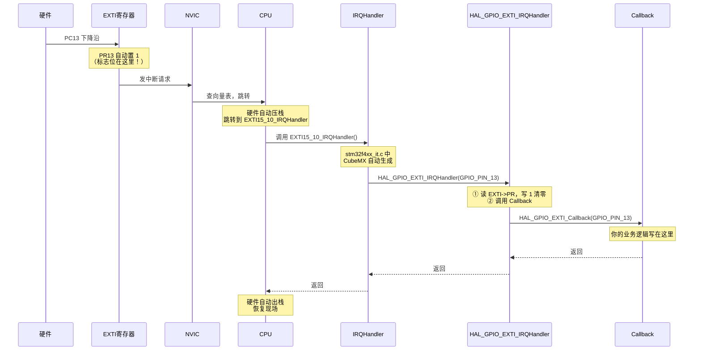

### 代码对照

```c
// ========== stm32f4xx_it.c（CubeMX 自动生成）==========
void EXTI15_10_IRQHandler(void) {
    // 你几乎不需要改这个函数
    HAL_GPIO_EXTI_IRQHandler(GPIO_PIN_13);
}

// ========== stm32f4xx_hal_gpio.c（HAL 库源码）==========
void HAL_GPIO_EXTI_IRQHandler(uint16_t GPIO_Pin) {
    // ① 清 PR 标志位（写 1 清零）
    if (__HAL_GPIO_EXTI_GET_IT(GPIO_Pin) != 0x00u) {
        __HAL_GPIO_EXTI_CLEAR_IT(GPIO_Pin);  // EXTI->PR = GPIO_Pin;
        
        // ② 调用回调
        HAL_GPIO_EXTI_Callback(GPIO_Pin);
    }
}

// ========== main.c 或其他 .c（你写的）==========
void HAL_GPIO_EXTI_Callback(uint16_t GPIO_Pin) {
    if (GPIO_Pin == GPIO_PIN_13) {
        // 你的业务逻辑
        HAL_GPIO_TogglePin(GPIOA, GPIO_PIN_5);
    }
}
```

---

## 【解决方案】

### 回答你的两个问题

| 问题 | 答案 |
|------|------|
| 实际中断逻辑写在回调函数里吗？ | **是的**，Callback 是你写业务的地方 |
| IRQHandler 接收中断标志位，促使调用回调吗？ | **不准确**，IRQHandler 是被硬件调用的，它去读寄存器清标志位，然后调 Callback |

### 为什么 HAL 要这样设计？

```
设计目的：分离"框架代码"和"业务代码"

框架代码（HAL 库 + CubeMX 生成）：
  - IRQHandler：中断入口
  - HAL_GPIO_EXTI_IRQHandler：清标志位
  - 这些代码你不应该改

业务代码（你写的）：
  - HAL_GPIO_EXTI_Callback：你的逻辑
  - CubeMX 重新生成代码时不会覆盖你的 Callback
```

---

## 【大师的工程建议】

### 记忆口诀

```
硬件调 IRQ，IRQ 调 HAL，
HAL 清标志，HAL 调回调。
你只管回调，其他别乱动。
```

### 三层职责

```
┌─────────────────────────────────────────┐
│  IRQHandler（中断入口）                   │
│  - 由硬件自动调用                         │
│  - CubeMX 生成，不要改                    │
└─────────────────────────────────────────┘
                    ↓
┌─────────────────────────────────────────┐
│  HAL_GPIO_EXTI_IRQHandler（框架层）       │
│  - 清 PR 标志位                          │
│  - 调用 Callback                         │
│  - HAL 库内部实现，不要改                 │
└─────────────────────────────────────────┘
                    ↓
┌─────────────────────────────────────────┐
│  HAL_GPIO_EXTI_Callback（业务层）         │
│  - 你写业务逻辑的地方                     │
│  - 在任意 .c 文件中重写即可               │
└─────────────────────────────────────────┘
```

### 避坑指南

| 错误做法 | 后果 | 正确做法 |
|---------|------|---------|
| 在 IRQHandler 里写逻辑 | CubeMX 重新生成会覆盖 | 写在 Callback 里 |
| 手动清 PR 标志位 | HAL 已经清了，重复清无害但多余 | 不用管，HAL 自动清 |
| 忘记重写 Callback | 中断能进，但没反应 | 在 main.c 或单独 .c 中实现 Callback |

---

**一句话总结**：硬件调 IRQHandler → IRQHandler 调 HAL 函数 → HAL 函数清标志位并调 Callback → 你在 Callback 里写业务。标志位在寄存器里，不是"传给"谁的。
[Timestamp: 2026/04/26 10:44:57]

**user**: 我对从模式和主模式感到疑惑，主模式是不是就是ARR空子CNT的变化啊，然而从模式会被外围输入信号控制CNT
[Context: Notes: 嵌入式/硬件与芯片/外设/TIM定时器基础概念.md]
[Timestamp: 2026/04/26 11:05:51]

**ai**: ## 【问题诊断】

你的理解有**关键误区**：

| 你的理解 | 实际情况 |
|---------|---------|
| 主模式 = ARR 控制 CNT | ❌ ARR 控制 CNT 是**时基功能**，跟主模式无关 |
| 从模式 = 外围信号控制 CNT | ✅ 方向对，但需要更清晰 |

---

## 【根本原因分析】

### 三个概念要分开

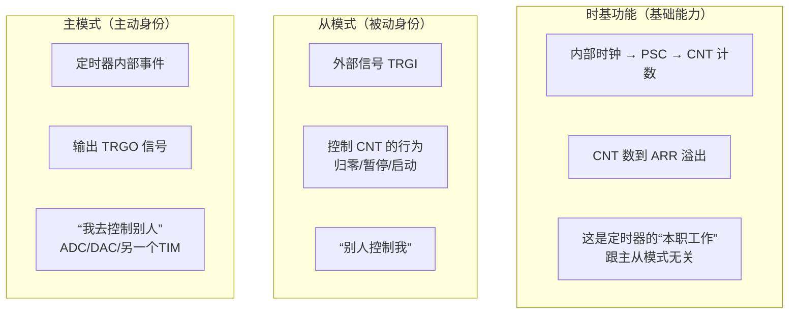

### ARR 控制 CNT ≠ 主模式

```
ARR 控制 CNT 的过程：

CNT 从 0 开始数
数到 ARR 时溢出
产生 Update Event
CNT 回到 0 继续数

这是定时器的“自我管理”，是时基单元的基本功能。
没有任何“控制别人”的动作，所以不是主模式。
```

### 主模式：定时器控制别人

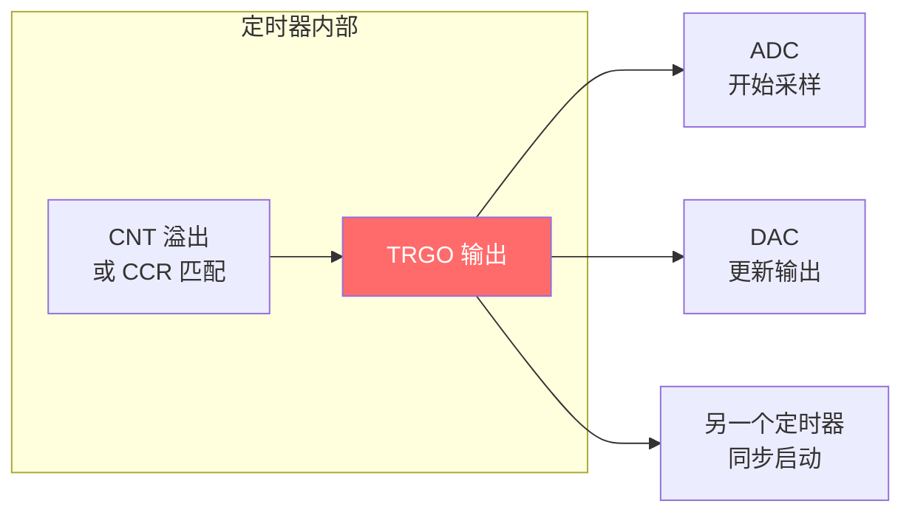

**主模式的核心**：定时器把自己的内部事件（溢出、比较等）变成 TRGO 信号，**主动去触发其他外设**。

### 从模式：别人控制定时器

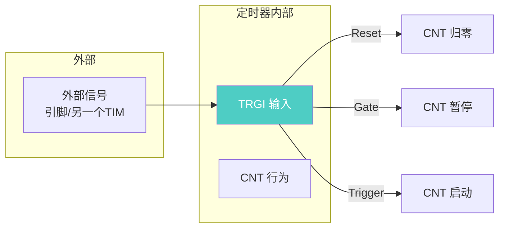

**从模式的核心**：外部信号通过 TRGI **控制 CNT 的行为**（归零、暂停、启动）。

---

## 【解决方案】

### 一句话区分

```
时基功能：CNT 自己数数，ARR 定义边界（内部自我管理）
从模式：外部信号控制 CNT 的行为（别人控制我）
主模式：定时器输出信号控制其他外设（我去控制别人）
```

### 对比表

| 概念 | 回答的问题 | 信号流向 | 典型场景 |
|------|-----------|---------|---------|
| 时基功能 | CNT 怎么数？ | 内部时钟 → CNT | 定时中断、PWM 输出 |
| 从模式 | 谁控制 CNT 的行为？ | 外部 → TRGI → CNT | PWM 输入、编码器 |
| 主模式 | 定时器能控制谁？ | 内部事件 → TRGO → 其他外设 | 触发 ADC 采样 |

### 实例对照

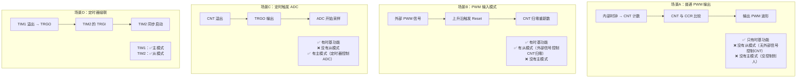

---

## 【大师的工程建议】

### 记忆口诀

```
ARR 管 CNT 是本职工作，不是主模式。
从模式是"我被控"，主模式是"我控人"。
一个定时器可以同时是主和从。
```

### 判断方法

问自己两个问题：

1. **有没有外部信号控制 CNT 的行为？**
   - 有 → 涉及从模式
   - 没有 → 不涉及从模式

2. **定时器有没有输出信号去控制其他外设？**
   - 有 → 涉及主模式
   - 没有 → 不涉及主模式

### 常见误区

| 误区 | 纠正 |
|------|------|
| PWM 输出用了主模式 | ❌ PWM 输出只是时基功能，没有控制别人 |
| ARR 溢出就是主模式 | ❌ ARR 溢出是时基功能，除非把溢出变成 TRGO 去触发 ADC |
| 从模式一定要有主模式 | ❌ 两者独立，可以只用从模式（如 PWM 输入） |

---

**一句话总结**：ARR 控制 CNT 是定时器的"本职工作"（时基功能），主模式是"我去控制别人"，从模式是"别人控制我"。三者是不同维度的概念。
[Timestamp: 2026/04/26 11:06:29]

**user**: 所以说编码器是用的从模式的Trigger Mode吗
[Context: Notes: 嵌入式/硬件与芯片/外设/TIM定时器基础概念.md]
[Timestamp: 2026/04/26 11:14:23]

**ai**: ## 【问题诊断】

你的理解**方向对了一半**：

- ✅ 编码器确实属于"从模式"范畴（CNT 受外部信号控制）
- ❌ 但不是 Trigger Mode，而是**独立的 Encoder Mode**

---

## 【根本原因分析】

### Trigger Mode vs Encoder Mode

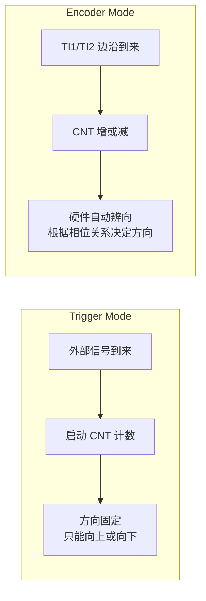

### 核心区别

| 特性 | Trigger Mode | Encoder Mode |
|------|-------------|--------------|
| 触发源 | 单个外部信号 | TI1 + TI2 两路信号 |
| CNT 行为 | 启动计数 | 增/减计数 |
| 方向控制 | 固定方向 | **硬件自动辨向** |
| 用途 | 同步启动 | 电机编码器 |

### 编码器模式的"辨向"能力

```
编码器信号：
  TI1: ____|‾‾‾‾|____|‾‾‾‾|____
  TI2: ___|‾‾‾‾|____|‾‾‾‾|_____
            相位差 90°

正转时：TI1 超前 TI2
  TI1 上升沿时 TI2 = 低 → CNT++
  TI1 下降沿时 TI2 = 高 → CNT++

反转时：TI2 超前 TI1
  TI1 上升沿时 TI2 = 高 → CNT--
  TI1 下降沿时 TI2 = 低 → CNT--
```

**这是 Trigger Mode 做不到的** —— Trigger Mode 只能"启动"，不能"辨向"。

---

## 【解决方案】

### STM32 的从模式配置（SMCR 寄存器）

```
SMS[2:0] 位配置：

000 = 禁止从模式（普通时基）
001 = Encoder Mode 1（TI1 边沿计数，自动辨向）
010 = Encoder Mode 2（TI2 边沿计数，自动辨向）
011 = Encoder Mode 3（TI1+TI2 都计数，4倍频）← 最常用
100 = Reset Mode（外部信号让 CNT 归零）
101 = Gated Mode（外部信号控制 CNT 暂停）
110 = Trigger Mode（外部信号启动 CNT）
111 = External Clock Mode 1（外部信号作为时钟源）
```

### 编码器模式是独立的

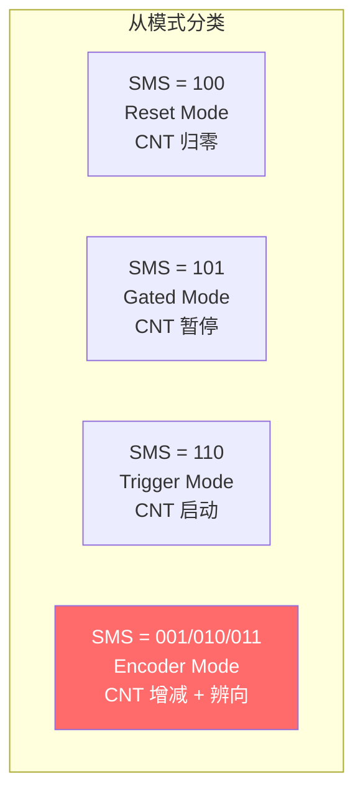

**Encoder Mode 是从模式的一个独立分支**，与 Trigger Mode 平级，不是它的子集。

---

## 【大师的工程建议】

### 记忆口诀

```
Trigger 只管"启"，Encoder 能"辨向"。
编码器模式是从模式家族的独立成员，不是 Trigger 的变种。
```

### 编码器模式的硬件优势

```c
// 软件中断编码器（你之前学的）
void EXTI_Callback(void) {
    if (HAL_GPIO_ReadPin(A) == HIGH) {
        if (HAL_GPIO_ReadPin(B) == LOW) count++;
        else count--;
    }
    // 问题：CPU 每次都要响应中断，频率高了扛不住
}

// 硬件编码器模式
// 配置后，CNT 自动增减，CPU 完全不用管
// TI1/TI2 边沿 → 硬件自动辨向 → CNT 自动变化
// CPU 只需要定时读取 CNT 值即可
```

| 方案 | CPU 负担 | 最高频率 | 适用场景 |
|------|---------|---------|---------|
| 软件中断编码器 | 高（每次中断） | < 100kHz | 低速、引脚不够 |
| 硬件编码器模式 | 零（硬件自动） | MHz 级别 | 高速电机控制 |

### HAL 库配置示例

```c
// 编码器模式配置（TIM3 为例）
TIM_Encoder_InitTypeDef sEncoderConfig = {0};

sEncoderConfig.EncoderMode = TIM_ENCODERMODE_TI12;  // SMS = 011，4倍频
sEncoderConfig.IC1Polarity = TIM_ICPOLARITY_RISING;
sEncoderConfig.IC2Polarity = TIM_ICPOLARITY_RISING;

HAL_TIM_Encoder_Init(&htim3, &sEncoderConfig);
HAL_TIM_Encoder_Start(&htim3, TIM_CHANNEL_ALL);

// 之后只需要读取 CNT
int32_t encoder_count = __HAL_TIM_GET_COUNTER(&htim3);
```

---

**一句话总结**：编码器用的是 **Encoder Mode**，是从模式的独立分支，比 Trigger Mode 更强大 —— 不仅响应外部信号，还能硬件自动辨向。
[Timestamp: 2026/04/26 11:15:02]

**user**: 我的问题是UART是不是分为很多种，分为TTL,Rs232,RS485等，和电脑串口通信用的什么？
[Context: Notes: 嵌入式/通信/传输层/1. UART的基础理解.md]
[Timestamp: 2026/04/26 11:34:24]

**ai**: ## 【问题诊断】

你的理解有**概念混淆**：

| 你的理解 | 实际情况 |
|---------|---------|
| UART 分为 TTL、RS232、RS485 | ❌ UART 是协议层，TTL/RS232/RS485 是物理层 |
| 它们是 UART 的"种类" | ❌ 它们是同一协议的**不同物理实现** |

---

## 【根本原因分析】

### 分层视角

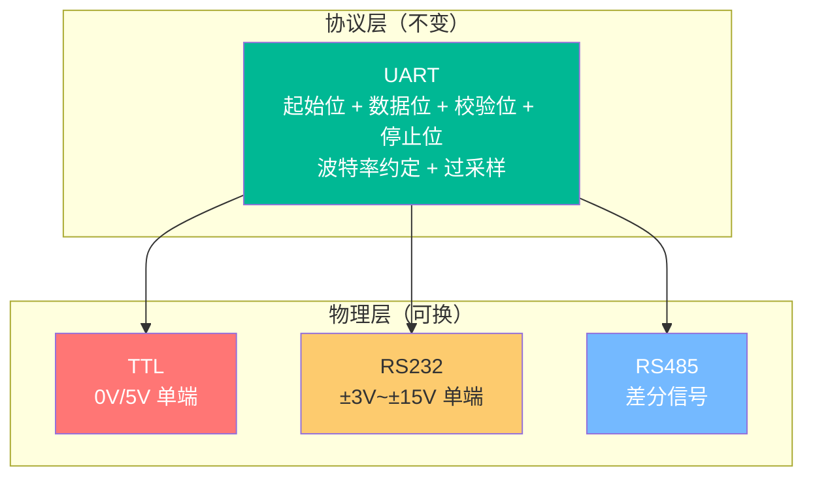

### 类比理解

```
协议层 = 语言规则（中文语法）
物理层 = 传播方式（说话、写字、发微信）

你说中文（UART协议）：
  - 用嘴说（TTL）→ 近距离，声音小
  - 用大喇叭喊（RS232）→ 远一点，声音大
  - 用无线电（RS485）→ 很远，抗干扰

不管用什么方式，说的还是中文（UART帧结构不变）
```

### 三种物理层对比

| 物理层 | 电平标准 | 传输距离 | 典型场景 |
|--------|---------|---------|---------|
| TTL | 0V/3.3V/5V | 几十厘米 | MCU 之间、板内通信 |
| RS232 | ±3V ~ ±15V | ~15米 | 传统 PC 串口、工业设备 |
| RS485 | 差分 ±0.2V | ~1200米 | 工业总线、多设备 |

---

## 【解决方案】

### 和电脑串口通信用什么？

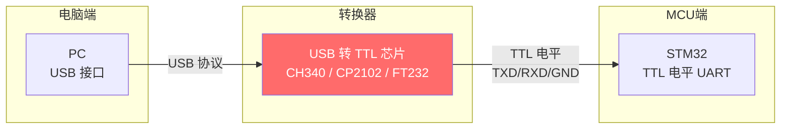

### 常见场景对照

| 场景 | 物理层 | 连接方式 |
|------|--------|---------|
| MCU ↔ PC（开发调试） | **TTL** | USB 转 TTL 模块（CH340） |
| MCU ↔ 传统 PC 串口 | RS232 | MAX232 电平转换 |
| MCU ↔ 工业设备总线 | RS485 | MAX485 差分转换 |

### 为什么不用 RS232 直连？

```
问题：MCU 是 TTL 电平（0~3.3V），PC 串口是 RS232（±12V）

直接连的后果：
  PC 发送 -12V → MCU 引脚承受不了 → 烧毁！
  
解决方案：
  方案A：USB 转 TTL 模块（最常用）
    PC USB → CH340 → TTL → MCU
    
  方案B：RS232 电平转换（老式 PC）
    PC 串口 → MAX232 → TTL → MCU
```

---

## 【大师的工程建议】

### 记忆口诀

```
UART 是协议，定义"怎么聊"。
TTL/RS232/RS485 是物理层，定义"用什么传"。
协议不变，物理层可换。
```

### 实际开发中的选择

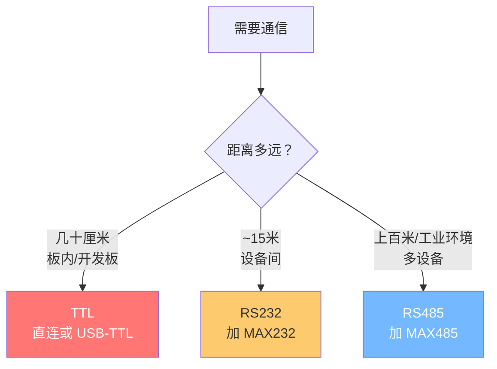

### 避坑指南

| 陷阱 | 后果 | 解决 |
|------|------|------|
| RS232 直连 MCU | 烧引脚 | 用 USB-TTL 或电平转换 |
| 忘接 GND | 通信乱码/失败 | TXD/RXD/GND 三根线都要接 |
| TXD 接 TXD | 不通 | **交叉连接**：TXD→RXD，RXD→TXD |
| 波特率不匹配 | 乱码 | 确保双方波特率一致 |

---

**一句话总结**：UART 是协议（帧格式），TTL/RS232/RS485 是物理层（电平标准）。和电脑通信用 **USB 转 TTL 模块**（如 CH340），把 USB 转成 MCU 能接受的 TTL 电平。
[Timestamp: 2026/04/26 11:34:58]

**user**: Master_Transmit 和 Mem_Write 的区别
[Context: Notes: 嵌入式/操作库/STM-HAL库/I2C.md]
[Timestamp: 2026/04/26 11:59:20]

**ai**: ## 【问题诊断】

这是 I2C HAL 库最核心的区分点。你的笔记里已经提到了，但我带你从**协议时序层面**深入理解本质区别。

---

## 【根本原因分析】

### 协议时序对比

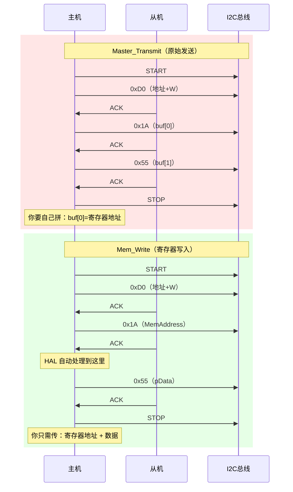

**时序完全一样**，区别在于**谁负责拼寄存器地址**。

### 代码层面对比

```c
// ========== Master_Transmit：手动拼 buf ==========
uint8_t buf[2];
buf[0] = 0x1A;   // 你自己把寄存器地址放进 buf[0]
buf[1] = 0x55;   // 数据放 buf[1]
HAL_I2C_Master_Transmit(&hi2c1, 0xD0, buf, 2, 100);
// 问题：写多个寄存器时要自己拼很长的 buf

// ========== Mem_Write：HAL 帮你处理 ==========
uint8_t data = 0x55;
HAL_I2C_Mem_Write(&hi2c1, 0xD0, 0x1A, I2C_MEMADD_SIZE_8BIT, &data, 1, 100);
// HAL 内部自动先发 0x1A，再发 0x55
// 你只需关心：寄存器地址 + 数据
```

---

## 【解决方案】

### 一句话区分

| 函数 | 本质 | 你要做的 |
|------|------|---------|
| `Master_Transmit` | 原始字节流发送 | 自己拼 buf（含寄存器地址） |
| `Mem_Write` | 寄存器写入 | 只传寄存器地址 + 数据 |

### 选择依据

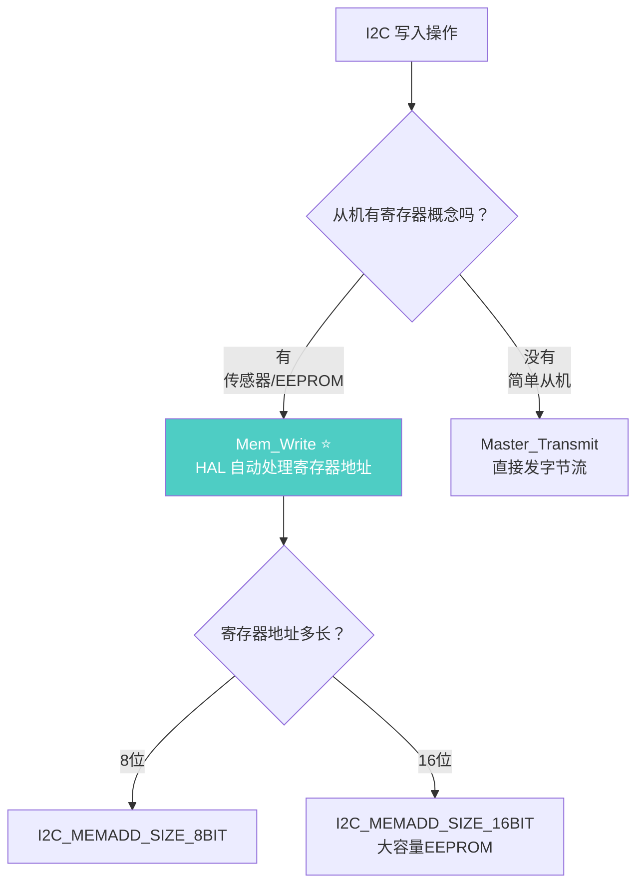

### 实际场景对照

| 场景 | 推荐函数 | 原因 |
|------|---------|------|
| 读 MPU6050 加速度 | `Mem_Read` | 寄存器结构，HAL 自动处理 |
| 写 24C02 EEPROM | `Mem_Write` | 有地址概念，16位地址 |
| 控制 I2C GPIO 扩展芯片 | `Master_Transmit` | 可能无寄存器概念 |
| 扫描总线设备 | `Master_Transmit` | 只发地址，无数据 |

---

## 【大师的工程建议】

### 为什么 HAL 要提供两个？

```
设计意图：分离"协议层"和"设备层"

Master_Transmit：
  - 协议层 API，只管发字节
  - 不理解"寄存器"概念
  - 通用性强，适配所有 I2C 设备

Mem_Write：
  - 设备层 API，理解"寄存器地址"
  - 封装了"先发地址再发数据"的常见模式
  - 90% 的传感器/EEPROM 场景更方便
```

### 避坑指南

| 陷阱 | 后果 | 正确做法 |
|------|------|---------|
| `Mem_Write` 忘设 `MemAddSize` | 地址发错 | 8位用 `I2C_MEMADD_SIZE_8BIT` |
| `Master_Transmit` 忘拼寄存器地址 | 写到错误位置 | buf[0] 放寄存器地址 |
| 连续写多寄存器用多次 `Mem_Write` | 效率低 | 用 `Master_Transmit` 一次发完 |

### 连续写多寄存器的技巧

```c
// 需求：向寄存器 0x1A 开始连续写 4 个字节

// ❌ 低效做法：调 4 次 Mem_Write
HAL_I2C_Mem_Write(&hi2c1, 0xD0, 0x1A, I2C_MEMADD_SIZE_8BIT, &data1, 1, 100);
HAL_I2C_Mem_Write(&hi2c1, 0xD0, 0x1B, I2C_MEMADD_SIZE_8BIT, &data2, 1, 100);
HAL_I2C_Mem_Write(&hi2c1, 0xD0, 0x1C, I2C_MEMADD_SIZE_8BIT, &data3, 1, 100);
HAL_I2C_Mem_Write(&hi2c1, 0xD0, 0x1D, I2C_MEMADD_SIZE_8BIT, &data4, 1, 100);

// ✅ 高效做法：利用寄存器自动递增特性
uint8_t buf[5] = {0x1A, data1, data2, data3, data4};
HAL_I2C_Master_Transmit(&hi2c1, 0xD0, buf, 5, 100);
// 大多数传感器支持寄存器地址自动递增
// 写完 0x1A 后，下一个字节自动写到 0x1B，以此类推
```

---

**一句话总结**：`Master_Transmit` 是原始字节流发送（你自己拼 buf），`Mem_Write` 是寄存器写入（HAL 帮你处理寄存器地址）。90% 的传感器/EEPROM 场景用 `Mem_Write`/`Mem_Read`。
[Timestamp: 2026/04/26 11:59:57]

**user**: 我有一个问题，就是这几个0xD0，0xD1啊是什么鬼寄存器啊？，我知道后面一位是要进行读写的寄存器，这个寄存器是什么
[Context: Notes: 嵌入式/操作库/STM-HAL库/I2C.md]
[Timestamp: 2026/04/26 12:06:29]

**ai**: ## 【问题诊断】

你混淆了**两个不同的"地址"概念**：

| 你以为的 | 实际是 |
|---------|--------|
| 0xD0/0xD1 是寄存器地址 | ❌ 这是**从机地址**（设备地址） |
| 后面一位是读写位 | ✅ 对，但它是地址的一部分 |

---

## 【根本原因分析】

### I2C 地址帧结构

```
第一个字节（地址帧）：

┌─────────────────────────────┬─────┐
│   高 7 位：从机地址          │ R/W │
│   (Device Address)          │ 位  │
├─────────────────────────────┼─────┤
│  1  1  0  1  0  0  0        │  0  │  = 0xD0（写）
│  1  1  0  1  0  0  0        │  1  │  = 0xD1（读）
└─────────────────────────────┴─────┘
         ↓
    7位地址 = 0x68（MPU6050 的地址）
```

### 两种地址的区别

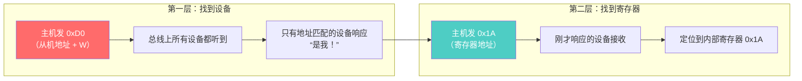

### 完整时序

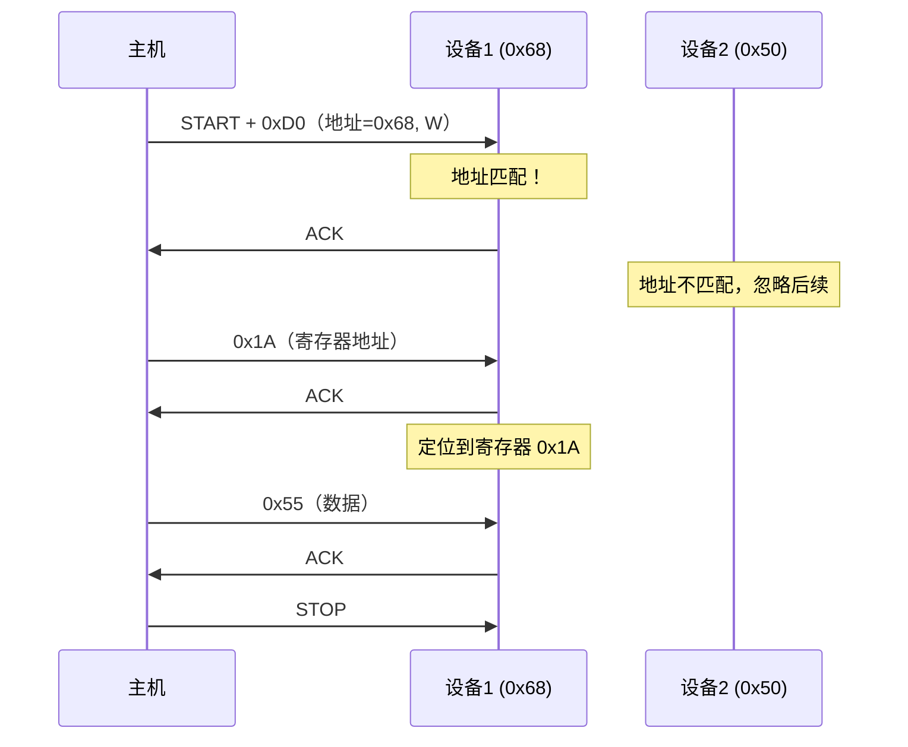

---

## 【解决方案】

### 地址拆解

```
0xD0 = 1101 0000
       ├─────┤ ├┤
       0x68   W（写）
       
0xD1 = 1101 0001
       ├─────┤ ├┤
       0x68   R（读）

7位地址 = 0x68（MPU6050 默认地址）
```

### HAL 库中的处理

```c
// HAL 库要求传入"已左移的地址"（含 R/W 位）
HAL_I2C_Mem_Write(&hi2c1, 0xD0, 0x1A, ...);
//                       ↑     ↑
//                  从机地址   寄存器地址
//                  （含R/W）  （设备内部）

// 如果你只有 7 位地址，要自己左移
uint8_t dev_addr = 0x68;           // 7 位地址
uint8_t write_addr = dev_addr << 1; // 左移后 = 0xD0
uint8_t read_addr = (dev_addr << 1) | 0x01; // = 0xD1
```

### 常见设备的 7 位地址

| 设备 | 7 位地址 | 写地址 | 读地址 |
|------|---------|--------|--------|
| MPU6050 | 0x68 | 0xD0 | 0xD1 |
| BMP280 | 0x76 | 0xEC | 0xED |
| 24C02 EEPROM | 0x50 | 0xA0 | 0xA1 |
| OLED SSD1306 | 0x3C | 0x78 | 0x79 |

---

## 【大师的工程建议】

### 记忆口诀

```
先找设备（从机地址），再找寄存器（寄存器地址）。
0xD0/0xD1 是"门牌号"，0x1A 是"房间号"。
```

### 类比理解

```
I2C 总线 = 一栋公寓楼
从机地址 = 门牌号（找到哪一户）
寄存器地址 = 房间号（找到具体房间）

主机喊："0x68 户的！"（发 0xD0）
设备 0x68："到！"（ACK）
主机："我要 0x1A 房间"（发寄存器地址）
设备 0x68：定位到寄存器 0x1A
```

### HAL 库地址参数规则

```c
// 规则：HAL 库要的是"8位地址"（7位地址左移后）

// ✅ 正确写法
HAL_I2C_Mem_Write(&hi2c1, 0xD0, 0x1A, ...);  // 直接用 8 位
HAL_I2C_Mem_Write(&hi2c1, 0x68<<1, 0x1A, ...); // 或 7 位左移

// ❌ 错误写法
HAL_I2C_Mem_Write(&hi2c1, 0x68, 0x1A, ...);  // 忘了左移！
// HAL 会发 0xD0 变成发 0xD0，但内部计算会出错
```

### 避坑指南

| 陷阱 | 后果 | 解决 |
|------|------|------|
| 传 7 位地址没左移 | 通信失败 | 传 `0x68 << 1` 或直接写 `0xD0` |
| 混淆从机地址和寄存器地址 | 概念混乱 | 从机地址找设备，寄存器地址找寄存器 |
| 不同设备地址相同 | 冲突 | 改硬件引脚配置（如 MPU6050 的 AD0） |

---

**一句话总结**：`0xD0/0xD1` 是**从机地址**（7位地址 0x68 + R/W 位），用于在总线上找到目标设备；后面的 `0x1A` 才是**寄存器地址**，用于定位设备内部的寄存器。
[Timestamp: 2026/04/26 12:07:04]

**user**: 关于CAN总线，我有个疑问：仲裁场和控制场里面的数据都是什么？
[Context: Notes: 嵌入式/通信/传输层/4. CAN的基础理解.md]
[Timestamp: 2026/04/26 13:11:58]

**ai**: ## 【问题诊断】

你的笔记里提到了仲裁场和控制场的长度，但没有展开**每个 bit 的具体含义**。这两个字段是 CAN 帧的"头部"，决定了消息的优先级和数据长度。

---

## 【根本原因分析】

### 仲裁场详解

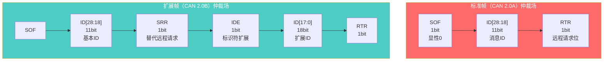

### 各字段含义

| 字段 | 长度 | 含义 | 值 |
|------|------|------|-----|
| **ID[28:18]** | 11 bit | 基本消息 ID | 决定优先级，值越小优先级越高 |
| **RTR** | 1 bit | 远程传输请求 | 0=数据帧，1=远程帧（请求数据） |
| **SRR** | 1 bit | 替代远程请求 | 扩展帧专用，固定为隐性1，占位用 |
| **IDE** | 1 bit | 标识符扩展 | 0=标准帧，1=扩展帧 |
| **ID[17:0]** | 18 bit | 扩展 ID | 扩展帧才有，和基本 ID 组成 29 位 ID |

### 控制场详解

```
控制场结构（6 bit）：

┌─────────┬────────┬──────────────────────┐
│   IDE   │   r0   │        DLC           │
│  1 bit  │  1 bit │       4 bit          │
└─────────┴────────┴──────────────────────┘
    ↓         ↓              ↓
 帧类型    保留位      数据长度码
```

| 字段 | 长度 | 含义 | 说明 |
|------|------|------|------|
| **IDE** | 1 bit | 标识符扩展 | 标准帧在仲裁场，扩展帧在控制场 |
| **r0** | 1 bit | 保留位 | 固定为隐性1，预留未来扩展 |
| **DLC** | 4 bit | 数据长度码 | 0~8，表示数据场有多少字节 |

### DLC 编码表

```
DLC[3:0]  →  数据字节数
─────────────────────────
  0000    →    0 字节
  0001    →    1 字节
  0010    →    2 字节
  ...
  1000    →    8 字节
  1001~1111 →  保留（CAN FD 可用到 64 字节）
```

---

## 【解决方案】

### 完整帧结构图

```
标准帧（CAN 2.0A）：

┌─────┬──────────────────┬───────────────┬──────────┬─────┬─────┬─────┬─────┐
│ SOF │     仲裁场        │    控制场      │  数据场   │ CRC │ ACK │ EOF │ IFS │
│ 1b  │ ID[10:0] + RTR   │ IDE+r0+DLC   │ 0~8字节  │16b  │ 2b  │ 7b  │ 3b  │
│     │     12 bit       │    6 bit      │          │     │     │     │     │
└─────┴──────────────────┴───────────────┴──────────┴─────┴─────┴─────┴─────┘

扩展帧（CAN 2.0B）：

┌─────┬────────────────────────────────────┬───────────┬──────────┬─────┐
│ SOF │            仲裁场                   │  控制场    │  数据场   │ ... │
│ 1b  │ ID[28:18]+SRR+IDE+ID[17:0]+RTR    │ r1+r0+DLC │ 0~8字节  │     │
│     │            32 bit                  │   6 bit   │          │     │
└─────┴────────────────────────────────────┴───────────┴──────────┴─────┘
```

### RTR 位的作用

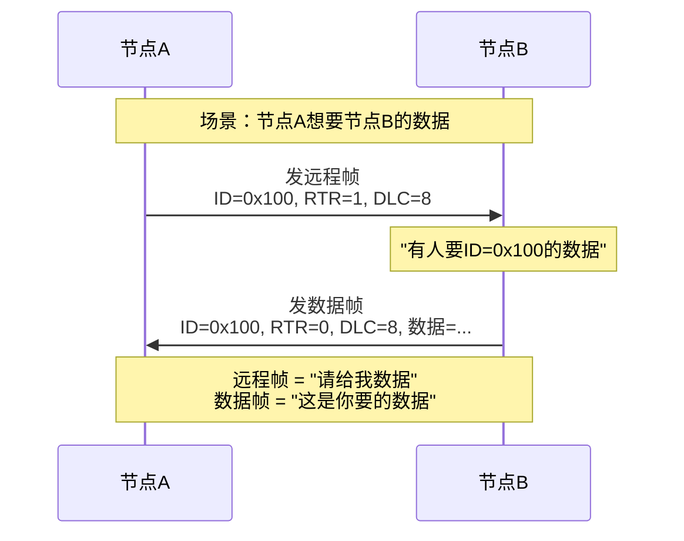

---

## 【大师的工程建议】

### 记忆口诀

```
仲裁场：ID + RTR（我是谁 + 要干嘛）
控制场：IDE + r0 + DLC（帧类型 + 预留 + 数据多长）
```

### 工程实践要点

| 要点 | 说明 |
|------|------|
| **ID 分配策略** | 紧急消息给小 ID（如刹车 0x010），普通消息给大 ID（如仪表 0x500） |
| **标准帧 vs 扩展帧** | 优先用标准帧（11 位 ID 够用），ID 超过 2048 才用扩展帧 |
| **DLC 必须正确** | 发 4 字节就写 DLC=4，写错会导致接收方解析混乱 |
| **RTR 几乎不用** | 现代应用很少用远程帧，基本都是主动推送的数据帧 |

### 避坑指南

| 陷阱 | 后果 | 解决 |
|------|------|------|
| ID 分配随意 | 紧急消息被普通消息阻塞 | 设计阶段规划 ID 分配表 |
| 混用标准帧和扩展帧 | 仲裁行为复杂 | 统一用一种格式 |
| DLC 写错 | 接收方数据解析错误 | DLC = 实际数据长度 |
| 扩展帧 IDE 位写错 | 被识别为标准帧 | 扩展帧 IDE 必须为 1 |

---

**一句话总结**：仲裁场 = **消息 ID + RTR**（决定优先级和帧类型），控制场 = **IDE + r0 + DLC**（标识扩展帧 + 数据长度）。ID 越小优先级越高，DLC 告诉接收方数据有多少字节。
[Timestamp: 2026/04/26 13:12:44]

**user**: 回调函数和钩子函数有什么区别
[Context: Notes: 嵌入式/操作库/STM-HAL库/SPI.md]
[Timestamp: 2026/04/26 13:21:00]

**ai**: ## 【问题诊断】

这是一个**概念辨析**问题。两者本质相似，但**使用场景和设计意图不同**。

---

## 【根本原因分析】

### 核心区别


### 对比表

| 维度 | 回调函数 | 钩子函数 |
|------|---------|---------|
| **本质** | 函数指针，作为参数传递 | 特殊的回调，预留扩展点 |
| **意图** | 事件通知 | 流程拦截/扩展 |
| **调用者** | 框架/库 | 操作系统/框架 |
| **典型场景** | 中断完成、传输完成 | 空闲任务、栈溢出、内存分配失败 |
| **默认行为** | 通常无默认实现 | 通常有弱定义默认实现 |
| **数量** | 一个事件可注册多个回调 | 一个钩子点通常只有一个实现 |

---

## 【解决方案】

### 回调函数示例（HAL 库）

```c
// HAL 库定义回调（弱定义，可覆盖）
__weak void HAL_GPIO_EXTI_Callback(uint16_t GPIO_Pin) {
    // 默认空实现，什么都不做
}

// 你在代码中覆盖
void HAL_GPIO_EXTI_Callback(uint16_t GPIO_Pin) {
    if (GPIO_Pin == GPIO_PIN_13) {
        HAL_GPIO_TogglePin(GPIOA, GPIO_PIN_5);
    }
}

// HAL 库内部调用
void HAL_GPIO_EXTI_IRQHandler(uint16_t GPIO_Pin) {
    __HAL_GPIO_EXTI_CLEAR_IT(GPIO_Pin);
    HAL_GPIO_EXTI_Callback(GPIO_Pin);  // 调用你的回调
}
```

**特点**：事件发生 → 框架调用你的函数 → 你处理事件

### 钩子函数示例

```c
// FreeRTOS 配置启用钩子
#define configUSE_IDLE_HOOK         1
#define configUSE_STACK_OVERFLOW_HOOK 1

// 空闲任务钩子 —— 系统空闲时自动调用
void vApplicationIdleHook(void) {
    // 进入低功耗模式
    __WFI();
}

// 栈溢出钩子 —— 检测到栈溢出时调用
void vApplicationStackOverflowHook(TaskHandle_t xTask, char *pcTaskName) {
    // 记录错误、重启系统
    printf("Stack overflow: %s\n", pcTaskName);
    NVIC_SystemReset();
}

// 内存分配失败钩子
void vApplicationMallocFailedHook(void) {
    printf("Malloc failed!\n");
    NVIC_SystemReset();
}
```

**特点**：系统运行到特定点 → 检查是否有钩子 → 调用你的钩子函数

### 时序对比

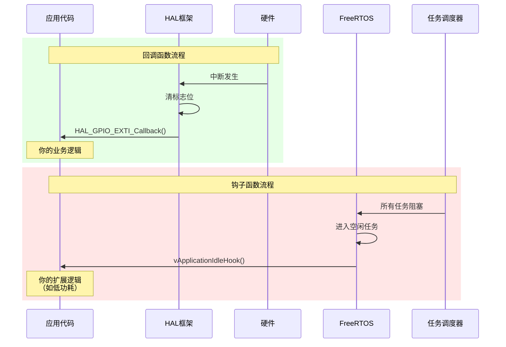

---

## 【大师的工程建议】

### 记忆口诀

```
回调是"通知"，钩子是"拦截"。
回调说"事情做完了"，钩子说"我要插一手"。
```

### 类比理解

```
回调函数 = 快递送达通知
  快递员把包裹送到 → 发短信通知你 → 你去取件
  你不能改变快递流程，只是被通知

钩子函数 = 机场安检拦截点
  你要登机 → 必须经过安检 → 安检可以检查、拦截、放行
  安检是流程中的固定环节，可以扩展检查内容
```

### 实际开发中的区分

| 场景 | 用回调还是钩子？ |
|------|-----------------|
| UART 接收完成处理 | 回调（`HAL_UART_RxCpltCallback`） |
| SPI 传输完成处理 | 回调（`HAL_SPI_TxRxCpltCallback`） |
| 系统空闲时进入低功耗 | 钩子（`vApplicationIdleHook`） |
| 检测栈溢出并记录 | 钩子（`vApplicationStackOverflowHook`） |
| 自定义内存分配失败处理 | 钩子（`vApplicationMallocFailedHook`） |

### 避坑指南

| 陷阱 | 后果 | 解决 |
|------|------|------|
| 钩子函数里做阻塞操作 | 系统卡死 | 钩子要快，不能阻塞 |
| 忘记启用钩子宏 | 钩子不执行 | FreeRTOS 要配置 `configUSE_xxx_HOOK` |
| 回调函数里调 `HAL_Delay` | 卡死（中断上下文） | 回调里不做阻塞操作 |
| 多次注册同一回调 | 覆盖，只有最后一个生效 | 回调是覆盖，不是追加 |

---

**一句话总结**：回调函数是**事件通知机制**（"事情做完了告诉我"），钩子函数是**流程扩展机制**（"我要插入到系统流程中"）。钩子是回调的一种特殊形式，更强调拦截和扩展能力。
[Timestamp: 2026/04/26 13:21:53]

**user**: 帮我添加笔记属性和C:\Users\tao93\Desktop\知识库\嵌入式\硬件与芯片\芯片\ARM Cortx-M4.md的格式一样
[Context: Notes: 嵌入式/硬件与芯片/芯片/Xtensa LX6 双核架构.md]
[Timestamp: 2026/04/26 13:47:29]

**ai**: 我需要先查看 `ARM Cortx-M4.md` 的格式。请提供该文件的内容，或者告诉我它的属性格式是什么样的（比如有哪些字段：title、date、tags 等）。

如果你希望我按照常见的 Obsidian 笔记属性格式来添加，我可以直接为你生成。请确认你想要的格式是否类似这样：

```yaml
---
title: Xtensa LX6 双核架构
date: 2026-04-09
tags:
  - 嵌入式
  - ESP32
  - Xtensa
  - 双核架构
categories:
  - 硬件与芯片/芯片
---
```

请提供 `ARM Cortx-M4.md` 的属性部分，我会按照相同格式为你修改当前笔记。
[Timestamp: 2026/04/26 13:47:49]

**user**: 我现在想要学习和优化这个文件的主题和知识点，我们来进行学习和讨论
[Timestamp: 2026/04/26 14:01:48]

**ai**: ## 【问题诊断】

当前笔记有几个优化点：

| 问题 | 说明 |
|------|------|
| 缺少属性 | 没有 YAML front matter |
| 表格格式 | 标题行末尾缺少 `\|` |
| 缺少嵌入式视角 | 没有结合 RTOS 任务概念 |
| 缺少图示 | 纯文字描述，缺少可视化 |
| 协程部分薄弱 | 嵌入式中的协程应用没展开 |

---

## 【优化后的笔记】

```markdown
---
title: 进程-线程-协程
date: 2026-01-27
tags:
  - 嵌入式
  - 操作系统
  - RTOS
  - 多任务
categories:
  - 操作系统与内核
---

## 一、核心概念对比

### 1.1 资源隔离模型

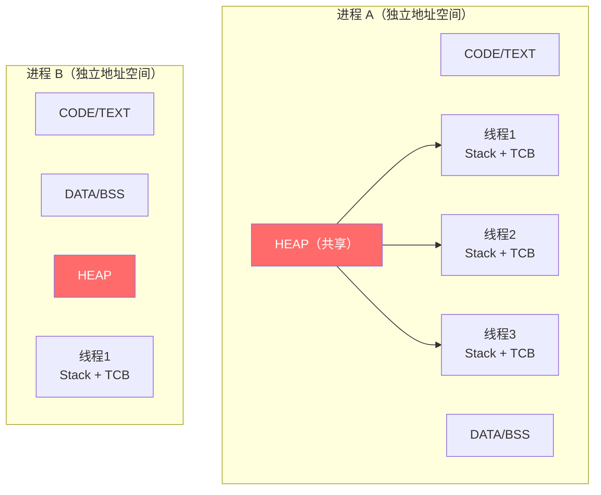

### 1.2 三者对比表

| 维度 | 进程 | 线程 | 协程 |
|------|------|------|------|
| 定义 | 资源分配的基本单位 | 执行调度的基本单位 | 用户态轻量级线程 |
| 地址空间 | 独立 | 共享所属进程 | 共享所属线程 |
| 切换开销 | 大（页表、Cache失效） | 中（寄存器+栈） | 小（纯用户态） |
| 切换者 | 内核 | 内核 | 用户程序 |
| 通信方式 | IPC（管道、共享内存） | 全局变量 | 共享内存、消息队列 |
| 适用场景 | 隔离性要求高 | 并发执行 | 高并发IO |

---

## 二、切换机制详解

### 2.1 进程切换（最重）

```mermaid
sequenceDiagram
    participant User as 用户态
    participant Kernel as 内核态
    participant HW as 硬件
    
    User->>Kernel: 系统调用/中断
    Note over Kernel: 保存当前进程上下文<br/>PC、SP、寄存器、页表基址
    Kernel->>HW: 刷新 TLB
    Kernel->>Kernel: 切换内核栈
    Note over Kernel: 加载新进程上下文<br/>新页表、新内核栈
    Kernel->>User: 返回用户态
    Note over HW: Cache 冷启动<br/>性能抖动
```

### 2.2 线程切换（中等）

```mermaid
sequenceDiagram
    participant User as 用户态
    participant Kernel as 内核态
    
    User->>Kernel: 系统调用/时间片中断
    Note over Kernel: 保存当前线程上下文<br/>PC、SP、通用寄存器
    Kernel->>Kernel: 切换栈指针
    Note over Kernel: 加载新线程上下文
    Kernel->>User: 返回用户态
    Note over User: 同一进程内<br/>地址空间不变
```

### 2.3 协程切换（最轻）

```mermaid
sequenceDiagram
    participant App as 应用程序
    
    Note over App: 协程A 执行
    App->>App: yield（主动让出）
    Note over App: 保存协程A上下文<br/>仅几个寄存器
    App->>App: 恢复协程B上下文
    Note over App: 协程B 执行
    Note over App: 无内核参与<br/>无系统调用
```

---

## 三、嵌入式视角：RTOS 任务模型

### 3.1 RTOS 任务 ≈ 线程

```
RTOS 任务模型：
  - 共享一个地址空间（扁平内存模型）
  - 每个任务有独立栈
  - 内核调度器负责切换
  - 本质上 = "轻量级线程"
```

```c
// FreeRTOS 任务创建
void vTask1(void *pvParameters) {
    while (1) {
        // 任务逻辑
        vTaskDelay(pdMS_TO_TICKS(100));
    }
}

void vTask2(void *pvParameters) {
    while (1) {
        // 任务逻辑
    }
}

int main(void) {
    xTaskCreate(vTask1, "Task1", 128, NULL, 1, NULL);
    xTaskCreate(vTask2, "Task2", 128, NULL, 1, NULL);
    vTaskStartScheduler();  // 启动调度器
}
```

### 3.2 RTOS 任务 vs Linux 进程

| 特性 | RTOS 任务 | Linux 进程 |
|------|----------|-----------|
| 地址空间 | 共享（无 MMU） | 独立（有 MMU） |
| 内存保护 | 无或弱（MPU 可选） | 强（MMU 硬件隔离） |
| 切换开销 | 微秒级 | 毫秒级 |
| 典型数量 | 几十个 | 上百个 |

### 3.3 嵌入式中的协程应用

```c
// 协程风格的状态机（Protothreads 库）
#include "pt.h"

static struct pt pt_led;

PT_THREAD(led_thread(struct pt *pt)) {
    PT_BEGIN(pt);
    
    while (1) {
        LED_ON();
        PT_SLEEP(pt, 500);  // 协程让出 500ms
        LED_OFF();
        PT_SLEEP(pt, 500);
    }
    
    PT_END(pt);
}

// 优势：无栈开销，适合资源受限 MCU
```

---

## 四、并发与并行

### 4.1 概念辨析

```mermaid
flowchart LR
    subgraph 并发["并发"]
        C1["单核 CPU"]
        C2["时间片轮转"]
        C3["宏观同时<br/>微观交替"]
        C1 --> C2 --> C3
    end
    
    subgraph 并行["并行"]
        P1["多核 CPU"]
        P2["同时执行"]
        P3["真正同时"]
        P1 --> P2 --> P3
    end
```

### 4.2 多线程的代价

```
多线程 ≠ 一定更快

开销来源：
  1. 线程创建销毁
  2. 上下文切换
  3. 缓存失效
  4. 锁竞争

适用场景：
  ✅ IO 密集型（等待时切换）
  ✅ 多核并行计算
  ❌ 计算密集型单核（切换反而慢）
```

---

## 五、工程避坑指南

| 陷阱 | 后果 | 解决 |
|------|------|------|
| 多线程共享数据不加锁 | 竞态条件、数据损坏 | 互斥锁、原子操作 |
| 死锁（循环等待） | 系统卡死 | 锁顺序、超时锁 |
| 栈溢出 | HardFault | RTOS 任务栈预留足够空间 |
| 优先级翻转 | 高优先级任务被阻塞 | 优先级继承协议 |
| 协程阻塞操作 | 整个线程阻塞 | 协程中只用非阻塞 API |

---

## 六、参考资源

- [Core Dumped - Race Conditions](https://www.youtube.com/watch?v=bhpzTWtee2A)
- [Core Dumped 频道](https://www.youtube.com/@CoreDumped/videos)
```

---

## 【大师的工程建议】

### 优化要点

1. **添加嵌入式视角**：RTOS 任务本质是线程，这是嵌入式开发者最相关的概念
2. **可视化切换过程**：用时序图展示三种切换的差异
3. **补充协程应用**：嵌入式资源受限场景下协程的价值
4. **工程避坑**：结合实际开发中的常见问题

### 你想深入哪个方向？

- RTOS 任务调度原理？
- 协程在 MCU 上的实现？
- 多线程同步机制（信号量、互斥锁）？
- 优先级翻转问题？
[Timestamp: 2026/04/26 14:02:39]

**user**: 我现在想要学习和理解一下C语言里面的自动初始化机制的原理和实现过程，请你一步一步的教我一下
[Context: Notes: 嵌入式/语言/C/工程/自动初始化机制.md]
[Timestamp: 2026/04/26 14:38:05]

**ai**: ## 【问题诊断】

这是一个**嵌入式底层核心机制**问题。很多工程师只知道"全局变量会自动初始化"，但不知道**谁在什么时候、用什么方式完成的初始化**。

---

## 【根本原因分析】

### 核心问题

```
C 语言规定：
  - 全局变量/静态变量未显式初始化时，自动初始化为 0
  - 显式初始化的全局变量，程序启动时就有初值

问题来了：
  - 这些变量在 Flash 里吗？→ 不全在
  - 谁把它们初始化的？→ 不是编译器，是启动代码
  - 什么时候初始化的？→ main() 之前
```

---

## 【第一步：理解内存布局】

### 程序的内存分段

```mermaid
flowchart TB
    subgraph Flash["Flash（只读）"]
        TEXT[".text<br/>代码段<br/>函数指令"]
        RO[".rodata<br/>只读数据<br/>字符串常量、const"]
        DATA_INIT[".data 初值<br/>初始化数据副本"]
    end
    
    subgraph SRAM["SRAM（可读写）"]
        DATA[".data<br/>已初始化全局变量"]
        BSS[".bss<br/>未初始化全局变量<br/>（自动清零）"]
        HEAP["HEAP<br/>堆区"]
        STACK["STACK<br/>栈区"]
    end
    
    DATA_INIT -->|"启动时复制"| DATA
    BSS -->|"启动时清零"| BSS
    
    style DATA_INIT fill:#ff6b6b,color:#fff
    style DATA fill:#4ecdc4,color:#fff
    style BSS fill:#74b9ff,color:#fff
```

### 为什么 .data 要存两份？

```c
int g_counter = 100;  // 已初始化全局变量

// 问题：这个 100 存在哪里？
// 
// 如果存在 SRAM：掉电就丢了，下次启动怎么恢复？
// 如果存在 Flash：运行时怎么修改？
//
// 答案：
//   1. 初值 100 存在 Flash 的 .data 初值区
//   2. 启动时，启动代码把它复制到 SRAM 的 .data 区
//   3. 程序运行时读写 SRAM 中的副本
```

---

## 【第二步：链接脚本的作用】

### 链接脚本定义段的位置

```ld
/* STM32F407 链接脚本片段 */

MEMORY {
    FLASH (rx)  : ORIGIN = 0x08000000, LENGTH = 512K
    RAM (rwx)   : ORIGIN = 0x20000000, LENGTH = 128K
}

SECTIONS {
    /* 代码段：放 Flash */
    .text : {
        *(.text)
        *(.rodata)
    } > FLASH
    
    /* .data 初值：存 Flash，但运行地址在 RAM */
    .data : {
        _sdata = .;          /* RAM 中的起始地址 */
        *(.data)
        _edata = .;          /* RAM 中的结束地址 */
    } > RAM AT > FLASH       /* 运行在 RAM，初值在 FLASH */
    
    _sidata = LOADADDR(.data); /* Flash 中初值的起始地址 */
    
    /* .bss 段：只在 RAM */
    .bss : {
        _sbss = .;
        *(.bss)
        _ebss = .;
    } > RAM
}
```

### 链接脚本提供的符号

```
链接后生成的符号：

_sdata  = 0x20000000  → .data 在 RAM 的起始地址
_edata  = 0x20000100  → .data 在 RAM 的结束地址
_sidata = 0x08004000  → .data 初值在 Flash 的起始地址
_sbss   = 0x20000100  → .bss 在 RAM 的起始地址
_ebss   = 0x20000200  → .bss 在 RAM 的结束地址
```

---

## 【第三步：启动代码的实现】

### 启动文件

```c
/* startup_stm32f407xx.s 或 startup.c */

/* 链接脚本导出的符号 */
extern uint32_t _sdata;
extern uint32_t _edata;
extern uint32_t _sidata;
extern uint32_t _sbss;
extern uint32_t _ebss;

/* Reset_Handler：上电后第一个执行的函数 */
void Reset_Handler(void) {
    /* 1. 初始化 .data 段：从 Flash 复制到 RAM */
    uint32_t *src  = &_sidata;  /* Flash 源地址 */
    uint32_t *dest = &_sdata;   /* RAM 目标地址 */
    
    while (dest < &_edata) {
        *dest++ = *src++;       /* 逐字复制 */
    }
    
    /* 2. 初始化 .bss 段：清零 */
    dest = &_sbss;
    while (dest < &_ebss) {
        *dest++ = 0;            /* 清零 */
    }
    
    /* 3. 调用 SystemInit（时钟初始化等） */
    SystemInit();
    
    /* 4. 调用 C 库初始化（可选） */
    __libc_init_array();        /* 调用全局构造函数（C++） */
    
    /* 5. 跳转到 main */
    main();
    
    /* 6. main 返回后死循环 */
    while (1);
}
```

### 完整启动流程

```mermaid
sequenceDiagram
    participant HW as 硬件
    participant CPU as CPU
    participant Startup as 启动代码
    participant Main as main()

    HW->>CPU: 上电/复位
    CPU->>CPU: 从向量表读取 SP 初值
    CPU->>CPU: 从向量表读取 Reset_Handler 地址
    CPU->>Startup: 跳转执行 Reset_Handler
    
    Note over Startup: Step 1: 复制 .data<br/>Flash → RAM
    Note over Startup: Step 2: 清零 .bss
    Note over Startup: Step 3: SystemInit()
    Note over Startup: Step 4: __libc_init_array()
    
    Startup->>Main: 调用 main()
    Note over Main: 你的程序开始执行
```

---

## 【第四步：验证实验】

### 代码示例

```c
#include <stdio.h>

/* 已初始化全局变量 → .data 段 */
int g_initialized = 0x12345678;

/* 未初始化全局变量 → .bss 段 */
int g_uninitialized;

/* 未初始化静态变量 → .bss 段 */
static int s_counter;

int main(void) {
    printf("g_initialized   = 0x%08X\n", g_initialized);
    printf("g_uninitialized = 0x%08X\n", g_uninitialized);
    printf("s_counter       = 0x%08X\n", s_counter);
    
    return 0;
}

/* 输出：
 * g_initialized   = 0x12345678  ← 初值正确
 * g_uninitialized = 0x00000000  ← 自动清零
 * s_counter       = 0x00000000  ← 自动清零
 */
```

### 查看段分布（Map 文件）

```
/* 编译后查看 .map 文件 */

.g_initialized    0x20000000     4  .data
.g_uninitialized  0x20000100     4  .bss
.s_counter        0x20000104     4  .bss

/* .data 初值在 Flash */
*fill*            0x08004000     4  0x12345678
```

---

## 【第五步：进阶——全局构造函数】

### C++ 全局对象构造

```cpp
class Logger {
public:
    Logger() { 
        printf("Logger constructed\n"); 
    }
};

Logger g_logger;  // 全局对象

int main(void) {
    printf("main started\n");
    return 0;
}

/* 输出顺序：
 * Logger constructed  ← main 之前
 * main started
 */
```

### `__libc_init_array` 的作用

```c
/* 编译器为每个全局构造函数生成函数指针 */
typedef void (*constructor_t)(void);

/* 链接脚本收集所有构造函数 */
constructor_t __init_array_start[];
constructor_t __init_array_end[];

/* 启动代码调用所有构造函数 */
void __libc_init_array(void) {
    constructor_t *fn = __init_array_start;
    while (fn < __init_array_end) {
        (*fn)();  // 调用构造函数
        fn++;
    }
}
```

---

## 【大师的工程建议】

### 记忆口诀

```
.data 有初值，Flash 存副本，启动时复制。
.bss 无初值，启动时清零，省 Flash 空间。
main 之前，启动代码干活。
```

### 避坑指南

| 陷阱 | 后果 | 解决 |
|------|------|------|
| 大数组显式初始化 | 浪费 Flash | 用 `= {0}` 或不初始化（自动清零） |
| 全局变量依赖初始化顺序 | 未定义行为 | 避免跨文件全局变量依赖 |
| 忘记 .bss 清零 | 随机值 | 确保启动代码正确实现 |
| C++ 全局构造函数有依赖 | 构造顺序不确定 | 用单例模式或显式 init() |

### 工程实践

```c
/* ❌ 浪费 Flash：初值会占用 Flash 空间 */
uint8_t g_buffer[4096] = {1, 2, 3, 4, 5, ...};  // 4KB Flash！

/* ✅ 节省 Flash：不初始化，启动时自动清零 */
uint8_t g_buffer[4096];  // .bss 段，不占 Flash

/* ✅ 需要特定初值时，运行时初始化 */
uint8_t g_buffer[4096];
void buffer_init(void) {
    memset(g_buffer, 0xAA, sizeof(g_buffer));  // 运行时填充
}
```

---

## 【总结】

```mermaid
flowchart LR
    A[上电复位] --> B[Reset_Handler]
    B --> C[复制 .data<br/>Flash → RAM]
    C --> D[清零 .bss]
    D --> E[SystemInit]
    E --> F[全局构造函数]
    F --> G[main]
    
    style B fill:#ff6b6b,color:#fff
    style G fill:#4ecdc4,color:#fff
```

**核心要点**：
1. **.data**：已初始化全局变量，初值存 Flash，启动时复制到 RAM
2. **.bss**：未初始化全局变量，启动时清零，不占 Flash
3. **启动代码**：在 main() 之前完成初始化
4. **链接脚本**：定义段的地址和边界符号

还有什么想深入了解的？比如：
- 如何自定义段？
- 如何实现模块自动注册机制？
- RTOS 的自动初始化机制？
[Timestamp: 2026/04/26 14:39:20]

**user**: 我主要想要了解的是Rt-thread自动初始化的过程，的自动注册机制
[Context: Notes: 嵌入式/语言/C/工程/自动初始化机制.md]
[Timestamp: 2026/04/26 15:12:25]

**ai**: ## 【问题诊断】

RT-Thread 的自动初始化机制是**嵌入式工程化设计的典范**。核心是利用**链接器**和**编译器属性**实现模块自动注册，无需手动调用初始化函数。

---

## 【根本原因分析】

### 传统方式 vs 自动初始化

```c
// ========== 传统方式：手动调用 ==========
int main(void) {
    uart_init();      // 手动添加
    spi_init();       // 手动添加
    i2c_init();       // 手动添加
    // ... 每加一个模块就要改 main
}

// ========== RT-Thread 方式：自动初始化 ==========
INIT_BOARD_EXPORT(uart_init);   // 模块自己注册
INIT_BOARD_EXPORT(spi_init);
INIT_BOARD_EXPORT(i2c_init);

int main(void) {
    rt_hw_board_init();  // 自动调用所有注册的初始化函数
    // ... main 干净清爽
}
```

---

## 【第一步：核心原理】

### 三层架构

```mermaid
flowchart TB
    subgraph 编译期["编译期"]
        A["宏展开<br/>INIT_BOARD_EXPORT(fn)"]
        B["函数指针放入<br/>特殊段 .rti_fn"]
    end
    
    subgraph 链接期["链接期"]
        C["链接脚本收集<br/>所有 .rti_fn 段"]
        D["生成函数指针表<br/>__rt_init_start ~ __rt_init_end"]
    end
    
    subgraph 运行期["运行期"]
        E["启动代码遍历<br/>函数指针表"]
        F["依次调用<br/>所有初始化函数"]
    end
    
    A --> B --> C --> D --> E --> F
    
    style A fill:#ff6b6b,color:#fff
    style D fill:#4ecdc4,color:#fff
    style F fill:#74b9ff,color:#fff
```

---

## 【第二步：宏定义解析】

### RT-Thread 的初始化宏

```c
/* rtdef.h */

/* 初始化优先级从高到低 */
#define INIT_BOARD_EXPORT(fn)       INIT_EXPORT(fn, "1")   // 最早，板级初始化
#define INIT_PREV_EXPORT(fn)        INIT_EXPORT(fn, "2")   // 纯软件初始化
#define INIT_DEVICE_EXPORT(fn)      INIT_EXPORT(fn, "3")   // 设备驱动初始化
#define INIT_COMPONENT_EXPORT(fn)   INIT_EXPORT(fn, "4")   // 组件初始化
#define INIT_ENV_EXPORT(fn)         INIT_EXPORT(fn, "5")   // 环境初始化
#define INIT_APP_EXPORT(fn)         INIT_EXPORT(fn, "6")   // 应用初始化

/* 核心宏 */
#define INIT_EXPORT(fn, level)      \
    USED const init_fn_t __rt_init_##fn section(".rti_fn." level) = fn

/* 展开分析 */
typedef int (*init_fn_t)(void);

INIT_BOARD_EXPORT(uart_init);
/* 展开为： */
USED const init_fn_t __rt_init_uart_init section(".rti_fn.1") = uart_init;
```

### 宏展开详解

```c
/* 原始调用 */
INIT_BOARD_EXPORT(uart_init);

/* 第一步展开 */
INIT_EXPORT(uart_init, "1");

/* 第二步展开 */
USED const init_fn_t __rt_init_uart_init section(".rti_fn.1") = uart_init;

/* 最终效果 */
// 1. 定义一个函数指针变量 __rt_init_uart_init
// 2. 值为 uart_init 函数地址
// 3. 放入 .rti_fn.1 段（链接脚本会收集）
// 4. USED 防止被优化掉
```

---

## 【第三步：链接脚本配置】

### 段的定义与收集

```ld
/* STM32F407 链接脚本 */

SECTIONS {
    /* ... 其他段 ... */
    
    /* 自动初始化段 */
    .rti_fn : {
        . = ALIGN(4);
        
        __rt_init_start = .;        /* 段起始符号 */
        
        KEEP(*(SORT(.rti_fn*)))     /* 收集所有 .rti_fn.* 段并排序 */
        
        __rt_init_end = .;          /* 段结束符号 */
        
        . = ALIGN(4);
    } > FLASH
}
```

### 链接后的内存布局

```
Flash 内存布局：

0x08000000  ┌─────────────────────┐
            │     .text           │
            ├─────────────────────┤
            │     .rodata         │
            ├─────────────────────┤
0x08004000  │ __rt_init_start    │
            ├─────────────────────┤
            │ .rti_fn.1           │  ← INIT_BOARD_EXPORT
            │   __rt_init_uart_init
            │   __rt_init_clk_init
            ├─────────────────────┤
            │ .rti_fn.2           │  ← INIT_PREV_EXPORT
            │   __rt_init_xxx
            ├─────────────────────┤
            │ .rti_fn.3           │  ← INIT_DEVICE_EXPORT
            │   __rt_init_spi_init
            │   __rt_init_i2c_init
            ├─────────────────────┤
            │ ...                 │
            ├─────────────────────┤
0x08004100  │ __rt_init_end      │
            └─────────────────────┘
```

---

## 【第四步：启动代码遍历调用】

### 自动初始化执行函数

```c
/* components.c */

/* 从链接脚本导入符号 */
extern const init_fn_t __rt_init_start;
extern const init_fn_t __rt_init_end;

/* 自动初始化执行函数 */
void rt_auto_init(void) {
    const init_fn_t *fn;
    
    /* 遍历函数指针表 */
    for (fn = &__rt_init_start; fn < &__rt_init_end; fn++) {
        (*fn)();  /* 调用初始化函数 */
    }
}

/* 在板级初始化中调用 */
void rt_hw_board_init(void) {
    /* ... 硬件初始化 ... */
    
    /* 自动初始化 */
    rt_auto_init();
    
    /* ... 其他初始化 ... */
}
```

### 完整启动流程

```mermaid
sequenceDiagram
    participant HW as 硬件
    participant Startup as 启动代码
    participant Board as rt_hw_board_init
    participant Auto as rt_auto_init
    participant Fn as 初始化函数

    HW->>Startup: 上电复位
    Startup->>Startup: 复制 .data
    Startup->>Startup: 清零 .bss
    Startup->>Board: rt_hw_board_init()
    
    Board->>Auto: rt_auto_init()
    
    Note over Auto: 遍历 __rt_init_start ~ __rt_init_end
    
    Auto->>Fn: uart_init()      ← .rti_fn.1
    Auto->>Fn: clk_init()       ← .rti_fn.1
    Auto->>Fn: spi_init()       ← .rti_fn.3
    Auto->>Fn: i2c_init()       ← .rti_fn.3
    Auto->>Fn: ...              ← 其他
    
    Auto-->>Board: 返回
    Board-->>Startup: 返回
    Startup->>Startup: 调用 main()
```

---

## 【第五步：分优先级初始化】

### 为什么需要优先级？

```
初始化顺序很重要：

  1. 时钟初始化 → 必须最先
  2. 串口初始化 → 依赖时钟
  3. 设备驱动   → 依赖底层总线
  4. 文件系统   → 依赖设备驱动
  5. 应用层     → 依赖所有底层

如果顺序错误 → 初始化失败！
```

### 分优先级调用实现

```c
/* 更精细的实现：按优先级分批调用 */

/* 链接脚本导出的段边界 */
extern const init_fn_t __rti_fn_start_1;
extern const init_fn_t __rti_fn_end_1;
extern const init_fn_t __rti_fn_start_2;
extern const init_fn_t __rti_fn_end_2;
/* ... */

/* 分阶段初始化 */
void rt_init_board(void) {
    /* 阶段1：板级初始化 */
    for (fn = &__rti_fn_start_1; fn < &__rti_fn_end_1; fn++) {
        (*fn)();
    }
}

void rt_init_device(void) {
    /* 阶段3：设备初始化 */
    for (fn = &__rti_fn_start_3; fn < &__rti_fn_end_3; fn++) {
        (*fn)();
    }
}
```

---

## 【第六步：实际应用示例】

### 驱动自动注册

```c
/* drv_uart.c */

static int rt_hw_uart_init(void) {
    /* 注册 UART 设备 */
    rt_hw_serial_register(&serial1, "uart1", ...);
    return 0;
}

/* 自动注册：无需在 main 中调用 */
INIT_BOARD_EXPORT(rt_hw_uart_init);
```

```c
/* drv_spi.c */

static int rt_hw_spi_init(void) {
    /* 注册 SPI 设备 */
    rt_spi_bus_register(&spi1, "spi1", ...);
    return 0;
}

INIT_DEVICE_EXPORT(rt_hw_spi_init);  /* 优先级低于 BOARD */
```

```c
/* main.c */

int main(void) {
    /* 所有驱动已自动初始化完成 */
    
    /* 直接使用设备 */
    rt_device_t uart = rt_device_find("uart1");
    rt_device_open(uart, RT_DEVICE_FLAG_RDWR);
    
    /* ... */
}
```

### 设备自动注册原理

```mermaid
flowchart LR
    subgraph 编译期
        A["drv_uart.c<br/>INIT_BOARD_EXPORT(uart_init)"]
        B["drv_spi.c<br/>INIT_DEVICE_EXPORT(spi_init)"]
    end
    
    subgraph 链接期
        C[".rti_fn.1<br/>uart_init"]
        D[".rti_fn.3<br/>spi_init"]
    end
    
    subgraph 运行期
        E["rt_auto_init()"]
        F["uart_init()"]
        G["spi_init()"]
        H["设备链表<br/>uart1, spi1"]
    end
    
    A --> C
    B --> D
    C --> E
    D --> E
    E --> F
    E --> G
    F --> H
    G --> H
    
    style H fill:#4ecdc4,color:#fff
```

---

## 【第七步：自己实现一个简化版】

### 完整代码示例

```c
/* ========== auto_init.h ========== */
#ifndef __AUTO_INIT_H__
#define __AUTO_INIT_H__

#include <stdint.h>

typedef int (*init_fn_t)(void);

/* 链接脚本导出的符号 */
extern const init_fn_t __auto_init_start;
extern const init_fn_t __auto_init_end;

/* 核心宏 */
#define AUTO_INIT_EXPORT(fn)                                    \
    __attribute__((used, section(".auto_init")))                \
    static const init_fn_t __auto_init_##fn = fn

/* 便捷宏 */
#define BOARD_INIT(fn)      AUTO_INIT_EXPORT(fn)
#define DEVICE_INIT(fn)     AUTO_INIT_EXPORT(fn)
#define APP_INIT(fn)        AUTO_INIT_EXPORT(fn)

/* 执行自动初始化 */
void auto_init_execute(void);

#endif
```

```c
/* ========== auto_init.c ========== */
#include "auto_init.h"

void auto_init_execute(void) {
    const init_fn_t *fn;
    
    for (fn = &__auto_init_start; fn < &__auto_init_end; fn++) {
        if (*fn != (void *)0) {
            (*fn)();
        }
    }
}
```

```ld
/* ========== 链接脚本 ========== */
SECTIONS {
    .auto_init : {
        . = ALIGN(4);
        __auto_init_start = .;
        KEEP(*(.auto_init))
        __auto_init_end = .;
        . = ALIGN(4);
    } > FLASH
}
```

```c
/* ========== 使用示例 ========== */
#include "auto_init.h"

int uart_init(void) {
    /* UART 初始化 */
    return 0;
}
BOARD_INIT(uart_init);

int spi_init(void) {
    /* SPI 初始化 */
    return 0;
}
DEVICE_INIT(spi_init);

int main(void) {
    /* 执行自动初始化 */
    auto_init_execute();
    
    /* 所有模块已初始化 */
    while (1) {
        /* ... */
    }
}
```

---

## 【大师的工程建议】

### 记忆口诀

```
宏定义放函数指针到特殊段，
链接脚本收集排序生成表，
启动代码遍历调用完成初始化。
编译期注册，运行期自动执行。
```

### 优势

| 优势 | 说明 |
|------|------|
| 解耦 | 模块自己注册，main 不需要知道 |
| 可扩展 | 新增模块只需加一行宏 |
| 顺序可控 | 通过优先级控制初始化顺序 |
| 统一管理 | 所有初始化集中管理 |

### 避坑指南

| 陷阱 | 后果 | 解决 |
|------|------|------|
| 初始化函数有依赖 | 顺序错误导致失败 | 合理设置优先级 |
| 忘记 `KEEP()` | 链接器优化掉段 | 链接脚本加 `KEEP` |
| 初始化函数阻塞 | 启动卡死 | 初始化函数要快 |
| 循环依赖 | 死锁或失败 | 避免模块间循环依赖 |

### 调试技巧

```c
/* 调试：打印所有初始化函数地址 */
void auto_init_debug(void) {
    const init_fn_t *fn;
    int count = 0;
    
    printf("Auto init functions:\n");
    for (fn = &__auto_init_start; fn < &__auto_init_end; fn++) {
        printf("  [%d] %p\n", count++, (void *)*fn);
    }
}
```

---

**一句话总结**：RT-Thread 自动初始化 = **编译器属性**（放函数指针到段）+ **链接脚本**（收集排序）+ **启动代码**（遍历调用）。模块只需一行宏即可自动注册，main 保持干净。
[Timestamp: 2026/04/26 15:13:29]

**user**: 就是我在阅读人家项目的时候，有的时候我看不懂别人的注释啊，或者命名风格啊等，所以我现在想要了解一下必须的工程常识，特别是C语言的
[Context: Notes: 嵌入式/语言/C/工程/工程常识.md]
[Timestamp: 2026/04/26 15:42:29]

**ai**: ## 【问题诊断】

阅读开源项目时，主要会遇到这些"工程语言"障碍：

| 障碍类型 | 典型问题 |
|---------|---------|
| 注释风格 | `@brief`、`@param`、`@return` 是什么？ |
| 命名规范 | 驼峰还是下划线？宏为什么全大写？ |
| 常见缩写 | `buf`、`cnt`、`ptr`、`cfg` 是什么意思？ |
| 代码风格 | 大括号换行还是不换行？ |
| 文件组织 | `.h` 和 `.c` 怎么分工？ |

---

## 【一、注释风格】

### 1.1 Doxygen 风格（最常见）

```c
/**
 * @brief  简要描述
 * @note   详细说明、注意事项
 * @param  arg1 参数1说明
 * @param  arg2 参数2说明
 * @retval 返回值说明
 * @return 返回值说明（另一种写法）
 */
int uart_send(uint8_t *buf, uint32_t len);

/**
 * @brief  初始化串口
 * @note   必须在使用前调用，波特率默认 115200
 * @param  baud 波特率设置
 * @retval 0: 成功
 * @retval -1: 参数错误
 * @retval -2: 硬件故障
 */
int uart_init(uint32_t baud);
```

### 1.2 常见注释标签

| 标签 | 含义 | 示例 |
|------|------|------|
| `@brief` | 简要描述 | `@brief 发送数据` |
| `@param` | 参数说明 | `@param len 数据长度` |
| `@return` | 返回值 | `@return 实际发送字节数` |
| `@retval` | 返回值（枚举式） | `@retval 0 成功` |
| `@note` | 注意事项 | `@note 中断中调用需谨慎` |
| `@warning` | 警告 | `@warning 非线程安全` |
| `@see` | 参见 | `@see uart_recv()` |
| `@todo` | 待办 | `@todo 增加超时处理` |
| `@bug` | 已知问题 | `@bug 高波特率可能丢数据` |

### 1.3 行内注释风格

```c
/* C 风格注释（推荐用于块注释） */
int x = 0;

// C++ 风格注释（推荐用于行尾注释）
int y = 0;  // 初始化计数器

/* TODO: 后续优化 */
/* FIXME: 这里有 bug */
/* HACK: 临时方案 */
/* NOTE: 重要说明 */
```

### 1.4 注释标签含义

| 标签 | 含义 | 使用场景 |
|------|------|---------|
| `TODO` | 待实现 | 功能还没写完 |
| `FIXME` | 需修复 | 已知问题待解决 |
| `HACK` | 临时方案 | 不优雅但能用的代码 |
| `NOTE` | 重要说明 | 需要特别注意的地方 |
| `XXX` | 危险代码 | 可能有问题的地方 |

---

## 【二、命名规范】

### 2.1 三大主流风格

```c
/* 1. 蛇形命名法（Snake Case）—— Linux/嵌入式常用 */
int uart_buffer_size;
void send_data_packet(void);
#define MAX_BUFFER_SIZE  256

/* 2. 驼峰命名法—— C++/Java 风格 */
int uartBufferSize;
void sendDataPacket(void);

/* 3. 帕斯卡命名法—— 类型/模块名 */
typedef struct UartConfig UartConfig_t;
```

### 2.2 命名约定速查表

| 类型 | 风格 | 示例 | 说明 |
|------|------|------|------|
| 宏/枚举值 | 全大写+下划线 | `MAX_SIZE`、`UART_1` | 一眼识别常量 |
| 变量 | 小写+下划线 | `rx_buffer`、`cnt` | Linux 风格 |
| 函数 | 小写+下划线 | `uart_init()` | 动词开头 |
| 类型 | 首字母大写或 `_t` 后缀 | `UartConfig`、`Status_t` | 区分类型 |
| 结构体 | 首字母大写 | `struct UartConfig` | 或 `_s` 后缀 |
| 静态变量 | `s_` 前缀 | `s_instance` | 模块内部 |
| 全局变量 | `g_` 前缀 | `g_systemTick` | 跨文件可见 |

### 2.3 函数命名动词表

| 动词 | 含义 | 示例 |
|------|------|------|
| `init` | 初始化 | `uart_init()` |
| `deinit` | 反初始化 | `uart_deinit()` |
| `open` / `close` | 打开/关闭 | `file_open()` |
| `read` / `write` | 读写 | `eeprom_read()` |
| `send` / `recv` | 发送/接收 | `can_send()` |
| `start` / `stop` | 启动/停止 | `timer_start()` |
| `enable` / `disable` | 使能/禁用 | `irq_enable()` |
| `get` / `set` | 获取/设置 | `get_baudrate()` |
| `is` / `has` | 判断状态 | `is_ready()`、`has_data()` |
| `on` / `on_xxx` | 回调函数 | `on_receive()` |
| `handle` | 处理函数 | `handle_error()` |

---

## 【三、常见缩写词典】

### 3.1 通用缩写

| 缩写 | 全称 | 含义 |
|------|------|------|
| `buf` | buffer | 缓冲区 |
| `cnt` | count | 计数 |
| `len` | length | 长度 |
| `ptr` | pointer | 指针 |
| `addr` | address | 地址 |
| `cfg` | config | 配置 |
| `init` | initialize | 初始化 |
| `deinit` | deinitialize | 反初始化 |
| `tmp` / `temp` | temporary | 临时变量 |
| `ret` | return / result | 返回值 |
| `err` | error | 错误 |
| `idx` | index | 索引 |
| `val` | value | 值 |
| `prev` | previous | 前一个 |
| `cur` | current | 当前 |
| `next` | next | 下一个 |
| `msg` | message | 消息 |
| `evt` | event | 事件 |
| `cb` | callback | 回调 |
| `isr` | interrupt service routine | 中断服务程序 |
| `irq` | interrupt request | 中断请求 |
| `dma` | direct memory access | 直接内存访问 |
| `sem` | semaphore | 信号量 |
| `mux` | mutex | 互斥锁 |
| `tbl` | table | 表 |
| `desc` | descriptor | 描述符 |
| `hdr` | header | 头部 |
| `pkt` | packet | 数据包 |
| `seq` | sequence | 序列 |
| `ack` | acknowledge | 确认 |
| `nack` | not acknowledge | 不确认 |
| `sync` / `async` | synchronize / asynchronous | 同步/异步 |
| `rx` / `tx` | receive / transmit | 接收/发送 |
| `rd` / `wr` | read / write | 读/写 |
| `en` / `dis` | enable / disable | 使能/禁用 |

### 3.2 嵌入式专用缩写

| 缩写 | 全称 | 含义 |
|------|------|------|
| `GPIO` | General Purpose I/O | 通用输入输出 |
| `UART` | Universal Async Receiver Transmitter | 串口 |
| `SPI` | Serial Peripheral Interface | 串行外设接口 |
| `I2C` | Inter-Integrated Circuit | I2C 总线 |
| `TIM` | Timer | 定时器 |
| `ADC` | Analog to Digital Converter | 模数转换 |
| `DAC` | Digital to Analog Converter | 数模转换 |
| `PWM` | Pulse Width Modulation | 脉宽调制 |
| `NVIC` | Nested Vectored Interrupt Controller | 嵌套向量中断控制器 |
| `RCC` | Reset and Clock Control | 复位时钟控制 |
| `AFIO` | Alternate Function I/O | 复用功能 I/O |
| `DMA` | Direct Memory Access | 直接内存访问 |
| `EXTI` | External Interrupt | 外部中断 |
| `PVD` | Programmable Voltage Detector | 可编程电压检测 |
| `WDT` | Watchdog Timer | 看门狗定时器 |

---

## 【四、代码风格】

### 4.1 大括号风格

```c
/* K&R 风格（Linux 内核风格）—— 左大括号不换行 */
if (x > 0) {
    do_something();
} else {
    do_other();
}

/* Allman 风格—— 左大括号换行 */
if (x > 0)
{
    do_something();
}
else
{
    do_other();
}
```

### 4.2 缩进与空格

```c
/* 推荐：4 空格缩进（不用 Tab） */
void func(void) {
    if (condition) {
        statement;
    }
}

/* 运算符两侧加空格 */
x = a + b * c;

/* 逗号后加空格 */
func(a, b, c);

/* 关键字后加空格 */
if (x) { }
for (i = 0; i < 10; i++) { }
while (x) { }
```

### 4.3 一行一条语句

```c
/* ✅ 推荐 */
x = 1;
y = 2;

/* ❌ 不推荐 */
x = 1; y = 2;
```

---

## 【五、文件组织规范】

### 5.1 头文件模板

```c
/**
 * @file    uart.h
 * @brief   UART 驱动模块
 * @author  Your Name
 * @date    2026-04-26
 * @version 1.0
 */

#ifndef __UART_H__
#define __UART_H__

#ifdef __cplusplus
extern "C" {
#endif

/* ========== Includes ========== */
#include <stdint.h>

/* ========== Defines ========== */
#define UART_BUFFER_SIZE    256

/* ========== Typedefs ========== */
typedef struct {
    uint32_t baudrate;
    uint8_t  tx_pin;
    uint8_t  rx_pin;
} UartConfig_t;

/* ========== Function Declarations ========== */
int  uart_init(const UartConfig_t *cfg);
int  uart_send(const uint8_t *buf, uint32_t len);
int  uart_recv(uint8_t *buf, uint32_t len);
void uart_deinit(void);

#ifdef __cplusplus
}
#endif

#endif /* __UART_H__ */
```

### 5.2 源文件模板

```c
/**
 * @file    uart.c
 * @brief   UART 驱动实现
 */

#include "uart.h"

/* ========== Private Defines ========== */
#define UART_TIMEOUT_MS    1000

/* ========== Private Types ========== */

/* ========== Private Variables ========== */
static uint8_t s_rx_buffer[UART_BUFFER_SIZE];
static uint32_t s_rx_count = 0;

/* ========== Private Function Prototypes ========== */
static void uart_gpio_init(void);

/* ========== Public Functions ========== */
int uart_init(const UartConfig_t *cfg) {
    /* 实现 */
    return 0;
}

/* ========== Private Functions ========== */
static void uart_gpio_init(void) {
    /* 实现 */
}
```

### 5.3 文件结构分区

```
.h 文件结构：
┌─────────────────────────────┐
│ 文件头注释                   │
│ 防重复包含宏                 │
│ extern "C" 块               │
│ ├── Includes               │
│ ├── Defines / Macros       │
│ ├── Typedefs               │
│ ├── Global Variables       │
│ └── Function Declarations  │
└─────────────────────────────┘

.c 文件结构：
┌─────────────────────────────┐
│ 文件头注释                   │
│ Includes                    │
│ Private Defines             │
│ Private Types               │
│ Private Variables           │
│ Private Function Prototypes │
│ Public Functions            │
│ Private Functions           │
└─────────────────────────────┘
```

---

## 【六、宏定义规范】

### 6.1 宏命名与写法

```c
/* 全大写 + 下划线 */
#define MAX_BUFFER_SIZE     256
#define MIN(a, b)           ((a) < (b) ? (a) : (b))

/* 多行宏用 do-while(0) 包装 */
#define SAFE_FREE(ptr)      do { \
    if ((ptr) != NULL) {         \
        free(ptr);               \
        (ptr) = NULL;            \
    }                            \
} while(0)

/* 条件编译宏 */
#ifdef DEBUG
#define LOG(fmt, ...)  printf(fmt, ##__VA_ARGS__)
#else
#define LOG(fmt, ...)  ((void)0)
#endif
```

### 6.2 常见宏技巧

```c
/* 字符串化 */
#define STRINGIFY(x)    #x
// STRINGIFY(hello) → "hello"

/* 连接 */
#define CONCAT(a, b)    a##b
// CONCAT(var, 1) → var1

/* 可变参数 */
#define DEBUG_PRINT(fmt, ...)  printf("[DEBUG] " fmt "\n", ##__VA_ARGS__)

/* 编译时断言 */
#define STATIC_ASSERT(cond)  typedef char static_assert_##__LINE__[(cond) ? 1 : -1]

/* 数组元素个数 */
#define ARRAY_SIZE(arr)   (sizeof(arr) / sizeof((arr)[0]))

/* 位操作 */
#define BIT(x)            (1U << (x))
#define SET_BIT(x, bit)   ((x) |= BIT(bit))
#define CLR_BIT(x, bit)   ((x) &= ~BIT(bit))
#define GET_BIT(x, bit)   (((x) >> (bit)) & 1U)
```

---

## 【七、工程目录结构】

### 7.1 典型嵌入式项目结构

```
project/
├── Core/                   /* 核心代码 */
│   ├── Inc/               /* 头文件 */
│   │   ├── main.h
│   │   └── stm32f4xx_hal_conf.h
│   └── Src/               /* 源文件 */
│       ├── main.c
│       ├── stm32f4xx_it.c /* 中断处理 */
│       └── system_stm32f4xx.c
│
├── Drivers/               /* 驱动层 */
│   ├── BSP/              /* 板级支持包 */
│   │   ├── uart.c
│   │   └── spi.c
│   └── HAL/              /* HAL 库 */
│
├── Middlewares/           /* 中间件 */
│   ├── RTOS/
│   ├── USB_Device/
│   └── FatFS/
│
├── App/                   /* 应用层 */
│   ├── task_sensor.c
│   └── task_comm.c
│
├── Build/                 /* 编译输出 */
│   ├── obj/
│   └── bin/
│
├── Docs/                  /* 文档 */
│
├── Makefile              /* 构建脚本 */
└── README.md             /* 项目说明 */
```

---

## 【八、阅读代码的技巧】

### 8.1 快速理解项目

```mermaid
flowchart TD
    A["阅读 README.md"] --> B["看目录结构"]
    B --> C["找 main.c 入口"]
    C --> D["追踪初始化流程"]
    D --> E["理解核心模块"]
    E --> F["看头文件接口"]
```

### 8.2 遇到不懂的命名

```
步骤：
1. 看上下文：变量在哪里定义、怎么使用
2. 看类型：int/ptr/struct 能提示用途
3. 查缩写表：常见缩写有固定含义
4. 看注释：好的代码会有说明
5. 搜索：在项目中搜索相关用法
```

### 8.3 遇到奇怪的宏

```c
/* 看到奇怪的宏，展开它 */
#define __IO    volatile

/* 展开后 */
__IO uint32_t SR;
→ volatile uint32_t SR;  /* 告诉编译器不要优化 */

/* 常见修饰宏 */
#define __I     volatile const   /* 只读 */
#define __O     volatile         /* 只写 */
#define __IO    volatile         /* 读写 */
```

---

## 【大师的工程建议】

### 记忆口诀

```
宏全大写，变量小写。
函数动词开头，类型后缀 _t。
注释用 Doxygen，风格要统一。
```

### 阅读代码优先级

| 优先级 | 内容 | 原因 |
|--------|------|------|
| 1 | README.md | 了解项目目的 |
| 2 | 目录结构 | 理解模块划分 |
| 3 | 头文件 `.h` | 看接口定义 |
| 4 | main.c | 看程序入口和流程 |
| 5 | 核心模块 `.c` | 理解实现细节 |

### 避坑指南

| 陷阱 | 解决 |
|------|------|
| 缩写看不懂 | 查本文缩写表，或看上下文 |
| 宏太复杂 | 手动展开，或用 IDE 预处理功能 |
| 命名风格混乱 | 项目可能有多种风格混用，看主要风格 |
| 注释太少 | 看函数名和参数类型推断用途 |

---

**一句话总结**：阅读开源项目 = 理解**命名规范**（蛇形/驼峰）+ 熟悉**常见缩写**（buf/cnt/ptr）+ 看懂**Doxygen 注释**（@brief/@param）+ 掌握**文件组织**（头文件声明、源文件实现）。

还有什么具体想深入了解的吗？比如某个开源项目的代码风格分析？
[Timestamp: 2026/04/26 15:44:16]

**user**: 我现在想要稍微学习一下C语言的继承和多态的实现，可以举RT-thread里面的例子
[Context: Notes: 嵌入式/语言/C/工程/C语言的继承和多态.md]
[Timestamp: 2026/04/26 16:02:52]

**ai**: ## 【问题诊断】

C 语言没有 `class`、`extends`、`virtual` 关键字，但可以通过**结构体嵌套 + 函数指针**实现继承和多态。RT-Thread 的设备驱动框架是**教科书级别的实现**。

---

## 【根本原因分析】

### 面向对象三要素在 C 中的实现

```mermaid
flowchart LR
    subgraph C++["C++ 原生支持"]
        A1["封装 → class"]
        A2["继承 → extends"]
        A3["多态 → virtual"]
    end
    
    subgraph C["C 语言模拟"]
        B1["封装 → struct + .h/.c"]
        B2["继承 → 结构体嵌套"]
        B3["多态 → 函数指针"]
    end
    
    A1 --> B1
    A2 --> B2
    A3 --> B3
    
    style B2 fill:#ff6b6b,color:#fff
    style B3 fill:#4ecdc4,color:#fff
```

---

## 【第一步：继承的实现】

### 1.1 结构体嵌套原理

```c
/* 父类：设备基类 */
struct rt_device {
    char *name;                     /* 设备名称 */
    rt_uint8_t type;                /* 设备类型 */
    rt_uint16_t flag;               /* 设备标志 */
    const struct rt_device_ops *ops;/* 操作方法（多态关键） */
    void *user_data;                /* 用户数据 */
};

/* 子类：串口设备（继承自 rt_device） */
struct rt_serial_device {
    struct rt_device parent;        /* ★ 嵌套父类，实现继承 */
    
    /* 子类特有属性 */
    struct rt_serial_config config; /* 串口配置 */
    rt_uint32_t baudrate;           /* 波特率 */
    /* ... */
};
```

### 1.2 继承关系图

```mermaid
classDiagram
    class rt_device {
        +char* name
        +uint8_t type
        +uint16_t flag
        +rt_device_ops* ops
        +void* user_data
    }
    
    class rt_serial_device {
        +rt_device parent
        +rt_serial_config config
        +uint32_t baudrate
    }
    
    class rt_spi_device {
        +rt_device parent
        +rt_spi_bus* bus
        +rt_spi_configuration config
    }
    
    class rt_i2c_bus_device {
        +rt_device parent
        +rt_i2c_bus_device_ops* ops
    }
    
    rt_device <|-- rt_serial_device : 继承
    rt_device <|-- rt_spi_device : 继承
    rt_device <|-- rt_i2c_bus_device : 继承
```

### 1.3 继承的使用

```c
/* 创建串口设备实例 */
struct rt_serial_device serial1;

/* 访问父类成员 */
serial1.parent.name = "uart1";
serial1.parent.type = RT_Device_Class_Char;

/* 访问子类成员 */
serial1.baudrate = 115200;

/* 父类指针指向子类对象（多态基础） */
struct rt_device *dev = (struct rt_device *)&serial1;
```

---

## 【第二步：多态的实现】

### 2.1 函数指针实现虚函数

```c
/* 设备操作函数指针表（虚函数表） */
struct rt_device_ops {
    rt_err_t  (*init)   (rt_device_t dev);
    rt_err_t  (*open)   (rt_device_t dev, rt_uint16_t oflag);
    rt_err_t  (*close)  (rt_device_t dev);
    rt_size_t (*read)   (rt_device_t dev, rt_off_t pos, void *buffer, rt_size_t size);
    rt_size_t (*write)  (rt_device_t dev, rt_off_t pos, const void *buffer, rt_size_t size);
    rt_err_t  (*control)(rt_device_t dev, int cmd, void *args);
};
```

### 2.2 多态调用流程

```mermaid
sequenceDiagram
    participant App as 应用层
    participant Dev as rt_device
    participant Ops as rt_device_ops
    participant Serial as serial驱动
    
    App->>Dev: rt_device_write(dev, ...)
    Note over Dev: dev->ops->write(dev, ...)
    Dev->>Ops: 查找 write 函数指针
    Ops->>Serial: serial_write(dev, ...)
    Note over Serial: 执行串口具体实现
    
    Note over App,Serial: 同样的接口，不同的实现 = 多态
```

### 2.3 串口驱动的多态实现

```c
/* ========== 串口驱动的操作函数实现 ========== */
static rt_err_t  serial_init(rt_device_t dev) {
    struct rt_serial_device *serial = (struct rt_serial_device *)dev;
    /* 串口初始化具体实现 */
    return RT_EOK;
}

static rt_size_t serial_write(rt_device_t dev, rt_off_t pos, 
                               const void *buffer, rt_size_t size) {
    struct rt_serial_device *serial = (struct rt_serial_device *)dev;
    /* 串口发送具体实现 */
    return size;
}

/* ========== 函数指针表（虚函数表实例） ========== */
static const struct rt_device_ops serial_ops = {
    .init    = serial_init,
    .open    = serial_open,
    .close   = serial_close,
    .read    = serial_read,
    .write   = serial_write,
    .control = serial_control,
};

/* ========== 注册串口设备 ========== */
int rt_hw_serial_init(void) {
    static struct rt_serial_device serial1;
    
    /* 设置父类成员 */
    serial1.parent.type = RT_Device_Class_Char;
    serial1.parent.ops  = &serial_ops;  /* ★ 绑定操作函数表 */
    
    /* 注册到设备框架 */
    rt_device_register(&serial1.parent, "uart1", RT_DEVICE_FLAG_RDWR);
    
    return 0;
}
INIT_DEVICE_EXPORT(rt_hw_serial_init);
```

---

## 【第三步：统一接口调用】

### 3.1 设备框架的统一 API

```c
/* 应用层统一使用 rt_device_xxx 接口 */
rt_device_t dev = rt_device_find("uart1");
rt_device_open(dev, RT_DEVICE_FLAG_RDWR);

/* 写数据 —— 不用关心底层是串口还是 SPI */
rt_device_write(dev, 0, data, len);

/* 读数据 */
rt_device_read(dev, 0, buffer, sizeof(buffer));

rt_device_close(dev);
```

### 3.2 多态的本质

```c
/* rt_device_write 的实现 */
rt_size_t rt_device_write(rt_device_t dev, rt_off_t pos, 
                           const void *buffer, rt_size_t size) {
    /* 调用函数指针 —— 具体执行哪个函数由 dev->ops 决定 */
    if (dev->ops->write != RT_NULL) {
        return dev->ops->write(dev, pos, buffer, size);
    }
    return 0;
}
```

```mermaid
flowchart TB
    subgraph 应用层
        A["rt_device_write(dev, ...)"]
    end
    
    subgraph 抽象层
        B["dev->ops->write(dev, ...)"]
    end
    
    subgraph 实现层
        C1["serial_write()<br/>串口实现"]
        C2["spi_write()<br/>SPI实现"]
        C3["i2c_write()<br/>I2C实现"]
    end
    
    A --> B
    B -->|"dev = uart1"| C1
    B -->|"dev = spi1"| C2
    B -->|"dev = i2c1"| C3
    
    style B fill:#ff6b6b,color:#fff
```

---

## 【第四步：完整示例——模拟 RT-Thread 设备框架】

### 4.1 定义基类和虚函数表

```c
/* ========== device.h ========== */
#ifndef __DEVICE_H__
#define __DEVICE_H__

#include <stdint.h>
#include <stddef.h>

/* 前向声明 */
typedef struct device device_t;

/* 虚函数表（操作函数指针） */
typedef struct {
    int  (*init)(device_t *dev);
    int  (*open)(device_t *dev, int flags);
    int  (*close)(device_t *dev);
    int  (*read)(device_t *dev, void *buf, size_t len);
    int  (*write)(device_t *dev, const void *buf, size_t len);
} device_ops_t;

/* 设备基类 */
struct device {
    const char *name;           /* 设备名称 */
    uint8_t     type;           /* 设备类型 */
    uint8_t     flags;          /* 标志 */
    const device_ops_t *ops;    /* 操作函数表 */
    void       *user_data;      /* 用户数据 */
};

/* 统一 API */
device_t *device_find(const char *name);
int       device_register(device_t *dev, const char *name);
int       device_open(device_t *dev, int flags);
int       device_close(device_t *dev);
int       device_read(device_t *dev, void *buf, size_t len);
int       device_write(device_t *dev, const void *buf, size_t len);

#endif
```

### 4.2 实现框架层

```c
/* ========== device.c ========== */
#include "device.h"
#include <string.h>

#define MAX_DEVICES  10

static device_t *s_devices[MAX_DEVICES];
static int s_device_count = 0;

/* 注册设备 */
int device_register(device_t *dev, const char *name) {
    if (s_device_count >= MAX_DEVICES) {
        return -1;
    }
    dev->name = name;
    s_devices[s_device_count++] = dev;
    return 0;
}

/* 查找设备 */
device_t *device_find(const char *name) {
    for (int i = 0; i < s_device_count; i++) {
        if (strcmp(s_devices[i]->name, name) == 0) {
            return s_devices[i];
        }
    }
    return NULL;
}

/* 打开设备 */
int device_open(device_t *dev, int flags) {
    if (dev && dev->ops && dev->ops->open) {
        dev->flags = flags;
        return dev->ops->open(dev, flags);
    }
    return -1;
}

/* 读设备 */
int device_read(device_t *dev, void *buf, size_t len) {
    if (dev && dev->ops && dev->ops->read) {
        return dev->ops->read(dev, buf, len);
    }
    return -1;
}

/* 写设备 */
int device_write(device_t *dev, const void *buf, size_t len) {
    if (dev && dev->ops && dev->ops->write) {
        return dev->ops->write(dev, buf, len);
    }
    return -1;
}

/* 关闭设备 */
int device_close(device_t *dev) {
    if (dev && dev->ops && dev->ops->close) {
        return dev->ops->close(dev);
    }
    return -1;
}
```

### 4.3 实现串口驱动（子类）

```c
/* ========== drv_uart.h ========== */
#include "device.h"

/* 串口设备（继承 device） */
typedef struct {
    device_t parent;        /* 父类 */
    
    /* 子类特有属性 */
    uint32_t baudrate;
    uint8_t  tx_pin;
    uint8_t  rx_pin;
} uart_device_t;

/* 初始化串口驱动 */
int uart_driver_init(void);
```

```c
/* ========== drv_uart.c ========== */
#include "drv_uart.h"
#include <stdio.h>

/* 串口操作函数实现 */
static int uart_open(device_t *dev, int flags) {
    uart_device_t *uart = (uart_device_t *)dev;  /* 父类指针转子类 */
    printf("UART open: %s, baud=%d\n", dev->name, uart->baudrate);
    return 0;
}

static int uart_write(device_t *dev, const void *buf, size_t len) {
    printf("UART write %zu bytes: %.*s\n", len, (int)len, (const char *)buf);
    return len;
}

static int uart_read(device_t *dev, void *buf, size_t len) {
    printf("UART read %zu bytes\n", len);
    return len;
}

static int uart_close(device_t *dev) {
    printf("UART close: %s\n", dev->name);
    return 0;
}

/* 虚函数表 */
static const device_ops_t uart_ops = {
    .open  = uart_open,
    .close = uart_close,
    .read  = uart_read,
    .write = uart_write,
};

/* 串口设备实例 */
static uart_device_t uart1 = {
    .parent = {
        .name = "uart1",
        .type = 1,  /* 字符设备 */
        .ops  = &uart_ops,
    },
    .baudrate = 115200,
    .tx_pin   = 9,
    .rx_pin   = 10,
};

/* 初始化并注册 */
int uart_driver_init(void) {
    return device_register(&uart1.parent, "uart1");
}
```

### 4.4 实现 SPI 驱动（另一个子类）

```c
/* ========== drv_spi.c ========== */
#include "device.h"
#include <stdio.h>

typedef struct {
    device_t parent;
    uint32_t speed;
    uint8_t  cs_pin;
} spi_device_t;

static int spi_open(device_t *dev, int flags) {
    spi_device_t *spi = (spi_device_t *)dev;
    printf("SPI open: %s, speed=%d\n", dev->name, spi->speed);
    return 0;
}

static int spi_write(device_t *dev, const void *buf, size_t len) {
    printf("SPI write %zu bytes\n", len);
    return len;
}

static int spi_read(device_t *dev, void *buf, size_t len) {
    printf("SPI read %zu bytes\n", len);
    return len;
}

static int spi_close(device_t *dev) {
    printf("SPI close: %s\n", dev->name);
    return 0;
}

static const device_ops_t spi_ops = {
    .open  = spi_open,
    .close = spi_close,
    .read  = spi_read,
    .write = spi_write,
};

static spi_device_t spi1 = {
    .parent = {
        .name = "spi1",
        .type = 2,
        .ops  = &spi_ops,
    },
    .speed  = 1000000,
    .cs_pin = 5,
};

int spi_driver_init(void) {
    return device_register(&spi1.parent, "spi1");
}
```

### 4.5 应用层使用

```c
/* ========== main.c ========== */
#include "device.h"
#include "drv_uart.h"
#include <stdio.h>

extern int spi_driver_init(void);

int main(void) {
    /* 注册所有设备 */
    uart_driver_init();
    spi_driver_init();
    
    /* ========== 多态调用 ========== */
    device_t *dev;
    
    /* 使用串口 */
    dev = device_find("uart1");
    device_open(dev, 0);
    device_write(dev, "Hello", 5);
    device_close(dev);
    
    /* 使用 SPI —— 同样的 API，不同的实现 */
    dev = device_find("spi1");
    device_open(dev, 0);
    device_write(dev, "\x55\xAA", 2);
    device_close(dev);
    
    return 0;
}

/* 输出：
 * UART open: uart1, baud=115200
 * UART write 5 bytes: Hello
 * UART close: uart1
 * SPI open: spi1, speed=1000000
 * SPI write 2 bytes
 * SPI close: spi1
 */
```

---

## 【第五步：RT-Thread 实际例子】

### 5.1 设备类型枚举

```c
/* RT-Thread 设备类型 */
enum rt_device_class_type {
    RT_Device_Class_Char = 0,     /* 字符设备 */
    RT_Device_Class_Block,        /* 块设备 */
    RT_Device_Class_NetIf,        /* 网络接口 */
    RT_Device_Class_MTD,          /* 内存技术设备 */
    RT_Device_Class_CAN,          /* CAN 设备 */
    RT_Device_Class_RTC,          /* RTC 设备 */
    RT_Device_Class_Sound,        /* 音频设备 */
    RT_Device_Class_Graphic,      /* 图形设备 */
    RT_Device_Class_I2CBUS,       /* I2C 总线 */
    RT_Device_Class_USBDevice,    /* USB 设备 */
    RT_Device_Class_USBHost,      /* USB 主机 */
    RT_Device_Class_SPIBUS,       /* SPI 总线 */
    RT_Device_Class_SPIDevice,    /* SPI 设备 */
    RT_Device_Class_SDIO,         /* SDIO 设备 */
};
```

### 5.2 继承层次

```mermaid
flowchart TB
    subgraph 基类
        A["rt_device<br/>name, type, ops"]
    end
    
    subgraph 子类
        B["rt_serial_device<br/>+ config, baudrate"]
        C["rt_spi_device<br/>+ bus, config"]
        D["rt_i2c_bus_device<br/>+ ops"]
        E["rt_can_device<br/>+ config, filter"]
    end
    
    subgraph 操作函数
        F["serial_ops<br/>serial_write()"]
        G["spi_ops<br/>spi_write()"]
        H["i2c_ops<br/>i2c_write()"]
        I["can_ops<br/>can_write()"]
    end
    
    A --> B
    A --> C
    A --> D
    A --> E
    
    B --> F
    C --> G
    D --> H
    E --> I
    
    style A fill:#ff6b6b,color:#fff
```

---

## 【大师的工程建议】

### 记忆口诀

```
继承 = 结构体嵌套父类
多态 = 函数指针 + 虚函数表
统一接口 = 父类指针调用 ops->xxx()
```

### 设计模式总结

| 概念 | C++ 实现 | C 语言实现 |
|------|---------|-----------|
| 类 | `class` | `struct` |
| 继承 | `class B : public A` | `struct B { struct A parent; }` |
| 虚函数 | `virtual void foo()` | 函数指针 `void (*foo)(...)` |
| 虚函数表 | 编译器自动生成 | 手动定义 `xxx_ops` 结构体 |
| 多态调用 | `obj->foo()` | `obj->ops->foo(obj)` |

### 避坑指南

| 陷阱 | 后果 | 解决 |
|------|------|------|
| 父类成员不在首位 | 指针转换错误 | 父类成员放结构体开头 |
| 忘记绑定 ops | 调用空指针崩溃 | 注册时检查 ops 非空 |
| 子类指针直接当父类用 | 内存布局错误 | 用 `&sub.parent` 或强制转换 |
| 函数指针签名不匹配 | 栈破坏 | 严格匹配参数类型 |

### 为什么 RT-Thread 这样设计？

```
优势：
1. 统一 API：应用层只需学 rt_device_xxx()
2. 可扩展：新增设备类型不影响框架代码
3. 解耦：驱动和应用通过 ops 表解耦
4. 可移植：驱动开发者只需实现 ops 函数
```

---

**一句话总结**：C 语言实现继承靠**结构体嵌套**（子类包含父类成员），实现多态靠**函数指针表**（ops 结构体）。RT-Thread 的 `rt_device` + `rt_device_ops` 是最佳实践范例。
[Timestamp: 2026/04/26 16:04:41]

**user**: 其实我有一个问题就是函数本质上到底是什么？我感到很疑惑，从架构和内存那里说？不要说大家都知道的废话
[Context: Notes: 嵌入式/语言/C/工程/C语言的继承和多态.md]
[Timestamp: 2026/04/26 16:13:36]

**ai**: ## 【问题诊断】

函数的本质问题，从**编译、链接、运行**三个阶段来剖析。

---

## 【第一阶段：编译后——函数就是一堆字节】

### 函数 = Flash 中的一段机器码

```c
int add(int a, int b) {
    return a + b;
}
```

编译后（ARM Thumb 指令）：

```
地址          机器码          反汇编
────────────────────────────────────────
0x08001000   00 68          LDR    R0, [R0]     ; 取参数 a
0x08001002   01 68          LDR    R1, [R1]     ; 取参数 b
0x08001004   08 44          ADD    R0, R0, R1   ; a + b
0x08001006   70 47          BX     LR           ; 返回
────────────────────────────────────────
总共 8 字节，存在 Flash 的 .text 段
```

**本质**：函数名 `add` 就是地址 `0x08001000` 的**符号标签**。

---

## 【第二阶段：链接后——函数名变成地址】

### 符号表解析

```c
/* 编译后的符号表 */
Symbol              Value        Size    Type
────────────────────────────────────────────────
add                 0x08001000   8       FUNC
main                0x08001008   24      FUNC
uart_init           0x08002000   64      FUNC
```

### 函数调用的本质

```c
int result = add(1, 2);
```

编译器生成：

```asm
/* 调用前：准备参数 */
MOV    R0, #1          ; 参数 a
MOV    R1, #2          ; 参数 b

/* 调用：本质是 PC 跳转 */
BL     0x08001000      ; Branch with Link
                       ; 等价于：
                       ;   LR = PC + 4（保存返回地址）
                       ;   PC = 0x08001000（跳转）
```

**本质**：函数调用 = **PC 寄存器跳转 + LR 寄存器保存返回地址**。

---

## 【第三阶段：运行时——栈帧是函数的"私有空间"】

### 栈帧结构

```c
void func(int a, int b) {
    int c = a + b;
    int d = c * 2;
}
```

```mermaid
flowchart TB
    subgraph 调用前["调用前（调用者栈帧）"]
        A1["参数 b = 2"]
        A2["参数 a = 1"]
        A3["返回地址 LR"]
    end
    
    subgraph 调用后["调用后（func 栈帧）"]
        B1["保存的 R7（帧指针）"]
        B2["局部变量 d"]
        B3["局部变量 c"]
        B4["保存的寄存器"]
    end
    
    A3 --> B1
    
    style A3 fill:#ff6b6b,color:#fff
    style B1 fill:#4ecdc4,color:#fff
```

### 栈帧的内存布局

```
高地址
┌─────────────────────┐
│     参数 b = 2      │  ← 调用者压栈
├─────────────────────┤
│     参数 a = 1      │
├─────────────────────┤
│   返回地址 (LR)     │  ← BL 指令自动压栈
├─────────────────────┤ ← SP 指向这里（func 入口）
│   保存的 R7 (FP)    │  ← func 压栈
├─────────────────────┤
│   局部变量 d        │
├─────────────────────┤
│   局部变量 c        │
├─────────────────────┤
│   保存的 R4~R11     │  ← 如果 func 用到
├─────────────────────┤ ← SP 指向这里（func 运行中）
│     ...             │
└─────────────────────┘
低地址
```

### 函数入口/出口的汇编

```asm
/* func 入口：建立栈帧 */
func:
    PUSH   {R7, LR}        ; 保存帧指针和返回地址
    SUB    SP, SP, #16     ; 分配局部变量空间
    ADD    R7, SP, #0      ; 设置新的帧指针
    
    /* 函数体 */
    LDR    R0, [R7, #4]    ; 取参数 a
    LDR    R1, [R7, #8]    ; 取参数 b
    ADD    R2, R0, R1      ; c = a + b
    STR    R2, [R7, #-4]   ; 存局部变量 c
    
    /* func 出口：销毁栈帧 */
    ADD    SP, SP, #16     ; 回收局部变量空间
    POP    {R7, PC}        ; 恢复帧指针，跳回调用者
                            ; 等价于：恢复 R7，PC = LR
```

**本质**：函数的"私有空间" = **栈帧**，由 SP 和 FP（帧指针）界定。

---

## 【第四阶段：函数指针——函数地址的"别名"】

### 函数指针的本质

```c
int (*func_ptr)(int, int) = add;  // func_ptr = 0x08001000

int result = func_ptr(1, 2);      // 等价于 add(1, 2)
```

编译后：

```asm
/* func_ptr(1, 2) 的汇编 */
MOV    R0, #1
MOV    R1, #2
LDR    R2, =func_ptr     ; R2 = func_ptr 的地址
LDR    R3, [R2]          ; R3 = func_ptr 的值 = 0x08001000
BLX    R3                ; 跳转到 R3 指向的地址
```

### 函数指针 vs 普通指针

```c
int  value = 100;
int *ptr   = &value;      // ptr 指向数据区（SRAM）

int add(int a, int b);
int (*func_ptr)(int, int) = add;  // func_ptr 指向代码区

/* 内存视角 */
ptr      → 0x20000100 (SRAM)  → 存放数据 100
func_ptr → 0x08001000 (Flash) → 存放机器码
```

**本质**：函数指针 = **存储代码区地址的变量**。

---

## 【第五阶段：完整调用链路】

### 从 main() 调用 add() 的完整过程

```mermaid
sequenceDiagram
    participant CPU as CPU/寄存器
    participant Flash as Flash<br/>(代码区)
    participant SRAM as SRAM<br/>(栈区)
    
    Note over CPU: PC = 0x08001008 (main)
    Note over CPU: SP = 0x20002000
    
    CPU->>Flash: 取指令 MOV R0, #1
    CPU->>CPU: R0 = 1
    CPU->>Flash: 取指令 MOV R1, #2
    CPU->>CPU: R1 = 2
    
    CPU->>Flash: 取指令 BL add
    Note over CPU: LR = PC + 4 = 0x08001010
    Note over CPU: PC = 0x08001000 (跳转)
    
    Note over CPU: 现在执行 add 函数
    CPU->>Flash: 取指令 ADD R0, R0, R1
    CPU->>CPU: R0 = R0 + R1 = 3
    
    CPU->>Flash: 取指令 BX LR
    Note over CPU: PC = LR = 0x08001010
    Note over CPU: 返回 main 函数
```

---

## 【第六阶段：函数的"身份"解析】

### 函数的三重身份

```mermaid
flowchart TB
    subgraph 编译期["编译期身份"]
        A["符号名<br/>add、main、uart_init"]
    end
    
    subgraph 链接期["链接期身份"]
        B["地址<br/>0x08001000"]
    end
    
    subgraph 运行期["运行期身份"]
        C["代码区指针<br/>PC 跳转目标"]
        D["栈帧所有者<br/>SP/FP 界定空间"]
    end
    
    A --> B --> C
    B --> D
    
    style A fill:#ff6b6b,color:#fff
    style B fill:#4ecdc4,color:#fff
    style C fill:#74b9ff,color:#fff
    style D fill:#fdcb6e,color:#333
```

### 不同视角下的函数

| 视角 | 函数是什么 |
|------|-----------|
| **编译器** | 符号表中的一个条目，有名字、地址、大小 |
| **链接器** | 地址标签，需要重定位 |
| **CPU** | PC 跳转的目标地址 |
| **内存** | Flash 中的一段只读字节 |
| **运行时** | 栈帧 + 执行流 |

---

## 【第七阶段：回调函数的本质】

### 回调函数 = 延迟决定的跳转地址

```c
/* 普通调用：编译时确定地址 */
add(1, 2);  // 编译器知道 add 的地址

/* 回调调用：运行时确定地址 */
typedef int (*callback_t)(int);
void register_callback(callback_t cb);  // cb 的地址运行时才知道

/* 本质 */
// 普通调用：BL 0x08001000（硬编码地址）
// 回调调用：BLX R3（R3 存储运行时传入的地址）
```

### 回调函数的调用过程

```mermaid
sequenceDiagram
    participant App as 应用层
    participant Framework as 框架层
    participant CPU as CPU
    
    App->>Framework: register_callback(my_func)
    Note over Framework: 保存 my_func 地址<br/>cb_ptr = 0x08002000
    
    Note over Framework: 事件发生
    Framework->>CPU: LDR R3, =cb_ptr
    CPU->>CPU: R3 = 0x08002000
    Framework->>CPU: BLX R3
    Note over CPU: PC = 0x08002000<br/>跳转到 my_func
```

---

## 【第八阶段：函数与中断的对比】

### 函数调用 vs 中断响应

| 维度 | 函数调用 | 中断响应 |
|------|---------|---------|
| 触发方式 | 软件（BL 指令） | 硬件（信号触发） |
| 时机 | 程序主动调用 | 随时可能发生 |
| 返回地址 | LR 寄存器 | 栈中（硬件自动压栈） |
| 上下文保存 | 编译器决定 | 硬件自动保存 xPSR/PC/LR/R0-R3 |
| 权限 | 用户态/内核态 | 可能涉及特权级切换 |

### 中断的"伪函数调用"

```asm
/* 中断响应时硬件自动做的事 */
PUSH   {xPSR, PC, LR, R12, R3, R2, R1, R0}  ; 硬件压栈
LR     = 0xFFFFFFF9                          ; 特殊返回值
PC     = 向量表中的地址                       ; 跳转到 ISR

/* ISR 执行 */
ISR_Handler:
    PUSH   {R4-R11}      ; 保存其他寄存器
    ; ... ISR 逻辑 ...
    POP    {R4-R11}
    BX     LR            ; 返回（硬件自动出栈）
```

---

## 【第九阶段：函数的本质总结】

### 一句话定义

```
函数 = Flash 中的一段机器码 + 约定好的入口地址 + 栈帧管理规则
```

### 三层本质

```mermaid
flowchart TB
    subgraph 静态视角["静态视角（编译后）"]
        A["一段机器码<br/>存在 Flash 的 .text 段"]
        B["一个地址标签<br/>符号表中的入口"]
    end
    
    subgraph 动态视角["动态视角（运行时）"]
        C["PC 跳转目标<br/>执行流切换"]
        D["栈帧所有者<br/>局部变量的生存空间"]
    end
    
    subgraph 抽象视角["抽象视角（程序员）"]
        E["封装的代码块<br/>输入→处理→输出"]
        F["可复用的逻辑单元<br/>模块化构建块"]
    end
    
    A --> C
    B --> C
    C --> D
    D --> E
    E --> F
    
    style A fill:#ff6b6b,color:#fff
    style C fill:#4ecdc4,color:#fff
    style E fill:#74b9ff,color:#fff
```

---

## 【大师的工程建议】

### 记忆口诀

```
编译后：函数是 Flash 中的字节序列
链接后：函数是地址标签
运行时：函数是 PC 跳转 + 栈帧
调用本质：保存现场 → 跳转 → 执行 → 恢复现场
```

### 函数指针的危险

```c
/* 函数指针的陷阱 */
typedef void (*func_t)(void);

func_t ptr = (func_t)0x08001000;  // 强制转换地址
ptr();  // 跳转到 0x08001000 执行

/* 危险：如果地址错误 → HardFault */
/* 用途：跳转表、状态机、回调、Bootloader 跳转 */
```

### 函数与栈的关系

```
每次函数调用：
  1. 参数入栈（或寄存器传递）
  2. 返回地址入栈（LR）
  3. 局部变量分配栈空间
  4. 保存的寄存器入栈

栈溢出原因：
  - 递归太深
  - 局部变量太大
  - 嵌套调用太多
```

---

**一句话总结**：函数的本质是**Flash 中的机器码 + 入口地址**，调用函数就是**PC 跳转 + 栈帧管理**，函数指针就是**存储代码区地址的变量**。从 CPU 视角看，函数调用就是**保存现场、跳转执行、恢复现场**三步。
[Timestamp: 2026/04/26 16:15:10]

**user**: 细化一下C语言的编译过程
[Context: Notes: 嵌入式/语言/C/工程/C(编译性语言)的编译过程.md]
[Timestamp: 2026/04/26 16:27:25]

**ai**: ## 【问题诊断】

你的笔记已经覆盖了四个阶段的基本概念，但缺少：
1. **每个阶段的输入输出文件**
2. **实际命令行工具的使用**
3. **嵌入式交叉编译的特殊性**
4. **目标文件格式（ELF）的结构**
5. **链接脚本的作用**

---

## 【编译过程全景图】

```mermaid
flowchart LR
    subgraph 预处理["1. 预处理"]
        A1["main.c"] --> A2["cpp<br/>预处理器"]
        A2 --> A3["main.i<br/>预处理文件"]
    end
    
    subgraph 编译["2. 编译"]
        B1["main.i"] --> B2["cc1<br/>编译器"]
        B2 --> B3["main.s<br/>汇编文件"]
    end
    
    subgraph 汇编["3. 汇编"]
        C1["main.s"] --> C2["as<br/>汇编器"]
        C2 --> C3["main.o<br/>目标文件"]
    end
    
    subgraph 链接["4. 链接"]
        D1["main.o"] --> D2["ld<br/>链接器"]
        D3["lib.a"] --> D2
        D2 --> D4["main.elf<br/>可执行文件"]
    end
    
    A3 --> B1
    B3 --> C1
    C3 --> D1
    
    style A2 fill:#ff6b6b,color:#fff
    style B2 fill:#4ecdc4,color:#fff
    style C2 fill:#74b9ff,color:#fff
    style D2 fill:#fdcb6e,color:#333
```

---

## 【第一阶段：预处理】

### 输入输出

```
输入：main.c（源文件）
输出：main.i（预处理文件）
工具：cpp（C Preprocessor）
```

### GCC 命令

```bash
gcc -E main.c -o main.i
```

### 预处理做了什么

```c
/* ========== main.c（预处理前）========== */
#include <stdio.h>
#define MAX_SIZE 100

#ifdef DEBUG
#define LOG(msg) printf("[DEBUG] %s\n", msg)
#else
#define LOG(msg)
#endif

int main(void) {
    int arr[MAX_SIZE];  // 宏展开
    LOG("start");       // 条件编译
    return 0;
}
```

```c
/* ========== main.i（预处理后）========== */
/* 800+ 行，#include <stdio.h> 被展开 */
typedef unsigned int size_t;
typedef unsigned short wchar_t;
/* ... stdio.h 的所有内容 ... */

int main(void) {
    int arr[100];       /* 宏已展开 */
    ;                   /* LOG 宏被替换为空 */
    return 0;
}

# 5 "main.c"            /* 行号标记，用于调试 */
```

### 预处理的核心操作

| 操作 | 处理方式 |
|------|---------|
| `#include` | 递归展开，把文件内容插入 |
| `#define` | 文本替换，宏展开 |
| `#ifdef`/`#endif` | 条件保留或删除 |
| `//`、`/* */` | 删除 |
| `#pragma` | 保留，传递给编译器 |
| `#line` | 添加行号和文件名标记 |

---

## 【第二阶段：编译】

### 输入输出

```
输入：main.i（预处理文件）
输出：main.s（汇编文件）
工具：cc1（GCC 编译器核心）
```

### GCC 命令

```bash
gcc -S main.i -o main.s
# 或一步到位
gcc -S main.c -o main.s
```

### 编译的六个子阶段

```mermaid
flowchart LR
    A["词法分析"] --> B["语法分析"]
    B --> C["语义分析"]
    C --> D["中间代码生成"]
    D --> E["优化"]
    E --> F["目标代码生成<br/>（汇编）"]
```

### 编译产物示例

```c
/* main.c */
int add(int a, int b) {
    return a + b;
}

int main(void) {
    int result = add(1, 2);
    return result;
}
```

```asm
/* main.s（ARM Thumb 汇编） */
    .cpu arm7tdmi
    .arch armv4t
    .text
    .global add
    .type   add, %function
add:
    @ args = 0, pretend = 0, frame = 8
    @ frame_needed = 1, uses_anonymous_args = 0
    push    {r7, lr}
    sub     sp, sp, #8
    add     r7, sp, #0
    str     r0, [r7, #4]      @ 保存参数 a
    str     r1, [r7]          @ 保存参数 b
    ldr     r3, [r7, #4]      @ 取 a
    ldr     r2, [r7]          @ 取 b
    add     r3, r3, r2        @ a + b
    mov     r0, r3            @ 返回值
    add     sp, r7, #0
    pop     {r7, pc}
    .size   add, .-add

    .global main
    .type   main, %function
main:
    push    {r7, lr}
    sub     sp, sp, #8
    add     r7, sp, #0
    movs    r0, #1            @ 参数 a = 1
    movs    r1, #2            @ 参数 b = 2
    bl      add               @ 调用 add
    str     r0, [r7, #4]      @ 保存 result
    ldr     r3, [r7, #4]
    mov     r0, r3
    add     sp, r7, #0
    pop     {r7, pc}
    .size   main, .-main
```

### 编译优化级别

```bash
gcc -O0 main.c -S -o main_O0.s   # 不优化，方便调试
gcc -O1 main.c -S -o main_O1.s   # 基本优化
gcc -O2 main.c -S -o main_O2.s   # 推荐级别
gcc -O3 main.c -S -o main_O3.s   # 激进优化
gcc -Os main.c -S -o main_Os.s   # 优化体积（嵌入式常用）
```

| 级别 | 特点 | 适用场景 |
|------|------|---------|
| `-O0` | 不优化，保留所有变量 | 调试 |
| `-O1` | 基本优化，删除无用代码 | 日常开发 |
| `-O2` | 激进优化，循环展开、内联 | 发布版本 |
| `-O3` | 最激进，可能增大体积 | 性能敏感场景 |
| `-Os` | 优化体积 | 嵌入式 Flash 受限 |

---

## 【第三阶段：汇编】

### 输入输出

```
输入：main.s（汇编文件）
输出：main.o（目标文件）
工具：as（GNU 汇编器）
```

### GCC 命令

```bash
gcc -c main.s -o main.o
# 或一步到位
gcc -c main.c -o main.o
```

### 目标文件结构（ELF 格式）

```
main.o 结构：

┌─────────────────────────────┐
│        ELF Header           │  ← 文件类型、架构信息
├─────────────────────────────┤
│     Section Header Table    │  ← 段表（描述各段位置）
├─────────────────────────────┤
│         .text               │  ← 代码段（机器码）
│   add: 00 68 01 68 ...      │
│   main: f0 b5 83 b0 ...     │
├─────────────────────────────┤
│         .data               │  ← 已初始化全局变量
├─────────────────────────────┤
│         .bss                │  ← 未初始化全局变量（占位）
├─────────────────────────────┤
│         .rodata             │  ← 只读数据（字符串常量）
├─────────────────────────────┤
│         .symtab             │  ← 符号表
│   add    FUNC  0x0000  28   │
│   main   FUNC  0x001c  36   │
├─────────────────────────────┤
│         .strtab             │  ← 字符串表（符号名）
├─────────────────────────────┤
│         .rel.text           │  ← 重定位表
│   call add → 需要重定位      │
└─────────────────────────────┘
```

### 查看目标文件内容

```bash
# 查看段信息
arm-none-eabi-objdump -h main.o

# 查看符号表
arm-none-eabi-nm main.o

# 查看反汇编
arm-none-eabi-objdump -d main.o

# 查看所有信息
arm-none-eabi-readelf -a main.o
```

### 目标文件的关键问题

```
问题：main.o 中的地址是什么？

答案：相对地址（从 0 开始）

main.o 中的符号：
  add  → 0x00000000
  main → 0x0000001c

问题：call add 的目标地址？
答案：暂时填 0，等链接时重定位
```

---

## 【第四阶段：链接】

### 输入输出

```
输入：main.o、其他 .o 文件、库文件
输出：main.elf（可执行文件）
工具：ld（链接器）
```

### GCC 命令

```bash
# 直接链接
gcc main.o -o main.elf

# 嵌入式交叉编译链接
arm-none-eabi-gcc main.o startup.o -T STM32F407.ld -o main.elf
```

### 链接的核心任务

```mermaid
flowchart TB
    subgraph 输入
        A1["main.o"]
        A2["uart.o"]
        A3["libgcc.a"]
    end
    
    subgraph 链接器
        B1["符号解析<br/>找到未定义符号"]
        B2["地址重定位<br/>分配最终地址"]
        B3["段合并<br/>合并各 .o 的段"]
    end
    
    subgraph 输出
        C1["main.elf"]
    end
    
    A1 --> B1
    A2 --> B1
    A3 --> B1
    B1 --> B2 --> B3 --> C1
    
    style B2 fill:#ff6b6b,color:#fff
```

### 符号解析

```c
/* main.c */
extern int uart_init(void);  // 声明，定义在 uart.c

int main(void) {
    uart_init();             // 调用
    return 0;
}
```

```
链接前：
  main.o:   uart_init → UNDEFINED（未定义）
  uart.o:   uart_init → 0x0000（定义）

链接后：
  main.elf: uart_init → 0x08002000（解析成功）
```

### 地址重定位

```
重定位前（main.o）：

地址        指令
0x0000:     BL   0x0000      @ 调用 uart_init，地址暂填 0
0x0004:     MOV  R0, #0

重定位后：

地址        指令
0x08001000: BL   0x08002000  @ uart_init 的真实地址
0x08001004: MOV  R0, #0
```

### 链接脚本的作用

```ld
/* STM32F407.ld */

/* 内存布局 */
MEMORY {
    FLASH (rx)  : ORIGIN = 0x08000000, LENGTH = 512K
    RAM (rwx)   : ORIGIN = 0x20000000, LENGTH = 128K
}

/* 段布局 */
SECTIONS {
    /* 中断向量表（必须放在 Flash 起始） */
    .isr_vector : {
        . = ALIGN(4);
        KEEP(*(.isr_vector))
        . = ALIGN(4);
    } > FLASH
    
    /* 代码段 */
    .text : {
        *(.text)
        *(.text*)
        *(.rodata)
    } > FLASH
    
    /* 已初始化数据 */
    .data : {
        _sdata = .;
        *(.data)
        _edata = .;
    } > RAM AT > FLASH
    
    _sidata = LOADADDR(.data);
    
    /* 未初始化数据 */
    .bss : {
        _sbss = .;
        *(.bss)
        _ebss = .;
    } > RAM
}
```

---

## 【第五阶段：嵌入式特有——格式转换】

### ELF → HEX/BIN

```mermaid
flowchart LR
    A["main.elf<br/>含调试信息"] --> B["objcopy"]
    B --> C["main.hex<br/>Intel HEX 格式"]
    B --> D["main.bin<br/>纯二进制"]
    
    style B fill:#ff6b6b,color:#fff
```

### 命令

```bash
# 生成 HEX 文件（含地址信息）
arm-none-eabi-objcopy -O ihex main.elf main.hex

# 生成 BIN 文件（纯二进制）
arm-none-eabi-objcopy -O binary main.elf main.bin
```

### 三种格式对比

| 格式 | 内容 | 用途 |
|------|------|------|
| `.elf` | 代码 + 数据 + 符号表 + 调试信息 | 调试、分析 |
| `.hex` | 带地址的二进制（ASCII 格式） | 烧录器下载 |
| `.bin` | 纯二进制（无地址信息） | OTA 升级、直接烧录 |

### HEX 文件格式

```
:10000000 0048006801440020C5010008D9010008 84
││││││││││ └──────────────────────────────┘ └─ 校验和
││││││││││              └─ 数据（16 字节）
│││││││││└─ 数据长度（16 字节 = 0x10）
││││││││└─ 记录类型（00 = 数据）
│││││││└─ 起始地址（0x0000）
││││││└─ 冒号起始符
```

---

## 【完整编译流程示例】

### 项目结构

```
project/
├── Src/
│   ├── main.c
│   ├── uart.c
│   └── stm32f4xx_it.c
├── Inc/
│   ├── main.h
│   └── uart.h
├── Drivers/
│   └── stm32f4xx_hal.c
├── startup_stm32f407xx.s
└── STM32F407.ld
```

### Makefile

```makefile
CC = arm-none-eabi-gcc
OBJCOPY = arm-none-eabi-objcopy
LD = arm-none-eabi-gcc

CFLAGS = -mcpu=cortex-m4 -mthumb -Wall -O2
CFLAGS += -I./Inc
LDFLAGS = -T STM32F407.ld -specs=nosys.specs

SRCS = Src/main.c Src/uart.c Drivers/stm32f4xx_hal.c
OBJS = $(SRCS:.c=.o) startup_stm32f407xx.o

all: main.elf main.hex main.bin

# 编译 C 文件
%.o: %.c
	$(CC) $(CFLAGS) -c $< -o $@

# 汇编启动文件
%.o: %.s
	$(CC) -c $< -o $@

# 链接
main.elf: $(OBJS)
	$(LD) $(LDFLAGS) $(OBJS) -o $@

# 格式转换
main.hex: main.elf
	$(OBJCOPY) -O ihex $< $@

main.bin: main.elf
	$(OBJCOPY) -O binary $< $@

clean:
	rm -f $(OBJS) main.elf main.hex main.bin
```

### 编译过程详解

```bash
# 1. 预处理
arm-none-eabi-gcc -E main.c -I./Inc -o main.i

# 2. 编译
arm-none-eabi-gcc -S main.i -o main.s

# 3. 汇编
arm-none-eabi-gcc -c main.s -o main.o

# 4. 链接
arm-none-eabi-gcc main.o uart.o startup.o -T STM32F407.ld -o main.elf

# 5. 格式转换
arm-none-eabi-objcopy -O ihex main.elf main.hex
arm-none-eabi-objcopy -O binary main.elf main.bin
```

---

## 【静态链接 vs 动态链接】

### 嵌入式视角

```
嵌入式开发：
  - 几乎只用静态链接
  - 动态链接需要操作系统支持
  - 静态链接：所有代码打包进一个 ELF/BIN

Linux 开发：
  - 动态链接常见
  - 共享库节省内存
  - 更新库无需重新编译程序
```

### 静态链接示例

```bash
# 编译静态库
arm-none-eabi-gcc -c uart.c -o uart.o
arm-none-eabi-ar rcs libuart.a uart.o

# 使用静态库
arm-none-eabi-gcc main.c -L. -luart -o main.elf
```

---

## 【调试信息】

### 生成调试信息

```bash
# 添加 -g 选项
arm-none-eabi-gcc -g -O0 main.c -c -o main.o
```

### 调试信息的作用

```
ELF 中的调试段：
  .debug_info     → 变量、函数、类型信息
  .debug_line     → 源码行号与地址映射
  .debug_abbrev   → 缩写表
  .debug_str      → 字符串表

GDB 调试时：
  → 通过 .debug_line 把 PC 地址映射到源码行号
  → 通过 .debug_info 显示变量名和类型
```

### 查看 ELF 大小

```bash
arm-none-eabi-size main.elf

# 输出：
#    text    data     bss     dec     hex filename
#   12345     256    1024   13625    3539 main.elf

# text: 代码段大小（Flash）
# data: 已初始化数据（Flash + RAM）
# bss:  未初始化数据（RAM）
```

---

## 【大师的工程建议】

### 记忆口诀

```
预处理：展开宏和头文件（.c → .i）
编译：  源码变汇编（.i → .s）
汇编：  汇编变机器码（.s → .o）
链接：  多文件合并重定位（.o → .elf）
```

### 常用分析命令

| 命令 | 用途 |
|------|------|
| `gcc -E` | 查看预处理结果 |
| `gcc -S` | 查看编译生成的汇编 |
| `objdump -d` | 反汇编目标文件 |
| `nm` | 查看符号表 |
| `readelf -a` | 查看 ELF 所有信息 |
| `size` | 查看段大小 |
| `objcopy -O binary` | 提取纯二进制 |

### 避坑指南

| 陷阱 | 后果 | 解决 |
|------|------|------|
| 头文件循环包含 | 编译错误 | 用 `#ifndef` 或 `#pragma once` |
| 链接顺序错误 | 未定义符号 | 库放在最后，依赖库放更后 |
| 忘记 `-g` | 无法调试 | Debug 版本加 `-g` |
| 优化级别太高 | 调试时变量被优化 | 调试用 `-O0`，发布用 `-O2` |

---

**一句话总结**：C 语言编译 = **预处理（展开）→ 编译（生成汇编）→ 汇编（生成目标文件）→ 链接（合并重定位）**。嵌入式还需 **objcopy 转换格式**，最终生成 `.hex`/`.bin` 烧录文件。
[Timestamp: 2026/04/26 16:29:24]