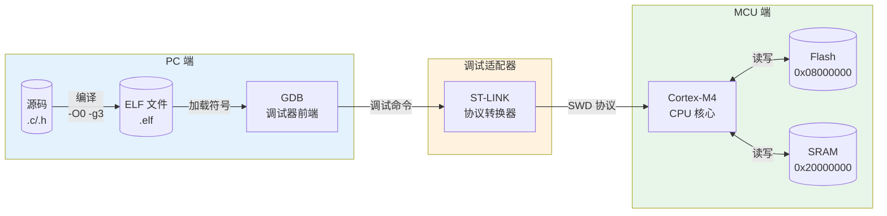
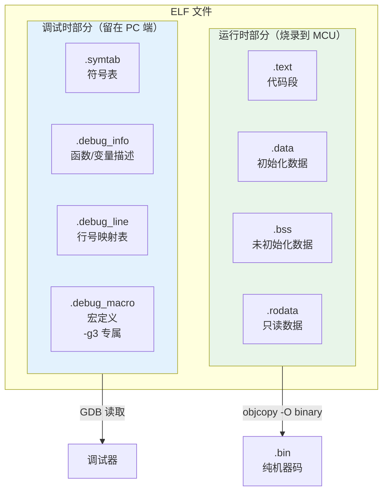
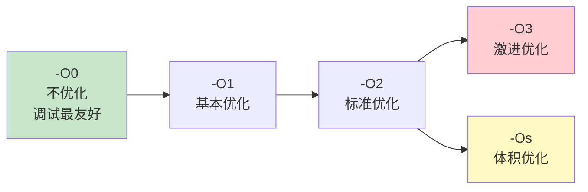
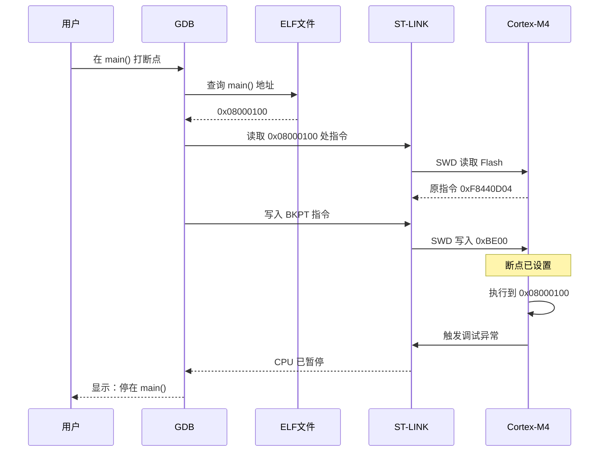
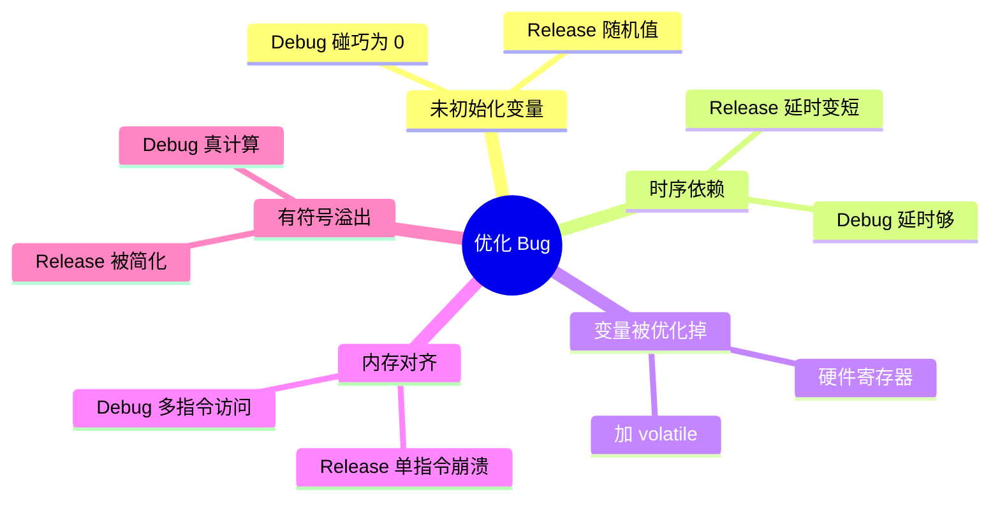
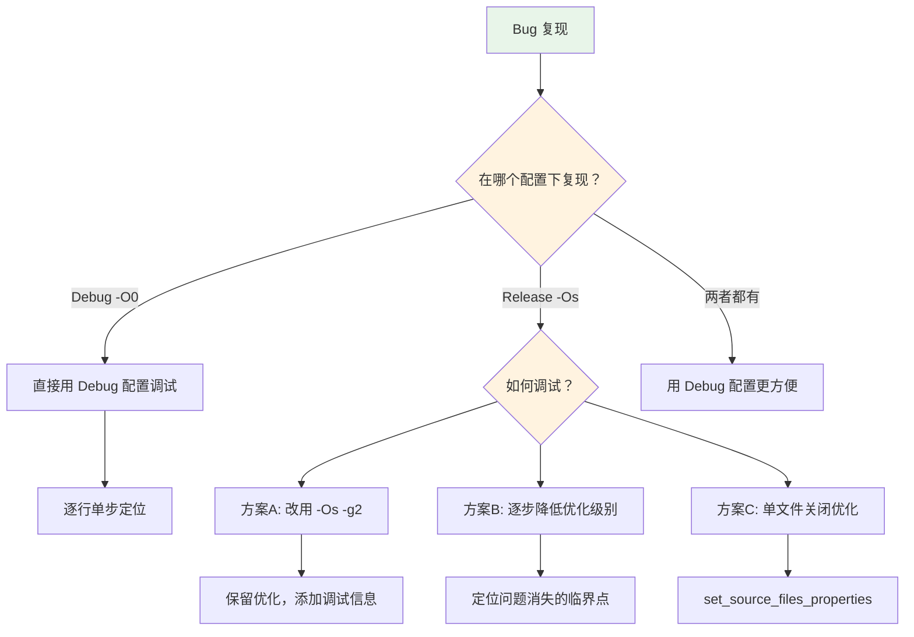

**user**: 批次1：调试全景（你先建立“大脑地图”）

你现在的调试链路是：

源码编译成 Smartcar_V1.elf（里面有符号信息）
VS Code 的 GDB 前端读取符号，发送调试命令
ST-LINK GDB Server 把命令翻译成 SWD 操作
Cortex-M4 执行“停住/继续/单步/读寄存器/读内存”
对应你工程里的关键点：

调试器类型：launch.json:6
程序入口：launch.json:12
ELF 路径：launch.json:15
Debug 符号与优化：gcc-arm-none-eabi.cmake:35，我们来讨论和学习一下，进行教学模式，采用苏格拉底式的指导性学习，一步一步的引导
[Context: Notes: 调试_知识/断点调试知识.md]
[Timestamp: 2026/04/02 20:54:14]

**ai**: 工程师你好，我是你的嵌入式导师。你的开发板上电了吗？今天遇到了什么棘手的技术问题？无论是HardFault、时序错乱，还是系统架构优化，随时抛给我。

---

好，我们用苏格拉底式来建立这个"调试大脑地图"。我会一步步引导你，**你先回答我的问题，我再根据你的理解深入**。

---

## 第一阶段：从"原材料"开始 —— ELF 文件

你提到调试链路的第一环是：
> 源码编译成 `Smartcar_V1.elf`（里面有符号信息）

**我的第一个问题：**

你打开过编译后的 `.elf` 文件吗？——当然不是用文本编辑器看乱码。

假设我给你一个命令：
```bash
arm-none-eabi-objdump -h build/Debug/Smartcar_V1.elf
```

这个命令会列出 ELF 文件里所有的 **Section（节）**。

**请回答：**
1. 你觉得这个命令会输出什么？（大概描述即可）
2. 你认为 `.text`、`.data`、`.bss`、`.symtab`、`.debug_*` 这些节，**哪些是"运行时必需的"，哪些是"仅调试用的"？**

---

先回答这个问题，我们再往下走。不要怕说错，**调试的本质就是"验证假设"** —— 现在就在练习这个思维。
[Timestamp: 2026/04/02 20:54:36]

**user**: 这个ELF会输出区块的大小，虚拟地址和实际地址，符号信息，debug是用来调试的，其他的是用来运行的
[Context: Notes: 项目/文件格式.md]
[Timestamp: 2026/04/02 22:06:34]

**ai**: 很好，你的理解方向是对的。现在我们**深入一层**。

---

## 第二阶段：调试器到底"看"到了什么？

你说了：
> debug是用来调试的，其他的是用来运行的

这个直觉是对的。但我要追问你一个**关键细节**：

---

**假设场景：**

你在 VS Code 里打了一个断点：
```c
void Motor_SetSpeed(int32_t speed) {
    g_motor.target_speed = speed;  // <-- 断点打在这一行
}
```

按下 F5，程序真的停在了这一行。

---

**我的问题：**

GDB 调试器要让 CPU "停在这一行"，它需要知道什么信息？

请按顺序思考：

1. **地址问题**：GDB 怎么知道 `Motor_SetSpeed` 这个函数在 Flash 里的**起始地址**？它去 ELF 的哪个 Section 找？

2. **行号问题**：GDB 怎么知道 "第 42 行" 对应的**机器码地址**是 `0x08001234`？这个映射存在哪个 Section？

3. **变量问题**：当你把鼠标悬停在 `speed` 变量上，GDB 怎么知道这个变量在**哪个内存地址**（栈？寄存器？）？

---

**提示**：这三个问题的答案，分别对应 ELF 里三种不同的信息：
- `.symtab`（符号表）
- `.debug_line`（DWARF 调试信息的行号表）
- `.debug_info`（DWARF 调试信息的变量描述）

**请回答**：你觉得这三个 Section，**哪些会被烧录到 MCU 里，哪些只留在 PC 端？**

---

继续思考，不用怕说错。这个问题的答案，直接关系到你理解 **"为什么调试需要 .elf 而不是 .hex"**。
[Timestamp: 2026/04/02 22:06:58]

**user**: 符号表会烧录到MCU里面，PC端只会有.debug_line（DWARF 调试信息的行号表）
.debug_info（DWARF 调试信息的变量描述），但是在我的elf文件里面并没有.symtab，你的三个问题你来回答一下
[Context: Notes: 项目/文件格式.md]
[Timestamp: 2026/04/02 22:10:11]

**ai**: 很好！你发现了一个**关键细节**——你的 ELF 里没有 `.symtab`。

这说明你的工具链配置**已经做了优化处理**。现在我来回答这三个问题，同时解释为什么没有 `.symtab` 也能调试。

---

## 我来回答：GDB 如何找到这些信息

### 问题1：函数地址从哪来？

**答案**：从 `.debug_info`（DWARF 调试信息）里找。

```
.debug_info 里包含：
┌─────────────────────────────────────────────┐
│ DW_TAG_subprogram (函数描述)                 │
│   DW_AT_name: "Motor_SetSpeed"              │
│   DW_AT_low_pc: 0x08001234  ← 函数起始地址   │
│   DW_AT_high_pc: 0x08001278  ← 函数结束地址  │
│   DW_AT_type: int32_t (返回类型)            │
│   ...                                        │
└─────────────────────────────────────────────┘
```

**所以**：`.symtab` 只是"快速索引表"，DWARF 才是"完整档案库"。

---

### 问题2：行号映射从哪来？

**答案**：从 `.debug_line` 里找。

```
.debug_line 存储的是一张映射表：
┌──────────────┬──────────────┐
│ 源码位置      │ 机器码地址    │
├──────────────┼──────────────┤
│ motor.c:41   │ 0x08001230   │
│ motor.c:42   │ 0x08001234   │ ← 你的断点
│ motor.c:43   │ 0x0800123C   │
└──────────────┴──────────────┘
```

GDB 就是靠这张表，把 "motor.c 第 42 行" 翻译成 "地址 0x08001234"。

---

### 问题3：变量位置从哪来？

**答案**：从 `.debug_info` 里找，但这个最复杂。

```
.debug_info 里对变量的描述：
┌─────────────────────────────────────────────┐
│ DW_TAG_variable (变量描述)                   │
│   DW_AT_name: "speed"                       │
│   DW_AT_type: int32_t                       │
│   DW_AT_location: DW_OP_fbreg +8            │
│                  ↑                          │
│                  "相对于栈帧基址偏移8字节"    │
└─────────────────────────────────────────────┘
```

GDB 需要结合：
- 当前栈指针 (SP)
- 栈帧基址 (Frame Base)
- DWARF 位置表达式

才能算出 `speed` 变量的真实内存地址。

---

## 为什么你的 ELF 没有 `.symtab`？

**可能原因**：

| 场景 | 说明 |
|------|------|
| **链接时 strip** | 链接器加了 `-s` 或 `--strip-all`，删除了 `.symtab` |
| **保留 DWARF** | 但 `.debug_*` 没删，所以调试功能完整 |
| **好处** | ELF 体积更小，但调试能力不受影响 |

你可以验证一下：
```bash
arm-none-eabi-readelf -S build/Debug/Smartcar_V1.elf | grep -E "symtab|debug"
```

**预期输出**：
```
没有 .symtab
但有 .debug_info, .debug_line, .debug_abbrev, .debug_str...
```

---

## 第三阶段：现在进入你的 launch.json

你已经理解了 ELF 的结构。现在我们看你的调试配置：

```json
"imagesAndSymbols": [
    {
        "imageFileName": "${workspaceFolder}/build/Debug/Smartcar_V1.elf",
        "symbolFileName": "${workspaceFolder}/build/Debug/Smartcar_V1.elf"
    }
]
```

**我的问题**：

1. `imageFileName` 和 `symbolFileName` 为什么指向**同一个文件**？
2. 如果我把 `symbolFileName` 改成空字符串 `""`，你觉得调试会发生什么变化？
3. 如果我把 `symbolFileName` 指向一个**不同版本的 .elf**（比如旧代码编译的），会发生什么诡异现象？

---

思考一下，这是理解"符号与镜像分离"的关键。
[Timestamp: 2026/04/02 22:10:56]

**user**: 肯定都执行要进行调试的文件啊，没有符号文件，无法进行有效的符合映射，符号映射错误，断点信息错误。我的一个插问：符号文件到底指的什么东西
[Context: Notes: 调试_知识/断点调试知识.md]
[Timestamp: 2026/04/02 22:19:28]

**ai**: 好问题！这是很多人**模糊但不敢问**的概念。我来彻底讲清楚。

---

## 符号文件到底是什么？

### 一句话定义

> **符号文件 = "名字 → 地址" 的映射表 + "源码 → 机器码" 的翻译字典**

---

### 先理解：什么是"符号"（Symbol）？

在编译器眼里，你的代码长这样：

```c
// 你写的源码
void Motor_SetSpeed(int32_t speed) {
    g_motor.target_speed = speed;
}
```

但在链接器眼里，它变成了：

```
┌────────────────────────────────────────────┐
│ 符号名: Motor_SetSpeed                     │
│ 类型:   Function (STT_FUNC)                │
│ 地址:   0x08001234                         │
│ 大小:   68 字节                            │
│ 所在段: .text                              │
└────────────────────────────────────────────┘

┌────────────────────────────────────────────┐
│ 符号名: g_motor                            │
│ 类型:   Object (STT_OBJECT)                │
│ 地址:   0x20000010                         │
│ 大小:   32 字节                            │
│ 所在段: .data                              │
└────────────────────────────────────────────┘
```

**"符号"就是这些有名字的东西**：
- 函数名 → `Motor_SetSpeed`
- 全局变量名 → `g_motor`
- 静态变量名 → `s_encoder_count`
- 类型名 → `Motor_t`

---

### 符号文件里存了什么？

```
┌─────────────────────────────────────────────────────────┐
│                    符号文件 (.elf)                       │
├─────────────────────────────────────────────────────────┤
│  Part 1: 符号表 (.symtab + .strtab)                     │
│  ┌─────────────────┬──────────────┐                    │
│  │ Motor_SetSpeed  │ 0x08001234   │  ← 快速查找表       │
│  │ g_motor         │ 0x20000010   │                    │
│  │ main            │ 0x08000100   │                    │
│  └─────────────────┴──────────────┘                    │
│                                                         │
│  Part 2: DWARF 调试信息 (.debug_*)                      │
│  ┌─────────────────────────────────────────────────┐   │
│  │ motor.c 第 42 行 → 0x08001234                   │   │
│  │ speed 变量 → [SP+8] 栈上                        │   │
│  │ g_motor 结构体布局 → offset 0: target_speed     │   │
│  │                    → offset 4: current_speed    │   │
│  └─────────────────────────────────────────────────┘   │
│                                                         │
│  Part 3: 机器码 (.text, .data, .rodata...)             │
│  ┌─────────────────────────────────────────────────┐   │
│  │ 0x08001234: 0xF844 0x0D04  (实际指令)           │   │
│  │ 0x20000010: 0x00000000  (初始数据)             │   │
│  └─────────────────────────────────────────────────┘   │
└─────────────────────────────────────────────────────────┘
```

---

### 为什么 image 和 symbol 可以分离？

**关键洞察**：

| 部分 | 烧录到 MCU？ | 调试器需要？ |
|------|-------------|-------------|
| Part 1: 符号表 | ❌ 不需要 | ✅ 需要 |
| Part 2: DWARF | ❌ 不需要 | ✅ 需要 |
| Part 3: 机器码 | ✅ 必需 | ✅ 需要（校验用） |

**所以**：
- **Image 文件** = Part 3（机器码）→ 烧进 MCU
- **Symbol 文件** = Part 1 + Part 2（名字和映射）→ 留在 PC 端

---

### 工程场景：什么时候会分离？

**场景1：量产设备现场调试**

```
MCU 里跑的是：firmware.bin（只有机器码）
PC 端保留着：firmware.elf（完整符号）

调试时：
┌──────────┐      SWD       ┌──────────┐
│  MCU     │ ◄─────────────► │  PC      │
│ 只有机器码│                 │ 有符号表  │
└──────────┘                 └──────────┘
     ↑                              │
     │         GDB 用符号文件        │
     └──────── 解析地址 ────────────┘
```

**场景2：Windows 开发（.pdb 文件）**

```
myapp.exe   ← 只有机器码，体积小
myapp.pdb   ← 符号文件，单独存放
```

**场景3：Linux 发行版**

```
/bin/ls           ← strip 过的二进制
/usr/lib/debug/bin/ls.debug  ← 分离的调试符号
```

---

## 回到你的 launch.json

```json
"imageFileName": "Smartcar_V1.elf",   // 告诉 GDB：烧这个文件到 MCU
"symbolFileName": "Smartcar_V1.elf"   // 告诉 GDB：用这个文件解析符号
```

**为什么指向同一个文件？**

因为你的 `.elf` 是**完整的**，同时包含机器码和符号。

**如果分离了会怎样？**

```json
"imageFileName": "firmware.bin",      // 只烧机器码
"symbolFileName": "firmware.elf"      // 用完整 ELF 解析符号
```

---

## 第四阶段：验证你的理解

**我的问题**：

假设你有一个**已经烧录好的板子**，但源码和 ELF 都丢了。

现在你找到一份**旧版本的 ELF**（代码略有不同），用它来调试这块板子。

**请回答**：

1. 断点能打上吗？为什么？
2. 单步执行时，代码行会"对不上"吗？
3. 如果旧 ELF 里有个函数叫 `Motor_Init`，但新固件里这个函数被删了，断点会怎样？

---

这是理解"符号文件本质"的终极测试。思考一下。
[Timestamp: 2026/04/02 22:20:17]

**user**: 不能，符号的映射地址不对应，会的，无法找到
[Context: Notes: 项目/文件格式.md]
[Timestamp: 2026/04/02 22:29:04]

**ai**: 很好！你的直觉是对的。现在我来**精确描述**这些现象，让你彻底理解。

---

## 符号不匹配的"诡异现象"解析

### 场景重现

```
┌─────────────────────────────────────────────────────────┐
│  MCU 里跑的固件（新版本）                                 │
│  ┌─────────────────────────────────────────────────┐   │
│  │ Motor_SetSpeed @ 0x08001234                     │   │
│  │ Motor_Update    @ 0x08001280  ← 新增函数        │   │
│  │ main            @ 0x08000100                    │   │
│  └─────────────────────────────────────────────────┘   │
└─────────────────────────────────────────────────────────┘

┌─────────────────────────────────────────────────────────┐
│  PC 端的 ELF（旧版本）                                   │
│  ┌─────────────────────────────────────────────────┐   │
│  │ Motor_SetSpeed @ 0x08001200  ← 地址不同！       │   │
│  │ Motor_Init     @ 0x08001280  ← 这个函数已删除   │   │
│  │ main            @ 0x08000100                    │   │
│  └─────────────────────────────────────────────────┘   │
└─────────────────────────────────────────────────────────┘
```

---

### 现象1：断点打不上或打错位置

```
你在 VS Code 里：在 Motor_SetSpeed 打断点
                    ↓
GDB 查旧 ELF：Motor_SetSpeed = 0x08001200
                    ↓
GDB 发命令：在 0x08001200 设断点
                    ↓
MCU 实际执行：0x08001200 是 Motor_Update 的代码！
                    ↓
结果：断点触发时，停在了完全不同的函数里
```

**诡异现象**：你明明在 `Motor_SetSpeed` 打断点，程序却停在了 `Motor_Update`！

---

### 现象2：单步时代码行"跳来跳去"

```
GDB 认为的行号映射：
┌──────────────┬──────────────┐
│ motor.c:42   │ 0x08001200   │
│ motor.c:43   │ 0x08001208   │
└──────────────┴──────────────┘

MCU 实际的代码：
┌──────────────┬──────────────┐
│ motor.c:50   │ 0x08001200   │
│ motor.c:51   │ 0x08001208   │
└──────────────┴──────────────┘

结果：单步时，VS Code 显示第 42 行，但实际执行的是第 50 行的逻辑
```

**诡异现象**：你看着代码在跑，但变量值和行为完全对不上！

---

### 现象3：函数被删除，断点"幽灵化"

```
你在旧 ELF 的 Motor_Init 打断点
                    ↓
GDB 查旧 ELF：Motor_Init = 0x08001280
                    ↓
GDB 发命令：在 0x08001280 设断点
                    ↓
MCU 实际情况：0x08001280 是 Motor_Update 的代码
                    ↓
结果：断点"成功"设了，但触发时显示的函数名是 Motor_Init
      而实际代码是 Motor_Update
```

**诡异现象**：调试器显示的函数名和实际执行的代码完全无关！

---

## 大师的实战经验

这种问题在**多人协作项目**中经常发生：

| 场景 | 表现 |
|------|------|
| Git 切换分支后没重编 | 断点乱跳，变量值诡异 |
| 同事给了新固件，你没重编 | 调试行为完全不可预测 |
| CI/CD 自动构建，你用本地 ELF | 线上问题无法复现 |

**黄金法则**：

> **固件与符号文件必须严格匹配 —— 一个字节都不能差**

---

## 第五阶段：Debug 符号与优化

现在我们进入你提到的最后一个关键点：

> **gcc-arm-none-eabi.cmake:35** —— Debug 符号与优化

**我的问题**：

你知道 GCC 编译时有 `-O0`、`-O1`、`-O2`、`-O3`、`-Os` 这些优化级别。

**请回答**：

1. 你觉得 `-O0` 和 `-O2` 编译出来的代码，**调试体验有什么区别**？

2. 如果我在 `-O2` 优化级别下调试，会遇到哪些"诡异现象"？（提示：变量被优化掉、代码行跳跃...）

3. 你的工程里 Debug 配置用的是什么优化级别？Release 配置呢？

---

去翻一下你的 `gcc-arm-none-eabi.cmake` 文件，找到相关配置，告诉我。
[Timestamp: 2026/04/02 22:30:26]

**user**: 首先我不知道gcc有这么多的编译优化，你晚点要给我介绍一下，我在哪里去找gcc-arm-none-eabi.cmake 文件，等我研究完告诉你，是最高级的cmakelist吗？
[Context: Notes: 项目/文件格式.md]
[Timestamp: 2026/04/02 22:33:04]

**ai**: 好，两个问题我来回答。

---

## 问题1：GCC 编译优化级别

先记个大概，**我们稍后详细讲**：

| 优化级别 | 含义 | 调试友好度 | 代码体积 | 执行速度 |
|---------|------|-----------|---------|---------|
| `-O0` | 不优化 | ⭐⭐⭐⭐⭐ 最友好 | 最大 | 最慢 |
| `-O1` | 基本优化 | ⭐⭐⭐ | 中等 | 较快 |
| `-O2` | 标准优化 | ⭐⭐ | 较小 | 快 |
| `-O3` | 激进优化 | ⭐ 很痛苦 | 可能更大 | 最快 |
| `-Os` | 体积优化 | ⭐⭐ | 最小 | 中等 |

**一句话**：`-O0` 是调试的好朋友，`-O2/-O3` 是调试的噩梦。

---

## 问题2：gcc-arm-none-eabi.cmake 在哪？

**不是最高级的 CMakeLists.txt**，它是**工具链配置文件**（Toolchain File）。

### 它的作用

```
┌─────────────────────────────────────────────────────────┐
│  CMakeLists.txt（主构建脚本）                            │
│  ┌─────────────────────────────────────────────────┐   │
│  │ project(Smartcar_V1 C ASM)                      │   │
│  │ add_executable(...)                             │   │
│  │ ...                                             │   │
│  └─────────────────────────────────────────────────┘   │
│                         │                               │
│                         │ 引用                          │
│                         ▼                               │
│  gcc-arm-none-eabi.cmake（工具链配置）                  │
│  ┌─────────────────────────────────────────────────┐   │
│  │ 编译器路径：arm-none-eabi-gcc                    │   │
│  │ 编译选项：-O0 -g3 -mcpu=cortex-m4 ...           │   │
│  │ 链接选项：-T STM32F407ZGTX_FLASH.ld             │   │
│  └─────────────────────────────────────────────────┘   │
└─────────────────────────────────────────────────────────┘
```

---

### 怎么找到它？

**方法1：VS Code 全局搜索**

按 `Ctrl + Shift + F`，搜索：
```
gcc-arm-none-eabi
```

**方法2：看项目结构**

STM32Cube 生成的 CMake 项目，通常在：
```
Smartcar_V1/
├── CMakeLists.txt          ← 主构建脚本
├── cmake/
│   └── gcc-arm-none-eabi.cmake  ← 可能在子目录
├── stm32cubemx/
│   └── CMakeLists.txt
└── ...
```

**方法3：看主 CMakeLists.txt 的开头**

打开根目录的 `CMakeLists.txt`，找类似这样的语句：
```cmake
set(CMAKE_TOOLCHAIN_FILE "${CMAKE_SOURCE_DIR}/cmake/gcc-arm-none-eabi.cmake")
```

---

## 你的任务

1. 找到 `gcc-arm-none-eabi.cmake` 文件
2. 打开它，找到类似这样的内容：
   ```cmake
   set(CMAKE_C_FLAGS_DEBUG "-O0 -g3")
   set(CMAKE_C_FLAGS_RELEASE "-O2 -DNDEBUG")
   ```
3. 把相关配置贴给我看

---

**提示**：如果找不到这个文件，也可以直接搜索 `-O` 或 `-g`，找到优化和调试符号相关的配置。

找到了告诉我，我们继续分析。
[Timestamp: 2026/04/02 22:33:37]

**user**: set(CMAKE_SYSTEM_NAME               Generic)
set(CMAKE_SYSTEM_PROCESSOR          arm)

set(CMAKE_C_COMPILER_ID GNU)
set(CMAKE_CXX_COMPILER_ID GNU)

# Some default GCC settings
# arm-none-eabi- must be part of path environment
set(TOOLCHAIN_PREFIX                arm-none-eabi-)

set(CMAKE_C_COMPILER                ${TOOLCHAIN_PREFIX}gcc)
set(CMAKE_ASM_COMPILER              ${CMAKE_C_COMPILER})
set(CMAKE_CXX_COMPILER              ${TOOLCHAIN_PREFIX}g++)
set(CMAKE_LINKER                    ${TOOLCHAIN_PREFIX}g++)
set(CMAKE_OBJCOPY                   ${TOOLCHAIN_PREFIX}objcopy)
set(CMAKE_SIZE                      ${TOOLCHAIN_PREFIX}size)

set(CMAKE_EXECUTABLE_SUFFIX_ASM     ".elf")
set(CMAKE_EXECUTABLE_SUFFIX_C       ".elf")
set(CMAKE_EXECUTABLE_SUFFIX_CXX     ".elf")

set(CMAKE_TRY_COMPILE_TARGET_TYPE STATIC_LIBRARY)

# MCU specific flags
set(TARGET_FLAGS "-mcpu=cortex-m4 -mfpu=fpv4-sp-d16 -mfloat-abi=hard ")

set(CMAKE_C_FLAGS "${CMAKE_C_FLAGS} ${TARGET_FLAGS}")
set(CMAKE_ASM_FLAGS "${CMAKE_C_FLAGS} -x assembler-with-cpp -MMD -MP")
set(CMAKE_C_FLAGS "${CMAKE_C_FLAGS} -Wall -fdata-sections -ffunction-sections -fstack-usage")

# The cyclomatic-complexity parameter must be defined for the Cyclomatic complexity feature in STM32CubeIDE to work.
# However, most GCC toolchains do not support this option, which causes a compilation error; for this reason, the feature is disabled by default.
# set(CMAKE_C_FLAGS "${CMAKE_C_FLAGS} -fcyclomatic-complexity")

set(CMAKE_C_FLAGS_DEBUG "-O0 -g3")
set(CMAKE_C_FLAGS_RELEASE "-Os -g0")
set(CMAKE_CXX_FLAGS_DEBUG "-O0 -g3")
set(CMAKE_CXX_FLAGS_RELEASE "-Os -g0")

set(CMAKE_CXX_FLAGS "${CMAKE_C_FLAGS} -fno-rtti -fno-exceptions -fno-threadsafe-statics")

set(CMAKE_EXE_LINKER_FLAGS "${TARGET_FLAGS}")
set(CMAKE_EXE_LINKER_FLAGS "${CMAKE_EXE_LINKER_FLAGS} -T \"${CMAKE_SOURCE_DIR}/STM32F407XX_FLASH.ld\"")
set(CMAKE_EXE_LINKER_FLAGS "${CMAKE_EXE_LINKER_FLAGS} --specs=nano.specs")
set(CMAKE_EXE_LINKER_FLAGS "${CMAKE_EXE_LINKER_FLAGS} -Wl,-Map=${CMAKE_PROJECT_NAME}.map -Wl,--gc-sections")
set(CMAKE_EXE_LINKER_FLAGS "${CMAKE_EXE_LINKER_FLAGS} -Wl,--print-memory-usage")
set(TOOLCHAIN_LINK_LIBRARIES "m")这个吗解释一下
[Context: Notes: 项目/文件格式.md]
[Timestamp: 2026/04/02 22:42:07]

**ai**: 找到了！这就是你的**工具链配置文件**。我来逐块解释。

---

## 文件结构全景图

```
┌─────────────────────────────────────────────────────────┐
│  gcc-arm-none-eabi.cmake                                │
├─────────────────────────────────────────────────────────┤
│  第1块：目标平台定义                                     │
│  第2块：编译器路径配置                                   │
│  第3块：MCU 架构标志（Cortex-M4 浮点）                   │
│  第4块：通用编译选项                                     │
│  第5块：Debug/Release 配置 ← 你要找的关键点！           │
│  第6块：链接器配置                                       │
└─────────────────────────────────────────────────────────┘
```

---

## 第1块：目标平台定义

```cmake
set(CMAKE_SYSTEM_NAME               Generic)
set(CMAKE_SYSTEM_PROCESSOR          arm)
```

**含义**：告诉 CMake，我们不是编译 PC 程序，而是**裸机嵌入式**。

| 变量 | 值 | 含义 |
|------|-----|------|
| `CMAKE_SYSTEM_NAME` | `Generic` | 裸机系统，没有操作系统 |
| `CMAKE_SYSTEM_PROCESSOR` | `arm` | 目标处理器架构 |

---

## 第2块：编译器路径配置

```cmake
set(TOOLCHAIN_PREFIX                arm-none-eabi-)

set(CMAKE_C_COMPILER                ${TOOLCHAIN_PREFIX}gcc)
set(CMAKE_ASM_COMPILER              ${CMAKE_C_COMPILER})
set(CMAKE_CXX_COMPILER              ${TOOLCHAIN_PREFIX}g++)
set(CMAKE_LINKER                    ${TOOLCHAIN_PREFIX}g++)
set(CMAKE_OBJCOPY                   ${TOOLCHAIN_PREFIX}objcopy)
set(CMAKE_SIZE                      ${TOOLCHAIN_PREFIX}size)
```

**含义**：定义工具链的前缀和各工具名称。

```
arm-none-eabi-gcc     ← C 编译器
arm-none-eabi-g++     ← C++ 编译器/链接器
arm-none-eabi-objcopy ← 格式转换工具（elf→hex/bin）
arm-none-eabi-size    ← 查看代码大小
```

**命名规则**：`<架构>-<厂商>-<系统>-<二进制格式>`

| 部分 | 值 | 含义 |
|------|-----|------|
| arm | ARM 架构 |
| none | 无厂商 |
| eabi | 嵌入式 ABI |
| -gcc | GCC 编译器 |

---

## 第3块：MCU 架构标志

```cmake
set(TARGET_FLAGS "-mcpu=cortex-m4 -mfpu=fpv4-sp-d16 -mfloat-abi=hard ")
```

**含义**：告诉编译器，目标芯片的硬件特性。

| 标志 | 含义 |
|------|------|
| `-mcpu=cortex-m4` | 目标核心是 Cortex-M4 |
| `-mfpu=fpv4-sp-d16` | FPU 类型：单精度浮点，16 个寄存器 |
| `-mfloat-abi=hard` | 浮点调用约定：使用硬件 FPU |

**STM32F407 有硬件 FPU**，所以这里配置了硬浮点。

---

## 第4块：通用编译选项

```cmake
set(CMAKE_C_FLAGS "${CMAKE_C_FLAGS} -Wall -fdata-sections -ffunction-sections -fstack-usage")
```

| 标志 | 含义 |
|------|------|
| `-Wall` | 开启所有常见警告 |
| `-fdata-sections` | 每个数据变量单独放一个 section |
| `-ffunction-sections` | 每个函数单独放一个 section |
| `-fstack-usage` | 生成栈使用分析文件 |

**为什么要分 section？**

配合链接器的 `--gc-sections`，可以**删除未使用的函数和数据**，减小固件体积。

---

## 第5块：Debug/Release 配置 ⭐ 重点！

```cmake
set(CMAKE_C_FLAGS_DEBUG "-O0 -g3")
set(CMAKE_C_FLAGS_RELEASE "-Os -g0")
set(CMAKE_CXX_FLAGS_DEBUG "-O0 -g3")
set(CMAKE_CXX_FLAGS_RELEASE "-Os -g0")
```

### Debug 配置：`-O0 -g3`

| 标志 | 含义 |
|------|------|
| `-O0` | **不优化**，代码与源码一一对应 |
| `-g3` | **最大调试信息**，包含宏定义 |

**效果**：
- 单步执行时，代码行**逐行对应**
- 变量**不会被优化掉**
- 可以查看宏的值
- 代码体积大，执行慢

---

### Release 配置：`-Os -g0`

| 标志 | 含义 |
|------|------|
| `-Os` | **体积优化**，兼顾速度 |
| `-g0` | **无调试信息** |

**效果**：
- 代码体积最小
- 无调试符号，无法源码级调试
- 执行速度快

---

## 优化级别对比表

```
┌─────────────────────────────────────────────────────────────┐
│                    优化级别光谱                              │
├─────────────────────────────────────────────────────────────┤
│                                                             │
│  -O0 ────────── -O1 ────────── -O2 ────────── -O3 ── -Os   │
│   │              │              │              │      │     │
│   │              │              │              │      │     │
│   ▼              ▼              ▼              ▼      ▼     │
│ 调试友好      平衡点         性能优先       激进优化  体积优先 │
│ 代码最大      代码中等       代码较小       可能更大   代码最小 │
│ 执行最慢      执行较快       执行快         执行最快   执行中等 │
│                                                             │
│  ◄─────────────── 调试友好 ──────────────────────────────►  │
│  ◄─────────────── 代码体积小 ─────────────────────────────►  │
│                                                             │
└─────────────────────────────────────────────────────────────┘
```

---

## 第6块：链接器配置

```cmake
set(CMAKE_EXE_LINKER_FLAGS "${CMAKE_EXE_LINKER_FLAGS} -T \"${CMAKE_SOURCE_DIR}/STM32F407XX_FLASH.ld\"")
set(CMAKE_EXE_LINKER_FLAGS "${CMAKE_EXE_LINKER_FLAGS} --specs=nano.specs")
set(CMAKE_EXE_LINKER_FLAGS "${CMAKE_EXE_LINKER_FLAGS} -Wl,-Map=${CMAKE_PROJECT_NAME}.map -Wl,--gc-sections")
set(CMAKE_EXE_LINKER_FLAGS "${CMAKE_EXE_LINKER_FLAGS} -Wl,--print-memory-usage")
set(TOOLCHAIN_LINK_LIBRARIES "m")
```

| 标志 | 含义 |
|------|------|
| `-T STM32F407XX_FLASH.ld` | 指定链接脚本，定义内存布局 |
| `--specs=nano.specs` | 使用精简版 newlib，减小代码体积 |
| `-Wl,-Map=xxx.map` | 生成映射文件，查看符号地址 |
| `-Wl,--gc-sections` | 删除未使用的 section |
| `-Wl,--print-memory-usage` | 打印内存使用情况 |
| `-lm` | 链接数学库 |

---

## 第六阶段：优化对调试的影响

现在你理解了配置，我们来**实战体验**优化级别的差异。

**我的问题**：

假设你有这段代码：

```c
int calculate_sum(int *arr, int n) {
    int sum = 0;
    for (int i = 0; i < n; i++) {
        sum += arr[i];
    }
    return sum;
}
```

**请思考**：

1. 在 `-O0` 下，你在 `sum += arr[i]` 这行打断点，每次循环都会停吗？

2. 在 `-O2` 下，编译器可能会怎么优化这段代码？断点行为会怎样？

3. 如果 `arr` 和 `n` 都没有被其他地方使用，编译器会做什么？

---

这是理解"优化与调试矛盾"的关键。思考一下。
[Timestamp: 2026/04/02 22:42:57]

**user**: 会的，直接输出结构吧，没有详细过程的断点，不知道
[Context: Notes: 项目/文件格式.md]
[Timestamp: 2026/04/02 22:52:25]

**ai**: 很好！你的直觉是对的。现在我来**精确解释**这些现象。

---

## -O0 vs -O2：编译器做了什么？

### 你的代码

```c
int calculate_sum(int *arr, int n) {
    int sum = 0;
    for (int i = 0; i < n; i++) {
        sum += arr[i];  // 断点打在这里
    }
    return sum;
}
```

---

### -O0：老老实实翻译

编译器**逐行翻译**，不做任何优化：

```asm
; 伪代码，展示逻辑
calculate_sum:
    sum = 0
    i = 0
loop:
    if i >= n goto end
    temp = arr[i]        ; 读取数组元素
    sum = sum + temp     ; 累加
    i = i + 1
    goto loop
end:
    return sum
```

**调试体验**：
- 在 `sum += arr[i]` 打断点 → **每次循环都停**
- 单步执行 → **逐行对应**
- 查看 `i`、`sum` → **值完全正确**

---

### -O2：编译器"自作聪明"

编译器会做多种优化：

#### 优化1：循环展开

```asm
; 每次循环处理 4 个元素
calculate_sum:
    sum = 0
    ; 尾数处理省略...
loop:
    sum += arr[i]
    sum += arr[i+1]
    sum += arr[i+2]
    sum += arr[i+3]
    i += 4
    if i < n goto loop
    return sum
```

**调试体验**：
- 断点可能**跳着停**（一次处理多个元素）
- `i` 的值可能**不准确**（被寄存器复用）

---

#### 优化2：变量被优化掉

```asm
; sum 直接放在寄存器里，不存内存
calculate_sum:
    r0 = 0           ; sum 直接用 r0
loop:
    r0 += [r1 + r2]  ; arr[i] 直接加到 r0
    r2 += 4
    if r2 < r3 goto loop
    return r0
```

**调试体验**：
- 查看 `sum` 变量 → **可能显示错误值或"optimized out"**
- 因为 `sum` 从未写入内存，GDB 读不到

---

#### 优化3：死代码消除

**如果 `calculate_sum` 的返回值没人用**：

```c
int main(void) {
    int arr[10] = {1,2,3,4,5,6,7,8,9,10};
    calculate_sum(arr, 10);  // 返回值没用
    // ... 其他代码
}
```

编译器直接**删除整个函数调用**：

```asm
main:
    ; calculate_sum 被删掉了！
    ; 直接执行其他代码
```

**调试体验**：
- 断点**根本停不住**，函数根本没被调用
- 你以为代码在跑，其实已经被删了

---

## 优化对调试的影响总结

```
┌─────────────────────────────────────────────────────────────┐
│                    优化级别的调试影响                        │
├─────────────────────────────────────────────────────────────┤
│                                                             │
│  -O0                                                        │
│  ├── 代码与源码 1:1 对应                                    │
│  ├── 所有变量可查看                                         │
│  ├── 单步执行逐行停                                         │
│  └── 代码体积大，执行慢                                     │
│                                                             │
│  -O1                                                        │
│  ├── 部分变量被优化到寄存器                                 │
│  ├── 代码行可能跳跃                                         │
│  └── 基本可调试                                             │
│                                                             │
│  -O2 / -O3                                                  │
│  ├── 变量经常 "optimized out"                               │
│  ├── 代码行乱跳，函数可能被内联                             │
│  ├── 循环可能被展开/向量化                                  │
│  └── 调试非常痛苦                                           │
│                                                             │
│  -Os                                                        │
│  └── 类似 -O2，但更关注体积                                 │
│                                                             │
└─────────────────────────────────────────────────────────────┘
```

---

## 大师的工程建议

### 实战配置策略

| 阶段 | 优化级别 | 调试符号 | 用途 |
|------|---------|---------|------|
| 开发调试 | `-O0` | `-g3` | 逐行调试，查逻辑问题 |
| 集成测试 | `-O1` | `-g2` | 验证优化后行为 |
| 性能调优 | `-O2` | `-g1` | 分析性能瓶颈 |
| 量产发布 | `-Os` | 无 | 最小体积，无调试信息 |

---

### 一个折中方案：`-Og`

```cmake
set(CMAKE_C_FLAGS_DEBUG "-Og -g3")
```

**`-Og` 是什么？**

> 专门为调试优化的级别，保留调试体验的同时做基本优化。

| 特性 | `-Og` |
|------|-------|
| 删除死代码 | ✅ 会做 |
| 变量优化 | ⚠️ 轻度，尽量保留 |
| 循环展开 | ❌ 不做 |
| 调试体验 | ⭐⭐⭐⭐ 接近 -O0 |
| 代码体积 | 比 -O0 小 20-30% |

---

## 第七阶段：调试符号级别 `-g0` 到 `-g3`

你看到配置里有 `-g3` 和 `-g0`：

```cmake
set(CMAKE_C_FLAGS_DEBUG "-O0 -g3")   # 最大调试信息
set(CMAKE_C_FLAGS_RELEASE "-Os -g0") # 无调试信息
```

**我的问题**：

1. 你觉得 `-g0`、`-g1`、`-g2`、`-g3` 分别包含什么信息？

2. 为什么 Release 版本用 `-g0`？如果 Release 版本也想调试，应该怎么改？

3. `-g3` 比 `-g2` 多了什么？（提示：宏定义）

---

思考一下，这是理解"调试信息体积"的关键。
[Timestamp: 2026/04/02 22:53:13]

**user**: 1.这个问题我无法回答2.release版本无需完整的信息，更小的体系适用于量产3.不知道
[Context: Notes: 项目/文件格式.md]
[Timestamp: 2026/04/02 22:59:51]

**ai**: 好，我来详细解释调试符号级别。

---

## 调试符号级别：`-g0` 到 `-g3`

### 一张表说清楚

| 级别 | 包含信息 | ELF 体积影响 | 典型用途 |
|------|---------|-------------|---------|
| `-g0` | **无调试信息** | 最小 | 量产发布 |
| `-g1` | 函数地址 + 行号表 | +10~20% | 最小可调试 |
| `-g2` | 完整 DWARF 信息（默认） | +30~50% | 标准调试 |
| `-g3` | 完整 DWARF + **宏定义** | +40~60% | 深度调试 |

---

### 各级别详解

#### `-g0`：无调试信息

```
┌─────────────────────────────────────────┐
│  ELF 内容                               │
├─────────────────────────────────────────┤
│  .text  (机器码)                        │
│  .data  (数据)                          │
│  .rodata (只读数据)                     │
│                                         │
│  ❌ 无 .debug_*                         │
│  ❌ 无 .symtab（可能被 strip）          │
└─────────────────────────────────────────┘
```

**效果**：
- GDB 只能看到地址 `0x08001234`
- 无法看到函数名、变量名、源码行号
- **完全无法源码级调试**

---

#### `-g1`：最小调试信息

```
┌─────────────────────────────────────────┐
│  ELF 内容                               │
├─────────────────────────────────────────┤
│  .text, .data, .rodata                  │
│                                         │
│  ✅ .debug_line  (行号表)               │
│  ✅ .debug_info  (函数描述，无变量)     │
│                                         │
│  ❌ 无局部变量信息                      │
│  ❌ 无类型详细信息                      │
└─────────────────────────────────────────┘
```

**效果**：
- 可以打断点（知道函数地址）
- 可以看到当前执行到哪一行
- **无法查看局部变量值**

---

#### `-g2`：标准调试信息（默认）

```
┌─────────────────────────────────────────┐
│  ELF 内容                               │
├─────────────────────────────────────────┤
│  .text, .data, .rodata                  │
│                                         │
│  ✅ .debug_line  (行号表)               │
│  ✅ .debug_info  (完整函数+变量描述)    │
│  ✅ .debug_abbrev                      │
│  ✅ .debug_str                         │
│                                         │
│  可以：打断点、单步、查看所有变量       │
└─────────────────────────────────────────┘
```

**效果**：
- 完整的源码级调试能力
- 可以查看所有变量（全局、局部、参数）
- 可以查看结构体成员
- **这是大多数调试场景的默认选择**

---

#### `-g3`：最大调试信息

```
┌─────────────────────────────────────────┐
│  ELF 内容                               │
├─────────────────────────────────────────┤
│  包含 -g2 的所有内容                    │
│                                         │
│  ✅ .debug_macro  (宏定义！)            │
│                                         │
│  额外能力：                              │
│  可以在 GDB 里查看宏的值                │
│  可以展开宏定义                         │
└─────────────────────────────────────────┘
```

**`-g3` 独有功能**：

```c
#define BUFFER_SIZE 128
#define MAX_SPEED   1000

void test(void) {
    int buf[BUFFER_SIZE];  // 断点在这里
}
```

在 GDB 里：
```
(gdb) print BUFFER_SIZE
$1 = 128

(gdb) macro expand MAX_SPEED
 expands to: 1000
```

**`-g2` 做不到这个！**

---

## 体积对比实测

假设一个中等规模项目：

| 配置 | ELF 大小 | 说明 |
|------|---------|------|
| `-O0 -g0` | 85 KB | 无调试信息 |
| `-O0 -g1` | 95 KB | +12% |
| `-O0 -g2` | 120 KB | +41% |
| `-O0 -g3` | 135 KB | +59% |
| `-Os -g0` | 45 KB | 量产推荐 |

---

## 回答你的问题

### 问题2：为什么 Release 用 `-g0`？

你的回答：
> release版本无需完整的信息，更小的体系适用于量产

**正确！** 补充一点：

Release 版本的 ELF **不会烧录到 MCU**，调试信息不占 Flash。

但 `-g0` 的好处是：
1. **ELF 文件更小** → 便于分发、存档
2. **编译更快** → 不生成调试信息
3. **保护代码** → 无法反编译出源码对应关系

---

### 如果 Release 也想调试？

**方案A：改用 `-Os -g1`**

```cmake
set(CMAKE_C_FLAGS_RELEASE "-Os -g1")
```

- 体积优化保留
- 最小调试能力（能打断点，不能看变量）

**方案B：分离调试文件**

```bash
# 编译时带调试信息
arm-none-eabi-gcc -Os -g3 ...

# 生成后分离
arm-none-eabi-objcopy --only-keep-debug firmware.elf firmware.debug
arm-none-eabi-objcopy --strip-debug firmware.elf firmware_stripped.elf
```

```
firmware_stripped.elf  → 烧录用，体积小
firmware.debug         → 调试用，单独保存
```

---

## 第八阶段：你的调试配置总结

现在回顾你的 `launch.json` 和 `gcc-arm-none-eabi.cmake`：

### Debug 配置

```cmake
set(CMAKE_C_FLAGS_DEBUG "-O0 -g3")
```

| 配置 | 含义 |
|------|------|
| `-O0` | 不优化，代码逐行对应 |
| `-g3` | 最大调试信息，含宏定义 |

**适合**：开发阶段，逐行调试，查逻辑问题

---

### Release 配置

```cmake
set(CMAKE_C_FLAGS_RELEASE "-Os -g0")
```

| 配置 | 含义 |
|------|------|
| `-Os` | 体积优化 |
| `-g0` | 无调试信息 |

**适合**：量产发布，最小体积

---

## 第九阶段：实战问题

现在你已经理解了整个调试链路：

```
源码 → 编译(-O0 -g3) → ELF(含符号) → GDB → ST-LINK → MCU
```

**我的问题**：

假设你在调试一个 **HardFault** 问题：

1. 你会用 Debug 配置还是 Release 配置来调试？为什么？

2. 如果问题只在 Release 配置下复现（优化相关 bug），你怎么调试？

3. 你知道 `-O0` 和 `-Os` 的代码行为可能不同吗？什么情况下会不同？

---

这是从"理解配置"到"实战应用"的关键一步。思考一下。
[Timestamp: 2026/04/02 23:00:44]

**user**: Debug 配置，不要进行g0模式的优化呗，用g1,不知道
[Context: Notes: 项目/文件格式.md]
[Timestamp: 2026/04/02 23:08:03]

**ai**: 很好！第一个问题你答对了。但第二、三个问题涉及到**嵌入式调试的核心难点**，我来详细解释。

---

## 问题1：Debug 配置调试 HardFault ✅

**正确！**

```cmake
set(CMAKE_C_FLAGS_DEBUG "-O0 -g3")
```

**原因**：
- `-O0`：代码逐行对应，容易定位出错位置
- `-g3`：完整调试信息，可以查看所有变量
- HardFault 通常由指针错误、栈溢出、内存越界引起
- 需要精确知道**哪一行代码**触发了异常

---

## 问题2：Release 下复现的 Bug 怎么调试？

你的回答：
> 不要进行g0模式的优化呗，用g1

**思路有问题！** 关键点是：

> 问题**只在 Release 配置下复现**

这意味着：
- 用 Debug 配置 → **问题消失**，无法复现
- 必须用 Release 配置 → **问题存在**，但难以调试

---

### 正确的调试策略

**方案A：保留优化，添加调试信息**

```cmake
set(CMAKE_C_FLAGS_RELEASE "-Os -g2")
```

| 配置 | 效果 |
|------|------|
| `-Os` | 体积优化保留，bug 仍存在 |
| `-g2` | 添加调试信息，可以打断点 |

**优点**：问题能复现，也能调试
**缺点**：变量可能被优化掉，查看困难

---

**方案B：逐步降低优化级别**

```
-Os (问题存在) → -O2 (问题存在?) → -O1 (问题存在?) → -O0 (问题消失)
```

找到**问题消失的临界点**，缩小排查范围。

---

**方案C：针对单个文件关闭优化**

```cmake
# 只对有问题的文件关闭优化
set_source_files_properties(motor.c PROPERTIES COMPILE_FLAGS "-O0 -g3")
```

其他文件保持 `-Os`，只让 `motor.c` 可调试。

---

## 问题3：优化级别差异导致的 Bug 类型

这是**最重要的知识点**！

### `-O0` 和 `-Os` 的代码行为差异

---

### Bug 类型1：未初始化变量

```c
void process(void) {
    int result;  // 未初始化
    if (some_condition) {
        result = 100;
    }
    use_result(result);  // result 可能是随机值
}
```

| 优化级别 | 行为 |
|---------|------|
| `-O0` | `result` 在栈上，可能是 0 或随机值 |
| `-Os` | `result` 可能在寄存器，值更随机 |

**结果**：Debug 版本碰巧正常，Release 版本崩溃。

---

### Bug 类型2：时序依赖

```c
void delay_us(uint32_t us) {
    for (volatile uint32_t i = 0; i < us * 10; i++) {
        // 空循环
    }
}
```

| 优化级别 | 行为 |
|---------|------|
| `-O0` | 循环逐条执行，延时较长 |
| `-Os` | 循环被优化，延时变短或消失 |

**结果**：Debug 版本时序正确，Release 版本通信失败。

---

### Bug 类型3：变量被优化掉

```c
volatile uint32_t *reg = (uint32_t *)0x40000000;
uint32_t value = *reg;  // 读取寄存器
// 没有使用 value
```

| 优化级别 | 行为 |
|---------|------|
| `-O0` | 真的读取寄存器 |
| `-Os` | 发现 `value` 没用，删除读取操作 |

**结果**：Debug 版本硬件初始化成功，Release 版本失败。

**修复**：加 `volatile` 或使用 `value`。

---

### Bug 类型4：有符号溢出

```c
int32_t calculate(int32_t x) {
    return x * 1000 / 1000;  // 可能溢出
}
```

| 优化级别 | 行为 |
|---------|------|
| `-O0` | 真的计算乘法再除法 |
| `-Os` | 编译器发现可以简化，直接返回 `x` |

**结果**：Debug 版本溢出崩溃，Release 版本正常。

---

### Bug 类型5：内存对齐

```c
typedef struct {
    uint8_t  a;
    uint32_t b;  // 未对齐！
} __attribute__((packed)) MyStruct;

MyStruct *s = (MyStruct *)0x20000001;  // 奇数地址
s->b = 0x12345678;  // 可能触发 HardFault
```

| 优化级别 | 行为 |
|---------|------|
| `-O0` | 可能用多条指令访问，碰巧正常 |
| `-Os` | 可能用单条指令访问，触发对齐错误 |

---

## 大师的工程建议

### 避坑清单

```c
// 1. 硬件寄存器必须用 volatile
volatile uint32_t *REG = (volatile uint32_t *)0x40000000;

// 2. 多线程共享变量必须用 volatile
volatile bool g_flag = false;

// 3. 延时循环必须用 volatile
for (volatile uint32_t i = 0; i < count; i++);

// 4. 初始化所有局部变量
int result = 0;

// 5. 注意结构体对齐
typedef struct {
    uint8_t  a;
    uint32_t b;
} __attribute__((aligned(4))) MyStruct;
```

---

### 调试策略总结

```
┌─────────────────────────────────────────────────────────────┐
│                    Bug 调试决策树                            │
├─────────────────────────────────────────────────────────────┤
│                                                             │
│  Bug 在哪个配置下复现？                                      │
│                                                             │
│  ├── Debug (-O0) 复现                                       │
│  │   └── 直接用 Debug 配置调试                              │
│  │                                                         │
│  ├── Release (-Os) 复现                                     │
│  │   ├── 方案A: 改用 -Os -g2 调试                          │
│  │   ├── 方案B: 逐步降低优化级别定位                        │
│  │   └── 方案C: 针对单个文件关闭优化                        │
│  │                                                         │
│  └── 两个配置都复现                                         │
│      └── 用 Debug 配置调试更方便                            │
│                                                             │
└─────────────────────────────────────────────────────────────┘
```

---

## 第十阶段：总结你的调试知识体系

现在你已经学习了完整的调试链路：

```
┌─────────────────────────────────────────────────────────────┐
│                    调试知识体系                              │
├─────────────────────────────────────────────────────────────┤
│                                                             │
│  1. ELF 文件结构                                            │
│     ├── .text/.data/.bss (运行时需要)                       │
│     ├── .debug_* (调试时需要)                               │
│     └── 符号文件 = 名字→地址映射 + 源码→机器码翻译          │
│                                                             │
│  2. 调试链路                                                │
│     源码 → ELF → GDB → ST-LINK → MCU                        │
│                                                             │
│  3. 优化级别                                                │
│     -O0 (调试友好) ←→ -Os (体积最小)                        │
│                                                             │
│  4. 调试符号级别                                            │
│     -g0 (无) ←→ -g3 (含宏定义)                              │
│                                                             │
│  5. 优化相关 Bug                                            │
│     未初始化变量、时序依赖、变量被优化掉、对齐问题           │
│                                                             │
└─────────────────────────────────────────────────────────────┘
```

---

**最后一个问题**：

你现在理解了整个调试体系。如果让你给**新手工程师**写一份"调试配置最佳实践"文档，你会列出哪些要点？

**请用 3-5 条简洁的要点回答**，就像你在带徒弟一样。

---

这是检验你是否真正掌握的方法——**能教会别人，才算真懂**。
[Timestamp: 2026/04/02 23:09:10]

**user**: 第一点大体理解ELF文件，第二点理解cmake的编译工具配置的，第三个：理解断点的本质操作。第四个，知道大体的编译优化选择和指令
[Context: Notes: 项目/文件格式.md]
[Timestamp: 2026/04/02 23:13:59]

**ai**: 很好！你的总结方向是对的。作为导师，我来帮你**完善和补充**，形成一份完整的最佳实践文档。

---

## 你的总结 vs 完善版

| 你的总结 | 完善版 |
|---------|--------|
| 大体理解 ELF 文件 | 理解 ELF 结构：运行时部分 vs 调试时部分 |
| 理解 cmake 编译工具配置 | 掌握优化级别 `-O0~-Os` 和调试符号 `-g0~-g3` |
| 理解断点的本质操作 | 理解断点原理：符号→地址→硬件断点指令 |
| 知道编译优化选择和指令 | 理解优化差异可能导致的 Bug 类型 |

---

## 补充：断点的本质操作

你提到了"断点的本质操作"，我们确实没深入讲。现在补上：

### 断点是怎么工作的？

```
┌─────────────────────────────────────────────────────────────┐
│                    断点工作原理                              │
├─────────────────────────────────────────────────────────────┤
│                                                             │
│  第1步：GDB 读取 ELF 符号表                                  │
│         main() → 0x08000100                                 │
│                                                             │
│  第2步：GDB 通过 SWD 写入断点指令                            │
│         把 0x08000100 处的指令替换为 BKPT #0                 │
│                                                             │
│  第3步：CPU 执行到断点                                       │
│         遇到 BKPT 指令，触发调试异常，暂停执行               │
│                                                             │
│  第4步：GDB 恢复现场                                         │
│         把原指令写回去，等待用户继续执行                     │
│                                                             │
└─────────────────────────────────────────────────────────────┘
```

### 硬件断点 vs 软件断点

| 类型 | 原理 | 数量限制 | 适用场景 |
|------|------|---------|---------|
| **软件断点** | 替换指令为 BKPT | 无限制 | Flash 中的代码 |
| **硬件断点** | 使用 CPU 的断点寄存器 | Cortex-M4 只有 **6 个** | RAM 中代码、Flash 只读 |

**关键点**：Cortex-M4 只有 6 个硬件断点寄存器！

---

## 完善版：调试配置最佳实践

### 要点1：理解 ELF 文件结构

```
ELF = 运行时部分 + 调试时部分

运行时部分（烧录到 MCU）：
├── .text  (代码)
├── .data  (初始化数据)
├── .bss   (未初始化数据)
└── .rodata(只读数据)

调试时部分（留在 PC 端）：
├── .debug_info  (变量、函数描述)
├── .debug_line  (行号映射)
└── .debug_macro (宏定义，-g3 才有)
```

**实践**：固件与符号文件必须严格匹配。

---

### 要点2：掌握优化级别和调试符号

```
优化级别：
-O0  → 调试首选，代码逐行对应
-O1  → 基本优化，仍可调试
-O2  → 性能优先，调试困难
-Os  → 体积优先，调试困难

调试符号：
-g0  → 无调试信息
-g1  → 最小调试（函数地址+行号）
-g2  → 标准调试（完整 DWARF）
-g3  → 最大调试（含宏定义）
```

**实践**：
- 开发阶段：`-O0 -g3`
- 量产发布：`-Os -g0`
- Release 调试：`-Os -g2`

---

### 要点3：理解断点原理

```
断点 = 符号解析 + 指令替换

GDB 工作流程：
1. 查 ELF：main() = 0x08000100
2. 读内存：0x08000100 处原指令 = 0xF8440D04
3. 写断点：替换为 BKPT #0 (0xBE00)
4. CPU 暂停后，恢复原指令
```

**实践**：
- Cortex-M4 只有 6 个硬件断点
- 软件断点需要 Flash 可写（某些场景受限）

---

### 要点4：警惕优化相关 Bug

```
常见优化 Bug 类型：

1. 未初始化变量
   → Debug 碰巧为 0，Release 随机值

2. 时序依赖
   → Debug 延时够，Release 延时变短

3. 变量被优化掉
   → 加 volatile 修饰

4. 内存对齐
   → Debug 多指令访问，Release 单指令崩溃

5. 有符号溢出
   → Debug 真计算，Release 被简化
```

**实践**：
- 硬件寄存器、共享变量、延时循环必须用 `volatile`
- 局部变量必须初始化
- 注意结构体对齐

---

## 最终总结：调试大脑地图

```
┌─────────────────────────────────────────────────────────────┐
│                    调试大脑地图                              │
├─────────────────────────────────────────────────────────────┤
│                                                             │
│  源码 ──编译──► ELF ──加载──► GDB ──SWD──► ST-LINK ──► MCU  │
│                   │           │              │              │
│                   ▼           ▼              ▼              │
│              符号表解析    断点注入       指令执行           │
│              行号映射      单步控制       寄存器读写         │
│              变量定位      内存访问       状态反馈           │
│                                                             │
│  配置关键点：                                                │
│  ├── 优化级别：-O0 (调试) vs -Os (发布)                     │
│  ├── 调试符号：-g3 (完整) vs -g0 (无)                       │
│  └── 符号匹配：固件与 ELF 必须一一对应                       │
│                                                             │
└─────────────────────────────────────────────────────────────┘
```

---

## 大师的最后建议

你已经建立了完整的调试知识体系。接下来：

1. **实践验证**：用 `arm-none-eabi-readelf -S` 看你的 ELF 结构
2. **对比实验**：分别用 `-O0` 和 `-Os` 编译，观察代码体积和调试体验差异
3. **Bug 复现**：故意写一个未初始化变量的 bug，体验 Debug/Release 行为差异

---

**还有什么问题吗？或者想深入某个知识点？**

比如：
- HardFault 排查实战？
- GDB 命令详解？
- 链接脚本 `.ld` 文件解析？
[Timestamp: 2026/04/02 23:14:33]

**user**: 进行这次上下文的总体总结，生成一份可以学习和指导的调试全景数据流文档，必要的图片用mermaid，进行必要文字的双向链接。生成必要的日志信息
[Context: Notes: 调试_知识/调试全景数据流.md]
[Timestamp: 2026/04/02 23:19:54]

**ai**: ---
aliases: [调试链路, Debug Pipeline, ELF调试]
tags: [调试/知识体系, 嵌入式/工程实践, 编译/工具链]
date: 2026-04-02
status: 🌿草稿
---

> [!abstract] 核心本质
> 调试的本质是**符号解析与指令控制的协作过程**：GDB 通过 ELF 中的符号表和 DWARF 信息，将源码级操作翻译成地址级操作，再通过 ST-LINK/SWD 协议控制 MCU 执行。理解这条链路，是高效调试的基础。

---

## 一、调试链路全景图

### 1.1 五层协作模型



### 1.2 各层职责

| 层级 | 组件 | 核心职责 | 关键配置 |
|------|------|---------|---------|
| 源码层 | `.c/.h` | 业务逻辑实现 | - |
| 编译层 | `arm-none-eabi-gcc` | 生成 ELF（机器码 + 符号） | `-O0 -g3` |
| 调试前端 | GDB | 符号解析、断点管理、用户交互 | `launch.json` |
| 协议转换 | ST-LINK | GDB 命令 ↔ SWD 信号 | SWD 频率、复位模式 |
| 目标执行 | Cortex-M4 | 执行指令、响应断点 | - |

---

## 二、ELF 文件结构深度解析

### 2.1 ELF 双重身份



### 2.2 符号文件本质

> **符号文件** = "名字 → 地址" 映射表 + "源码 → 机器码" 翻译字典

| 信息类型 | 存储位置 | 用途 |
|---------|---------|------|
| 函数地址 | `.symtab` / `.debug_info` | 断点定位 |
| 行号映射 | `.debug_line` | 源码级单步 |
| 变量位置 | `.debug_info` | 变量查看 |
| 宏定义 | `.debug_macro` | 宏展开查看（`-g3`） |

> [!warning] 黄金法则
> **固件与符号文件必须严格匹配** —— 一个字节都不能差。版本不匹配会导致断点乱跳、变量值错误、函数名错位。

### 2.3 常用分析命令

```bash
# 查看 ELF 段结构
arm-none-eabi-readelf -S build/Debug/Smartcar_V1.elf

# 查看符号表
arm-none-eabi-nm build/Debug/Smartcar_V1.elf | grep main

# 查看段大小
arm-none-eabi-size build/Debug/Smartcar_V1.elf

# 反汇编
arm-none-eabi-objdump -d build/Debug/Smartcar_V1.elf
```

---

## 三、编译优化与调试符号

### 3.1 优化级别光谱



| 级别 | 调试友好度 | 代码体积 | 执行速度 | 典型用途 |
|------|-----------|---------|---------|---------|
| `-O0` | ⭐⭐⭐⭐⭐ | 最大 | 最慢 | 开发调试 |
| `-O1` | ⭐⭐⭐ | 中等 | 较快 | 集成测试 |
| `-O2` | ⭐⭐ | 较小 | 快 | 性能调优 |
| `-O3` | ⭐ | 可能更大 | 最快 | 计算密集 |
| `-Os` | ⭐⭐ | **最小** | 中等 | 量产发布 |
| `-Og` | ⭐⭐⭐⭐ | 中等 | 较快 | 调试优化版 |

### 3.2 调试符号级别

| 级别 | 包含信息 | ELF 体积增量 | 典型用途 |
|------|---------|-------------|---------|
| `-g0` | 无调试信息 | 基准 | 量产发布 |
| `-g1` | 函数地址 + 行号 | +10~20% | 最小可调试 |
| `-g2` | 完整 DWARF 信息 | +30~50% | 标准调试 |
| `-g3` | 完整 DWARF + 宏定义 | +40~60% | 深度调试 |

### 3.3 工程配置示例

```cmake
# gcc-arm-none-eabi.cmake 关键配置

# Debug 配置：最大调试能力
set(CMAKE_C_FLAGS_DEBUG "-O0 -g3")

# Release 配置：最小体积，无调试信息
set(CMAKE_C_FLAGS_RELEASE "-Os -g0")

# 折中方案：保留优化，添加调试信息
# set(CMAKE_C_FLAGS_RELEASE "-Os -g2")
```

---

## 四、断点工作原理

### 4.1 断点注入流程



### 4.2 硬件断点 vs 软件断点

| 类型 | 原理 | 数量限制 | 适用场景 |
|------|------|---------|---------|
| **软件断点** | 替换指令为 `BKPT` | 无限制 | Flash 中的代码 |
| **硬件断点** | 使用 CPU 断点寄存器 | **Cortex-M4 仅 6 个** | RAM 代码、Flash 只读区 |

> [!danger] 致命陷阱
> Cortex-M4 只有 **6 个硬件断点寄存器**。如果在 Flash 只读区域设置过多断点，会报错 "Too many breakpoints"。

---

## 五、优化相关 Bug 类型

### 5.1 常见问题分类



### 5.2 典型案例与修复

#### 案例1：变量被优化掉

```c
// ❌ 错误：读取操作可能被删除
uint32_t *reg = (uint32_t *)0x40000000;
uint32_t value = *reg;  // 没使用 value，编译器可能删除

// ✅ 正确：使用 volatile
volatile uint32_t *reg = (volatile uint32_t *)0x40000000;
uint32_t value = *reg;  // 保证读取
```

#### 案例2：延时被优化

```c
// ❌ 错误：循环可能被删除
void delay_us(uint32_t us) {
    for (uint32_t i = 0; i < us * 10; i++);
}

// ✅ 正确：使用 volatile
void delay_us(uint32_t us) {
    for (volatile uint32_t i = 0; i < us * 10; i++);
}
```

### 5.3 volatile 使用场景

| 场景 | 原因 |
|------|------|
| 硬件寄存器 | 外部硬件会修改值 |
| 中断共享变量 | ISR 会异步修改 |
| RTOS 任务间共享 | 多任务并发访问 |
| 延时循环 | 防止被优化删除 |

---

## 六、launch.json 关键配置解析

### 6.1 核心字段

```json
{
    "name": "STM32Cube: Debug Smartcar_V1 (ST-LINK)",
    "type": "stlinkgdbtarget",
    "request": "launch",
    "deviceName": "STM32F407ZG",
    "deviceCore": "Cortex-M4",
    "runEntry": "main",
    "imagesAndSymbols": [{
        "imageFileName": "${workspaceFolder}/build/Debug/Smartcar_V1.elf",
        "symbolFileName": "${workspaceFolder}/build/Debug/Smartcar_V1.elf"
    }],
    "serverInterface": "SWD",
    "serverInterfaceFrequency": "1000",
    "serverReset": "Connect under reset"
}
```

### 6.2 字段含义速查

| 字段 | 含义 | 调试影响 |
|------|------|---------|
| `imageFileName` | 烧录的镜像文件 | 决定 MCU 运行什么代码 |
| `symbolFileName` | 符号文件 | 决定 GDB 如何解析地址 |
| `runEntry` | 入口函数 | 下载后自动停在 main |
| `serverReset` | 复位模式 | "Connect under reset" 解决时钟配置错误 |
| `serverInterfaceFrequency` | SWD 频率 | 连接不稳定时降低 |

---

## 七、Bug 调试决策树



---

## 八、避坑清单

> [!warning] 调试避坑指南
> 1. **固件与 ELF 必须匹配** —— 版本不一致会导致断点乱跳
> 2. **硬件断点有限** —— Cortex-M4 只有 6 个
> 3. **Release Bug 需特殊处理** —— 用 `-Os -g2` 或单文件关闭优化
> 4. **volatile 不能省** —— 硬件寄存器、共享变量、延时循环
> 5. **初始化所有变量** —— 避免未初始化变量的随机行为

---

## 九、日志信息

> [!note] 学习日志
> - **2026-04-02**：完成调试全景数据流知识体系构建，涵盖 ELF 结构、优化级别、断点原理、优化 Bug 类型等核心内容。

---

## 🔗 知识延伸

- ⬆️ **上位知识**：[[嵌入式开发工具链]]、[[Cortex-M4 架构]]
- ⬇️ **下位知识**：[[HardFault 排查]]、[[GDB 命令手册]]、[[链接脚本解析]]
- ➡️ **平级关联**：[[ST-LINK 调试器]]、[[SWD 协议]]、[[CMake 构建系统]]
[Timestamp: 2026/04/02 23:21:35]