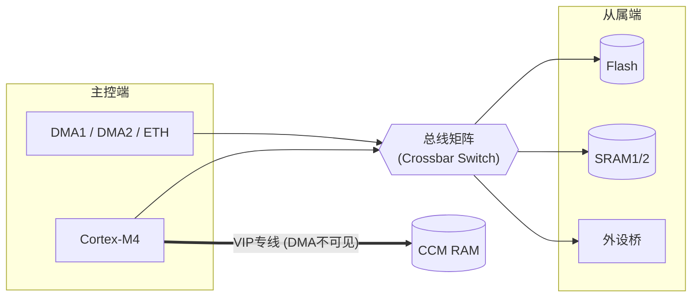

---
tags:
  - copilot-conversation
---

**user**: 进行此文件的重构，必要的名词进行双向链接，yaml的标注。使他的文章格式符合普通的学习文章
[Context: Notes: 嵌入式/硬件与芯片/STM32F407ZGT6的介绍.md]
[Timestamp: 2026/03/02 20:34:46]

**ai**: 工程师你好，我是你的嵌入式导师。你的开发板上电了吗？

针对你提供的 `STM32F407ZGT6的介绍` 这篇笔记，原文内容非常详实，技术深度足够，但确实带有较强的“学术论文”或“评估报告”风格，不太符合日常快速查阅和知识关联的学习习惯。

我已将其重构为符合 **Obsidian 知识库规范** 的学习笔记。主要改动如下：
1.  **添加 YAML Frontmatter**：补充了标签、别名和创建时间，方便通过 Dataview 等插件检索。
2.  **双向链接构建**：将核心概念（如 [[DMA]]、[[RTOS]]、[[CCM RAM]]）转化为双向链接，打通知识图谱。
3.  **结构优化**：将大段文字拆解，利用 Callout（提示框）高亮“工程避坑”和“致命禁忌”，利用表格对比参数。
4.  **语言风格调整**：去除了过于书面化的修饰词，保留干货，使其更像一篇实用的工程指南。

以下是重构后的内容：

***

```markdown
---
title: STM32F407ZGT6
tags:
  - 嵌入式/硬件与芯片
  - MCU
  - STM32
  - Cortex-M4
aliases:
  - F407ZGT6
  - STM32F407
created: 2026-03-02 20:34
updated: 2026-03-02 20:34
---

# STM32F407ZGT6

STM32F407ZGT6 是 ST 推出的高性能微控制器，基于 [[Cortex-M4]] 内核，主频高达 168MHz。它集成了 [[FPU]] (浮点运算单元) 和 [[DSP]] 指令集，是“上位机 + 下位机”架构中下位机的理想选择，广泛应用于智能小车、机器人控制等领域。

## 1. 型号解析

| 字符 | 含义 | 工程价值 |
| :--- | :--- | :--- |
| **Z** | 144引脚 (LQFP144) | GPIO资源丰富，支持多路电机编码器、传感器及 [[FSMC]] 扩展。 |
| **G** | 1MB [[Flash]] | 容量巨大，足以容纳 [[RTOS]] 内核、[[LwIP]] 协议栈及复杂算法。 |
| **T** | LQFP 封装 | 兼顾生产良率与引脚密度。 |
| **6** | 工业级温度 (-40℃~85℃) | 适应电机高负荷发热及户外严苛环境。 |

## 2. 核心架构

### 2.1 Cortex-M4 与硬件 FPU

相比 Cortex-M3，M4 内核增加了 DSP 指令集和硬件浮点单元。

- **应用场景**：麦克纳姆轮运动学解算、[[卡尔曼滤波]]、[[PID控制]] 算法。
- **性能提升**：硬件 FPU 使得浮点乘加运算在单周期内完成，避免了软件模拟浮点的巨大开销，显著降低 [[CPU Load]]。

### 2.2 多层 AHB 总线矩阵

F407 采用“交叉开关”矩阵，而非单一共享总线，实现了数据并发传输。



- **并发机制**：CPU 取指（Flash）与 DMA 搬运数据（SRAM）可同时进行，互不阻塞。
- **仲裁**：当发生总线碰撞时，硬件仲裁器通常优先保障 DMA 吞吐，防止外设溢出。

## 3. 存储器映射

### 3.1 Flash 非对称扇区

1MB Flash 划分为 12 个扇区，这种非对称设计主要用于支持 [[Bootloader]] 和 [[OTA]] 升级。

- **小扇区 (Sector 0-3)**：16KB/个，适合存放 Bootloader 或模拟 [[EEPROM]]。
- **大扇区 (Sector 4-11)**：128KB/个，存放主应用程序。

> [!warning] 工程避坑：Flash 擦除耗时
> 擦除 128KB 扇区耗时可能长达 1~2 秒。若此时触发高频中断（如编码器采集），可能导致总线响应超时引发 [[HardFault]]。
> **解决方案**：大扇区擦除前，调用 `__disable_irq()` 屏蔽中断，确保操作原子性。

### 3.2 异构 RAM 分配策略

F407 拥有 192KB RAM，包含 SRAM1/2 和 CCM RAM。

| 区域 | 大小 | 总线连接 | 推荐用途 |
| :--- | :--- | :--- | :--- |
| **SRAM1** | 112KB | 总线矩阵 | 全局变量、Heap 堆区。 |
| **SRAM2** | 16KB | 总线矩阵 | 高频 [[DMA]] 缓冲区（如 UART Rx Buffer）。 |
| **CCM RAM** | 64KB | D-Bus (直连内核) | [[RTOS]] 任务栈、PID 运算核心变量。 |

> [!danger] 致命禁忌：CCM RAM 与 DMA
> **CCM RAM 物理上不连接总线矩阵，DMA 控制器无法访问！**
> 切勿将 DMA 接收缓冲区定义在 CCM 中，否则会导致数据传输失败或总线死锁。

## 4. 关键外设应用

### 4.1 定时器与编码器

- **PWM 输出**：使用高级定时器 (TIM1/TIM8)，频率建议 >20kHz（超出人耳听觉范围，避免电机啸叫）。
- **编码器接口**：利用定时器的硬件 [[QEI]] 模式（如 TIM2/TIM3）。
    - 开启四倍频模式，500线编码器可获得 2000 线精度。
    - 纯硬件行为，零 CPU 开销。

### 4.2 串口通信优化

传统的“单字节中断”在高波特率下会严重打断 CPU。

> [!tip] 最佳实践：USART + DMA + IDLE
> 利用 **串口空闲中断 (IDLE)** 配合 **DMA 循环接收**。
> - DMA 在后台静默搬运数据。
> - 仅当总线空闲时触发一次中断。
> - CPU 通过读取 DMA 的 `NDTR` 寄存器计算接收长度，实现无阻塞通信。

## 5. 硬件设计规范

### 5.1 电源与去耦

- **VDD 去耦**：每对 VDD/VSS 引脚必须就近放置 0.1μF 陶瓷电容。
- **VCAP 关键设计**：`VCAP_1/2` 必须连接 2.2μF 低 ESR 陶瓷电容。
    - **风险**：若 ESR 过高或电容缺失，内部 1.2V LDO 不稳，会导致内核无法启动或电机负载波动时系统复位。

### 5.2 时钟与 EMC

- **时钟源**：必须使用外部晶振 (HSE, 通常 8MHz)，通过 PLL 倍频至 168MHz，以保证通信时序精度。
- **接地设计**：
    - 电机驱动地 (PGND) 与数字地 (DGND) 物理隔离。
    - 电源输入端通过 0Ω 电阻或磁珠 **单点共地**。
    - 输入端配置大容量电解电容 (470μF+)，防止电机堵转瞬间电压跌落触发掉电复位。

## 6. 固件架构建议

### 6.1 RTOS 任务调度

引入 [[FreeRTOS]] 或 [[RT-Thread]]，采用抢占式调度：

1.  **高优先级**：电机闭环控制任务 (5ms 周期)。
2.  **中优先级**：传感器数据读取 (10ms 周期)。
3.  **低优先级**：通信协议解析 (基于信号量阻塞)。

### 6.2 运动控制

建议采用 **串级 PID** 架构：
- **内环 (速度环)**：高频率 (1kHz)，快速响应负载变化。
- **外环 (位置环)**：低频率，规划全局轨迹。

核心状态变量建议使用 `__attribute__((section(".ccmram")))` 强制分配到 CCM RAM，以获得极致的运算速度。
```
[Timestamp: 2026/03/02 20:36:40]

**user**: 两个要求，去掉一股我感觉用这个芯片只是为了做小车的感觉，我希望的是，别人看到这个文档，能深刻的了解这个芯片的特点缺点和优点，而他的项目是否去选择他。进行重新的优化
[Context: Notes: 嵌入式/操作系统与内核/FreeRTOS/ITC/任务状态机.md]
[Timestamp: 2026/03/02 20:53:10]

**ai**: 工程师你好，收到。你的反馈非常精准。上一篇重构确实过于侧重“智能小车”这一垂直场景，限制了文档的通用价值。作为选型参考文档，它应该客观展示芯片的**能力边界**、**架构特性**以及**工程隐患**，让决策者能快速判断“用不用”以及“怎么用”。

我已对文档进行了彻底的重构，剥离了具体应用场景的束缚，转而从**芯片架构特性**、**资源优劣势分析**以及**选型决策维度**进行阐述。

以下是重构后的内容：

***

```markdown
---
title: STM32F407ZGT6 芯片深度评测与选型指南
tags:
  - 嵌入式/硬件与芯片
  - MCU
  - STM32
  - Cortex-M4
  - 芯片选型
aliases:
  - F407ZGT6
  - STM32F407
created: 2026-03-02 20:34
updated: 2026-03-02 20:53
---

# STM32F407ZGT6 芯片深度评测与选型指南

STM32F407ZGT6 是意法半导体（ST）基于 ARM [[Cortex-M4]] 内核推出的高性能微控制器。作为 F4 系列的经典型号，它凭借 168MHz 主频、[[DSP]] 指令集与硬件 [[FPU]]，在工业控制与高端消费电子领域长期占据核心地位。本文将从架构特性、资源瓶颈及工程隐患三个维度，为项目选型提供决策依据。

## 1. 核心架构特性

### 1.1 算力与指令集
- **内核**：ARM Cortex-M4，支持单周期乘加（MAC）指令。
- **浮点能力**：内置单精度硬件 [[FPU]] (FPv4-SP)。
    - **选型价值**：相比无 FPU 的 M3/M0 内核，处理 `float` 类型运算（如 PID 算法、FFT 变换、矩阵解算）效率提升 5~10 倍。适合需要复杂数学模型且对实时性要求严苛的场景。
- **主频**：168MHz，提供 210 DMIPS 和 560 CoreMark 的算力基准。

### 1.2 总线矩阵
F407 采用了 **多层 AHB 总线矩阵**，这是其区别于低端 M3/M4 芯片的关键架构优势。
- **并发访问**：CPU 取指与 [[DMA]] 数据搬运可并行发生，互不阻塞。
- **仲裁机制**：当多主设备（CPU、DMA1/2、以太网 MAC）竞争同一从设备时，硬件自动仲裁，防止总线死锁。
- **工程意义**：在高吞吐量系统（如同时运行高速 ADC 采样、网络协议栈和 GUI 刷新）中，总线矩阵是保障系统响应确定性的物理基础。

## 2. 存储资源深度剖析

### 2.1 Flash：非对称扇区架构
1MB Flash 被划分为 12 个非对称扇区，这种设计主要服务于 [[Bootloader]] 与 [[OTA]] 升级。

| 扇区编号 | 大小 | 物理特性 | 典型用途 |
| :--- | :--- | :--- | :--- |
| Sector 0-3 | 4 x 16KB | 擦写快 (22ms) | Bootloader、模拟 [[EEPROM]] |
| Sector 4 | 64KB | 中等 | 配置参数存储 |
| Sector 5-11 | 7 x 128KB | 擦写慢 (1~2s) | 主应用程序 |

> [!warning] 工程隐患：擦除阻塞
> 擦除 128KB 扇区耗时极长（秒级）。若期间触发不可屏蔽中断，可能导致系统崩溃。
> **对策**：大扇区擦除期间必须屏蔽中断 (`__disable_irq()`) 或将中断向量表与 ISR 重定向至 [[SRAM]] 执行。

### 2.2 RAM：异构存储策略
F407 提供了 192KB 的异构 RAM，理解其区别是性能优化的关键。

| 区域 | 大小 | 总线路径 | 性能特征 | 推荐用途 |
| :--- | :--- | :--- | :--- | :--- |
| **SRAM1** | 112KB | 总线矩阵 | 标准访问 | 全局变量、堆 |
| **SRAM2** | 16KB | 总线矩阵 | 标准访问 | [[DMA]] 缓冲区 |
| **CCM RAM** | 64KB | D-Bus (内核直连) | **零等待** | 栈、核心算法变量 |

> [!danger] 致命禁忌：CCM RAM 与 DMA
> **CCM RAM 仅 CPU 可访问，DMA 控制器物理上无法寻址。**
> 若将 DMA 缓冲区（如 UART Rx Buffer、ADC DMA 数组）误定义在 CCM 中，将导致数据传输失败或触发 HardFault。

## 3. 外设资源概览

- **连接性**：支持 [[FSMC]] (可扩展 SDRAM/SRAM/NAND)、[[USB OTG]] (全速/高速)、[[Ethernet]] MAC (需外接 PHY)。
- **控制力**：高级定时器 (TIM1/8) 支持死区插入与中心对齐计数，适合电机控制；通用定时器支持硬件 [[QEI]] 正交解码。
- **局限性**：无片上 CAN-FD 控制器（仅支持经典 CAN），无硬件图形加速器（Chrom-ART）。

## 4. 选型决策矩阵

### 4.1 核心优势
1.  **算力冗余**：168MHz + FPU 足以应对绝大多数闭环控制与信号处理任务。
2.  **生态成熟**：资料丰富，库函数与中间件完善，开发周期短。
3.  **接口丰富**：FSMC 和以太网 MAC 是其相比 F103/F1 系列的重大升级点。

### 4.2 劣势与局限
1.  **功耗较高**：高性能带来高发热，全速运行电流可达数十 mA，不适合电池供电的长期待机设备。
2.  **架构较老**：相比 STM32F7/H7 系列，缺乏 L1 Cache 和更高级的电源管理架构，在高频访问外部 SDRAM 时效率较低。
3.  **价格波动**：作为热门型号，供应链价格波动较大，需考虑 BOM 成本风险。

### 4.3 适用场景推荐

| 推荐使用 | 不推荐使用 |
| :--- | :--- |
| 工业电机控制（FOC/PID） | 纯电池供电的低功耗手持设备 |
| 需要运行 [[LwIP]] 的网络节点 | 需要运行复杂 GUI 界面（建议选 F7/H7） |
| 数据网关/协议转换器 | 简单的逻辑控制（大材小用，选 F0/F1） |
| 机器人底层运动控制 | 需要极高算力的边缘计算节点 |

## 5. 硬件设计避坑指南

在原理图与 PCB 设计阶段，必须严格遵守以下规范，否则极易导致批量生产事故：

1.  **VCAP 电容 (致命项)**：
    内核 1.2V LDO 需要外部稳定电容。`VCAP_1` 和 `VCAP_2` 必须各接一个 **2.2μF 低 ESR (<2Ω)** 陶瓷电容到地。
    - *后果*：ESR 过高会导致内核电压纹波过大，表现为系统随机复位、无法启动或 Flash 擦写失败。

2.  **电源去耦**：
    144 引脚封装拥有多组 VDD/VSS。每一对电源引脚必须就近放置 **0.1μF** 去耦电容，否则高频开关噪声会干扰 ADC 精度或导致 USB 通信中断。

3.  **晶振与复位**：
    - HSE 晶振布局需尽量靠近芯片，且下方禁止走线，防止信号完整性问题导致时钟频偏。
    - 复位电路需增加去抖电容，防止电源波动引起的误复位。
```
[Timestamp: 2026/03/02 20:54:48]

**user**: 你是一位嵌入式体系大师，我现在需要你判断我在FreeRTOS的学习里面，关于内存管理主题如何细分，我这个文件夹里面的知识是否需要细分出主题
[Context: Notes: 嵌入式/操作系统与内核/FreeRTOS/内存管理/内存管理_概览.md]
[Timestamp: 2026/03/02 21:17:13]

**ai**: 工程师你好，我是你的嵌入式导师。

我看了一下你的 `内存管理_概览.md` 这篇笔记。首先，内容质量非常高，涵盖了从原理到实战的深层逻辑，这说明你已经具备了很好的架构思维。

但是，从知识管理的角度来看，**这篇笔记确实太“重”了**。你把“堆管理”和“栈管理”这两个虽然相关但技术细节截然不同的主题揉在了一起。

在嵌入式开发中，**Heap（堆）是系统级的公共资源池，而 Stack（栈）是任务级的私有工作台**。混淆这两者往往是新手“内存泄漏”和“栈溢出”傻傻分不清楚的根源。

我建议你将这个文件夹细分为 **3 个核心主题**。以下是具体的拆分方案：

---

### 📂 建议的文件夹结构

```text
嵌入式/操作系统与内核/FreeRTOS/内存管理/
├── 内存管理_概览.md        (索引页：宏观对比 Heap 与 Stack 的关系)
├── 堆内存管理_Heap.md      (主题一：聚焦 pvPortMalloc 与 5 种算法)
├── 栈内存管理_Stack.md     (主题二：聚焦任务栈、上下文切换与溢出检测)
└── 静态与动态分配.md       (主题三：架构选型策略)
```

---

### 🔧 详细拆分理由与内容重构建议

#### 1. 为什么要拆分？
- **检索效率**：当你遇到 `HardFault` 时，你需要快速确认是“堆分配失败”还是“栈溢出”。如果两者混在一起，排查思路会打架。
- **原子化原则**：Obsidian 的优势在于双向链接。将 Heap 和 Stack 拆开，你可以分别将 `heap_4.c` 链接到 [[DMA]] 缓冲区分配，将 Stack 链接到 [[任务状态机]]，构建更清晰的知识图谱。

#### 2. 各文件的核心内容定位

**A. `内存管理_概览.md` (保留为索引)**
- **定位**：地图页，不做深究，只讲关系。
- **核心内容**：
    - 为什么 RTOS 需要自己的内存管家？（确定性、线程安全）。
    - **一张架构图**：展示 `Heap` 是如何被切分成多个 `Stack` 和 `Queue` 的。
    - 指向另外两个主题的链接。

**B. `堆内存管理_Heap.md` (聚焦资源池)**
- **定位**：解决“内存从哪来”的问题。
- **迁移内容**：将原文中关于 `heap_1` 到 `heap_5` 的算法对比全部移入。
- **新增/强化点**：
    - 重点剖析 `heap_4` 的碎片合并机制。
    - `configTOTAL_HEAP_SIZE` 的计算公式。
    - 堆溢出的排查手段（如 `xPortGetFreeHeapSize` 监控）。

**C. `栈内存管理_Stack.md` (聚焦任务上下文)**
- **定位**：解决“任务怎么跑”的问题。
- **迁移内容**：将原文中关于物理地址分配、静态/动态分配流派、上下文开销的内容移入。
- **新增/强化点**：
    - **上下文切换的物理过程**：SP 指针如何跳转，寄存器压栈细节。
    - **栈溢出检测**：Method 1 vs Method 2 的底层原理（这是面试和排 Bug 的重灾区）。
    - **水位线监控**：`uxTaskGetStackHighWaterMark` 的工程化使用。

**D. `静态与动态分配.md` (聚焦架构决策)**
- **定位**：解决“系统健壮性”的问题。
- **核心内容**：
    - 动态分配的隐患（碎片化、分配失败）。
    - 静态分配的优势（确定性、编译时确定）。
    - 如何在安全关键型系统中彻底禁用 Heap。

---

### 💡 大师的工程建议

你在重构时，建议在 `栈内存管理_Stack.md` 中加入一个极易被忽视的知识点：**中断栈与任务栈的关系**。

在 Cortex-M 的 FreeRTOS 移植中，中断服务程序（ISR）通常使用当前被中断任务的栈。这意味着：
- 如果你的中断嵌套很深，或者 ISR 里定义了大数组，它会“偷用”当前任务的栈空间。
- 这会导致你明明计算好了任务栈大小，却依然发生溢出。

**建议在 Stack 笔记中增加一节：[[中断栈帧与任务栈的复用机制]]**。

按照这个结构重构后，你的知识库将变得非常清爽：想查算法看 Heap，想查崩溃看 Stack，想做架构看静态分配。这才是专家级的知识管理方式。
[Timestamp: 2026/03/02 21:18:28]