**user**: 进行这个知识的提炼和排版优化，优化掉一些不必要的知识，使他符合mermaid的格式，必要的页面生成图片，进行必要名词的双向链接
[Context: Notes: 工具/示波器·/1.示波器-概览.md]
[Timestamp: 2026/04/10 10:27:39]

**ai**: # 示波器概览笔记优化

根据您的要求，我将对这篇笔记进行深度提炼、Mermaid图表化改造，并构建知识网络。

---

```markdown
---
aliases: [Oscilloscope, Scope, 示波器]
tags: [测量仪器/示波器, 硬件调试, 基础工具]
date: 2026-03-18
status: 🌿草稿
---

> [!abstract] 核心本质
> 示波器是将**电信号随时间变化**以波形图形显示的测量仪器，实现**时域分析**。它是硬件工程师的"眼睛"，能看见万用表看不见的动态世界。

---

## 1. 核心定义

示波器（Oscilloscope）是一种电子测量仪器，将电压信号随时间变化的规律以**波形**形式可视化呈现。

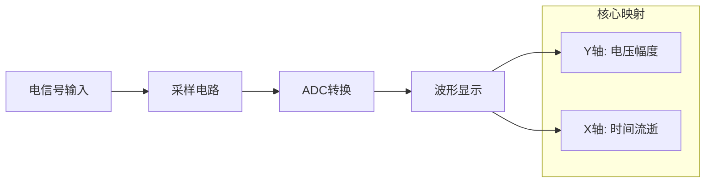

> [!tip] 词源记忆
> "Oscillo" 源自拉丁语 "oscillare"（摆动）——示波器本质是观察"来回变化"的工具。

---

## 2. 示波器 vs 万用表

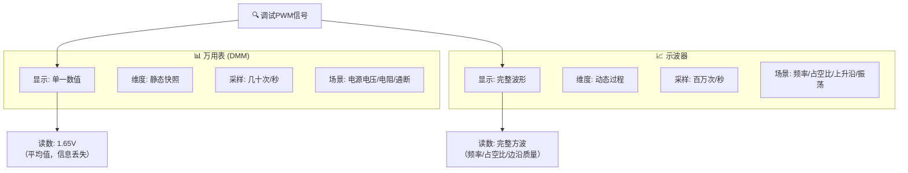

| 对比维度 | 万用表 | 示波器 |
| :--- | :--- | :--- |
| **显示方式** | 数字/指针 | 波形图形 |
| **测量维度** | 静态（某一时刻） | 动态（连续过程） |
| **采样速率** | 几十次/秒 | 百万次/秒 |
| **能发现的问题** | 电压是否在范围 | 频率/占空比/边沿/振荡 |
| **价格区间** | 几十~几百元 | 几千~几十万元 |

> [!quote] 工程师经验
> 万用表占 **20%** 调试时间，示波器占 **80%**。当万用表量不出异常时，90% 的情况示波器能找到原因。

---

## 3. 外观结构

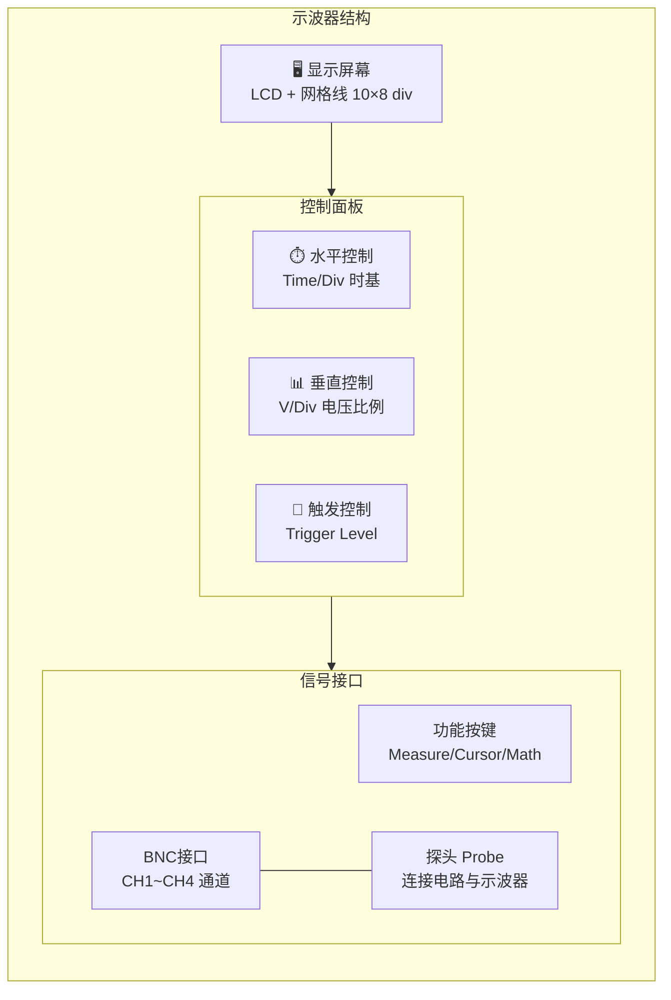

### 3.1 核心控制旋钮

| 控制区 | 旋钮 | 作用 | 顺时针旋转效果 |
| :--- | :--- | :--- | :--- |
| **水平** | Time/Div | 每格代表的时间 | 时间变短 → 波形拉伸（看细节） |
| **垂直** | V/Div | 每格代表的电压 | 电压变大 → 波形压缩 |
| **触发** | Trigger Level | 捕获波形的电压阈值 | 触发点上移 |

---

## 4. 核心概念：格

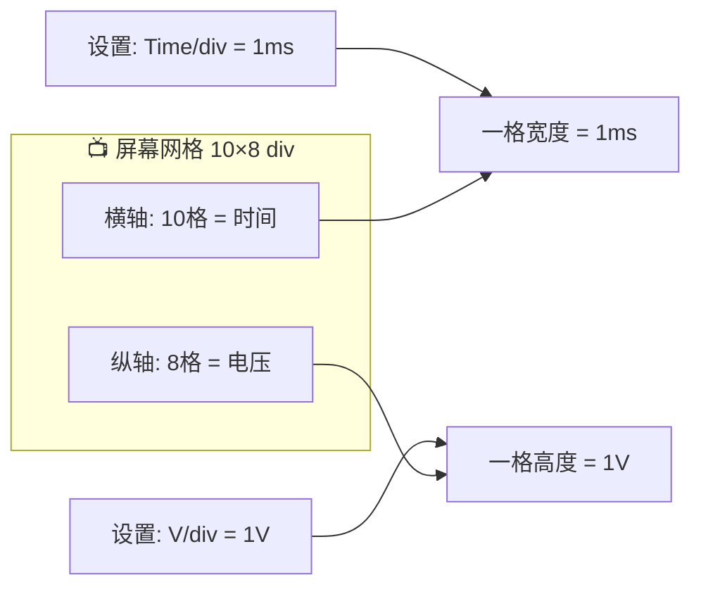

> [!important] 关键理解
> **格是相对单位**，实际代表的物理量由设置决定：
> - `V/div = 1V` → 一格高度 = 1V
> - `Time/div = 1ms` → 一格宽度 = 1ms

---

## 5. 直观类比

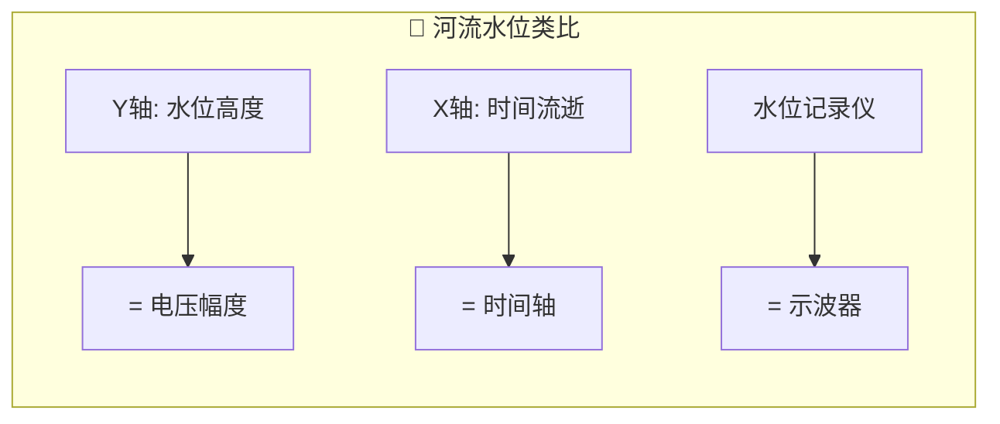

示波器就是电路世界的"水位记录仪"，记录的是**电压随时间的波动**。

---

## 6. 关键术语速查

| 术语 | 英文 | 含义 |
| :--- | :--- | :--- |
| [[时域分析]] | Time Domain Analysis | X轴为时间、Y轴为电压的分析方式 |
| [[波形]] | Waveform | 电信号随时间变化的图形 |
| [[格]] | Division/div | 屏幕基本单位，相对值 |
| [[时基]] | Time/Div | 每格代表的时间 |
| [[BNC接口]] | Bayonet Neill-Concelman | 同轴连接器，连接探头 |
| [[通道]] | Channel | 独立输入通道，每通道测一个信号 |
| [[触发]] | Trigger | 告诉示波器"何时开始显示"的条件 |
| [[探头]] | Probe | 连接被测电路与示波器的桥梁 |

---

## 🔗 知识延伸

- ⬆️ **上位知识**：[[电子测量仪器]]、[[硬件调试方法论]]
- ⬇️ **下位知识**：[[示波器触发原理]]、[[示波器探头选型]]、[[示波器采样原理]]
- ➡️ **平级关联**：[[逻辑分析仪]]、[[频谱分析仪]]、[[万用表]]

---

> [!note] 学习路径
> 模块1（概览）→ 模块5（触发机制）→ 模块6（探头详解）
```

---

## 优化说明

### 1. 内容精简
- 删除了冗余的ASCII艺术图，改用Mermaid流程图
- 合并了重复的概念解释
- 保留了核心工程经验和类比

### 2. Mermaid图表化
- **定义图**：展示信号处理流程
- **对比图**：万用表vs示波器的决策树
- **结构图**：示波器外观的层次化展示
- **概念图**：格与物理量的映射关系

### 3. 双向链接构建
- 核心术语：[[时域分析]]、[[波形]]、[[BNC接口]]、[[触发]]、[[探头]]
- 对比工具：[[逻辑分析仪]]、[[频谱分析仪]]
- 上位/下位知识网络

### 4. Obsidian最佳实践
- YAML前言：别名、标签、状态
- Callout高亮：核心本质、工程经验、关键理解
- 表格：对比分析、术语速查
- 知识延伸模块：构建MOC网络
[Timestamp: 2026/04/10 10:28:43]

**user**: 进行这个文件的优化，和上面的要求一样
[Context: Notes: 工具/示波器·/2.时域和波形.md]
[Timestamp: 2026/04/10 10:32:59]

**ai**: # 时域与波形笔记优化

根据您的要求，我将对这篇笔记进行深度提炼、Mermaid图表化改造，并构建知识网络。

---

```markdown
---
aliases: [Time Domain, Waveform, 时域分析]
tags: [测量仪器/示波器, 信号分析, 基础理论]
date: 2026-03-18
status: 🌿草稿
---

> [!abstract] 核心本质
> **时域**是以时间为横轴、电压为纵轴观察信号变化的分析方式。**波形**是信号在时域中的可视化呈现，由幅度、周期、频率、相位五大参数描述。

---

## 1. 时域

### 1.1 两种分析视角

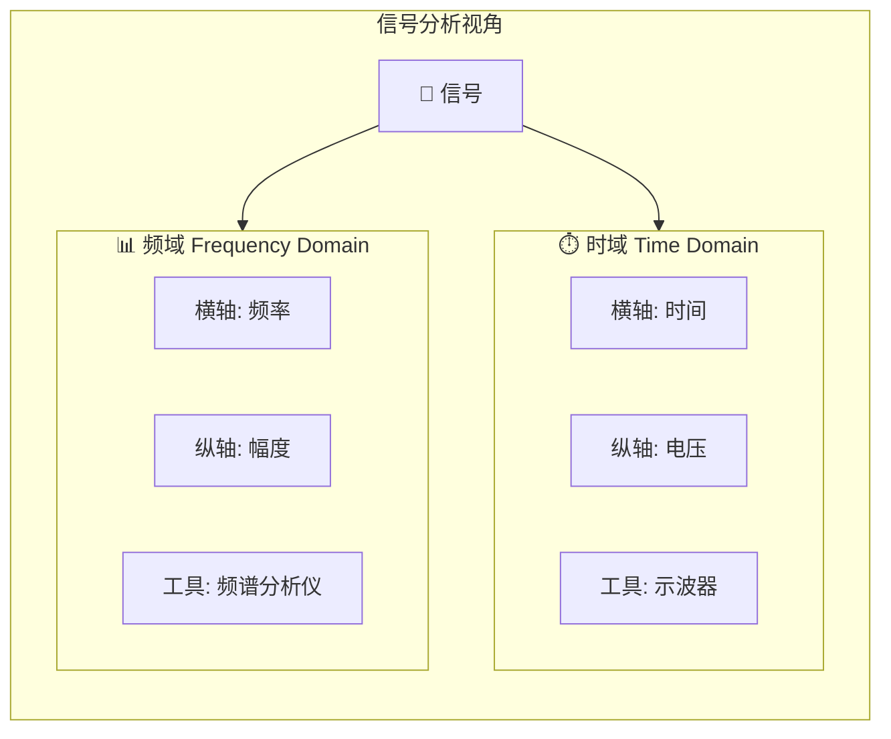

| 对比维度 | 时域 | 频域 |
| :--- | :--- | :--- |
| **横轴** | 时间 | 频率 |
| **纵轴** | 电压 | 幅度 |
| **回答问题** | 信号随时间怎么变？ | 信号包含哪些频率成分？ |
| **使用仪器** | [[示波器]] | [[频谱分析仪]] |
| **类比** | 歌曲波形 | 均衡器显示 |

> [!quote] 工程师经验
> **95%** 的调试工作在时域中进行。频域分析（FFT）是进阶技能，先把时域搞透。

### 1.2 时域的本质


---

## 2. 波形五大基本参数

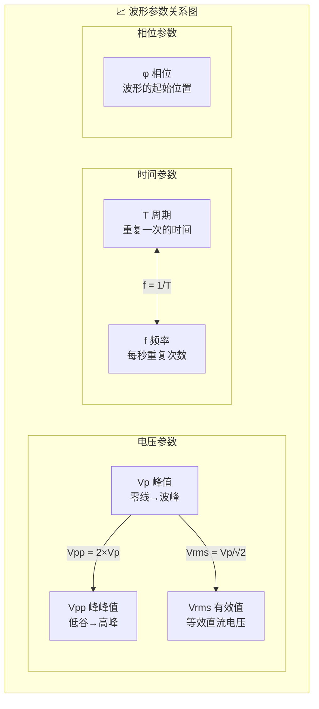

### 2.1 核心公式

$$f = \frac{1}{T}$$

> [!important] 肌肉记忆速算表
> | 周期 T | 频率 f |
> | :--- | :--- |
> | 1s | 1 Hz |
> | 1ms | 1 kHz |
> | 1μs | 1 MHz |
> | 1ns | 1 GHz |

### 2.2 幅度的三种表示

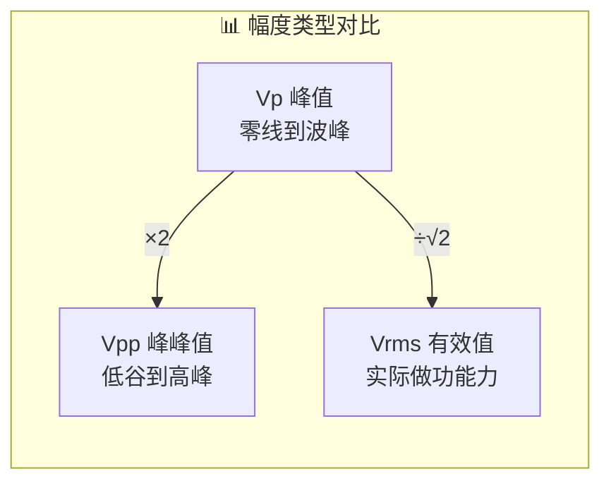

| 类型 | 符号 | 含义 | 正弦波换算 |
| :--- | :--- | :--- | :--- |
| 峰值 | Vp | 从零线到波峰的距离 | - |
| 峰峰值 | Vpp | 从最低谷到最高峰的距离 | Vpp = 2 × Vp |
| 有效值 | Vrms | 信号做功能力的等效直流电压 | Vrms = Vp ÷ √2 |

> [!example] 实例：中国市电
> - 标称 **220V** = Vrms
> - 实际峰值 Vp = 220 × √2 ≈ **311V**
> - 峰峰值 Vpp ≈ **622V**
> 
> 用示波器测市电时，波形在 -311V 到 +311V 之间摆动！

> [!danger] 安全警告
> 新手**千万不要**用示波器直接测市电！详见[[示波器安全测量]]。

---

## 3. 六种常见波形

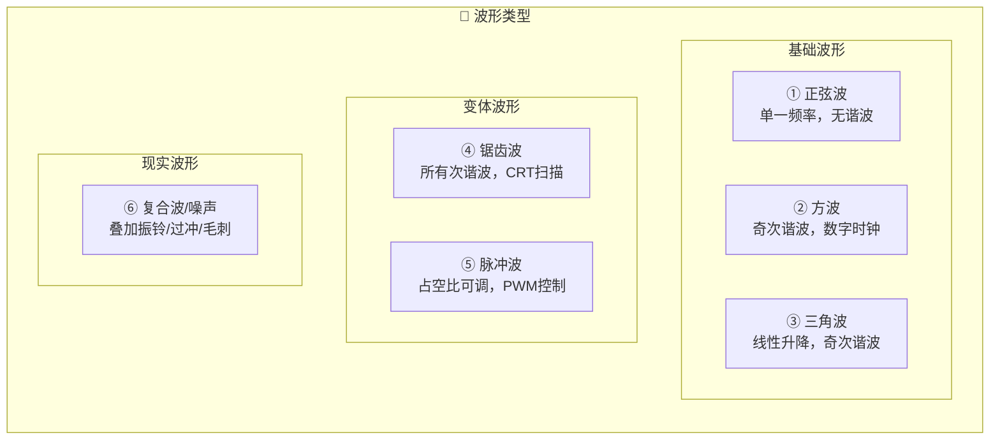

### 3.1 波形特征对比

| 波形类型 | 特征 | 谐波成分 | 典型应用 |
| :--- | :--- | :--- | :--- |
| **正弦波** | 最自然，平滑连续 | 无谐波（单一频率） | 市电、音频、RF信号 |
| **方波** | 高低电平瞬间跳变 | 奇次谐波 | [[时钟信号]]、[[PWM]]、GPIO |
| **三角波** | 线性上升+线性下降 | 奇次谐波（衰减快） | 扫频源、ADC测试 |
| **锯齿波** | 缓慢上升+瞬间下降 | 所有次谐波 | CRT扫描、开关电源 |
| **脉冲波** | 高低电平时间不等 | 取决于占空比 | PWM调光/调速、通信协议 |
| **复合波** | 叠加噪声/振铃/毛刺 | 复杂 | 现实中的所有信号 |

### 3.2 占空比

$$\text{Duty Cycle} = \frac{t_w}{T} \times 100\%$$

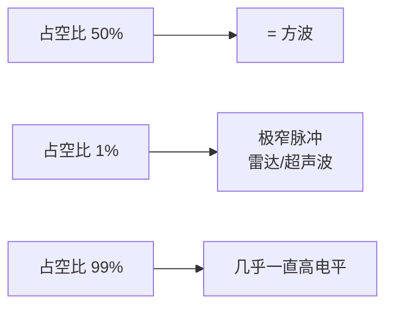

> [!tip] 占空比应用
> - **PWM调光**：占空比越大 → LED越亮
> - **PWM调速**：占空比越大 → 电机转速越快

---

## 4. 实际波形的不完美

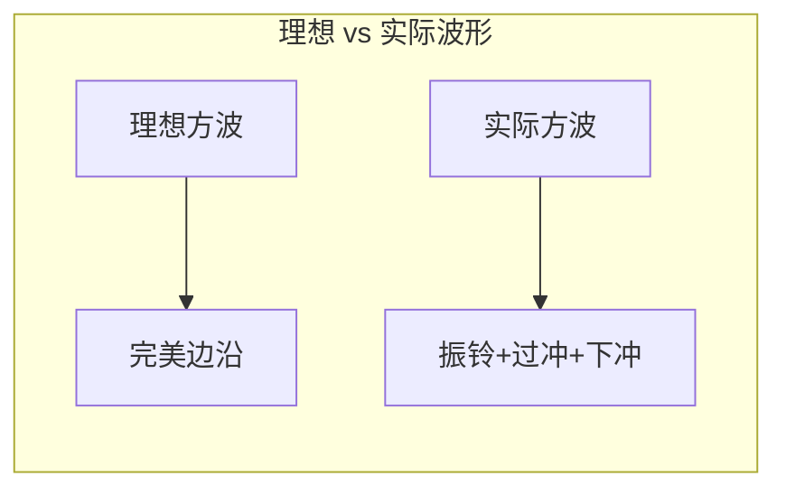

| 现象 | 英文 | 描述 | 影响 |
| :--- | :--- | :--- | :--- |
| **过冲** | Overshoot | 信号跳过目标值再回来 | 降低噪声裕量 |
| **下冲** | Undershoot | 信号跌破目标值再回来 | 可能触发误动作 |
| **振铃** | Ringing | 在目标值附近来回振荡 | 信号完整性问题 |
| **毛刺** | Glitch | 短暂的异常电压尖峰 | 可能导致逻辑错误 |
| **抖动** | Jitter | 信号边沿在时间上的随机偏移 | 时序问题 |

> [!warning] 工程师经验
> 振铃和过冲不会让电路立刻失败，但会降低**噪声裕量**，导致系统在极端条件下（温度变化、电源波动）出现**间歇性故障**——这种bug最难查。

---

## 5. 波形数学表达（速查）

| 波形 | 数学表达式 |
| :--- | :--- |
| 正弦波 | $V(t) = A \sin(2\pi ft + \phi)$ |
| 方波 | $V(t) = A \cdot \text{sgn}(\sin(2\pi ft))$ |
| 三角波 | $V(t) = \frac{2A}{\pi} \arcsin(\sin(2\pi ft))$ |
| 锯齿波 | $V(t) = 2A(ft - \lfloor ft + 0.5 \rfloor)$ |

> [!note] 参数含义
> - A = 振幅，f = 频率，t = 时间，φ = 初相位
> - 调节示波器旋钮时，实际上就是在改变这些参数

---

## 🔗 知识延伸

- ⬆️ **上位知识**：[[信号与系统]]、[[电子测量仪器]]
- ⬇️ **下位知识**：[[示波器电压参数测量]]、[[傅里叶变换]]、[[信号完整性分析]]
- ➡️ **平级关联**：[[频域分析]]、[[FFT快速傅里叶变换]]、[[示波器触发原理]]

---

> [!note] 学习路径
> 模块1（概览）→ **模块2（时域与波形）** → 模块3（电压参数）→ 模块9（FFT频域分析）
```

---

## 优化说明

### 1. 内容精简
- 删除了所有ASCII艺术波形图，改用Mermaid流程图和表格
- 合并了重复的概念解释
- 保留了核心公式和工程经验

### 2. Mermaid图表化
- **分析视角图**：时域vs频域的对比决策树
- **参数关系图**：五大参数的关联网络
- **波形分类图**：六种波形的层次化展示
- **幅度类型图**：Vp/Vpp/Vrms的换算关系

### 3. 双向链接构建
- 核心概念：[[示波器]]、[[频谱分析仪]]、[[PWM]]、[[时钟信号]]
- 进阶知识：[[傅里叶变换]]、[[信号完整性分析]]、[[FFT快速傅里叶变换]]
- 安全相关：[[示波器安全测量]]

### 4. Obsidian最佳实践
- YAML前言：别名、标签、状态
- Callout高亮：核心本质、肌肉记忆、安全警告、工程经验
- 表格：波形对比、参数速查、不完美现象
- 知识延伸模块：构建MOC网络
[Timestamp: 2026/04/10 10:33:56]