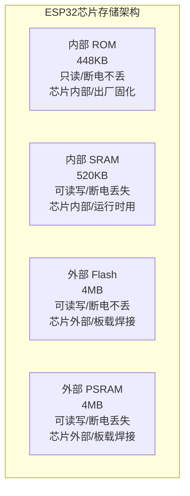
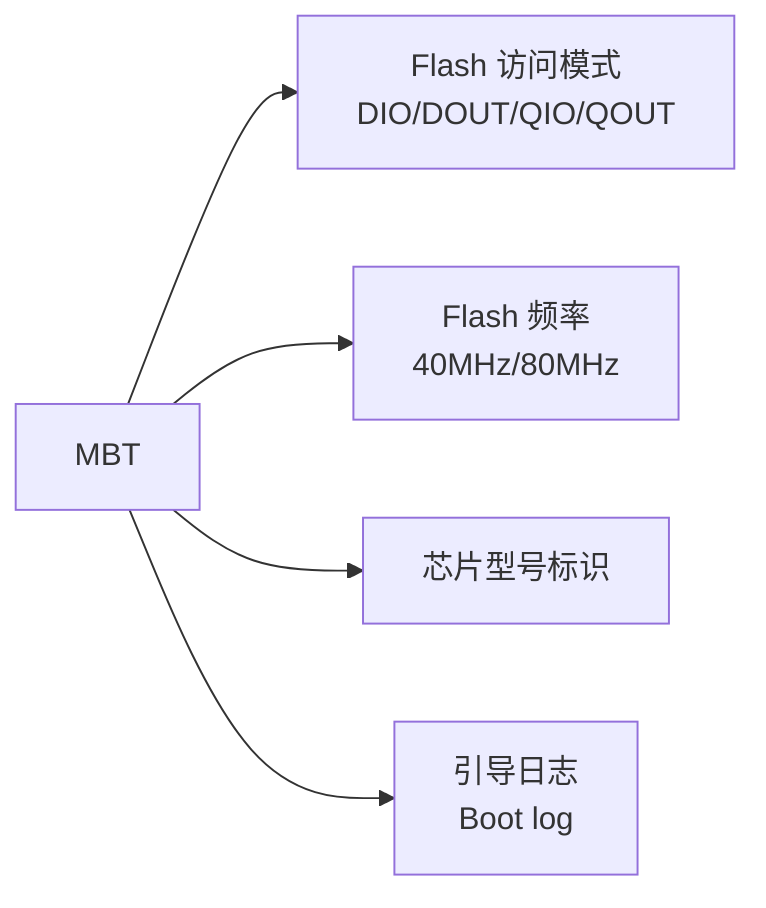
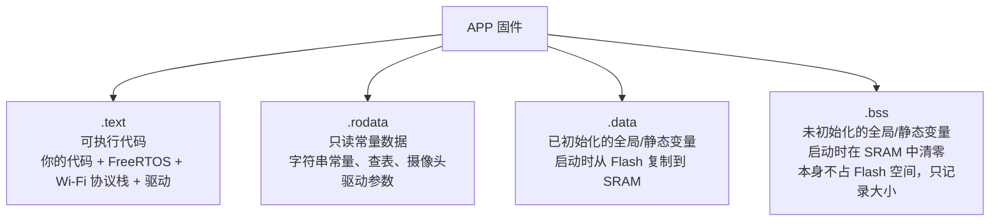
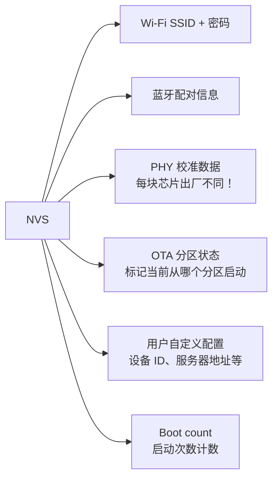
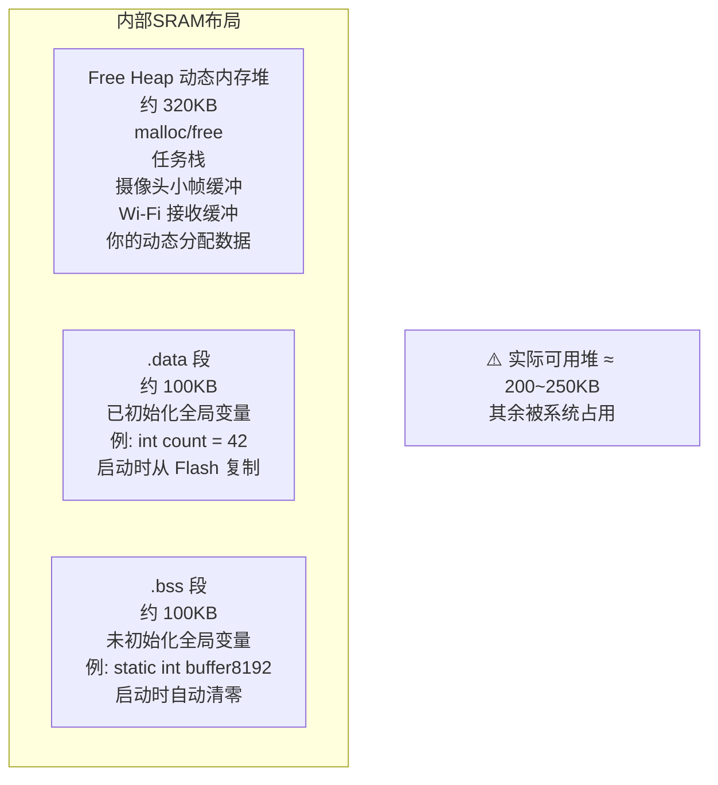
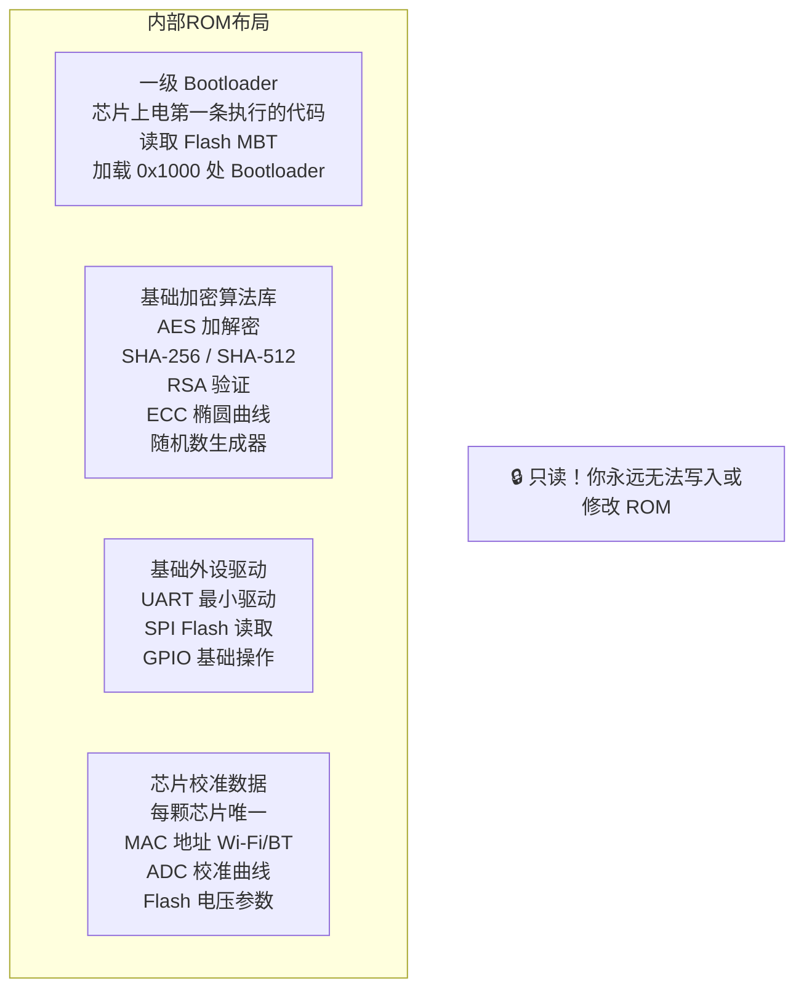
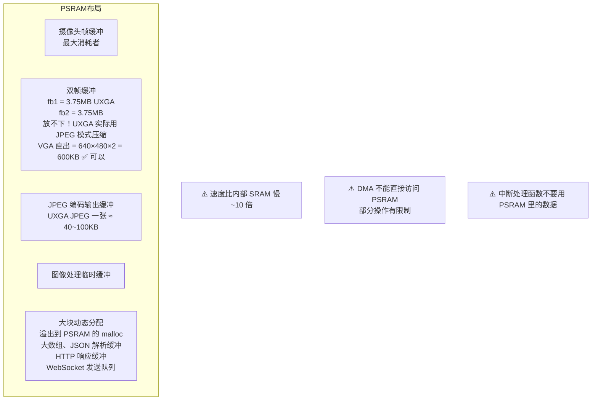
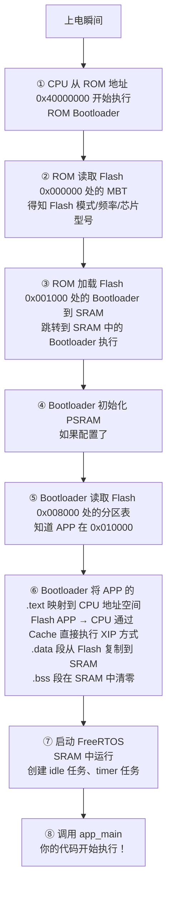
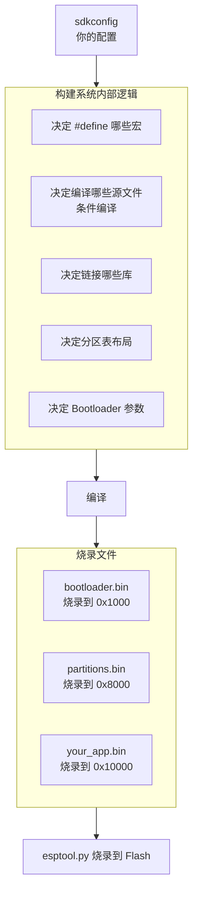

**user**: 进行重新排版和优化
[Context: Notes: 调试烧录-知识/Cmake-Esp32/ESP32-D0WDQ6的启动流程和内存详细.md]
[Timestamp: 2026/04/17 11:07:24]

**ai**: # ESP32 内存架构全景解析

## 一、先建立整体概念：三种存储器的角色



---

## 二、4MB Flash — 存放什么？

Flash 是 ESP32 的 *"硬盘"*，断电不丢失，所有持久化数据都在这里：

### 4MB Flash 物理地址空间（`0x000000` ~ `0x3FFFFF`）

| 偏移地址 | 大小 | 内容 | 作用 |
|---|---|---|---|
| `0x000000` | 4KB | MBT | Master Boot Record（出厂已写）<br/>存储 Flash 启动模式、频率等参数 |
| `0x001000` | 16~20KB | Bootloader | 二级引导程序（你自己编译烧录的）<br/>负责读取分区表、加载 APP、验证签名 |
| `0x008000` | 3KB | Partition Table | 分区表<br/>告诉 Bootloader 各区域在哪、多大 |
| `0x010000`<br/>（`0x110000`） | 1.8~3MB | APP 固件 | 你写的应用程序（最大的区域）<br/>包含代码段（`.text`）+ 只读数据（`.rodata`）<br/>+ FreeRTOS + Wi-Fi 协议栈 + 你的代码 |
| `0x310000`<br/>（示例） | 1MB | SPIFFS/<br/>NVS/FatFS | 文件系统区域<br/>存网页文件、配置文件、OTA 数据 |
| `0x9000` | 16KB | NVS | Non-Volatile Storage<br/>键值对存储：Wi-Fi 密码、校准数据 |
| `0x4000` | 8KB | PHY 数据 | Wi-Fi/蓝牙 校准参数 |

### 各区域详细说明

#### ① `0x000000` — MBT（Master Boot Table）

这块出厂时 Espressif 已经烧好了，你一般不用管。

**内容：**



**作用：** 芯片上电后，ROM Bootloader 先读这里，知道 Flash 怎么访问、从哪加载 Bootloader。

#### ② `0x001000` — Bootloader（二级引导）

你的项目编译后生成的 `bootloader.bin`

**作用：**

1. 初始化 SPI Flash（切换到高速模式）
2. 读取 `0x8000` 处的分区表
3. 根据分区表找到 APP 分区
4. 验证 APP 的 SHA256/签名（如果启用了 Secure Boot）
5. 将 APP 的 `.text` 段映射到内存
6. 跳转到 APP 的入口地址执行

**为什么需要它？**

ROM Bootloader 太简单，只能加载一个固定地址。有了二级 Bootloader 才能支持：

- 多分区（OTA A/B 切换）
- Flash 加密
- 安全启动
- 自定义分区布局

#### ③ `0x008000` — 分区表

分区表本身就是一个 *"目录索引"*：

| # | Name | Type | SubType | Offset | Size |
|---|---|---|---|---|---|
| 1 | nvs | data | nvs | `0x9000` | 16KB |
| 2 | phy_init | data | phy | `0xf000` | 4KB |
| 3 | factory | app | factory | `0x10000` | 3MB |
| 4 | storage | data | spiffs | `0x310000` | 1MB |

**作用：** Bootloader 读这张表，才知道：

- APP 固件在哪个偏移地址
- NVS 数据区在哪
- 文件系统区在哪
- 有没有 OTA 分区（A 区/B 区）

#### ④ `0x010000` — APP 固件

你的应用程序，编译后的 `.bin` 文件，通常 1~3MB

**内部结构：**



#### ⑤ `0x9000` — NVS（Non-Volatile Storage）

键值对存储，类似 Android 的 SharedPreferences

**典型存储内容：**



**特点：**

- 通过 `nvs_set_str` / `nvs_get_str` 读写
- 内部使用磨损均衡（Flash 有擦写寿命）
- 即使 OTA 升级，NVS 数据不丢

---

## 三、520KB SRAM — 存放什么？

SRAM 是 ESP32 的 *"运行内存"*，速度极快但断电丢失：

### 520KB 内部 SRAM 布局



### SRAM 里的典型消耗者

| 组件 | 占用 |
|---|---|
| Wi-Fi 协议栈 | ~50KB |
| FreeRTOS | ~10KB（内核 + IDLE 任务 + Timer 任务） |
| TCP/IP 栈 (lwIP) | ~40KB |
| 蓝牙（如果开启） | ~60KB |
| 摄像头驱动 | ~20KB |
| 你的代码栈+堆 | 剩余部分 |

总需求轻松超过 300KB！所以 ESP32-CAM 必须用 PSRAM 补充

---

## 四、448KB ROM — 存放什么？

ROM 是芯片出厂时 **光刻写入** 的，永远不可修改：

### 448KB 内部 ROM 布局



### ROM 的特殊性

**为什么需要 ROM？**

- 没有 ROM，芯片上电不知道该干什么（Flash 里什么都还没烧）
- ROM 保证任何状态下都能通过 UART 恢复（救砖）
- 加密算法固化在 ROM 里 → Secure Boot 无法被篡改

### ROM vs Flash vs SRAM 对比

| | ROM | Flash | SRAM | PSRAM |
|---|---|---|---|---|
| 位置 | 芯片内部 | 芯片外部 | 芯片内部 | 芯片外部 |
| 可写 | ❌ | ✅ | ✅ | ✅ |
| 速度 | 快 | 慢（需映射） | 最快 | 较慢 |
| 断电 | 保留 | 保留 | 丢失 | 丢失 |
| 容量 | 448KB | 4MB | 520KB | 4MB |
| 存什么 | 固化代码 | 固件+数据 | 运行时 | 大缓冲区 |

---

## 五、4MB PSRAM — 存放什么？

PSRAM（Pseudo-SRAM，伪静态 RAM）本质是一块通过 SPI 接口连接的外部 RAM

### 4MB PSRAM 布局



---

## 六、完整启动流程中各存储器的协作



---

## 七、一句话总结

| 存储器 | 一句话 |
|---|---|
| ROM | 出厂固化，芯片上电第一条指令的来源，永远改不了 |
| Flash | 外部 *"硬盘"*，存固件、分区表、NVS、文件系统，断电不丢 |
| SRAM | 内部 *"内存"*，跑代码的运行时数据，断电即丢，非常紧张 |
| PSRAM | 外部 *"扩展内存"*，专门补 SRAM 不够用的场景（摄像头帧缓冲） |
[Timestamp: 2026/04/17 11:08:16]

**user**: 重新优化和排版这个文件
[Context: Notes: 调试烧录-知识/Cmake-Esp32/sdkconfig.md]
[Timestamp: 2026/04/17 11:09:38]

**ai**: # sdkconfig 文件在 ESP32 烧录中的作用

## 一、它到底是什么？

`sdkconfig` 是 ESP-IDF 构建系统的核心配置文件，本质是一个 **键值对** 文件，决定了：

> 你的固件到底编译了什么功能、占多大空间、跑在什么参数上

它 **不直接参与烧录**，但 **决定了烧录进芯片的固件长什么样**。

---

## 二、从原理上理解：ESP32 固件是怎么生成的



---

## 三、sdkconfig 里面的关键配置项（ESP32-CAM 相关）

### 1. 芯片目标

```c
CONFIG_IDF_TARGET="esp32"          # 告诉编译器：为 ESP32 编译
```

### 2. Flash 与分区（直接影响烧录地址）

```c
CONFIG_ESPTOOLPY_FLASHSIZE_4MB=y   # Flash 大小 = 4MB（你的板子）
CONFIG_ESPTOOLPY_FLASHSIZE="4MB"
CONFIG_PARTITION_LAYOUT_CONFIG="custom"  # 分区表方案
```

这决定了 partition table 怎么分：

**4MB Flash 分区布局示例（Huge APP 方案）：**

| 偏移地址 | 大小 | 用途 |
|---|---|---|
| `0x0000` | 3KB | Bootloader |
| `0x8000` | 3KB | Partition Table |
| `0x10000` | 3MB | Application（你的固件） |
| `0x310000` | 1MB | SPIFFS（文件系统） |

### 3. PSRAM 配置（ESP32-CAM 必须开！）

```c
CONFIG_ESP32_SPIRAM_SUPPORT=y      # 启用 PSRAM 支持
CONFIG_SPIRAM_USE_MEMMAP=y          # PSRAM 映射方式
CONFIG_SPIRAM_MALLOC_RESERVE_INTERNAL=32768  # 保留给内部堆的大小
```

> 不开 PSRAM = 摄像头帧缓冲只能放内部 SRAM = UXGA 直接爆内存崩溃

### 4. 摄像头相关

```c
CONFIG_CAMERA_CORE0=y              # 摄像头任务跑在 Core 0
CONFIG_CAMERA_TASK_STACK_SIZE=4096 # 摄像头任务栈大小
```

### 5. Wi-Fi / BLE

```c
CONFIG_ESP32_WIFI_STATIC_RX_BUFFER_NUM=10   # Wi-Fi 接收缓冲数量
CONFIG_ESP32_WIFI_DYNAMIC_RX_BUFFER_NUM=32
CONFIG_BT_ENABLED=y                          # 是否编译蓝牙（不用就关，省空间）
```

### 6. FreeRTOS

```c
CONFIG_FREERTOS_HZ=1000             # tick 频率 = 1000Hz（1ms 一个 tick）
CONFIG_FREERTOS_MAX_TASK_NAME_LEN=16
CONFIG_FREERTOS_TASK_FUNCTION_WRAPPER=y
```

### 7. 串口与日志

```c
CONFIG_ESP_CONSOLE_UART_NUM=0       # 控制台串口 = UART0
CONFIG_ESP_CONSOLE_UART_BAUDRATE=115200  # 波特率
CONFIG_LOG_DEFAULT_LEVEL_INFO=y     # 日志等级
```

### 8. CPU 频率

```c
CONFIG_ESP32_DEFAULT_CPU_FREQ_240=y  # CPU 跑 240MHz
CONFIG_ESP32_DEFAULT_CPU_FREQ="240"
```

---

## 四、sdkconfig 是怎么生成的？

### 方式一：menuconfig（图形化配置）

```bash
idf.py menuconfig
```

会弹出一个 `ncurses` 界面：

```text
Serial flasher config  --->
Partition Table  --->
Component config  --->
  → ESP32-specific  --->
    → PSRAM  --->
  → Camera  --->
  → Wi-Fi  --->
```

修改后保存，自动写入 `sdkconfig`。

### 方式二：直接编辑 sdkconfig 文本

用文本编辑器直接改，然后重新编译。

### 方式三：sdkconfig.defaults（项目默认配置）

- 项目根目录放一个 `sdkconfig.defaults`
- 首次构建时自动生成 `sdkconfig`
- 团队协作时用它同步配置

---

## 五、它和烧录命令的关系

```bash
idf.py -p COM3 flash monitor
```

这条命令背后发生了什么：

1. CMake 读取 `sdkconfig`
2. 生成 `build/config/sdkconfig.h`（C 语言头文件，供 `#ifdef` 使用）
3. 根据配置选择编译源文件
4. 编译出 `.bin` 文件
5. `esptool.py` 根据 `sdkconfig` 中的 Flash 大小、模式、频率设置烧录参数：
   - `CONFIG_ESPTOOLPY_FLASHSIZE` → 告诉 `esptool` Flash 是 4MB
   - `CONFIG_ESPTOOLPY_FLASHMODE "DIO"` → Flash 读取模式
   - `CONFIG_ESPTOOLPY_FLASHFREQ "40M"` → Flash 频率 40MHz
6. 按分区表偏移地址写入三个 `.bin`

---

## 六、实战：ESP32-CAM 推荐的 sdkconfig.defaults

你在项目中创建这个文件，确保关键配置不遗漏：

```ini
# Target
CONFIG_IDF_TARGET="esp32"

# Flash
CONFIG_ESPTOOLPY_FLASHSIZE_4MB=y
CONFIG_ESPTOOLPY_FLASHMODE_DIO=y
CONFIG_ESPTOOLPY_FLASHFREQ_40M=y

# PSRAM - 必须开启
CONFIG_ESP32_SPIRAM_SUPPORT=y
CONFIG_SPIRAM_BOOT_INIT=y
CONFIG_SPIRAM_USE_MALLOC=y
CONFIG_SPIRAM_MALLOC_ALWAYSINTERNAL=16384
CONFIG_SPIRAM_MALLOC_RESERVE_INTERNAL=32768

# Partition - 大 APP 分区
CONFIG_PARTITION_TABLE_HUGE_CSV=y

# Wi-Fi
CONFIG_ESP32_WIFI_STATIC_RX_BUFFER_NUM=16
CONFIG_ESP32_WIFI_DYNAMIC_RX_BUFFER_NUM=32

# CPU
CONFIG_ESP32_DEFAULT_CPU_FREQ_240=y

# Camera JPEG Quality
CONFIG_CAMERA_JPEG_QUALITY=12

# Log
CONFIG_LOG_DEFAULT_LEVEL_INFO=y
```

---

## 七、避坑清单

| # | 坑 | 说明 |
|---|---|---|
| 1 | 改了 `sdkconfig` 但没重新编译 | 必须执行 `idf.py fullclean` 再编译，否则增量编译可能不刷新 |
| 2 | PSRAM 没开就初始化摄像头 | 100% 会 OOM（Out of Memory）崩溃 |
| 3 | Flash 大小配错 | 配成 2MB 但实际是 4MB → 固件能跑但分区表不对，可能覆盖数据 |
| 4 | `sdkconfig` 冲突 | 多个 `CONFIG_XXX=y` 和 `CONFIG_XXX=n` 同时存在 → 以最后一个为准，容易混乱 |
| 5 | 团队成员配置不一致 | 用 `sdkconfig.defaults` 统一管理，不要直接交换 `sdkconfig` |
| 6 | Arduino 环境没有 `sdkconfig` | Arduino IDE 通过菜单选项等价配置，底层原理相同 |
[Timestamp: 2026/04/17 11:10:57]