**user**: 阅读我的这个文件，我想要建立一个对存储器的总体认知，不局限于嵌入式的芯片，包含电脑等那些大型元件
[Context: Notes: 嵌入式/硬件与芯片/内存/存储器总体认知.md]
[Timestamp: 2026/04/26 16:56:08]

**ai**: 工程师你好，我是你的嵌入式导师。你的开发板上电了吗？今天遇到了什么棘手的技术问题？无论是HardFault、时序错乱，还是系统架构优化，随时抛给我。

---

我看了你的笔记，框架是对的——**CPU ↔ 缓存 ↔ 内存 ↔ 硬盘**这条数据通路是存储器层次结构的核心。但作为"总体认知"，还可以从更多维度来构建一个完整的知识图谱。

让我帮你把这个认知框架扩展一下：

---

## 一、存储器层次结构的本质：速度、容量、成本的三角博弈

```mermaid
pyramid
    title 存储器层次结构金字塔
    "CPU寄存器" : "延迟: ~1ns | 容量: 几百字节"
    "L1 Cache (SRAM)" : "延迟: ~1-2ns | 容量: 32-64KB"
    "L2 Cache (SRAM)" : "延迟: ~3-10ns | 容量: 256KB-1MB"
    "L3 Cache (SRAM)" : "延迟: ~10-20ns | 容量: 2-64MB"
    "主内存 (DRAM)" : "延迟: ~50-100ns | 容量: 4-128GB"
    "SSD (NAND Flash)" : "延迟: ~25μs | 容量: 256GB-4TB"
    "HDD (机械硬盘)" : "延迟: ~5-10ms | 容量: 1-20TB"
```

**核心规律**：越往上，速度越快、容量越小、每字节成本越高；越往下，速度越慢、容量越大、每字节成本越低。

---

## 二、从技术实现维度分类

| 类型 | 技术原理 | 代表器件 | 易失性 | 典型应用 |
|------|----------|----------|--------|----------|
| **SRAM** | 锁存器（6个晶体管存1bit） | CPU Cache | 易失 | L1/L2/L3缓存 |
| **DRAM** | 电容充放电（1晶体管+1电容） | DDR4/DDR5内存条 | 易失 | 主内存 |
| **NOR Flash** | 浮栅晶体管，随机读取快 | 嵌入式Flash | 非易失 | MCU程序存储、BIOS |
| **NAND Flash** | 浮栅晶体管，页读写，密度高 | SSD、eMMC、U盘 | 非易失 | 大容量存储 |
| **MRAM** | 磁阻效应 | 新型非易失RAM | 非易失 | 车载、工业（新兴） |
| **HDD** | 磁盘磁头机械读写 | 机械硬盘 | 非易失 | 冷数据存储 |

---

## 三、嵌入式 vs 通用计算机的存储架构对比

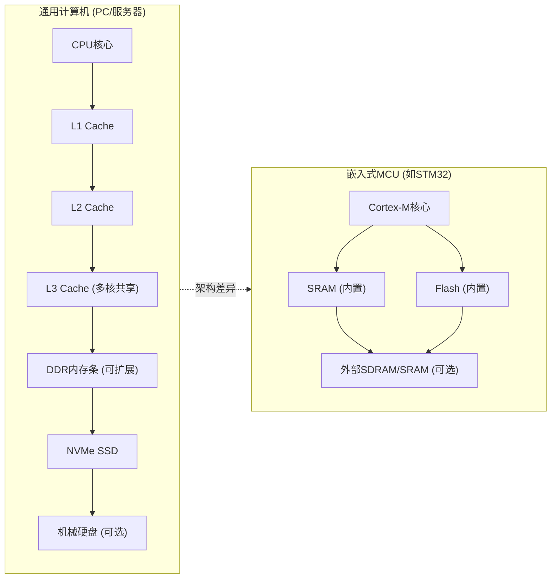

**关键差异**：
1. **PC**：存储器是分立的，可插拔扩展；有多级缓存；内存条可换
2. **MCU**：存储器集成在芯片内部；通常无缓存（Cortex-M7有L1）；Flash直接映射到地址空间

---

## 四、数据流动的完整视角

你笔记里提到"数据必须一级一级上下传"，这个理解是对的，但可以更精确：

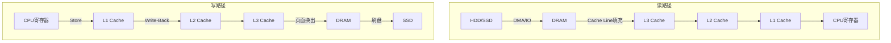

**关键概念**：
- **Cache Line**：缓存传输的最小单位（通常64字节），即使只读1字节，也会拉取整行
- **Write-Back vs Write-Through**：写回（延迟写）vs 写通（立即写），影响性能和数据安全
- **DMA**：直接内存访问，绕过CPU搬运数据

---

## 五、嵌入式工程师必须关注的特殊点

| 问题 | PC端 | 嵌入式端 |
|------|------|----------|
| **Flash擦写寿命** | SSD有磨损均衡算法，不用操心 | MCU Flash仅1-10万次，需谨慎设计 |
| **内存碎片** | 有虚拟内存，碎片影响小 | 无MMU，碎片可能导致分配失败 |
| **Cache一致性** | 硬件自动维护 | Cortex-M7需手动维护D-Cache |
| **掉电保护** | 有UPS/日志系统 | 需自己设计掉电检测+数据保护 |

---

## 六、建议的认知框架总结

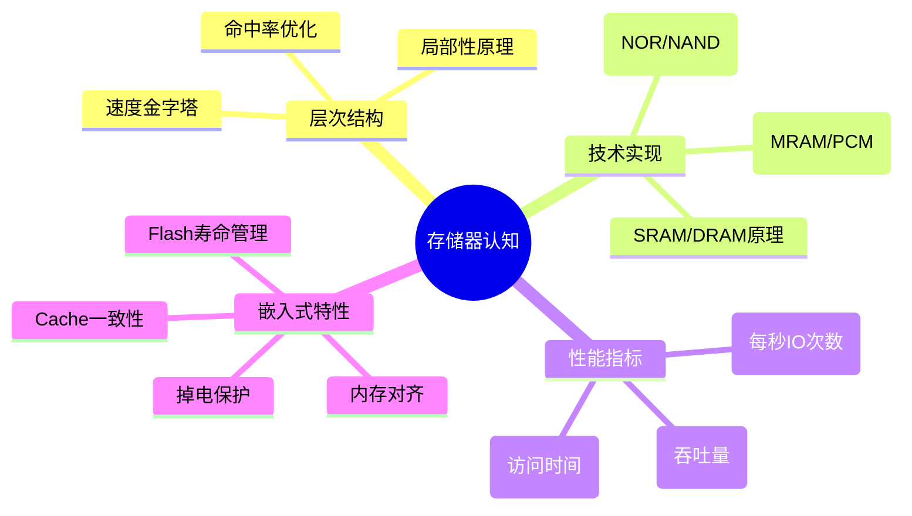

---

**大师的工程建议**：

1. **理解"为什么"比记住"是什么"更重要**：比如为什么需要Cache？因为CPU速度远快于内存，没有Cache CPU会空转等待
2. **嵌入式视角的特殊性**：PC端很多"透明"的机制（如Cache一致性、磨损均衡），在嵌入式端需要你手动处理
3. **推荐延伸学习**：
   - DRAM刷新机制（为什么需要定期刷新）
   - Flash FTL（闪存转换层）原理
   - Cache映射方式（直接映射、组相联）

需要我深入展开哪个部分吗？比如DRAM的工作时序、Flash的磨损均衡策略，或者Cache一致性问题的实际排查？
[Timestamp: 2026/04/26 16:56:52]

**user**: 我想要对寄存器这个概念进入深入的理解，他的适用场景实在是太多了，从LR等关于栈帧的，到外设的多种及寄存器到到电脑里面的寄存器？他到底是什么？到底在芯片里面扮演了什么作用？在硬件上是如何构成的，我希望和你好好讨论一下
[Context: Notes: 嵌入式/硬件与芯片/内存/存储器总体认知.md]
[Timestamp: 2026/04/26 17:02:04]

**ai**: 工程师你好，这个问题问得非常好。"寄存器"这个词确实被过度使用了，导致很多工程师混淆了不同层面的概念。让我们从最底层的硬件开始，一层一层构建完整的认知。

---

## 一、先给结论：寄存器的统一定义

**寄存器 = 能够在一个时钟周期内完成读/写的存储单元**

无论是CPU内部的R0、PC、LR，还是外设的GPIO->ODR，本质上都是**D触发器**的集合。区别只在于：
- **谁在访问它**（CPU核心 vs 外设逻辑）
- **地址是否可见**（有地址映射 vs 无地址映射）
- **功能是什么**（数据暂存 vs 硬件控制）

---

## 二、硬件层面：寄存器是如何构成的？

### 2.1 基本单元：D触发器

```mermaid
flowchart LR
    subgraph DFF["D触发器 (1-bit寄存器)"]
        D["D输入"] -->|上升沿锁存| Q["Q输出"]
        CLK["时钟CLK"] --> DFF
        RST["复位"] --> DFF
    end
    
    style DFF fill:#e1f5fe
```

**工作原理**：
- 每个时钟上升沿，D端的值被"锁存"到Q端
- 在下一个时钟上升沿到来之前，Q端保持不变
- 这就是"寄存"的含义——**锁存并保持状态**

### 2.2 N位寄存器 = N个D触发器并联

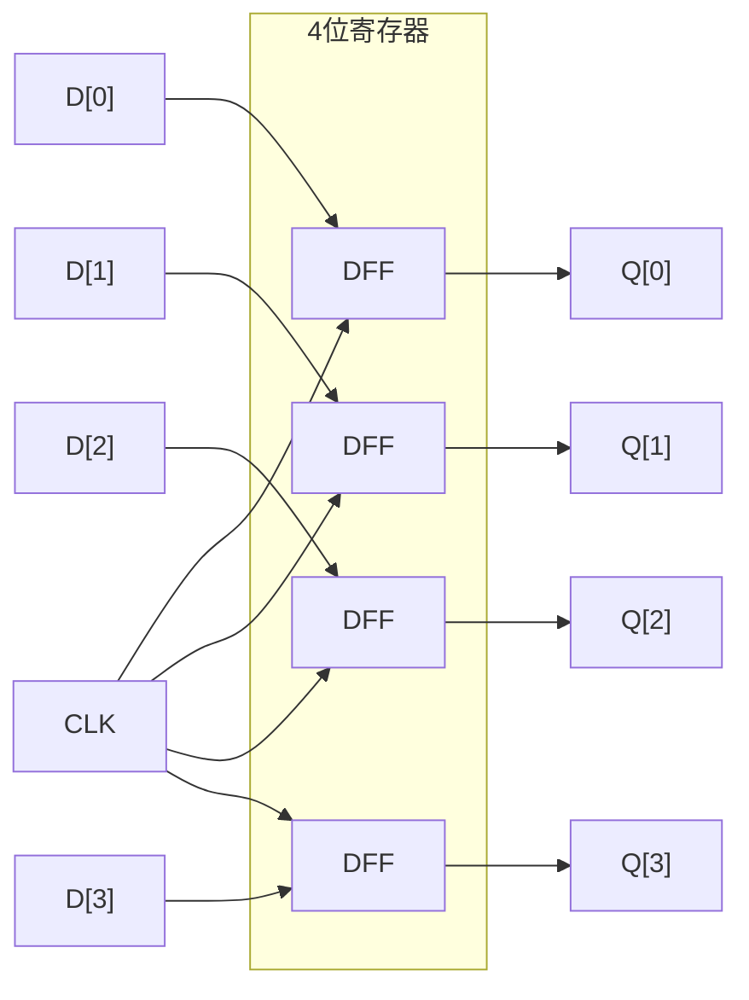

**关键点**：一个32位寄存器，就是32个D触发器共享同一个时钟信号。

---

## 三、寄存器的三大分类（这才是你困惑的根源）

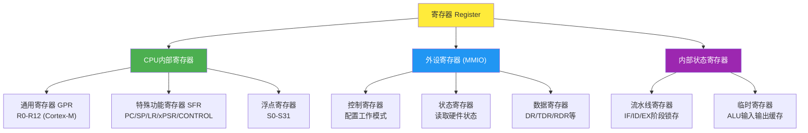

### 3.1 CPU内部寄存器（程序员可见）

这是你写汇编时直接操作的寄存器：

| 寄存器 | 全称 | 作用 | 硬件位置 |
|--------|------|------|----------|
| R0-R12 | 通用寄存器 | 存放临时数据、函数参数、返回值 | CPU核心内部 |
| SP (R13) | 栈指针 | 指向当前栈顶 | CPU核心内部 |
| LR (R14) | 链接寄存器 | 存放函数返回地址 | CPU核心内部 |
| PC (R15) | 程序计数器 | 存放下一条指令地址 | CPU核心内部 |
| xPSR | 程序状态寄存器 | N/Z/C/V标志 + 异常状态 | CPU核心内部 |

**特点**：
- **无地址**：不占用内存地址空间，通过指令名访问（`MOV R0, #1`）
- **最快**：CPU直接访问，无总线延迟
- **数量有限**：ARM架构只有16个（R0-R15）

### 3.2 外设寄存器（MMIO - Memory Mapped I/O）

这是你写C代码时通过指针访问的寄存器：

```c
#define GPIOA_ODR  (*(volatile uint32_t *)0x40020014)
GPIOA_ODR = 0x01;  // 写寄存器
```

**特点**：
- **有地址**：映射到内存地址空间
- **通过总线访问**：CPU → AHB/APB总线 → 外设
- **有副作用**：读写可能触发硬件动作（如写DR触发UART发送）

### 3.3 内部状态寄存器（程序员不可见）

这是CPU流水线内部的寄存器，你永远看不到：

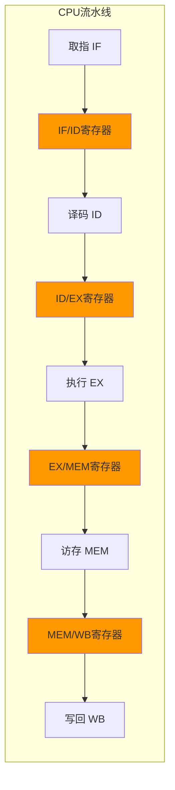

**作用**：锁存每个流水阶段的中间结果，防止数据冒险。

---

## 四、为什么需要寄存器？三个核心作用

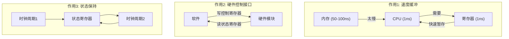

### 作用1：速度缓冲（解决CPU与内存的速度差距）

CPU运算速度是纳秒级，内存访问是几十纳秒级。没有寄存器，CPU每执行一条指令都要等内存。

**寄存器就是CPU的"工作台"**：
- 内存是"仓库"（大但远）
- Cache是"货架"（中距离）
- 寄存器是"工作台"（小但就在手边）

### 作用2：硬件控制接口（软件操控硬件的唯一手段）

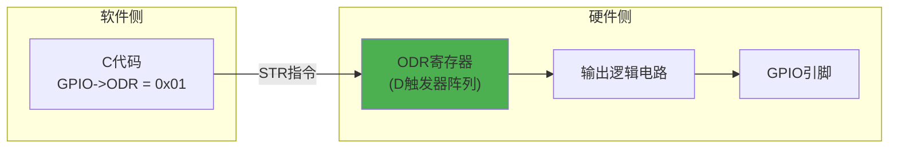

**本质**：写寄存器 = 改变D触发器的值 = 改变硬件电路的状态

### 作用3：状态保持（时序电路的基础）

组合逻辑电路没有记忆，输出只取决于当前输入。**加上寄存器，就变成了时序电路**，可以"记住"之前的状态。

```
组合逻辑：Output = f(Input)
时序逻辑：Output = f(Input, CurrentState)
         CurrentState = g(PreviousState, Input)
```

---

## 五、深入理解：外设寄存器的硬件实现

以GPIO输出数据寄存器（ODR）为例：

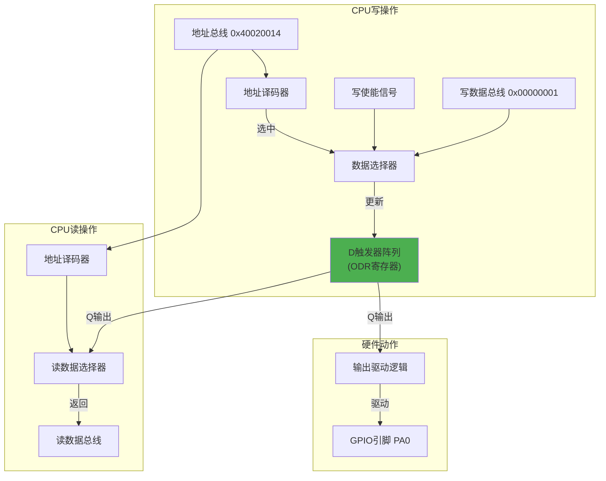

**关键理解**：
1. **地址译码**：地址总线上的值决定"选中"哪个寄存器
2. **写使能**：只有WR信号有效时，D触发器才更新
3. **读路径**：D触发器的Q端直接连到读数据总线

---

## 六、LR寄存器的特殊角色：栈帧管理的核心

你提到了LR，这是CPU寄存器中比较特殊的一个：

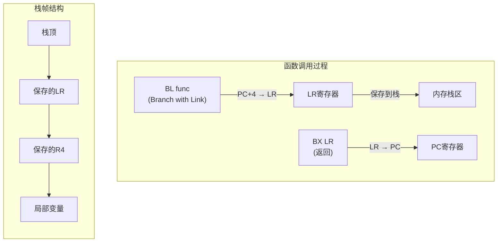

**LR的本质**：
- 它就是一个普通的32位寄存器（D触发器阵列）
- 特殊之处在于**CPU硬件会自动操作它**：
  - 执行`BL`指令时，硬件自动把`PC+4`写入LR
  - 执行`BX LR`时，硬件自动把LR的值写入PC

---

## 七、总结：寄存器的统一认知框架

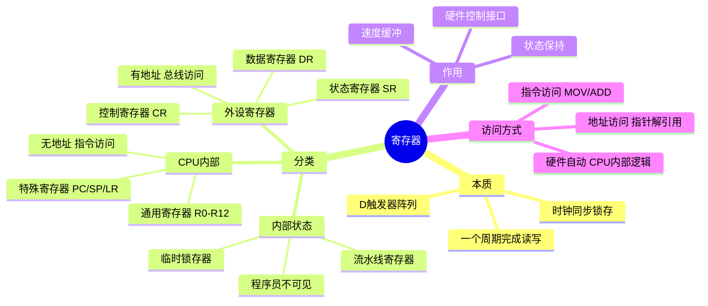

---

## 八、大师的工程建议

1. **区分"程序员可见"和"程序员不可见"**：
   - 可见：R0-R15、外设寄存器
   - 不可见：流水线寄存器、ALU临时寄存器

2. **理解volatile的必要性**：
   ```c
   // 外设寄存器必须加volatile
   #define GPIO_ODR (*(volatile uint32_t *)0x40020014)
   ```
   因为外设寄存器的值可能被硬件改变，编译器不能优化掉对它的读写。

3. **寄存器访问的时序问题**：
   - CPU寄存器：1个时钟周期
   - 外设寄存器：需要经过总线，可能有等待周期
   - 这就是为什么`__NOP()`循环比`GPIO->ODR`操作快

4. **推荐深入方向**：
   - D触发器的门级电路（RS锁存器 → D锁存器 → D触发器）
   - 寄存器堆的读写端口设计
   - APB/AHB总线协议中的寄存器访问时序

---

需要我进一步展开哪个部分？比如：
- D触发器的门级电路实现？
- CPU寄存器堆的多端口设计？
- 外设寄存器的总线时序？
[Timestamp: 2026/04/26 17:03:52]

**user**: 在我认知了基础的存储器的总体认知，我现在想要认知一下逻辑端的内存空间分布，仍然是要多架构考虑。
[Context: Notes: 嵌入式/硬件与芯片/内存/内存空间分配.md]
[Timestamp: 2026/04/26 19:31:25]

**ai**: 工程师你好，这个问题问得非常到位。内存空间分布是理解整个计算机系统的关键，而且**不同架构下的差异巨大**——这正是很多工程师困惑的根源。

让我从多个视角、多架构来构建这个认知框架。

---

## 一、先建立核心概念：三种视角看内存

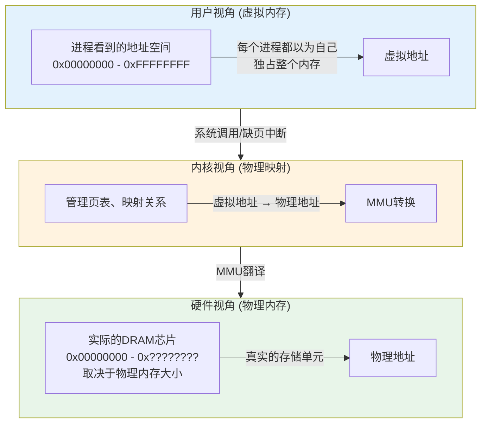

---

## 二、有MMU系统：Linux/Windows 进程地址空间

这是你笔记中提到的"用户视角"，适用于**有MMU的处理器**（Cortex-A、x86、RISC-V Linux等）。

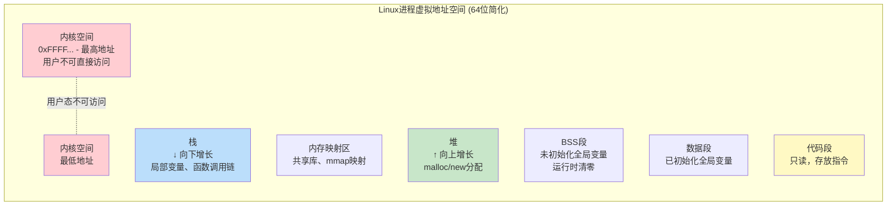

### 关键理解点

| 段 | 来源 | 生命周期 | 特点 |
|---|------|---------|------|
| **Text** | 编译后的代码 | 程序运行期间 | 只读、可共享 |
| **Data** | 已初始化全局/静态变量 | 程序运行期间 | 读写、占磁盘空间 |
| **BSS** | 未初始化全局/静态变量 | 程序运行期间 | 运行时清零、不占磁盘 |
| **Heap** | `malloc`/`new`动态分配 | 手动管理 | 向上增长、碎片问题 |
| **Stack** | 编译器自动管理 | 函数调用链 | 向下增长、自动回收 |
| **MMAP** | `mmap`系统调用 | 手动管理 | 文件映射、共享内存 |

---

## 三、无MMU系统：嵌入式MCU内存布局

这是**Cortex-M、裸机系统**的视角，**没有虚拟内存**，地址就是物理地址。

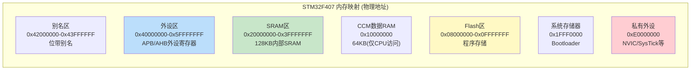

### MCU程序的内存分布（由链接脚本决定）


**关键差异**：
- **没有虚拟内存**：地址就是物理地址
- **Flash和SRAM分离**：代码在Flash运行，数据在SRAM
- **链接脚本控制**：`.ld`文件决定各段位置

---

## 四、核心对比：有MMU vs 无MMU

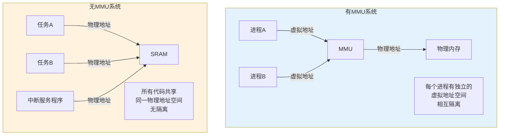

| 特性 | 有MMU系统 | 无MMU系统 |
|------|----------|----------|
| **地址类型** | 虚拟地址 → 物理地址 | 直接物理地址 |
| **进程隔离** | ✅ 每个进程独立地址空间 | ❌ 全局共享 |
| **内存保护** | ✅ 页级权限控制 | ⚠️ MPU可选 |
| **内存扩展** | ✅ 支持swap/页面换出 | ❌ 只有物理内存 |
| **典型系统** | Linux、Android、Windows | RTOS、裸机 |
| **典型芯片** | Cortex-A、x86、RISC-V | Cortex-M0/M3/M4 |

---

## 五、深入理解：程序加载与运行的全过程

### 5.1 有MMU系统：ELF加载过程

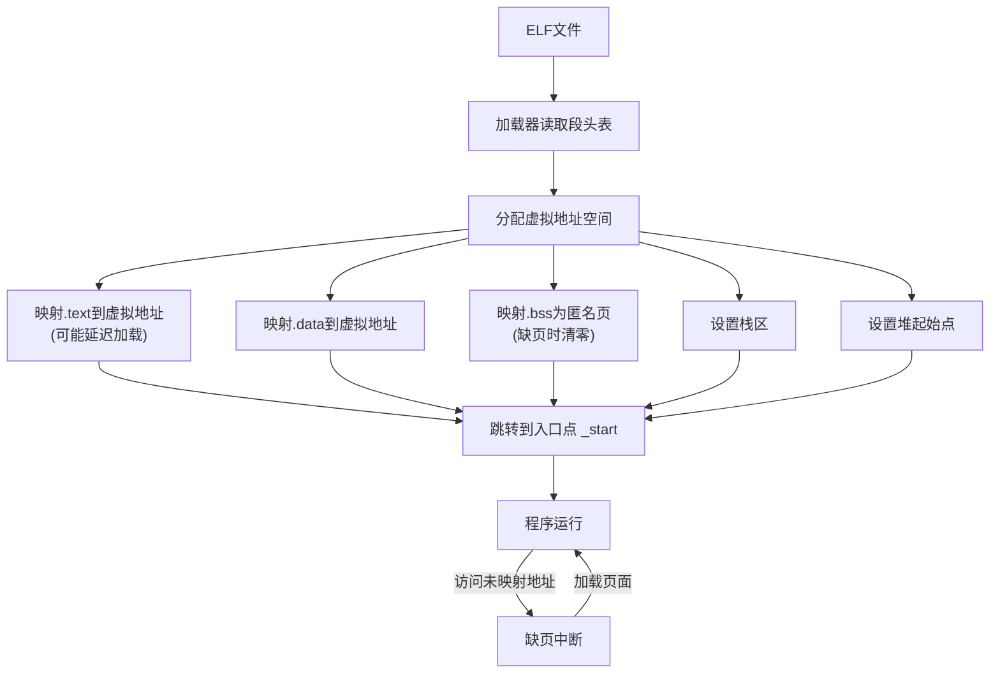

### 5.2 无MMU系统：MCU启动过程

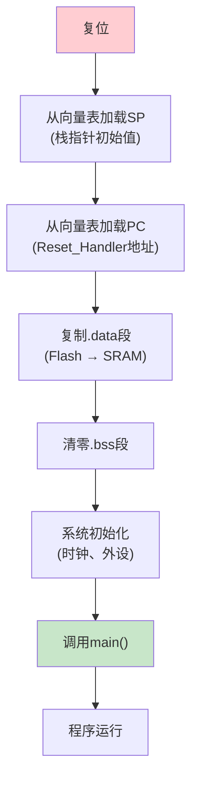

**启动代码示例**（`startup_stm32f407.s`核心逻辑）：

```asm
Reset_Handler:
    LDR     R0, =_sdata         ; .data在SRAM的起始地址
    LDR     R1, =_edata         ; .data在SRAM的结束地址
    LDR     R2, =_sidata        ; .data在Flash的存放地址
    BL      CopyDataInit        ; 复制.data
    
    LDR     R0, =_sbss          ; .bss起始地址
    LDR     R1, =_ebss          ; .bss结束地址
    MOV     R2, #0
    BL      ZeroBSS             ; 清零.bss
    
    BL      SystemInit          ; 系统初始化
    BL      __main              ; 跳转到C的main()
```

---

## 六、链接脚本：内存布局的"设计图纸"

```ld
/* STM32F407 链接脚本示例 */
MEMORY
{
    FLASH (rx)  : ORIGIN = 0x08000000, LENGTH = 512K
    SRAM (rwx)  : ORIGIN = 0x20000000, LENGTH = 128K
    CCM (rw)    : ORIGIN = 0x10000000, LENGTH = 64K
}

SECTIONS
{
    .isr_vector : { . = ALIGN(4); KEEP(*(.isr_vector)) } > FLASH
    .text       : { *(.text*) } > FLASH
    .rodata     : { *(.rodata*) } > FLASH
    
    .data : {
        _sdata = .;           /* SRAM起始 */
        *(.data*)
        _edata = .;           /* SRAM结束 */
    } > SRAM AT > FLASH       /* 运行在SRAM，存储在Flash */
    _sidata = LOADADDR(.data);/* Flash中的位置 */
    
    .bss : {
        _sbss = .;
        *(.bss*)
        _ebss = .;
    } > SRAM
}
```

---

## 七、多架构对比总结

```mermaid
mindmap
  root((内存空间分布))
    有MMU系统
      虚拟地址空间
        用户空间 0-3G
        内核空间 3-4G
      进程隔离
      页式管理
      典型: Linux/Windows
    无MMU系统
      物理地址直接访问
      全局共享
      链接脚本控制
      典型: Cortex-M RTOS
    程序段分布
      .text 代码段
      .rodata 只读数据
      .data 已初始化数据
      .bss 未初始化数据
      .heap 堆
      .stack 栈
    关键差异
      地址类型
      隔离机制
      内存保护
      扩展能力
```

---

## 八、大师的工程建议

### 8.1 嵌入式开发中的常见陷阱

| 问题 | 原因 | 解决方案 |
|------|------|----------|
| **栈溢出** | 局部变量过大或递归太深 | 链接脚本预留足够空间，加栈保护 |
| **堆碎片** | 频繁malloc/free | 使用内存池、静态分配 |
| **Flash空间不足** | .data/.bss初始值占空间 | 优化常量存储、使用压缩 |
| **SRAM不足** | 全局变量太多 | 使用外部SDRAM、优化数据结构 |

### 8.2 调试技巧

```bash
# 查看ELF段大小
arm-none-eabi-size firmware.elf

# 查看详细段分布
arm-none-eabi-objdump -h firmware.elf

# 生成内存映射图
arm-none-eabi-nm -S --size-sort firmware.elf > map.txt
```

### 8.3 推荐深入方向

1. **MMU页表机制**：多级页表、TLB、页面换入换出
2. **链接脚本深入**：VMA vs LMA、符号导出、自定义段
3. **RTOS内存管理**：堆内存池、多堆管理、内存保护单元(MPU)

---

需要我进一步展开哪个部分？比如：
- MMU页表转换的详细过程？
- RTOS中的内存保护机制（MPU配置）？
- 链接脚本的高级用法？
[Timestamp: 2026/04/26 19:32:47]

**user**: 我认为想要深入理解C语言还是要对汇编的一些基础知识有所了解，请你给我讲一些汇编的基础，本质目的是为了嵌入式学习
[Context: Notes: 嵌入式/语言/汇编/汇编常见参数.md]
[Timestamp: 2026/04/26 20:30:18]

**ai**: 工程师你好，这个学习路径非常正确。**汇编是C语言的"X光机"**——很多C语言的"魔法"（函数调用、指针、数组越界）在汇编层面都一览无余。

让我从嵌入式工程师的视角，帮你构建汇编的核心认知框架。

---

## 一、先回答：为什么要学汇编？

```mermaid
flowchart TB
    subgraph C语言层面["C语言层面 (程序员视角)"]
        C1["函数调用"]
        C2["指针操作"]
        C3["局部变量"]
        C4["数组访问"]
        C5["条件判断"]
        C6["循环结构"]
    end
    
    subgraph 汇编层面["汇编层面 (真实执行)"]
        A1["BL/BX指令 + 栈帧管理"]
        A2["LDR/STR + 地址计算"]
        A3["SP相对寻址"]
        A4["基址+偏移寻址"]
        A5["条件码 + BNE/BEQ"]
        A6["比较指令 + 跳转"]
    end
    
    C1 -.->|"编译后"| A1
    C2 -.->|"编译后"| A2
    C3 -.->|"编译后"| A3
    C4 -.->|"编译后"| A4
    C5 -.->|"编译后"| A5
    C6 -.->|"编译后"| A6
    
    style C语言层面 fill:#e3f2fd
    style 汇编层面 fill:#fff3e0
```

**核心价值**：
1. **调试HardFault**：没有汇编知识，栈回溯就是天书
2. **理解性能瓶颈**：为什么这段C代码慢？看汇编才知道
3. **启动代码修改**：`startup_xxx.s`需要能看懂
4. **编译器优化验证**：`volatile`真的生效了吗？看汇编

---

## 二、汇编的基本语法结构

### 2.1 汇编指令的通用格式

```
[标号:] 操作码 操作数1, 操作数2, ... [; 注释]
```

```asm
loop:           ; 标号（地址标记）
    MOV  R0, #10    ; 操作码 MOV，操作数 R0 和 #10
    ADD  R0, R0, #1 ; R0 = R0 + 1
    B    loop       ; 跳转到loop标号
```

### 2.2 ARM Cortex-M 常见操作数类型

| 操作数类型 | 示例 | 含义 |
|-----------|------|------|
| 立即数 | `#10`, `#0xFF` | 直接给出的常数 |
| 寄存器 | `R0`, `R1`, `SP` | 寄存器中的值 |
| 寄存器间接 | `[R0]` | R0指向的内存地址的值 |
| 寄存器偏移 | `[R0, #4]` | R0+4地址处的值 |
| 寄存器变址 | `[R0, R1]` | R0+R1地址处的值 |

---

## 三、核心指令分类（嵌入式必知必会）

```mermaid
mindmap
  root((ARM汇编指令))
    数据传送
      MOV 寄存器间传送
      LDR 从内存加载
      STR 存储到内存
      PUSH/POP 栈操作
    算术运算
      ADD 加法
      SUB 减法
      MUL 乘法
      DIV 除法(Cortex-M3+)
    逻辑运算
      AND 与
      ORR 或
      EOR 异或
      BIC 位清除
    移位操作
      LSL 左移
      LSR 逻辑右移
      ASR 算术右移
      ROR 循环右移
    比较测试
      CMP 比较
      CMN 负数比较
      TST 位测试
      TEQ 相等测试
    跳转控制
      B 无条件跳转
      BL 带返回跳转
      BX 切换状态跳转
      BLX 带返回切换
```

### 3.1 数据传送指令

```asm
MOV  R0, #10         ; R0 = 10 (立即数传送)
MOV  R1, R0          ; R1 = R0 (寄存器传送)

LDR  R0, [R1]        ; R0 = *R1 (从内存加载)
LDR  R0, [R1, #4]    ; R0 = *(R1+4) (带偏移加载)
LDR  R0, =0x12345678 ; 伪指令，加载32位立即数

STR  R0, [R1]        ; *R1 = R0 (存储到内存)
STR  R0, [R1, #4]!   ; R1=R1+4, *R1=R0 (预索引)
STR  R0, [R1], #4    ; *R1=R0, R1=R1+4 (后索引)

PUSH {R4-R7, LR}     ; 压栈，SP自动减
POP  {R4-R7, PC}     ; 出栈，SP自动增
```

### 3.2 算术与逻辑指令

```asm
ADD  R0, R1, R2      ; R0 = R1 + R2
ADD  R0, R0, #1      ; R0 = R0 + 1
SUB  R0, R1, R2      ; R0 = R1 - R2

AND  R0, R1, R2      ; R0 = R1 & R2
ORR  R0, R1, R2      ; R0 = R1 | R2
EOR  R0, R1, R2      ; R0 = R1 ^ R2
BIC  R0, R1, R2      ; R0 = R1 & (~R2) 位清除

LSL  R0, R1, #2      ; R0 = R1 << 2 (左移)
LSR  R0, R1, #2      ; R0 = R1 >> 2 (逻辑右移)
```

### 3.3 比较与跳转指令

```asm
CMP  R0, #10         ; 比较 R0 和 10，设置标志位
BEQ  equal           ; 如果相等(Z=1)，跳转到equal
BNE  not_equal       ; 如果不等(Z=0)，跳转到not_equal
BLT  less_than       ; 如果小于(N!=V)，跳转
BGT  greater         ; 如果大于(Z=0且N=V)，跳转

B    loop            ; 无条件跳转
BL   function        ; 带链接跳转 (LR = 返回地址)
BX   LR              ; 跳转到LR (函数返回)
```

---

## 四、条件码（标志位）：汇编的"灵魂"

```mermaid
flowchart LR
    subgraph ALU["ALU运算"]
        OP["运算操作"]
    end
    
    OP --> N["N 负数标志"]
    OP --> Z["Z 零标志"]
    OP --> C["C 进位标志"]
    OP --> V["V 溢出标志"]
    
    N --> COND["条件执行"]
    Z --> COND
    C --> COND
    V --> COND
    
    style N fill:#ffcdd2
    style Z fill:#c8e6c9
    style C fill:#bbdefb
    style V fill:#fff9c4
```

| 标志 | 名称 | 含义 | 典型用途 |
|------|------|------|----------|
| **N** | Negative | 结果最高位为1 | 判断有符号数正负 |
| **Z** | Zero | 结果为0 | 判断相等/循环结束 |
| **C** | Carry | 无符号溢出/借位 | 大数运算、移位 |
| **V** | Overflow | 有符号溢出 | 有符号数运算判断 |

### 常见条件码后缀

| 后缀 | 条件 | 含义 |
|------|------|------|
| EQ | Z=1 | Equal (相等) |
| NE | Z=0 | Not Equal (不等) |
| LT | N≠V | Less Than (有符号小于) |
| GT | Z=0且N=V | Greater Than (有符号大于) |
| LE | Z=1或N≠V | Less or Equal |
| GE | N=V | Greater or Equal |
| HI | C=1且Z=0 | Higher (无符号大于) |
| LO | C=0 | Lower (无符号小于) |

---

## 五、C语言与汇编的对应关系

### 5.1 函数调用

**C代码**：
```c
int add(int a, int b) {
    return a + b;
}

int main(void) {
    int result = add(1, 2);
    return 0;
}
```

**对应汇编**：
```asm
; main函数
main:
    PUSH {LR}           ; 保存返回地址
    MOV  R0, #1         ; 参数1 → R0
    MOV  R1, #2         ; 参数2 → R1
    BL   add            ; 调用add，LR = 返回地址
    ; R0现在包含返回值
    MOV  R0, #0         ; return 0
    POP  {PC}           ; 返回

; add函数
add:
    ADD  R0, R0, R1     ; R0 = R0 + R1
    BX   LR             ; 返回
```

### 5.2 循环结构

**C代码**：
```c
for (int i = 0; i < 10; i++) {
    sum += i;
}
```

**对应汇编**：
```asm
    MOV  R0, #0         ; sum = 0
    MOV  R1, #0         ; i = 0
loop:
    CMP  R1, #10        ; i < 10 ?
    BGE  end_loop       ; 如果 i >= 10，退出
    ADD  R0, R0, R1     ; sum += i
    ADD  R1, R1, #1     ; i++
    B    loop           ; 继续循环
end_loop:
```

### 5.3 条件判断

**C代码**：
```c
if (x > 0) {
    y = 1;
} else {
    y = -1;
}
```

**对应汇编**：
```asm
    CMP  R0, #0         ; x > 0 ?
    BLE  else_branch    ; 如果 x <= 0，跳转
    MOV  R1, #1         ; y = 1
    B    end_if
else_branch:
    MOV  R1, #-1        ; y = -1
end_if:
```

### 5.4 指针与数组

**C代码**：
```c
int arr[5] = {1, 2, 3, 4, 5};
int *p = arr;
int x = *p;      // x = arr[0]
int y = p[2];    // y = arr[2]
```

**对应汇编**：
```asm
    LDR  R0, =arr       ; R0 = arr的地址
    LDR  R1, [R0]       ; R1 = *R0 = arr[0]
    LDR  R2, [R0, #8]   ; R2 = *(R0+8) = arr[2]
                        ; 偏移8是因为int是4字节
```

---

## 六、函数调用栈帧详解

```mermaid
flowchart TB
    subgraph 调用前["调用前 (caller)"]
        direction TB
        STACK1["栈区"]
    end
    
    subgraph 调用后["调用后 (callee栈帧)"]
        direction TB
        STACK2["栈区"]
        STACK2 --> OLD_R4["保存的R4-R7"]
        OLD_R4 --> OLD_LR["保存的LR"]
        OLD_LR --> LOCAL["局部变量"]
        LOCAL --> TEMP["临时空间"]
        TEMP --> SP["← SP (栈顶)"]
    end
    
    调用前 -->|"PUSH {R4-R7, LR}"| 调用后
    
    style 调用后 fill:#e8f5e9
```

**完整栈帧示例**：
```asm
function:
    PUSH {R4-R7, LR}    ; 保存寄存器和返回地址
    SUB  SP, SP, #16    ; 分配16字节局部变量空间
    
    ; 函数体...
    STR  R0, [SP, #0]   ; 局部变量访问
    LDR  R1, [SP, #4]
    
    ADD  SP, SP, #16    ; 释放局部变量空间
    POP  {R4-R7, PC}    ; 恢复寄存器并返回
```

---

## 七、嵌入式常见汇编场景

### 7.1 启动代码

```asm
; 复位处理程序
Reset_Handler:
    LDR  SP, =_estack       ; 初始化栈指针
    
    ; 复制.data段从Flash到SRAM
    LDR  R0, =_sdata
    LDR  R1, =_edata
    LDR  R2, =_sidata
copy_loop:
    CMP  R0, R1
    BGE  copy_done
    LDR  R3, [R2], #4
    STR  R3, [R0], #4
    B    copy_loop
copy_done:
    
    ; 清零.bss段
    LDR  R0, =_sbss
    LDR  R1, =_ebss
    MOV  R2, #0
zero_loop:
    CMP  R0, R1
    BGE  zero_done
    STR  R2, [R0], #4
    B    zero_loop
zero_done:
    
    BL   SystemInit
    BL   main
    B    .
```

### 7.2 临界区保护

```asm
; 进入临界区
CPSID I              ; 关闭中断

; 退出临界区
CPSIE I              ; 开启中断
```

### 7.3 空操作延时

```asm
NOP                  ; 空操作，消耗1个周期
```

---

## 八、调试技巧：如何查看C代码对应的汇编

### 8.1 使用objdump反汇编

```bash
# 生成汇编列表
arm-none-eabi-objdump -d -S firmware.elf > firmware.asm

# -d: 反汇编
# -S: 交错显示C源码和汇编
```

### 8.2 使用GDB查看

```gdb
(gdb) disassemble main
(gdb) set disassembly-flavor intel  ; Intel语法
(gdb) x/10i $pc                     ; 查看PC处10条指令
```

### 8.3 编译时生成汇编

```bash
# 生成汇编文件
arm-none-eabi-gcc -S -fverbose-asm main.c -o main.s
```

---

## 九、总结：汇编学习路线图

```mermaid
mindmap
  root((汇编学习))
    基础语法
      指令格式
      操作数类型
      标号与注释
    核心指令
      数据传送 MOV/LDR/STR
      算术运算 ADD/SUB
      逻辑运算 AND/ORR
      跳转控制 B/BL/BX
    条件执行
      标志位 N/Z/C/V
      条件码后缀
      CMP与分支
    栈帧管理
      PUSH/POP
      函数调用约定
      局部变量布局
    实战应用
      启动代码分析
      HardFault排查
      性能优化验证
```

---

## 十、大师的工程建议

1. **不要死记硬背**：汇编指令很多，记住常用的20%即可覆盖80%场景
2. **从C到汇编**：写一段简单C代码，用`-S`编译看汇编，理解对应关系
3. **重点掌握**：
   - 函数调用过程（参数传递、栈帧、返回）
   - 指针的本质（地址计算、间接访问）
   - 条件与循环的实现
4. **推荐工具**：
   - [Compiler Explorer](https://godbolt.org/)：在线查看C→汇编
   - Keil/IAR的仿真器：单步执行看寄存器变化

---

需要我进一步展开哪个部分？比如：
- AAPCS函数调用约定详解？
- 中断现场保护的汇编实现？
- 内联汇编的使用方法？
[Timestamp: 2026/04/26 20:31:50]