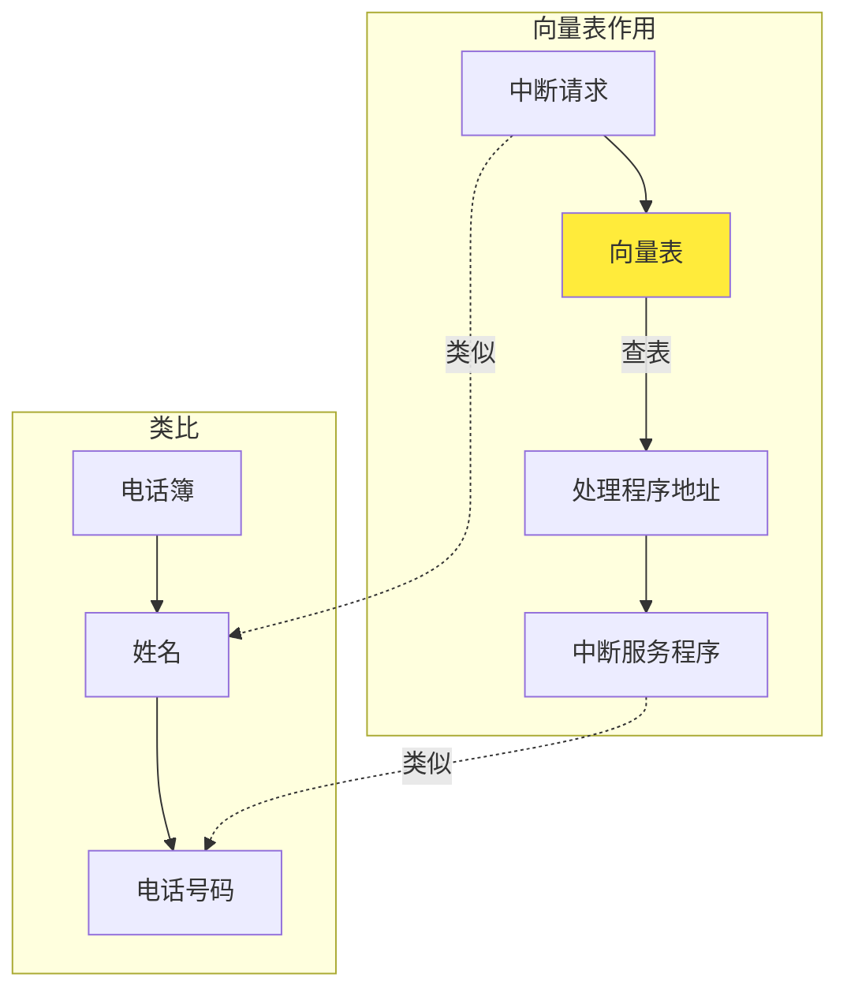
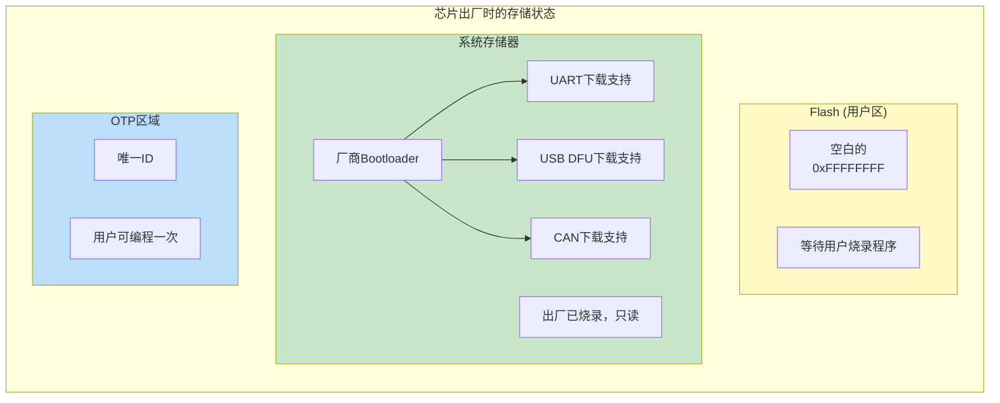
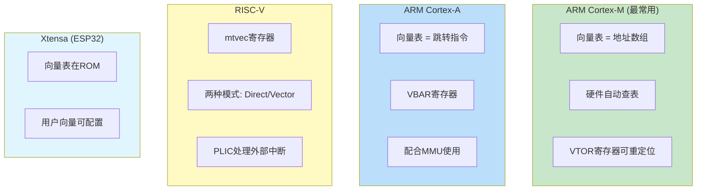
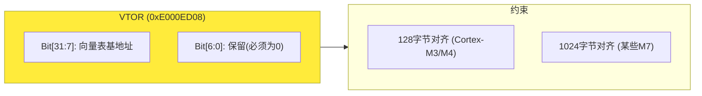
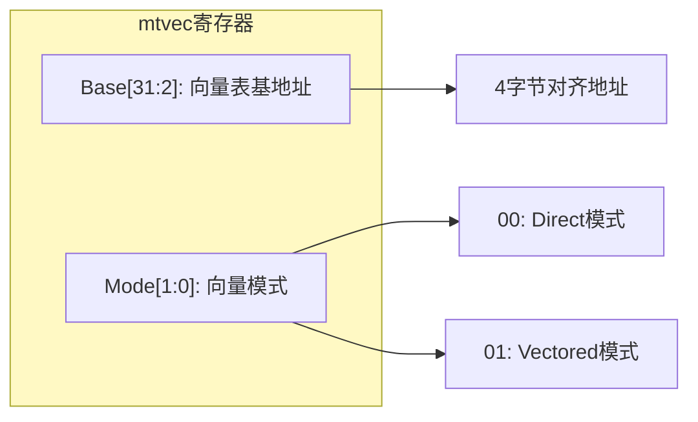
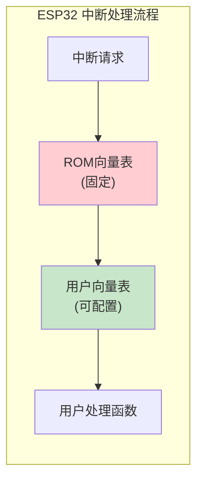
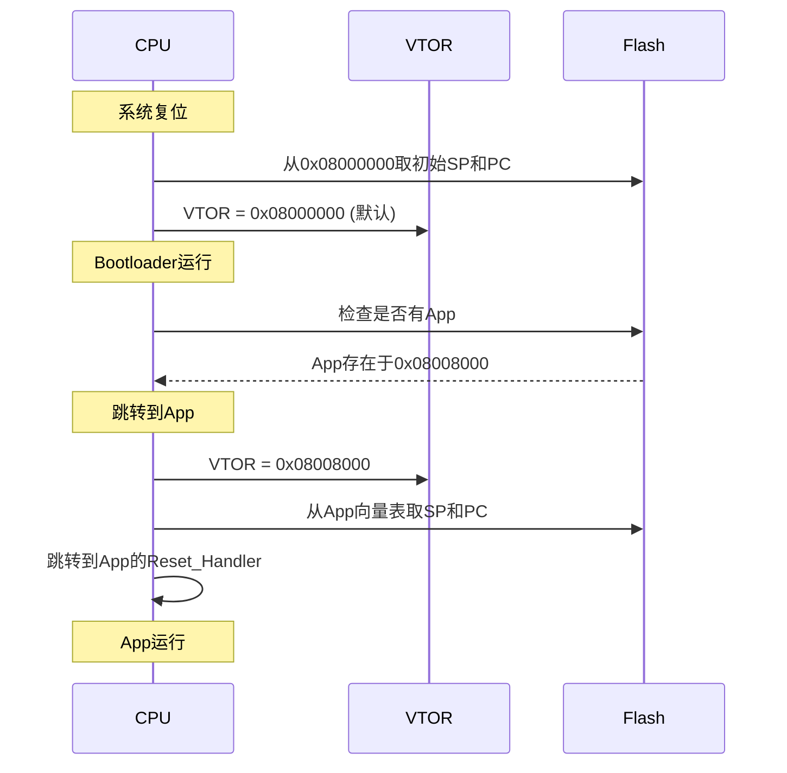
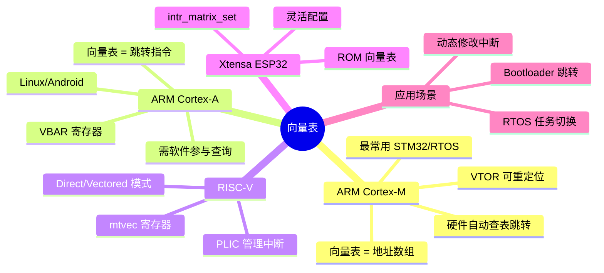

---
tags:
  - 嵌入式
  - 中断
  - 硬件基础
  - ARM-Cortex-M
  - ARM-Cortex-A
  - RISC-V
aliases:
  - Vector Table
  - VTOR
  - VBAR
  - mtvec
  - 向量表重定位
  - 中断向量表
related:
  - "[[中断的基础理解]]"
  - "[[栈与上下文]]"
  - "[[PendSV]]"
  - "[[中断在RTOS中的角色]]"
  - "[[RT-thread中断机制]]"
  - "[[不同架构的中断机制对比]]"
  - "[[../芯片/MCU/ARM Cortx-M4]]"
  - "[[../内存/STM32F407启动源码的理解]]"
chip: STM32
---

# 向量表的基础理解

> [!abstract]
> 向量表是 CPU 响应中断/异常的"电话簿"，存放各处理程序的入口地址。VTOR 寄存器用于重定位向量表位置，是 Bootloader 跳转、动态中断配置的关键机制。不同架构（Cortex-M/A、RISC-V、Xtensa）的实现方式存在差异。

> [!info] 面试开场句
> "向量表是存放在 Flash/SRAM 中的函数指针数组，每个中断源对应一个 ISR 地址。Cortex-M 用 VTOR 寄存器重定位向量表，Bootloader 跳转 App 时必须更新 VTOR。Cortex-M 的向量表存地址值，Cortex-A 的存跳转指令，这是两者关键区别。"

---

## 一、向量表的本质：中断的"电话簿"



**核心定义**：向量表是一个**地址数组**，每个元素对应一个中断/异常的处理程序入口地址。

**关键理解**：
- 向量表是**用户程序的一部分**，不是芯片出厂自带的
- 中断处理函数由**用户编写**或使用 HAL 库默认实现
- 芯片出厂时 Flash 是空白的，向量表随用户程序一起烧录

> [!tip] 在 Cortex-M 中，所有中断的处理都是通过中断向量表来完成的。当中断被触发时，处理器直接确定中断来源，跳转到向量表中对应的处理位置。向量表由数组表示或直接在启动代码中指定，默认使用启动代码中定义的向量表。

---

## 二、芯片出厂时的存储状态



| 区域 | 出厂状态 | 谁写入 | 可否修改 |
|------|---------|--------|----------|
| **Flash 用户区** | 空白 (0xFFFFFFFF) | 用户自己 | 可反复擦写 |
| **系统存储器** | 厂商 Bootloader | 芯片厂商 | 只读 |
| **OTP** | 部分空白 | 用户可写一次 | 不可擦除 |

---

## 三、不同架构的向量表实现对比



| 特性 | ARM Cortex-M | ARM Cortex-A | RISC-V | Xtensa (ESP32) |
|------|-------------|--------------|--------|----------------|
| **向量表内容** | 地址值 | 跳转指令 | 地址值 | 跳转指令 |
| **重定位寄存器** | VTOR | VBAR | mtvec/stvec | 用户配置 |
| **硬件查表** | ✅ 自动 | ✅ 自动 | ✅ 可选 | ✅ 自动 |
| **向量表位置** | Flash/SRAM | 内存 | 内存 | ROM + RAM |
| **异常优先级** | 硬件支持 | 软件配置 | PLIC 管理 | 软件配置 |
| **典型应用** | STM32/裸机/RTOS | Linux/Android | 新兴 MCU | ESP32 |

> [!important] Cortex-M 向量表存**地址值**（CPU 自动跳转），Cortex-A 向量表存**跳转指令**（CPU 执行 B 指令）。详见 [[不同架构的中断机制对比]]。

---

## 四、ARM Cortex-M：向量表与 VTOR 详解

### 4.1 向量表结构

```mermaid
flowchart TB
    subgraph VectorTable["Cortex-M 向量表结构"]
        direction TB
        ADDR_00["0x00: 初始SP值 (不是地址!)"]
        ADDR_04["0x04: Reset_Handler"]
        ADDR_08["0x08: NMI_Handler"]
        ADDR_0C["0x0C: HardFault_Handler"]
        ADDR_10["0x10: MemManage_Handler"]
        ADDR_14["0x14: BusFault_Handler"]
        ADDR_18["0x18: UsageFault_Handler"]
        ADDR_1C["0x1C-0x28: 保留"]
        ADDR_2C["0x2C: SVCall_Handler"]
        ADDR_30["0x30: DebugMon_Handler"]
        ADDR_34["0x34: 保留"]
        ADDR_38["0x38: PendSV_Handler"]
        ADDR_3C["0x3C: SysTick_Handler"]
        ADDR_40["0x40: IRQ0 (外部中断起始)"]
        MORE["... 更多外部中断 ..."]
    end
    
    style ADDR_00 fill:#ffcdd2
    style ADDR_04 fill:#c8e6c9
    style ADDR_0C fill:#fff9c4
```



**关键点**：
- **第一个元素是 SP 初始值**，不是地址
- **从第二个元素开始才是处理程序地址**
- **系统异常在前（16 个），外部中断在后**
- **每个元素 4 字节（32 位地址）**

系统异常速查：

| 偏移 | 异常 | 说明 |
|------|------|------|
| 0x00 | 初始 SP | MSP 初始值，不是地址 |
| 0x04 | Reset | 上电复位入口 |
| 0x08 | NMI | 不可屏蔽中断 |
| 0x0C | HardFault | 硬件错误 |
| 0x10 | MemManage | 内存管理错误 |
| 0x14 | BusFault | 总线错误 |
| 0x18 | UsageFault | 用法错误 |
| 0x2C | SVCall | 系统服务调用（软件触发，立即执行） |
| 0x38 | PendSV | 可悬挂系统调用（延迟执行，RTOS 任务切换） |
| 0x3C | SysTick | 系统滴答定时器 |
| 0x40+ | IRQ0~IRQn | 外部中断 |

> [!tip] PendSV 和 SysTick 是 RTOS 最常用的两个系统异常。PendSV 用于任务切换，SysTick 用于时间基准。详见 [[PendSV]] 和 [[RT-thread中断机制]]。

### 4.2 VTOR 寄存器



```c
#define SCB_VTOR   (*(volatile uint32_t *)0xE000ED08)

void set_vector_table(uint32_t base_addr) {
    SCB_VTOR = base_addr;  // 低7位自动忽略
    __DSB();
    __ISB();
}
```

### 4.3 向量表重定位的典型场景

| 场景 | 做法 | VTOR 值 |
|------|------|---------|
| **Bootloader + App** | App 有自己的向量表，跳转前更新 VTOR | App 起始地址（如 0x08008000） |
| **SRAM 中运行** | 复制向量表到 SRAM，VTOR 指向 SRAM | SRAM 地址（如 0x20000000） |
| **动态修改中断** | 向量表放在 SRAM 中，运行时修改某个向量 | SRAM 中的向量表地址 |

### 4.4 完整代码示例

```c
#include <string.h>

#define VECTOR_TABLE_SIZE  512

__attribute__((aligned(128)))
static uint32_t vector_table_ram[VECTOR_TABLE_SIZE / 4];

void relocate_vector_table_to_sram(uint32_t app_offset) {
    uint32_t *src_vectors = (uint32_t *)(0x08000000 + app_offset);
    
    memcpy(vector_table_ram, src_vectors, VECTOR_TABLE_SIZE);
    SCB->VTOR = (uint32_t)vector_table_ram;
    
    __DSB();
    __ISB();
}

void set_irq_handler(uint8_t irq_num, void (*handler)(void)) {
    uint32_t vector_index = irq_num + 16;  // 前16个是系统异常
    vector_table_ram[vector_index] = (uint32_t)handler;
    __DSB();
}
```

---

## 五、ARM Cortex-A：VBAR 与异常向量

### 5.1 与 Cortex-M 的关键差异

| | Cortex-M | Cortex-A |
|--|----------|----------|
| 向量表内容 | **地址值**（CPU 自动跳转） | **跳转指令**（B 指令） |
| 向量表长度 | 系统异常 + 所有外部中断 | **只有 8 个固定入口** |
| 外部中断处理 | 每个中断独立向量 | 统一走 IRQ 入口，**软件查询中断控制器** |
| 重定位寄存器 | VTOR | VBAR |
| 现场保存 | 硬件自动压栈 8 个 | **软件保存**，需要手写汇编 |

### 5.2 Cortex-A 向量表结构

```asm
__vectors:
    B   reset_handler           ; 0x00: Reset
    B   undefined_handler       ; 0x04: Undefined instruction
    B   svc_handler             ; 0x08: Software interrupt (SVC)
    B   prefetch_abort_handler  ; 0x0C: Prefetch abort
    B   data_abort_handler      ; 0x10: Data abort
    B   .                       ; 0x14: Reserved
    B   irq_handler             ; 0x18: IRQ ← 所有外部中断走这里
    B   fiq_handler             ; 0x1C: FIQ ← 快速中断
```

关键：外部中断全部通过 **IRQ 入口**统一处理，ISR 中需要软件查询 **GIC（通用中断控制器）** 确定具体中断源。

### 5.3 VBAR 寄存器

```c
void set_vbar(uint32_t base_addr) {
    __asm__ volatile ("MCR p15, 0, %0, c12, c0, 0" : : "r"(base_addr));
}

uint32_t get_vbar(void) {
    uint32_t base_addr;
    __asm__ volatile ("MRC p15, 0, %0, c12, c0, 0" : "=r"(base_addr));
    return base_addr;
}
```

> [!tip] Cortex-A 每个异常级别（EL1/EL2/EL3）有自己的 VBAR，安全性更高。详见 [[不同架构的中断机制对比]]。

---

## 六、RISC-V：mtvec 与中断处理

### 6.1 mtvec 寄存器结构



### 6.2 两种中断模式

| 模式 | 异常处理 | 中断处理 | 适用场景 |
|------|---------|---------|---------|
| **Direct** (MODE=0) | 全部跳到 BASE | 全部跳到 BASE | 简单系统 |
| **Vectored** (MODE=1) | 跳到 BASE | 跳到 BASE + 4 × cause | 类似 Cortex-M |

### 6.3 代码示例

```c
#define MTVEC_MODE_DIRECT   0x00
#define MTVEC_MODE_VECTORED 0x01

void set_mtvec(uint32_t base, uint32_t mode) {
    uint32_t mtvec = base | mode;
    __asm__ volatile ("csrw mtvec, %0" : : "r"(mtvec));
}

void (*riscv_vector_table[])(void) = {
    exception_handler,
    irq_handler_1,
    irq_handler_2,
};

void init_interrupts(void) {
    set_mtvec((uint32_t)riscv_vector_table, MTVEC_MODE_VECTORED);
}
```

---

## 七、Xtensa (ESP32)：ROM 向量表与用户向量



```c
#include "esp_intr_alloc.h"
#include "driver/gpio.h"

static void IRAM_ATTR gpio_isr_handler(void* arg) {
    uint32_t gpio_num = (uint32_t)arg;
}

void setup_gpio_interrupt(void) {
    gpio_config_t io_conf = {
        .intr_type = GPIO_INTR_NEGEDGE,
        .pin_bit_mask = (1ULL << GPIO_NUM_0),
        .mode = GPIO_MODE_INPUT,
        .pull_up_en = 1,
    };
    gpio_config(&io_conf);
    gpio_install_isr_service(0);
    gpio_isr_handler_add(GPIO_NUM_0, gpio_isr_handler, (void*)GPIO_NUM_0);
}
```

---

## 八、Bootloader 与 App 的向量表切换



### 完整跳转代码

```c
void jump_to_app(uint32_t app_addr) {
    uint32_t app_stack = *(uint32_t *)app_addr;
    if (app_stack == 0xFFFFFFFF) return;
    
    __disable_irq();
    
    SysTick->CTRL = 0;
    SysTick->LOAD = 0;
    SysTick->VAL = 0;
    
    for (int i = 0; i < 8; i++) {
        NVIC->ICER[i] = 0xFFFFFFFF;
        NVIC->ICPR[i] = 0xFFFFFFFF;
    }
    
    SCB->VTOR = app_addr;
    __set_MSP(app_stack);
    
    uint32_t app_entry = *(uint32_t *)(app_addr + 4);
    void (*app_reset_handler)(void) = (void (*)(void))app_entry;
    
    __DSB();
    __ISB();
    
    app_reset_handler();
    while(1);
}
```

> [!warning] 跳转前必须做的事：关中断 → 关 SysTick → 清所有中断挂起位 → 设置 VTOR → 设置 MSP → 跳转。漏掉任何一步都可能导致 App 运行异常。

---

## 九、常见陷阱与调试

| 问题 | 原因 | 解决方案 |
|------|------|----------|
| **跳转后 HardFault** | VTOR 未更新 | 跳转前设置 VTOR |
| **中断不响应** | 向量表未对齐 | 确保 128 字节对齐 |
| **App 无法运行** | MSP 未设置 | 跳转前设置 MSP |
| **中断跑错函数** | 向量表索引错误 | 检查 IRQ 号与向量索引对应关系 |

```c
void debug_vector_table(void) {
    uint32_t vtor = SCB->VTOR;
    printf("VTOR = 0x%08X\n", vtor);
    printf("Initial SP = 0x%08X\n", *(uint32_t *)vtor);
    printf("Reset Handler = 0x%08X\n", *(uint32_t *)(vtor + 4));
    printf("HardFault Handler = 0x%08X\n", *(uint32_t *)(vtor + 0x0C));
    printf("PendSV Handler = 0x%08X\n", *(uint32_t *)(vtor + 0x38));
    printf("SysTick Handler = 0x%08X\n", *(uint32_t *)(vtor + 0x3C));
}
```

---

## 十、总结对比



---

## 十一、面试高频问题

> [!example]- Q1：向量表的本质是什么？
> 函数指针数组，每个中断源对应一个 ISR 入口地址。存放在 Flash/SRAM 中，随用户程序一起烧录，不是芯片出厂自带的。CPU 硬件自动查表跳转，不需要软件判断中断来源。

> [!example]- Q2：VTOR 的作用？
> VTOR（Vector Table Offset Register）用于重定位向量表基地址。Bootloader 跳转 App 时必须更新 VTOR 指向 App 的向量表，否则中断还是会跳到 Bootloader 的处理函数。VTOR 低 7 位必须为 0（128 字节对齐）。

> [!example]- Q3：Cortex-M 和 Cortex-A 的向量表有什么区别？
> Cortex-M 向量表存地址值（CPU 自动跳转），包含所有系统异常和外部中断。Cortex-A 向量表存跳转指令（B 指令），只有 8 个固定入口，外部中断统一走 IRQ 入口，软件查询 GIC 确定中断源。

> [!example]- Q4：Bootloader 跳转 App 为什么要设置 VTOR？
> App 有自己的中断向量表（在 App 的 Flash 起始地址），如果不更新 VTOR，CPU 还是会查 Bootloader 的向量表，中断处理函数地址全是 Bootloader 的，App 无法正确响应中断。

---

## 十二、相关笔记

- [[中断的基础理解]]
- [[栈与上下文]]
- [[PendSV]]
- [[中断在RTOS中的角色]]
- [[RT-thread中断机制]]
- [[不同架构的中断机制对比]]
- [[中断在Linux中的角色]]
- [[../内存/STM32F407启动源码的理解]]
