---
aliases:
  - ESP32存储体系
  - ESP32 Flash管理
  - ESP32 NVS SPIFFS
tags:
  - 嵌入式
  - ESP32
  - 存储
  - NVS
  - SPIFFS
  - 分区表
  - ESP-IDF
date: 2026-05-23
status: evergreen
related:
  - "[[Xtensa LX6 双核架构]]"
  - "[[ESP32-D0WDQ6]]"
  - "[[存储器总体认知]]"
  - "[[内存_概览]]"
  - "[[../芯片/架构与指令集/Xtensa LX6 双核架构]]"
---

> [!abstract] 核心摘要
> ESP32 的存储不是"一块 Flash 随便用"，而是通过**分区表**切分、**NVS** 管键值、**SPIFFS/LittleFS** 做文件系统的分层体系。Flash 在芯片外部通过 SPI + Cache 访问，分区表定义 Flash 布局，NVS 和 SPIFFS 各自管理分给自己的那块区域，互不干扰。理解这个分层关系是从 STM32 转向 ESP32 开发的关键认知跃迁。

---

## 1. 全局视角：Flash 到应用层的分层

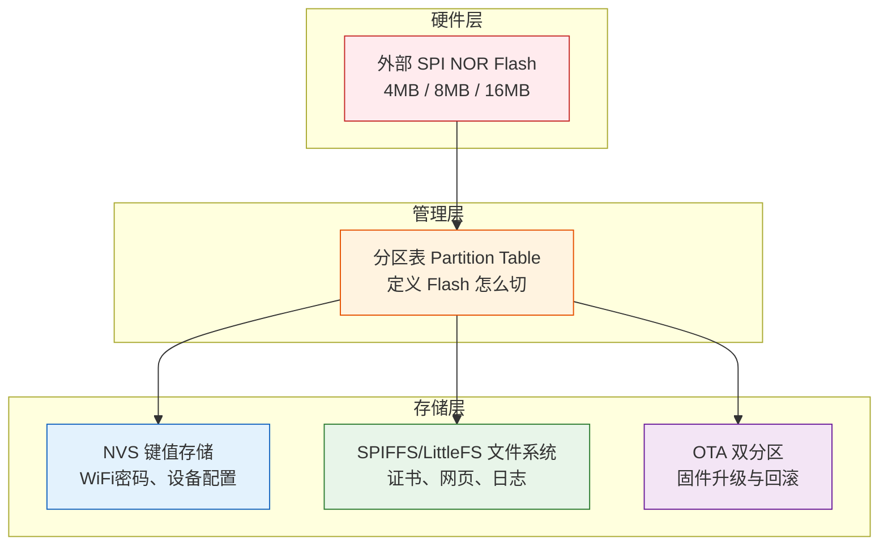

**一句话总结**：Flash 是地，分区表是图纸，NVS 和 SPIFFS 是盖在图纸划好的地块上的两种不同建筑。

---

## 2. Flash 硬件基础

### 2.1 ESP32 的 Flash 在芯片外面

> [!important] 与 STM32 的根本区别
> STM32 的 Flash 封装在芯片内部，CPU 通过内部总线直接访问。**ESP32 芯片内部没有用户可写的 Flash**，它的 Flash 是芯片外面单独一颗 SPI NOR Flash，通过 SPI 总线连接。

```
STM32F407:                    ESP32:
┌──────────────┐             ┌──────────┐    SPI    ┌──────────┐
│ CPU + SRAM   │             │ CPU+SRAM │◄────────►│ SPI Flash│
│ + Flash      │             │ + ROM    │  总线     │  (4MB)   │
│ 全在芯片内    │             │ (芯片内)  │          │ (芯片外)  │
└──────────────┘             └──────────┘          └──────────┘
CPU直接地址映射               通过 Cache + SPI 间接访问
延迟确定、极快                延迟不确定，Cache miss 时慢
```

| 维度 | STM32 | ESP32 |
|------|-------|-------|
| Flash 位置 | 芯片内部 | **芯片外部**，SPI 总线连接 |
| 典型容量 | 64KB ~ 2MB | 4MB / 8MB / 16MB |
| 访问方式 | 直接地址映射，零延迟 | 通过 Cache 间接访问，有延迟 |
| XIP 支持 | 天然支持 | 有 Cache 支持 XIP，但 Cache miss 时要等 SPI |

### 2.2 XIP（eXecute In Place）机制

ESP32 的固件代码并不全部加载到 RAM 中运行，而是通过 Cache 直接从 Flash 取指执行：

```
CPU 取指令
  → 查 L1 I-Cache（片内 SRAM）
    → 命中：直接返回，几乎零延迟
    → 未命中：走 SPI 去外部 Flash 读取（慢，几微秒）
      → 读到后顺便存进 Cache，下次就快了
```

### 2.3 IRAM_ATTR：解决中断延迟抖动

> [!warning] 工程陷阱：Cache miss 导致中断抖动
> 如果中断服务函数放在 Flash 中，Cache miss 会导致中断延迟变成几微秒，且不确定。对需要精确时序的场景是致命的。

```c
// IRAM_ATTR 把函数强制放到片内 IRAM（SRAM）
// CPU 直接执行，不走 SPI，不依赖 Cache
void IRAM_ATTR my_isr(void) {
    // 中断代码放在片内 SRAM，延迟确定
}
```

**代价**：消耗宝贵的片内 SRAM（ESP32 只有 520KB）。

---

## 3. 分区表（Partition Table）

> [!info] 核心概念
> 4MB Flash 不能随便用，必须**先分区**。分区表就是告诉 ESP32：这块 Flash 的每一块区域干什么用。
> 类比：分区表就像给硬盘分区——C 盘装系统、D 盘放数据、E 盘做备份。

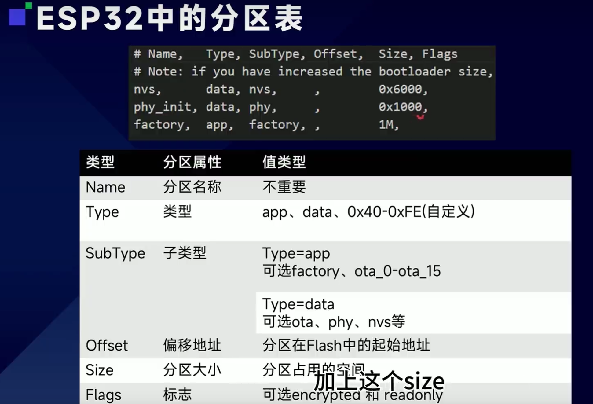

### 3.1 默认分区表（4MB Flash）

```
0x00000000 ┌─────────────────────────┐
           │  Bootloader (16KB)       │  ← 一级引导，ROM 中的代码加载
0x00001000 ├─────────────────────────┤
           │  Partition Table (4KB)   │  ← 分区表本身
0x00008000 ├─────────────────────────┤
           │  NVS (24KB)             │  ← WiFi 凭据、键值配置
0x0000E000 ├─────────────────────────┤
           │  PHY Init (4KB)         │  ← 射频校准数据
0x0000F000 ├─────────────────────────┤
           │                         │
           │  Factory App (1MB)      │  ← 应用固件
           │                         │
0x00100000 ├─────────────────────────┤
           │                         │
           │  SPIFFS (~960KB)        │  ← 文件系统
           │                         │
0x001FF000 └─────────────────────────┘  ← 4MB 结束
```

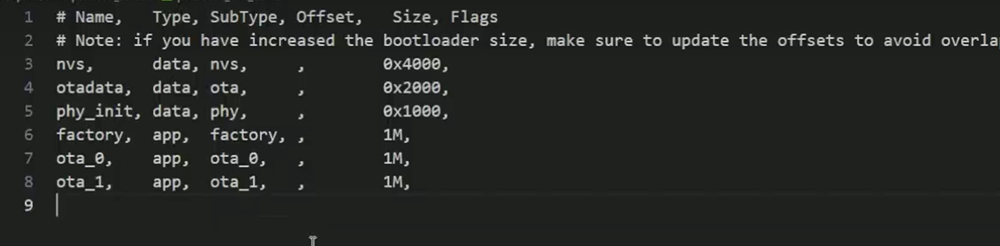

### 3.2 分区类型速查

| 类型 | SubType | 用途 |
|------|---------|------|
| `app` | `factory` / `ota_0` / `ota_1` | 应用程序固件 |
| `data` | `nvs` | NVS 键值存储 |
| `data` | `spiffs` / `fat` | 文件系统 |
| `data` | `phy` | 射频校准数据 |
| `data` | `ota` | OTA 状态数据 |
| `data` | `storage` | 自定义原始数据 |

### 3.3 CSV 格式详解

```csv
# Name,      Type, SubType,  Offset,   Size
nvs,         data, nvs,      ,         0x4000       # 16KB
otadata,     data, ota,      ,         0x2000       # 8KB
phy_init,    data, phy,      ,         0x1000       # 4KB
ota_0,       app,  ota_0,    ,         1.5MB        # 固件A
ota_1,       app,  ota_1,    ,         1.5MB        # 固件B
storage,     data, spiffs,   ,         0xF0000      # ~960KB
```

| 字段 | 说明 | 常见值 |
|------|------|--------|
| **Name** | 分区名字，代码中按名字查找 | 任意字符串 |
| **Type** | 大类 | `app` / `data` |
| **SubType** | 细分类型 | `factory`/`ota_0`/`ota_1`/`nvs`/`spiffs`/`fat`/`ota`/`phy`/`storage` |
| **Offset** | 起始偏移，留空自动排列 | 通常留空 |
| **Size** | 分区大小 | `0x4000` / `1.5MB` |

> [!tip] Offset 留空时自动紧挨着前一个分区排列。Bootloader 固定在 `0x0000`，分区表固定在 `0x8000`。

### 3.4 自定义分区——直接读写裸数据

```csv
my_data,     data, storage,  ,         0x10000    # 64KB 自定义分区
```

```c
#include "esp_partition.h"

const esp_partition_t *part = esp_partition_find_first(
    ESP_PARTITION_TYPE_DATA, 
    ESP_PARTITION_SUBTYPE_DATA_ANY, 
    "my_data"
);
esp_partition_erase_range(part, 0, 4096);              // 先擦
esp_partition_write(part, 0, data, strlen(data));       // 后写
esp_partition_read(part, 0, buf, strlen(data));          // 读取
```

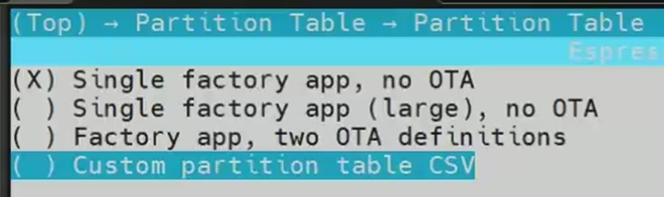

---

## 4. NVS（Non-Volatile Storage）

> [!info] 核心概念
> NVS 是**键值对存储**，专门存小量配置数据。类比：如果 Flash 是硬盘，NVS 就是 Windows 注册表——专门存系统配置项。

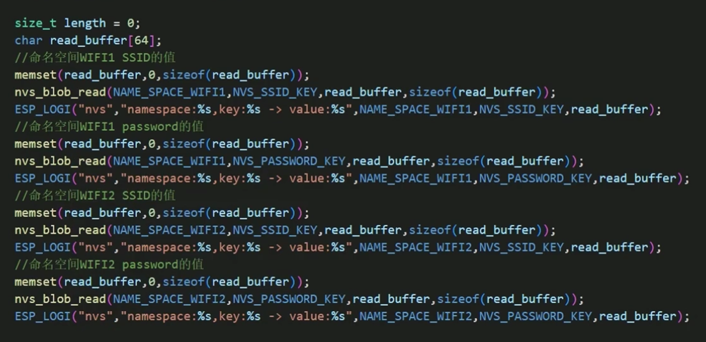

### 4.1 存储原理

```
NVS 内部结构（Flash 上的 16~24KB 区域）：

┌──────────┬──────────┬──────────┬──────────┐
│ Page 0   │ Page 1   │ Page 2   │ ...      │
│ (4KB)    │ (4KB)    │ (4KB)    │          │
└──────────┴──────────┴──────────┴──────────┘

每个 Page 内部：
┌─────────────────────────────┐
│ Header (状态信息)             │
├─────────────────────────────┤
│ Entry 0: key="ssid"         │ value="MyWiFi" │ CRC ✓
│ Entry 1: key="pwd"          │ value="123456" │ CRC ✓
│ Entry 2: key="ssid" [废弃]  │ value="OldWiFi"│
│ Entry 3: key="channel"      │ value=6        │ CRC ✓
└─────────────────────────────┘
```

### 4.2 追加写入与磨损均衡

> [!important] NVS 不是原地覆盖，而是追加写入

NVS 采用"追加写入 + Page 级回收"策略实现磨损均衡：

```
写入 "ssid=MyWiFi"  → 追加到 Page 0
修改 "ssid=NewWiFi" → 不是原地覆盖！而是追加新条目
                      旧的 "ssid=MyWiFi" 标记为 [废弃]

Page 0 满了 → 把还活着的数据搬到 Page 1
              整个 Page 0 擦除，变成新的空闲页
```

**核心优势**：每次写入落在不同的物理地址，自然把 10 万次擦写寿命分散开。

### 4.3 掉电保护

> [!tip] NVS 天然掉电安全
> 每条 Entry 都有 CRC 校验。掉电导致数据写了一半 → CRC 不通过 → NVS 忽略这条 → 自动回退到上一次正确的值。

```
掉电前：
  Page 0: ssid=OldWiFi [有效，CRC✓]
          ssid=NewWiFi [写入中... ← 掉电！CRC✗]

上电后：
  NVS 发现 NewWiFi 的 CRC 不通过 → 丢弃
  自动使用 OldWiFi 的值
```

### 4.4 Namespace 机制

```c
// NVS 用 namespace 分组，避免键名冲突
nvs_handle_t handle;
nvs_open("wifi_config", NVS_READWRITE, &handle);
nvs_set_str(handle, "ssid", "MyWiFi");
nvs_set_i32(handle, "channel", 6);
nvs_commit(handle);
nvs_close(handle);
```

```
namespace: "wifi_config"
  ├── ssid → "MyWiFi"
  ├── password → "12345678"
  └── channel → 6

namespace: "device_config"  
  ├── name → "智能灯-001"
  ├── interval → 30
  └── version → 2
```

### 4.5 支持的数据类型

| 函数 | 类型 | 典型用途 |
|------|------|---------|
| `nvs_set_i8/i16/i32/u8/u16/u32` | 整数 | 计数器、版本号、阈值 |
| `nvs_set_str` | 字符串 | WiFi SSID/密码、MQTT 地址 |
| `nvs_set_blob` | 二进制块 | 结构体、证书、序列化数据 |

### 4.6 Blob 类型——存结构体

```c
typedef struct {
    float temp_threshold;
    float hum_threshold;
    int interval_sec;
    bool enabled;
} device_config_t;

void save_config(device_config_t *cfg) {
    nvs_handle_t handle;
    nvs_open("device", NVS_READWRITE, &handle);
    nvs_set_blob(handle, "config", cfg, sizeof(device_config_t));
    nvs_commit(handle);
    nvs_close(handle);
}

void load_config(device_config_t *cfg) {
    nvs_handle_t handle;
    nvs_open("device", NVS_READONLY, &handle);
    size_t required_size = sizeof(device_config_t);
    nvs_get_blob(handle, "config", cfg, &required_size);
    nvs_close(handle);
}
```

> [!warning] Blob 适合小结构体（几百字节以内）。几 KB 的 JSON 配置文件放 SPIFFS。

### 4.7 NVS 加密

> [!danger] NVS 默认明文存储
> 拆 Flash 芯片读出来，WiFi 密码、设备密钥全部暴露。量产产品**强烈建议**开启 NVS 加密。

```c
#include "nvs_sec_provider.h"

nvs_sec_cfg_t cfg = {};
nvs_sec_provider_register_ecdsa_peripheral_key(&cfg);
esp_err_t err = nvs_flash_secure_init(&cfg);
```

### 4.8 完整 API 示例

```c
#include "nvs_flash.h"
#include "nvs.h"

void nvs_example(void) {
    // 1. 初始化（整个系统只需一次）
    esp_err_t err = nvs_flash_init();
    if (err == ESP_ERR_NVS_NO_FREE_PAGES || 
        err == ESP_ERR_NVS_NEW_VERSION_FOUND) {
        nvs_flash_erase();       // 损坏则擦除重建
        nvs_flash_init();
    }

    // 2. 打开 namespace
    nvs_handle_t handle;
    nvs_open("config", NVS_READWRITE, &handle);

    // 3. 写入
    nvs_set_str(handle, "ssid", "MyHomeWiFi");
    nvs_set_i32(handle, "retry_count", 3);
    nvs_commit(handle);  // ★ 必须调用！

    // 4. 读取
    char ssid[32] = {0};
    size_t ssid_len = sizeof(ssid);
    nvs_get_str(handle, "ssid", ssid, &ssid_len);
    int32_t retry = 0;
    nvs_get_i32(handle, "retry_count", &retry);

    // 5. 关闭
    nvs_close(handle);
}
```

---

## 5. SPIFFS / LittleFS 文件系统

> [!info] 核心概念
> NVS 只能存键值对，但物联网设备经常需要存**文件**——网页、证书、日志。这些有层次结构、大小不一、需要按文件名访问，这就是文件系统解决的问题。

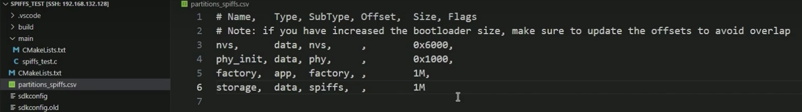

### 5.1 SPIFFS 的存储模型

```
SPIFFS 分区切成固定大小的 Page（通常 256B）：

┌──────┬──────┬──────┬──────┬───────┬──────┐
│Page 0│Page 1│Page 2│Page 3│ ...   │Page N│
│256B  │256B  │256B  │256B  │       │256B  │
└──────┴──────┴──────┴──────┴───────┴──────┘

每个 Page：
┌──────────────────────────┐
│ Page Header (8B)         │  ← 状态标志
│ Object Header            │  ← 文件名、大小、索引
│ 数据区 (剩余字节)         │  ← 实际文件内容
└──────────────────────────┘

一个文件由多个 Page 组成
```

> [!warning] SPIFFS 没有真正的目录
> SPIFFS 用 `/` 只是文件名的一部分，不是真正的目录分隔。所有文件都在"根目录"。
> `certs/ca.pem` 实际上是一个叫 `"certs/ca.pem"` 的文件，不在 `certs` 文件夹里。
> **文件多了之后查找变慢**，因为每次都要遍历所有 Page。

### 5.2 SPIFFS vs LittleFS 选型

| 特性 | SPIFFS | LittleFS |
|------|--------|----------|
| 目录支持 | 假目录（文件名带 `/`） | **真目录**，B-tree 索引 |
| 查找性能 | 文件多了变慢 | **恒定时间** |
| 掉电保护 | 一般，可能丢最后写入 | **强保证**：要么成功要么完全没写 |
| 磨损均衡 | 简单 | **更优**，动态磨损均衡 |
| 内存占用 | 较小 | 稍大 |
| ESP-IDF 支持 | 原生支持 | 需 `esp_littlefs` 组件（v4.4+） |
| **推荐度** | 旧项目兼容 | **新项目推荐** |

### 5.3 VFS 机制——为什么 `fopen` 能操作 SPIFFS

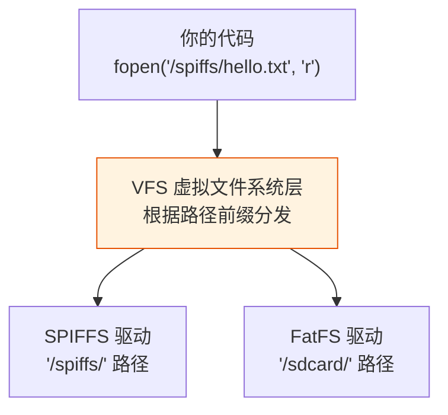

> [!tip] 不管底层是 SPIFFS、LittleFS 还是 SD 卡的 FatFS，代码都用同一套 `fopen/fread/fwrite`。换文件系统不用改业务代码。

### 5.4 API 用法

```c
#include "esp_spiffs.h"

void spiffs_example(void) {
    // 1. 挂载 SPIFFS
    esp_vfs_spiffs_conf_t conf = {
        .base_path = "/spiffs",
        .partition_label = "storage",
        .max_files = 5,
        .format_if_mount_failed = false  // 生产环境不要自动格式化！
    };
    esp_vfs_spiffs_register(&conf);

    // 2. 标准 POSIX 文件 API 读写
    FILE *f = fopen("/spiffs/config.json", "r");
    if (f) {
        char buf[256];
        fgets(buf, sizeof(buf), f);
        fclose(f);
    }

    // 写入
    f = fopen("/spiffs/log.txt", "w");
    if (f) {
        fprintf(f, "temperature=%.1f\n", 25.3);
        fclose(f);
    }

    // 3. 获取空间信息
    size_t total = 0, used = 0;
    esp_spiffs_info("storage", &total, &used);
    printf("SPIFFS: %d / %d bytes used\n", used, total);

    // 4. 卸载
    esp_vfs_spiffs_unregister("storage");
}
```

### 5.5 编译时打包 SPIFFS 镜像

```
工程目录：
  project/
  ├── main/
  │   └── app_main.c
  └── spiffs_data/          ← 把网页文件放这里
      ├── index.html
      ├── style.css
      └── app.js

编译时：ESP-IDF 自动把 spiffs_data/ 打包成 SPIFFS 镜像（.bin）
烧录时：和烧固件同一波操作，一次性写入 SPIFFS 分区
```

> [!tip] 不需要在代码里逐个创建文件。编译时生成镜像，烧录时一把写入。

---

## 6. 四者关系总图

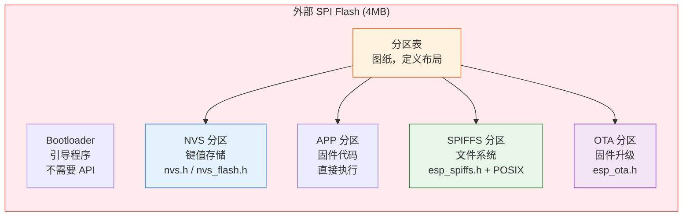

| 层级 | 组件 | 解决什么问题 | 适合存什么 | API |
|------|------|-------------|-----------|-----|
| 硬件层 | SPI Flash | 物理存储介质 | — | — |
| 划分层 | 分区表 | 把 Flash 切成不同用途的区域 | — | `esp_partition.h` |
| 存储层 | NVS | 小量键值配置，掉电保持 | WiFi密码、设备名、阈值 | `nvs.h` / `nvs_flash.h` |
| 文件层 | SPIFFS/LittleFS | 文件级存储，有目录/文件名 | 网页、证书、日志 | `esp_spiffs.h` + POSIX |
| 升级层 | OTA 双分区 | 固件空中升级与回滚 | 固件二进制 | `esp_ota.h` |

---

## 7. 物联网数据存放决策

### 7.1 决策树

```
数据需要持久化存储吗？
├── 不需要 → 放 RAM（全局变量/malloc）
└── 需要 → 数据多大？
    ├── 几字节~几KB的配置项 → NVS
    ├── 几KB~几百KB的文件 → SPIFFS/LittleFS
    └── 几百KB~几MB的固件 → OTA 分区（ota_0/ota_1）
```

### 7.2 具体场景对应表

| 数据类型 | 大小 | 存放位置 | 理由 |
|---------|------|---------|------|
| WiFi SSID/密码 | <100B | **NVS** | 小量配置，键值对最合适 |
| MQTT Broker 地址 | <100B | **NVS** | 同上 |
| 设备序列号/UUID | <50B | **NVS** | 出厂写入，只读 |
| 传感器采样阈值 | <100B | **NVS** | 可通过 Web 界面修改 |
| SSL/TLS 证书 | 1~5KB | **SPIFFS** | 文件格式，有文件名和路径 |
| Web 配置页面 (HTML) | 10~100KB | **SPIFFS** | 多个文件，有层次结构 |
| OTA 升级固件 | 几百KB~1MB | **OTA 分区** | 专用 app 分区，双区备份 |
| 传感器历史数据 | 不定 | **SPIFFS** | 离线缓存用文件，最终上云 |
| JSON 配置文件 | 几KB | **SPIFFS** | 复杂配置用 JSON 文件更灵活 |
| 设备运行日志 | 滚动 | **SPIFFS** | 注意空间，循环覆盖 |

---

## 8. ESP-IDF 代码初始化顺序

### 8.1 为什么顺序不能乱

```
app_main() 开始时：
  ✅ Bootloader 已经解析完分区表
  ❌ NVS 还没初始化（WiFi 库依赖它）
  ❌ SPIFFS 还没挂载
  ❌ 网络栈还没启动
```

> [!important] 核心依赖链：NVS → 网络 → SPIFFS → 业务

### 8.2 标准初始化流程

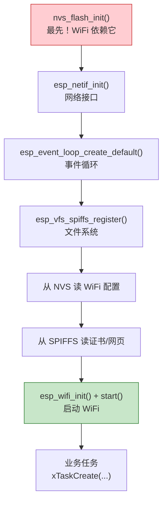

### 8.3 完整 app_main() 示例

```c
#include "nvs_flash.h"
#include "esp_spiffs.h"
#include "esp_wifi.h"
#include "esp_netif.h"
#include "esp_event.h"
#include "esp_log.h"

static const char *TAG = "MAIN";

void app_main(void) {
    // ===== Step 1: NVS（必须最先） =====
    esp_err_t ret = nvs_flash_init();
    if (ret == ESP_ERR_NVS_NO_FREE_PAGES ||
        ret == ESP_ERR_NVS_NEW_VERSION_FOUND) {
        ESP_LOGW(TAG, "NVS corrupt, erasing...");
        nvs_flash_erase();
        nvs_flash_init();
    }

    // ===== Step 2: 网络协议栈 =====
    esp_netif_init();
    esp_event_loop_create_default();

    // ===== Step 3: SPIFFS =====
    esp_vfs_spiffs_conf_t conf = {
        .base_path = "/spiffs",
        .partition_label = "storage",
        .max_files = 5,
        .format_if_mount_failed = false
    };
    esp_vfs_spiffs_register(&conf);

    // ===== Step 4: 从 NVS 读 WiFi 配置 =====
    nvs_handle_t nvs;
    nvs_open("wifi", NVS_READONLY, &nvs);
    char ssid[32] = {0};
    size_t len = sizeof(ssid);
    nvs_get_str(nvs, "ssid", ssid, &len);
    nvs_close(nvs);

    // ===== Step 5: 从 SPIFFS 读证书 =====
    // FILE *cert = fopen("/spiffs/certs/ca.pem", "r");

    // ===== Step 6: 启动 WiFi =====
    wifi_init_config_t cfg = WIFI_INIT_CONFIG_DEFAULT();
    esp_wifi_init(&cfg);
    esp_wifi_start();

    // ===== Step 7: 业务任务 =====
    // xTaskCreate(sensor_task, "sensor", 4096, NULL, 5, NULL);
}
```

---

## 9. OTA 分区机制

### 9.1 双分区（A/B）工作原理

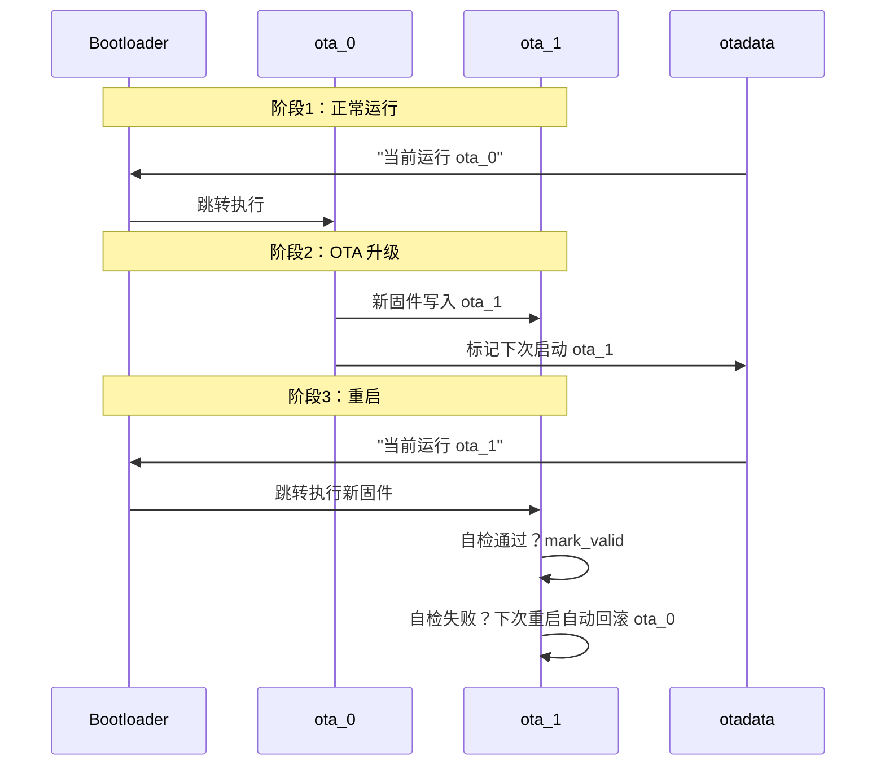

### 9.2 OTA API

```c
#include "esp_ota_ops.h"

void ota_update(void) {
    const esp_partition_t *update_partition = esp_ota_get_next_update_partition(NULL);
    
    esp_ota_handle_t update_handle;
    esp_ota_begin(update_partition, OTA_SIZE_UNKNOWN, &update_handle);
    
    while (有数据) {
        esp_ota_write(update_handle, data_buf, data_len);
    }
    
    esp_ota_end(update_handle);
    esp_ota_set_boot_partition(update_partition);
    esp_restart();
}

// 新固件启动后自检
void app_main(void) {
    bool healthy = self_test();
    if (healthy) {
        esp_ota_mark_app_valid_cancel_rollback();
    }
}
```

> [!tip] OTA 防砖机制：新固件启动后必须调用 `esp_ota_mark_app_valid_cancel_rollback()` 声明运行正常，否则下次重启自动回滚到旧固件。

---

## 10. 常见错误设计

> [!danger] 8 个典型工程错误

### 错误 1：把大文件存到 NVS

```
❌ 把 5KB 的 JSON 配置文件塞进 nvs_set_blob()
✅ 大文件放 SPIFFS，NVS 只存小配置项
```

### 错误 2：频繁写入 NVS 不调用 commit

```c
nvs_set_str(handle, "key", "value");
// ❌ 没有 nvs_commit()，掉电后数据丢失
nvs_commit(handle);  // ✅ 必须提交
```

### 错误 3：生产环境 format_if_mount_failed = true

```c
// ❌ SPIFFS 损坏时自动格式化 → 用户数据全丢
.format_if_mount_failed = true

// ✅ 生产环境设为 false，挂载失败上报错误
.format_if_mount_failed = false
```

### 错误 4：不处理 NVS 初始化失败

```c
// ❌ 不检查返回值
nvs_flash_init();

// ✅ 检查并处理
esp_err_t err = nvs_flash_init();
if (err == ESP_ERR_NVS_NO_FREE_PAGES ||
    err == ESP_ERR_NVS_NEW_VERSION_FOUND) {
    nvs_flash_erase();
    nvs_flash_init();
}
```

### 错误 5：在 ISR 中操作 NVS/SPIFFS

```
❌ 在定时器回调或中断中调用 nvs_set_str()
   Flash 操作阻塞几 ms，ISR 中禁止
✅ ISR 只设标志位，业务任务中操作 NVS/SPIFFS
```

### 错误 6：OTA 没有回滚保护

```c
// ❌ 升级后不自检
esp_ota_set_boot_partition(update_partition);
esp_restart();

// ✅ 新固件启动后自检，失败自动回滚
bool healthy = self_test();
if (healthy) {
    esp_ota_mark_app_valid_cancel_rollback();
}
```

### 错误 7：SPIFFS 空间用满不处理

```
❌ 持续写日志文件，从不清理 → SPIFFS 满后写入失败
✅ 实现日志循环覆盖或定期清理策略
```

### 错误 8：分区表设计不合理

```
❌ APP 固件 1.1MB，但 factory 分区只有 1MB → 烧录失败
✅ 预留足够空间，4MB Flash 做 OTA 时空间会很紧张
   考虑 8MB 或 16MB Flash 模组
```

### 附加错误：多任务共享 NVS handle 不安全

```c
// ❌ 多任务共享同一个 nvs_handle_t
// NVS handle 不是线程安全的！

// ✅ 每个任务各自 open/close
// NVS 内部有分区级锁，不同 handle 安全
nvs_handle_t h;
nvs_open("config", NVS_READWRITE, &h);
// ... 操作 ...
nvs_close(h);
```

---

## 11. 与 STM32 存储思维差异对比

### 11.1 架构差异的根源

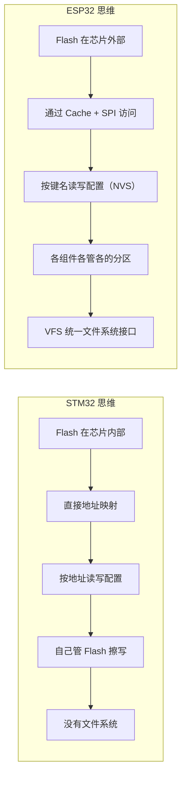

### 11.2 逐项对比

| 维度 | STM32 | ESP32 |
|------|-------|-------|
| **Flash 位置** | 芯片内部 | 芯片外部（SPI Flash） |
| **Flash 访问** | 直接地址映射，确定性延迟 | 通过 Cache + SPI，延迟不确定 |
| **配置存储** | EEPROM 或 Flash 模拟，按地址读写 | NVS，按键名读写，自动磨损均衡 |
| **文件系统** | 通常没有，或外挂 Flash + FatFs | SPIFFS/LittleFS 内建，VFS 统一接口 |
| **固件升级** | 自写 Bootloader + IAP | 分区表 + `esp_ota.h`，双分区自动回滚 |
| **分区概念** | 无，Flash 是一整块 | **必须**有分区表 |
| **磨损均衡** | 自己实现或不管 | NVS/SPIFFS/LittleFS 内建 |
| **掉电保护** | 自己处理（写一半掉电 = 数据损坏） | NVS 追加写入 + CRC = 天然掉电安全 |
| **加密** | 读写保护（选项字节） | NVS 加密 + Flash 加密 + 安全启动 |
| **多任务安全** | 裸机为主，不太需要考虑 | FreeRTOS 多任务，必须考虑并发 |

### 11.3 STM32 开发者转 ESP32 最容易犯的错

| 错误 | STM32 思维 | ESP32 正确做法 |
|------|-----------|---------------|
| 直接往 Flash 地址写数据 | `*(uint32_t*)0x08040000 = 0x1234;` | 通过分区表 + `esp_partition_write()` |
| 手动管理 Flash 擦写 | 自己算扇区地址、自己擦除 | 用 NVS 或 SPIFFS，它们帮你管 |
| 中断里直接写 Flash | 觉得 Flash 很快（内部总线） | 绝对不行！SPI Flash 操作阻塞几 ms |
| 不考虑 Cache 一致性 | 内部 Flash 不存在这个问题 | PSRAM 区域需要手动维护 Cache |
| 认为固件升级很简单 | 写个 Bootloader 就行 | 需要双分区 + 回滚机制才能安全 |

---

## 12. 典型 IoT 设备数据存放方案

**场景**：智能家居温湿度传感器，WiFi + MQTT + Web 配置 + OTA + TLS + 离线缓存

### 12.1 分区表（8MB Flash 版本）

```csv
# partitions.csv
# Name,      Type, SubType,  Offset,   Size
nvs,         data, nvs,      ,         0x4000       # 16KB  配置
otadata,     data, ota,      ,         0x2000       # 8KB   OTA 状态
phy_init,    data, phy,      ,         0x1000       # 4KB   射频校准
ota_0,       app,  ota_0,    ,         2MB          # 固件 A
ota_1,       app,  ota_1,    ,         2MB          # 固件 B
storage,     data, spiffs,   ,         0x36B000     # ~3.4MB 文件系统
```

```
8MB Flash 布局：

0x0000_0000 ┌────────────────┐
            │ Bootloader     │  16KB
0x0000_8000 ├────────────────┤
            │ Partition Table│  4KB
0x0000_9000 ├────────────────┤
            │ NVS (16KB)     │  WiFi 凭据、设备配置
0x0000_D000 ├────────────────┤
            │ OTA Data (8KB) │  当前启动分区标记
0x0000_F000 ├────────────────┤
            │ PHY Init (4KB) │
0x0001_0000 ├────────────────┤
            │                │
            │ OTA_0 (2MB)    │  固件 A
            │                │
0x0021_0000 ├────────────────┤
            │                │
            │ OTA_1 (2MB)    │  固件 B
            │                │
0x0041_0000 ├────────────────┤
            │                │
            │ SPIFFS (3.4MB) │  文件系统
            │                │
0x0077_B000 └────────────────┘
```

### 12.2 数据存放方案

| 数据 | 存放位置 | 读写频率 | 大小 |
|------|---------|---------|------|
| WiFi SSID/密码 | NVS `wifi` | 配网时写，启动时读 | ~100B |
| MQTT Broker 地址 | NVS `mqtt` | 配置时写，启动时读 | ~50B |
| 上报间隔（秒） | NVS `device` | 用户修改时写，启动时读 | 4B |
| 设备 UUID | NVS `device` | 出厂写一次，每次上报读 | ~36B |
| 采样阈值 | NVS `device` | 用户修改时写，运行时读 | ~12B |
| CA 证书 | SPIFFS `/spiffs/certs/ca.pem` | 出厂烧录，TLS 连接时读 | ~2KB |
| 设备证书 | SPIFFS `/spiffs/certs/device.pem` | 同上 | ~2KB |
| 私钥 | SPIFFS `/spiffs/certs/private.key` | 同上 | ~1KB |
| Web 页面 | SPIFFS `/spiffs/www/*` | 出厂烧录，用户访问时读 | ~50KB |
| 离线缓存 | SPIFFS `/spiffs/data/cache.csv` | 离线时写，上线后读并删除 | 滚动，最大 500KB |
| OTA 固件 | `ota_0` / `ota_1` 分区 | 升级时写，启动时读 | ~1.5MB |

### 12.3 完整工程代码

```c
#include <stdio.h>
#include <string.h>
#include "freertos/FreeRTOS.h"
#include "freertos/task.h"
#include "esp_log.h"
#include "nvs_flash.h"
#include "nvs.h"
#include "esp_spiffs.h"
#include "esp_wifi.h"
#include "esp_netif.h"
#include "esp_event.h"
#include "esp_ota_ops.h"

static const char *TAG = "SENSOR";

static void init_nvs(void) {
    esp_err_t err = nvs_flash_init();
    if (err == ESP_ERR_NVS_NO_FREE_PAGES ||
        err == ESP_ERR_NVS_NEW_VERSION_FOUND) {
        ESP_LOGW(TAG, "NVS corrupt, erasing...");
        nvs_flash_erase();
        nvs_flash_init();
    }
    ESP_LOGI(TAG, "NVS initialized");
}

static void init_spiffs(void) {
    esp_vfs_spiffs_conf_t conf = {
        .base_path = "/spiffs",
        .partition_label = "storage",
        .max_files = 10,
        .format_if_mount_failed = false
    };
    esp_err_t err = esp_vfs_spiffs_register(&conf);
    if (err != ESP_OK) {
        ESP_LOGE(TAG, "SPIFFS mount failed: %s", esp_err_to_name(err));
        return;
    }
    size_t total = 0, used = 0;
    esp_spiffs_info("storage", &total, &used);
    ESP_LOGI(TAG, "SPIFFS: %d/%d bytes used (%.1f%%)",
             used, total, (float)used / total * 100);
}

typedef struct {
    char ssid[32];
    char password[64];
    char mqtt_broker[128];
    int32_t report_interval;
} device_config_t;

static bool load_config(device_config_t *cfg) {
    nvs_handle_t handle;
    if (nvs_open("device", NVS_READONLY, &handle) != ESP_OK) return false;
    size_t len = sizeof(cfg->ssid);
    if (nvs_get_str(handle, "ssid", cfg->ssid, &len) != ESP_OK) {
        nvs_close(handle);
        return false;
    }
    len = sizeof(cfg->password);
    nvs_get_str(handle, "password", cfg->password, &len);
    len = sizeof(cfg->mqtt_broker);
    nvs_get_str(handle, "mqtt_broker", cfg->mqtt_broker, &len);
    nvs_get_i32(handle, "report_interval", &cfg->report_interval);
    nvs_close(handle);
    return true;
}

static bool save_config(device_config_t *cfg) {
    nvs_handle_t handle;
    if (nvs_open("device", NVS_READWRITE, &handle) != ESP_OK) return false;
    nvs_set_str(handle, "ssid", cfg->ssid);
    nvs_set_str(handle, "password", cfg->password);
    nvs_set_str(handle, "mqtt_broker", cfg->mqtt_broker);
    nvs_set_i32(handle, "report_interval", cfg->report_interval);
    nvs_commit(handle);
    nvs_close(handle);
    return true;
}

static void cache_sensor_data(float temp, float humidity) {
    FILE *f = fopen("/spiffs/data/cache.csv", "a");
    if (f) {
        int64_t ts = esp_timer_get_time() / 1000;
        fprintf(f, "%lld,%.1f,%.1f\n", ts, temp, humidity);
        fclose(f);
    }
}

static void upload_cached_data(void) {
    FILE *f = fopen("/spiffs/data/cache.csv", "r");
    if (!f) return;
    char line[128];
    while (fgets(line, sizeof(line), f)) {
        ESP_LOGI(TAG, "Uploading: %s", line);
    }
    fclose(f);
    remove("/spiffs/data/cache.csv");
}

static void check_ota_health(void) {
    const esp_partition_t *running = esp_ota_get_running_partition();
    esp_ota_img_states_t ota_state;
    if (esp_ota_get_state_partition(running, &ota_state) == ESP_OK) {
        if (ota_state == ESP_OTA_IMG_PENDING_VERIFY) {
            bool healthy = true;
            if (healthy) {
                esp_ota_mark_app_valid_cancel_rollback();
                ESP_LOGI(TAG, "OTA verified on %s", running->label);
            } else {
                ESP_LOGE(TAG, "OTA unhealthy, will rollback");
            }
        }
    }
}

static void sensor_task(void *arg) {
    device_config_t *cfg = (device_config_t *)arg;
    while (1) {
        float temp = 25.0f + (esp_random() % 100) / 10.0f;
        float hum = 50.0f + (esp_random() % 100) / 10.0f;
        ESP_LOGI(TAG, "Temp: %.1f, Hum: %.1f", temp, hum);
        cache_sensor_data(temp, hum);
        vTaskDelay(pdMS_TO_TICKS(cfg->report_interval * 1000));
    }
}

void app_main(void) {
    ESP_LOGI(TAG, "=== IoT Sensor Device Starting ===");

    init_nvs();
    check_ota_health();
    esp_netif_init();
    esp_event_loop_create_default();
    init_spiffs();

    static device_config_t cfg = {0};
    if (!load_config(&cfg)) {
        ESP_LOGW(TAG, "No config, starting provisioning...");
        strcpy(cfg.ssid, "default");
        cfg.report_interval = 30;
    }

    wifi_init_config_t wifi_cfg = WIFI_INIT_CONFIG_DEFAULT();
    esp_wifi_init(&wifi_cfg);

    xTaskCreate(sensor_task, "sensor", 4096, &cfg, 5, NULL);
    ESP_LOGI(TAG, "=== System Ready ===");
}
```

### 12.4 工程目录结构

```
project/
├── CMakeLists.txt
├── partitions.csv                    ← 自定义分区表
├── main/
│   ├── CMakeLists.txt
│   ├── app_main.c                    ← 主入口
│   ├── nvs_config.c/h               ← NVS 配置管理模块
│   ├── spiffs_cache.c/h             ← SPIFFS 离线缓存模块
│   └── ota_update.c/h               ← OTA 升级模块
└── spiffs_data/                      ← 编译时打包为 SPIFFS 镜像
    ├── certs/
    │   ├── ca.pem
    │   ├── device.pem
    │   └── private.key
    ├── www/
    │   ├── index.html
    │   ├── style.css
    │   └── app.js
    └── data/
        └── .gitkeep
```

---

## 13. 知识体系总图

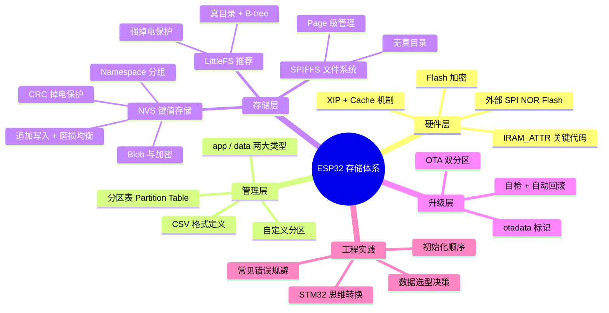

---

## 14. 关键概念速查

| 概念 | 说明 |
|------|------|
| **SPI Flash** | ESP32 外部存储介质，通过 SPI + Cache 访问 |
| **分区表** | CSV 文件，定义 Flash 上每个区域的用途和大小 |
| **NVS** | 键值对存储，追加写入，自动磨损均衡和掉电保护 |
| **SPIFFS** | 轻量文件系统，无真目录，文件多了变慢 |
| **LittleFS** | SPIFFS 替代，真目录，恒定查找，强掉电保护 |
| **VFS** | 虚拟文件系统层，统一 `fopen/fread/fwrite` 接口 |
| **OTA** | 双分区固件升级，自动回滚防砖 |
| **IRAM_ATTR** | 把代码放到片内 IRAM，避免 Cache miss 抖动 |
| **磨损均衡** | 把写入分散到不同地址，延长 Flash 寿命 |
| **XIP** | 通过 Cache 直接从 Flash 取指执行 |

---

## 15. 面试高频问题

> [!example]- Q1：ESP32 的 Flash 和 STM32 有什么区别？
> STM32 的 Flash 在芯片内部，直接地址映射；ESP32 的 Flash 在芯片外部，通过 SPI + Cache 访问。这导致 ESP32 的 Flash 访问延迟不确定，需要用 IRAM_ATTR 把关键代码放到片内 SRAM。

> [!example]- Q2：NVS 和 SPIFFS 的区别？各自适合存什么？
> NVS 是键值对存储，适合存小量配置（WiFi 密码、设备名、阈值）；SPIFFS 是文件系统，适合存有文件名、有目录结构的文件（证书、网页、日志）。选择标准：配置项 → NVS，文件 → SPIFFS。

> [!example]- Q3：NVS 是怎么实现磨损均衡和掉电保护的？
> 追加写入：不原地覆盖，而是追加新 Entry，旧的标记废弃，自然分散擦写位置。掉电保护：每条 Entry 有 CRC 校验，写一半掉电 → CRC 不通过 → 自动回退到上一次正确值。

> [!example]- Q4：ESP-IDF 的初始化顺序是什么？为什么？
> `nvs_flash_init()` → `esp_netif_init()` → `esp_vfs_spiffs_register()` → `esp_wifi_init()`。NVS 必须最先，因为 WiFi 库内部依赖 NVS 存储信道等信息。

> [!example]- Q5：OTA 双分区是怎么工作的？
> Flash 上有两个 APP 分区（ota_0 和 ota_1），一个运行一个接收新固件。升级时写入空闲分区，重启后 Bootloader 读 otadata 决定启动哪个。新固件自检失败自动回滚到旧固件，防砖。

> [!example]- Q6：从 STM32 转 ESP32，存储方面最大的思维转变是什么？
> STM32 是按地址手动管理 Flash，ESP32 是按名字通过组件管理。分区表替代了手动地址规划，NVS 替代了 EEPROM，SPIFFS 替代了裸 Flash 存文件，OTA API 替代了自写 Bootloader。核心转变：从"我管 Flash"到"各组件各管各的分区"。

---

## 踩坑记录

> [!bug] 实战经验填充区
> （项目开发中遇到的存储相关问题记录于此）

---

## 继续阅读

- [[存储器总体认知]] — 存储金字塔、SRAM/DRAM/Flash 物理原理
- [[内存_概览]] — 内存知识体系总览
- [[Xtensa LX6 双核架构]] — ESP32 内核架构、Cache 一致性、双核中断路由
- [[ESP32-D0WDQ6]] — ESP32-CAM 开发板详解、PSRAM、GPIO 映射
- [[内存空间分配]] — 程序在内存中的布局：栈、堆、代码段、数据段
