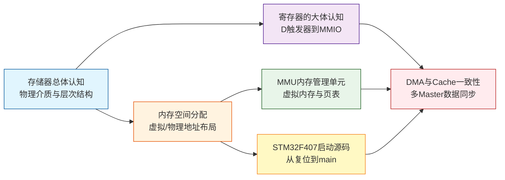

---
aliases:
  - 内存体系
  - 内存知识体系
tags:
  - 嵌入式
  - 硬件与芯片
  - 内存
date: 2026-04-26
status: evergreen
related:
  - "[[../外设/DMA(直接存储器访问)]]"
  - "[[../外设/FSMC（内存扩展）的实现]]"
  - "[[AHB总线矩阵]]"
---

> [!abstract] 核心概览
> 从晶体管级的 D 触发器到操作系统级的虚拟内存，覆盖嵌入式系统中内存相关的完整知识链路。本目录是内存主题的入口，串联存储介质原理、地址空间布局、启动流程、MMU 虚拟化、Cache 一致性五大核心模块。

## 学习路径

推荐阅读顺序：A → B → C → D/E → F

## 笔记索引

| 笔记 | 核心问题 | 关键词 |
|------|----------|--------|
| [[存储器总体认知]] | 内存为什么分层？SRAM/DRAM/Flash 本质区别？ | 存储金字塔、SRAM vs DRAM、NOR vs NAND Flash |
| [[寄存器的大体认知]] | "寄存器"到底指什么？CPU寄存器和外设寄存器有什么区别？ | D触发器、GPR、MMIO、位带操作、volatile |
| [[内存空间分配]] | 程序在内存中如何布局？有MMU和无MMU有什么区别？ | 虚拟地址、进程地址空间、Flash/SRAM分离、链接脚本 |
| [[STM32F407启动源码的理解]] | 上电后到 main() 之间发生了什么？ | Reset_Handler、.data搬运、.bss清零、LMA/VMA |
| [[MMU(内存管理单元)]] | 虚拟地址如何变成物理地址？进程如何隔离？ | 页表、TLB、缺页异常、ARMv8寄存器、MPU vs MMU |
| [[DMA 与 Cache 一致性]] | DMA和CPU看到的数据不一致怎么办？ | Write-Back、Cache Line、clean/invalidate、所有权模型 |

## 关键概念速查

### SRAM vs DRAM vs Flash

| 特性 | SRAM | DRAM | NOR Flash | NAND Flash |
|------|------|------|-----------|------------|
| 存储原理 | 6管锁存器 | 1管+1电容 | 浮栅晶体管 | 浮栅晶体管 |
| 是否需要刷新 | 不需要 | 需要（~64ms周期） | 不需要 | 不需要 |
| 读取方式 | 随机访问 | 随机访问 | 随机访问（XIP） | 页读取 |
| 写入方式 | 直接写 | 读-改-写 | 擦除后写入 | 擦除后写入 |
| 速度 | 最快（~1ns） | 快（~50-100ns） | 较快（~50ns读） | 慢（~25us页读） |
| 密度 | 低 | 中 | 中 | 高 |
| 易失性 | 易失 | 易失 | 非易失 | 非易失 |
| 典型应用 | CPU Cache | DDR内存条 | MCU内置Flash | SSD/eMMC |
| 每bit成本 | 最高 | 中 | 低 | 最低 |

### MMU vs MPU

| 特性 | MMU | MPU |
|------|-----|-----|
| 地址翻译 | 虚拟地址 → 物理地址 | 不翻译 |
| 粒度 | 页（4KB） | 区域（最小32B） |
| 区域数量 | 理论无限（页表项） | 通常 8~16 个 |
| 进程隔离 | 支持 | 不支持 |
| 缺页异常 | 支持 | 不支持 |
| 典型芯片 | Cortex-A / x86 | Cortex-M0+/M3/M4/M7 |
| 典型系统 | Linux / Android | FreeRTOS / 裸机 |

### VMA vs LMA

| 概念 | 含义 | 举例 |
|------|------|------|
| **VMA** (Virtual Memory Address) | 运行时地址，CPU 访问的地址 | `.data` 在 RAM 中：`0x20000000` |
| **LMA** (Load Memory Address) | 存储地址，烧录到 Flash 的位置 | `.data` 在 Flash 中：`0x08004000` |
| **关键点** | `.data` 段 VMA ≠ LMA，启动代码负责搬运 | 启动时 `memcpy(Flash → RAM)` |

### Cache 策略

| 策略 | 写命中时行为 | 优缺点 |
|------|-------------|--------|
| **Write-Through** | 同时写 Cache 和下一级 | 数据一致性好，但写延迟高 |
| **Write-Back** | 只写 Cache，替换时才写回 | 写延迟低，但有一致性风险（DMA 场景） |

### 嵌入式特有存储介质

| 介质 | 特点 | 典型芯片 |
|------|------|----------|
| **CCM RAM** | 仅 CPU 可访问，零等待，DMA 不可见 | STM32F4 (64KB) |
| **DTCM** | 数据紧耦合内存，与 CPU 同频 | Cortex-M7 |
| **ITCM** | 指令紧耦合，零等待取指 | Cortex-M7 |
| **OCRAM** | 通用片内 SRAM | i.MX RT 系列 |
| **外部 SDRAM** | 通过 FSMC/FMC 扩展，容量大但延迟高 | STM32F429 |

## 继续阅读

- [[../外设/DMA(直接存储器访问)]] — DMA 控制器的工作原理与总线仲裁
- [[../外设/FSMC（内存扩展）的实现]] — 通过 FSMC/FMC 扩展外部 SDRAM
- [[AHB总线矩阵]] — CPU 和 DMA 如何通过总线矩阵共享存储资源

## 学习视频
[BranchEducation: 为什么计算机不只使用一种类型的内存](https://www.youtube.com/watch?v=TfhL5kBiQVI&t=40s)
