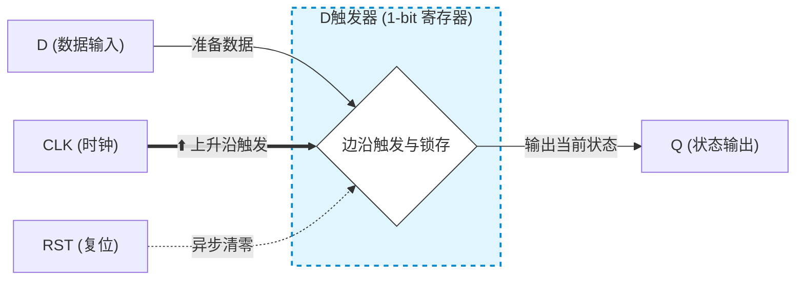
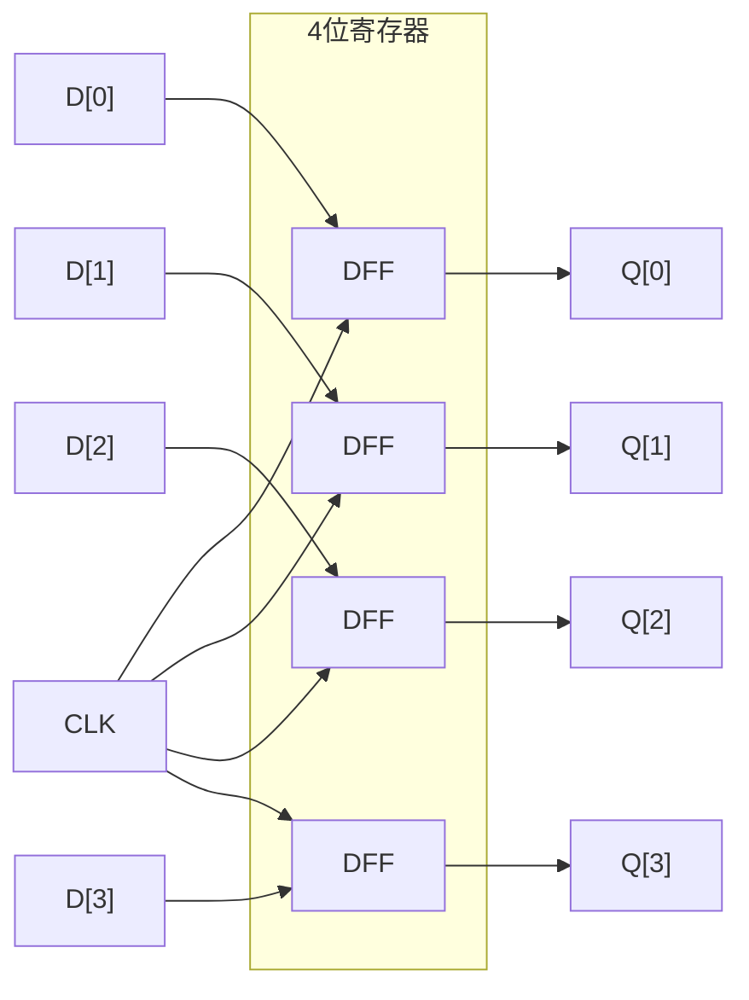
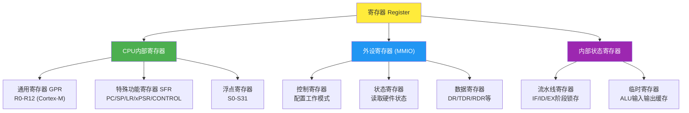
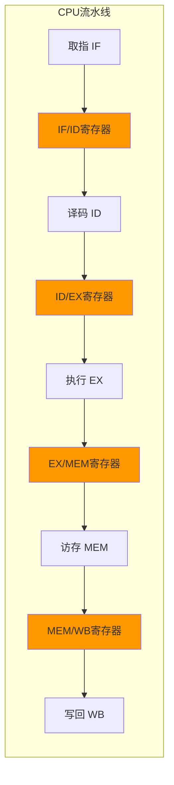
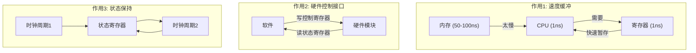
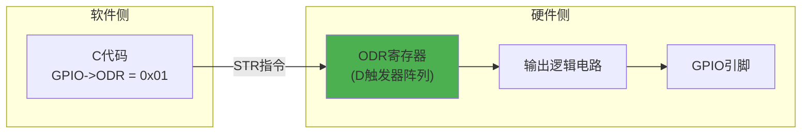
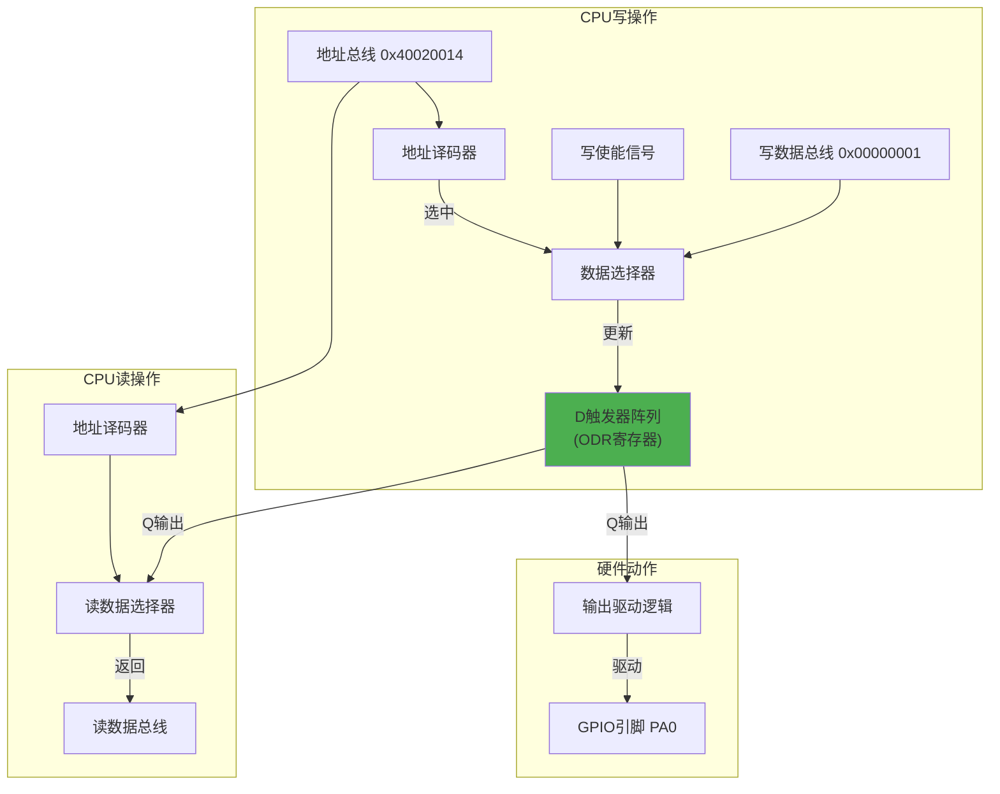
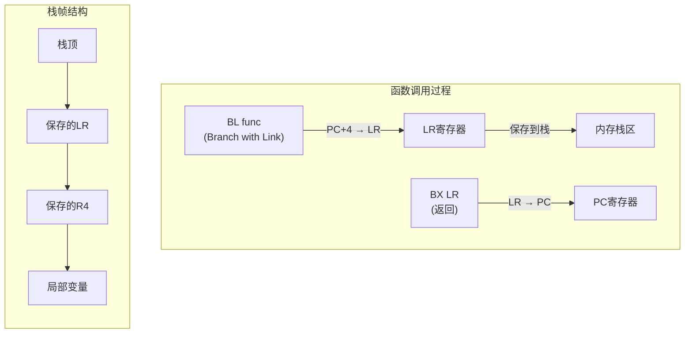
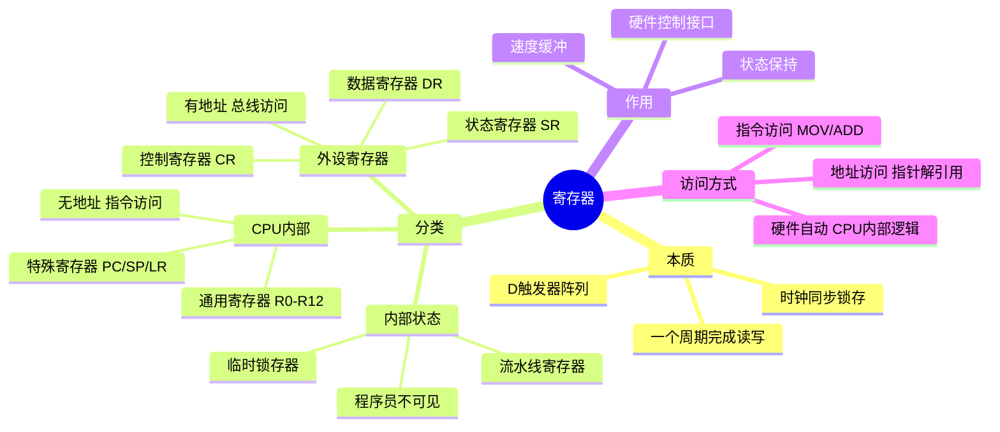

---
aliases:
  - 寄存器
  - Register
  - MMIO
  - CPU寄存器
tags:
  - 嵌入式
  - 硬件与芯片
  - 内存
  - 寄存器
  - ARM
date: 2026-04-26
status: evergreen
related:
  - "[[存储器总体认知]]"
  - "[[STM32F407启动源码的理解]]"
  - "[[内存空间分配]]"
---

> [!abstract] 核心摘要
> 寄存器是能够在一个时钟周期内完成读写的存储单元，本质是 D 触发器阵列。它分为三大类：CPU 内部寄存器（无地址，指令访问）、外设寄存器 MMIO（有地址，总线访问）、内部状态寄存器（程序员不可见）。理解寄存器是从硬件层面理解软件行为的关键。

---

## 1. 先给结论：寄存器的统一定义

**寄存器 = 能够在一个时钟周期内完成读/写的存储单元**

无论是CPU内部的R0、PC、LR，还是外设的GPIO->ODR，本质上都是**D触发器**的集合。区别只在于：
- **谁在访问它**（CPU核心 vs 外设逻辑）
- **地址是否可见**（有地址映射 vs 无地址映射）
- **功能是什么**（数据暂存 vs 硬件控制）

---

## 2. 硬件层面：寄存器是如何构成的？

### 2.1 基本单元：D触发器





**工作原理**：
- 每个时钟上升沿，D端的值被"锁存"到Q端
- 在下一个时钟上升沿到来之前，Q端保持不变
- 这就是"寄存"的含义——**锁存并保持状态**

### 2.2 N位寄存器 = N个D触发器并联



**关键点**：一个32位寄存器，就是32个D触发器共享同一个时钟信号。

---

## 3. 寄存器的三大分类（这才是你困惑的根源）



### 3.1 CPU内部寄存器（程序员可见）

这是你写汇编时直接操作的寄存器：

| 寄存器 | 全称 | 作用 | 硬件位置 |
|--------|------|------|----------|
| R0-R12 | 通用寄存器 | 存放临时数据、函数参数、返回值 | CPU核心内部 |
| SP (R13) | 栈指针 | 指向当前栈顶 | CPU核心内部 |
| LR (R14) | 链接寄存器 | 存放函数返回地址 | CPU核心内部 |
| PC (R15) | 程序计数器 | 存放下一条指令地址 | CPU核心内部 |
| xPSR | 程序状态寄存器 | N/Z/C/V标志 + 异常状态 | CPU核心内部 |
特殊功能寄存器包括程序状态字寄存器组（PSRs）、中断屏蔽寄存器组（PRIMASK、FAULTMASK、BASEPRI）以及控制寄存器（CONTROL）。这些特殊功能寄存器可以通过 MSR/MRS 指令来访问


**特点**：
- **无地址**：不占用内存地址空间，通过指令名访问（`MOV R0, #1`）
- **最快**：CPU直接访问，无总线延迟
- **数量有限**：ARM架构只有16个（R0-R15）

### 3.2 外设寄存器（MMIO - Memory Mapped I/O）

这是你写C代码时通过指针访问的寄存器：

```c
#define GPIOA_ODR  (*(volatile uint32_t *)0x40020014)
GPIOA_ODR = 0x01;  // 写寄存器
```

**特点**：
- **有地址**：映射到内存地址空间
- **通过总线访问**：CPU → AHB/APB总线 → 外设
- **有副作用**：读写可能触发硬件动作（如写DR触发UART发送）

#### 3.2.1 Cortex-M 位带机制（Bit-Banding）

在 Cortex-M3/M4 中，特定的内存区域支持"位带别名"——
通过一个 32 位地址的操作来原子修改单个 bit，无需读-改-写三步操作。

```
位带区：    0x20000000 - 0x200FFFFF  (SRAM 低 1MB)
别名区：    0x22000000 - 0x23FFFFFF
外设位带区：0x40000000 - 0x400FFFFF  (外设低 1MB)
外设别名区：0x42000000 - 0x43FFFFFF

映射公式：
  别名地址 = 别名区基址 + (byte_offset × 32) + (bit_number × 4)
```

```c
// 示例：修改 0x20000000 的 bit3
// 传统方式（非原子，中断可能打断）：
uint32_t val = *(uint32_t *)0x20000000;
val |= (1 << 3);
*(uint32_t *)0x20000000 = val;

// 位带方式（原子操作，一条 STR 指令完成）：
*(uint32_t *)0x2200000C = 1;  // 直接写 1 置位
*(uint32_t *)0x2200000C = 0;  // 直接写 0 清零
```

> [!note] 工程意义
> 位带操作在需要原子修改单个 bit 的场景（如软件 PWM、协议 bit-bang）中非常有用，
> 但 Cortex-M0/M0+ 不支持此功能。

### 3.3 内部状态寄存器（程序员不可见）

这是CPU流水线内部的寄存器，你永远看不到：



**作用**：锁存每个流水阶段的中间结果，防止数据冒险。

---

## 4. 为什么需要寄存器？三个核心作用



### 作用1：速度缓冲（解决CPU与内存的速度差距）

CPU运算速度是纳秒级，内存访问是几十纳秒级。没有寄存器，CPU每执行一条指令都要等内存。

**寄存器就是CPU的"工作台"**：
- 内存是"仓库"（大但远）
- Cache是"货架"（中距离），参见 [[存储器总体认知]]
- 寄存器是"工作台"（小但就在手边）

### 作用2：硬件控制接口（软件操控硬件的唯一手段）



**本质**：写寄存器 = 改变D触发器的值 = 改变硬件电路的状态

### 作用3：状态保持（时序电路的基础）

组合逻辑电路没有记忆，输出只取决于当前输入。**加上寄存器，就变成了时序电路**，可以"记住"之前的状态。

```
组合逻辑：Output = f(Input)
时序逻辑：Output = f(Input, CurrentState)
         CurrentState = g(PreviousState, Input)
```

### 4.1 为什么外设寄存器必须加 volatile？

`volatile` 告诉编译器："这个内存位置的值可能在你不知道的情况下被改变，不要优化掉对它的读写。"

```c
// 不加 volatile 的灾难：
while (UART->SR & RXNE) { }  
// 编译器：这个地址没人改过 → 只读一次 → 缓存到通用寄存器 → 死循环！
// 实际情况：硬件会更新 SR 寄存器 → 但编译器不知道

// 加 volatile 后：
volatile uint32_t *sr = (volatile uint32_t *)0x40011000;
while (*sr & RXNE) { }  
// 编译器：每次循环都从内存重新读取 → 正确检测硬件状态变化
```

本质上，volatile 是软件对硬件行为的"告知"：**这片存储区域的行为不遵循软件的顺序逻辑**。

---

## 5. 深入理解：外设寄存器的硬件实现

以GPIO输出数据寄存器（ODR）为例：



**关键理解**：
1. **地址译码**：地址总线上的值决定"选中"哪个寄存器
2. **写使能**：只有WR信号有效时，D触发器才更新
3. **读路径**：D触发器的Q端直接连到读数据总线

---

## 6. LR寄存器的特殊角色：栈帧管理的核心

你提到了LR，这是CPU寄存器中比较特殊的一个（与 [[STM32F407启动源码的理解]] 中 SP/PC 的硬件加载行为密切相关）：



**LR的本质**：
- 它就是一个普通的32位寄存器（D触发器阵列）
- 特殊之处在于**CPU硬件会自动操作它**：
  - 执行`BL`指令时，硬件自动把`PC+4`写入LR
  - 执行`BX LR`时，硬件自动把LR的值写入PC

---

## 7. 实用速查：你在操作的是哪种寄存器？

| 你在写的代码 | 实际操作的寄存器类型 | 访问路径 |
|---|---|---|
| `int x = 5;` | 通用寄存器 R0-R12 | CPU 内部，无地址 |
| `GPIOA->ODR = 0x01;` | 外设寄存器 (MMIO) | AHB 总线 → GPIO 模块 |
| `__set_MSP(0x20002000);` | 特殊功能寄存器 SP | CPU 内部，无地址 |
| `SCB->VTOR = 0x08000000;` | 系统控制寄存器 | PPB 总线 → SCB |
| `*(uint32_t*)0x20000000 = 0;` | 内存 (SRAM) | AHB 总线 → SRAM 控制器 |

> [!tip] 判断方法
> - 写汇编时直接用名字（R0, SP, PC）→ CPU 内部寄存器
> - 写 C 时通过地址/指针访问 → 外设寄存器（MMIO）
> - 看不到也操作不了 → 内部状态寄存器

---

## 8. 总结：寄存器的统一认知框架



---

## 9. 大师的工程建议

1. **区分"程序员可见"和"程序员不可见"**：
   - 可见：R0-R15、外设寄存器
   - 不可见：流水线寄存器、ALU临时寄存器

2. **理解volatile的必要性**：
   ```c
   // 外设寄存器必须加volatile
   #define GPIO_ODR (*(volatile uint32_t *)0x40020014)
   ```
   因为外设寄存器的值可能被硬件改变，编译器不能优化掉对它的读写。

3. **寄存器访问的时序问题**：
   - CPU寄存器：1个时钟周期
   - 外设寄存器：需要经过总线，可能有等待周期
   - 这就是为什么`__NOP()`循环比`GPIO->ODR`操作快

4. **推荐深入方向**：
   - D触发器的门级电路（RS锁存器 → D锁存器 → D触发器）
   - 寄存器堆的读写端口设计
   - APB/AHB总线协议中的寄存器访问时序

---

## 10. 继续阅读

- [[存储器总体认知]] — 存储器层次金字塔，寄存器处于最快的一层
- [[内存空间分配]] — 寄存器在内存地址空间中的映射关系
- [[STM32F407启动源码的理解]] — 启动过程中 SP/PC 寄存器的硬件加载行为
- [[内存_概览]] — 内存知识体系总览
