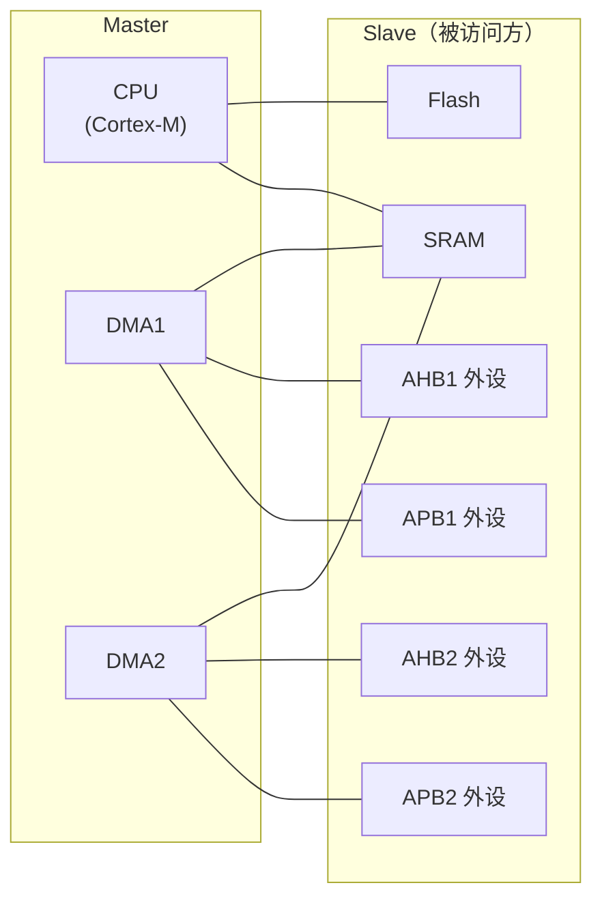
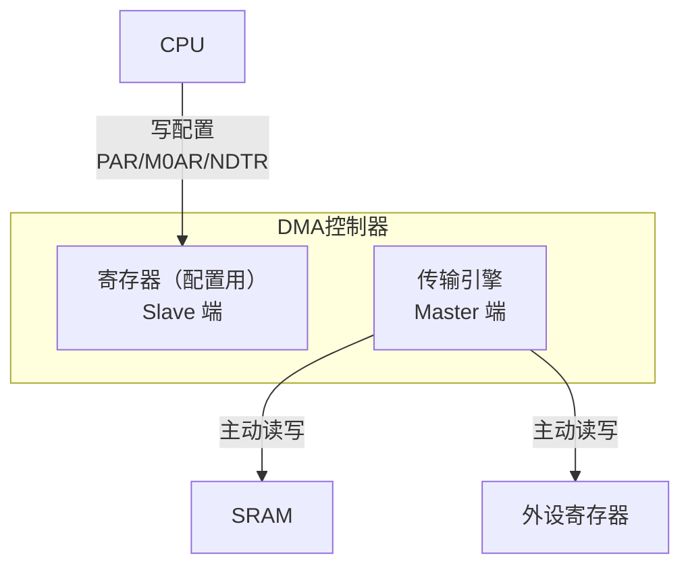
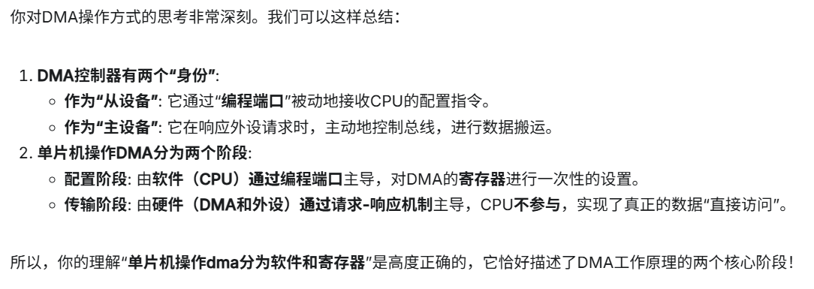
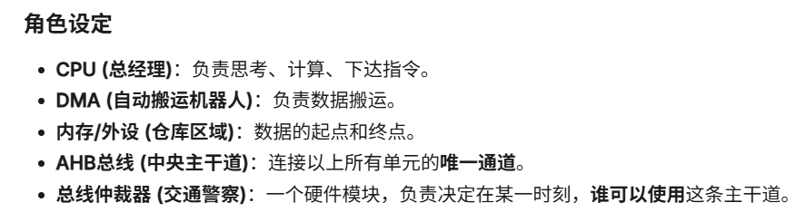
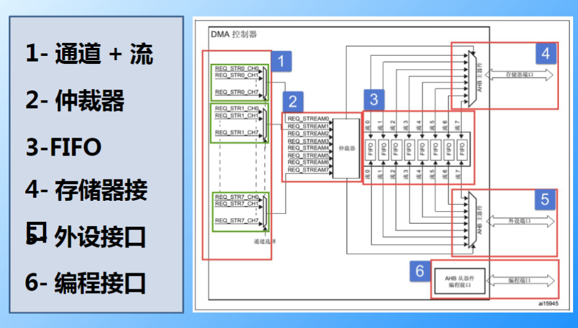
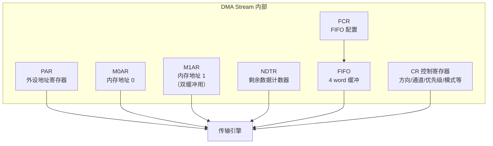
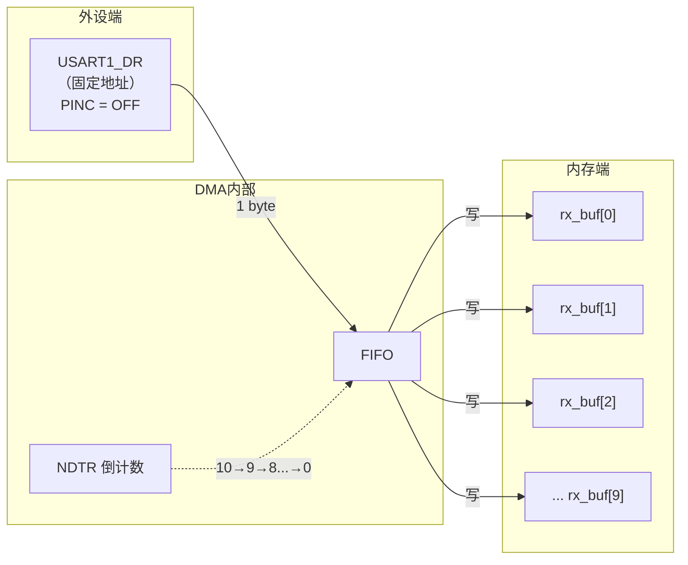
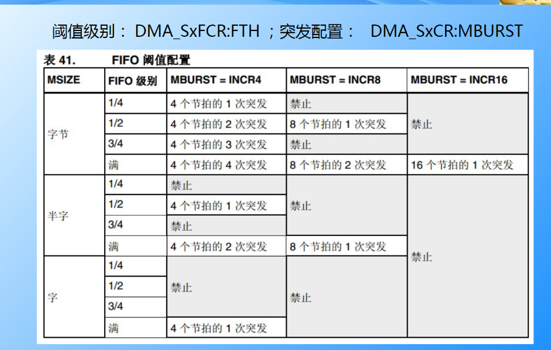
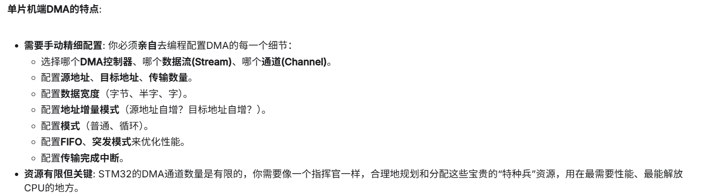
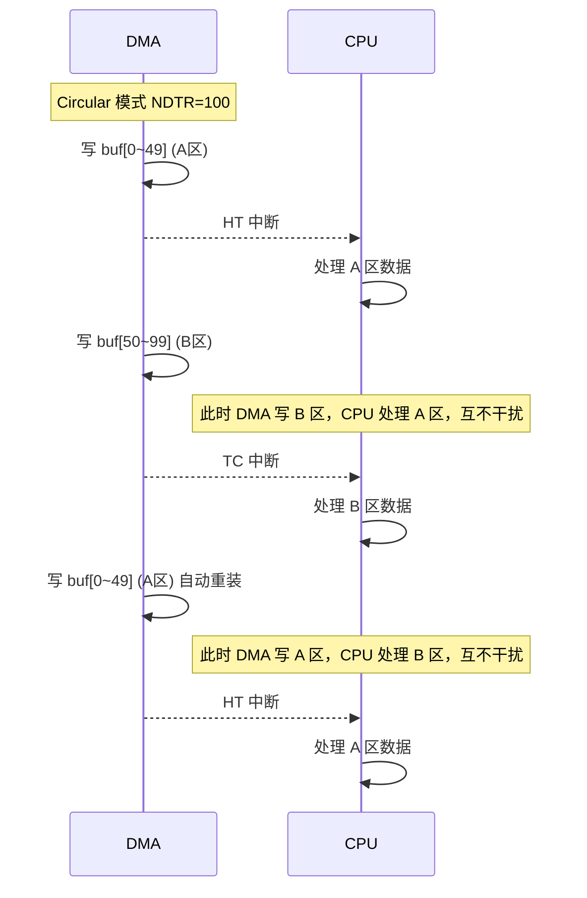

---
aliases:
  - DMA
  - 直接存储器访问
  - DMA控制器
  - DMA基础
tags:
  - 嵌入式
  - 硬件与芯片
  - 外设
  - DMA
  - 面试高频
date: 2026-04-25
status: 在学
related:
  - "[[时钟系统基础概念]]"
  - "[[../中断/中断的基础理解]]"
  - "[[ADC模块初步理解]]"
  - "[[TIM定时器基础概念]]"
---

# DMA（直接存储器访问）

> [!abstract] 核心本质
> DMA（Direct Memory Access）是总线上的**第二个 Master**，能代替 CPU 在外设寄存器和内存之间自动搬运数据。  
> 它不等于"零 CPU 开销"——DMA 和 CPU 通过**总线仲裁**分时共享总线资源；但在大多数场景下，CPU 只需配置一次，之后的数据搬运完全由 DMA 独立完成。

## 1. 为什么需要 DMA：总线架构基础

### 1.1 DMA 的根本目的

DMA 的本质作用是**解放 CPU**，让外设与内存之间建立起直接的数据通道，实现计算与 IO 并行。

但这不意味着 DMA 传输时 CPU 完全不受影响——关键在于理解**总线架构**。

### 1.2 CPU 和 DMA 的关系：分时共享总线

CPU 和 DMA 都是**总线主设备（Bus Master）**，都能发起对内存/外设寄存器的读写请求。但总线同一时刻只能被一个 Master 占用，所以需要一个**仲裁器**来决定这一拍总线归谁用。

```text
CPU 和 DMA 同时想访问 SRAM → 仲裁器决定谁先用
CPU 访问 Flash + DMA 访问 SRAM → 走不同总线 → 真正并行
```

> [!tip] 面试关键
> DMA 减少的是 CPU **搬运数据的参与**，但在总线层面 DMA 和 CPU 仍然存在竞争。只不过 DMA 每次只占用少量总线周期，CPU 大部分时间还是能正常执行。

### 1.3 总线矩阵（Bus Matrix）

STM32 内部有多个 Master 和多个 Slave，通过**交叉开关（Bus Matrix）** 连接：



关键理解：

- 每个 Master → 每个 Slave 之间有**独立的数据通路**
- CPU 通过 I-Bus 从 Flash 取指令，DMA 通过 AHB 访问 SRAM → **路径不冲突 → 真正并行**
- CPU 和 DMA 同时访问 SRAM → **仲裁器决定先后 → 一个要等**

> [!note] APB 桥延迟
> APB 外设（如 UART、TIM）挂载在低速总线上，DMA 要访问它们需要经过 **AHB-APB 桥**，这个桥本身会引入延迟。

## 2. DMA 控制器的双重身份

DMA 在系统中的地位和普通外设不同：

```text
普通外设（UART, TIM, SPI ...）：
  身份 = Bus Slave（被动方）
  挂在 AHB/APB 总线上，等别人来读写它的寄存器

DMA：
  身份 = Bus Master（主动方）+ Bus Slave（被动方）双重身份
```



- **Slave 端**：CPU 通过 AHB 总线读写 DMA 的寄存器，配置传输参数
- **Master 端**：DMA 内部引擎主动发起对 SRAM 和外设寄存器的读写
- **时钟**：DMA 同样需要开启时钟（`RCC_AHB1ENR_DMA2EN` 等），内部逻辑才能工作

> [!warning] DMA 不是普通外设
> 普通外设是纯 Slave，DMA 是 Master + Slave 双重身份。这就是为什么 DMA 在总线架构图里总是和 CPU 并列画在 Master 一侧。

## 3. OS 与 MCU 的 DMA 区别

| | 操作系统（PC） | MCU（STM32） |
|---|---|---|
| 抽象层次 | 高，不需选通道/流，调用内核 API | 低，需手动配置 Stream、Channel、地址等 |
| DMA 控制器 | 集成在芯片组，极强带宽 | 集成在 MCU 内部，带宽有限 |
| 高级能力 | Scatter-Gather（分散-聚集） | 有限，F4 支持双缓冲 |
| 配置方式 | 驱动程序自动处理 | CubeMX 或手动配置寄存器 |

> [!note] 参考资源
> PC 端 DMA 可参考 [Bitlemon: DMA Controller](https://www.youtube.com/watch?v=s8RGHggL7ws&list=PL38NNHQLqJqZoDp4CrAueD1aBin7OebEL&index=3)





## 4. F1 vs F4 架构对比

这是面试高频、也是工程中最常混淆的点。

### 4.1 F1：Channel 固定映射

```text
STM32F1 的 DMA：
┌─────────────┐
│   DMA1       │
│  Channel 0  │ ← 每个通道固定对应一个外设请求
│  Channel 1  │    例：ADC1 → DMA1_Channel1
│  Channel 2  │    例：USART1_TX → DMA1_Channel4
│  Channel 3  │    不能改，硬件写死的
│  Channel 4  │
│  Channel 5  │
│  Channel 6  │
└─────────────┘
共 7 个通道（DMA1: 7ch, DMA2: 5ch）
```

### 4.2 F4：Stream + Channel 二级结构

```text
STM32F4 的 DMA：
┌──────────────────────────────────────┐
│   DMA2                                │
│  Stream0 ──┬── Channel0              │
│            ├── Channel1              │
│            ├── ... （8选1）           │
│            └── Channel7              │
│  Stream1 ──┬── Channel0              │
│            ├── ...                    │
│  ...                                  │
│  Stream7                              │
│                                       │
│  每条 Stream 有独立 FIFO              │
│  每条 Stream 有 NDTR, PAR, M0AR, M1AR │
└──────────────────────────────────────┘
共 8 Stream × 8 Channel
```

### 4.3 核心区别

| | F1 | F4 |
|---|---|---|
| 结构 | Channel（通道） | Stream（流）+ Channel（通道选择） |
| 数量 | DMA1: 7ch, DMA2: 5ch | 每个 DMA: 8 Stream × 8 Channel |
| FIFO | 无 | 每条 Stream 独立 4-word FIFO |
| 双缓冲 | 无硬件支持 | M0AR/M1AR 硬件自动切换 |
| 请求映射 | 固定：每个通道对应固定外设 | 灵活：每条 Stream 可从 8 个 Channel 请求中选 |
| M2M | 支持（DMA1） | 仅 DMA2 支持 |

**为什么 F4 要改？** F1 的固定映射有个大问题——**资源冲突**。比如 SPI1_RX 和 USART1_RX 可能映射到同一个通道，只能二选一。F4 的二级结构解决了这个问题：8 条 Stream 是 8 条独立的传输管道，每条管道可在 8 个外设请求中自由选择。



## 5. Stream 与 Channel 的精确定义

```text
Stream（流）= 传输执行单元 = 快递员
  ├── 拥有独立寄存器组：源地址、目标地址、数据长度、配置参数
  ├── 拥有独立 FIFO（F4）
  ├── 拥有独立中断线
  └── 同一时刻只能服务于一个 Channel

Channel（通道）= 外设请求信号选择器 = 送货路线
  ├── 每条 Stream 内部有个多路选择器，从 8 个请求信号中选 1 个
  ├── Channel 0~7 只是编号，是"这条 Stream 接听哪个外设的电话"
  └── 选定后，这条 Stream 只响应对应外设的 DMA 请求
```

### 5.1 请求映射表

每个外设的 DMA 请求通常映射到 **2~4 条不同的 Stream**，目的是避免冲突。具体映射关系需查阅对应芯片的数据手册。

**选择原则：** 逐条检查你用到的所有外设，确保没有两个外设映射到同一条 Stream。CubeMX 会自动处理这个分配。

## 6. Stream 内部构成

以 F4 的 DMA Stream 为例，一条 Stream 内部是一套完整的地址管理 + 计数 + 缓冲 + 控制硬件：



| 寄存器 | 存什么 | 作用 |
|---|---|---|
| PAR | 外设寄存器地址 | 告诉 DMA "去这个地址读/写外设数据" |
| M0AR | 内存缓冲区首地址 | 告诉 DMA "数据从/到这块内存" |
| M1AR | 第二块内存地址 | 双缓冲模式下自动在 M0AR 和 M1AR 之间切换 |
| NDTR | 要传的数据个数 | 倒计数，每传一个减 1，减到 0 触发 TC |
| CR | 所有配置参数 | 方向、通道、优先级、模式、中断开关等 |
| FCR | FIFO 配置 | FIFO 开关、阈值、突发模式（F4 独有） |

## 7. 数据流的完整过程

以 UART 接收 10 字节到 `uint8_t rx_buf[10]` 为例。

### 7.1 配置阶段（CPU 执行）

```c
// 1. 写 PAR  = &(USART1->DR)     // 源：UART 数据寄存器
// 2. 写 M0AR = (uint32_t)rx_buf  // 目标：内存数组首地址
// 3. 写 NDTR = 10                // 要传 10 个字节
// 4. 写 CR：
//    方向 = Peripheral → Memory
//    PINC = OFF（DR 地址不变）
//    MINC = ON（内存地址依次递增）
//    模式 = Normal 或 Circular
//    使能 TC 中断
// 5. 使能 Stream（CR 的 EN 位置 1）
```

### 7.2 传输阶段（DMA 自动执行，CPU 不参与）

```text
t0: UART 收到第 1 字节 → UART_DR 有新数据 → 产生 DMA 请求
t1: DMA 获得总线 → 从 PAR (USART1->DR) 读出 1 字节
t2: 数据穿过 FIFO（直通模式直接通过）
t3: DMA 写入 M0AR 指向的地址 → rx_buf[0]
    NDTR: 10 → 9
    M0AR 自动 +1（因为配了 MINC，Byte 宽度）
t4: UART 收到第 2 字节 → DMA 重复上述过程 → 写入 rx_buf[1]
    ...
t_n: 第 10 字节写入 rx_buf[9]，NDTR: 1 → 0
    → 触发 TC 中断
    → Normal 模式：Stream 自动停止
    → Circular 模式：NDTR 重装为 10，M0AR 重置，继续
```



### 7.3 地址递增机制

**M0AR 的递增由 DMA 硬件完成**，不是由 NDTR 驱动。每次传输后 DMA 自动把 M0AR 往前推一步：

| 数据宽度 | 递增步长 | 说明 |
|---|---|---|
| Byte (8bit) | +1 | 每次 +1 字节 |
| HalfWord (16bit) | +2 | 每次 +2 字节 |
| Word (32bit) | +4 | 每次 +4 字节 |

两个独立的递增开关：

| 开关 | 控制什么 | 典型配置 |
|---|---|---|
| PINC | 外设端地址是否递增 | OFF（外设就一个 DR 寄存器） |
| MINC | 内存端地址是否递增 | ON（往数组里依次填数据） |

### 7.4 NDTR 的运行时读取

NDTR 是实时递减的，随时可读，这是一个重要的工程技巧：

```c
// 启动时 NDTR = 256
// 当前读到 NDTR = 3
// 说明已经传了 256 - 3 = 253 个字节
```

典型应用——UART 不定长接收：配 NDTR 为较大值（如 256），用 IDLE 中断检测"一帧结束"，读 NDTR 得知实际接收长度。

## 8. 传输方向

| 方向 | 说明 | 典型场景 |
|---|---|---|
| Peripheral → Memory | 外设到内存 | UART 接收、ADC 采集、SPI 接收 |
| Memory → Peripheral | 内存到外设 | UART 发送、DAC 输出、SPI 发送 |
| Memory → Memory | 内存到内存 | 大块数据拷贝（仅 F4 的 DMA2 支持） |

> [!warning] Memory→Memory 限制
> F4 中仅 DMA2 支持 Memory→Memory，且不能用 FIFO 和 Circular 模式。F1 的 DMA1 支持此模式。

## 9. Normal vs Circular

### 9.1 核心区别

```text
Normal（出租车）：
  接了一单，送到目的地，活干完了，停车熄火
  下一单需要重新打车（CPU 重新配置 NDTR、重新使能）

Circular（环线公交）：
  沿着固定路线一圈一圈跑
  每跑完一圈自动重新开始，永远不停
```

| | Normal | Circular |
|---|---|---|
| NDTR 到 0 后 | Stream 自动停止 | NDTR 自动重装，继续跑 |
| 适合场景 | 一次性批量传输 | 持续不断的数据流 |
| 典型应用 | SPI 发送一帧数据、ADC 单次扫描 | UART 持续接收、ADC 连续采集 |
| 需要重启吗 | 需要 CPU 重新配置 | 不需要，硬件自动循环 |

> [!note] Circular 模式限制
> Circular 模式不支持 Memory→Memory 方向，也不支持 F4 的硬件双缓冲模式（双缓冲有自己独立的循环机制）。

### 9.2 选择规律

```text
持续不断的数据流 → Circular
一次性批量传输 → Normal

外设产生数据 → CPU 收 → Peripheral to Memory
CPU 有数据 → 外设消费 → Memory to Peripheral
```

## 10. 数据宽度与地址递增

### 10.1 三种数据宽度

| 宽度 | 大小 | 对应 C 类型 |
|---|---|---|
| Byte | 8 bit | uint8_t |
| HalfWord | 16 bit | uint16_t |
| Word | 32 bit | uint32_t |

### 10.2 源端和目标端可以不同宽度

DMA 硬件会自动做宽度转换：

| 源端 → 目标端 | 行为 |
|---|---|
| 小 → 大（如 Byte → HalfWord） | 零扩展（高位补 0） |
| 大 → 小（如 HalfWord → Byte） | 截断（只保留低位） |

> [!warning] 实际工程建议
> 绝大多数场景配成**两端一样宽**就对了。不同宽度虽然能用，但容易出错且会影响 NDTR 计数含义。

### 10.3 典型场景宽度选择

| 场景 | 源端 | 目标端 | 理由 |
|---|---|---|---|
| UART 收发 | Byte | Byte | UART 是 8bit 数据 |
| ADC 12位 | HalfWord | HalfWord | ADC 结果 0~4095，16bit 装得下 |
| SPI 收发 | Byte | Byte | SPI 通常 8bit 帧 |
| DAC 输出 | HalfWord | HalfWord | DAC 12bit 数据装在 16bit 里 |

## 11. FIFO 与突发传输（F4 独有）

### 11.1 直通模式 vs FIFO 模式

F1 没有 FIFO，全靠直通模式。F4 每条 Stream 有独立 4-word FIFO。

```text
直通模式（无 FIFO / FIFO 关闭）：
  外设每来 1 个字节 → DMA 立刻占用总线 → 写 1 字节到内存
  每个字节都要申请一次总线 → 频繁仲裁，总线利用率低

FIFO 模式：
  外设每来 1 个字节 → 先存进 FIFO → 不急着占用总线
  FIFO 攒够了（达到阈值）→ DMA 一次性突发写入内存
  只占用一次总线！
```

### 11.2 FIFO 的两大价值

**价值1：批处理——减少总线申请次数**

```text
无 FIFO：搬 4 字节 = 申请总线 4 次
有 FIFO：搬 4 字节 = 申请总线 1 次（一次突发 4 beat）
```

**价值2：解耦合——外设和总线的速度解耦**

```text
ADC 采样率不高但总线竞争激烈时：
  无 FIFO → ADC 每来 1 个数据就要抢总线 → 可能抢不到 → ADC OVR 溢出
  有 FIFO → 数据先进 FIFO 安静等着 → FIFO 快满了一次性搬走 → 不容易冲突
```

### 11.3 FIFO 阈值与突发传输



**阈值（Threshold）**——FIFO 攒多少才触发一次传输：

```text
FIFO 容量固定 4 word（16 字节）
1/4 Full = 攒到 1 word 就发  → 延迟小，效率提升少
Full     = 攒到 4 word 才发  → 延迟大，效率提升多
```

**突发（Burst）**——一次搬几个 beat：

```text
Single = 1 beat（不突发）
INCR4  = 一次传 4 beat
INCR8  = 一次传 8 beat
INCR16 = 一次传 16 beat
```

> [!warning] 突发量必须 ≤ FIFO 阈值容量
> 否则 FIFO 里数据不够一次突发，会出错。

### 11.4 什么时候用直通，什么时候用 FIFO

| 场景 | 选择 | 理由 |
|---|---|---|
| 低速外设（UART 9600bps） | 直通 | 数据量小，简单省事 |
| 高速 SPI（几十 MHz） | FIFO | 减少总线占用 |
| 多个 DMA Stream 同时工作 | FIFO | 总线竞争激烈，FIFO 解耦合 |
| 源端目标端宽度不同 | FIFO | FIFO 自动做宽度转换 |



## 12. 优先级仲裁

当多条 Stream 同时请求总线时，**两级仲裁**：

**第一级：软件优先级（你配置的）**

```text
Very High > High > Medium > Low
```

**第二级：硬件流编号（平局决胜）**

```text
Stream 编号小的优先
Stream0 > Stream1 > Stream2 > ... > Stream7
```

> [!tip] 仲裁粒度
> 仲裁不是"等整个传输完成"，而是按 **beat（单次总线访问）** 为单位。Stream A 用一个 beat 传完一个数据后释放总线，下次仲裁 Stream B 可能就能拿到。实际效果是**交替执行**。

## 13. 中断与双缓冲

### 13.1 四种中断

| 中断 | 全称 | 触发时机 | 含义 |
|---|---|---|---|
| HT | Half Transfer | NDTR 减到初始值的一半 | "前半段传完了" |
| TC | Transfer Complete | NDTR 减到 0 | "整段传完了" |
| TE | Transfer Error | 读写错误（地址错、对齐错） | "出故障了" |
| DME | Direct Mode Error | 直通模式下 FIFO 溢出/欠载 | "数据流异常" |

日常工程中**用得最多的是 HT 和 TC**，TE 和 DME 主要用于调试排错。

### 13.2 HT + TC 软件双缓冲

DMA 最经典的用法——一个 buffer 分两半，DMA 写一半的时候 CPU 处理另一半：



```text
buffer 布局：总共 100 字节
┌──────────────────────┬──────────────────────┐
│   A 区 buf[0~49]     │   B 区 buf[50~99]    │
└──────────────────────┴──────────────────────┘

HT 中断 → A 区安全 → CPU 处理 A 区（DMA 正在写 B 区）
TC 中断 → B 区安全 → CPU 处理 B 区（DMA 正在写 A 区）
```

代码框架：

```c
void HAL_ADC_ConvHalfCpltCallback(ADC_HandleTypeDef *hadc)
{
    process_data(&buf[0], 50);   // HT：处理前半区
}

void HAL_ADC_ConvCpltCallback(ADC_HandleTypeDef *hadc)
{
    process_data(&buf[50], 50);  // TC：处理后半区
}
```

> [!tip] 为什么必须是 Circular
> 软件双缓冲依赖 Circular 模式的自动重装特性。Normal 模式传完就停，无法实现连续交替。

### 13.3 F4 硬件双缓冲（M0AR + M1AR）

F4 的每条 Stream 有两个独立的内存地址寄存器，DMA 硬件自动在两个 buffer 之间切换：

```text
软件双缓冲：一块 buffer 分两半（必须连续）
┌──────────┬──────────┐
│  A 区    │  B 区    │     M0AR 指向起始
└──────────┴──────────┘

硬件双缓冲：两块独立 buffer（可以不连续）
┌──────────┐          ┌──────────┐
│ Buffer 0 │          │ Buffer 1 │
│ (M0AR)   │          │ (M1AR)   │
└──────────┘          └──────────┘
可以在 SRAM 的不同位置
```

工作流程：

```text
1. DMA 启动，写 M0AR（Buffer 0）
2. NDTR 减到 0 → TC 中断 → 硬件自动切换到 M1AR（Buffer 1）
3. CPU 此时安全处理 Buffer 0
4. NDTR 又减到 0 → TC 中断 → 硬件自动切换回 M0AR
5. CPU 处理 Buffer 1
   ... 反复切换 ...
```

**CT 位（Current Target）**：Stream 中的状态位，告诉你"DMA 当前正在写 M0AR 还是 M1AR"，CPU 读这个位就知道该处理哪个 buffer。

| | 软件双缓冲 (HT/TC) | 硬件双缓冲 (M0AR/M1AR) |
|---|---|---|
| F1 能用吗 | 能 | 不能 |
| buffer 数量 | 1 块分两半 | 2 块独立 buffer |
| buffer 位置 | 必须连续 | 可以不连续 |
| 切换方式 | HT + TC 两个中断 | 硬件自动切换，只用 TC |
| 软件复杂度 | 需判断当前是哪半 | 读 CT 位即可 |

## 14. 四大应用场景串联

### 14.1 UART + DMA：不定长接收

**方案：DMA Circular + IDLE 中断**

```text
配置：NDTR = 256（足够大），Circular 模式

工作流：
  DMA 一直在后台循环接收
  UART 一帧数据发完 → 总线空闲 → IDLE 中断
  CPU 在 IDLE 中断里：
    1. 读 NDTR → 实际长度 = 256 - NDTR
    2. 处理这一帧数据
    3. DMA 不需要重启（Circular 永不停）

进阶：IDLE + Circular + HT/TC 三中断协同
  不管数据量大小、在 buffer 的哪个位置，都能做到不丢数据、不粘帧
```

### 14.2 ADC + DMA：多通道连续采集

**方案：DMA Circular + ADC 连续扫描**

```text
ADC 扫描 4 通道 → uint16_t adc_buf[4]
DMA Circular, NDTR = 4, HalfWord

ADC 扫描 CH1 → DMA 搬到 adc_buf[0]
ADC 扫描 CH2 → DMA 搬到 adc_buf[1]
ADC 扫描 CH3 → DMA 搬到 adc_buf[2]
ADC 扫描 CH4 → DMA 搬到 adc_buf[3]
NDTR: 4→3→2→1→0 → TC → NDTR 重装为 4 → 继续

adc_buf 始终是最新一轮的 4 通道数据
```

进阶：想采集多轮做平均滤波？加大 NDTR（如 40 = 10轮×4通道），用 HT/TC 双缓冲。

### 14.3 SPI + DMA：批量数据搬移

**方案：DMA Normal（TX + RX 双 Stream）**

```text
SPI 读取 W25Q64 Flash 256 字节：

RX DMA（SPI_DR → Memory）：Normal, NDTR = 256
TX DMA（Memory → SPI_DR）：Normal, NDTR = 256, 发 dummy byte (0xFF)

流程：
  拉低 CS → 启动 RX DMA → 启动 TX DMA
  TX 发 256 个 0xFF → SPI 总线产生 256 个时钟
  每个时钟 W25Q64 吐 1 字节 → RX DMA 自动搬走
  TC 中断 → 拉高 CS
```

SPI 通信是"发一帧收一帧"，用 Normal 而不是 Circular（否则总线一直被占）。

### 14.4 TIM + DMA：PWM 查表更新 CCR

**方案：Memory → Peripheral, Circular**

```text
需求：PWM 占空比按正弦波 64 点周期变化

DMA Circular, M→P 方向
M0AR = sine_table[64]（预计算的 CCR 值数组）
PAR = &(TIMx->CCR1)
NDTR = 64

每个 PWM 周期结束 → Update 事件 → DMA 请求
→ DMA 从 sine_table 读下一个 CCR 值 → 写入 CCR1
→ 下一个 PWM 周期自动用新占空比

64 点循环一遍 = 一个完整正弦波周期
CPU 完全不参与！
```

### 14.5 场景总结

| 场景 | DMA 方向 | DMA 模式 | 触发源 |
|---|---|---|---|
| UART 不定长接收 | P→M | Circular | UART RXNE |
| ADC 多通道采集 | P→M | Circular | ADC EOC |
| SPI 批量读取 | P→M + M→P | Normal | SPI TXE/RXNE |
| TIM PWM 查表 | M→P | Circular | TIM Update |

## 15. Cache 一致性问题

当 MCU 使用带 D-Cache 的内核（如 Cortex-M7 / STM32H7）时，DMA 和 CPU 可能各自持有一份内存数据的副本，导致**数据不一致**：

```text
CPU 写数据 → 只写到了 D-Cache，还没刷到 SRAM
DMA 从 SRAM 读 → 读到的是旧数据！

DMA 写数据到 SRAM → CPU 的 D-Cache 里还是旧数据
CPU 读 → 读到的是过期的缓存值！
```

> [!note] STM32F1/F4 无此问题
> Cortex-M3/M4 没有 D-Cache，所以 F1/F4 不存在 Cache 一致性问题。这个问题主要出现在 H7 等 M7 内核芯片上。

详细讨论见 [[../../操作系统与内核/多核并发的处理]]。

解决方法：

| 方法 | 说明 |
|---|---|
| 将 DMA buffer 放在非 Cache 区域 | linker script 中分配到 DTCM 或 non-cacheable 区域 |
| 手动维护 Cache | 传前 SCB_CleanDCache（刷出），传后 SCB_InvalidateDCache（作废） |
| 使用 MPU 配置 | 将 buffer 所在内存区域设为 Non-Cacheable |

## 16. 面试高频问题

> [!example]- DMA 是零 CPU 开销吗？
> 不是。DMA 和 CPU 是分时共享总线的两个 Master。当两者同时访问同一条总线（如都访问 SRAM）时需要仲裁。但 DMA 每次只占用少量总线周期，CPU 大部分时间仍能正常执行。真正的并行发生在 CPU 和 DMA 访问不同目标时（如 CPU 取 Flash 指令，DMA 访 SRAM 数据）。

> [!example]- Normal 和 Circular 的区别？
> **Normal** 传完就停（出租车），需要 CPU 重新配置才能再传，适合一次性批量传输（如 SPI 发一帧数据）。**Circular** 传完自动重装 NDTR 和地址继续循环（环线公交），永不停歇，适合持续数据流（如 UART 持续接收、ADC 连续采集）。

> [!example]- F1 和 F4 的 DMA 架构区别？
> F1 使用 Channel 固定映射（每个通道对应固定外设请求），存在资源冲突问题。F4 使用 Stream + Channel 二级结构（8 Stream × 8 Channel），每条 Stream 可灵活选择外设请求。F4 还新增了独立 FIFO、硬件双缓冲（M0AR/M1AR）。

> [!example]- HT/TC 双缓冲的原理？
> 将一个 buffer 分为前后两半，DMA Circular 模式持续写入。传到一半时 HT 中断通知 CPU "前半区安全了，可以处理"；传满时 TC 中断通知 "后半区安全了"。DMA 写 A 区时 CPU 处理 B 区，反之亦然，实现接收与处理并行。

> [!example]- 什么时候需要用 FIFO？
> 三种场景：高速外设（减少总线占用）、多个 DMA Stream 同时工作（总线竞争激烈，FIFO 解耦合）、源端目标端数据宽度不同（FIFO 自动做宽度转换）。低速简单场景用直通模式即可。

> [!example]- DMA 传输出错怎么排查？
> 见下方 Troubleshooting 排查清单。

## 17. Troubleshooting 排查清单

| 现象 | 可能原因 | 排查方向 |
|---|---|---|
| DMA 数据全为 0 | Stream 未正确使能 / NDTR 未配置 | 检查 EN 位、NDTR 值 |
| DMA 数据全为 0 | 外设时钟未开 | 检查 `RCC_AHBxENR` / `RCC_APBxENR` |
| DMA 数据错乱 | 地址递增配置错误 | 检查 MINC / PINC 开关 |
| DMA 数据错乱 | 数据宽度不匹配 | 确认 PSIZE / MSIZE 与实际数据一致 |
| DMA 不触发 | 请求映射选错了 Stream/Channel | 查数据手册 DMA request mapping 表 |
| DMA 不触发 | 外设未使能 DMA 请求 | 检查外设的 DMA 使能位（如 SPI_CR2_RXDMAEN） |
| 数据被覆盖 / OVR 溢出 | 处理速度跟不上采样速度 | 考虑加大 buffer / 用 HT/TC 双缓冲 / 加 FIFO |
| 只传了第一轮就停 | 用了 Normal 但没重启 | 改 Circular 或手动重配 NDTR + EN |
| Cache 一致性问题（H7） | D-Cache 导致 CPU 和 DMA 看到不同数据 | buffer 放非 Cache 区域或手动维护 Cache |

## 18. 一页总结

> DMA 的本质，是总线上除 CPU 之外的第二个 Master，能代替 CPU 在外设和内存之间自动搬运数据。  
> 它和 CPU 通过总线仲裁分时共享总线，大多数场景下 CPU 只需配置一次参数，之后的数据传输完全由 DMA 独立完成。  
> 在 STM32 里，F1 使用固定映射的 Channel 结构，F4 升级为灵活的 Stream + Channel 二级结构并新增 FIFO 和硬件双缓冲。  
> 核心配置参数围绕五个问题展开：**从哪来、到哪去、传多少、怎么传（Normal/Circular）、用什么节奏（FIFO/Burst）**。

```text
DMA 五问：
  从哪来？  → PAR（外设地址）
  到哪去？  → M0AR / M1AR（内存地址）
  传多少？  → NDTR（数据个数）
  怎么传？  → Normal（传完停）/ Circular（循环传）
  什么节奏？→ 直通 / FIFO + 阈值 + 突发
```

## 继续阅读

- [[时钟系统基础概念]]：DMA 时钟使能与总线时钟来源
- [[../中断/中断的基础理解]]：理解 HT/TC/TE/DME 中断机制
- [[ADC模块初步理解]]：ADC + DMA 连续采集的典型配合
- [[TIM定时器基础概念]]：TIM 触发 DMA 更新 CCR 的应用
- [[../通信/传输层/1. UART的基础理解|UART基础]]：UART + DMA 不定长接收方案
- [[../通信/传输层/3.SPI的基础理解|SPI基础]]：SPI + DMA 批量数据搬移
