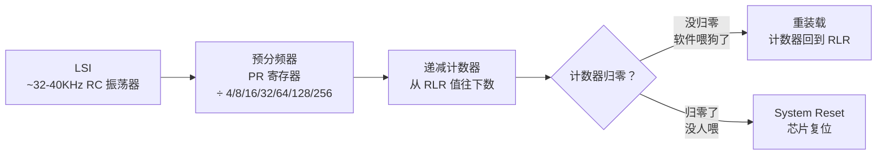
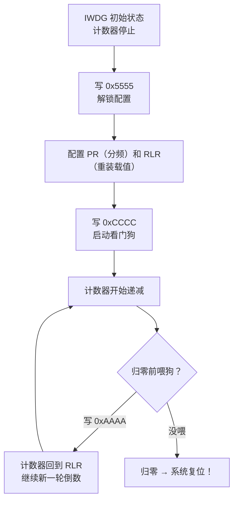
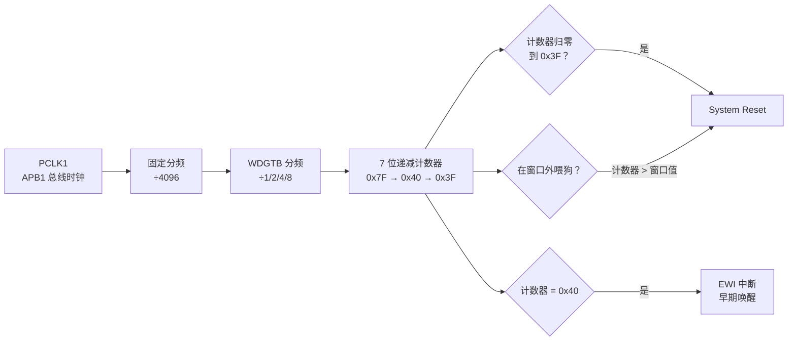
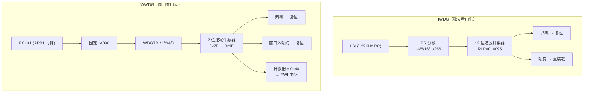
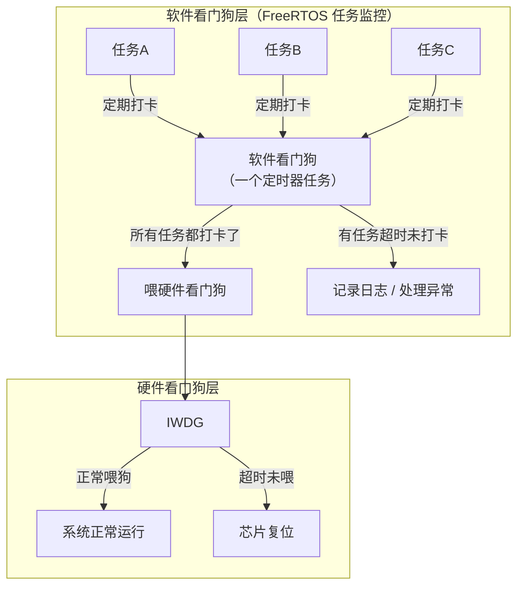

---
aliases:
  - WDT
  - 看门狗
  - Watchdog
  - IWDG
  - WWDG
tags:
  - 嵌入式/硬件与芯片/外设
  - 看门狗
  - 系统保护
date: 2026-05-21
status: ✅完成
related:
  - "[[时钟系统基础概念]]"
  - "[[TIM定时器基础概念]]"
  - "[[../中断/中断的基础理解]]"
---

# WDT 看门狗

> [!abstract] 核心本质
> 看门狗是一个独立的倒计时器。如果倒计时归零之前你没有"喂"它（重新装载计数值），它就会强制复位整个芯片。它不是帮你做时序控制的工具，而是系统崩溃时的**最后一道防线**。

这篇笔记关注**看门狗的通用思维模型**。下面会用 STM32 的 IWDG/WWDG 作为例子，但"递减计数器 + 喂狗 + 超时复位"这套机制是所有 MCU 通用的。

## 1. 为什么需要一条狗

你已经学了 [[TIM定时器基础概念]]，TIM 能做定时中断、PWM、输入捕获……但 TIM 有一个前提：**CPU 得是活的**。

如果 CPU 因为死循环、死锁、指针飞了、未处理异常等原因"挂了"，TIM 还在跑，但 CPU 不响应了。系统"假死"——没有任何机制能让它自己恢复。

**看门狗就是解决这个问题的硬件机制。**

用一个你已经熟悉的类比：

```text
TIM：   像一个闹钟 —— "数到了我就叫你"
WDT：   像一个炸弹计时器 —— "数到了你还没来拆，我就炸（复位）"
```

| | TIM 定时器 | WDT 看门狗 |
| --- | --- | --- |
| 计数方向 | 可上可下 | **只会递减** |
| 到边界时 | 产生中断 / DMA | **产生系统复位** |
| 谁能阻止 | 不需要阻止 | **软件必须定期"喂狗"重置计数值** |
| 独立性 | 依赖总线时钟 | 有独立时钟源，CPU 挂了它还在走 |
| 目的 | 做时序控制 | **做系统保护** |

### 1.1 两种看门狗的分工

MCU 里通常有**两种**看门狗，解决不同层级的问题：

| | IWDG（独立看门狗） | WWDG（窗口看门狗） |
| --- | --- | --- |
| 直觉 | **粗放的保险丝** | **精密的护栏** |
| 时钟源 | LSI（低速内部 RC，约 32~40KHz） | PCLK1（APB1 总线时钟，精确） |
| 精度 | 差（LSI 本身就不准） | 高 |
| 复位条件 | 倒计时归零 | 倒计时归零 **或** 喂早了 |
| 超时范围 | 毫秒级 ~ 秒级（最长 ~32 秒） | 毫秒级（通常 < 60ms） |
| 用途 | 防死机、兜底保护 | 防时序异常、要求严格的时间窗口 |
| 常用场景 | 几乎所有项目都开 | 安全等级高的场景（电机、电源控制） |

一句话记忆：

```text
IWDG = "太久了没喂，咬你"（只看下限）
WWDG = "太久了没喂，咬你；太早喂了，也咬你"（看窗口）
```

## 2. IWDG（独立看门狗）内部结构

### 2.1 为什么叫"独立"

"独立"是指它和主时钟系统**完全脱钩**。

回顾 [[时钟系统基础概念]]：

```text
主时钟世界：                        独立世界：
HSE → PLL → SYSCLK → CPU          LSI（~32-40KHz RC）
                ↓                      ↓
            TIM/ADC/UART...         IWDG（自顾自地倒数）

主时钟崩了 → CPU 挂了               IWDG 无所谓，继续倒数
                                     → 倒到 0 → 复位芯片 → CPU 重启
```

即使 HSE 坏了、PLL 失锁、SYSCLK 全崩了，LSI 这个 RC 振荡器还在振，IWDG 还在倒数，芯片还是会被复位恢复。

### 2.2 内部信号流

和你 TIM 笔记里"时钟源 → PSC → CNT → ARR → 事件"的链路很像，但更简单：



对比 TIM 的时基单元：

| | TIM 时基单元 | IWDG 计数链路 |
| --- | --- | --- |
| 时钟源 | 内部时钟 / 外部 / 触发 | 固定 LSI |
| 分频器 | PSC（16 位，任意分频） | PR（只有 ÷4/8/16/32/64/128/256 几档） |
| 计数器 | CNT（可上可下） | 递减计数器（**只会减**） |
| 边界 | ARR（溢出回绕） | RLR（归零 → 复位） |
| 重装载方式 | 硬件自动（Update Event） | **软件主动喂狗**（写 KR） |

### 2.3 四个关键寄存器

IWDG 只有 4 个寄存器，非常精简：

| 寄存器 | 名字 | 作用 | 理解方式 |
| --- | --- | --- | --- |
| **KR** | Key Register | 键寄存器，控制"开关"和"喂狗" | 像一个**命令口**，写入不同魔数做不同的事 |
| **PR** | Prescaler Register | 预分频器 | 和 TIM 的 PSC 一样，控制"数多快" |
| **RLR** | Reload Register | 重装载值 | 和 TIM 的 ARR 类似，决定"数多少才到零" |
| **SR** | Status Register | 状态寄存器 | 告诉你分频器和重装载值是否更新完成 |

#### 2.3.1 KR —— 魔数命令口

KR 不存配置，而是**接收命令**：

```text
写入 KR 的值        效果                直觉理解
──────────────────────────────────────────────────────
0x5555             解锁 PR/RLR 写权限    "钥匙开门，允许配置"
0xCCCC             启动看门狗             "放狗！开始倒数"
0xAAAA             喂狗                   "给狗吃一口，重新计时"
```



> [!important] 为什么是魔数
> 防止误操作。普通写 1 或 0 太容易因指针飞了或代码跑飞而意外触发。写 0xCCCC/0xAAAA 这种特殊值，误写概率极低。

#### 2.3.2 PR —— 预分频器

PR 只有几个固定档位：

| PR 值 | 分频系数 | 含义 |
| --- | --- | --- |
| 0 | ÷4 | 每 4 个 LSI 脉冲，计数器减 1 |
| 1 | ÷8 | |
| 2 | ÷16 | |
| 3 | ÷32 | |
| 4 | ÷64 | |
| 5 | ÷128 | |
| 6 | ÷256 | 最慢，超时最长 |

#### 2.3.3 RLR —— 重装载值

12 位寄存器，范围 `0x000 ~ 0xFFF`（0 ~ 4095）。每次喂狗，递减计数器被重新装载为 RLR 的值。

#### 2.3.4 SR —— 状态寄存器

| 位 | 含义 | 为什么要关注 |
| --- | --- | --- |
| RVU | 重装载值更新中 | 写了新 RLR 后，硬件需要几个 LSI 周期才生效 |
| PVU | 预分频值更新中 | 写了新 PR 后，同理 |

> [!warning] 修改 PR 或 RLR 后不能立刻启动/喂狗
> 要等 RVU/PVU 清零。HAL 库通常会帮你等，但你要知道为什么。

### 2.4 超时时间计算

类比你在 TIM 里算频率的思路：

```text
TIM：   f_update = f_timer / ((PSC+1) × (ARR+1))
IWDG：  T_timeout = PR_divider × (RLR + 1) / f_LSI
```

**计算例子**（STM32F4，LSI ≈ 32KHz）：

```text
例 1：PR = 4（÷64），RLR = 1000
T = 64 × (1000 + 1) / 32000
  = 64 × 1001 / 32000
  ≈ 2.0 秒

例 2：PR = 6（÷256），RLR = 4095（最大值）
T = 256 × 4096 / 32000
  ≈ 32.77 秒（STM32 IWDG 最长超时）
```

> [!note] f_LSI 不是精确值
> LSI 是 RC 振荡器，实际频率会偏。STM32F4 典型值 32KHz，但实际范围约 17~47KHz。详见 §5.3。

### 2.5 完整操作流程

```text
步骤 1: 写 KR = 0x5555         → 解锁配置
步骤 2: 写 PR = 分频档位        → 设置计数速度
步骤 3: 写 RLR = 重装载值       → 设置超时长度
步骤 4: 等待 SR 的 RVU/PVU 清零 → 等硬件生效
步骤 5: 写 KR = 0xCCCC         → 启动看门狗
步骤 6: 在超时前写 KR = 0xAAAA  → 喂狗（循环执行）
```

> [!important] 一旦启动，不能关闭
> IWDG 启动后（写了 0xCCCC），**没有办法通过软件停止它**。如果跑飞的代码能关掉看门狗，看门狗就没意义了。部分芯片可以通过 option byte 配置"硬件模式"，在复位前看门狗一直跑。

## 3. WWDG（窗口看门狗）内部结构

### 3.1 为什么有了 IWDG 还要 WWDG

IWDG 只看"太久没喂"，但有两种异常它检测不出来：

```text
异常 1：死循环里恰好包含喂狗代码
  → 程序跑飞了，但狗一直被喂着，看门狗永远不触发

异常 2：系统行为已经异常（主循环疯狂快跑），但喂狗频率反而更高
  → IWDG 只看"有没有超时"，不看"是不是太快"
```

**WWDG 的解决方案：不只是"太久没喂"，还包括"喂得太早"。** 它定义了一个**时间窗口**——你必须在这个窗口之内喂狗，早了不行，晚了也不行。

### 3.2 "窗口"是什么意思

```text
计数器从 0x7F(127) 往下递减...

  0x7F  ...  0x50(窗口值)  ...  0x40(64)  0x3F(63)
   │            │                    │         │
   │◄──────────►│◄──────────────────►│         │
   │  不能喂！   │   窗口内：可以喂     │   归零→  │
   │  喂了就复位 │                    │   复位  │

   └── 太早 ──┘  └── 正确喂狗区间 ──┘   └─ 太晚 ┘
```

```text
IWDG 的规则：只要在超时前喂就行，不管什么时候喂
             像一个只看截止日期的作业 → 任何时候交都行

WWDG 的规则：必须在指定的时间窗口内喂
             像一个限时考试 → 只能在规定时间段内提交
             交早了（窗口还没开）→ 判作弊（复位）
             交晚了（窗口关了）→ 判缺考（复位）
```

### 3.3 内部信号流



### 3.4 三个关键寄存器

| 寄存器 | 名字 | 作用 | 位数 |
| --- | --- | --- | --- |
| **CR** | Control Register | 计数器当前值 + 启动位 | 7 位计数器 T[6:0] + WDGA 位 |
| **CFR** | Configuration Register | 窗口值 + 分频 + EWI 使能 | W[6:0] + WDGTB[1:0] + EWI |
| **SR** | Status Register | 早期唤醒中断标志 | EWIF |

#### 3.4.1 CR 寄存器

| 位 | 含义 |
| --- | --- |
| WDGA (bit7) | 写 1 启动 WWDG（和 IWDG 的 0xCCCC 类似） |
| T[6:0] (bit6-0) | 7 位计数器，初始值 0x7F（127），递减到 0x3F（63）时复位 |

#### 3.4.2 CFR 寄存器

| 位 | 含义 |
| --- | --- |
| W[6:0] | 窗口值。计数器必须 ≤ 这个值时才能喂狗 |
| WDGTB[1:0] | 分频系数：00=÷1, 01=÷2, 10=÷4, 11=÷8 |
| EWI | 早期唤醒中断使能 |

### 3.5 喂狗的本质区别

```text
IWDG 喂狗：写 KR = 0xAAAA → 硬件自动把计数器重装载为 RLR 值
WWDG 喂狗：直接写 CR 的 T[6:0] → 软件自己决定重装载多少（通常写 0x7F）
```

- IWDG 是"触发改装载"，硬件帮你把值从 RLR 搬过来
- WWDG 是"你直接写计数器"，软件自己控制

### 3.6 超时时间与窗口计算

```
计数器范围：从 T[6:0] 递减到 0x3F
实际计数步数 = T[6:0] - 0x3F = T[6:0] - 63

每一步的时间 = 4096 × WDGTB_div / f_PCLK1

超时公式：
T_timeout = 4096 × WDGTB_div × (T[6:0] - 63) / f_PCLK1

窗口下限（最早能喂狗的时间）：
T_window = 4096 × WDGTB_div × (T[6:0] - W[6:0]) / f_PCLK1
```

**计算例子**（STM32F4，PCLK1 = 42MHz）：

```text
例 1：WDGTB = ÷1，T = 0x7F = 127
T_timeout = 4096 × 1 × (127 - 63) / 42000000
          = 4096 × 64 / 42000000
          ≈ 6.24 ms

例 2：WDGTB = ÷8，T = 0x7F
T_timeout = 4096 × 8 × 64 / 42000000
          ≈ 49.9 ms

窗口计算：WDGTB = ÷1，T = 0x7F，W = 0x5F = 95
窗口下限 = 4096 × 1 × (127 - 95) / 42000000 ≈ 3.12 ms
超时上限 ≈ 6.24 ms
喂狗窗口 = [3.12ms, 6.24ms]
```

### 3.7 EWI —— 早期唤醒中断

这是 WWDG 独有的救命机制。当计数器递减到 **0x40**（64）时——复位前的**最后一个计数值**——可以触发一个中断。

```text
计数器:  127 ... 65  0x40  0x3F
                     │      │
                  EWI中断  复位！
                  （最后机会）

在 EWI 中断里赶紧喂狗 → 写 CR = 0x7F，避免复位
```

> [!tip] EWI 的工程价值
> 复位前的"最后抢救机会"。适用于：检测到异常但想先做紧急处理（保存数据、关外设），或作为调试时的告警信号。
> EWI 中断触发后，**必须手动清除 EWIF 标志**，否则下次不会再触发。

### 3.8 IWDG vs WWDG 完整对比



| | IWDG | WWDG |
| --- | --- | --- |
| 时钟源 | LSI (~32-40KHz) | PCLK1 (APB1 总线) |
| 精度 | 差（LSI RC 漂移） | 高（总线时钟精确） |
| 计数器位数 | 12 位 (0~4095) | 7 位 (0x40~0x7F, 64~127) |
| 分频选项 | ÷4/8/16/32/64/128/256 | ÷1/2/4/8（经 4096 固定分频后） |
| 最大超时 | ~32 秒 | ~58 ms（F4@42MHz） |
| 喂狗条件 | 超时前就行 | 必须在窗口内 |
| 复位条件 | 计数器归零 | 归零 **或** 窗口外喂狗 |
| 最后抢救 | 无 | EWI 中断（到 0x40 时） |
| 启动后能关 | 不能 | 不能 |
| 典型用途 | 兜底防死机 | 严格时序监控 |

> [!important] 一句话记忆
> **IWDG 是"只要你不迟到就行"，WWDG 是"你必须准时到"。**

## 4. CubeMX + HAL 配置走查

### 4.1 IWDG 配置

#### 4.1.1 CubeMX 入口

```text
CubeMX 左侧栏：System Core → IWDG
```

| 配置项 | 对应寄存器 | 你在配什么 |
| --- | --- | --- |
| Prescaler | PR | 分频系数 |
| Reload Counter | RLR | 重装载值（0~4095） |

没有引脚选择，没有中断配置——IWDG 不需要引脚，也没有中断。

#### 4.1.2 参数选择思路

```text
步骤 1：先定目标超时（比如 2 秒）
步骤 2：试一个 PR 档位（比如 ÷64）
步骤 3：反算 RLR：
  RLR = T × f_LSI / PR_divider - 1
      = 2 × 32000 / 64 - 1
      = 999
步骤 4：验证 T = 64 × 1000 / 32000 = 2.0s ✓

CubeMX 界面下方会帮你算出实际超时时间，填完参数直接看那个数字。
```

#### 4.1.3 HAL 代码

```text
MX_IWDG_Init() 内部做了什么：
  HAL_IWDG_Init(&hiwdg)
    ├→ 等待 PVU/RVU 清零
    ├→ 写 PR（分频）
    ├→ 写 RLR（重装载值）
    ├→ 写 KR = 0xCCCC（启动看门狗）
    └→ 计数器开始递减
```

启动后，定期喂狗：

```c
HAL_IWDG_Refresh(&hiwdg);  // 内部就是写 KR = 0xAAAA
```

### 4.2 WWDG 配置

#### 4.2.1 CubeMX 入口

```text
CubeMX 左侧栏：System Core → WWDG
```

| 配置项 | 对应寄存器 | 你在配什么 |
| --- | --- | --- |
| Prescaler | WDGTB (CFR) | ÷1/2/4/8 |
| Window Value | W[6:0] (CFR) | 窗口值（0x40~0x7F） |
| Counter Value | T[6:0] (CR) | 初始计数器值（通常 0x7F） |
| Early Wakeup Interrupt | EWI (CFR) | 是否开启早期唤醒中断 |

#### 4.2.2 NVIC 配置

WWDG 的 EWI 中断需要在 NVIC 里使能：

```text
CubeMX → System Core → NVIC → WWDG global interrupt → 打勾
```

IWDG 没有这一步（它没有中断）。

#### 4.2.3 HAL 代码

```c
// 初始化（CubeMX 生成）
MX_WWDG_Init();  // 配置 CFR/CR，启动 WWDG

// 喂狗
HAL_WWDG_Refresh(&hwwdg);  // 内部写 CR T[6:0] = 0x7F

// EWI 回调（如果开了 EWI）
void HAL_WWDG_EarlyWakeupCallback(WWDG_HandleTypeDef *hwwdg)
{
    HAL_WWDG_Refresh(hwwdg);  // 赶紧喂！最后抢救
}
```

### 4.3 HAL API 速查

| API | 作用 | 对应底层操作 |
| --- | --- | --- |
| `HAL_IWDG_Init()` | 初始化并启动 IWDG | 配 PR/RLR + KR=0xCCCC |
| `HAL_IWDG_Refresh()` | 喂狗 | KR=0xAAAA |
| `HAL_WWDG_Init()` | 初始化并启动 WWDG | 配 CFR/CR(WDGA=1) |
| `HAL_WWDG_Refresh()` | 喂狗 | 写 CR T[6:0] |
| `HAL_WWDG_EarlyWakeupCallback()` | EWI 中断回调 | EWIF 触发 |

> [!note] HAL 帮你做了什么
> KR 魔数、PVU/RVU 等待、EWIF 清标志，HAL 全部封装在 Init 和 Refresh 里了。知道底层原理是为了出问题时能定位，而不是因为要手写寄存器。

## 5. 工程实践与踩坑

### 5.1 "在哪喂狗"是个架构问题

#### 5.1.1 最基础：裸机主循环喂狗

```c
while (1) {
    sensor_read();
    data_process();
    uart_send();
    HAL_IWDG_Refresh(&hiwdg);  // 每圈喂一次
}
```

> [!warning] 矛盾
> 超时设短了 → 正常操作也可能被复位
> 超时设长了 → 真死机了要等很久才能恢复
> **超时时间应略大于主循环最坏情况的执行时间。**

#### 5.1.2 更好的方式：条件喂狗

不在每个检查点盲目喂，而是**所有步骤都正常完成才喂**：

```c
while (1) {
    bool all_ok = true;

    if (sensor_read() != OK)    all_ok = false;
    if (data_process() != OK)   all_ok = false;
    if (uart_send() != OK)      all_ok = false;

    if (all_ok) {
        HAL_IWDG_Refresh(&hiwdg);
    }
}
```

> [!tip] 工程直觉
> 喂狗不是"我还在跑"就行，而是"**我不仅还在跑，而且跑得正确**"。

### 5.2 和 FreeRTOS 的配合

RTOS 下多个任务并发，推荐**软件看门狗 + 硬件看门狗**两层配合：



```text
工作流程：
1. 每个任务定期给"软件看门狗"任务发信号（打卡）
2. 软件看门狗检查：所有任务是否都在规定时间内打了卡
3. 都打了 → 喂硬件 IWDG
4. 有没打的 → 不喂 IWDG → 超时 → 复位

这样：
- 单个任务死循环 → 打卡失败 → 不喂 IWDG → 复位
- 整个系统死锁 → 软件看门狗也卡 → 不喂 IWDG → 复位
- FreeRTOS 崩溃 → 所有任务停 → 不喂 IWDG → 复位
```

> [!important] 核心思想
> **硬件看门狗保护"整个系统活着"，软件看门狗保护"每个任务都健康"。两层配合才有意义。**

ESP-IDF 已经内置了这个机制——Task Watchdog (TWDT)，本质就是"软件看门狗层"的官方实现。

### 5.3 常见翻车场景

#### 翻车 1：中断里喂狗

```c
void TIM2_IRQHandler(void) {
    HAL_IWDG_Refresh(&hiwdg);   // 每次定时器中断都喂！
}
```

```text
问题：主循环已经死循环了，但定时器中断还在触发
      → 看门狗一直被喂 → 永远不会复位
      → 看门狗形同虚设

原则：不要在中断里喂狗！
      喂狗应该反映"主逻辑流程健康"，不是"中断还能触发"
```

#### 翻车 2：喂狗代码被编译器优化掉

```c
// 优化等级 -O2/-O3 时，手写寄存器必须加 volatile
volatile uint32_t *kr = (volatile uint32_t *)0x40003000;
*kr = 0xAAAA;
// HAL 库内部已处理 volatile，自己手写时注意
```

#### 翻车 3：LSI 频率偏差导致超时不准

```text
f_LSI 标称 32KHz，实际可能 17~47KHz

LSI 实际 47KHz → 预期 2s 超时 → 实际 ≈ 1.36s → 可能正常操作也被复位
LSI 实际 17KHz → 预期 2s 超时 → 实际 ≈ 3.76s → 死机要等更久
```

> [!warning] 应对方法
> - 超时设合理余量（最坏情况 ×1.5）
> - 某些芯片支持用 TIM 测量实际 LSI 频率（TIM 接 LSI 做输入捕获），动态校准
> - 要求精确超时 → 不用 IWDG，用 WWDG

#### 翻车 4：调试时看门狗一直复位

```text
设断点 → CPU 停住 → 看门狗还在跑 → 超时 → 复位 → 断点被冲掉

解决：
  方法 1：CubeMX → Debug 选支持看门狗调试的模式
  方法 2：调试时暂不启动看门狗（别忘了发布时加回来！）
  方法 3：JTAG 有硬件机制可在调试停住时冻结看门狗
```

#### 翻车 5：看门狗超时设太短

```text
超时 = 10ms，正常主循环 = 5ms，UART 偶尔阻塞 = 15ms
→ 系统不断被复位，但 UART 阻塞是偶发的
→ 表现：系统莫名其妙重启，很难定位

原则：超时要覆盖合理的最坏情况，不能只看平均值
```

### 5.4 调试技巧

#### 技巧 1：通过 RCC 复位标志判断原因

```c
if (__HAL_RCC_GET_FLAG(RCC_FLAG_IWDGRST)) {
    // 是独立看门狗触发的复位
}
if (__HAL_RCC_GET_FLAG(RCC_FLAG_WWDGRST)) {
    // 是窗口看门狗触发的复位
}
__HAL_RCC_CLEAR_RESET_FLAGS();  // 清除标志，避免下次误判
```

排查"莫名其妙重启"时非常有用——先确认是不是看门狗干的。

#### 技巧 2：EWI 回调里打日志

```c
void HAL_WWDG_EarlyWakeupCallback(WWDG_HandleTypeDef *hwwdg)
{
    debug_log("WWDG EWI triggered!\n");
    HAL_WWDG_Refresh(hwwdg);
}
```

#### 技巧 3：计数复位次数

```c
// 利用备份寄存器（掉电不丢失，复位不丢失）
if (__HAL_RCC_GET_FLAG(RCC_FLAG_IWDGRST)) {
    uint32_t count = HAL_RTCEx_BKUPRead(&hrtc, RTC_BKP_DR0);
    HAL_RTCEx_BKUPWrite(&hrtc, RTC_BKP_DR0, count + 1);
}
// 如果计数异常高 → 系统在反复复位 → 需要修复根因
```

### 5.5 Troubleshooting 排查清单

| 现象 | 优先检查 |
| --- | --- |
| 系统莫名重启 | 读 RCC 复位标志，确认是否 WDT 触发 |
| 看门狗不断复位但程序看起来正常 | 超时是否太短？喂狗位置是否合理？是否被阻塞？ |
| 看门狗不触发但系统假死 | 是否在中断里喂了狗？喂狗是否在所有任务健康时才执行？ |
| 超时时间和预期不一致 | LSI 频率偏差？公式算错？PR/RLR 配错？ |
| 调试时无法设断点 | 调试模式下看门狗没冻结？ |
| 窗口看门狗误复位 | 喂狗太早？窗口值配错？PCLK1 频率和预期不一致？ |

## 6. 面试高频问题

> [!example]- Q1：看门狗的作用和原理？
> 看门狗是一个独立的递减计数器，归零前必须由软件"喂狗"（重新装载计数器），否则触发系统复位。本质是防止软件死循环、死锁、跑飞等异常导致系统永久假死。

> [!example]- Q2：IWDG 和 WWDG 的区别？
> IWDG 用 LSI 独立时钟，精度差但不受主时钟影响，只看"超时未喂"，适合兜底保护。WWDG 用 APB 总线时钟，精度高，要求在窗口内喂狗（早了晚了都复位），适合严格时序监控。IWDG 是"别迟到"，WWDG 是"必须准时"。

> [!example]- Q3：IWDG 的超时时间怎么算？
> T = PR_divider × (RLR + 1) / f_LSI。PR 是预分频系数（÷4~÷256），RLR 是 12 位重装载值（0~4095），f_LSI 约 32KHz（实际有偏差）。

> [!example]- Q4：WWDG 的窗口是什么意思？
> WWDG 的计数器递减过程中，只有在计数值 ≤ 窗口值且 > 0x3F 时才能喂狗。计数器值大于窗口值时喂狗（太早）或计数器归零（太晚）都会触发复位。这样可以检测出"喂狗频率异常"的问题。

> [!example]- Q5：为什么不能在中断里喂狗？
> 如果主循环死循环了，定时器中断仍然会触发并在中断里喂狗，导致看门狗永远不会复位。喂狗应该反映"主逻辑流程健康"，不是"中断还能响应"。

> [!example]- Q6：FreeRTOS 下怎么用看门狗？
> 推荐软件看门狗 + 硬件看门狗两层配合。每个任务定期向一个监控任务"打卡"，监控任务检查所有任务都正常后才去喂硬件 IWDG。单个任务异常 → 不喂 → 复位恢复。

> [!example]- Q7：IWDG 启动后能关闭吗？
> 不能。一旦写了 KR=0xCCCC 启动 IWDG，软件无法停止它。这是设计如此——如果跑飞的代码能关掉看门狗，看门狗就失去保护意义。

> [!example]- Q8：如何判断是不是看门狗导致的复位？
> 复位后读 RCC 复位标志：`RCC_FLAG_IWDGRST` 或 `RCC_FLAG_WWDGRST`。如果置位，说明是看门狗触发的复位。

> [!example]- Q9：LSI 频率偏差怎么应对？
> LSI 是 RC 振荡器，实际频率可能偏差很大。应对方法：超时设合理余量；某些芯片支持用 TIM 输入捕获实测 LSI 频率后动态校准；要求精确超时的场景用 WWDG 代替。

## 继续阅读

- [[时钟系统基础概念]]：理解 LSI/LSI 为何是 IWDG 的时钟源
- [[TIM定时器基础概念]]：理解看门狗计数器和 TIM 计数器的异同
- [[../中断/中断的基础理解]]：理解 WWDG 的 EWI 中断机制
