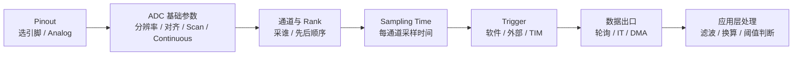
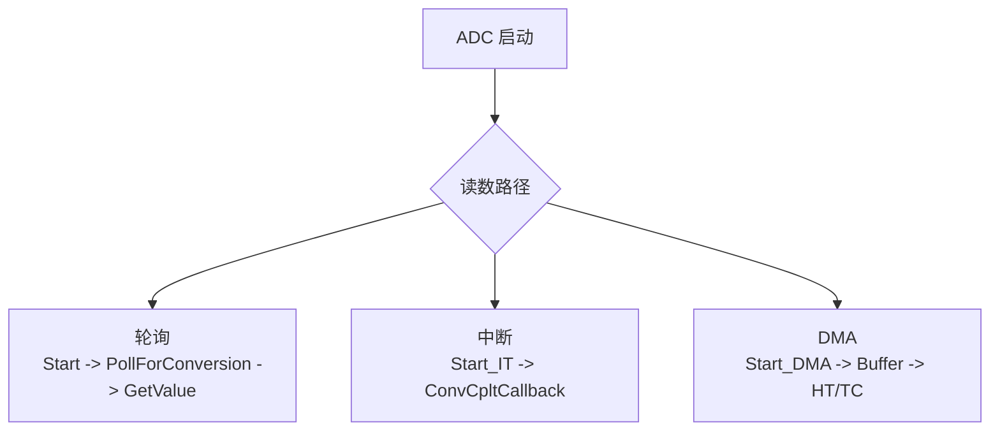
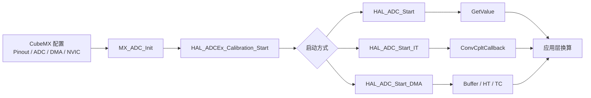
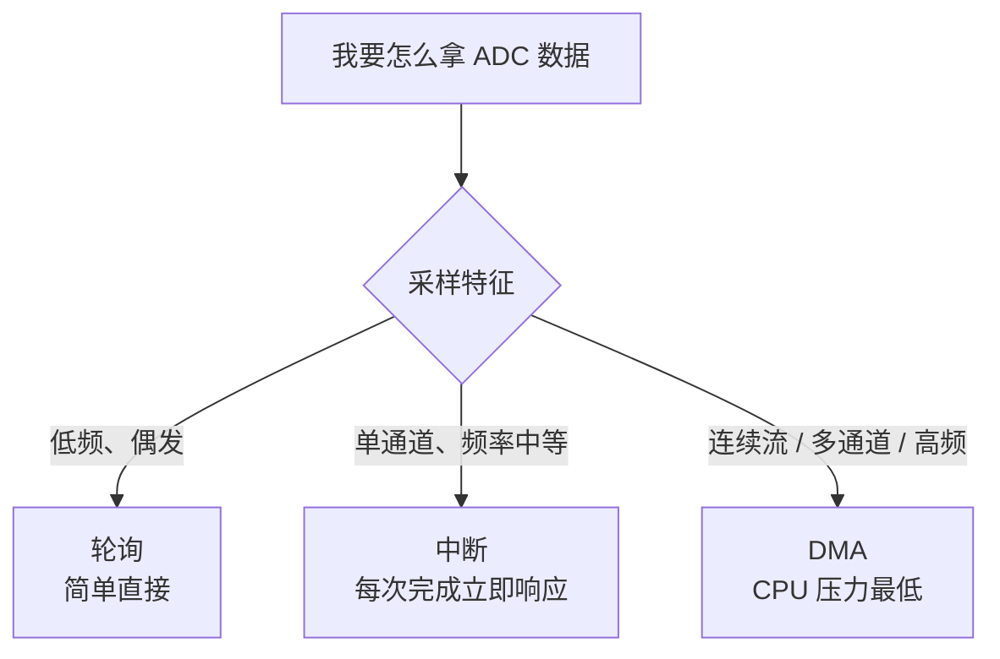
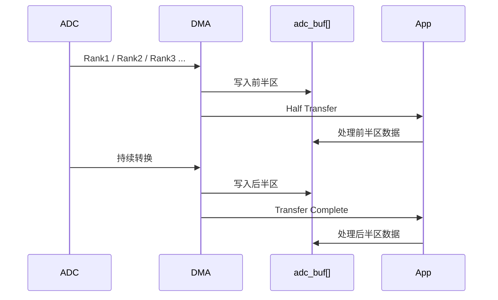
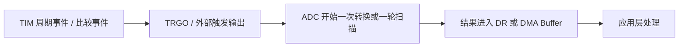

---
tags:
  - STM32
  - HAL库
  - ADC
  - CubeMX
  - DMA
  - 数据采集
  - 嵌入式
aliases:
  - ADC HAL
  - STM32 ADC
  - STM32 HAL ADC
module: ADC
related:
  - "[[ADC模块初步理解]]"
  - "[[TIM（定时器）]]"
  - "[[GPIO]]"
  - "[[中断(NVIC)]]"
  - "[[时钟系统]]"
  - "[[DMA(直接存储器访问)]]"
  - "[[HAL库设计思想]]"
---

# ADC（HAL 库）

## 概览

这篇笔记只回答一类工程问题：`CubeMX` 里怎么配、`HAL` 里怎么起、项目里怎么稳定地读到 ADC 数据。  
它不重复展开 `SAR`、量化误差、RC 采样模型这些原理内容；如果你想先把“为什么要这么配”吃透，先看 [[ADC模块初步理解]]。

ADC 在 `HAL` 工程里最常见的落地路径有四类：

- 单次单通道 + 轮询
- 连续单通道 + 中断
- 多通道扫描 + DMA
- 定时器触发 + DMA 定频采样

> [!info] 面试开场句
> “STM32 的 ADC 在 HAL 工程里最常见的是轮询、中断、DMA 三种读数方式。低频偶发采样常用轮询，持续采样更适合 DMA，多通道扫描时结果顺序由 `Rank` 决定，想要稳定定频采样通常让 `TIM` 做外部触发源。真正项目里最关键的不是 API 名字，而是 `Sampling Time`、触发方式、`DMA Circular` 和数据处理链路要配对。”  

> [!tip] 前置知识
> 这篇默认你已经知道 `Vref`、分辨率、采样时间、`SAR ADC`、规则组这些概念。  
> 原理回看：[[ADC模块初步理解]]

---

## CubeMX 配置主线

把 ADC 工程配置理解成下面这条链就很顺：



### 1. Pinout：先把引脚变成模拟口

如果采外部信号，第一步永远是：

1. 在 `Pinout` 里选中目标引脚
2. 设置为 `ADCx_INy`
3. 确认该引脚已经进入 `Analog` 模式

| 配置项 | 是什么 | 什么时候开 | 配错会怎样 |
| --- | --- | --- | --- |
| `Analog` 模式 | 关闭数字输入输出路径，交给模拟外设 | 只要这个脚要给 ADC 采样 | 读数全 0、全 4095 或抖动很怪 |

> [!warning] 先查引脚，再查代码
> 很多 “ADC 不工作” 的第一根因不是 HAL 代码，而是引脚根本没进 `Analog` 模式。

### 2. ADC 基础参数：先决定 ADC 怎么跑

CubeMX 里高频出现的基础项一般是这些：

| 配置项 | 是什么 | 什么时候开 | 配错会怎样 |
| --- | --- | --- | --- |
| `Resolution` | 结果位宽，如 12 位 | 默认先用 12 位，除非你明确要换速度/精度 | 结果范围和换算公式全变 |
| `Data Alignment` | 左对齐 / 右对齐 | 默认常用 `Right Alignment` | 读出来的数值看着像“错位” |
| `Scan Conversion Mode` | 是否按序采多个通道 | 多通道采样时打开 | 多通道场景只采到一个通道 |
| `Continuous Conversion Mode` | 一次启动后是否一直转换 | 自由运行采样流才开 | 本想定时器触发却变成自己一直跑 |
| `Discontinuous Conversion Mode` | 是否把扫描拆段执行 | 少见，只有明确要分段扫描时才开 | 扫描行为不符合预期 |

> [!note] 一个非常实用的判断
> 如果你打算让 `TIM` 精确触发 ADC，通常不要把 `Continuous Conversion` 一起打开。  
> 否则很容易从“定时触发采样”变成“第一次触发后 ADC 自己一直跑”。

### 3. 通道与 Rank：采谁，先采谁

如果是单通道，事情很简单：配置一个通道就好。  
如果是多通道扫描，`Rank` 的本质就是采样顺序：

```text
Rank 1 -> 第一个转换结果
Rank 2 -> 第二个转换结果
Rank 3 -> 第三个转换结果
```

| 配置项 | 是什么 | 什么时候开 | 配错会怎样 |
| --- | --- | --- | --- |
| `Channel` | 当前这次配置采哪个 ADC 通道 | 每加一个通道就配一次 | 采错对象 |
| `Rank` | 通道在扫描序列中的位置 | 多通道扫描必配 | DMA buffer 顺序和你以为的不一致 |
| `Nbr Of Conversion` | 一轮扫描总共采几个 | 多通道扫描时设置成通道数 | 扫描不完整或多出空位 |

> [!tip] DMA 场景下的心智模型
> `adc_buf[0]` 对应 `Rank 1`，`adc_buf[1]` 对应 `Rank 2`。  
> 只要你记住“**buffer 顺序跟 Rank 走，不跟通道号大小走**”，很多坑都能提前躲开。

### 4. Sampling Time：这是最容易“能跑但不准”的地方

`Sampling Time` 决定 ADC 给采样电容多长时间去贴近输入电压。  
工程上你不需要在这篇里重学 RC 模型，但要记住这个判断：

- 低阻信号源：可用短采样时间
- 高阻信号源：要拉长采样时间
- `VREFINT`、温度传感器等内部通道：通常建议更长采样时间

| 配置项 | 是什么 | 什么时候开 | 配错会怎样 |
| --- | --- | --- | --- |
| `Sampling Time` | 每个通道采样窗口长度 | 每个通道都要按源阻抗单独看 | 表面能读数，实际偏差大或抖动大 |

> [!tip] 工程映射
> 为什么采样时间太短会读偏，原理解释看 [[ADC模块初步理解]] 里的采样 RC 模型。

### 5. Trigger：谁来决定“什么时候采”

ADC 的触发源通常分三类：

| 触发方式 | 适合什么 | 工程特点 |
| --- | --- | --- |
| 软件触发 | 偶发读取、手动启动 | 简单直观 |
| 外部事件触发 | 对采样时刻有要求 | 更可控 |
| `TIM` 触发 | 周期采样、PWM 相位采样 | 抖动更小，工程上最常见 |

在 CubeMX 里，常对应：

- `External Trigger Conversion Source`
- `External Trigger Conversion Edge`

### 6. DMA：持续采样时的主力出口

如果 ADC 结果不是偶尔读一次，而是持续流出来，通常就该认真考虑 DMA。

| 配置项 | 是什么 | 什么时候开 | 配错会怎样 |
| --- | --- | --- | --- |
| `DMA Continuous Requests` | 转换后持续向 DMA 发请求 | 连续扫描或长期采样流 | DMA 只搬一次或不连续 |
| `DMA Mode: Normal` | 搬满一段后停止 | 一次性采一批 | 搬完就停，后续没数据 |
| `DMA Mode: Circular` | 到尾部后自动回绕 | 实时连续采样 | 若不理解缓冲区时序，容易读到旧数据 |
| `Data Width` | 传输宽度 | ADC 常配 `Half Word` | 宽度不对会导致结果乱序或截断 |

### 7. NVIC：什么时候需要开 ADC 中断

你只有在使用中断工作流时，才需要在 `NVIC` 里打开 ADC 全局中断。  
典型场景：

- `HAL_ADC_Start_IT`
- 某些越界或异常标志需要中断处理

如果你走的是纯 DMA 主线，很多时候主处理逻辑会放在 DMA 的回调里，而不是 ADC 中断里。

---

## HAL 句柄与 API 速查

### `ADC_HandleTypeDef`

```c
ADC_HandleTypeDef hadc1;  // CubeMX 生成
```

| 成员 | 说明 |
| --- | --- |
| `Instance` | 指向 `ADC1/ADC2/...` 寄存器基址 |
| `Init` | 保存分辨率、对齐、扫描、触发等初始化参数 |
| `DMA_Handle` | 关联的 DMA 句柄 |
| `State` | 当前状态，如 READY / BUSY |
| `ErrorCode` | 最近一次错误状态 |

### HAL 高频 API

| API | 用途 | 什么时候用 |
| --- | --- | --- |
| `HAL_ADC_Start` | 启动 ADC | 轮询或基础启动 |
| `HAL_ADC_PollForConversion` | 阻塞等待转换完成 | 轮询读取 |
| `HAL_ADC_GetValue` | 读取结果寄存器值 | 轮询或回调中取值 |
| `HAL_ADC_Start_IT` | 启动 ADC + 开转换完成中断 | 中断读取 |
| `HAL_ADC_Start_DMA` | 启动 ADC + DMA 搬运 | 连续采样、多通道扫描 |
| `HAL_ADC_Stop` / `HAL_ADC_Stop_IT` / `HAL_ADC_Stop_DMA` | 停止当前工作流 | 结束采样时 |
| `HAL_ADC_ConfigChannel` | 配置通道、Rank、采样时间 | 切换通道或初始化 |
| `HAL_ADCEx_Calibration_Start` | 启动校准 | 上电初始化后、正式采样前 |

### 最常见的三条读数链路



### 轮询路径最常用 API

```c
HAL_ADC_Start(&hadc1);
HAL_ADC_PollForConversion(&hadc1, 10);
value = HAL_ADC_GetValue(&hadc1);
HAL_ADC_Stop(&hadc1);
```

### 中断路径最常用 API

```c
HAL_ADC_Start_IT(&hadc1);

void HAL_ADC_ConvCpltCallback(ADC_HandleTypeDef *hadc)
{
    if (hadc->Instance == ADC1) {
        adc_latest = HAL_ADC_GetValue(hadc);
    }
}
```

### DMA 路径最常用 API

```c
HAL_ADC_Start_DMA(&hadc1, (uint32_t *)adc_buf, ADC_CH_NUM);

HAL_ADC_Stop_DMA(&hadc1);
```

### 校准调用

```c
HAL_ADCEx_Calibration_Start(&hadc1);
```

> [!warning] 先校准，再启动主流程
> 很多项目里 ADC 初始化后第一件事就是校准，而不是立刻 `Start`。

---

## 四类常见工程工作流

下面每类都按同一个节奏写：什么时候用、CubeMX 怎么配、HAL 最小模板、常见坑。

### 1. 单次单通道 + 轮询

**适合什么场景**  
低频、偶发、同步读取，比如读取电位器、手动采一个电压值、做一次校准前测量。

**CubeMX 怎么配**

- 选一个 `ADCx_INy` 引脚，设为 `Analog`
- `Scan Conversion Mode = Disable`
- `Continuous Conversion Mode = Disable`
- `External Trigger = Software Start`
- 不开 DMA，不开 ADC 中断

**HAL 最小模板**

```c
uint16_t ADC_ReadOnce(void)
{
    uint16_t value = 0;

    HAL_ADCEx_Calibration_Start(&hadc1);

    HAL_ADC_Start(&hadc1);
    if (HAL_ADC_PollForConversion(&hadc1, 10) == HAL_OK) {
        value = (uint16_t)HAL_ADC_GetValue(&hadc1);
    }
    HAL_ADC_Stop(&hadc1);

    return value;
}
```

**常见坑**

- 以为 `HAL_ADC_Start` 之后会自动给你结果，其实轮询链路必须显式等待完成
- 引脚没设成 `Analog`
- 校准没做就直接读
- 把 `Continuous` 打开后，又按单次逻辑去理解结果

### 2. 连续单通道 + 中断

**适合什么场景**  
单通道持续监测，但采样频率不高，且你希望在每次采样结束时立刻做轻量处理。

**CubeMX 怎么配**

- 单通道
- `Scan Conversion Mode = Disable`
- `Continuous Conversion Mode = Enable`
- `External Trigger = Software Start`
- 打开 ADC 中断
- 不开 DMA

**HAL 最小模板**

```c
volatile uint16_t adc_latest = 0;

void ADC_StartContinuousIT(void)
{
    HAL_ADCEx_Calibration_Start(&hadc1);
    HAL_ADC_Start_IT(&hadc1);
}

void HAL_ADC_ConvCpltCallback(ADC_HandleTypeDef *hadc)
{
    if (hadc->Instance == ADC1) {
        adc_latest = (uint16_t)HAL_ADC_GetValue(hadc);
    }
}
```

**常见坑**

- 在回调里做太重的处理，导致系统实时性变差
- 以为中断比 DMA 更“高级”，其实高频连续采样时它通常更费 CPU
- 本来只想定时采样，却误开 `Continuous`

### 3. 多通道扫描 + DMA Circular

**适合什么场景**  
最典型的工程主线：多个模拟量持续采样，例如电位器、电流、电压、热敏电阻一起采。

**CubeMX 怎么配**

- 打开 `Scan Conversion Mode`
- 配置多个通道和对应 `Rank`
- `Nbr Of Conversion = 通道数`
- 通常打开 `Continuous Conversion Mode`
- 打开 DMA，请优先用 `Circular`
- `DMA Continuous Requests = Enable`

**HAL 最小模板**

```c
#define ADC_CH_NUM 3

uint16_t adc_buf[ADC_CH_NUM];

void ADC_StartScanDMA(void)
{
    HAL_ADCEx_Calibration_Start(&hadc1);
    HAL_ADC_Start_DMA(&hadc1, (uint32_t *)adc_buf, ADC_CH_NUM);
}
```

如果你需要按块处理，可以再接 DMA 半满/全满回调。

**常见坑**

- `adc_buf[0]` 不是“最小通道号”，而是 `Rank 1`
- DMA 宽度没配对，导致结果异常
- 扫描通道数和 DMA buffer 长度不一致
- 采样时间太短，多个高阻通道看起来都“不太准”

### 4. 定时器触发 + DMA 定频采样

**适合什么场景**  
你真正关心的是采样时刻稳定，比如固定采样频率、PWM 某相位采样电流、做简单数字信号处理前端。

**CubeMX 怎么配**

- ADC 侧选择外部触发源，例如 `TIMx_TRGO`
- `Continuous Conversion Mode = Disable`
- 根据单通道或扫描需求配置 `Rank`
- 配合 DMA，通常用 `Circular`
- 定时器配置好更新事件或比较事件作为触发输出

**HAL 最小模板**

```c
#define ADC_BUF_LEN 64

uint16_t adc_buf[ADC_BUF_LEN];

void ADC_StartTimedDMA(void)
{
    HAL_ADCEx_Calibration_Start(&hadc1);
    HAL_ADC_Start_DMA(&hadc1, (uint32_t *)adc_buf, ADC_BUF_LEN);
    HAL_TIM_Base_Start(&htim3);
}
```

这里的关键不是代码长短，而是**ADC 的触发源已经换成了定时器**，所以真正决定采样节拍的是 `TIM`，不是 `while(1)`。

**常见坑**

- 想做定时触发却把 `Continuous` 也开了
- 定时器在跑，但 `TRGO` 根本没配出来
- ADC 和 DMA 都对，问题出在触发边沿或触发源选错

> [!tip] 工程上最稳的一条线
> “要稳定频率，就让 `TIM` 定节拍；要稳定搬运，就让 `DMA` 搬数据；CPU 只处理已经落地的 buffer。”

---

## 进阶特性导读

这部分只讲到工程上够用，不展开成百科。

### 1. 校准

校准的目标是尽量修正 ADC 的偏移误差、增益误差和器件工艺差异。  
工程上最常见的做法就是：

- ADC 初始化完成
- 正式开始采样前
- 调一次 `HAL_ADCEx_Calibration_Start`

大多数普通场景，上电校准一次就够用。

### 2. 内部通道

内部通道常见有：

- `VREFINT`
- 温度传感器
- 某些芯片的 `VBAT`

它们的工程提醒只有一条最重要：  
**内部通道通常要比普通外部低阻信号使用更长的采样时间。**

### 3. 注入组（Injected Group）

如果规则组可以理解成“日常采样队列”，那注入组就是“关键时刻插队执行的高优先级采样”。  
它适合：

- 电机控制
- 精确相位采样
- 某些必须抢占常规扫描的场景

如果你当前只是做常规多通道采样，完全可以先不碰注入组。

### 4. 模拟看门狗（Analog Watchdog）

它的价值不是搬数据，而是“盯阈值”：

- 超上限就报警
- 低于下限也报警

适合做：

- 电压越界检测
- 电流过流预警
- 模拟量失真或断线的快速告警

---

## Mermaid 工程图

### 1. `CubeMX -> HAL -> 数据流`



### 2. 轮询 / 中断 / DMA 对比



### 3. 扫描 + Circular DMA + HT/TC



### 4. `TIM` 触发 ADC 链路



---

## 工程注意点

### 1. 什么时候必须上 DMA

看到下面这些特征，就优先考虑 DMA：

- 多通道扫描
- 连续采样流
- 采样频率高
- 结果需要做批处理、滤波、均值、FFT 前处理

如果只是偶尔读一个值，轮询反而更省心。

### 2. 什么时候不要开 `Continuous`

这几个场景优先别开：

- 你想让 `TIM` 决定每次采样时刻
- 你想“一次触发只采一轮”
- 你需要严格控制转换次数

一句话判断：

```text
Continuous = 自由运行
TIM Trigger = 外部节拍驱动
两者目标不同，不要习惯性一起开
```

### 3. 多通道扫描时，结果顺序为什么由 `Rank` 决定

因为 ADC 本质上是在执行一张“采样队列表”。  
DMA 只是按这张表的完成顺序把结果塞进 buffer，它不知道“你主观上更关心哪个通道”。

### 4. 轮询 / 中断 / DMA 怎么选

| 方式 | 优点 | 缺点 | 适合什么 |
| --- | --- | --- | --- |
| 轮询 | 简单、直观 | 阻塞 CPU | 低频偶发读取 |
| 中断 | 响应及时 | 高频下 CPU 压力变大 | 单通道中低频 |
| DMA | CPU 压力最小 | 配置链更长 | 连续采样、多通道、高频 |

### 5. 采样时间不是性能开关，而是精度开关

很多人看到“短采样时间 -> 更快”就一路选最短。  
真正工程里更好的判断是：

- 先保证采准
- 再谈吞吐

为什么会这样，原理看 [[ADC模块初步理解]]。

---

## Troubleshooting / 面试速答

### 常见故障排查表

| 现象 | 优先排查 |
| --- | --- |
| 读数全是 `0` 或 `4095` | 引脚是否 `Analog`、输入是否越界、通道是否选错 |
| 读数抖动很大 | 采样时间是否太短、前端是否有滤波、参考电压是否稳定 |
| 多通道结果顺序不对 | `Rank` 配置是否正确、buffer 索引是否按 `Rank` 解读 |
| DMA 不进回调 | DMA 请求是否打开、长度是否正确、NVIC 是否开、模式是否匹配 |
| 数据偶尔跳变 | 是否发生 `OVR`、采样节拍是否太快、DMA 是否跟得上 |
| 内部通道读值异常 | 是否给了足够长的采样时间、是否按手册打开内部通道 |

### 一条很实用的排查顺序

```text
先查 Pinout / Analog
再查 Channel / Rank
再查 Sampling Time
再查 Trigger
再查 DMA / NVIC
最后看校准、Vref、硬件噪声
```

### 面试速答

> [!example]- 面试题：ADC 为什么常用 DMA 而不是中断？
> 因为 ADC 连续采样时会持续产出数据，如果每次转换都进中断，CPU 容易被搬运工作拖住。DMA 更适合做“持续结果搬运”，CPU 只处理已经落到 buffer 的数据块。

> [!example]- 面试题：多通道扫描时，为什么读出来顺序和通道号不一样？
> 因为结果顺序由 `Rank` 决定，不是由通道号大小决定。DMA 只按转换完成顺序写 buffer。

> [!example]- 面试题：什么时候不要开 `Continuous Conversion`？
> 当你想让外部触发，尤其是 `TIM` 来严格决定采样时刻时，通常不要开。否则第一次触发之后 ADC 会自己一直跑。

> [!example]- 面试题：ADC 轮询、中断、DMA 怎么选？
> 低频偶发读数选轮询；单通道中低频、需要及时响应可用中断；连续流、多通道、高频采样优先 DMA。

---

## 继续阅读

- [[ADC模块初步理解]]：回看采样时间、分辨率、`SAR`、规则组这些原理
- [[TIM（定时器）]]：理解 `TIM -> ADC` 触发链怎么建立
- [[GPIO]]：确认模拟引脚模式和复用入口
- [[中断(NVIC)]]：理解 ADC 中断和 DMA 中断在工程里的职责边界
- [[时钟系统]]：理解 ADC 时钟从哪来、为什么会影响转换速度
- [[DMA(直接存储器访问)]]：理解 `Normal / Circular / HT / TC` 这些关键概念
