---
tags:
  - STM32
  - HAL库
  - GPIO
  - 嵌入式
aliases:
  - General Purpose Input Output
  - 通用输入输出
related:
  - "[[外部中断EXTI]]"
  - "[[ADC]]"
  - "[[UART]]"
  - "[[I2C]]"
  - "[[SPI]]"
  - "[[DMA详解]]"
  - "[[时钟树详解]]"
  - "[[HAL库设计思想]]"
---

# GPIO

## 概述

GPIO（General Purpose Input/Output）是 MCU 与外部世界交互的最基本接口。每个引脚可独立配置为输入或输出，支持多种电气模式，是所有外设功能的物理基础。

> [!info] 面试开场句
> "GPIO 是 MCU 最基础的外设，支持 8 种工作模式，核心是推挽/开漏的输出结构设计，实际开发中需要关注 BSRR 寄存器的原子操作和输出速度的 EMI 影响。"

---

## 引脚分布与复用

### 引脚分类

- **特殊引脚**：电源（VDD/VSS）、复位（NRST）、晶振（OSC）、Boot 引脚等，上电即固定功能
- **通用 IO 引脚**：PA0~PA15、PB0~PB15 等，可通过寄存器配置为 GPIO 或外设功能

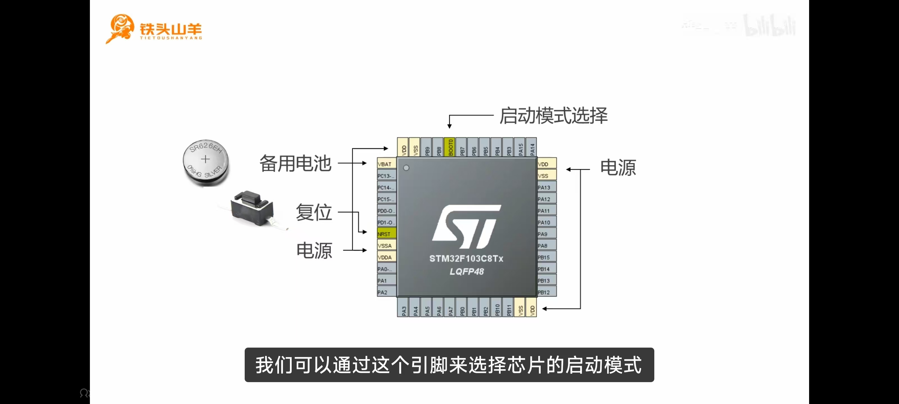

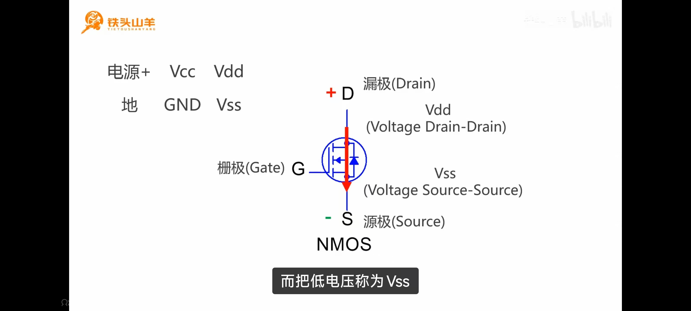

### 复用与重映射

- **复用（AF）**：引脚默认或可选地连接到片上外设（如 [[UART串口|UART]] TX、[[SPI]] SCK），由 AFIO/AF 寄存器选择
- **重映射**：将某个外设功能从默认引脚映射到备用引脚，方便 PCB 布线

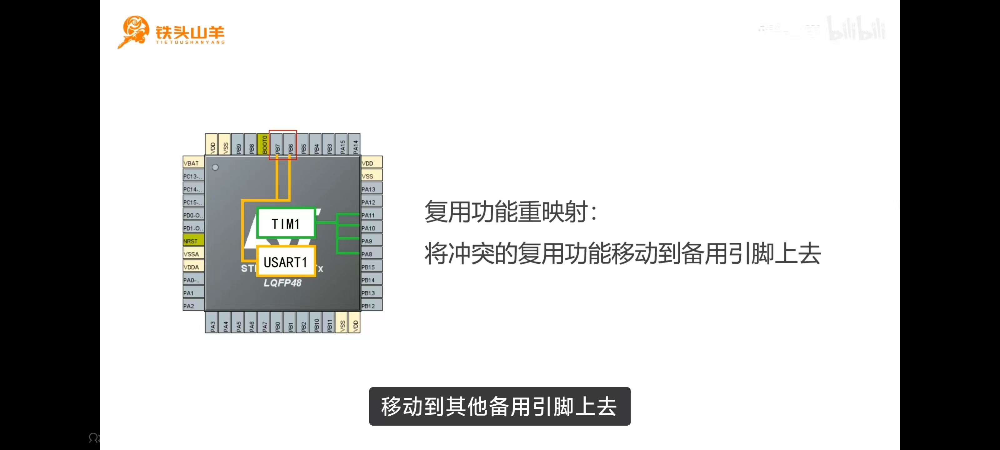

---

## 八种工作模式

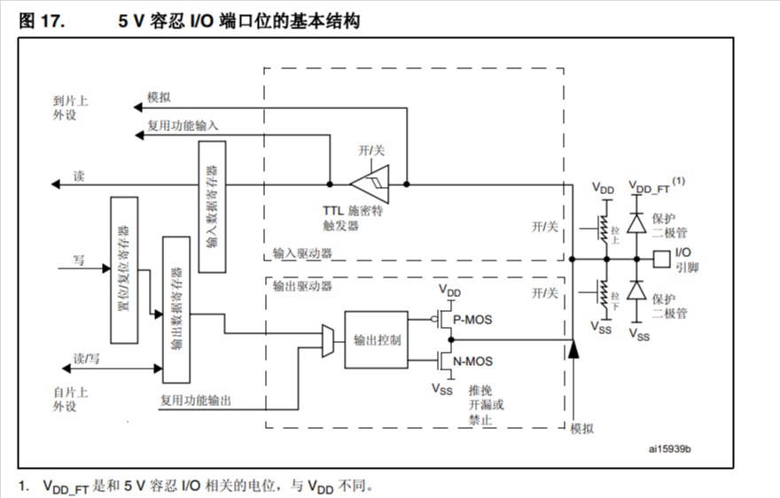

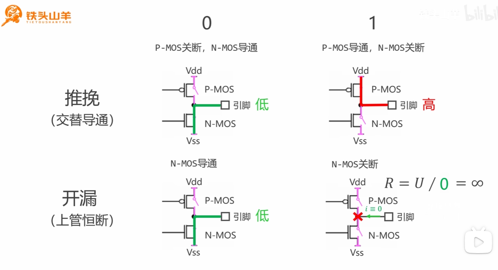

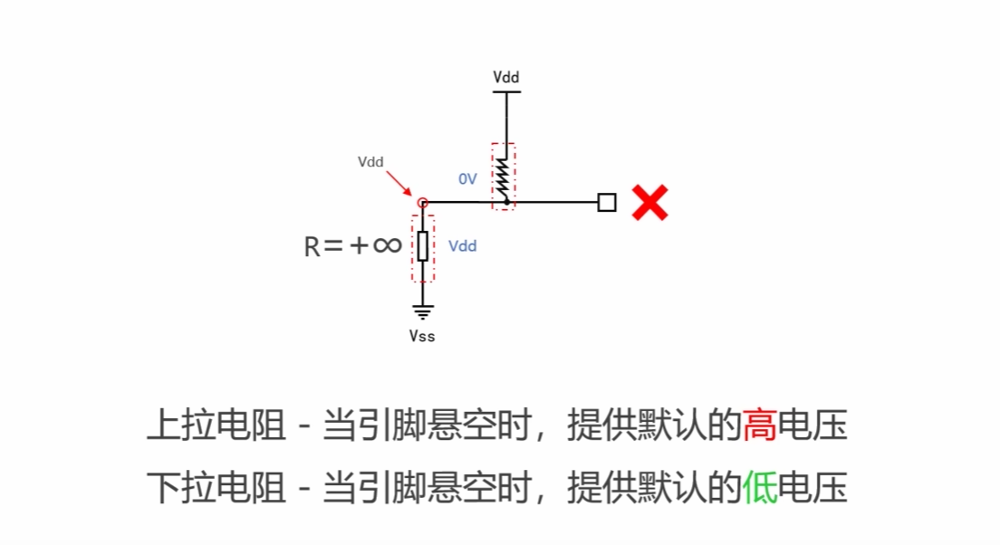

### 输入模式（4 种）

| 模式 | 内部结构 | 特点 | 典型场景 |
|------|---------|------|---------|
| 浮空输入 | 无上下拉，直接读电平 | 引脚悬空时电平不确定，易受噪声干扰 | 外部已有上下拉电路时 |
| 上拉输入 | 内部电阻接 VDD | 悬空时读到高电平 | 按键一端接 GND，按下读到低电平 |
| 下拉输入 | 内部电阻接 VSS | 悬空时读到低电平 | 按键一端接 VDD，按下读到高电平 |
| 模拟输入 | 数字输入施密特触发器关闭，直连 [[ADC]] | 不经过数字电平判断 | ADC 采集、DAC 输出 |

### 输出模式（4 种）

| 模式 | 控制者 | 电路结构 | 典型场景 |
|------|--------|---------|---------|
| 推挽输出 | GPIO 寄存器 | PMOS+NMOS | LED、[[SPI]]、普通数字信号 |
| 开漏输出 | GPIO 寄存器 | 仅 NMOS | [[I2C]]、电平转换、线与总线 |
| 复用推挽 | 片上外设 | PMOS+NMOS | [[UART串口\|UART]] TX、[[SPI]] SCK/MOSI |
| 复用开漏 | 片上外设 | 仅 NMOS | [[I2C]] SDA/SCL |

> [!tip] 记忆口诀
> 输入 4 种（浮空、上拉、下拉、模拟），输出 4 种（推挽、开漏，各自×复用组合）

---

## 重点：推挽 vs 开漏

### 推挽输出

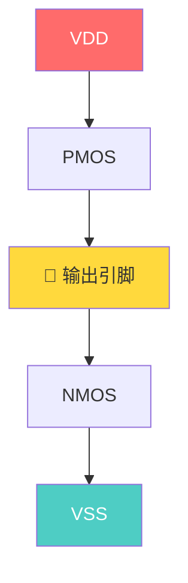

- **输出 1**：PMOS 导通，NMOS 关断 → 引脚接 VDD → **强拉高**
- **输出 0**：PMOS 关断，NMOS 导通 → 引脚接 VSS → **强拉低**
- 两个管子交替工作（**推** = PMOS 推高，**挽** = NMOS 挽低）
- 驱动能力强，但两个设备同时一个推高一个拉低 → **短路烧芯片**

### 开漏输出

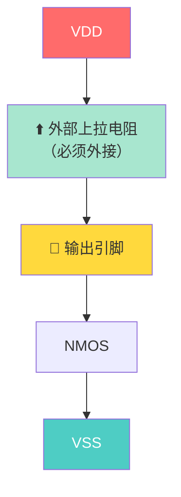

- **输出 0**：NMOS 导通 → 引脚接 VSS → 拉低
- **输出 1**：NMOS 关断 → 引脚悬空 → 由外部上拉电阻拉高
- 没有人主动拉高 → 多设备共用总线**不会短路**
- **必须外接上拉电阻**，否则高电平无法建立

> [!warning] 核心区别
> 推挽 = 主动拉高拉低，驱动强，不能线与
> 开漏 = 只能拉低，高电平靠上拉，支持线与，不会短路

### 内部上拉 vs 外部上拉

| 对比项 | 内部上拉 | 外部上拉 |
|--------|---------|---------|
| 阻值 | 约 40KΩ（弱） | 自选（常用 4.7K / 10K） |
| 驱动能力 | 弱，上升沿慢 | 强，上升沿快 |
| 适用场景 | 按键等低速 | [[I2C]] 等有严格时序要求 |
| 配置方式 | GPIO 寄存器使能 | PCB 上焊接电阻 |

---

## 输出速度（翻转速率）

输出速度控制的是驱动器的**边沿翻转速率（Slew Rate）**，即电平跳变的陡峭程度，**不是**输出信号的频率上限。

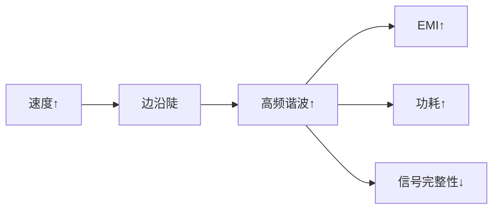

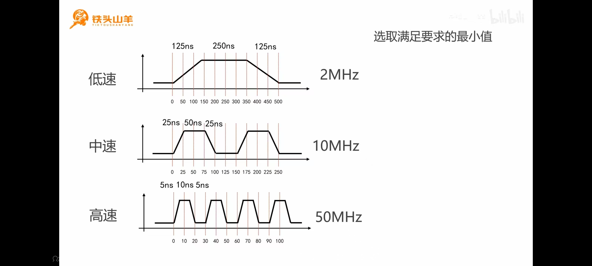

### 选型原则

> [!important] 满足需求的前提下，选最低速度。

| 场景 | 推荐速度 | 理由 |
|------|---------|------|
| LED、继电器 | 2MHz | 低速够用，省功耗，低 EMI |
| [[I2C]]（400KHz） | 2~10MHz | 总线速率不高 |
| [[SPI]]（几十 MHz） | 50MHz | 需要快速翻转 |
| 高速 PWM（→[[PWM输出]]） | 最高档 | 满足频率要求 |

---

## HAL API 速查

### 基本操作

```c
void HAL_GPIO_WritePin(GPIO_TypeDef *GPIOx, uint16_t GPIO_Pin, GPIO_PinState PinState);
HAL_GPIO_WritePin(GPIOA, GPIO_Pin_5, GPIO_PIN_SET);    // PA5 输出高
HAL_GPIO_WritePin(GPIOA, GPIO_Pin_5, GPIO_PIN_RESET);  // PA5 输出低

void HAL_GPIO_TogglePin(GPIO_TypeDef *GPIOx, uint16_t GPIO_Pin);
HAL_GPIO_TogglePin(GPIOA, GPIO_Pin_5);                  // PA5 翻转

GPIO_PinState HAL_GPIO_ReadPin(GPIO_TypeDef *GPIOx, uint16_t GPIO_Pin);
uint8_t state = HAL_GPIO_ReadPin(GPIOA, GPIO_Pin_5);   // 读取 PA5 电平
```

> [!tip] 参数规律
> 哪个**端口**（`GPIOx`）+ 哪个**引脚**（`GPIO_Pin`）+ 什么**状态**（`SET` / `RESET`）

### 寄存器级操作（高速场景）

HAL 库有函数调用和条件判断开销，高速翻转场景直接操作寄存器：

```c
GPIOA->BSRR = GPIO_Pin_5;                          // 置位：写 BSRR 低 16 位
GPIOA->BSRR = (uint32_t)GPIO_Pin_5 << 16;          // 复位：写 BSRR 高 16 位
GPIOA->ODR ^= GPIO_Pin_5;                          // 翻转：异或 ODR
```

| 方式 | 翻转频率 | 可移植性 |
|------|---------|---------|
| `HAL_GPIO_TogglePin` | ~几 MHz | 好 |
| 直接操作寄存器 | ~几十 MHz | 差 |

---

## 关键原理

### BSRR vs ODR — 为什么用 BSRR

ODR 控制整个端口 16 个引脚，修改单个引脚需要**读-改-写**三步：

```c
GPIOA->ODR |= GPIO_Pin_5;  // 读 → 改 → 写
```

**问题**：三步之间可能被 [[外部中断EXTI|中断]] 打断，中断中也修改了 ODR → 写回后覆盖中断的修改 → 数据丢失

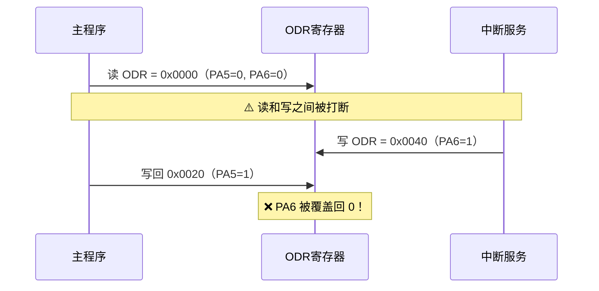

BSRR 是**只写**寄存器，写 1 执行操作，写 0 无影响，天然原子安全：

```c
GPIOA->BSRR = GPIO_Pin_5;                   // PA5 置高，其他引脚不受影响
GPIOA->BSRR = (uint32_t)GPIO_Pin_5 << 16;   // PA5 置低，其他引脚不受影响
```

> [!info] BRR 寄存器
> BRR（端口位清除寄存器）只有低 16 位有效，功能等于 BSRR 的高 16 位，是 BSRR 的子集。很多新芯片已取消 BRR，统一用 BSRR 即可。

### 线与特性 — 开漏的仲裁机制

多个开漏输出接在同一根线上，通过上拉电阻拉高：

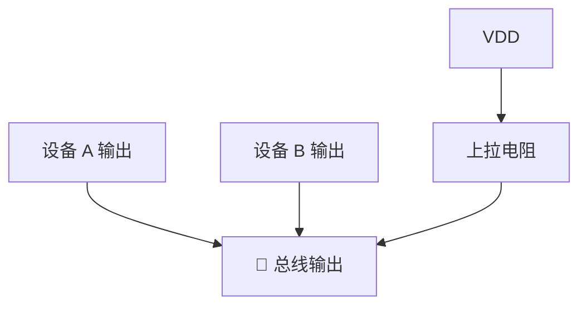

| 设备 A | 设备 B | 结果 |
|--------|--------|------|
| 1（释放） | 1（释放） | **1** |
| 1（释放） | 0（拉低） | **0** |
| 0（拉低） | 1（释放） | **0** |
| 0（拉低） | 0（拉低） | **0** |

> [!important] 线与 = 全 1 才为 1
> 只要有一个设备拉低，整条线就是低。[[I2C]] 利用此特性实现仲裁：主机发送 1 但读到 0，说明有其他设备在拉低，自动退出总线竞争，不会冲突。

### 软件 I2C 的 GPIO 配置

[[I2C]] 的 SDA 线是双向的，发送和接收需要切换方向：

| 引脚 | 配置 | 说明 |
|------|------|------|
| SCL | 开漏输出 + 外部上拉 | 主机始终控制时钟 |
| SDA | 开漏输出 + 外部上拉 | 需要双向通信 |

**SDA 读取的关键**：开漏输出时，输出 1 = NMOS 关断 = 释放总线 = 引脚由上拉拉高。此时从机可以拉低，主机通过读 IDR 获取实际电平：

```c
HAL_GPIO_WritePin(GPIOA, GPIO_Pin_5, GPIO_PIN_SET);   // 释放 SDA
uint8_t bit = HAL_GPIO_ReadPin(GPIOA, GPIO_Pin_5);    // 读取从机数据
```

> [!tip] 不需要切换输入/输出模式，开漏输出天然支持双向。

---

## 面试高频问题

> [!example]- Q1：GPIO 有哪八种模式？[[I2C]] 的 SDA/SCL 应该配置为什么模式？
> 4 种输入（浮空、上拉、下拉、模拟）+ 4 种输出（推挽、开漏、复用推挽、复用开漏）。I2C 配置为**开漏输出**，因为开漏的线与特性支持多设备共用总线和仲裁，且不会短路。

> [!example]- Q2：推挽输出和开漏输出的区别？
> 推挽有 PMOS 和 NMOS，可主动拉高拉低，驱动能力强；开漏只有 NMOS，只能拉低，高电平靠外部上拉。开漏不会短路，适合多设备总线。

> [!example]- Q3：为什么操作引脚用 BSRR 而不是直接写 ODR？
> ODR 是读-改-写操作，非原子，可能被中断打断导致其他引脚状态丢失。BSRR 是只写寄存器，写 1 执行操作、写 0 无影响，天然原子安全。

> [!example]- Q4：GPIO 输出速度是不是越快越好？
> 不是。输出速度控制边沿翻转速率，越快 EMI 越强、功耗越高、信号完整性问题越多。应**满足需求的前提下选最低速度**。

> [!example]- Q5：内部上拉和外部上拉的区别？什么时候必须用外部？
> 内部上拉约 40KΩ，驱动弱；外部可用小阻值，驱动强。[[I2C]] 等有时序要求的总线必须外部上拉，内部上拉太弱导致上升沿过慢。

---

## 踩坑记录

> [!bug] 实战经验填充区
> （项目开发中遇到的 GPIO 相关问题记录于此）
