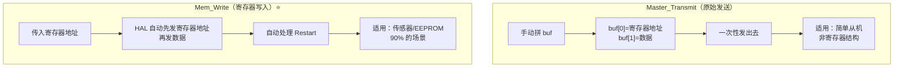
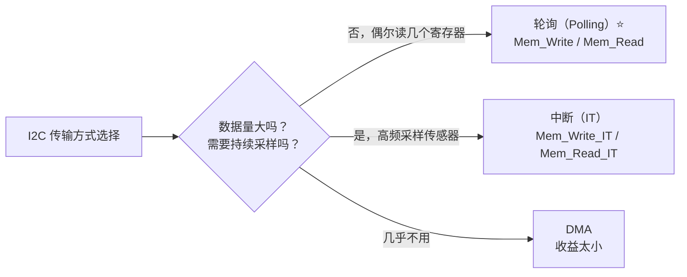
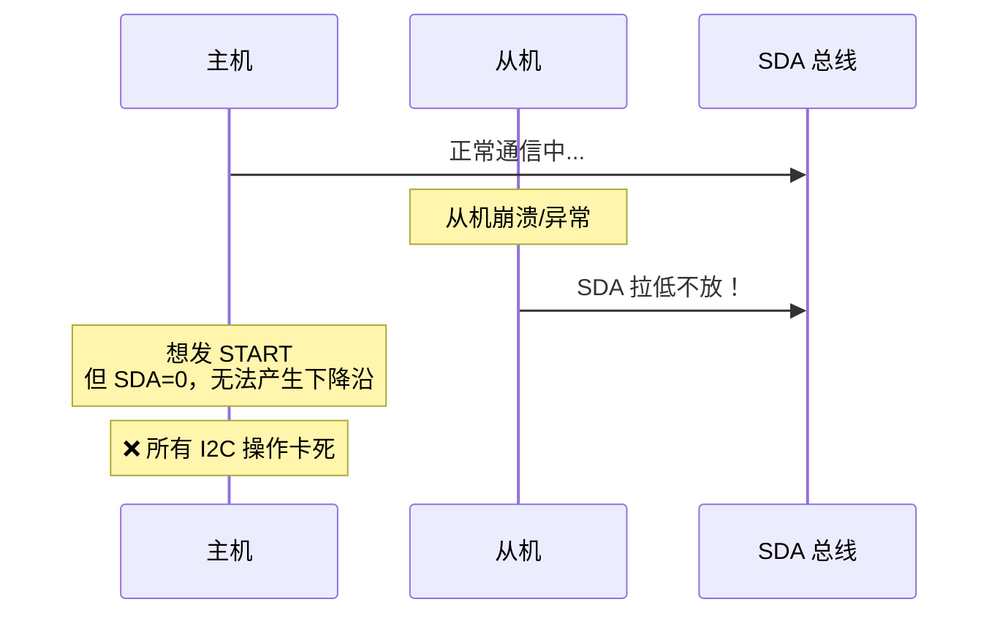
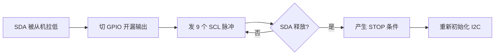
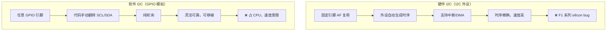
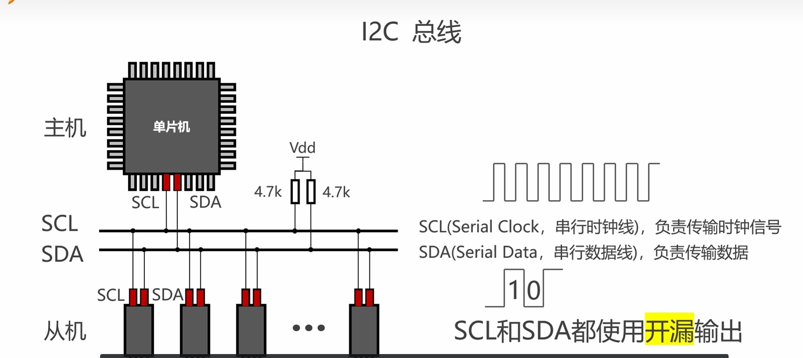
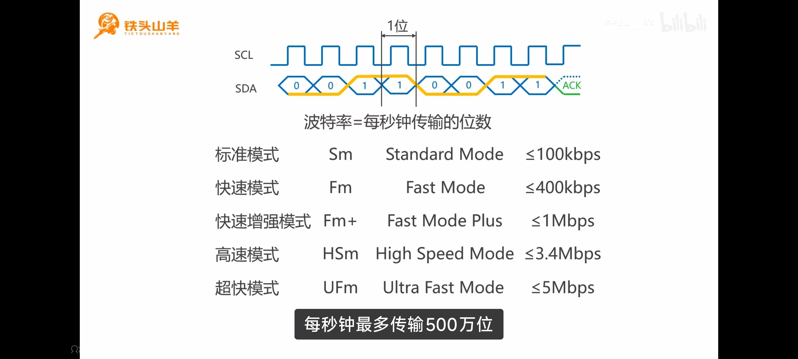
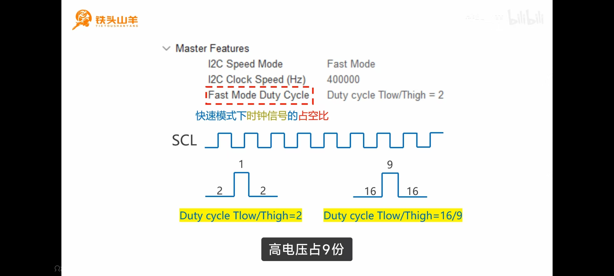
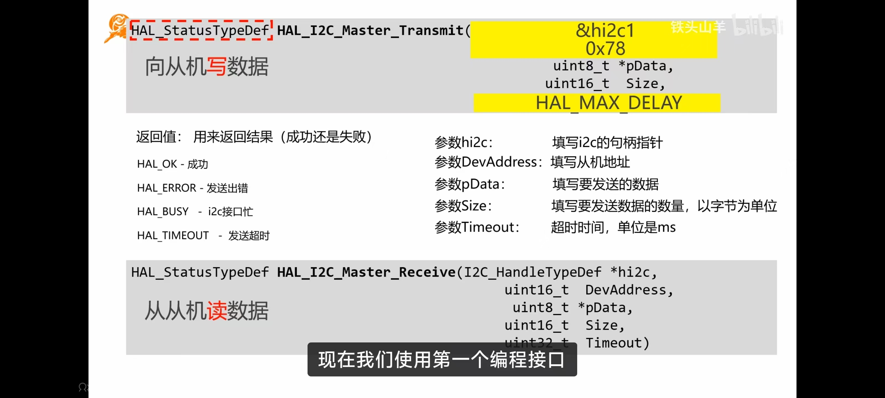
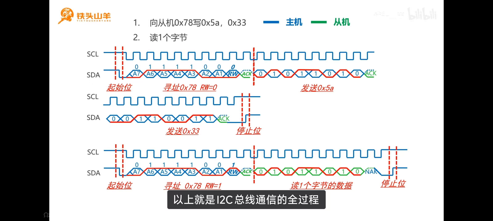

---
tags:
  - STM32
  - HAL库
  - I2C
  - IIC
  - 嵌入式
aliases:
  - Inter-Integrated Circuit
  - IIC
  - 两线制总线
module: I2C
related:
  - "[[GPIO]]"
  - "[[UART]]"
  - "[[SPI]]"
  - "[[DMA详解]]"
  - "[[外部中断EXTI]]"
  - "[[时钟树详解]]"
  - "[[2.I2C的基础理解]]"
  - "[[HAL库设计思想]]"
---

# I2C（HAL 库）

## 概述

I2C 是 MCU 与传感器、EEPROM 等外设通信最常用的总线之一。HAL 库提供了**轮询、中断、DMA** 三种方式，但实际项目中 I2C 传输数据量小，**基本都用轮询**。核心 API 是 `Mem_Write` / `Mem_Read`，自动处理寄存器地址。

> [!info] 面试开场句
> "I2C 在 HAL 库中主要用 `Mem_Write`/`Mem_Read` 进行寄存器级别的读写，实际项目基本用轮询方式因为数据量小。F1 系列有 I2C silicon bug 建议用软件 I2C，F4 及以后用硬件 I2C。"

> [!tip] 前置知识
> I2C 协议层原理（地址寻址、ACK/NACK、线与仲裁、开漏输出）详见 [[2.I2C的基础理解]]

---

## HAL 句柄

```c
I2C_HandleTypeDef hi2c1;  // CubeMX 生成
```

| 成员 | 说明 |
|------|------|
| `Instance` | 指向 I2C1/I2C2 寄存器基址 |
| `Init` | 初始化参数（时钟速度、地址模式、占空比） |
| `State` | 当前状态（READY / BUSY / RESET 等） |
| `ErrorCode` | 最近一次错误码 |

---

## HAL API 速查

### 主机发送/接收（原始字节流）

```c
// 主机发送 —— 直接发一串字节
HAL_StatusTypeDef HAL_I2C_Master_Transmit(
    I2C_HandleTypeDef *hi2c,      // 哪个 I2C
    uint16_t DevAddress,          // 从机地址（含 R/W 位，左移后的值）
    uint8_t *pData,               // 发送数据
    uint16_t Size,                // 数据长度
    uint32_t Timeout              // 超时
);

// 主机接收 —— 直接收一串字节
HAL_StatusTypeDef HAL_I2C_Master_Receive(
    I2C_HandleTypeDef *hi2c,
    uint16_t DevAddress,
    uint8_t *pData,
    uint16_t Size,
    uint32_t Timeout
);
```

```c
// 例：用 Master_Transmit 写寄存器（手动拼字节）
uint8_t buf[2] = {0x1A, 0x55};  // buf[0]=寄存器地址, buf[1]=数据
HAL_I2C_Master_Transmit(&hi2c1, 0xD0, buf, 2, 100);
// 总线: START → 0xD0(写) → 0x1A → 0x55 → STOP
```

### 寄存器写入/读取（推荐⭐）

```c
// 写从机寄存器
HAL_StatusTypeDef HAL_I2C_Mem_Write(
    I2C_HandleTypeDef *hi2c,
    uint16_t DevAddress,          // 从机地址（含 R/W 位）
    uint16_t MemAddress,          // 寄存器地址
    uint16_t MemAddSize,          // 寄存器地址长度
    uint8_t *pData,               // 写入数据
    uint16_t Size,                // 数据长度
    uint32_t Timeout
);

// 读从机寄存器
HAL_StatusTypeDef HAL_I2C_Mem_Read(
    I2C_HandleTypeDef *hi2c,
    uint16_t DevAddress,
    uint16_t MemAddress,
    uint16_t MemAddSize,
    uint8_t *pData,
    uint16_t Size,
    uint32_t Timeout
);
```

```c
// 例：读 MPU6050 的加速度 X（寄存器 0x3B，连续 2 字节）
uint8_t buf[2];
HAL_I2C_Mem_Read(&hi2c1, 0xD1, 0x3B, I2C_MEMADD_SIZE_8BIT, buf, 2, 100);

// 例：写 EEPROM 地址 0x0010
uint8_t data = 0xAA;
HAL_I2C_Mem_Write(&hi2c1, 0xA0, 0x0010, I2C_MEMADD_SIZE_16BIT, &data, 1, 100);
```

> [!important] MemAddSize 参数
> - `I2C_MEMADD_SIZE_8BIT` → 8 位寄存器地址（大多数传感器）
> - `I2C_MEMADD_SIZE_16BIT` → 16 位寄存器地址（大容量 EEPROM）

### 中断方式（_IT）

```c
HAL_StatusTypeDef HAL_I2C_Master_Transmit_IT(I2C_HandleTypeDef *hi2c, uint16_t DevAddress, uint8_t *pData, uint16_t Size);
HAL_StatusTypeDef HAL_I2C_Master_Receive_IT(I2C_HandleTypeDef *hi2c, uint16_t DevAddress, uint8_t *pData, uint16_t Size);
HAL_StatusTypeDef HAL_I2C_Mem_Write_IT(I2C_HandleTypeDef *hi2c, uint16_t DevAddress, uint16_t MemAddress, uint16_t MemAddSize, uint8_t *pData, uint16_t Size);
HAL_StatusTypeDef HAL_I2C_Mem_Read_IT(I2C_HandleTypeDef *hi2c, uint16_t DevAddress, uint16_t MemAddress, uint16_t MemAddSize, uint8_t *pData, uint16_t Size);
```

### DMA 方式（_DMA）

```c
HAL_StatusTypeDef HAL_I2C_Master_Transmit_DMA(I2C_HandleTypeDef *hi2c, uint16_t DevAddress, uint8_t *pData, uint16_t Size);
HAL_StatusTypeDef HAL_I2C_Master_Receive_DMA(I2C_HandleTypeDef *hi2c, uint16_t DevAddress, uint8_t *pData, uint16_t Size);
HAL_StatusTypeDef HAL_I2C_Mem_Write_DMA(I2C_HandleTypeDef *hi2c, uint16_t DevAddress, uint16_t MemAddress, uint16_t MemAddSize, uint8_t *pData, uint16_t Size);
HAL_StatusTypeDef HAL_I2C_Mem_Read_DMA(I2C_HandleTypeDef *hi2c, uint16_t DevAddress, uint16_t MemAddress, uint16_t MemAddSize, uint8_t *pData, uint16_t Size);
```

### 回调函数

```c
// 主机发送完成
void HAL_I2C_MasterTxCpltCallback(I2C_HandleTypeDef *hi2c);

// 主机接收完成
void HAL_I2C_MasterRxCpltCallback(I2C_HandleTypeDef *hi2c);

// Mem 写完成
void HAL_I2C_MemTxCpltCallback(I2C_HandleTypeDef *hi2c);

// Mem 读完成
void HAL_I2C_MemRxCpltCallback(I2C_HandleTypeDef *hi2c);

// 错误回调
void HAL_I2C_ErrorCallback(I2C_HandleTypeDef *hi2c);

// 通用回调（所有 I2C 完成事件都会触发，上面的特定回调优先级更高）
void HAL_I2C_MasterTxCpltCallback(I2C_HandleTypeDef *hi2c);
```

### 设备检测

```c
// 检测从机是否存在（发地址看有没有 ACK）
HAL_StatusTypeDef HAL_I2C_IsDeviceReady(
    I2C_HandleTypeDef *hi2c,
    uint16_t DevAddress,
    uint32_t Trials,              // 尝试次数
    uint32_t Timeout
);

// 例：检测地址 0x68 的设备是否在线
if (HAL_I2C_IsDeviceReady(&hi2c1, 0xD0, 3, 100) == HAL_OK) {
    // 设备在线
}
```

### 中止传输

```c
HAL_StatusTypeDef HAL_I2C_Master_Abort_IT(I2C_HandleTypeDef *hi2c, uint16_t DevAddress);
```

---

## Master_Transmit vs Mem_Write

这是 I2C HAL 库最核心的区分：



| 对比 | `Master_Transmit` | `Mem_Write` |
|------|-------------------|-------------|
| 寄存器地址 | 自己拼进 buf | HAL 自动处理 |
| 总线时序 | 一段连续发送 | 自动发 Restart |
| 适用场景 | 简单从机 | **传感器、EEPROM** |
| 使用频率 | 低 | **高（90%）** |

> [!tip] 从机地址传入方式
> HAL 库的 I2C 函数中 `DevAddress` 参数**已经帮你左移了 1 位**，你传入 `0xD0`（写）或 `0xD1`（读），底层会自动处理 R/W 位。

---

## 三种方式选择



| 方式 | 使用频率 | 原因 |
|------|---------|------|
| **轮询** | ⭐⭐⭐ 最常用 | I2C 数据量小（几个字节），< 1ms 完成，等一下就好 |
| 中断 | 偶尔用 | 高频持续采样场景（如 MPU6050 1kHz） |
| DMA | 极少用 | 配置 DMA 的时间比传输还长，得不偿失 |

> [!warning] 为什么 I2C 不像 UART 那样首选 DMA？
> UART 可能持续收到大量数据，DMA 解放 CPU 意义巨大。I2C 通常只读 2~8 字节寄存器，不到 1ms，轮询就够了。

---

## 总线锁死与恢复

### 锁死原因

从机异常导致 **SDA 被拉低不放**，主机无法产生 START 条件（SDA 无法从高变低）：



### 恢复方案

手动切换 GPIO 模式，发 9 个 SCL 脉冲让从机完成未完成的传输：

```c
void I2C_Bus_Recovery(I2C_HandleTypeDef *hi2c) {
    GPIO_InitTypeDef GPIO_InitStruct = {0};
    GPIO_InitStruct.Mode = GPIO_MODE_OUTPUT_OD;
    GPIO_InitStruct.Pull = GPIO_PULLUP;
    GPIO_InitStruct.Speed = GPIO_SPEED_FREQ_HIGH;

    GPIO_InitStruct.Pin = SCL_PIN;
    HAL_GPIO_Init(SCL_PORT, &GPIO_InitStruct);
    GPIO_InitStruct.Pin = SDA_PIN;
    HAL_GPIO_Init(SDA_PORT, &GPIO_InitStruct);

    for (int i = 0; i < 9; i++) {
        HAL_GPIO_WritePin(SCL_PORT, SCL_PIN, GPIO_PIN_RESET);
        HAL_Delay(1);
        HAL_GPIO_WritePin(SCL_PORT, SCL_PIN, GPIO_PIN_SET);
        HAL_Delay(1);
        if (HAL_GPIO_ReadPin(SDA_PORT, SDA_PIN) == GPIO_PIN_SET)
            break;
    }

    HAL_GPIO_WritePin(SDA_PORT, SDA_PIN, GPIO_PIN_RESET);
    HAL_Delay(1);
    HAL_GPIO_WritePin(SCL_PORT, SCL_PIN, GPIO_PIN_SET);
    HAL_Delay(1);
    HAL_GPIO_WritePin(SDA_PORT, SDA_PIN, GPIO_PIN_SET);
    HAL_Delay(1);

    HAL_I2C_DeInit(hi2c);
    HAL_I2C_Init(hi2c);
}
```



> [!warning] 面试必背
> I2C 总线锁死 = 从机拉住 SDA 不放 → 切 GPIO 手动发 9 个 SCL 脉冲 + STOP + 重初始化。实际项目中建议在每次 I2C 操作前加超时检测，失败后自动恢复。

---

## 硬件 I2C vs 软件 I2C



| 对比 | 硬件 I2C | 软件 I2C |
|------|---------|---------|
| 引脚 | 固定（AF 复用） | **任意 GPIO** |
| 时序 | 硬件自动，精确 | 软件延时，受中断影响 |
| CPU 占用 | 低 | **高** |
| 速度 | 400K~1MHz | < 400K（取决于延时） |
| 稳定性 | F1 有 bug | **稳定** |
| 移植性 | 依赖 STM32 | **任何 MCU** |

> [!important] 面试标准答案
> **F1 用软件 I2C，F4 及以后用硬件 I2C。**
> STM32F1 的 I2C 外设有 silicon bug，特定条件下进入 BUSY 状态无法恢复。F4 以后 I2C 外设重新设计，硬件 I2C 可靠。

---

## CubeMX 配置







| 配置项 | 常用值 | 说明 |
|--------|--------|------|
| I2C Speed Mode | Fast Mode | 400KHz |
| Clock Speed | 400000 | 快速模式 |
| Clock No Stretch Mode | Disabled | 从机可拉伸时钟 |
| Primary Address Length | 7-bit | 大多数设备用 7 位地址 |

---

## 常见错误

| 错误 | 原因 | 解决 |
|------|------|------|
| `HAL_I2C_ERROR_AF` | 从机无 ACK | 检查地址、接线、上拉电阻、从机上电 |
| `HAL_I2C_ERROR_BERR` | 总线错误 | 检查时序、走线长度 |
| `HAL_I2C_ERROR_ARLO` | 仲裁丢失 | 多主机冲突 |
| `HAL_I2C_ERROR_TIMEOUT` | 超时 | 从机无响应或总线锁死 |
| 总线锁死 | SDA 被从机拉低 | 执行总线恢复流程（上文） |

---

## API 截图



## 示例截图



---

## 面试高频问题

> [!example]- Q1：`Master_Transmit` 和 `Mem_Write` 的区别？
> `Master_Transmit` 是原始字节流发送，寄存器地址要自己拼进 buf。`Mem_Write` 自动处理寄存器地址，先发地址再发数据，自动产生 Restart。实际 90% 场景用 `Mem_Write`/`Mem_Read`。

> [!example]- Q2：I2C 为什么不像 UART 那样用 DMA？
> I2C 数据量小（通常 2~8 字节），传输 < 1ms，轮询就够了。配置 DMA 的时间比传输本身还长，收益极小。只有高频持续采样（如 MPU6050 1kHz）才考虑中断方式。

> [!example]- Q3：I2C 总线锁死怎么办？
> 从机异常拉住 SDA 不放 → 切 GPIO 开漏输出模式 → 手动发 9 个 SCL 脉冲让从机完成未完成的传输 → SDA 释放后产生 STOP → 重新初始化 I2C 外设。

> [!example]- Q4：硬件 I2C 和软件 I2C 怎么选？
> F1 系列用软件 I2C（硬件 I2C 有 silicon bug），F4 及以后用硬件 I2C。软件 I2C 灵活可移植但占 CPU，硬件 I2C 省资源但引脚固定。

> [!example]- Q5：`HAL_I2C_IsDeviceReady` 的作用？
> 检测从机是否在线，原理是发送从机地址等待 ACK。常用于初始化时检测设备、扫总线上的设备地址。

> [!example]- Q6：从机地址为什么要左移 1 位？
> I2C 地址字节 = 7 位地址 + 1 位 R/W。`0x68 << 1 | 0 = 0xD0`（写），`0x68 << 1 | 1 = 0xD1`（读）。HAL 库函数要求传入已左移的地址（含 R/W 位）。

---

## 踩坑记录

> [!bug] 实战经验填充区
> （项目开发中遇到的 I2C 相关问题记录于此）
