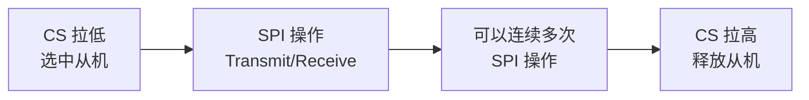
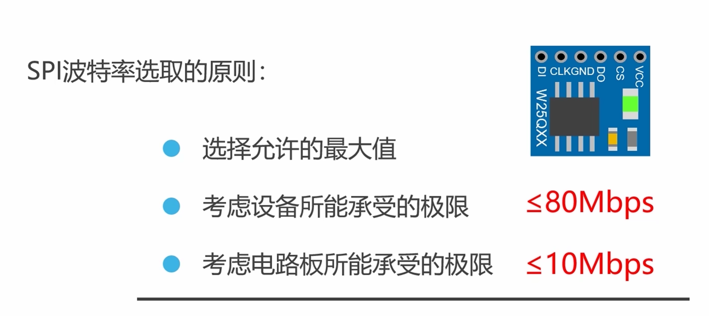
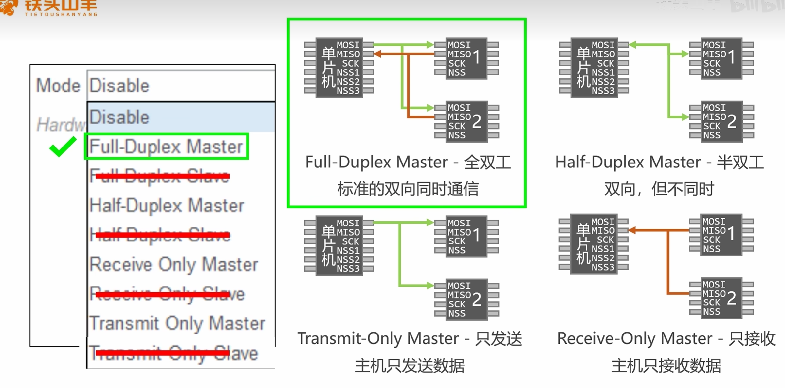
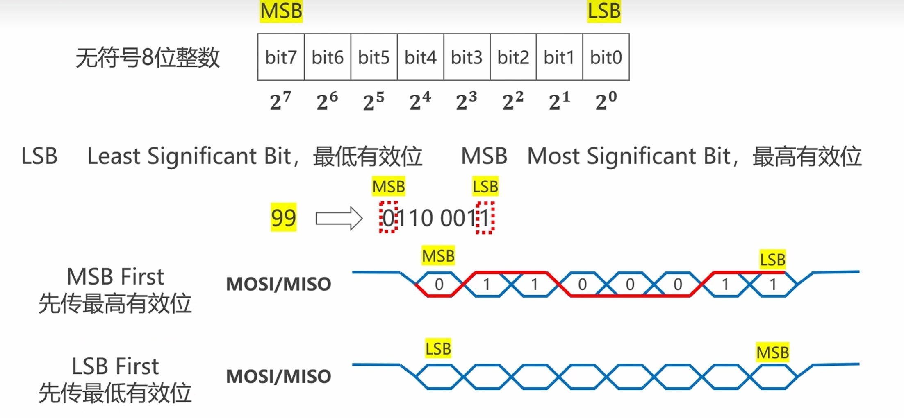
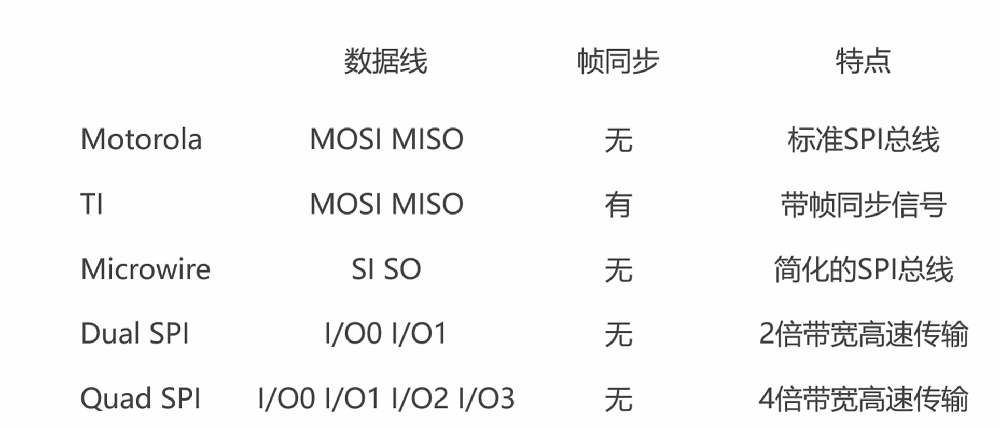
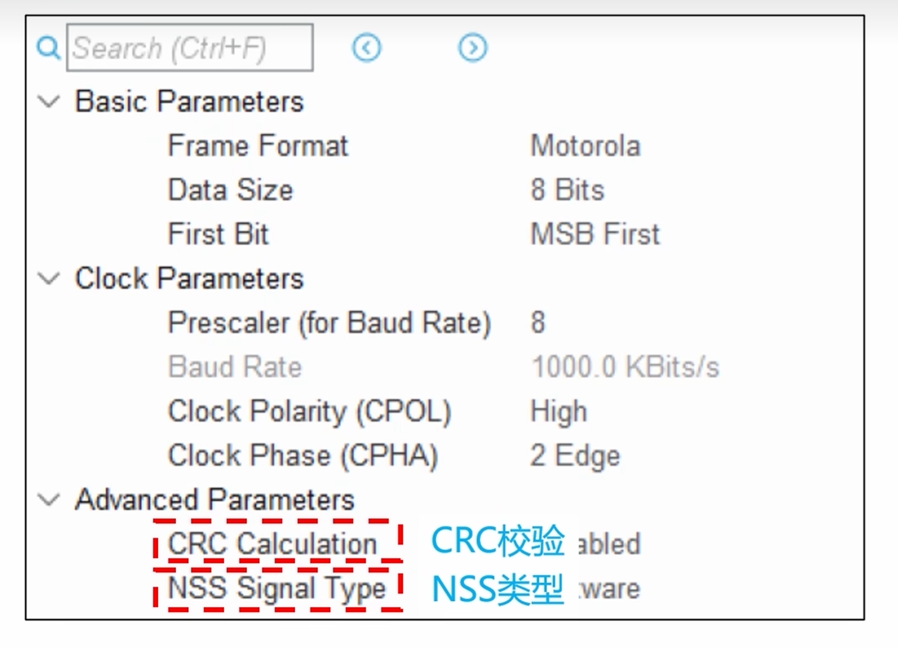
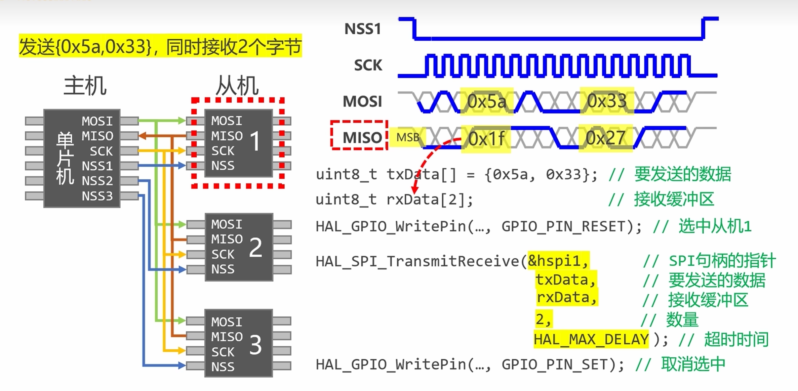

---
tags:
  - STM32
  - HAL库
  - SPI
aliases:
  - Serial Peripheral Interface
  - SPI总线
related:
  - "[[GPIO]]"
  - "[[UART]]"
  - "[[I2C]]"
  - "[[DMA详解]]"
  - "[[时钟系统]]"
  - "[[../../通信/传输层/3.SPI的基础理解]]"
  - "[[HAL库设计思想]]"
---

# SPI（HAL 库）

## 概述

SPI 是 MCU 与高速外设通信的首选接口。HAL 库提供**轮询、中断、DMA** 三种方式，核心 API 是 `HAL_SPI_TransmitReceive`。CS 片选需手动 GPIO 管理，波特率由 APB 总线分频得到。

> [!info] 面试开场句
> "SPI 在 HAL 库中主要是 Transmit/Receive/TransmitReceive 三组 API，CS 片选需要手动 GPIO 控制。SPI1 挂 APB2 最高 42M，SPI2 挂 APB1 最高 21M，实际波特率取决于从机芯片的时钟上限。"

> [!tip] 前置知识
> SPI 协议层原理（四线制、移位寄存器、CPOL/CPHA、全双工）详见 [[../../通信/传输层/3.SPI的基础理解]]

---

## HAL 句柄

```c
SPI_HandleTypeDef hspi1;  // CubeMX 生成
```

| 成员 | 说明 |
|------|------|
| `Instance` | 指向 SPI1/SPI2/SPI3 寄存器基址 |
| `Init` | 初始化参数（模式、方向、数据大小、CPOL/CPHA、分频等） |
| `State` | 当前状态（READY / BUSY / RESET） |
| `ErrorCode` | 最近一次错误码 |

---

## HAL API 速查

### 发送

```c
// 轮询发送 —— 阻塞
HAL_StatusTypeDef HAL_SPI_Transmit(
    SPI_HandleTypeDef *hspi,
    uint8_t *pData,          // 发送数据
    uint16_t Size,           // 数据长度（字节）
    uint32_t Timeout
);

// 中断发送 —— 非阻塞
HAL_StatusTypeDef HAL_SPI_Transmit_IT(
    SPI_HandleTypeDef *hspi,
    uint8_t *pData,
    uint16_t Size
);

// DMA发送 —— 非阻塞，DMA搬运
HAL_StatusTypeDef HAL_SPI_Transmit_DMA(
    SPI_HandleTypeDef *hspi,
    uint8_t *pData,
    uint16_t Size
);
```

### 接收

```c
// 轮询接收 —— 内部自动发 Dummy Byte(0xFF) 产生时钟
HAL_StatusTypeDef HAL_SPI_Receive(
    SPI_HandleTypeDef *hspi,
    uint8_t *pData,          // 接收缓冲区
    uint16_t Size,
    uint32_t Timeout
);

// 中断接收
HAL_StatusTypeDef HAL_SPI_Receive_IT(
    SPI_HandleTypeDef *hspi,
    uint8_t *pData,
    uint16_t Size
);

// DMA接收
HAL_StatusTypeDef HAL_SPI_Receive_DMA(
    SPI_HandleTypeDef *hspi,
    uint8_t *pData,
    uint16_t Size
);
```

### 同时收发（推荐）

```c
// 轮询同时收发
HAL_StatusTypeDef HAL_SPI_TransmitReceive(
    SPI_HandleTypeDef *hspi,
    uint8_t *pTxData,        // 发送数据
    uint8_t *pRxData,        // 接收缓冲区
    uint16_t Size,
    uint32_t Timeout
);

// 中断同时收发
HAL_StatusTypeDef HAL_SPI_TransmitReceive_IT(
    SPI_HandleTypeDef *hspi,
    uint8_t *pTxData,
    uint8_t *pRxData,
    uint16_t Size
);

// DMA同时收发
HAL_StatusTypeDef HAL_SPI_TransmitReceive_DMA(
    SPI_HandleTypeDef *hspi,
    uint8_t *pTxData,
    uint8_t *pRxData,
    uint16_t Size
);
```

> [!important] 三组 API 的关系
> `Receive` 内部就是发 Dummy Byte 的 `TransmitReceive`
> 实际项目中建议直接用 `TransmitReceive`，收发都明确，不依赖内部隐含行为

### 回调函数

```c
void HAL_SPI_TxCpltCallback(SPI_HandleTypeDef *hspi);       // 发送完成
void HAL_SPI_RxCpltCallback(SPI_HandleTypeDef *hspi);       // 接收完成
void HAL_SPI_TxRxCpltCallback(SPI_HandleTypeDef *hspi);     // 收发完成
void HAL_SPI_ErrorCallback(SPI_HandleTypeDef *hspi);        // 错误
```

### 中止传输

```c
HAL_StatusTypeDef HAL_SPI_Abort(SPI_HandleTypeDef *hspi);         // 轮询中止
HAL_StatusTypeDef HAL_SPI_Abort_IT(SPI_HandleTypeDef *hspi);     // 中断中止
```

---

## CS 片选管理

HAL 库的 SPI 函数**不管 CS**，必须手动 GPIO 控制：

```c
// 标准 SPI 操作模板
HAL_GPIO_WritePin(GPIOA, GPIO_PIN_4, GPIO_PIN_RESET);  // CS 拉低，选中
HAL_SPI_Transmit(&hspi1, &data, 1, 100);               // SPI 操作
HAL_GPIO_WritePin(GPIOA, GPIO_PIN_4, GPIO_PIN_SET);    // CS 拉高，释放
```



> [!warning] 为什么 HAL 不管 CS？
> (1) 不同板子 CS 引脚不同，HAL 无法统一管理
> (2) 有些操作需要多次 SPI 调用但 CS 不能松（先发命令再读数据），必须开发者自己控制

### CS 时序规则

CS 下降沿 = 告诉从机"通信开始"，CS 上升沿 = 告诉从机"通信结束，状态机复位"。

**一次逻辑操作必须在一次 CS 低电平期间完成，中间不能松手。**

```c
// W25Q64 Flash 读操作 —— 一次 CS 期间完成全部操作
HAL_GPIO_WritePin(GPIOA, GPIO_PIN_4, GPIO_PIN_RESET);  // CS 拉低

uint8_t cmd[4] = {0x03, 0x00, 0x10, 0x00};  // 读命令 + 24位地址
HAL_SPI_Transmit(&hspi1, cmd, 4, 100);       // 发命令+地址，CS 不能松

uint8_t buf[256];
HAL_SPI_Receive(&hspi1, buf, 256, 100);      // 读数据，CS 还是不能松

HAL_GPIO_WritePin(GPIOA, GPIO_PIN_4, GPIO_PIN_SET);   // 全部完成，CS 拉高
```

```
CS:  ‾\_____________________________________________/‾
SCK:    _|‾|_|‾|_|‾|_|‾|_|‾|_|‾|_|‾|_|‾|_|‾|_|‾|_|‾|
MOSI:   [命令 0x03][  地址24bit  ][ Dummy... Dummy ]
MISO:   [  不管  ][   不管     ][ 数据1 ][ 数据2 ]...
         ←        一次完整事务，中间CS不能松手        →
```

---

## 波特率

### 计算方法

```
SPI 波特率 = APB总线时钟 / 分频系数

SPI1 → APB2 总线（F407 = 84MHz）
SPI2 → APB1 总线（F407 = 42MHz）
SPI3 → APB1 总线（F407 = 42MHz）
```



### 分频表（以 F407 为例）

| 分频系数 | SPI1 (APB2=84M) | SPI2 (APB1=42M) |
|---------|-----------------|-----------------|
| /2 | 42MHz | 21MHz |
| /4 | 21MHz | 10.5MHz |
| /8 | 10.5MHz | 5.25MHz |
| /16 | 5.25MHz | 2.625MHz |
| /32 | 2.625MHz | 1.3125MHz |
| /64 | 1.3125MHz | 656KHz |
| /128 | 656KHz | 328KHz |
| /256 | 328KHz | 164KHz |

> [!warning] SPI1 和 SPI2 速度上限不同
> 同样 /8 分频，SPI1 是 10.5M，SPI2 只有 5.25M。面试常考。

> [!tip] 分频系数的选型依据
> 查从机芯片手册的 SPI 最大时钟频率。W25Q64 最大 104MHz（受限于 STM32 只能给 42M）。MPU6050 SPI 模式最大 1MHz，分频要选大。

---

## SPI 模式配置

CPOL/CPHA 决定时钟形态，主从必须一致：



| CubeMX 配置 | CPOL | CPHA | 空闲电平 | 采样边沿 |
|-------------|------|------|---------|---------|
| Mode 0 | 0 | 0 | 低 | 上升沿 |
| Mode 1 | 0 | 1 | 低 | 下降沿 |
| Mode 2 | 1 | 0 | 高 | 下降沿 |
| Mode 3 | 1 | 1 | 高 | 上升沿 |

> [!important] 拿到 SPI 芯片第一件事
> 翻数据手册找它要求哪种模式，CubeMX 中配成一致。Mode 0 和 Mode 3 最常见。

---

## 数据位宽和传输顺序





| 配置项 | 选项 | 说明 |
|--------|------|------|
| Data Size | 8 Bit / 16 Bit | 大多数设备用 8 Bit |
| First Bit | MSB / LSB | 大多数设备 MSB First |

---

## CubeMX 配置



| 配置项 | 常用值 | 说明 |
|--------|--------|------|
| Mode | Full-Duplex Master | 全双工主机 |
| Data Size | 8 Bits | 大多数设备 |
| First Bit | MSB First | 大多数设备 |
| CPOL | Low / High | 看从机芯片手册 |
| CPHA | 1 Edge / 2 Edge | 看从机芯片手册 |
| Prescaler | 按需 | 波特率 = APB / 分频 |

---

## 实战示例

### W25Q64 Flash 读 ID

```c
uint8_t W25Q64_ReadID(void) {
    uint8_t tx[4] = {0x9F, 0xFF, 0xFF, 0xFF};  // 命令 + 3个Dummy
    uint8_t rx[4] = {0};

    HAL_GPIO_WritePin(GPIOA, GPIO_PIN_4, GPIO_PIN_RESET);
    HAL_SPI_TransmitReceive(&hspi1, tx, rx, 4, 100);
    HAL_GPIO_WritePin(GPIOA, GPIO_PIN_4, GPIO_PIN_SET);

    // rx[1]=Manufacturer, rx[2]=Memory Type, rx[3]=Capacity
    return rx[1];  // 应该返回 0xEF (Winbond)
}
```

### SPI DMA 连续发送（屏幕刷屏）

```c
// 配置 SPI1 TX 为 DMA 模式，Circular
// 一次性发送整帧数据，CPU 完全不管

HAL_GPIO_WritePin(GPIOA, GPIO_PIN_4, GPIO_PIN_RESET);
HAL_SPI_Transmit_DMA(&hspi1, frame_buf, FRAME_SIZE);
// 发完后在回调里拉高 CS

void HAL_SPI_TxCpltCallback(SPI_HandleTypeDef *hspi) {
    if (hspi == &hspi1) {
        HAL_GPIO_WritePin(GPIOA, GPIO_PIN_4, GPIO_PIN_SET);
    }
}
```

> [!tip] SPI + DMA 适用场景
> 大量数据持续传输：SPI 屏幕刷屏、SD 卡读写、Flash 批量操作。偶尔读几个寄存器用轮询就够。

---

## 示例截图



---

## 面试高频问题

> [!example]- Q1：`HAL_SPI_Receive` 内部怎么实现的？为什么要发数据才能读？
> SPI 是移位寄存器环形交换，必须有时钟脉冲才能把从机数据"挤"回来。`HAL_SPI_Receive` 内部自动发 Dummy Byte(0xFF) 产生时钟。本质就是 `TransmitReceive(txData=0xFF)`。

> [!example]- Q2：CS 片选为什么 HAL 不管？怎么管理？
> 不同板子 CS 引脚不同，且有些操作需要多次 SPI 调用但 CS 不能松（先发命令再读数据）。必须手动用 `HAL_GPIO_WritePin` 控制 CS：操作前拉低选中，操作完拉高释放。

> [!example]- Q3：SPI 波特率怎么算？SPI1 和 SPI2 有什么区别？
> 波特率 = APB 总线时钟 / 分频系数。SPI1 挂 APB2（F407=84M），SPI2/SPI3 挂 APB1（F407=42M）。同样 /8 分频，SPI1=10.5M，SPI2=5.25M。

> [!example]- Q4：SPI 和 I2C 怎么选？
> 引脚紧张选 I2C（2 根线），要速度选 SPI（几十 MHz）。Flash、屏幕、SD 卡上 SPI，普通传感器 I2C 够用。

> [!example]- Q5：MISO 引脚能不能省？
> 理论上只写不读的设备（如单向 LED 驱动、只写屏幕）可以省。但大多数 SPI 设备需要回读数据，MISO 不能省。面试答"不可以"更安全。

> [!example]- Q6：一次 SPI 操作中间 CS 能不能松手？
> 不能。CS 拉高 = 从机状态机复位 = 通信结束。先发命令再读数据这种操作必须在一次 CS 低电平期间完成。

---

## 踩坑记录

> [!bug] 实战经验填充区
> （项目开发中遇到的 SPI 相关问题记录于此）
