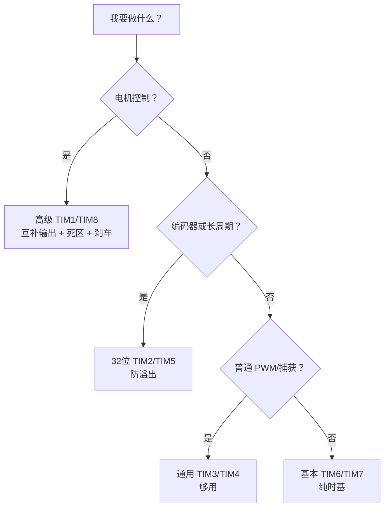
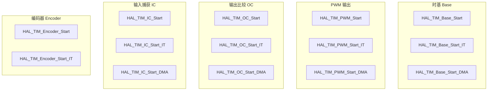
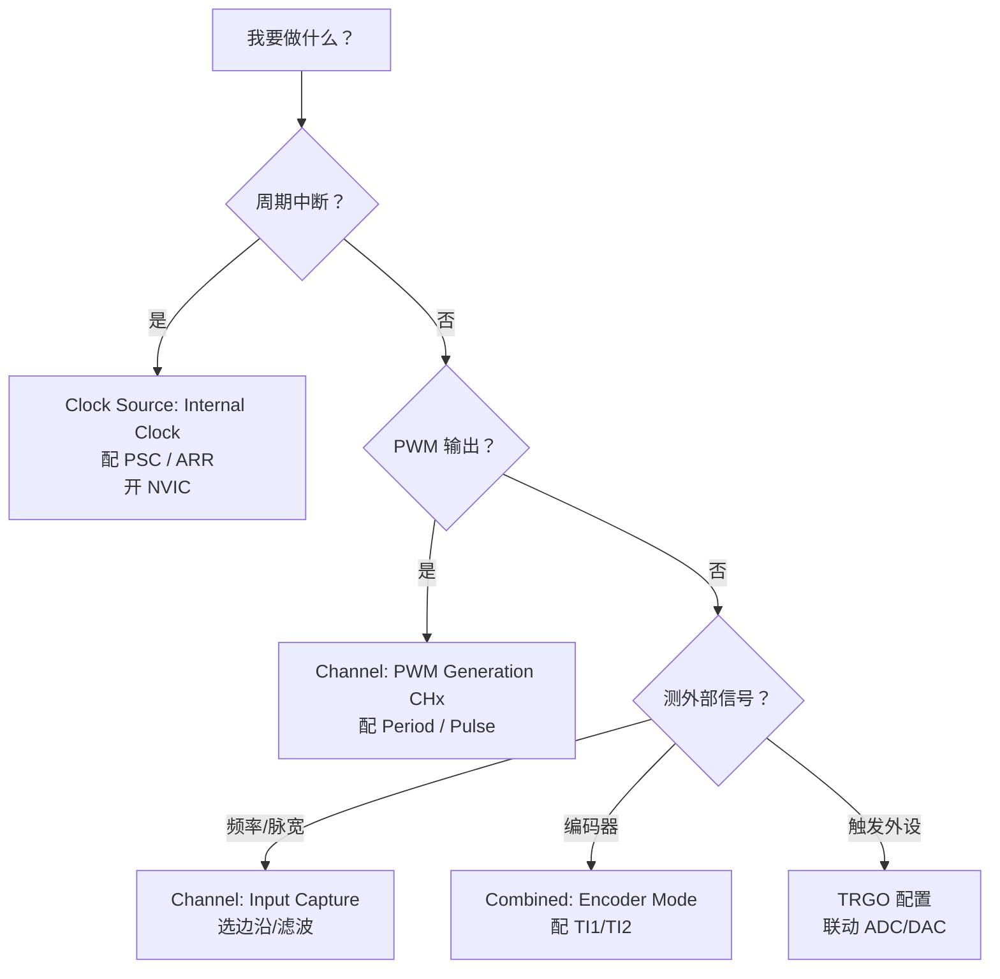
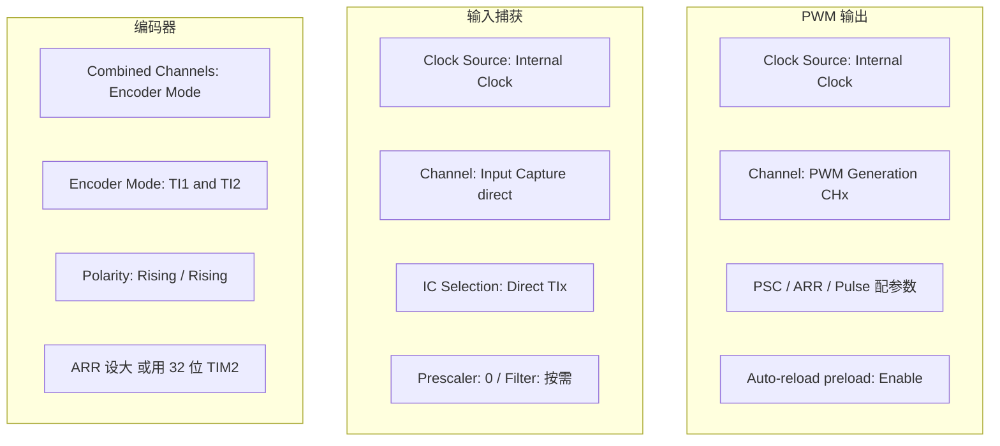
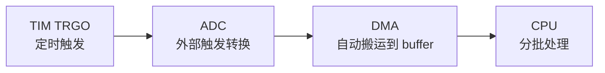

---
aliases:
  - STM32 TIM
  - STM32 定时器
  - TIM HAL
tags:
  - STM32
  - HAL库
  - 定时器
  - PWM
  - 编码器
  - 嵌入式
related:
  - "[[TIM定时器基础概念]]"
  - "[[时钟系统]]"
  - "[[中断(NVIC)]]"
  - "[[GPIO]]"
  - "[[DMA详解]]"
  - "[[HAL库设计思想]]"
---

# TIM 定时器（HAL 库）

## 概述

STM32 定时器 HAL 库 API 按功能分五组：**Base（时基）、PWM（输出比较）、IC（输入捕获）、OC（输出比较）、Encoder（编码器）**。每组都有 `Start / Start_IT / Start_DMA` 三种方式。核心宏是 `__HAL_TIM_SET_COMPARE` 改占空比，`__HAL_TIM_GET_COUNTER` 读编码器值。

> [!info] 面试开场句
> "HAL 库定时器 API 按功能分组，PWM 用 `PWM_Start`，输入捕获用 `IC_Start_IT`，编码器用 `Encoder_Start`。启动中断前要清 Update Flag 防止假中断，动态改参数要开预装载防毛刺。"

> [!tip] 前置知识
> 定时器通用原理（时基、输出比较、输入捕获、从模式、编码器）详见 [[TIM定时器基础概念]]

---

## STM32 TIM 选型

| 类型 | 代表 | 位宽 | 总线 | 核心能力 | 典型场景 |
|------|------|------|------|---------|---------|
| 高级定时器 | TIM1, TIM8 | 16位 | APB2 | 互补输出、死区、刹车、RCR | 电机控制、半桥驱动 |
| 32位通用定时器 | TIM2, TIM5 | **32位** | APB1 | PWM、IC、编码器 | 编码器测速、长周期测量 |
| 16位通用定时器 | TIM3, TIM4 | 16位 | APB1 | PWM、IC、编码器 | 日常 PWM、按键消抖 |
| 基本定时器 | TIM6, TIM7 | 16位 | APB1 | 纯时基 + DAC 触发 | 周期中断、RTOS 时基 |



> [!warning] 系列差异
> F1/F4/G4/H7 定时器数量、位宽、总线归属、通道能力都可能不同，以 Reference Manual 为准。

---

## HAL API 速查

### API 全景



### 时基（周期中断）

```c
// 启动纯计数（不中断）
HAL_TIM_Base_Start(&htim3);

// 启动 + 开启更新中断
HAL_TIM_Base_Start_IT(&htim3);

// 启动 + DMA
HAL_TIM_Base_Start_DMA(&htim3, (uint32_t *)buf, len);

// 停止
HAL_TIM_Base_Stop_IT(&htim3);
```

```c
// 回调：所有定时器溢出都进这里
void HAL_TIM_PeriodElapsedCallback(TIM_HandleTypeDef *htim) {
    if (htim->Instance == TIM3) {
        // TIM3 溢出处理
    }
}
```

### PWM 输出

```c
// 启动 PWM（指定通道）
HAL_TIM_PWM_Start(&htim3, TIM_CHANNEL_1);

// 启动 PWM + 中断
HAL_TIM_PWM_Start_IT(&htim3, TIM_CHANNEL_1);

// 启动 PWM + DMA
HAL_TIM_PWM_Start_DMA(&htim3, TIM_CHANNEL_1, (uint32_t *)buf, len);

// 停止
HAL_TIM_PWM_Stop(&htim3, TIM_CHANNEL_1);
```

```c
// 运行中修改占空比
__HAL_TIM_SET_COMPARE(&htim3, TIM_CHANNEL_1, 300);  // 改 CCR
// 或直接写寄存器
TIM3->CCR1 = 300;
```

```c
// 回调：PWM 脉冲完成
void HAL_TIM_PWM_PulseFinishedCallback(TIM_HandleTypeDef *htim) {
    if (htim->Instance == TIM3) {
        // 更新下一个周期的占空比
    }
}
```

### 输出比较（OC Toggle 等）

```c
// 启动输出比较
HAL_TIM_OC_Start(&htim3, TIM_CHANNEL_1);
HAL_TIM_OC_Start_IT(&htim3, TIM_CHANNEL_1);
HAL_TIM_OC_Start_DMA(&htim3, TIM_CHANNEL_1, (uint32_t *)buf, len);

// 停止
HAL_TIM_OC_Stop(&htim3, TIM_CHANNEL_1);
```

```c
// 回调
void HAL_TIM_OC_DelayElapsedCallback(TIM_HandleTypeDef *htim) {
    if (htim->Instance == TIM3) {
        // 比较事件触发
    }
}
```

### 输入捕获

```c
// 启动输入捕获
HAL_TIM_IC_Start(&htim3, TIM_CHANNEL_1);           // 轮询
HAL_TIM_IC_Start_IT(&htim3, TIM_CHANNEL_1);         // 中断
HAL_TIM_IC_Start_DMA(&htim3, TIM_CHANNEL_1, buf, len); // DMA

// 停止
HAL_TIM_IC_Stop_IT(&htim3, TIM_CHANNEL_1);
```

```c
// 读取捕获值
uint32_t value = __HAL_TIM_GET_COMPARE(&htim3, TIM_CHANNEL_1);
// 或
uint32_t value = HAL_TIM_ReadCapturedValue(htim, TIM_CHANNEL_1);
```

```c
// 回调：边沿触发时进这里
void HAL_TIM_IC_CaptureCallback(TIM_HandleTypeDef *htim) {
    if (htim->Instance == TIM3) {
        if (htim->Channel == HAL_TIM_ACTIVE_CHANNEL_1) {
            uint32_t value = HAL_TIM_ReadCapturedValue(htim, TIM_CHANNEL_1);
            // 处理捕获值
        }
    }
}
```

### 编码器

```c
// 启动编码器
HAL_TIM_Encoder_Start(&htim2, TIM_CHANNEL_ALL);        // 轮询
HAL_TIM_Encoder_Start_IT(&htim2, TIM_CHANNEL_ALL);     // 中断

// 停止
HAL_TIM_Encoder_Stop(&htim2, TIM_CHANNEL_ALL);
```

```c
// 读取 CNT
uint32_t count = __HAL_TIM_GET_COUNTER(&htim2);

// 测速：固定间隔读差值
static uint32_t last_count = 0;
uint32_t current = __HAL_TIM_GET_COUNTER(&htim2);
int32_t delta = (int32_t)(current - last_count);
last_count = current;
// delta = 时间间隔内的脉冲变化量，正转正，反转负
```

### 常用宏速查

```c
// 设置比较值（改占空比）
__HAL_TIM_SET_COMPARE(&htim, TIM_CHANNEL_1, value);

// 获取比较值
__HAL_TIM_GET_COMPARE(&htim, TIM_CHANNEL_1);

// 设置/获取计数器
__HAL_TIM_SET_COUNTER(&htim, 0);
__HAL_TIM_GET_COUNTER(&htim);

// 设置自动重装载值（改频率）
__HAL_TIM_SET_AUTORELOAD(&htim, value);
__HAL_TIM_GET_AUTORELOAD(&htim);

// 设置/获取预分频器
__HAL_TIM_SET_PRESCALER(&htim, value);
__HAL_TIM_GET_PRESCALER(&htim);

// 清/读中断标志位
__HAL_TIM_CLEAR_FLAG(&htim, TIM_FLAG_UPDATE);
__HAL_TIM_GET_FLAG(&htim, TIM_FLAG_UPDATE);
__HAL_TIM_CLEAR_FLAG(&htim, TIM_FLAG_CC1);
```

---

## CubeMX 配置

### 配置决策



### 时基参数

| CubeMX 字段 | 寄存器 | 说明 |
|-------------|--------|------|
| Prescaler | PSC | 实际分频 = PSC + 1 |
| Counter Period | ARR | 实际周期 = ARR + 1 |
| Counter Mode | DIR/CMS | 向上/向下/中心对齐 |
| Auto-reload preload | ARPE | 动态改参数时建议 Enable |
| Repetition Counter | RCR | 高级定时器，N+1 次溢出才 Update |

$$f_{update} = \frac{f_{timer}}{(PSC + 1) \times (ARR + 1)}$$

> [!danger] APB 定时器倍频
> APB 分频系数 > 1 时，定时器时钟自动 ×2。看 CubeMX `APBx Timer clocks`，不要直接拿总线频率算。

### 各模式配置要点




---

## 实战示例

### 1ms 周期中断

```text
f_timer = 84MHz, 目标 1ms

PSC = 83   → 84MHz / 84 = 1MHz（每格 1us）
ARR = 999  → 1000us = 1ms 溢出一次
```

```c
// 启动前清标志位，防止假中断
__HAL_TIM_CLEAR_FLAG(&htim3, TIM_FLAG_UPDATE);
HAL_TIM_Base_Start_IT(&htim3);

void HAL_TIM_PeriodElapsedCallback(TIM_HandleTypeDef *htim) {
    if (htim->Instance == TIM3) {
        static uint8_t cnt = 0;
        if (++cnt >= 10) {
            HAL_GPIO_TogglePin(LED_GPIO_Port, LED_Pin);
            cnt = 0;
        }
    }
}
```

### PWM 呼吸灯

```text
f_timer = 84MHz, 目标 1KHz PWM

PSC = 83   → 1MHz
ARR = 999  → 1KHz
CCR = 0~999 → 占空比 0%~100%
```

```c
HAL_TIM_PWM_Start(&htim3, TIM_CHANNEL_1);

uint16_t ccr = 0;
uint8_t dir = 0;

while (1) {
    __HAL_TIM_SET_COMPARE(&htim3, TIM_CHANNEL_1, ccr);
    if (dir == 0) {
        ccr++;
        if (ccr >= 999) dir = 1;
    } else {
        ccr--;
        if (ccr <= 0) dir = 0;
    }
    HAL_Delay(1);
}
```

### 输入捕获测频率

```c
HAL_TIM_IC_Start_IT(&htim2, TIM_CHANNEL_1);

volatile uint32_t last_value = 0;
volatile uint32_t frequency = 0;

void HAL_TIM_IC_CaptureCallback(TIM_HandleTypeDef *htim) {
    if (htim->Instance == TIM2) {
        if (htim->Channel == HAL_TIM_ACTIVE_CHANNEL_1) {
            uint32_t value = HAL_TIM_ReadCapturedValue(htim, TIM_CHANNEL_1);
            if (last_value != 0 && value > last_value) {
                uint32_t delta = value - last_value;
                frequency = 1000000 / delta;  // PSC=83 → 1MHz 计数时钟
            }
            last_value = value;
        }
    }
}
```

### 编码器测速

```c
// 初始化
HAL_TIM_Encoder_Start(&htim2, TIM_CHANNEL_ALL);
__HAL_TIM_SET_COUNTER(&htim2, 0);

// 在另一个定时器的 10ms 中断里读
void HAL_TIM_PeriodElapsedCallback(TIM_HandleTypeDef *htim) {
    if (htim->Instance == TIM4) {
        static uint32_t last = 0;
        uint32_t current = __HAL_TIM_GET_COUNTER(&htim2);
        int32_t speed = (int32_t)(current - last);
        last = current;
        // speed = 10ms 内脉冲变化量
        // 正数正转，负数反转
        // 转速 = speed / (10ms * 编码器线数 * 4)
    }
}
```

### TIM 触发 ADC + DMA



```c
// CubeMX 配置：TIMx TRGO = Update Event
// ADC External Trigger = TIMx_TRGO
// ADC DMA = Circular

HAL_ADC_Start_DMA(&hadc1, (uint32_t *)adc_buf, BUF_SIZE);
HAL_TIM_Base_Start(&htim3);
// TIM3 每次溢出 → 触发 ADC → DMA 自动搬 → CPU 读 buffer
```

---

## 回调函数速查

| 回调 | 触发条件 | 用途 |
|------|---------|------|
| `HAL_TIM_PeriodElapsedCallback` | CNT 溢出（Update） | 周期中断处理 |
| `HAL_TIM_IC_CaptureCallback` | 输入捕获边沿 | 测频率/脉宽 |
| `HAL_TIM_PWM_PulseFinishedCallback` | PWM 脉冲完成 | 更新占空比 |
| `HAL_TIM_OC_DelayElapsedCallback` | 输出比较匹配 | Toggle 等模式 |
| `HAL_TIM_ErrorCallback` | 定时器错误 | 错误处理 |

> [!warning] 回调中判断定时器和通道
> ```c
> void HAL_TIM_PeriodElapsedCallback(TIM_HandleTypeDef *htim) {
>     if (htim->Instance == TIM3) {  // 先判断是哪个定时器
>         // ...
>     }
> }
> 
> void HAL_TIM_IC_CaptureCallback(TIM_HandleTypeDef *htim) {
>     if (htim->Instance == TIM2) {
>         if (htim->Channel == HAL_TIM_ACTIVE_CHANNEL_1) {  // 再判断通道
>             // ...
>         }
>     }
> }
> ```

---

## 工程踩坑

| 现象 | 原因 | 解决 |
|------|------|------|
| 频率算不对 | 忘了 APB 定时器时钟 ×2 | 看 CubeMX `APBx Timer clocks` |
| 启动后立刻进中断 | 初始化时 UIF 已置位 | Start_IT 前清 `TIM_FLAG_UPDATE` |
| 动态改 ARR 波形异常 | 未开预装载 | 开 `Auto-reload preload` |
| ISR 卡死 | 中断里调 HAL_Delay/printf | ISR 只做最少的操作 |
| 编码器速度跳变 | 16位回绕/毛刺 | 用 32位 TIM2 + 输入滤波 + 固定周期读取 |
| PWM 引脚没波形 | GPIO 没配 AF 或没调 Start | 检查 AF + `HAL_TIM_PWM_Start` |
| 输入捕获差值为负 | CNT 溢出回绕 | 用 32 位定时器或处理溢出计数 |

---

## 配置检查清单

- [ ] CubeMX `APBx Timer clocks` 确认真实频率
- [ ] PSC、ARR 用 +1 公式复核
- [ ] PWM 通道 GPIO 是 Alternate Function
- [ ] 需要中断 → NVIC 使能 + 回调实现
- [ ] 需要 DMA → DMA 请求 + 缓冲区配置
- [ ] 动态改参数 → 开预装载
- [ ] 编码器 → A/B 相引脚 + 极性 + 滤波 + 32位防溢出
- [ ] Start_IT 前清 Update Flag

---

## 面试高频问题

> [!example]- Q1：HAL 库定时器 API 怎么分组？
> 按功能分 Base/PWM/OC/IC/Encoder 五组，每组有 Start/Start_IT/Start_DMA。PWM 用 PWM_Start，输入捕获用 IC_Start_IT，编码器用 Encoder_Start。

> [!example]- Q2：PWM 怎么改占空比？改频率呢？
> 改占空比：`__HAL_TIM_SET_COMPARE(&htim, CH, value)` 改 CCR。改频率：`__HAL_TIM_SET_AUTORELOAD(&htim, value)` 改 ARR。注意开预装载防毛刺。

> [!example]- Q3：启动定时器中断前为什么要清标志位？
> CubeMX 初始化时通过置位 UG 更新寄存器，导致 UIF 已置位。不清就调 Start_IT 会立刻触发一次假中断。

> [!example]- Q4：编码器模式怎么测速？
> `HAL_TIM_Encoder_Start` 启动后，固定时间间隔读 `__HAL_TIM_GET_COUNTER` 的差值。正数正转，负数反转。推荐用 32 位 TIM2 防溢出。

> [!example]- Q5：输入捕获怎么测频率？
> `HAL_TIM_IC_Start_IT` 启动，边沿触发进 `HAL_TIM_IC_CaptureCallback`，读两次 CCR 的差值除以计数时钟频率得到周期，取倒数得频率。

> [!example]- Q6：TIM 触发 ADC 有什么好处？
> 硬件定时触发 → 采样间隔精确稳定 → ADC 完成 DMA 自动搬运 → CPU 只处理结果。全程零 CPU 参与采样过程，适合高频采样和电机控制。

> [!example]- Q7：PWM 输出为什么不涉及从模式？
> PWM 是内部时钟驱动 CNT 自己跑，没有外部信号控制 CNT 归零/启停。时钟源决定计数速度，从模式是外部信号控制 CNT 行为，两回事。详见 [[TIM定时器基础概念#8. 主从触发：定时器不只通知 CPU]]。

---

## API 截图


---

## 知识延伸

- [[TIM定时器基础概念]] — 定时器通用原理
- [[时钟系统]] — APB 倍频与定时器时钟
- [[中断(NVIC)]] — 定时器中断与优先级
- [[DMA详解]] — DMA 搬运与 Circular 模式
- [[GPIO]] — PWM 引脚的 AF 复用配置
