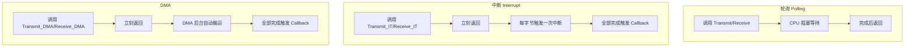
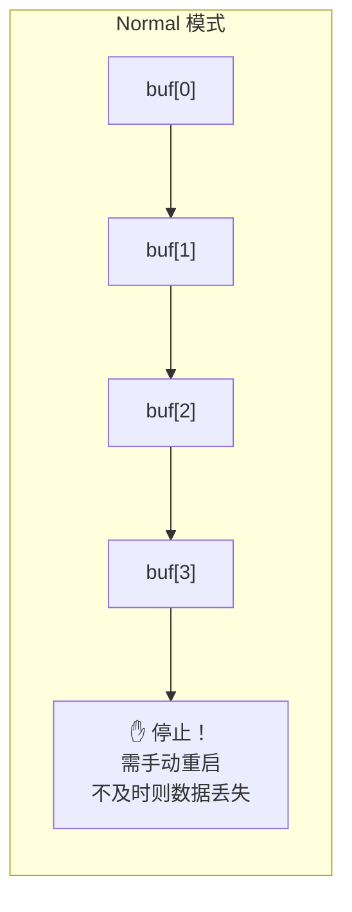
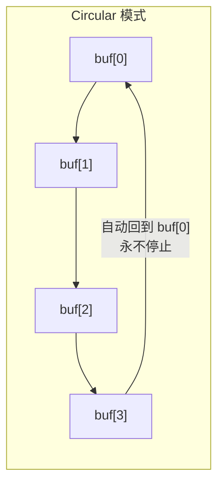
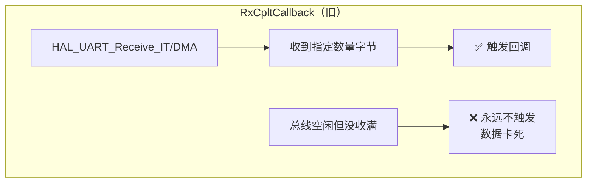
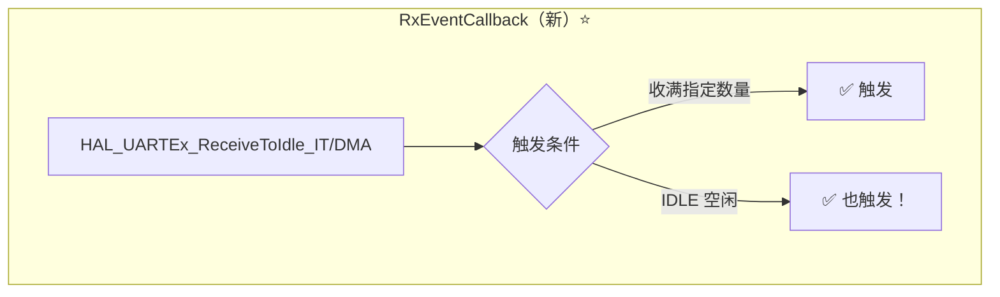
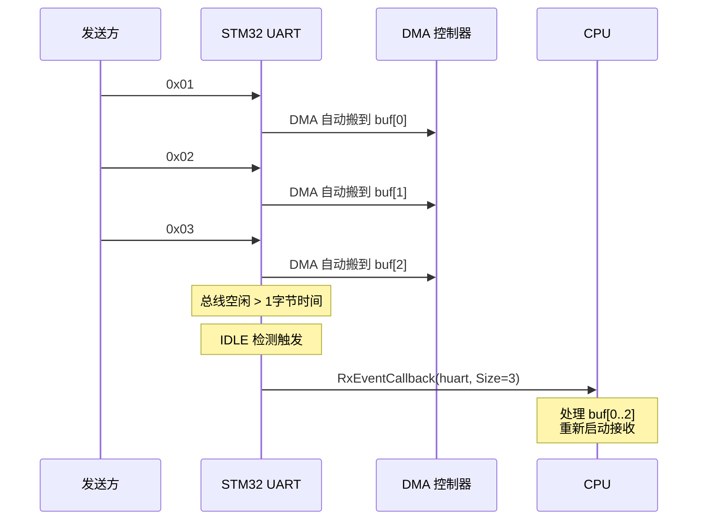
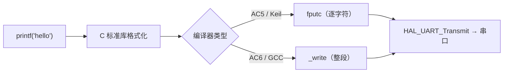
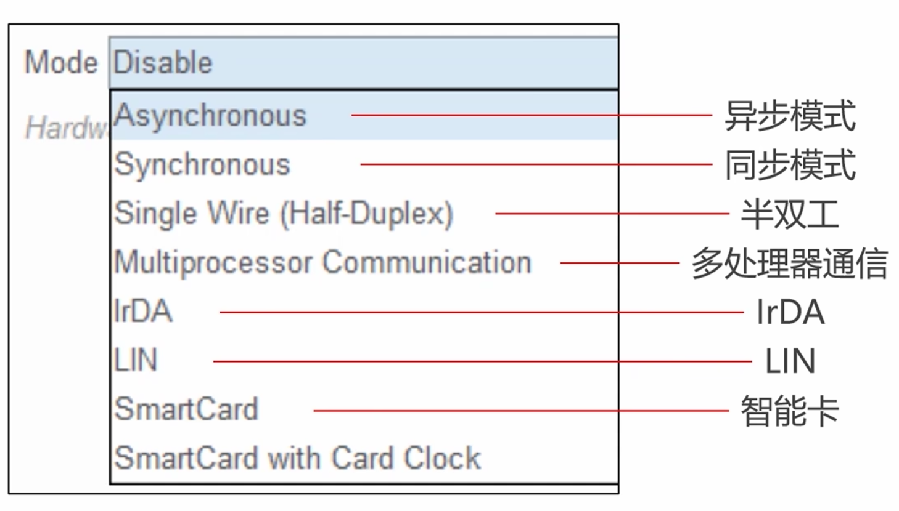

---
tags:
  - STM32
  - HAL库
  - UART
  - 嵌入式
aliases:
  - Universal Async Receiver Transmitter
  - 通用异步收发器
related:
  - "[[GPIO]]"
  - "[[DMA详解]]"
  - "[[外部中断EXTI]]"
  - "[[时钟树详解]]"
  - "[[HAL库设计思想]]"
  - "[[../../通信/传输层/1. UART的基础理解]]"
  - "[[../../../工程实践/STM-F103/铁头山羊-平衡小车/Lib/I2C]]"
---

# UART（HAL 库）

## 概述

UART 是 MCU 最常用的调试和外设通信接口。HAL 库封装了**轮询、中断、DMA** 三种收发方式，实际项目中首选 **DMA + IDLE 空闲中断**实现不定长接收。

> [!info] 面试开场句
> "UART 在 HAL 库中有轮询、中断、DMA 三种收发方式。实际项目用 DMA+IDLE 实现不定长接收，HAL 库提供了 `HAL_UARTEx_ReceiveToIdle_DMA` 封装了这个机制，回调里直接拿实际接收长度。"

> [!tip] 前置知识
> UART 协议层原理（波特率、帧结构、过采样、物理层 TTL/RS232/RS485）详见 [[../../通信/传输层/1. UART的基础理解]]

---

## HAL 句柄

HAL 库用 `UART_HandleTypeDef` 结构体管理 UART 外设的所有状态：

```c
UART_HandleTypeDef huart1;  // CubeMX 生成，全局变量
```

句柄里包含的内容：

| 成员 | 说明 |
|------|------|
| `Instance` | 指向 USART1/USART2 等寄存器基址 |
| `Init` | 初始化参数（波特率、数据位、校验位、停止位） |
| `pTxBuffPtr` / `pRxBuffPtr` | 当前发送/接收缓冲区指针 |
| `TxXferCount` / `RxXferCount` | 剩余待发送/接收的字节数 |
| `hdmatx` / `hdmarx` | 关联的 DMA 句柄 |

---

## HAL API 速查

### 初始化

```c
// CubeMX 自动生成，一般不需要手动调用
HAL_UART_Init(UART_HandleTypeDef *huart);
HAL_UART_DeInit(UART_HandleTypeDef *huart);
```

### 发送（Transmit）

```c
// 轮询发送 —— 阻塞，死等发完
HAL_StatusTypeDef HAL_UART_Transmit(
    UART_HandleTypeDef *huart,     // 哪个串口
    uint8_t *pData,                // 发送数据指针
    uint16_t Size,                 // 数据长度
    uint32_t Timeout               // 超时时间（ms），HAL_MAX_DELAY = 永久等待
);

// 中断发送 —— 非阻塞，后台逐字节发送
HAL_StatusTypeDef HAL_UART_Transmit_IT(
    UART_HandleTypeDef *huart,
    uint8_t *pData,
    uint16_t Size                  // 无 Timeout，立刻返回
);

// DMA发送 —— 非阻塞，DMA自动搬运
HAL_StatusTypeDef HAL_UART_Transmit_DMA(
    UART_HandleTypeDef *huart,
    uint8_t *pData,
    uint16_t Size
);
```

### 接收（Receive）

```c
// 轮询接收 —— 阻塞，死等收满指定字节数
HAL_StatusTypeDef HAL_UART_Receive(
    UART_HandleTypeDef *huart,
    uint8_t *pData,
    uint16_t Size,
    uint32_t Timeout
);

// 中断接收 —— 非阻塞，收满Size个字节触发回调
HAL_StatusTypeDef HAL_UART_Receive_IT(
    UART_HandleTypeDef *huart,
    uint8_t *pData,
    uint16_t Size
);

// DMA接收 —— 非阻塞，DMA自动搬到内存
HAL_StatusTypeDef HAL_UART_Receive_DMA(
    UART_HandleTypeDef *huart,
    uint8_t *pData,
    uint16_t Size
);
```

### 扩展接收（ReceiveToIdle）⭐

```c
// 中断方式 + IDLE检测（收满 或 空闲都触发回调）
HAL_StatusTypeDef HAL_UARTEx_ReceiveToIdle_IT(
    UART_HandleTypeDef *huart,
    uint8_t *pData,
    uint16_t Size
);

// DMA方式 + IDLE检测（推荐⭐）
HAL_StatusTypeDef HAL_UARTEx_ReceiveToIdle_DMA(
    UART_HandleTypeDef *huart,
    uint8_t *pData,
    uint16_t Size
);
```

> [!important] 核心区别
> `HAL_UART_Receive_DMA` → 只在收满 `Size` 字节时触发回调
> `HAL_UARTEx_ReceiveToIdle_DMA` → 收满 **或** 总线空闲时都触发回调，且回调返回实际接收长度

### 回调函数

```c
// 发送完成回调
void HAL_UART_TxCpltCallback(UART_HandleTypeDef *huart);

// 接收完成回调（旧，只在收满指定数量时触发）
void HAL_UART_RxCpltCallback(UART_HandleTypeDef *huart);

// 接收事件回调（新，收满或IDLE都触发，推荐⭐）
void HAL_UARTEx_RxEventCallback(UART_HandleTypeDef *huart, uint16_t Size);
// Size 参数 = 实际收到的字节数

// 错误回调
void HAL_UART_ErrorCallback(UART_HandleTypeDef *huart);
```

### 中止传输

```c
// 中止发送
HAL_UART_AbortTransmit(UART_HandleTypeDef *huart);     // 轮询方式中止
HAL_UART_AbortTransmit_IT(UART_HandleTypeDef *huart);  // 中断方式中止

// 中止接收
HAL_UART_AbortReceive(UART_HandleTypeDef *huart);
HAL_UART_AbortReceive_IT(UART_HandleTypeDef *huart);

// 全部中止（发送+接收）
HAL_UART_Abort(UART_HandleTypeDef *huart);
HAL_UART_Abort_IT(UART_HandleTypeDef *huart);
```

### 状态查询

```c
// 获取 UART 状态
HAL_UART_StateTypeDef HAL_UART_GetState(UART_HandleTypeDef *huart);

// 获取最近一次错误码
uint32_t HAL_UART_GetError(UART_HandleTypeDef *huart);

// 判断 UART 是否忙（发送或接收中）
// 返回 HAL_BUSY / HAL_OK
```

---

## 三种收发方式对比



| 方式 | CPU 占用 | 每字节中断 | 适用场景 |
|------|---------|-----------|---------|
| 轮询 | **最高**（死等） | 无 | 调试用，基本不用 |
| 中断 | 中 | **1 次** | 低波特率、少量数据 |
| DMA | **最低** | 0 次（收满/IDLE 才通知） | **实际项目首选** |

---

## DMA 两种模式

UART 接收搭配 [[DMA详解|DMA]] 时，有两种模式：

### Normal vs Circular





| 对比 | Normal | Circular |
|------|--------|----------|
| 传完行为 | 停止，需手动重启 | **自动循环继续** |
| 适用场景 | 一次性发送 | **持续接收（串口）** |
| 漏数据风险 | 重启间隙可能丢数据 | 不会停，更安全 |

> [!tip] 串口接收选 Circular，串口发送选 Normal

### NDTR 寄存器

DMA 内部有个计数器 NDTR（或 CNDTR），表示**还剩多少字节没搬**：

```c
// 计算已接收字节数
uint16_t recv_len = BUF_SIZE - __HAL_DMA_GET_COUNTER(&hdma_usart1_rx);
//               总缓冲区大小        剩余未搬的字节数
```

---

## RxCpltCallback vs RxEventCallback

这是面试高频对比：





| 对比 | `RxCpltCallback` | `RxEventCallback` |
|------|-------------------|---------------------|
| 触发条件 | 只在收满指定字节数 | 收满 **或** IDLE |
| 不定长数据 | ❌ 收不满卡死 | ✅ IDLE 触发 |
| 返回长度 | 固定，就是指定的 | `Size` 参数返回**实际长度** |
| 配套函数 | `HAL_UART_Receive_IT/DMA` | `HAL_UARTEx_ReceiveToIdle_IT/DMA` |

---

## 不定长接收方案演进

### 方案一：手动 IDLE + DMA（旧写法）

```c
// 手动开启 IDLE 中断
__HAL_UART_ENABLE_IT(&huart1, UART_IT_IDLE);
HAL_UART_Receive_DMA(&huart1, buf, BUF_SIZE);

// 在 USARTx_IRQHandler 中手动处理
void USART1_IRQHandler(void) {
    if (__HAL_UART_GET_FLAG(&huart1, UART_FLAG_IDLE)) {
        __HAL_UART_CLEAR_IDLEFLAG(&huart1);
        uint16_t recv_len = BUF_SIZE - __HAL_DMA_GET_COUNTER(&hdma_usart1_rx);
        // 处理数据...
        HAL_UART_Receive_DMA(&huart1, buf, BUF_SIZE);
    }
    HAL_UART_IRQHandler(&huart1);
}
```

### 方案二：RxEventCallback（推荐⭐）

```c
// 一行启动，内部自动开 IDLE
HAL_UARTEx_ReceiveToIdle_DMA(&huart1, buf, BUF_SIZE);
// 关闭 DMA 半传输中断（可选，防止收一半也触发回调）
__HAL_DMA_DISABLE_IT(&hdma_usart1_rx, DMA_IT_HT);

// 回调
void HAL_UARTEx_RxEventCallback(UART_HandleTypeDef *huart, uint16_t Size) {
    if (huart == &huart1) {
        // Size 就是实际收到的字节数
        // 处理 buf[0..Size-1]...
        // 重新启动
        HAL_UARTEx_ReceiveToIdle_DMA(&huart1, buf, BUF_SIZE);
        __HAL_DMA_DISABLE_IT(&hdma_usart1_rx, DMA_IT_HT);
    }
}
```



> [!warning] DMA 半传输中断（HT）
> Circular 模式下，DMA 搬到一半也会触发一次中断。如果不需要，用 `__HAL_DMA_DISABLE_IT` 关掉，否则数据没收完就进回调。

---

## printf 重定向

将 `printf` 输出重定向到串口，PC 端串口助手即可查看打印。

### 原理



### Keil（ARM Compiler 5）

```c
#include <stdio.h>

int fputc(int ch, FILE *f) {
    HAL_UART_Transmit(&huart1, (uint8_t *)&ch, 1, HAL_MAX_DELAY);
    return ch;
}
```

> 需在 Keil 选项中勾选 **Use MicroLib**（Target → Use MicroLib）

### GCC / ARM Compiler 6

```c
#include <stdio.h>

int _write(int file, char *ptr, int len) {
    HAL_UART_Transmit(&huart1, (uint8_t *)ptr, len, HAL_MAX_DELAY);
    return len;
}
```

> [!tip] 两个都写上不冲突，兼容 AC5/AC6/GCC 所有编译器。

---

## CubeMX 配置



| 配置项 | 常用值 | 说明 |
|--------|--------|------|
| Baud Rate | 115200 | 波特率，双方必须一致 |
| Word Length | 8 Bits | 数据位长度 |
| Parity | None | 校验位，常用 None |
| Stop Bits | 1 | 停止位 |
| DMA RX Mode | Circular | 接收用循环模式 |
| DMA TX Mode | Normal | 发送用正常模式 |

---

## 面试高频问题

> [!example]- Q1：UART 的三种收发方式？项目里用哪种？
> 轮询（阻塞）、中断（非阻塞逐字节）、DMA（非阻塞批量搬运）。项目用 **DMA + IDLE 空闲中断**，CPU 占用最低，且支持不定长数据接收。

> [!example]- Q2：DMA 的 Normal 和 Circular 模式区别？串口接收用哪个？
> Normal 搬满停止需手动重启；Circular 自动循环继续。串口接收用 **Circular**，因为数据持续不断，Normal 重启间隙可能丢数据。

> [!example]- Q3：怎么实现 UART 不定长数据接收？
> 两种方案：(1) 手动开 IDLE 中断 + 读 NDTR 算长度；(2) 用 `HAL_UARTEx_ReceiveToIdle_DMA`，ST 已封装好，回调里直接拿 `Size` 参数。

> [!example]- Q4：`RxCpltCallback` 和 `RxEventCallback` 的区别？
> `RxCpltCallback` 只在收满指定字节数时触发，收不满就卡死。`RxEventCallback` 收满 **或** 总线 IDLE 空闲时都触发，且回调返回实际接收长度，适合不定长数据。

> [!example]- Q5：printf 怎么重定向到串口？
> 重写底层输出函数。AC5/Keil 重写 `fputc`，AC6/GCC 重写 `_write`，函数内调用 `HAL_UART_Transmit` 发送字符。Keir 还需勾选 Use MicroLib。

> [!example]- Q6：BSRR 和 ODR 的区别？UART 和这个有关系吗？
> UART TX 引脚配置为**复用推挽**，由 UART 外设控制引脚电平，不直接操作 GPIO 寄存器。但理解 BSRR 的原子操作原理有助于理解 HAL 库底层设计。详见 [[GPIO#BSRR vs ODR — 为什么用 BSRR]]。

---

## 踩坑记录

> [!bug] 实战经验填充区
> （项目开发中遇到的 UART 相关问题记录于此）
