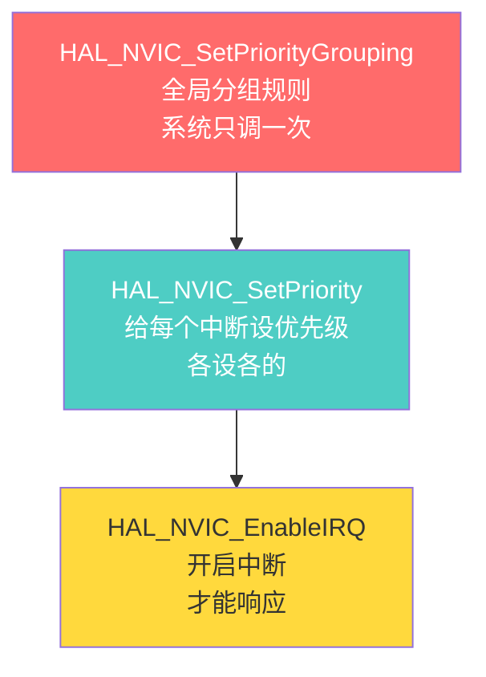
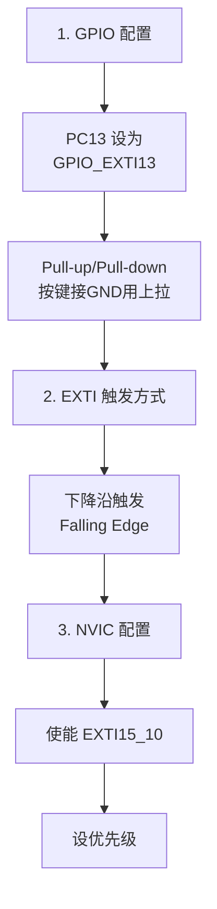
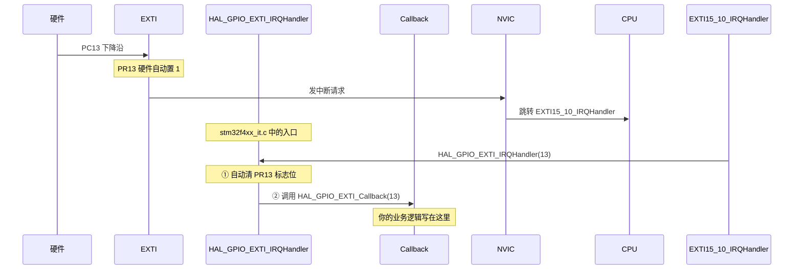
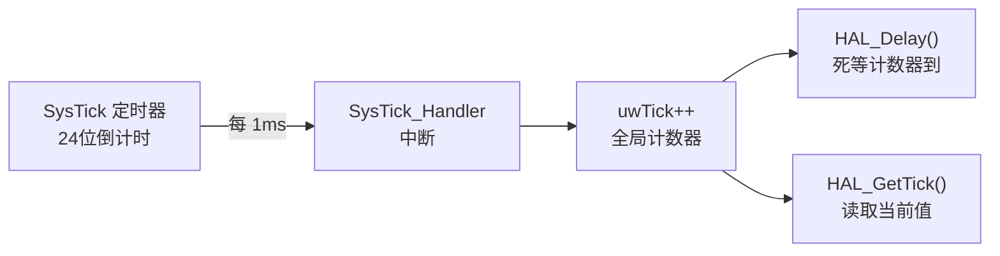
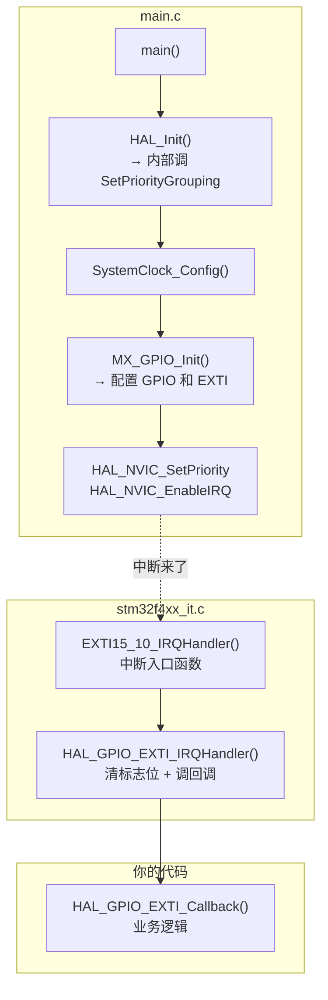

---
tags:
  - STM32
  - HAL库
  - NVIC
  - EXTI
  - 中断
  - 嵌入式
aliases:
  - Nested Vectored Interrupt Controller
  - 外部中断
  - 中断配置
module: 中断(NVIC)
related:
  - "[[中断的基础理解]]"
  - "[[GPIO]]"
  - "[[UART]]"
  - "[[I2C]]"
  - "[[SPI]]"
  - "[[时钟系统]]"
  - "[[HAL库设计思想]]"
---

# 中断 NVIC（HAL 库）

## 概述

HAL 库的中断配置分三步：**GPIO 设为 EXTI 模式 → NVIC 设优先级并使能 → 在回调函数中写业务逻辑**。EXTI 标志位由 HAL 自动清理，SysTick 为 HAL_Delay 提供时基。

> [!info] 面试开场句
> "HAL 库中断配置分三层：GPIO/EXTI 配置触发源，NVIC 管优先级和使能，Callback 写业务。EXTI 的 PR 标志位 HAL 自动清理，不需要手动写。SysTick 优先级最低，ISR 里不能调 HAL_Delay。"

> [!tip] 前置知识
> 中断通用原理（向量表、NVIC、EXTI、优先级、ISR 设计）详见 [[中断的基础理解]]

---

## HAL NVIC API 速查

### 优先级分组（全局，只调一次）

```c
// 设置优先级分组方式，通常在 HAL_Init() 内部调用
// 整个系统只调一次，所有中断共用这个分组规则
HAL_NVIC_SetPriorityGrouping(NVIC_PRIORITYGROUP_2);
//                              ↑ 2位抢占 + 2位子优先级（最常用）
```

| 分组 | 抢占位数 | 子优先级位数 | 说明 |
|------|---------|-------------|------|
| `NVIC_PRIORITYGROUP_0` | 0 | 4 | 无嵌套，只有排队 |
| `NVIC_PRIORITYGROUP_1` | 1 | 3 | |
| `NVIC_PRIORITYGROUP_2` | 2 | 2 | **最常用** |
| `NVIC_PRIORITYGROUP_3` | 3 | 1 | |
| `NVIC_PRIORITYGROUP_4` | 4 | 0 | 全是抢占，无排队 |

### 设置中断优先级

```c
// 给某个中断分配具体的抢占和子优先级值
HAL_NVIC_SetPriority(
    IRQn_Type IRQn,           // 中断源
    uint32_t PreemptPriority, // 抢占优先级（数字越小越高）
    uint32_t SubPriority      // 子优先级（数字越小越高）
);

// 例：设 EXTI15_10 抢占=5, 子=0
HAL_NVIC_SetPriority(EXTI15_10_IRQn, 5, 0);
```

### 使能 / 禁用中断

```c
// 使能某个中断
HAL_NVIC_EnableIRQ(EXTI15_10_IRQn);

// 禁用某个中断
HAL_NVIC_DisableIRQ(EXTI15_10_IRQn);
```

### 系统中断控制

```c
// 关全局中断（进入临界区）
__disable_irq();

// 开全局中断（退出临界区）
__enable_irq();
```

### 三个函数的关系



---

## 外部中断 EXTI（HAL 库）

### CubeMX 配置步骤



| 配置层 | 配置项 | 按键场景（PC13 接 GND） |
|--------|--------|----------------------|
| GPIO | 模式 | GPIO_EXTI13 |
| GPIO | 上下拉 | Pull-up（默认高电平） |
| EXTI | 触发方式 | Falling Edge（下降沿） |
| NVIC | 使能 | EXTI15_10_IRQn |
| NVIC | 优先级 | 按需设置 |

### HAL 库中断处理流程



```c
// stm32f4xx_it.c（CubeMX 自动生成，不需要手动改）
void EXTI15_10_IRQHandler(void) {
    HAL_GPIO_EXTI_IRQHandler(GPIO_PIN_13);
}

// 你写的回调函数（任意 .c 文件中重写即可）
void HAL_GPIO_EXTI_Callback(uint16_t GPIO_Pin) {
    if (GPIO_Pin == GPIO_PIN_13) {
        // 按键按下的处理逻辑
    }
}
```

> [!important] HAL 库自动清标志位
> `HAL_GPIO_EXTI_IRQHandler` 内部做了两件事：
> 1. 清 PR 标志位（写 1 清零）
> 2. 调用 Callback
> 你不需要手动清标志位，只管写 Callback。

### PR 标志位（挂起寄存器）

```
EXTI->PR 寄存器：
  bit 13 = 1 → Line13 有未处理的中断

硬件行为：检测到边沿 → 自动置 1
软件行为：写 1 清零（Write 1 to Clear）

  EXTI->PR = (1 << 13);  // 寄存器操作，手动清

不清 PR 的后果：
  ISR 退出 → PR 仍为 1 → NVIC 认为还有中断 → 再次进入 → 死循环
```

> [!tip] 寄存器操作要手动清，HAL 库自动清。面试两个都要会答。

---

## 外部中断相关截图

/{47E28786-E636-4852-9B69-0B01AEB48B8D}.png)

/{3535259C-2EB4-4A39-B1E6-E05FFE4ED1FD}.png)

/{B4CD0066-8FFC-4E37-8CB4-49C64963B2C9}.png)

---

## SysTick 系统节拍

### 是什么

SysTick 是 Cortex-M 内核自带的 24 位倒计时定时器，HAL 库用它提供 1ms 时基。



### HAL_Delay 原理

```c
// HAL_Delay 本质
void HAL_Delay(uint32_t Delay) {
    uint32_t tickstart = HAL_GetTick();  // 读 uwTick
    while ((HAL_GetTick() - tickstart) < Delay) {
        // 死等，靠 SysTick 中断更新 uwTick
    }
}
```

### SysTick 优先级为什么设最低

```
SysTick 优先级通常设为 15（最低）

原因：
  业务中断（电机、通信）优先级更高 → 能打断 SysTick → 不影响实时性
  SysTick 只管计时，晚几 us 进来无所谓

如果 SysTick 优先级高：
  → 打断业务中断 → 影响实时性
  → 而且并没有必要，1ms 的节拍不需要那么及时

关键约束：
  SysTick 优先级最低 → ISR 里不能调 HAL_Delay
  → 因为 SysTick 被当前 ISR 屏蔽了，uwTick 不涨 → 永远等不到
```

> [!warning] ISR 里绝对不能调 HAL_Delay，会卡死。

---

## CubeMX 生成的代码结构



---

## 常见问题

| 问题 | 原因 | 解决 |
|------|------|------|
| 按键中断不触发 | GPIO 没设为 EXTI 模式 | CubeMX 选 GPIO_EXTI |
| 中断触发一次后不停触发 | PR 标志位没清 | HAL 库自动清，检查是否覆盖了 IRQHandler |
| ISR 里 HAL_Delay 卡死 | SysTick 优先级最低，进不来 | ISR 里不用 HAL_Delay |
| 多个引脚中断冲突 | 同一 EXTI Line 只能选一个端口 | 避开同 Line 的引脚 |
| 中断优先级不对 | 分组没设或设错了 | 确认 SetPriorityGrouping 只调一次 |

---

## 面试高频问题

> [!example]- Q1：HAL 库外部中断的完整配置流程？
> 三步：(1) CubeMX 中 GPIO 设为 GPIO_EXTI 模式，选触发边沿；(2) NVIC 中使能对应中断通道，设优先级；(3) 重写 `HAL_GPIO_EXTI_Callback` 写业务逻辑。标志位 HAL 自动清理。

> [!example]- Q2：`HAL_NVIC_SetPriorityGrouping` 和 `HAL_NVIC_SetPriority` 的区别？
> `SetPriorityGrouping` 设全局分组规则（系统只调一次，决定抢占/子各占几位）；`SetPriority` 给某个具体中断分配优先级值。分组是规则，SetPriority 是具体赋值。

> [!example]- Q3：EXTI 的 PR 标志位是什么？不清会怎样？
> PR（Pending Register）是挂起标志，对应 bit 置 1 表示该 Line 有未处理中断。清零方式是写 1。不清会导致 ISR 退出后立刻再次触发，死循环。HAL 库的 `HAL_GPIO_EXTI_IRQHandler` 自动清理。

> [!example]- Q4：SysTick 是什么？和 HAL_Delay 什么关系？
> SysTick 是内核 24 位定时器，每 1ms 中断一次，uwTick 计数器 +1。HAL_Delay 本质是死等 uwTick 涨到目标值。SysTick 优先级最低，ISR 里不能调 HAL_Delay（SysTick 进不来，uwTick 不涨，永远等不到）。

> [!example]- Q5：ISR 里能调 HAL_Delay 吗？为什么？
> 不能。HAL_Delay 依赖 SysTick 中断更新计数器，但 SysTick 优先级最低，ISR 执行期间被屏蔽，计数器不涨，HAL_Delay 永远不会返回。

> [!example]- Q6：按键应该配什么 GPIO 模式？推挽输出行不行？
> 不行，按键是外部信号驱动 MCU，必须配输入模式。外部中断场景用 GPIO_EXTI 模式。推挽输出是 MCU 驱动外设用的，按键接推挽输出会短路。

---

## 踩坑记录

> [!bug] 实战经验填充区
> （项目开发中遇到的中断相关问题记录于此）
