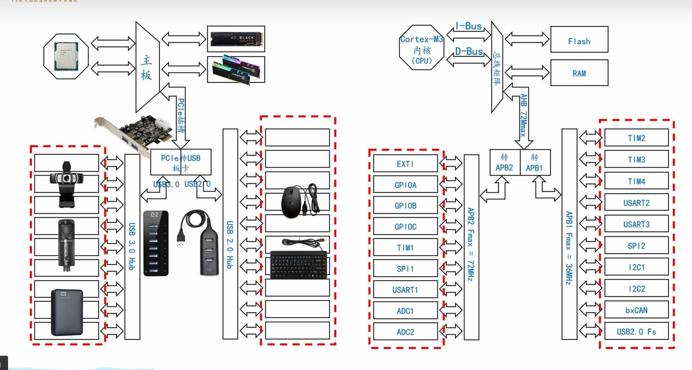
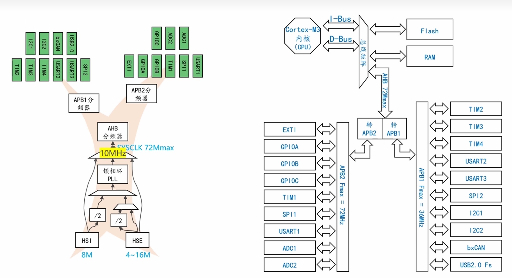
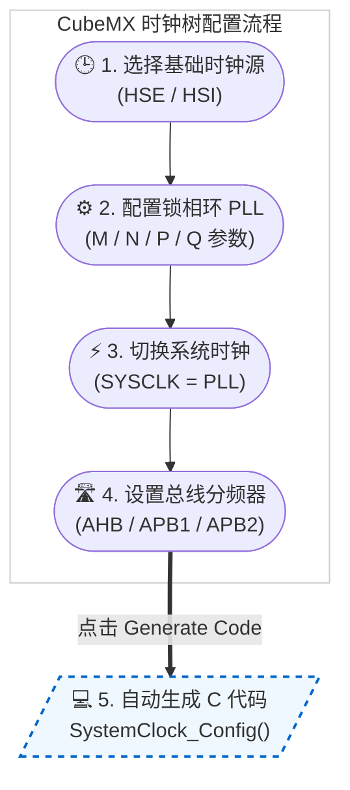
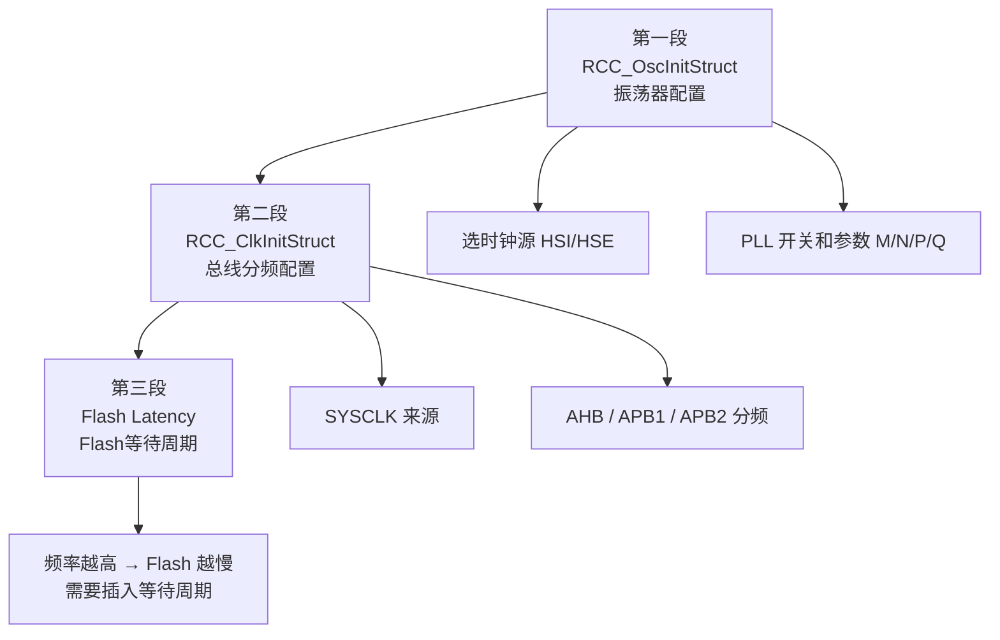
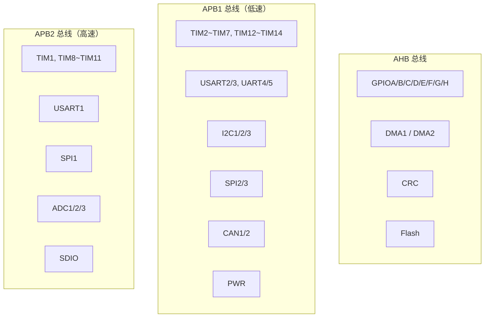
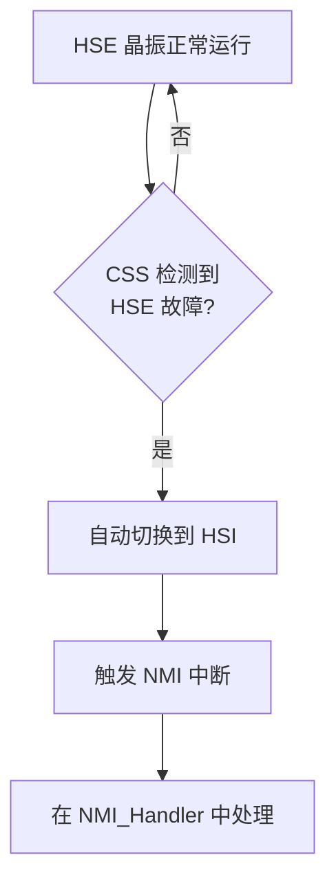

---
tags:
  - STM32
  - HAL库
  - RCC
aliases:
  - Reset and Clock Control
  - 时钟树配置
related:
  - "[[RCC时钟的基础理解和ISR的基础概念]]"
  - "[[GPIO]]"
  - "[[UART]]"
  - "[[../../../工程实践/STM-F103/铁头山羊-平衡小车/Lib/I2C]]"
  - "[[SPI]]"
  - "[[TIM（定时器）]]"
  - "[[DMA(直接存储器访问)]]"
  - "[[时钟树详解]]"
  - "[[HAL库设计思想]]"
---

# 时钟配置（HAL 库）

## 概述

HAL 库的时钟配置核心是 `SystemClock_Config()` 函数，由 CubeMX 自动生成，完成**振荡器选择 → PLL 配置 → 总线分频 → Flash 等待**四步。外设使用前必须通过 `__HAL_RCC_xxx_CLK_ENABLE()` 开启时钟。

> [!info] 面试开场句
> "HAL 库时钟配置主要是 `HAL_RCC_OscConfig` 选时钟源和 `HAL_RCC_ClockConfig` 配总线分频，都在 CubeMX 生成的 `SystemClock_Config` 里。外设使能用 `__HAL_RCC_xxx_CLK_ENABLE` 宏。"

> [!tip] 前置知识
> 时钟系统通用原理（时钟源、PLL、总线分频、时钟门控）详见 [时钟系统基础概念](../../外设/时钟系统基础概念.md)

---

## CubeMX 时钟树配置

CubeMX 的 Clock Configuration 界面可以直接可视化配置时钟树：





### 配置步骤



| 配置项 | STM32F103 | STM32F407 |
|--------|-----------|-----------|
| HSE 晶振 | 8MHz | 8MHz |
| PLL M | — | /8 |
| PLL N | ×9 | ×336 |
| PLL P | — | /2 |
| SYSCLK | 72MHz | 168MHz |
| AHB | /1 = 72MHz | /1 = 168MHz |
| APB1 | /2 = 36MHz | /4 = 42MHz |
| APB2 | /1 = 72MHz | /2 = 84MHz |

> [!warning] F1 和 F4 的 PLL 结构不同
> F1 的 PLL 没有 M 分频器，直接 HSE×N。F4 有完整的 M/N/P/Q 结构。配置时查对应芯片的 Reference Manual。

---

## SystemClock_Config 解读

CubeMX 自动生成，无需手写，但面试会问每一步在做什么：

```c
void SystemClock_Config(void) {
    RCC_OscInitTypeDef RCC_OscInitStruct = {0};
    RCC_ClkInitTypeDef RCC_ClkInitStruct = {0};

    // ========== 第一段：配置振荡器 ==========
    RCC_OscInitStruct.OscillatorType = RCC_OSCILLATORTYPE_HSE;  // 选择 HSE
    RCC_OscInitStruct.HSEState = RCC_HSE_ON;                    // 开启 HSE
    RCC_OscInitStruct.PLL.PLLState = RCC_PLL_ON;                // 开启 PLL
    RCC_OscInitStruct.PLL.PLLSource = RCC_PLLSOURCE_HSE;        // PLL 输入源 = HSE
    // PLL 参数（以 F407 为例）
    RCC_OscInitStruct.PLL.PLLM = 8;    // 输入分频 8MHz/8 = 1MHz
    RCC_OscInitStruct.PLL.PLLN = 336;  // 倍频 1MHz×336 = 336MHz (VCO)
    RCC_OscInitStruct.PLL.PLLP = RCC_PLLP_DIV2;  // 输出分频 336/2 = 168MHz
    RCC_OscInitStruct.PLL.PLLQ = 7;    // USB/RNG 336/7 = 48MHz
    HAL_RCC_OscConfig(&RCC_OscInitStruct);

    // ========== 第二段：配置总线分频 ==========
    RCC_ClkInitStruct.ClockType = RCC_CLOCKTYPE_HCLK | RCC_CLOCKTYPE_SYSCLK
                                 | RCC_CLOCKTYPE_PCLK1 | RCC_CLOCKTYPE_PCLK2;
    RCC_ClkInitStruct.SYSCLKSource = RCC_SYSCLKSOURCE_PLLCLK;  // SYSCLK = PLL
    RCC_ClkInitStruct.AHBCLKDivider = RCC_SYSCLK_DIV1;   // AHB = 168MHz
    RCC_ClkInitStruct.APB1CLKDivider = RCC_HCLK_DIV4;    // APB1 = 42MHz
    RCC_ClkInitStruct.APB2CLKDivider = RCC_HCLK_DIV2;    // APB2 = 84MHz

    // FLASH_LATENCY：Flash 等待周期，频率越高需要越多等待
    HAL_RCC_ClockConfig(&RCC_ClkInitStruct, FLASH_LATENCY_5);
}
```

### 三段式结构



> [!important] Flash Latency 是什么？
> Flash 存储器读取速度跟不上 CPU 高频运行，需要插入等待周期（Wait States）。
> - F407 @ 168MHz → FLASH_LATENCY_5（5 个等待周期）
> - F103 @ 72MHz → FLASH_LATENCY_2（2 个等待周期）
> CubeMX 自动计算，不需要手动算。

---

## HAL RCC API 速查

### 振荡器配置

```c
// 配置时钟源和 PLL（在 SystemClock_Config 中调用）
HAL_StatusTypeDef HAL_RCC_OscConfig(RCC_OscInitTypeDef *RCC_OscInitStruct);
```

```c
RCC_OscInitTypeDef 结构体成员：
.OscillatorType   // 选择配置哪些振荡器（HSE/HSI/LSI/LSE）
.HSEState         // HSE 开/关/Bypass
.HSIState         // HSI 开/关
.LSEState         // LSE 开/关
.LSIState         // LSI 开/关
.PLL.PLLState     // PLL 开/关
.PLL.PLLSource    // PLL 输入源（HSI/HSE）
.PLL.PLLM / PLLN / PLLP / PLLQ  // PLL 参数
```

### 系统时钟配置

```c
// 配置总线分频和 Flash 等待周期
HAL_StatusTypeDef HAL_RCC_ClockConfig(
    RCC_ClkInitTypeDef *RCC_ClkInitStruct,
    uint32_t FLatency
);
```

```c
RCC_ClkInitTypeDef 结构体成员：
.ClockType          // 配置哪些时钟（SYSCLK/HCLK/PCLK1/PCLK2）
.SYSCLKSource       // SYSCLK 来源（HSI/HSE/PLL）
.AHBCLKDivider      // AHB 分频（/1 /2 /4 ... /512）
.APB1CLKDivider     // APB1 分频
.APB2CLKDivider     // APB2 分频
```

### 外设时钟使能

```c
// 使能外设时钟（必须在使用外设前调用）
// AHB 总线外设
__HAL_RCC_GPIOA_CLK_ENABLE();
__HAL_RCC_GPIOB_CLK_ENABLE();
__HAL_RCC_DMA1_CLK_ENABLE();

// APB1 总线外设
__HAL_RCC_USART2_CLK_ENABLE();
__HAL_RCC_I2C1_CLK_ENABLE();
__HAL_RCC_TIM2_CLK_ENABLE();

// APB2 总线外设
__HAL_RCC_USART1_CLK_ENABLE();
__HAL_RCC_SPI1_CLK_ENABLE();
__HAL_RCC_ADC1_CLK_ENABLE();
__HAL_RCC_TIM1_CLK_ENABLE();
```

```c
// 禁用外设时钟
__HAL_RCC_GPIOA_CLK_DISABLE();

// 查询时钟状态
__HAL_RCC_GPIOA_IS_CLK_ENABLED();    // 返回 ENABLED/DISABLED
```

### 时钟频率查询

```c
// 获取各总线实际频率（Hz）
uint32_t sysclk = HAL_RCC_GetSysClockFreq();    // SYSCLK
uint32_t hclk  = HAL_RCC_GetHCLKFreq();         // AHB
uint32_t pclk1 = HAL_RCC_GetPCLK1Freq();        // APB1
uint32_t pclk2 = HAL_RCC_GetPCLK2Freq();        // APB2
```

### MCO 时钟输出

```c
// 将内部时钟输出到引脚，示波器可观测
void HAL_RCC_MCOConfig(
    uint32_t RCC_MCOx,        // MCO1 或 MCO2
    uint32_t RCC_MCOSource,   // 输出哪个时钟
    uint32_t RCC_MCODiv       // 分频系数
);

// 例：PA8 输出 HSE 8MHz
HAL_RCC_MCOConfig(RCC_MCO1, RCC_MCO1SOURCE_HSE, RCC_MCODIV_1);

// 例：PC9 输出 SYSCLK 168MHz / 4 = 42MHz
HAL_RCC_MCOConfig(RCC_MCO2, RCC_MCO2SOURCE_SYSCLK, RCC_MCODIV_4);
```

> [!tip] MCO 调试用途
> 用示波器接 MCO 引脚，可以验证时钟是否正确。时钟不对的时候先看 MCO 输出。

---

## 外设时钟使能速查表

### 按总线分类



### 使能宏命名规律

```
__HAL_RCC_{外设名}_CLK_ENABLE()
__HAL_RCC_{外设名}_CLK_DISABLE()

例：
__HAL_RCC_GPIOA_CLK_ENABLE()
__HAL_RCC_USART1_CLK_ENABLE()
__HAL_RCC_I2C1_CLK_ENABLE()
__HAL_RCC_TIM2_CLK_ENABLE()
```

> [!warning] CubeMX 自动生成的 `mx.c` 里已经包含了时钟使能代码。如果你手动初始化外设（不用 CubeMX），必须自己加这行宏。

---

## 时钟安全系统 CSS

### 解决什么问题？

如果运行中 HSE 晶振坏了（震动、虚焊、温度异常），系统时钟会突然消失 → CPU 挂死。CSS（Clock Security System）负责**检测 HSE 故障并自动切换到 HSI**。



```c
// 开启 CSS
HAL_RCC_EnableCSS();

// NMI 中断处理（CSS 触发后自动进入）
void NMI_Handler(void) {
    if (__HAL_RCC_GET_IT(RCC_IT_CSS)) {
        __HAL_RCC_CLEAR_IT(RCC_IT_CSS);
        // HSE 挂了，系统已自动切到 HSI
        // 可以在这里做安全处理：停电机、报警等
    }
}
```

> [!tip] CSS 适用场景
> 工业控制、汽车电子等对可靠性要求高的场景。消费电子一般不开。面试提到 CSS 能体现你的工程经验。

---

## 常见问题

| 问题 | 原因 | 解决 |
|------|------|------|
| 外设配置了但不工作 | 忘了开时钟 | 加 `__HAL_RCC_xxx_CLK_ENABLE()` |
| SystemClock_Config 卡死 | PLL 参数超范围 | 查 Reference Manual 的 PLL 配置表 |
| HSE 启动超时 | 晶振没焊、负载电容不对 | 检查硬件，确认晶振频率配置 |
| Flash Latency 配错 | CPU 跑高频但等待周期不够 | CubeMX 自动算，别手动改 |
| APB1 定时器频率算错 | 用了总线频率 42M 而非定时器频率 84M | APB 分频 > 1 时定时器自动 ×2 |

---

## 面试高频问题

> [!example]- Q1：`SystemClock_Config` 做了什么？
> 三步：(1) `HAL_RCC_OscConfig` 配置时钟源和 PLL 参数；(2) `HAL_RCC_ClockConfig` 配置总线分频和 Flash 等待周期；(3) 选择 PLL 作为 SYSCLK。整个过程 CubeMX 自动生成。

> [!example]- Q2：外设时钟为什么要手动开启？
> 默认关闭是为了省电（时钟门控）。外设寄存器靠时钟驱动，不开时钟读写无效。用 `__HAL_RCC_xxx_CLK_ENABLE()` 开启。

> [!example]- Q3：怎么获取当前系统时钟频率？
> `HAL_RCC_GetSysClockFreq()` 返回 SYSCLK 频率（Hz）。还有 `GetHCLKFreq`、`GetPCLK1Freq`、`GetPCLK2Freq` 获取各总线频率。

> [!example]- Q4：F1 和 F4 的时钟配置有什么区别？
> F1 PLL 没有 M 分频器，直接 HSE×N，最大 72MHz。F4 有完整 M/N/P/Q，最大 168MHz。总线分频也不同：F1 的 APB1 最大 36MHz，F4 最大 42MHz。

> [!example]- Q5：什么是 CSS？为什么需要？
> Clock Security System，检测 HSE 晶振故障。晶振坏了自动切到 HSI 保证系统不死机，触发 NMI 中断做安全处理。工业场景必备。

---

## 踩坑记录

> [!bug] 实战经验填充区
> （项目开发中遇到的时钟配置相关问题记录于此）
