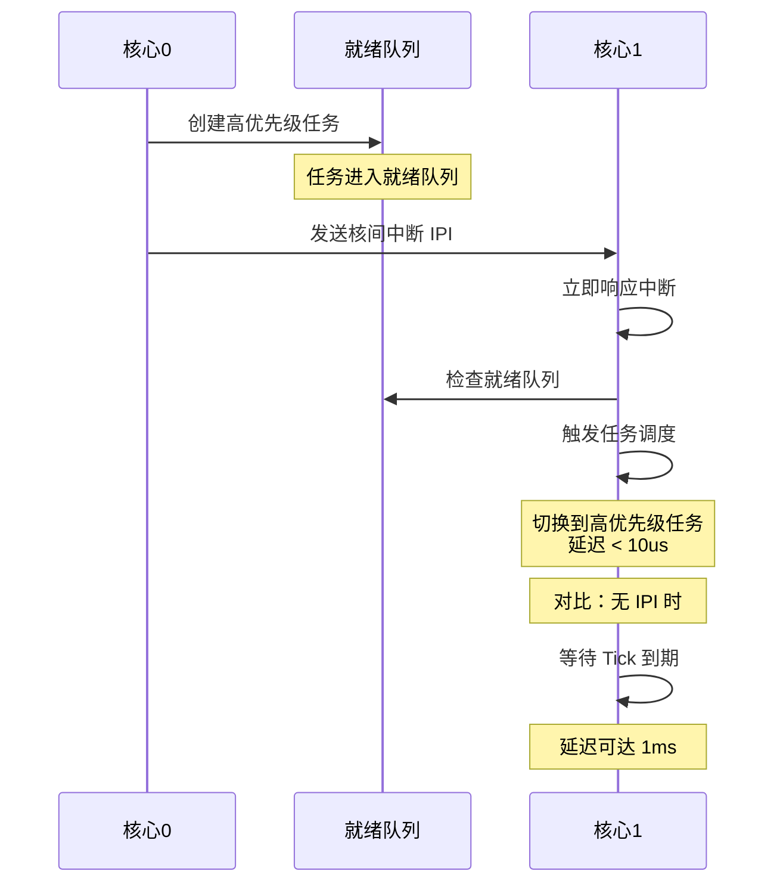

核间中断（IPI，Inter-Processor Interrupt）是多核处理器提供的一种纯硬件通信机制；在 RT-Thread 中，它的核心作用是打破核心之间的物理屏障，允许一个 CPU 核心强行打断另一个 CPU 核心的执行流，强制它立刻进行上下文切换（任务调度）。

##### 为什么 Core 1 不能自己去发现新任务？

如果不用 IPI，Core 1 只有等到它的"滴答定时器"也就是时间片耗尽时，才会去检查就绪队列。假设 Tick 是 1 毫秒，那么这个最高优先级的急停任务最多可能要等 1 毫秒才会被 Core 1 执行。在实时操作系统中，1 毫秒的延迟足以让电机撞毁机器。

**IPI 的存在，就是为了保证"最高优先级任务被唤醒后，能在微秒级时间内立刻抢占任何核心的 CPU"，这捍卫了 RTOS 绝对的"硬实时性"。**

