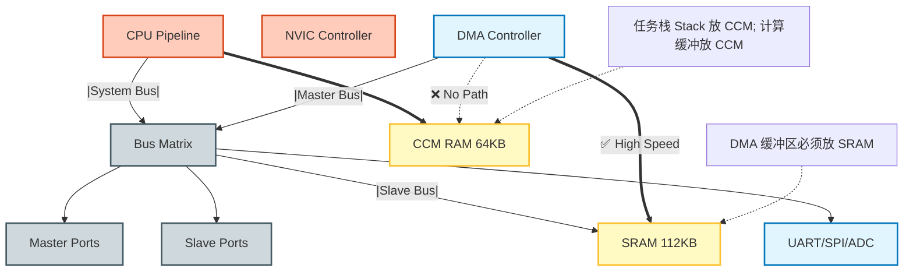

这两者是 有关系的：启动源码涉及到了.s和.dl等[[../../内存/STM32F407启动源码的理解]]
**不想看这个文档，可以看这个人讲的视频[B站：熊大计算](https://www.bilibili.com/video/BV1ksNCzXEny?spm_id_from=333.788.videopod.sections&vd_source=603f3c284e76fbe772654083937e3fac)**
# 📑 STM32-RTOS的接入问题

> [!abstract] 学习目标
> 本次学习主要为了理解什么概念？解决什么疑惑？
> 主要处理了stm32是如何接入RTOS系统的和他和RTOS系统是如何相互操作的
> 
1.  **总线物理隔离原则**：利用 F407 特有的 **CCM RAM (64KB)** 存放 RTOS 任务栈，实现 CPU 密集型计算与 DMA 数据搬运的**物理并发**，彻底规避总线竞争。
2.  **双堆栈安全模型**：严格区分 **MSP (特权级/中断)** 与 **PSP (用户级/任务)**。MSP 作为系统最后的“逃生舱”，确保即使任务栈溢出，紧急硬件中断仍能响应。
3.  **中断特权分级**：确立了以 `configMAX_SYSCALL_INTERRUPT_PRIORITY` 为界的“生死红线”。高优先级中断（0-4）拥有绝对抢占权但禁止调用内核 API，低优先级中断（5-15）受内核托管。
4.  **原子性与移植性**：虽然 STM32F4 具备 32 位读写原子性，但为了兼容性与 64 位 Tick 扩展，必须采用**临界区锁**机制。

## 📊 图表与架构分析 (Diagrams)
## 2. 核心架构可视化 (Architectural Visualization)

### 图 2.1: F407 内存总线与 DMA 盲区 (Memory & Bus Matrix)
*展示了为何 DMA 无法访问 CCM RAM，以及如何规划内存布局。*



### 图 2.2: RTOS 双堆栈切换时序 (The Dual-Stack Context Switch)
展示了从“任务A”切换到“任务B”时，硬件与软件在 MSP/PSP 上的接力操作。

```mermaid
graph TD

    %% ================= 样式定义 =================
    classDef memBlock fill:#f9f9f9,stroke:#333,stroke-width:2px
    classDef ptr fill:#ffcc80,stroke:#d84315,stroke-width:2px,stroke-dasharray:5 5
    classDef addr fill:#e1f5fe,stroke:none
    classDef note fill:#fff,stroke:#999,stroke-dasharray:3 3

    %% ================= 地址标记 =================
    AddrHigh[High Address 0x2001FFFF]
    AddrLow[Low Address 0x20000000]

    %% ================= Task A =================
    subgraph TaskA_Zone
        StackBaseA[Stack Bottom / 栈底]
        LocalVarA[Local Variables / 局部变量]
        SPA[Current SP_A / 当前栈顶]
    end

    %% ================= Free Space =================
    FreeSpace[Free Heap / 未分配空间]

    %% ================= Task B =================
    subgraph TaskB_Zone
        StackBaseB[Stack Bottom / 栈底]
        LocalVarB[Local Variables / 局部变量]
        ContextB[Saved Context R0-R15 / 保存现场]
        SPB[Suspended SP_B / 挂起栈顶]
    end

    %% ================= 内存方向（高 → 低） =================
    AddrHigh --> StackBaseA
    StackBaseA --> LocalVarA
    LocalVarA --> SPA

    SPA -.->|Stack Growth / 栈向下生长| FreeSpace

    FreeSpace --> StackBaseB
    StackBaseB --> LocalVarB
    LocalVarB --> ContextB
    ContextB --> SPB
    SPB --> AddrLow

    %% ================= 注释 =================
    NoteA[CPU R13 Points Here / CPU当前R13]
    NoteB[Saved in TCB / 保存在TCB]

    NoteA -.-> SPA
    NoteB -.-> SPB

    %% ================= 样式应用 =================
    class StackBaseA,LocalVarA,StackBaseB,LocalVarB,ContextB,FreeSpace memBlock
    class SPA,SPB ptr
    class AddrHigh,AddrLow addr
    class NoteA,NoteB note

 ```

### 图 2.5: 寄存器与地址的物理区别 (CPU Internal vs Memory Map)
解释了为什么“寄存器没有地址”以及 CPU 如何通过总线访问 SRAM

 ```mermaid
graph TD

    %% ========== 标题节点 ==========
    T_CPU[[CPU Core / 无地址世界]]
    T_MEM[[Memory Space / 有地址世界]]

    %% ========== CPU 核心 ==========
    subgraph CPU_Core
        ALU[ALU 运算器]
        subgraph Registers
            R0[R0 手左]
            R1[R1 手右]
            PC[PC 眼睛]
            SP[SP 口袋]
        end
        Decoder[指令译码器]
    end

    T_CPU --- ALU

    %% ========== 总线系统 ==========
    subgraph Bus_System
        AddrBus[地址总线 32-bit]
        DataBus[数据总线 32-bit]
    end

    %% ========== 内存空间 ==========
    subgraph Memory_Space
        SRAM[SRAM 地址 0x20000000]
        GPIO[GPIO ODR 地址 0x4002xxxx]
    end

    T_MEM --- SRAM

    %% ========== 连接关系 ==========
    Registers --|只有数据连接|--> DataBus
    ALU --> Registers
    Decoder --|选择 R0/R1|--> Registers

    Decoder --|发出读写指令|--> AddrBus
    AddrBus --> Memory_Space
    DataBus --> Memory_Space

    %% ========== 样式（只作用节点） ==========
    style ALU fill:#ffccbc,stroke:#bf360c
    style Decoder fill:#ffccbc,stroke:#bf360c
    style SRAM fill:#b3e5fc,stroke:#01579b
    style GPIO fill:#b3e5fc,stroke:#01579b


 ```

### 图 2.7: PendSV 物理压栈时序 (Context Switch Physics - Detailed Stack Interaction)
此图精确展示了 CPU 寄存器与 SRAM 物理内存之间的数据搬运过程，明确了“硬件自动压栈”与“软件手动压栈”的时序分界。

 ```mermaid
sequenceDiagram
    participant TaskA as Task A (Current)
    participant HW as CPU Hardware
    participant StackA as Stack A (SRAM)
    participant PendSV as PendSV_Handler (ASM)
    participant TCB as TCB List
    participant StackB as Stack B (SRAM)
    participant TaskB as Task B (Next)

    Note over TaskA, HW: 1. 触发 PendSV 异常
    
    rect rgb(255, 230, 230)
    Note right of TaskA: 硬件自动压栈 (Auto-Stacking)
    HW->>StackA: Push xPSR, PC, LR, R12, R0-R3
    end
    
    HW->>PendSV: 跳转执行中断服务程序
    
    rect rgb(230, 255, 230)
    Note right of PendSV: 软件手动保存剩余部分
    PendSV->>StackA: STMDB SP!, {R4-R11} (手动压栈)
    end
    
    PendSV->>TCB: 保存当前 SP 到 TaskA_TCB
    PendSV->>TCB: 从 TaskB_TCB 读取新 SP
    
    rect rgb(230, 240, 255)
    Note right of PendSV: 软件手动恢复剩余部分
    PendSV->>StackB: LDMIA SP!, {R4-R11} (手动出栈)
    end
    
    PendSV->>HW: 执行 BX LR (异常返回指令)
    
    rect rgb(255, 230, 230)
    Note right of HW: 硬件自动出栈 (Auto-Unstacking)
    HW->>StackB: Pop xPSR, PC, LR, R12, R0-R3
    end
    
    HW->>TaskB: PC 指向 Task B 入口，开始运行！
 ```
### 图 2.6: MSP 启动重置策略 (MSP Reset Strategy)
解释了为什么在启动第一个任务前必须重置 MSP，避免内存浪费。

 ```mermaid
graph TD

    %% ===== 标题节点 =====
    T_RAM[[SRAM Stack Area / 从高地址向下]]
    T_A[[Scenario A / 不重置 MSP]]
    T_B[[Scenario B / 重置 MSP]]

    %% ===== RAM 区域 =====
    subgraph RAM_Usage
        Top[Stack Top 0x20020000]
    end

    T_RAM --- Top

    %% ===== 场景 A：不重置 MSP =====
    subgraph Scenario_A
        MainStack[main Stack 1KB]
        MSP_Old[Old MSP Pointer]
        ISR_Stack[ISR Continues Push]
        Waste[Memory Lost / 僵尸内存]
    end

    T_A --- MainStack

    Top --> MainStack
    MainStack --> MSP_Old
    MSP_Old --> ISR_Stack
    ISR_Stack --> Waste

    %% ===== 场景 B：重置 MSP =====
    subgraph Scenario_B
        MSP_New[MSP Reset to Top]
        ISR_New[ISR Uses Clean Stack]
        Saving[Memory Reused / 内存回收]
    end

    T_B --- MSP_New

    Top --> MSP_New
    MSP_New --> ISR_New
    ISR_New --> Saving

    %% ===== 样式 =====
    style Waste fill:#ffcdd2,stroke:#c62828,stroke-width:2px
    style Saving fill:#c8e6c9,stroke:#2e7d32,stroke-width:2px
 ```


图 2.3: 中断优先级的“生死红线” (The Priority Line of Death)
展示了 STM32 NVIC 优先级与 RTOS 管理范围的冲突边界。

 ```mermaid

graph TD

    %% ================= 样式定义 =================
    classDef safe fill:#e8f5e9,stroke:#2e7d32,stroke-width:2px
    classDef danger fill:#ffcdd2,stroke:#c62828,stroke-width:4px
    classDef boundary fill:#fff9c4,stroke:#fbc02d,stroke-dasharray:5 5

    %% ================= 标题节点 =================
    T_PRI[[STM32 NVIC Priorities 0-15 / 中断优先级阶梯]]
    T_EXP[[Explanation / 后果分析]]

    %% ================= 优先级阶梯 =================
    subgraph NVIC_Priorities
        P0[Priority 0 Highest / 最高]
        P1[Priority 1]
        P2[Priority 2]
        P3[Priority 3 TIM2]
        Line[Threshold = 5 / 生死线]
        P5[Priority 5 RTOS Limit]
        P6[Priority 6]
        P_Lower[Lower Priorities / 更低]
        P15[Priority 15 Lowest / 最低]
    end

    T_PRI --- P0

    %% ================= 角色节点 =================
    RTOS_Core[RTOS Kernel / 内核]

    %% ================= 交互逻辑 =================
    P3 --|1 强行打断 RTOS|--> RTOS_Core
    RTOS_Core --|2 尝试屏蔽 BASEPRI=5|--> P5
    RTOS_Core --|3 无法屏蔽 P3|--> P3

    %% ================= 说明区域 =================
    subgraph Explanation
        Rule1[Red Zone 禁止调用 RTOS API]
        Rule2[Green Zone 可用 FromISR API]
    end

    T_EXP --- Rule1

    %% ================= 样式应用 =================
    class P0,P1,P2,P3 danger
    class P5,P6,P_Lower,P15 safe
    class Line boundary
    class Rule1 danger
    class Rule2 safe


 ```

 # 4.2 Full Source Code Artifacts (全量代码资产)

 ## 4.2.1 Core 1: The Stack Fabricator (栈帧伪造器)

### 物理目标：在 SRAM/CCM 中手动填充数据，使其看起来像是一个“被中断打断”的现场。当 CPU 执行 BX LR 时，硬件会自动把这些数据弹回寄存器，从而“欺骗” CPU 跳转到任务入口。
```c
/* Artifact Ref: Kernel_TaskInit.c */

#include "stm32f4xx.h"

/* ARM Cortex-M4 xPSR 寄存器定义 */
#define xPSR_T_BIT      ( 1UL << 24UL ) // Bit 24: Thumb State Bit

/**
 * @brief  初始化任务栈 (Stack Forgery)
 * @param  pxTopOfStack: 栈顶指针 (SRAM/CCM 内存地址)
 * @param  pxCode: 任务函数入口地址 (PC)
 * @param  pvParameters: 传给任务的参数 (R0)
 * @return 更新后的栈顶指针 (存入 TCB)
 */
uint32_t* OS_StackInit(uint32_t *pxTopOfStack, void (*pxCode)(void *), void *pvParameters)
{
    /* 
     * [物理法则]: ARM Cortex-M 栈是 Full Descending (向下生长)。
     * 操作顺序：先减地址 (--), 再写数据 (*ptr = val)。
     */

    /* ===========================================================
       Layer 1: 硬件自动保存层 (Hardware Stack Frame)
       当异常返回时，硬件会自动从这里弹出 8 个字到寄存器。
       顺序固定：xPSR, PC, LR, R12, R3, R2, R1, R0
       =========================================================== */

    pxTopOfStack--; 
    *pxTopOfStack = xPSR_T_BIT;  
    /* [xPSR]: 必须置位 T-Bit (第24位)。
     * 物理后果: 如果为 0，CPU 尝试切入 ARM 指令集模式。
     * 由于 Cortex-M4 只支持 Thumb-2，会导致 UsageFault (INVSTATE)。
     */

    pxTopOfStack--; 
    *pxTopOfStack = (uint32_t)pxCode; 
    /* [PC]: Program Counter。
     * 物理后果: 异常返回后，CPU 取指单元 (Fetch Unit) 将从这个地址开始抓取指令。
     */

    pxTopOfStack--; 
    *pxTopOfStack = 0x00000000UL; 
    /* [LR]: Link Register。
     * 通常填入一个错误处理函数地址 (如 vTaskExitError)。
     * 防止任务函数意外 return，导致 PC 飞到未知区域。
     */

    pxTopOfStack--; *pxTopOfStack = 0x00000000UL; /* R12 */
    pxTopOfStack--; *pxTopOfStack = 0x00000000UL; /* R3  */
    pxTopOfStack--; *pxTopOfStack = 0x00000000UL; /* R2  */
    pxTopOfStack--; *pxTopOfStack = 0x00000000UL; /* R1  */
    
    pxTopOfStack--; 
    *pxTopOfStack = (uint32_t)pvParameters; 
    /* [R0]: 根据 AAPCS 调用约定，函数的第一个参数存放在 R0。 */

    /* ===========================================================
       Layer 2: 软件手动保存层 (Software Stack Frame)
       PendSV_Handler 中的 STMDB 指令将操作这 8 个寄存器。
       =========================================================== */
    
    /* 填入调试魔术字，方便在 Memory Window 中观察栈是否溢出或错位 */
    pxTopOfStack--; *pxTopOfStack = 0x11111111UL; /* R11 */
    pxTopOfStack--; *pxTopOfStack = 0x10101010UL; /* R10 */
    pxTopOfStack--; *pxTopOfStack = 0x09090909UL; /* R9 */
    pxTopOfStack--; *pxTopOfStack = 0x08080808UL; /* R8 */
    pxTopOfStack--; *pxTopOfStack = 0x07070707UL; /* R7 */
    pxTopOfStack--; *pxTopOfStack = 0x06060606UL; /* R6 */
    pxTopOfStack--; *pxTopOfStack = 0x05050505UL; /* R5 */
    pxTopOfStack--; *pxTopOfStack = 0x04040404UL; /* R4 */

    return pxTopOfStack; 
}

```


## 💻 代码逻辑与实现 (C)

---


## 4.2.2 Core 2: The Singularity (内核启动点)
### 物理目标：完成从 MSP (特权级) 到 PSP (用户级) 的跳跃。利用 SVC 异常来清洗 MSP 栈空间。

```c

/* Artifact Ref: Kernel_Port.c & ASM */

/* 1. C 函数：启动调度器 */
void vPortStartFirstTask( void )
{
    /* 
     * 物理操作: 
     * 1. 重置 MSP 到向量表定义的初始值 (回收 main() 栈空间)。
     * 2. 开启中断。
     * 3. 触发 SVC 0 异常。
     */
    __asm volatile(
        " ldr r0, =0xE000ED08   \n" /* 读取 VTOR (向量表偏移寄存器) 地址 */
        " ldr r0, [r0]          \n" /* 读取 VTOR 的值 */
        " ldr r0, [r0]          \n" /* 读取向量表第一个字 (MSP 初始地址) */
        
        " msr msp, r0           \n" /* [DESTRUCTIVE]: 重置 MSP。main() 局部变量至此全部失效 */
        
        " cpsie i               \n" /* 全局开中断 (Enable Interrupts) */
        " cpsie f               \n" /* 开 Fault 中断 */
        " dsb                   \n" /* 数据同步屏障 */
        " isb                   \n" /* 指令同步屏障 */
        
        " svc 0                 \n" /* [TRIGGER]: 触发 SVC 异常，跳转到 SVC_Handler */
        " nop                   \n"
        " .literals             \n" 
    );
}

/* 2. 汇编 Handler：接管跳转 */
void SVC_Handler( void )
{
    __asm volatile(
        " ldr r3, =pxCurrentTCB      \n" /* 获取当前任务 TCB 指针的地址 */
        " ldr r1, [r3]               \n" /* 获取 TCB 指针 */
        " ldr r0, [r1]               \n" /* 获取 TCB->pxTopOfStack (任务栈顶) */
        
        " ldmia r0!, {r4-r11}        \n" /* 手动弹出软件栈帧 R4-R11 */
        
        " msr psp, r0                \n" /* [CRITICAL]: 将任务栈指针赋值给 PSP */
        " isb                        \n"
        
        " mov r0, #0                 \n" 
        " msr basepri, r0            \n" /* 确保 BasePRI 为 0 (允许所有中断) */
        
        /* 
         * 构造 EXC_RETURN 值: 0xFFFFFFFD
         * Bit 2 = 1: Return to Thread Mode (用户任务模式)
         * Bit 3 = 1: Return to use PSP (使用进程堆栈)
         */
        " orr r14, #0xd              \n" 
        
        " bx r14                     \n" /* [JUMP]: 硬件自动弹出 Layer 1，进入任务函数 */
    );
}
```

## 4.2.3 Core 3: The Context Switcher (上下文切换)
###  物理目标：在微秒级时间内，保存旧任务现场，恢复新任务现场。
```c
/* Artifact Ref: Kernel_ASM.s */

.syntax unified
.cpu cortex-m4
.thumb

.global PendSV_Handler
.type PendSV_Handler, %function

PendSV_Handler:
    /* --- Step A: 保存旧任务现场 (Save Old Task) --- */
    
    mrs r0, psp                         /* 读取 PSP 到 R0 */
    isb                                 /* 确保读取完成 */

    /* 
     * F407 带 FPU (浮点单元)。
     * 如果使用了 FPU，硬件会自动压入 S0-S15。
     * 这里假设 task 没用 FPU 或已由 Lazy Stacking 处理，仅保存核心整数寄存器。
     */
    stmdb r0!, {r4-r11}                 /* 压入 R4-R11，R0 递减 */

    ldr r3, =pxCurrentTCB               /* 读取 pxCurrentTCB 全局变量地址 */
    ldr r2, [r3]                        /* 读取当前 TCB 地址 */
    str r0, [r2]                        /* [SAVE]: 将新的栈顶 (R0) 保存到 TCB */

    /* --- Step B: 切换 TCB (Select New Task) --- */
    
    stmdb sp!, {r3, r14}                /* 保护 R3 和 LR (使用 MSP) */
    
    mov r0, #5                          /* configMAX_SYSCALL_INTERRUPT_PRIORITY */
    msr basepri, r0                     /* [LOCK]: 屏蔽低优先级中断，保护调度器数据结构 */
    dsb
    isb
    
    bl vTaskSwitchContext               /* [C-Call]: 调用 C 函数选择下一个任务 */
    
    mov r0, #0                          
    msr basepri, r0                     /* [UNLOCK]: 解除屏蔽 */
    
    ldmia sp!, {r3, r14}                /* 恢复 R3 和 LR */

    /* --- Step C: 恢复新任务现场 (Restore New Task) --- */

    ldr r1, [r3]                        /* 再次读取 pxCurrentTCB (此时已指向新任务) */
    ldr r0, [r1]                        /* 读取新任务的栈顶指针 */

    ldmia r0!, {r4-r11}                 /* 弹出 R4-R11，R0 递增 */

    msr psp, r0                         /* [UPDATE]: 更新 CPU 的 PSP 寄存器 */
    isb                                 /* 确保 PSP 更新生效 */

    /* --- Step D: 异常返回 (Hardware Unstacking) --- */
    
    bx r14                              
    /* 
     * CPU 识别 EXC_RETURN，执行以下物理操作:
     * 1. 切换到 PSP 栈。
     * 2. 自动 Pop {R0-R3, R12, LR, PC, xPSR}。
     * 3. PC 跳转到任务断点处继续执行。
     */


```

## 4.2.4 Core 4: The Heartbeat (心脏起搏器)
### 物理目标：配置 SysTick 为 1ms 中断，并处理 Tick 计数溢出保护。
```c
/* Artifact Ref: Kernel_Tick.c */

#define CPU_CLOCK_HZ   168000000UL  // F407 默认主频 168MHz
#define TICK_RATE_HZ   1000UL       // 1kHz (1ms)

void OS_InitTick(void) 
{
    /* 1. 设置重装载寄存器 (LOAD) */
    /* 物理含义: 计数器从 N 减到 0 触发中断。 N = (168M / 1000) - 1 */
    SysTick->LOAD = (CPU_CLOCK_HZ / TICK_RATE_HZ) - 1UL;
    
    /* 2. 设置 SysTick 中断优先级为最低 (0x0F) */
    /* 物理含义: 保证它不会阻塞 UART、ADC 等硬件中断 (Red Zone) */
    NVIC_SetPriority(SysTick_IRQn, (1UL << __NVIC_PRIO_BITS) - 1UL);
    
    /* 3. 清空当前计数值 */
    SysTick->VAL = 0UL;
    
    /* 4. 启动控制寄存器 (CTRL) */
    /* CLKSOURCE(Bit2)=1: 处理器时钟 (AHB)
     * TICKINT(Bit1)=1:   倒数到0触发异常
     * ENABLE(Bit0)=1:    使能计数器
     */
    SysTick->CTRL = SysTick_CTRL_CLKSOURCE_Msk |
                    SysTick_CTRL_TICKINT_Msk   |
                    SysTick_CTRL_ENABLE_Msk;
}

/* SysTick 中断服务程序 */
void SysTick_Handler(void)
{
    /* 进入临界区，防止此时被更高优先级中断打断导致 xTickCount 数据竞争 */
    uint32_t ulReturn = taskENTER_CRITICAL_FROM_ISR();
    {
        /* 增加系统 Tick 计数 */
        const uint32_t ulTickCount = xTaskIncrementTick();

        if( ulTickCount != pdFALSE )
        {
            /* 如果有任务因为延时结束而唤醒，触发 PendSV 进行调度 */
            /* SCB->ICSR Bit 28: PENDSVSET */
            SCB->ICSR = SCB_ICSR_PENDSVSET_Msk;
        }
    }
    taskEXIT_CRITICAL_FROM_ISR( ulReturn );
}

```
---

## 1. Terminology Map (黑话/术语校准)

| 术语 (Term) | 全称 (Full Name) | 物理定义 (Physical Definition) | 工业级潜台词 (Industrial Subtext) |
| :--- | :--- | :--- | :--- |
| **CCM RAM** | Core Coupled Memory | 紧耦合内存。直接挂在 CPU 的 D-Bus 上，不经过总线矩阵。 | **DMA 的禁区**。谁把串口缓冲放这，谁就是那个让项目延期的人。 |
| **MSP** | Main Stack Pointer | 主堆栈指针。复位后默认使用，特权级专用。 | **系统的ICU**。无论用户任务怎么作死，中断和内核都躲在这里面安全运行。 |
| **PSP** | Process Stack Pointer | 进程堆栈指针。用户模式专用。 | **任务的沙盒**。任务栈溢出只会弄脏这里，不会搞崩整个系统。 |
| **PendSV** | Pendable Service Call | 可悬起服务调用。优先级最低的异常。 | **RTOS 的换班铃**。只有等所有急活（硬中断）干完了，才轮到它慢悠悠地换任务。 |
| **SVC** | Supervisor Call | 系统管理调用（软中断）。 | **RTOS 的传送门**。从用户态（无权）穿梭回内核态（有权）的唯一合法通道。 |
| **xPSR T-bit** | Thumb State Bit | 程序状态寄存器的第 24 位。 | **Cortex-M4 的命门**。跳转地址最低位必须是 1，否则 CPU 认为你让它跑 ARM 指令，当场死机。 |
| **Lazy Stacking** | - | 懒惰压栈。硬件只保存一半寄存器 (R0-R3...)，软件保存另一半 (R4-R11)。 | **ARM 的鸡贼设计**。为了让中断响应变快，能偷懒绝不把所有寄存器都压栈。 |

---

## 2. Side-Quest Collection (支线任务合集)

在构建 RTOS 内核的主线任务之外，我们攻克了以下三个“必须打通”的硬件支线：

### 支线 A：总线矩阵与内存分层 (The Bus Matrix & Memory Hierarchy)
*   **Trigger**: 初学者常误以为 F407 的 RAM 是一块连续的通用内存。
*   **Deep Dive (深度解析)**:
    *   STM32F407 内部架构类似一个巨大的立交桥系统（Bus Matrix）。
    *   **SRAM (112KB)**: 连接在立交桥枢纽上，CPU、DMA、以太网、USB 都能访问。**（吵闹的公共广场）**
    *   **CCM (64KB)**: 有一条专线直通 CPU 卧室。DMA 根本没有路过去。**（CPU 的私人书房）**
*   **Engineering Rule (工程铁律)**: 
    *   需要 DMA 搬运的数据（UART Rx, ADC buffer）**必须**放 SRAM。
    *   纯计算数据（PID 状态, 密钥, 栈）**建议**放 CCM 以减少总线竞争。

### 支线 B：寄存器 vs 地址 (Register vs Address)
*   **Trigger**: 疑问“寄存器的本质也是地址吗？”
*   **Deep Dive (深度解析)**:
    *   **内存/外设**: 像“带门牌号的邮箱”。CPU 必须发地址到总线上，等待总线仲裁，数个周期后才能拿到数据。
    *   **通用寄存器 (R0-R15)**: 像“CPU 的手”。没有 32 位地址，通过指令中的 4-bit 编号直接索引，速度是光速（0 等待）。
*   **Hardware Behavior**: 
    *   `MOV R0, R1` (寄存器操作): 不产生任何总线流量。
    *   `LDR R0, [R1]` (加载操作): 产生总线读请求。

### 支线 C：优先级逻辑反转 (The Priority Paradox)
*   **Trigger**: 对 `configMAX_SYSCALL_INTERRUPT_PRIORITY` 的理解模糊。
*   **Deep Dive (深度解析)**:
    *   **STM32 硬件逻辑**: 数字越小，拳头越硬（0 是老大，15 是小弟）。
    *   **RTOS 软件逻辑**: 数字越大，优先级越高（Task 5 > Task 1）。
    *   **冲突点**: RTOS 的临界区保护（Critical Section）是通过修改 `BASEPRI` 寄存器来实现的。它只能屏蔽（Mask）掉优先级数值大于等于阈值的中断。
*   **Engineering Rule (工程铁律)**: 
    *   如果你把中断设为 3（比阈值 5 强），RTOS 根本拦不住它。它会在 RTOS 修改内核链表时强行插入，导致数据结构腐烂（Corruption）。

---

## 3. Confusion Analysis (深度复盘：三个典型认知修正)

### 误区 1: "main() 栈被销毁是不对的"
*   **你的旧认知**: 物理内存是宝贵的，怎么能随便销毁？MSP 应该一直保留。
*   **宗师矫正**:
    *   **逻辑层面**: 执行 `vTaskStartScheduler` 后，OS 接管一切，CPU 永远不会返回 `main()`。
    *   **物理层面**: `main()` 初始化期间使用的栈空间（可能几百字节）如果不回收，就成了**僵尸内存 (Zombie Memory)**，永远无法被再次利用。
    *   **Action**: `MSR MSP, Initial_Top`。这叫“打扫战场”，把旧数据覆盖掉，让 MSP 重新变回一张白纸，供中断服务程序尽情使用。

### 误区 2: "32位读写是原子的，所以不需要关中断"
*   **你的旧认知**: 一条指令能干完的事，中断怎么打断？FreeRTOS 加锁是多此一举。
*   **宗师矫正**:
    *   **现状**: 在 STM32F4 上，读取 `uint32_t` 确实是单指令原子的。
    *   **隐患**: 如果系统升级运行 10 年，Tick 溢出怎么办？必须换 `uint64_t`。32位 CPU 读 64位数据需要两条指令 (`LDR`, `LDR`)，中间若被打断，高低位不一致导致时间错误。
    *   **Action**: 优秀的架构设计必须考虑**可移植性**和**扩展性**，不能依赖特定硬件的巧合。

### 误区 3: "中断优先级设为 3 应该没事"
*   **你的旧认知**: 只要我 API 用对 (`FromISR`) 就可以，优先级无所谓。
*   **宗师矫正**:
    *   **生死红线**: 只要优先级 < 5 (阈值)，你就进入了 **No-Fly Zone (禁飞区)**。
    *   **物理后果**: RTOS 的临界区保护手段（`BASEPRI`）对高优先级中断无效。你就像一个隐形人，在医生（RTOS）给病人做心脏手术（操作内核链表）时闯进手术室递剪刀。哪怕你的动作是对的，时机也是致命的。

---
*
---

## 1. ADR (Architecture Decision Records) - 架构决策复盘

在工程项目中，每一行代码背后都是成本和风险的权衡。以下是基于 F407 + RTOS 的核心决策记录：

| 决策 ID | 决策项 | 方案 (Option) | 理由 (Justification) | 后果 (Consequence) |
| :--- | :--- | :--- | :--- | :--- |
| **ADR-001** | **内存布局** | **CCM RAM for Stack** | F407 的 CCM 只有 CPU 能访问，且速度极快（0等待）。 | 1. 释放了宝贵的 SRAM 给 DMA/以太网。<br>2. 实现了 **CPU/DMA 物理并发**。 |
| **ADR-002** | **堆栈模型** | **Dual Stack (MSP/PSP)** | 必须隔离用户任务与系统内核/中断。 | 即使 Task A 发生**栈溢出 (Stack Overflow)**，中断服务程序仍能利用 MSP 正常响应，允许系统进行“临终遗言”记录（Log Fault）并重启。 |
| **ADR-003** | **Tick 类型** | **uint32_t w/ Locking** | 兼容现有 32 位生态，通过临界区锁保证一致性。 | 牺牲了微小的中断延迟（关中断几周期），换取了**代码可移植性**和**长期运行稳定性**（防止读到脏数据）。 |

---

## 2. The Cost of Code (代码的隐性成本)

### 2.1 BOM Cost (物料清单成本)
*   **场景**: 你的系统需要处理大量数据。
*   **新手做法**: 觉得 F407 的 128KB SRAM 不够用，直接在原理图上加一颗外部 SDRAM 芯片 ($2.00)。
*   **宗师做法**: 
    *   优化内存布局，把所有 RTOS 栈（每个任务 1KB x 10 = 10KB）和 算法缓存（FFT 缓冲 20KB）全部塞入 **CCM RAM (64KB)**。
    *   **结果**: 省掉了外部 SDRAM。**成本节省 $2.00/台**。量产 10万台就是 20万美金的纯利润。

### 2.2 Power Consumption (功耗)
*   **RTOS 优势**:
    *   在裸机 `while(1)` 中，CPU 永远在空转，电流约 50mA。
    *   在 RTOS `vTaskStartScheduler` 后，当没有任务运行时，OS 会运行 **Idle Task (空闲任务)**。
    *   **最佳实践**: 在 Idle Task 的 Hook 函数中加入 `__WFI()` (Wait For Interrupt) 指令。
    *   **结果**: CPU 进入睡眠模式，电流降至 ~10mA，直到下一个中断唤醒。

---

## 3. Production Hardening (量产加固)

### 3.1 Stack Painting (堆栈涂色)
*   **问题**: 怎么知道分配给任务的 1KB 栈空间够不够？有没有溢出风险？
*   **对策**: 
    *   在创建任务时，把栈空间全部填充为特殊字符（如 `0xA5A5A5A5`）。
    *   系统运行时，检查栈顶还有多少个 `0xA5` 没被覆盖。
    *   **水位线监控**: 如果剩余 `0xA5` 少于 10%，报警。

### 3.2 The Watchdog Strategy (看门狗策略)
*   **错误做法**: 在定时器中断里喂狗 (`HAL_IWDG_Refresh`)。
    *   *后果*: 即使任务死锁了，中断还在跑，狗永远不叫。
*   **正确做法**: 
    *   让每个关键任务定期置位自己的“存活标志”。
    *   只在 **Idle Task** 或 **最低优先级监控任务** 里检查所有标志。只有大家都活着，才喂狗。
    *   *原理*: 如果高优先级任务死循环，Idle Task 永远得不到运行机会 -> 狗饿死 -> 系统复位。

---

## 4. Debugging from Hell (绝境调试)

当系统在现场莫名其妙死机（HardFault）时，你身边没有 J-Link，只有串口打印。

### 4.1 The Register Dump (遗言清单)
在 `HardFault_Handler` 中，必须打印出以下寄存器，否则神仙难救：

1.  **SCB->CFSR (Configurable Fault Status Register)**:
    *   *UFSR (Usage Fault)*: 是否因为切入 ARM 模式 (T-bit=0)？是否除以零？
    *   *BFSR (Bus Fault)*: 是否访问了非法内存地址？
    *   *MMFSR (MemManage Fault)*: 是否违反了 MPU 权限？
2.  **PC (Program Counter)**: 死机时正在执行哪行代码？
3.  **LR (Link Register)**: 是谁调用了这行代码？

### 4.2 The "Stack Frame" Trick
进入 HardFault 时，由于使用的是 MSP，我们无法直接看到用户任务的栈。
**必须检查 EXC_RETURN (LR 的值)**：
*   如果 `LR & 0x4 != 0`: 错误发生在线程模式 (PSP)。 -> 去读 PSP 指针。
*   如果 `LR & 0x4 == 0`: 错误发生在中断模式 (MSP)。 -> 去读 MSP 指针。
---

# 🚀 Phase 5: Next-Day Trajectory (明日修炼导航)

---

## 5.1 Performance Review (宗师评价)

*   **Insight (悟性)**: ⭐⭐⭐⭐☆
    *   你对 **Thumb-bit (T位)** 和 **`LDR` 原子性** 的直觉非常敏锐，答题准确。这说明你对 ARM 指令集底层有很好的感觉，不是那种只会复制粘贴库代码的人。
    *   你迅速理解了 **CCM RAM** 和 **DMA** 的物理冲突，这一点很难得。
*   **Blind Spots (盲区)**:
    *   **架构观 (Architectural View)** 严重缺失。你习惯于保护 `main()` 的栈，而没有意识到在 OS 层面，启动代码只是消耗品。
    *   对 **中断优先级 (NVIC)** 的理解曾停留在“数字大小”层面，没有建立起“内核托管区 (SysCall)”和“硬件绝对抢占区”的**红线意识**。
*   **Verdict (结论)**: 
    *   你已经具备了手写 OS 内核的所有积木（汇编、栈、指针）。
    *   现在缺的是把积木搭成城堡的**逻辑蓝图**。

---

## 5.2 Resource Supply (资源补给站)

别去啃几千页的文档，只看我指定的这几章，精准打击。

### 📘 书籍 (Mandatory Reading)
1.  **《The Definitive Guide to ARM Cortex-M3 and Cortex-M4 Processors》** (Joseph Yiu)
    *   *Target*: **Chapter 7: Exceptions and Interrupts**.
    *   *Why*: 搞懂 Vector Table、Stack Frame 压栈顺序、EXC_RETURN 的每一个位。这是 RTOS 的物理地基。
    *   *Target*: **Chapter 9: System Control and Low Power Features**.
    *   *Why*: 搞懂 SCB->ICSR 寄存器，这是触发 PendSV 的唯一开关。

2.  **STM32F4 Reference Manual (RM0090)**
    *   *Target*: **Chapter 2: Memory and Bus Architecture**.
    *   *Why*: 对照 **Figure 1 (System Architecture)**，用手指头把 I-Bus, D-Bus, S-Bus 和 Matrix 划一遍。不看懂这个，你永远不知道为什么 DMA 会传错数据。

### 📺 视频/搜索关键词 (Search Keywords)
*   **"Context Switching in Cortex-M ASM"**: 看老外手写汇编的视频，强化记忆 `STMDB` 和 `LDMIA` 的用法。
*   **"Lazy Stacking ARM Cortex-M4"**: 搜索这个词，理解为什么 FPU 寄存器有时不保存。


