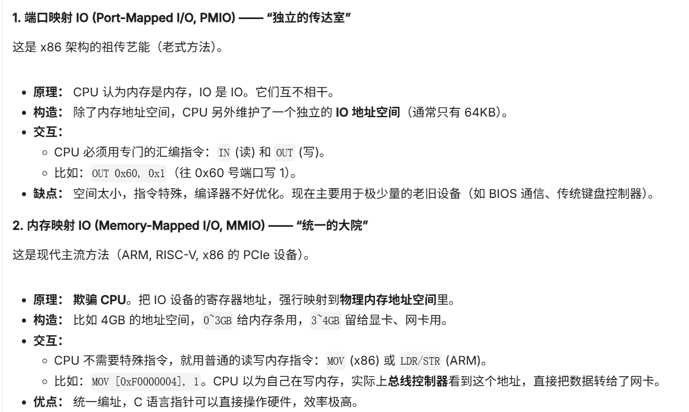

## 对于IO设备的操作

[Core Dumped: IO devices](https://www.youtube.com/watch?v=tadUeiNe5-g)

从以前的端口映射到内存映射，从以前的遍历扫描检测到ISR(中断服务)

内存映射与端口映射的区别

一次基本的完整的驱动过程：

# 一次基本的、完整的 IO 驱动交互过程

### 1. 用户层 (User Space)
[ 应用程序 ]
   ↓ 调用系统 API (如 write, send)
   "我要往外发数据！"

### 2. 软件层 (Kernel & Driver)
[ 操作系统内核 ]
   ↓ 查找设备对应的驱动
[ 设备驱动程序 ]
   ↓ 查询硬件映射表
   "明白！该硬件的控制寄存器映射在物理地址 0xA000"
   ↓ 生成汇编指令
   `MOV [0xA000], DATA`  (将数据写入该地址)

### 3. 硬件执行层 (CPU Core)
[ CPU 核心 ]
   ↓ 执行 MOV 指令
   "总线控制器，帮我把数据送到地址 0xA000！"

### 4. 传输层 (System Bus Architecture)
[ 总线控制器 / 北桥 ]  <-- **关键分流点 (Address Decoding)**
   │
   ├── 若地址在 0x0000 - 0x7FFF
   │    ↓
   │    [ 内存控制器 (MMU/DDR) ] -->[ 物理内存条 (DRAM) ]
   │
   └── 若地址是 0xA000 (命中 MMIO 范围)
        ↓
        [ PCIe / 系统总线 ]
        ↓
        [ IO 设备 (如显卡、网卡) ]
             ↓
             [ 设备内部寄存器 ]  <-- **最终目的地**
             (硬件收到信号，开始工作)
