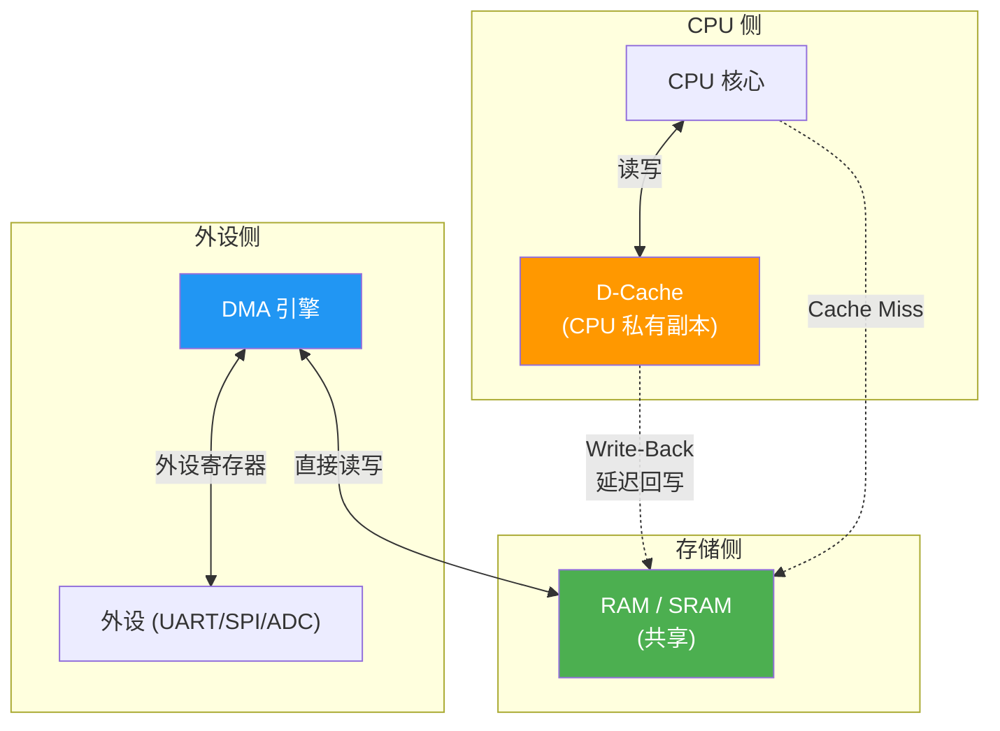
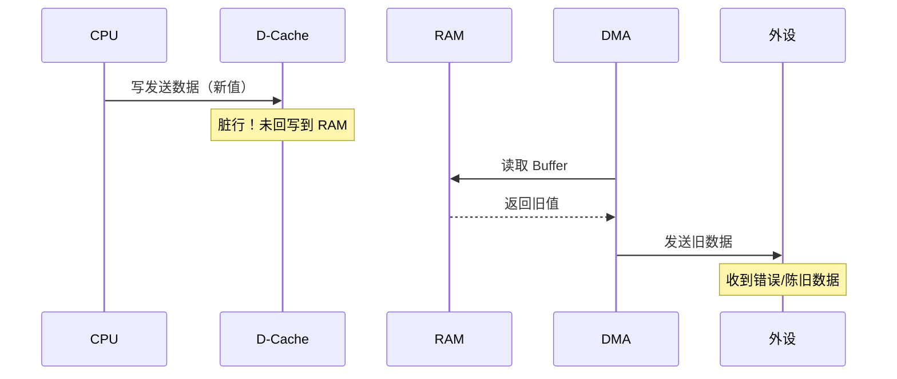
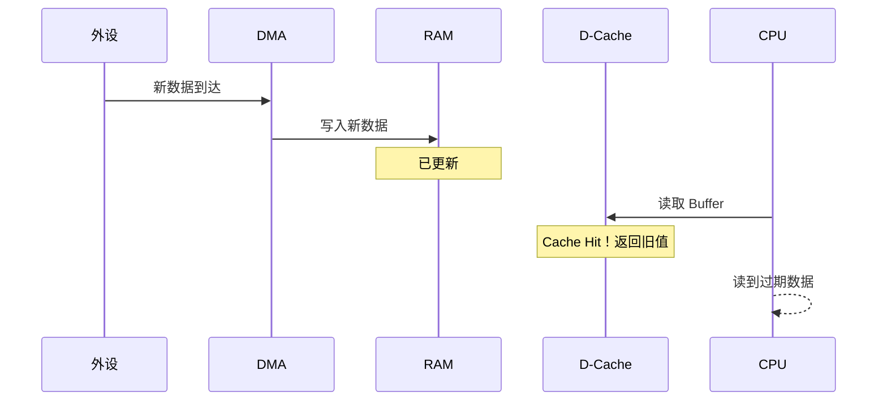
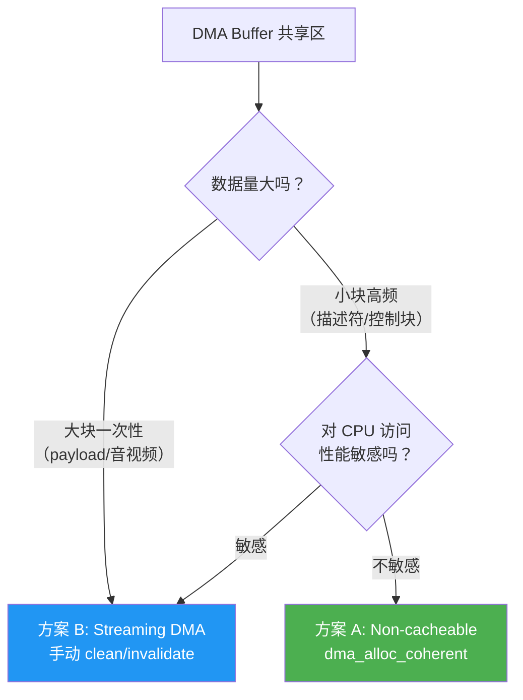

---
aliases:
  - Cache一致性
  - DMA Cache Coherency
  - Cache维护
tags:
  - 嵌入式
  - 硬件与芯片
  - 内存
  - DMA
  - Cortex-M7
date: 2026-03-03
status: evergreen
related:
  - "[[DMA(直接存储器访问)]]"
  - "[[MMU(内存管理单元)]]"
  - "[[存储器总体认知]]"
---

# DMA 与 Cache 一致性

> [!abstract] 核心本质
> 在非硬件一致性系统中，CPU 主要读写 Cache，DMA 直接读写 RAM。如果在所有权切换点不做 Cache 维护，就会出现随机错包、旧数据、偶现异常。理解 Cache Line 粒度和所有权模型是解决此类问题的关键。

## 1. 系统模型（Big Picture）
- **CPU**：面向 Cache 的高频访问方。
- **DMA**：外设与 RAM 之间的数据搬运方，不直接访问 CPU 私有 Cache。
- **RAM**：DMA 的真实读写目标。
- 核心矛盾：CPU 看到的"最新值"可能只在 Cache 中，DMA 看到的还是 RAM 旧值。



## 2. 两个典型故障模型

### Tx 路径（CPU -> DMA -> 外设）
1. CPU 写发送 Buffer（数据先进入 Cache，未必立刻回写 RAM）。
2. DMA 从 RAM 读取，读到旧值。
3. 外设发出错误帧或陈旧数据。



### Rx 路径（外设 -> DMA -> CPU）
1. DMA 将新数据写入 RAM。
2. CPU 读取时命中旧 Cache Line。
3. CPU 看见旧数据，表现为"数据卡住"或"偶现不更新"。



## 3. 根因与关键术语
- **Write-Back**：写回策略导致脏数据延迟落 RAM。
- **Cache Line**：cache 维护最小粒度是行，不是字节。
- **False Sharing**：DMA Buffer 与 CPU 热变量共享同一 Cache Line，易触发覆盖。
- **Ownership Rule**：map 给 DMA 后，CPU 在 unmap 前不得访问该区域。

## 4. 必须遵守的工程规则
1. DMA Buffer 起始地址按 **Cache Line** 对齐。
2. DMA Buffer 长度按 Cache Line 整数倍对齐。
3. DMA Buffer 与 CPU 高频变量隔离，禁止共享一条 Cache Line。
4. 明确所有权边界：`map -> DMA owns -> unmap -> CPU owns`。
5. 禁止同时使用 cached/non-cached 别名地址访问同一物理区。

## 5. 方案选型

### 方案 A：Coherent / Non-cacheable（稳定优先）
- 思路：通过 [[MMU(内存管理单元)]] / MPU 把共享区设为 Non-cacheable。
- Linux：`dma_alloc_coherent()`。
- FreeRTOS/裸机：将共享段配置为 `Non-cacheable + Shareable`。
- 适用：描述符、控制块、小规模高频共享区。
- 代价：CPU 访问性能下降。

### 方案 B：Streaming DMA（性能优先）
- 思路：数据面继续使用 cache，在边界点做 clean/invalidate。
- Linux 常见 API：`dma_map_single()` / `dma_unmap_single()`。
- FreeRTOS/OSAL 常见 API：`CacheP_wb()` / `CacheP_Inv()`。
- 适用：大块、一次性数据传输（网络 payload、音视频 buffer）。



## 6. Linux 实战流程（简版）

### CPU -> 外设（`DMA_TO_DEVICE`）
1. CPU 填充 Buffer。
2. `dma_map_single(..., DMA_TO_DEVICE)`。
3. 启动 DMA。
4. 完成后 `dma_unmap_single()`。

### 外设 -> CPU（`DMA_FROM_DEVICE`）
1. 准备接收 Buffer。
2. `dma_map_single(..., DMA_FROM_DEVICE)`。
3. 启动 DMA 接收。
4. 完成后 `dma_unmap_single()`。
5. CPU 再读取数据。

## 7. FreeRTOS / 裸机实战要点
- 若用 MPU 方案：在启动早期完成区域属性配置。
- 若用手动维护方案：
  - Tx 前 `CacheP_wb()`。
  - Rx 后 `CacheP_Inv()`。
- TI R5F 常见做法：覆盖弱符号配置（如 `gCslR5MpuCfg`），避免直接改原厂 `startup.c`。

### 7.1 STM32H7 (Cortex-M7) 裸机实战

Cortex-M7 带有 D-Cache，是嵌入式开发中最常遇到 Cache 一致性问题的内核。

```c
#include "core_cm7.h"

/* --- Tx 路径：CPU → DMA → 外设 --- */
void dma_tx_prepare(uint8_t *buf, uint32_t size)
{
    /* CPU 写完数据后，把 Cache 中的脏数据刷到 SRAM */
    SCB_CleanDCache_by_Addr((uint32_t *)buf, size);
    /* 之后启动 DMA 发送，DMA 从 SRAM 读到最新数据 */
}

/* --- Rx 路径：外设 → DMA → CPU --- */
void dma_rx_complete(uint8_t *buf, uint32_t size)
{
    /* DMA 写完数据到 SRAM 后，作废 Cache 中的旧副本 */
    SCB_InvalidateDCache_by_Addr((uint32_t *)buf, size);
    /* 之后 CPU 读取时，会从 SRAM 重新加载最新数据 */
}

/* --- Buffer 对齐声明 --- */

/* 方法 1：编译器属性对齐 */
__attribute__((aligned(32))) uint8_t dma_buf[256];

/* 方法 2：链接脚本中分配到独立 section */
/* .dma_buffer (NOLOAD) : { *(.dma_buffer) } > RAM */
/* 然后：__attribute__((section(".dma_buffer"))) uint8_t dma_buf[256]; */
```

> [!note] Cortex-M3/M4 无此问题
> Cortex-M3/M4 没有 D-Cache，F1/F4 系列不存在 Cache 一致性问题。
> 只有 Cortex-M7（STM32H7）及以上内核才需要关注。

## 8. 高风险点：Cache Line 伪共享
示例：一个结构体中，`cpu_flag` 与 `dma_buf` 落在同一条 **Cache Line**。CPU 仅修改 `cpu_flag` 也会让整行变脏；随后错误的维护顺序可能把旧 `dma_buf` 回写覆盖 DMA 新数据。

建议：
- 控制字段与 DMA 数据区分离到不同 cache line。
- 对 descriptor/data 使用不同 section 与对齐策略。

## 9. 常见误区
- 误区 1：出问题时只临时加一次 invalidate。
- 误区 2：把所有共享内存都设为 non-cacheable。
- 误区 3：直接修改 SDK 原厂启动文件，导致升级不可维护。
- 误区 4：认为 Cortex-M3/M4 也有 Cache 一致性问题。
  实际上 Cortex-M3/M4 没有 D-Cache，不存在此问题。
  只有 Cortex-M7 (STM32H7) 及以上才有 D-Cache。

## 10. 排查清单（Debug Checklist）
- 是否确认平台是 coherent 还是 non-coherent DMA？
- DMA Buffer 是否 line 对齐且长度取整？
- map/unmap 生命周期内是否有 CPU 越权访问？
- 中断里是否在正确时机调用 clean/invalidate？
- 是否存在 cached/non-cached 混用别名？
- 描述符区与 payload 区是否已分策略管理？

## 11. 继续阅读

- [[DMA(直接存储器访问)]] — DMA 控制器的工作原理与总线仲裁
- [[MMU(内存管理单元)]] — 通过 MMU/MPU 配置内存区域的 Cache 属性
- [[存储器总体认知]] — Cache 在存储层次中的位置与工作原理
- [[内存_概览]] — 内存知识体系总览
- [多核并发的处理](../../操作系统与内核/多核并发的处理.md) — 多核场景下的 Cache 一致性扩展
