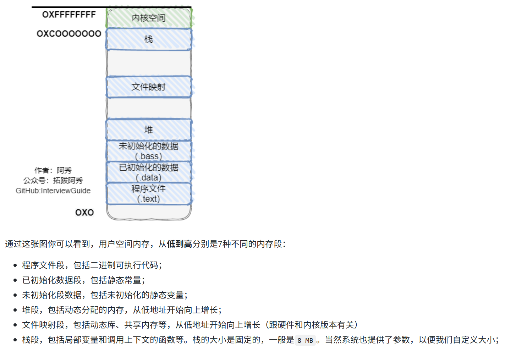
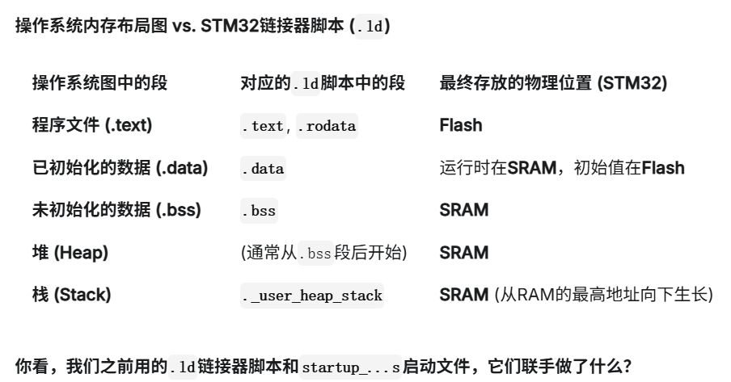
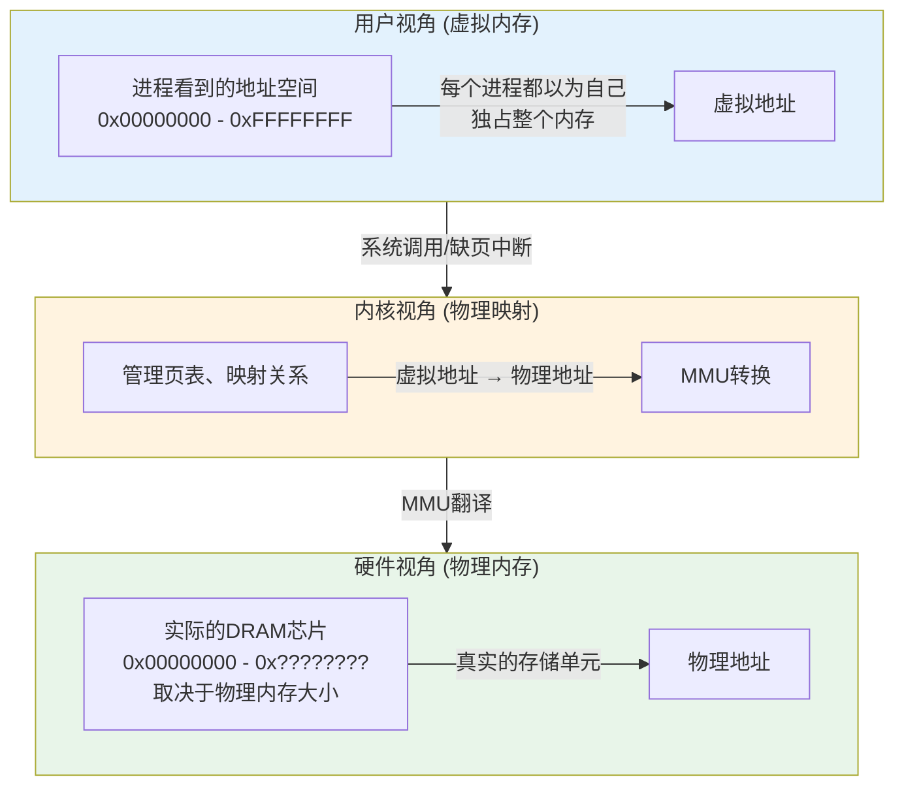
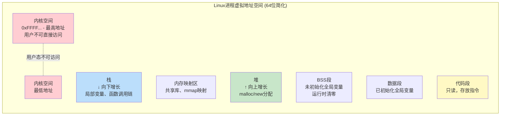
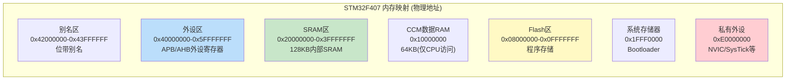
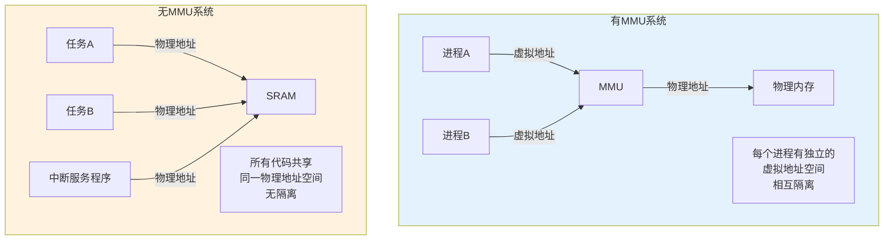
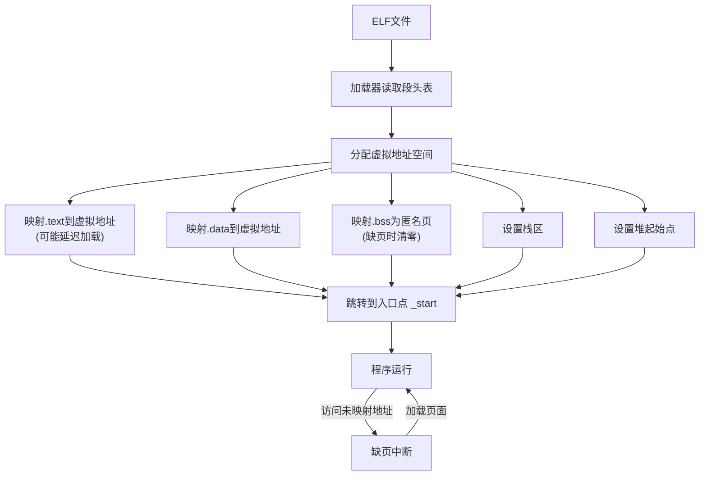
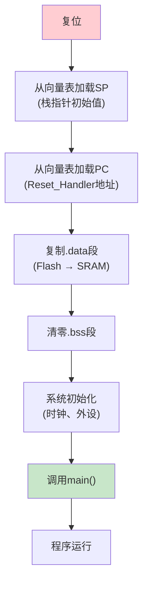
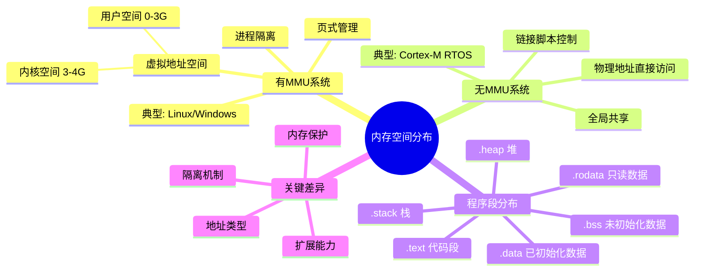

---
aliases:
  - 虚拟内存
  - 进程地址空间
  - 内存布局
  - Memory Layout
tags:
  - 嵌入式
  - 硬件与芯片
  - 内存
  - 虚拟内存
  - 链接脚本
date: 2026-04-26
status: evergreen
related:
  - "[[存储器总体认知]]"
  - "[[MMU(内存管理单元)]]"
  - "[[STM32F407启动源码的理解]]"
  - "[[DMA 与 Cache 一致性]]"
---

> [!abstract]
> 内存空间分布可以从三种视角理解：用户视角（虚拟内存）、内核视角（物理映射）、硬件视角（物理地址）。有 MMU 的系统（Linux/Windows）使用虚拟地址实现进程隔离；无 MMU 的系统（Cortex-M 裸机/RTOS）直接操作物理地址，由链接脚本控制布局。





---

## 1. 先建立核心概念：三种视角看内存



---

## 2. 有MMU系统：Linux/Windows 进程地址空间

适用于**有MMU的处理器**（Cortex-A、x86、RISC-V Linux等）。



### 关键理解点

| 段 | 来源 | 生命周期 | 特点 |
|---|------|---------|------|
| **Text** | 编译后的代码 | 程序运行期间 | 只读、可共享 |
| **Data** | 已初始化全局/静态变量 | 程序运行期间 | 读写、占磁盘空间 |
| **BSS** | 未初始化全局/静态变量 | 程序运行期间 | 运行时清零、不占磁盘 |
| **Heap** | `malloc`/`new`动态分配 | 手动管理 | 向上增长、碎片问题 |
| **Stack** | 编译器自动管理 | 函数调用链 | 向下增长、自动回收 |
| **MMAP** | `mmap`系统调用 | 手动管理 | 文件映射、共享内存 |

---

## 3. 无MMU系统：嵌入式MCU内存布局

这是**Cortex-M、裸机系统**的视角，**没有虚拟内存**，地址就是物理地址。



### MCU程序的内存分布（由链接脚本决定）


**关键差异**：
- **没有虚拟内存**：地址就是物理地址
- **Flash和SRAM分离**：代码在Flash运行，数据在SRAM
- **链接脚本控制**：`.ld`文件决定各段位置

---

## 4. 核心对比：有MMU vs 无MMU



| 特性 | 有MMU系统 | 无MMU系统 |
|------|----------|----------|
| **地址类型** | 虚拟地址 → 物理地址 | 直接物理地址 |
| **进程隔离** | ✅ 每个进程独立地址空间 | ❌ 全局共享 |
| **内存保护** | ✅ 页级权限控制 | ⚠️ MPU可选 |
| **内存扩展** | ✅ 支持swap/页面换出 | ❌ 只有物理内存 |
| **典型系统** | Linux、Android、Windows | RTOS、裸机 |
| **典型芯片** | Cortex-A、x86、RISC-V | Cortex-M0/M3/M4 |

### 4.1 MPU：没有 MMU 时的折中方案

Cortex-M 系列（M0+/M3/M4/M7）没有 MMU，但部分型号有 **MPU（Memory Protection Unit）**：

| 能力 | MMU | MPU |
|------|-----|-----|
| 地址翻译 | 虚拟 → 物理 | 不支持 |
| 粒度 | 页（4KB） | 区域（最小 32B） |
| 区域数量 | 理论无限 | 通常 8~16 个 |
| 进程隔离 | 支持 | 不支持 |
| 权限控制 | 页级读写执行 | 区域级读写执行 |

MPU 可以做的是：设置某段内存为只读、不可执行、仅特权级可访问。
这在 RTOS 中用于保护任务栈、防止用户任务访问内核数据区。
详见 [[MMU(内存管理单元)]] 中 MMU vs MPU 对比。

---

## 5. 深入理解：程序加载与运行的全过程

### 5.1 有MMU系统：ELF加载过程



详细的缺页异常处理流程见 [[MMU(内存管理单元)]]。

### 5.2 无MMU系统：MCU启动过程



启动汇编代码的逐行解析见 [[STM32F407启动源码的理解]]，其中详细讲解了 `Reset_Handler` 的每个阶段。

---

## 6. 链接脚本：内存布局的"设计图纸"

链接脚本的逐行对照解析见 [[STM32F407启动源码的理解]] 中"链接器布局逻辑"一节。

关键符号速查：

| 符号 | 含义 | 用途 |
|------|------|------|
| `_sdata` / `_edata` | `.data` 段在 RAM 中的起止地址 | 启动代码据此搬运 |
| `_sidata` | `.data` 段在 Flash 中的存放地址 | 搬运的源地址 |
| `_sbss` / `_ebss` | `.bss` 段在 RAM 中的起止地址 | 启动代码据此清零 |
| `_estack` | 栈顶指针（RAM 末尾） | 硬件加载 MSP 的初始值 |

---

## 7. 栈 vs 堆：嵌入式开发中最容易踩的坑

| 特性 | 栈 (Stack) | 堆 (Heap) |
|------|-----------|-----------|
| 分配方式 | 编译器自动（函数进入/退出） | 程序员手动（malloc/free） |
| 增长方向 | 向下（高地址 → 低地址） | 向上（低地址 → 高地址） |
| 速度 | 极快（只需移动 SP 寄存器） | 较慢（需搜索空闲链表） |
| 碎片 | 无（LIFO，自动回收） | 有（频繁分配释放产生空洞） |
| 大小限制 | 嵌入式通常几 KB | 取决于剩余 SRAM |
| 生命周期 | 函数返回自动释放 | 必须手动 free |
| 所属段 | `.stack` | `.heap` |

### 7.1 嵌入式开发建议

1. **优先使用栈和全局变量**，尽量避免动态分配
2. 如果必须用堆：使用固定大小的**内存池**替代 malloc
3. 链接脚本中检查栈大小：`_Min_Stack_Size` 至少 1KB
4. 局部数组不要太大：`int buf[4096];` 在栈上直接占 16KB → 栈溢出风险

```c
// 危险：大数组放在栈上
void process(void) {
    int buf[4096];  // 16KB！可能直接栈溢出
    // ...
}

// 安全：使用全局数组或 static
static int buf[4096];  // 放在 .bss 段，不占栈空间
void process(void) {
    // 使用 buf...
}
```

---

## 8. 多架构对比总结



---

## 9. 大师的工程建议

### 9.1 嵌入式开发中的常见陷阱

| 问题 | 原因 | 解决方案 |
|------|------|----------|
| **栈溢出** | 局部变量过大或递归太深 | 链接脚本预留足够空间，加栈保护 |
| **堆碎片** | 频繁malloc/free | 使用内存池、静态分配 |
| **Flash空间不足** | .data/.bss初始值占空间 | 优化常量存储、使用压缩 |
| **SRAM不足** | 全局变量太多 | 使用外部SDRAM、优化数据结构 |

### 9.2 调试技巧

```bash
# 查看ELF段大小
arm-none-eabi-size firmware.elf

输出示例：
   text    data     bss     dec     hex filename
  12340     120    2560   15020    3aac firmware.elf

解读：
  text + data     = Flash 占用量（12,460 字节）
  data + bss      = SRAM 静态占用量（2,680 字节）
  总 SRAM - (data + bss) = 栈 + 堆的可用空间
  
  如果 SRAM = 128KB，则栈+堆可用 = 128×1024 - 2680 = 128,392 字节

# 查看详细段分布
arm-none-eabi-objdump -h firmware.elf

# 生成内存映射图
arm-none-eabi-nm -S --size-sort firmware.elf > map.txt
```

### 9.3 推荐深入方向

1. **MMU页表机制**：多级页表、TLB、页面换入换出
2. **链接脚本深入**：VMA vs LMA、符号导出、自定义段
3. **RTOS内存管理**：堆内存池、多堆管理、内存保护单元(MPU)

---

## 10. 参考来源

- [BitLemon: Why Programs Use Stack, Heap, and Other Memory Segments - YouTube](https://www.youtube.com/watch?v=EXIxAPITb7U&list=PL38NNHQLqJqZoDp4CrAueD1aBin7OebEL&index=7) — 进程地址空间详解
- 阿秀八股文 — 用户内存空间分配部分

## 11. 继续阅读

- [[存储器总体认知]] — 存储器物理介质的层次结构
- [[MMU(内存管理单元)]] — 虚拟地址到物理地址的翻译机制、页表、TLB
- [[STM32F407启动源码的理解]] — 启动汇编代码逐行解析、链接脚本对照
- [[DMA 与 Cache 一致性]] — Cache 对内存访问的影响
- [[内存_概览]] — 内存知识体系总览
