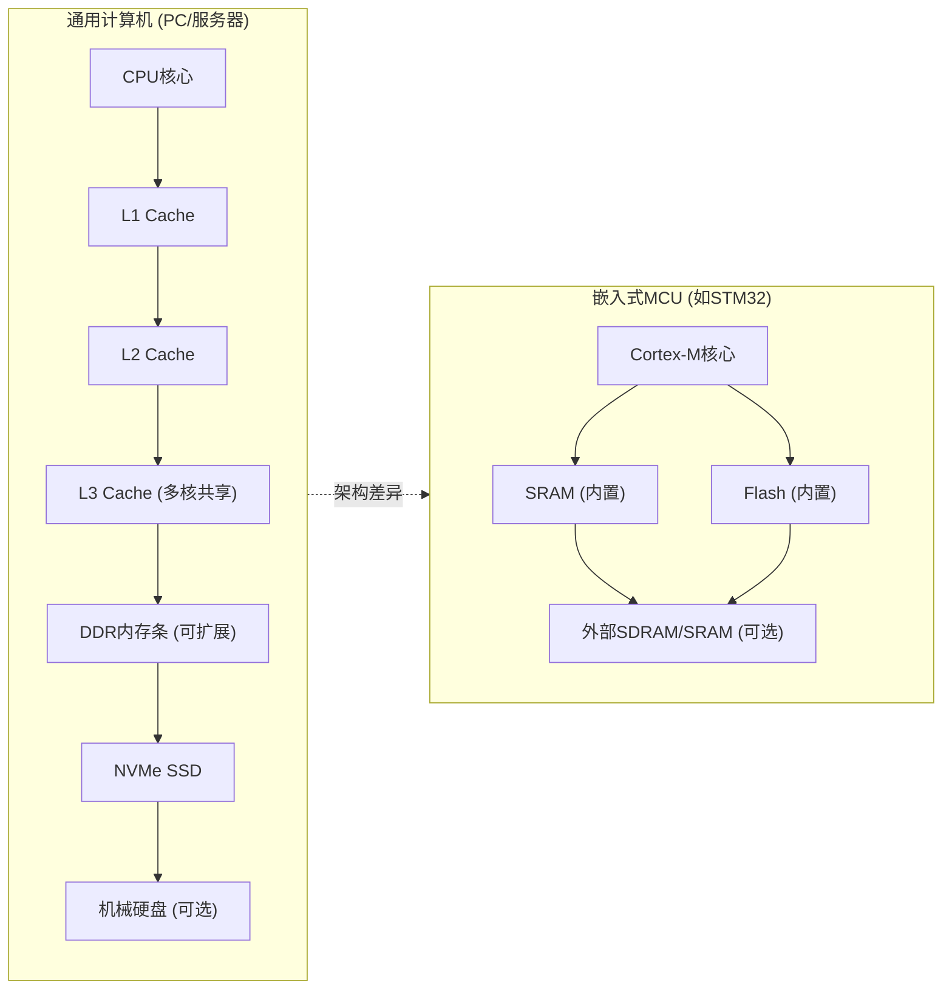
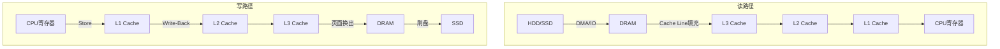
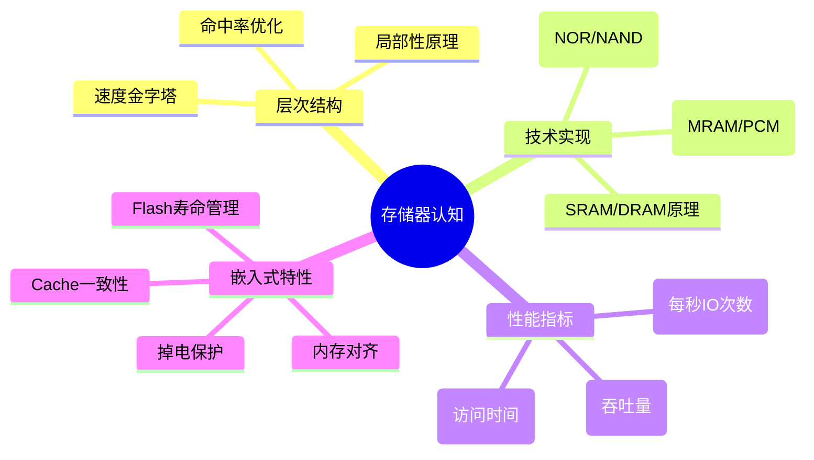

---
aliases:
  - 存储器层次结构
  - 存储金字塔
  - Memory Hierarchy
tags:
  - 嵌入式
  - 硬件与芯片
  - 内存
  - 存储器
date: 2026-04-26
status: evergreen
related:
  - "[[寄存器的大体认知]]"
  - "[[内存空间分配]]"
  - "[[DMA 与 Cache 一致性]]"
  - "[[MMU(内存管理单元)]]"
---


> [!abstract] 核心摘要
> 存储器越靠近 CPU 速度越快、容量越小、成本越高。本章从存储金字塔出发，梳理 SRAM/DRAM/Flash 等介质的物理原理，对比嵌入式 MCU 与通用 PC 的存储架构差异，建立完整的存储器认知框架。

---

## 1. 存储器层次结构的本质：速度、容量、成本的三角博弈

> [!abstract] 🔺 存储器层次结构金字塔 (Memory Hierarchy)
> 存储器越靠近 CPU，速度越快，造价越高，容量越小；反之亦然。
> 
> | 速度阶梯 | 存储层级 / 介质 | 访问延迟 | 典型容量 |
> | :---: | :--- | :--- | :--- |
> | 🥇极速 | **CPU 寄存器** (Register) | `~1 ns` | 几百 Bytes |
> | 🥈极速 | **L1 Cache** (SRAM) | `~1-2 ns` | 32 - 64 KB |
> | 🥉极速 | **L2 Cache** (SRAM) | `~3-10 ns` | 256 KB - 1 MB |
> | 🏎️超快 | **L3 Cache** (SRAM) | `~10-20 ns` | 2 - 64 MB |
> | 🚗较快 | **主内存** (DRAM) | `~50-100 ns`| 4 - 128 GB |
> | 🚲较慢 | **固态硬盘** (SSD/NAND) | `~25 μs` | 256 GB - 4 TB |
> | 🚶极慢 | **机械硬盘** (HDD/磁盘) | `~5-10 ms` | 1 - 20 TB |

**核心规律**：越往上，速度越快、容量越小、每字节成本越高；越往下，速度越慢、容量越大、每字节成本越低。

---

## 2. 从技术实现维度分类

| 类型 | 技术原理 | 代表器件 | 易失性 | 典型应用 |
|------|----------|----------|--------|----------|
| **SRAM** | 锁存器（6个晶体管存1bit），集成于CPU内部，速度非常快，断电无效 | CPU Cache | 易失 | L1/L2/L3缓存 |
| **DRAM** | 电容充放电（1晶体管+1电容），俗称内存条，速度较快，断电无效 | DDR4/DDR5内存条 | 易失 | 主内存 |
| **NOR Flash** | 浮栅晶体管，随机读取快 | 嵌入式Flash | 非易失 | MCU程序存储、BIOS |
| **NAND Flash** | 浮栅晶体管，页读写，密度高 | SSD、eMMC、U盘 | 非易失 | 大容量存储 |
| **MRAM** | 磁阻效应 | 新型非易失RAM | 非易失 | 车载、工业（新兴） |
| **HDD** | 磁盘磁头机械读写 | 机械硬盘 | 非易失 | 冷数据存储 |
| **SSD** | 由PCB、控制芯片、NAND Flash组成，部分带DRAM缓存，断电有效 | SATA/NVMe SSD | 非易失 | 主流外部存储 |

#### 2.1.1 NOR Flash vs NAND Flash

| 特性 | NOR Flash | NAND Flash |
|------|-----------|------------|
| 读取方式 | 随机读取（像RAM一样按地址读） | 页读取（必须整页读出） |
| 写入方式 | 按字节/字写入 | 按页写入 |
| 擦除单位 | 扇区（4KB~128KB） | 块（128KB~512KB） |
| 密度 | 低（存储单元面积大） | 高（存储单元面积小） |
| 可靠性 | 高（位翻转少） | 较低（需ECC校验） |
| XIP支持 | 支持（MCU可直接在Flash执行代码） | 不支持 |
| 典型应用 | MCU内置Flash、BIOS | SSD、eMMC、U盘 |

---

## 3. 嵌入式 vs 通用计算机的存储架构对比



**关键差异**：
1. **PC**：存储器是分立的，可插拔扩展；有多级缓存；内存条可换
2. **MCU**：存储器集成在芯片内部；通常无缓存（Cortex-M7有L1）；Flash直接映射到地址空间

---

## 4. 数据流动的完整视角

数据必须一级一级上下传：



**关键概念**：
- **Cache Line**：缓存传输的最小单位（通常64字节），即使只读1字节，也会拉取整行
- **Write-Back vs Write-Through**：写回（延迟写）vs 写通（立即写），影响性能和数据安全
- **DMA**：直接内存访问，绕过CPU搬运数据

### 4.1 Cache Line 详解

假设 Cache Line = 64 字节：

```
CPU 只想读 1 个字节 → 硬件实际从内存拉取 64 字节整行
为什么？局部性原理：用了1字节，大概率马上要用旁边的数据
类比：去图书馆借书，不会只借一页，而是把整本书借走
```

这带来一个工程影响：即使你只修改 1 个字节，整个 Cache Line 都会被标记为"脏"，
Write-Back 时整行 64 字节都要写回内存。这也是 [[DMA 与 Cache 一致性]] 问题的根源之一。

---

## 5. 嵌入式工程师必须关注的特殊点

| 问题 | PC端 | 嵌入式端 |
|------|------|----------|
| **Flash擦写寿命** | SSD有磨损均衡算法，不用操心 | MCU Flash仅1-10万次，需谨慎设计 |
| **内存碎片** | 有虚拟内存，碎片影响小 | 无MMU，碎片可能导致分配失败 |
| **Cache一致性** | 硬件自动维护 | Cortex-M7需手动维护D-Cache |
| **掉电保护** | 有UPS/日志系统 | 需自己设计掉电检测+数据保护 |

### 5.1 嵌入式特有存储介质

通用 PC 的存储器是标准化、可插拔的，但嵌入式 MCU 内部有特殊的存储区域：

| 介质 | 特点 | 典型芯片 |
|------|------|----------|
| **CCM RAM** | 仅 CPU 可访问，零等待，DMA 不可见 | STM32F4 (64KB) |
| **DTCM** | 数据紧耦合内存，与 CPU 同频 | Cortex-M7 |
| **ITCM** | 指令紧耦合，零等待取指 | Cortex-M7 |
| **OCRAM** | 通用片内 SRAM | i.MX RT 系列 |
| **外部 SDRAM** | 通过 FSMC/FMC 扩展，容量大但延迟高 | STM32F429 |

> [!warning] CCM RAM 陷阱
> STM32F407 的 64KB CCM RAM (0x10000000) 只能被 CPU 访问，DMA 控制器看不到这片区域。
> 如果把 DMA Buffer 放到 CCM → DMA 读到垃圾数据。详见 [[STM32F407启动源码的理解]]。

---

## 6. 建议的认知框架总结



---

> [!tip] 大师的工程建议
> 理解"为什么"比记住"是什么"更重要；嵌入式视角下很多 PC 端"透明"的机制需要手动处理；延伸学习 DRAM 刷新机制、Flash FTL 原理、Cache 映射方式。

---

## 7. 参考来源

- [How does Computer Memory Work? - YouTube](https://www.youtube.com/watch?v=7J7X7aZvMXQ) — DRAM 工作原理动画
- [How do SSDs Work? - YouTube](https://www.youtube.com/watch?v=5Mh3o886qpg) — SSD 内部结构与工作原理

## 8. 继续阅读

- [[寄存器的大体认知]] — 从 D 触发器到 CPU 寄存器和外设寄存器
- [[内存空间分配]] — 程序在内存中的布局：栈、堆、代码段、数据段
- [[DMA 与 Cache 一致性]] — Cache Line 粒度问题引发的数据不一致
- [[MMU(内存管理单元)]] — 虚拟内存与物理内存的映射机制
- [[内存_概览]] — 内存知识体系总览
