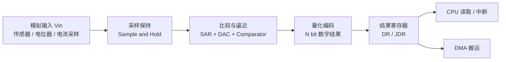
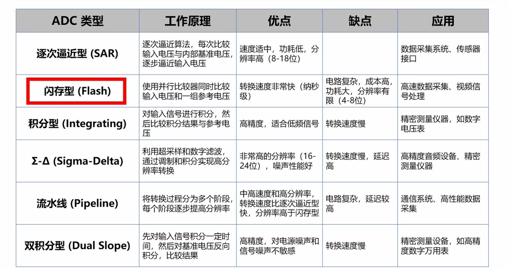
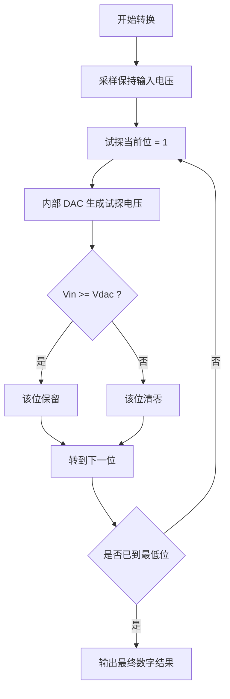
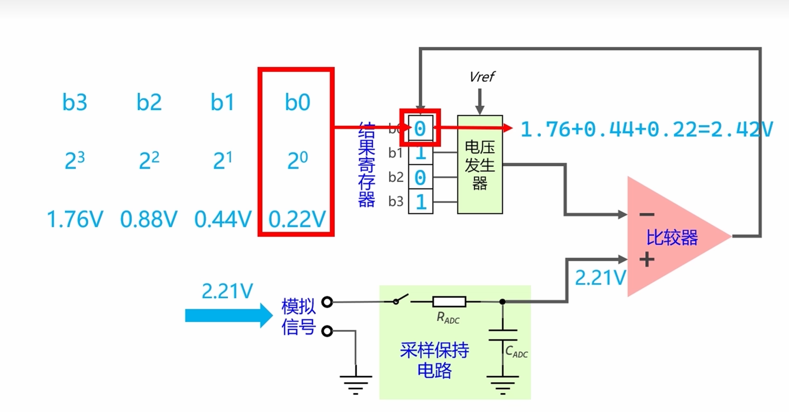
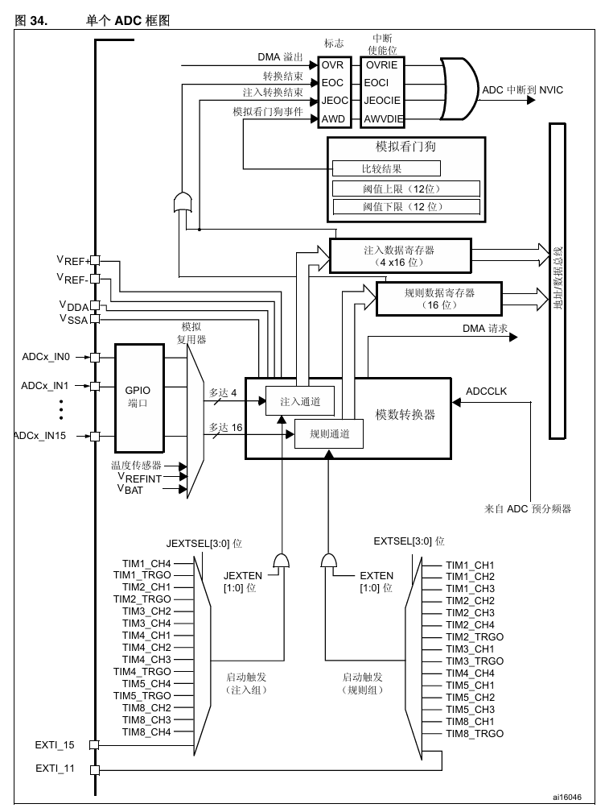
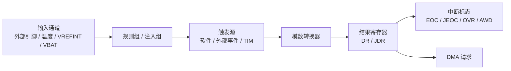
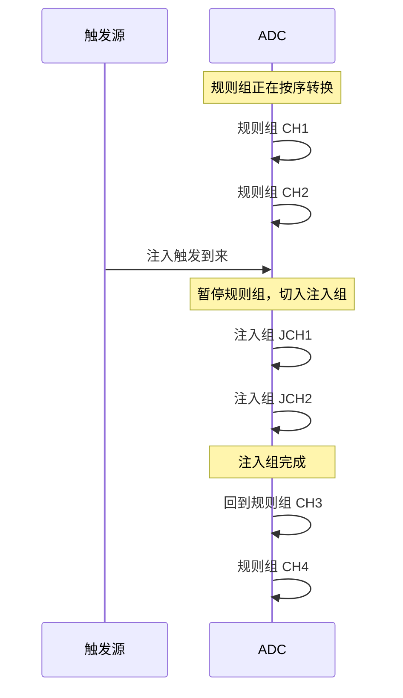
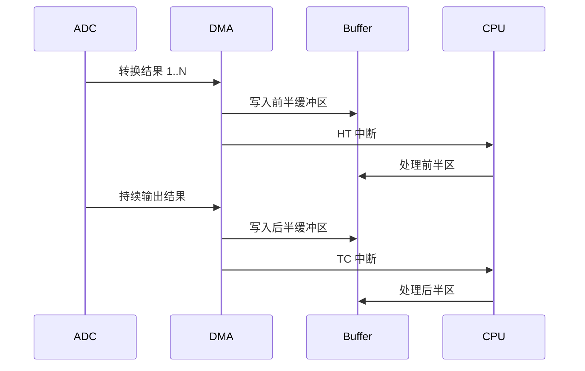

---
aliases:
  - ADC
  - 模数转换
  - ADC初步理解
  - 模数转换器
tags:
  - 嵌入式
  - 硬件与芯片
  - 外设
  - ADC
  - 数据采集
date: 2026-04-24
status: ✅完成
related:
  - "[[TIM定时器基础概念]]"
  - "[[DMA(直接存储器访问)]]"
  - "[[时钟系统基础概念]]"
  - "[[中断的基础理解]]"
---
 
# ADC 模块初步理解

> [!abstract] 核心本质
> `ADC`（Analog-to-Digital Converter，模数转换器）的任务，是把连续变化的模拟电压，转换成 MCU 能处理的离散数字量。  
> 对 MCU 来说，ADC 不是“读一个电压值”，而是一整条硬件链路：**输入选择 -> 采样保持 -> 逐次逼近/比较 -> 量化编码 -> 结果寄存器 -> 中断或 DMA 输出**。  
> 这篇笔记先建立通用原理，再映射到 `STM32` 常见的 `SAR ADC` 外设实现。

## 1. 全局视角：ADC 到底在做什么

很多外设处理的是数字事件，例如 [[TIM定时器基础概念]] 处理时间基准，[[中断的基础理解]] 处理事件通知；而 ADC 处理的是**模拟世界进入数字系统的入口**。



| 阶段 | 本质问题 | 工程关注点 |
| --- | --- | --- |
| 输入选择 | 现在采谁 | 外部通道、内部通道、引脚模拟模式 |
| 采样保持 | 如何在某个瞬间“抓住”电压 | 采样时间、源阻抗、采样电容 |
| 比较逼近 | 输入大概落在哪个区间 | `SAR`、比较器、内部 DAC |
| 量化编码 | 连续量映射成哪个离散码值 | 分辨率、`LSB`、量化误差 |
| 结果输出 | 转换完如何送到软件侧 | `DR/JDR`、`EOC`、DMA、中断 |

> [!note] 为什么 MCU 里常见的是 SAR ADC
> MCU 追求的通常是“速度够用、功耗可控、面积不大、分辨率合适”。  
> 在这组权衡里，`SAR ADC` 往往是最平衡的方案，所以后文也主要围绕它理解。



上图给了 ADC 类型的大图景。当前这篇笔记只抓住一个结论：

- `Flash ADC` 很快，但成本高、分辨率低
- `Sigma-Delta ADC` 分辨率很高，但延迟大，更多见于高精度低速场景
- `SAR ADC` 是 MCU 世界最常见的主力

## 2. 关键概念：数字结果到底怎么来的

### 2.1 参考电压 `Vref`

ADC 不会直接告诉你“这是 2.137V”，它告诉你的本质是：**输入电压在参考范围里占了多少份**。

如果工作范围是：

$$
0 \sim V_{ref}
$$

那么输入电压 `Vin` 会被映射到这个范围里的某个离散等级。

> [!tip] 直觉化理解
> `Vref` 决定 ADC 这把“尺子有多长”，分辨率决定这把尺子“被切成多少格”。

### 2.2 分辨率与 `LSB`

如果 ADC 是 `N` 位，那么总共有：

$$
2^N
$$

个量化等级。

例如 `12 位 ADC`：

$$
2^{12}=4096
$$

单个最小台阶通常叫 `LSB`（Least Significant Bit）：

$$
LSB = \frac{V_{ref}}{2^N}
$$

如果 `Vref = 3.3V`、`N = 12`，则：

$$
LSB \approx \frac{3.3}{4096} \approx 0.805mV
$$

也就是数字结果每跳 1，大约对应 `0.805mV`。

### 2.3 量化误差

模拟量是连续的，数字结果是离散的，所以 ADC 一定存在“贴格子”的过程。

```text
真实电压落在两个量化台阶之间
ADC 只能输出其中一个最近的离散码值
```

理想情况下，量化误差通常可以按 `±0.5 LSB` 的量级去理解。

> [!note] 量化误差不是全部误差
> 工程里还会叠加偏移误差、增益误差、参考电压误差、噪声、采样不充分等问题。

### 2.4 采样时间与转换时间

ADC 不是一直“盯着”输入电压，它先要把输入电压充到内部采样保持电容上，这一步叫**采样保持**（Sample and Hold）。

| 概念 | 本质 | 主要受什么影响 |
| --- | --- | --- |
| 采样时间 | 给采样电容充电的时间 | 源阻抗、采样电容、精度要求 |
| 转换时间 | 采样后内部完成逼近和编码的时间 | ADC 时钟、分辨率、ADC 架构 |

#### 2.4.1 采样时间的 RC 模型

采样过程可以粗略看成一个 RC 充电过程：

$$
V_{cap}(t)=V_{in}\times(1-e^{-t/RC})
$$

这里：

- `R` 可以粗略看成信号源内阻 + 开关导通电阻
- `C` 是 ADC 内部采样电容
- `Vcap` 是采样电容上最终被“抓住”的电压

如果 `t` 不够长，`Vcap` 还没逼近 `Vin`，ADC 就已经开始转换，结果自然会偏。

常见工程直觉：

- `5τ`：已经很接近最终值，适合一般精度理解
- `9τ`：更接近最终值，适合更高精度保守估算

```text
低阻信号源 -> 充电快 -> 可用较短采样时间
高阻信号源 -> 充电慢 -> 必须增大采样时间
内部通道（温度/VREFINT 等）通常建议更长采样时间
```

> [!warning] 内部通道别偷采样时间
> 很多 STM32 系列对 `VREFINT`、温度传感器等内部通道都建议使用较长采样时间。  
> 你常见到的 `>= 17.1us` 是某些系列/示例里的经验值，不同芯片以参考手册为准。

### 2.5 ADC 时钟与转换时间公式

ADC 的速度不只由“采样时间档位”决定，还受 ADC 时钟影响。

典型时钟链路可以这样理解：

```text
系统时钟 -> APB 总线时钟 -> ADC 预分频器 -> ADC_CLK -> 采样 + 转换
```

在 STM32 里，常见思路是：

- `APB2` 或专用异步时钟作为 ADC 时钟来源
- 再经过预分频得到 `ADC_CLK`
- 最终 ADC 在 `ADC_CLK` 节拍下完成采样和逐次逼近

不同系列的 ADC 时钟上限差异很大，面试时说“看芯片系列”比背死一个数字更稳：

| 系列 | 常见理解 | 备注 |
| --- | --- | --- |
| `STM32F1` | 常见上限约 `14MHz` | 老系列，经典面试点 |
| `STM32F4` | 常见上限约 `36MHz` | 很多资料都以它举例 |
| `STM32G0/H7` | 更灵活 | 往往支持更灵活时钟树/更高性能，必须看 RM |

对于经典 `12-bit SAR ADC`，很多 STM32 资料里常见的转换时间公式是：

$$
T_{conv}=T_{sample}+12.5\times T_{ADC\_CLK}
$$

也可以写成：

$$
T_{conv} = \frac{SampleCycles + 12.5}{f_{ADC\_CLK}}
$$

> [!note] 这个公式有适用范围
> 它适用于很多经典 STM32 `12 位 SAR ADC` 的理解和估算。  
> 不同系列、不同分辨率、不同过采样/增强模式下会有差异，实际值以参考手册为准。

#### 2.5.1 计算例子 1：最短采样

假设：

- `ADC_CLK = 36MHz`
- 采样时间 = `3 cycles`

则：

$$
T_{conv} = \frac{3+12.5}{36MHz} = \frac{15.5}{36MHz} \approx 0.43us
$$

对应理论最大吞吐大约：

$$
\frac{1}{0.43us} \approx 2.33MSPS
$$

面试里常见的速算说法可以记成：

```text
36MHz 下，最短转换大约 0.43us
也就是大约 2.2 ~ 2.3 MSPS
```

#### 2.5.2 计算例子 2：常用长一些的采样时间

假设：

- `ADC_CLK = 36MHz`
- 采样时间 = `15 cycles`

则：

$$
T_{conv} = \frac{15+12.5}{36MHz} = \frac{27.5}{36MHz} \approx 0.764us
$$

对应理论吞吐大约：

$$
\frac{1}{0.764us} \approx 1.31MSPS
$$

这也说明一个很重要的工程事实：  
**采样时间一旦拉长，最高采样率会显著下降。**

## 3. SAR ADC 是怎么逐位逼近的

`SAR` 是 `Successive Approximation Register`，中文常叫**逐次逼近型 ADC**。  
它的思路很像“二分查找电压”：

1. 先试探最高位是不是 1
2. 用内部 DAC 生成一个试探电压
3. 把试探电压和输入电压比较
4. 如果试探值太高，这一位清零；如果不高，这一位保留
5. 再试下一位，直到最低位





上图适合配合下面这句话一起记：

```text
SAR 不是一次比较直接出结果
而是从最高位到最低位，逐位试探、逐位收敛
```

> [!tip] 为什么 SAR 在 MCU 里这么常见
> 它不像 `Flash ADC` 那样堆很多比较器，也不像积分型 ADC 那样速度很慢。  
> 它靠“一个比较器 + 一个内部 DAC + 一套逐位逼近逻辑”，在复杂度和性能之间拿到了很好的平衡。

## 4. STM32 ADC 框图映射

当 ADC 落到 STM32 里，它就不再只是抽象原理，而是一个能被触发、能扫描、能中断、能 DMA 的硬件外设。



更适合读这张框图的方式，不是逐线追踪，而是拆成下面这条逻辑链：



### 4.1 输入通道

ADC 首先要解决“采谁”的问题。

在 STM32 里，输入不仅可能来自：

- `ADCx_IN0 ~ ADCx_IN15` 这类外部模拟引脚

也可能来自内部模拟源：

- 温度传感器
- `VREFINT`
- `VBAT`

这一步就是“模拟世界入口选择器”。

### 4.2 规则组与注入组

这是 STM32 ADC 里最容易让初学者混乱的一块。

| 组别 | 直觉理解 | 典型特点 |
| --- | --- | --- |
| 规则组 | 主流程采样队列 | 常规、批量、常配合 DMA |
| 注入组 | 可插队的高优先级采样 | 常与精确触发事件绑定，结果进入 `JDR` |

粗略记法：

```text
规则组 = 日常巡检
注入组 = 关键时刻插队执行
```

例如电机控制里，可能平时要循环采电位器、电流、电压；但在 PWM 某个精确相位需要立即采关键相电流，这时注入组就很有意义。

#### 4.2.1 注入组打断规则组的时序



这张图能把“插队”变成直观印象：  
**规则组不是被永久替代，而是在某个关键时刻被更高优先级的注入组抢占。**

### 4.3 触发源

ADC 不一定非要靠软件手动启动，它可以被事件触发。

常见来源包括：

- 软件触发
- 外部事件
- 定时器触发输出 `TRGO`
- 某些定时器比较事件

这也是 ADC 常与 [[TIM定时器基础概念]] 联动的根本原因：  
很多场景真正需要的不是“尽快采”，而是“**在正确的时刻采**”。

### 4.4 数据寄存器

转换完成后，结果要落到寄存器里：

- 规则组结果通常进 `DR`
- 注入组结果通常进 `JDR`

拿数据的常见方式：

1. CPU 轮询或处理中断后读寄存器
2. 通过 [[DMA(直接存储器访问)]] 自动搬运到内存数组

### 4.5 中断 / 溢出 / 模拟看门狗

| 标志/能力 | 作用 |
| --- | --- |
| `EOC` | 常规转换完成 |
| `JEOC` | 注入组转换完成 |
| `OVR` | 新数据覆盖旧数据，说明读取或搬运没跟上 |
| `AWD` | 模拟看门狗检测到结果越界 |

`AWD` 的工程直觉很重要：它不是帮你搬数据，而是在硬件层帮你守一个模拟量阈值区间。

### 4.6 四种转换模式

理解 STM32 ADC 的使用方式，最常见的是这四种模式：

| 模式 | 触发方式 | 直觉理解 | 典型用途 |
| --- | --- | --- | --- |
| 单次单通道 | 触发一次，采一次一个通道 | 最简单 | 低频偶发测量 |
| 连续单通道 | 启动后一直采同一通道 | 单点波形流 | 电位器/单路传感器连续采集 |
| 单次扫描 | 触发一次，顺序采多个通道 | 一次点名一整组 | 多路周期轮询 |
| 连续扫描 | 启动后循环扫多个通道 | 多路连续流 | 多通道长期采样 |

扫描模式里，`SQ1 ~ SQ16` 这类序列寄存器的意义可以理解为：

```text
第 1 个转换采谁 -> 第 2 个转换采谁 -> 第 3 个转换采谁 ...
```

也就是“采样队列顺序表”。

#### 4.6.1 间断模式 `Discontinuous`

它可以理解成“扫描模式的分段执行变体”：

- 原本一轮要扫多个通道
- 现在每来一次触发，只执行其中一小段
- 多次触发后再把整轮扫完

这个模式的本质不是新类型 ADC，而是**扫描队列被拆开执行**。

### 4.7 DMA + ADC 协同

连续采样时，ADC 和 DMA 几乎是天然搭档。

#### 4.7.1 两种 DMA 模式

| DMA 模式 | 行为 | 适合什么 |
| --- | --- | --- |
| `Normal` | 搬满指定长度后停止 | 一次性采一批 |
| `Circular` | 搬到缓冲区尾部后自动回绕 | 连续实时采样 |

可以这样记：

```text
DMA Normal   = 搬完这一车就停
DMA Circular = 环形传送带，搬到头接着搬
```

#### 4.7.2 HT / TC 的双半区处理思路

在环形 DMA 下，常见实时处理技巧是：

- `HT`（Half Transfer）：前半缓冲区填满
- `TC`（Transfer Complete）：后半缓冲区填满

这样可以做到：

- CPU 处理前半区时，DMA 继续往后半区写
- CPU 处理后半区时，DMA 又回去写前半区

本质上就是一种“无间隙采集 + 分块实时处理”的模式。



> [!note] HAL / CubeMX 视角
> 在 `STM32 HAL/CubeMX` 里，这通常会映射成：开启扫描、开启 DMA 请求、配置 `Normal/Circular`、然后在半满/全满回调里处理数据。

## 5. 校准

### 5.1 为什么需要校准

ADC 理想模型很漂亮，但真实芯片存在：

- 偏移误差
- 增益误差
- 工艺差异
- 温漂

校准的目的，就是尽量修正这些“现实世界的不理想”。

### 5.2 上电校准的基本思路

在很多 STM32 系列中，ADC 初始化后会先做一次校准，再开始正式采样。  
你在 HAL 里经常看到的就是类似：

```c
HAL_ADCEx_Calibration_Start(...)
```

工程直觉上可以这么记：

```text
ADC 刚上电时，先校一遍，再开始正式工作
```

### 5.3 出厂校准值与 `VREFINT`

很多 STM32 芯片在系统存储区内保存了出厂校准值，例如：

- `VREFINT` 校准值
- 温度传感器校准值

这类值的意义在于：

- 帮你估算真实参考电压
- 帮你把 ADC 结果从“理想码值”拉回到“更接近真实物理量”

### 5.4 校准要不要一直做

这是个很典型的面试点。

常见回答思路：

- 大多数场景：上电校准一次就够
- 高精度、温漂明显、长期运行环境变化大：可考虑周期性重校准
- 是否需要重校准，取决于芯片系列和实际精度目标

> [!tip] 面试里的稳妥答法
> “通常上电做一次校准；是否周期性重校准，要看芯片手册、温漂影响和精度要求。”

## 6. CubeMX 配置走查：从原理到操作

这部分的目标不是代替教程，而是把前面的原理，映射成“CubeMX 里应该怎么点”。

### 6.1 Pinout

1. 选择引脚
2. 配成 `Analog`
3. 对应到 `ADCx_INy`

如果引脚没进 `Analog` 模式，后面很多“ADC 全是 0 / 4095”的问题都可能从这里来。

### 6.2 Parameter Settings

核心关注项通常包括：

- `Clock Prescaler`
- `Resolution`
- `Scan Conversion Mode`
- `Continuous Conversion Mode`
- `Discontinuous Conversion Mode`
- `DMA Continuous Requests`

这些配置本质上分别对应：

- ADC 跑多快
- 每次结果多少位
- 是否多通道顺序采
- 是否触发一次后一直采
- 是否把扫描拆开执行
- 是否持续向 DMA 发请求

### 6.3 每个通道的采样时间

在 `Rank` 或通道配置项里，除了排顺序，还会给每个通道设置 `Sampling Time`。

这里要记住：

- 通道顺序影响“谁先采谁后采”
- 采样时间影响“这个通道能不能采准”

### 6.4 外部触发源

如果希望 ADC 被定时器等事件精确触发，需要配置：

- `External Trigger Conversion Source`
- `External Trigger Conversion Edge`

这一步的本质，就是把“什么时候采”交给硬件事件源，而不是软件轮询。

### 6.5 DMA 配置

典型路径：

1. `Add DMA Request`
2. 选择 `ADCx`
3. 配置 `Normal` 或 `Circular`
4. 配置数据宽度

ADC 通常是 12 位结果，但 DMA 常常按 `Half Word`（16 位）搬运，这很常见。

### 6.6 中断配置

如果走中断路线，要在 `NVIC` 里打开 ADC 全局中断。

这对应的就是：

- `EOC` 转换完成后进中断
- `JEOC` 注入完成后进中断
- 某些异常标志触发中断

## 7. 工程直觉与常见误区

这里保留“判断味道”，把和前文重叠的内容收束掉。

### 7.1 采样时间不是越短越好

短采样意味着更高吞吐，但前提是前级电路能在那么短的时间里把采样电容充到位。  
高阻输入、内部通道、弱驱动源，通常都应该优先考虑加长采样时间。详见 `§2.4`、`§2.5`。

### 7.2 ADC 常和 TIM 联动，不是偶然

很多系统更关心“**在哪个时刻采**”，而不是“多快采”。  
定时器擅长提供稳定、低抖动的硬件时基，所以 `TIM -> ADC` 是非常自然的链路。详见 `§4.3`。

### 7.3 连续多通道采样常常离不开 DMA

如果连续扫描还靠 CPU 每次中断手动搬运，CPU 很快就会被拖住。  
`ADC 产出数据，DMA 搬数据，CPU 按块处理数据`，这是典型高效分工。详见 `§4.7`。

### 7.4 规则组和注入组不要只背名字

记“主流程”和“插队高优先级”比记翻译更有用。  
一旦把它们的时序关系想明白，看框图和配配置都会顺很多。详见 `§4.2`。

### 7.5 ADC 不准，很多时候不是 ADC 坏了

优先怀疑整条采样链路：

- `Vref` 稳不稳定
- 模拟前端有没有滤波
- 地是否干净
- 采样时刻对不对
- 采样时间够不够
- DMA / OVR 有没有问题

## 8. 面试高频问题

> [!example]- 面试题：ADC 精度和分辨率是一回事吗？
> 不是。  
> 分辨率是“能分多少格”，例如 12 位是 4096 格；精度是“实际测得和真实值有多接近”。  
> 一个 ADC 分辨率很高，不代表精度一定高。

> [!example]- 面试题：STM32 ADC 最高采样率是多少？实际能到多少？
> 理论值取决于系列、`ADC_CLK`、采样时间和分辨率。  
> 面试里可以先给出经典估算：很多 `F4` 资料下，`36MHz`、最短采样时大约 `0.43us` 一次，也就是约 `2.2~2.3MSPS`。  
> 实际系统里通常达不到理论极限，因为还会受前端驱动、DMA、触发节奏和软件处理影响。

> [!example]- 面试题：采样时间怎么选？
> 看源阻抗、精度要求、内部/外部通道。  
> 低阻源可短一些，高阻源要长一些，内部通道通常要更长。  
> 本质上是保证采样电容在采样窗口内足够接近真实输入电压。

> [!example]- 面试题：规则组和注入组区别是什么？
> 规则组是主流程采样队列，注入组是高优先级、可插队执行的采样组。  
> 规则组偏“常规扫描”，注入组偏“关键时刻精确采样”。

> [!example]- 面试题：ADC 为什么要校准？
> 因为真实 ADC 有偏移误差、增益误差和工艺偏差。  
> 校准是为了让结果更接近真实值，常见做法是上电先校准一次。

> [!example]- 面试题：连续扫描模式下为什么常用 DMA Circular？
> 因为连续扫描会持续产生数据，`Circular DMA` 可以自动循环写缓冲区，减少 CPU 参与。  
> 再配合 `HT/TC`，就能边采边处理。

## 9. Troubleshooting 排查清单

| 现象 | 优先检查什么 |
| --- | --- |
| 读数全是 `0` 或 `4095` | 引脚是否进 `Analog` 模式、通道是否选对、输入是否越界 |
| 读数抖动很大 | 采样时间是否太短、前端是否缺滤波、`Vref` 是否不稳 |
| 多通道扫描结果都很像 | 扫描顺序是否配置对、DMA 宽度是否正确、缓冲区索引是否对 |
| 数据偶尔跳变 | 是否出现 `OVR`、DMA 是否跟得上、触发节奏是否过快 |
| 校准后仍不准 | 参考电压精度、PCB 布线、模拟地、数字噪声串扰 |
| 内部温度 / `VREFINT` 不稳定 | 是否用了足够长的采样时间、是否按手册要求开启相关通道 |

### 9.1 一条实用排查路径

```text
先查引脚模式
再查通道和顺序
再查采样时间
再查时钟和触发
再查 DMA / 中断是否跟上
最后再看校准和硬件噪声
```

## 10. 一页总结：把 ADC 真正串起来

如果只保留一条主线，我会把 ADC 理解成下面这句话：

> ADC 的本质，是在参考电压定义的范围内，把某一时刻采到的模拟电压，用有限位数映射成数字编码；  
> 在 MCU 里，这个过程又被扩展成“通道选择、触发、转换、结果输出、中断与 DMA 协同”的完整硬件数据链。

再压缩成脑图就是：

```text
模拟输入
 -> 选择哪个通道
 -> 给采样电容充电
 -> SAR 逐位逼近
 -> 得到 N 位数字结果
 -> 放进 DR/JDR
 -> 通过中断或 DMA 送到软件世界
```

## 继续阅读

- [[TIM定时器基础概念]]：理解 ADC 为什么常由定时器触发
- [[DMA(直接存储器访问)]]：理解连续采样时为什么常配合 DMA
- [[时钟系统基础概念]]：理解 ADC 时钟、采样节拍和转换速度的来源
- [[中断的基础理解]]：理解 `EOC/JEOC/OVR/AWD` 这类事件如何被软件接住
- [[STM32 ADC HAL配置实践]]：把原理继续落到 CubeMX 和 HAL API
