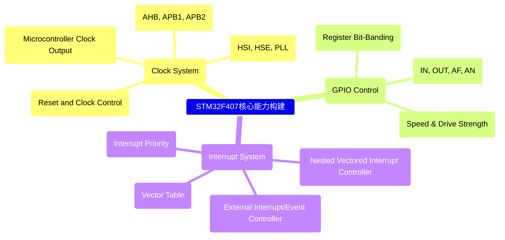
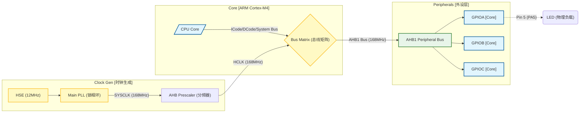
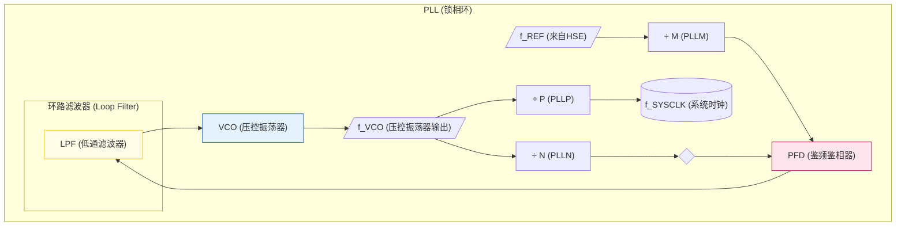
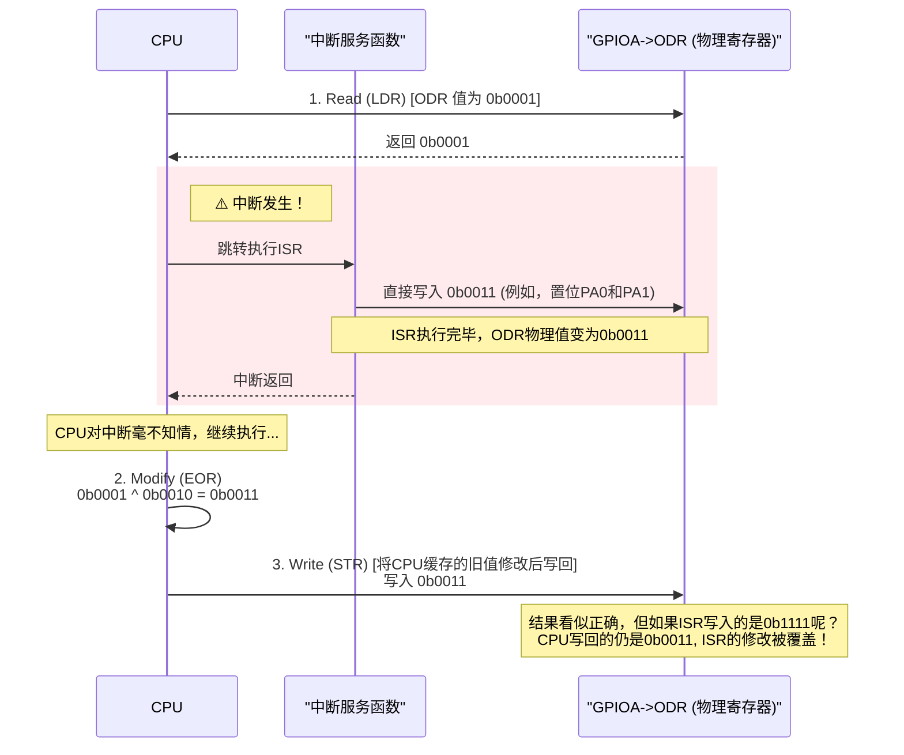
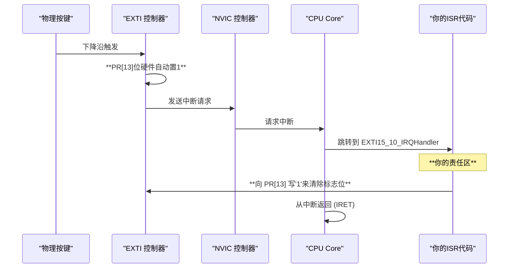
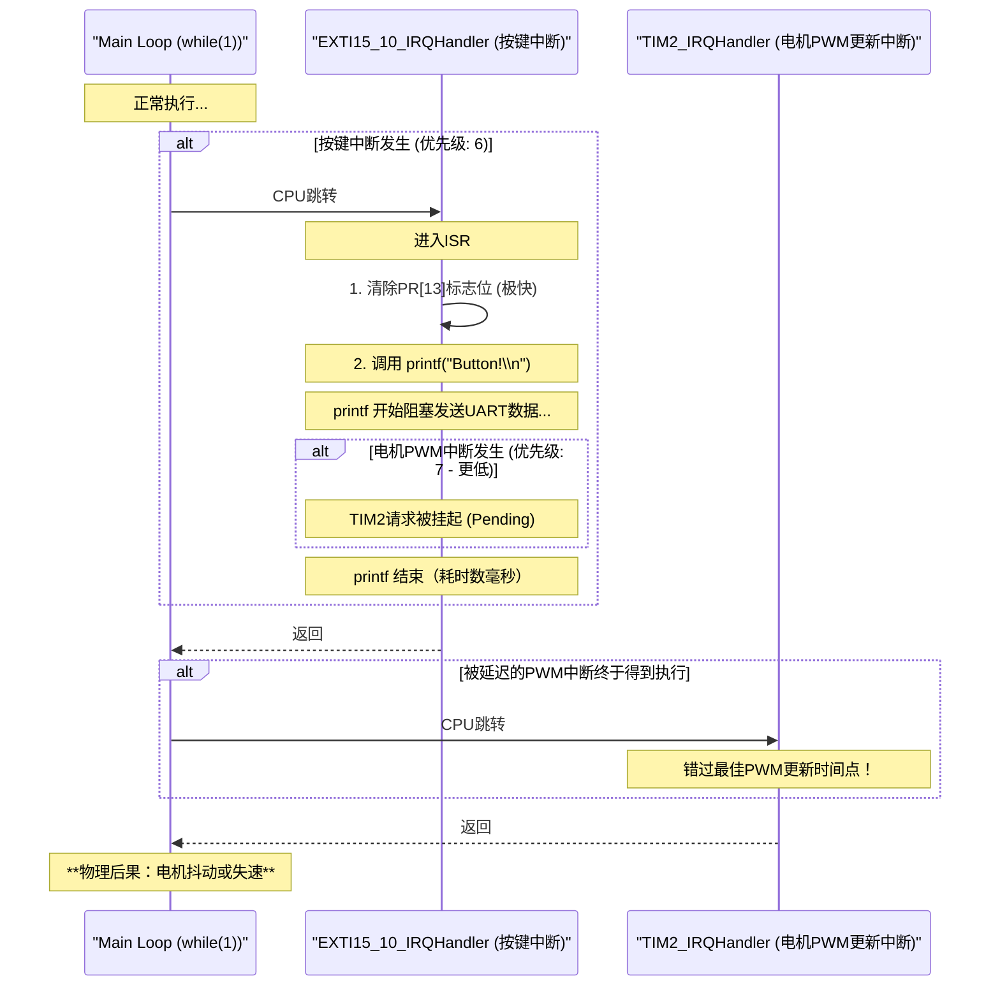
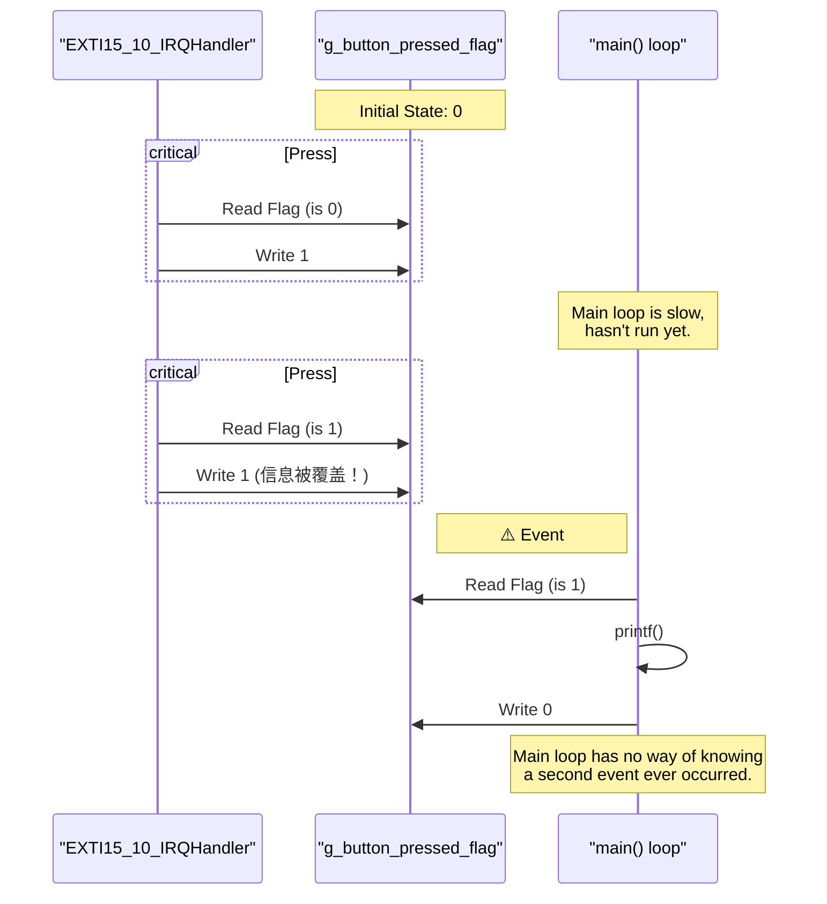
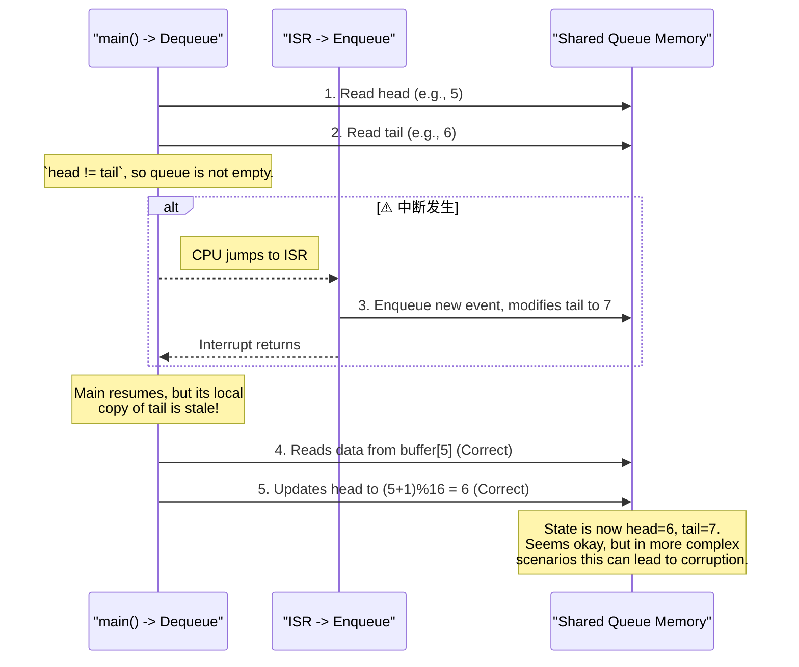

# 📑 RCC时钟的基础理解和ISR的基础概念

> [!abstract] 学习目标
> 本次学习主要为了理解什么概念？解决什么疑惑？
> 理解时钟的基本作用和转换还有就是ISR的一些风险操作

## 🧠 核心原理 (Theory)
<我们从最基础的MCU心跳——**时钟系统(RCC)** 开始，确立了必须基于Datasheet物理约束进行参数计算的铁律。随后，我们掌握了**GPIO的原子操作**，并通过架构决策记录(ADR)废弃了不可移植的位带(Bit-banding)方案。

核心部分在于**中断驱动架构的演进**。我们从一个简单的外部中断(EXTI)配置开始，逐步解决了中断服务函数(ISR)中的**实时性杀手(printf)**、**事件丢失(Event Loss)**、以及**数据共享的竞态条件(Race Condition)**等一系列致命问题。最终，架构从一个脆弱的“全局标志位”方案，演进为一个健壮的、基于**中断安全环形缓冲区(Interrupt-Safe Ring Buffer)**的生产者-消费者模型。!-- 纯文字理论：用自己的话解释“这是什么”以及“为什么需要它” -->

---

### 2. 全量架构图集 (Architectural Diagrams)

#### Diagram 1: 学习路线全景 (Roadmap)

#### Diagram 2: 核心硬件架构与总线 (Core Architecture & Bus Matrix)



#### Diagram 4: 锁相环物理控制模型 (PLL Physical Control Model)

#### Diagram 3: 竞态条件原理 (Race Condition: Read-Modify-Write)


#### Diagram 5: 外部中断信号流转 (External Interrupt Signal Flow)

```mermaid
flowchart LR
    subgraph "Hardware (物理层)"
        KEY["PC13 (物理引脚)"] -- "按下, 产生下降沿" --> GPIO_LOGIC["GPIOC Port Logic"]
    end
    
    subgraph "MCU Internal (芯片内部)"
        GPIO_LOGIC -- "1. GPIO配置为输入" --> SYSCFG["SYSCFG (系统配置控制器)"]
        SYSCFG -- "2. 连接PC13到中断线13" --> EXTI["EXTI (外部中断控制器)"]
        EXTI -- "3. 配置为下降沿触发" --> NVIC_Interface
        
        subgraph "ARM Core (内核)"
            NVIC_Interface[/"EXTI Line 13 Event"/] -- "4. 使能中断通道" --> NVIC["NVIC (嵌套向量中断控制器)"]
            NVIC -- "中断请求" --> CPU["CPU Core"]
        end
    end
    
    CPU -- "跳转执行" --> ISR[("ISR: EXTI15_10_IRQHandler")]
    
    classDef hw fill:#fff9c4,stroke:#fbc02d,stroke-width:2px;
    classDef mcu fill:#e3f2fd,stroke:#1565c0,stroke-width:2px;
    classDef core fill:#e8f5e9,stroke:#2e7d32,stroke-width:2px;
    
    class KEY,GPIO_LOGIC hw;
    class SYSCFG,EXTI,NVIC_Interface mcu;
    class NVIC,CPU,ISR core;
```



#### Diagram 6: 工业级ISR处理时序 (Industrial ISR Sequence)


#### Diagram 7: 实时性灾难复盘 - Printf (Real-time Disaster: Printf)


#### Diagram 8: 架构缺陷复盘 - 事件丢失 (Defect: Event Loss)



#### Diagram 9: 架构缺陷复盘 - 临界区滥用 (Defect: Critical Section Abuse)



> [!example] 读图分析
> **(在这里写你对上图的理解)**
> *例如：观察时序图，数据是在 SCL 的上升沿被采样，起始信号是 SCL 为高时 SDA 拉低...*


## 💻 代码逻辑与实现 (C)

## Step 4.2: 代码资产伪代码化 (Code Asset Pseudocode)

### 1. 核心系统启动逻辑 (System Startup & PLL)
**设计意图**: 确保系统时钟在物理约束范围内稳定启动，避免 VCO 失锁或超频。

```c
FUNCTION SystemClock_Config():
    // 1. 启动外部高频晶振
    RCC->CR |= HSE_ON
    WAIT UNTIL (RCC->CR & HSE_READY) IS TRUE

    // 2. 配置主锁相环 (Main PLL) - 物理约束检查
    // Input: HSE = 12MHz
    // Goal: SYSCLK = 168MHz, USB = 48MHz
    // Constraint: VCO_Input [1MHz, 2MHz] -> M=6 (12/6 = 2MHz)
    // Constraint: VCO_Output [100MHz, 432MHz] -> N=168 (2*168 = 336MHz)
    // Constraint: SYSCLK <= 168MHz -> P=2 (336/2 = 168MHz)
    // Constraint: USB == 48MHz -> Q=7 (336/7 = 48MHz)
    
    RCC->PLLCFGR = (M=6) | (N=168) | (P=2) | (Q=7) | Source=HSE

    // 3. 激活 PLL
    RCC->CR |= PLL_ON
    WAIT UNTIL (RCC->CR & PLL_READY) IS TRUE

    // 4. 配置总线分频 (Bus Prescalers)
    // AHB = 168MHz, APB1 = 42MHz (Max), APB2 = 84MHz (Max)
    RCC->CFGR |= (HPRE_DIV1) | (PPRE1_DIV4) | (PPRE2_DIV2)

    // 5. 切换系统时钟源
    RCC->CFGR |= SW_PLL
    WAIT UNTIL (RCC->CFGR & SWS_PLL) IS TRUE
END FUNCTION

```

### 2. GPIO 原子操作驱动 (Atomic GPIO Driver)
设计意图: 废弃非原子的“读-改-写”操作，利用 BSRR 实现绝对线程安全的 IO 控制。
```c
// 工业级标准: 禁止使用 ODR ^= (1<<Pin)
FUNCTION GPIO_SetPinAtomic(Port, Pin):
    // BSRR 低 16 位用于置位 (Set)
    Port->BSRR = (1 << Pin)
END FUNCTION

FUNCTION GPIO_ResetPinAtomic(Port, Pin):
    // BSRR 高 16 位用于复位 (Reset)
    Port->BSRR = (1 << (Pin + 16))
END FUNCTION

```
### 3. 事件驱动架构 (Event-Driven Architecture)
设计意图: 构建 "Top-Half" (ISR) 和 "Bottom-Half" (Main) 分离的异步处理模型。
```c
FUNCTION External_Interrupt_Init():
    // 1. 物理层: 配置 PC13 为输入 (无上下拉，利用外部电路)
    GPIOC->MODER &= ~(Input_Mode_Mask)
    
    // 2. 路由层: 将 EXTI Line 13 连接到 Port C
    // 必须操作 SYSCFG 寄存器
    SYSCFG->EXTICR[3] |= (PortC_Map << 4)

    // 3. 触发层: 仅检测下降沿 (Falling Edge)
    EXTI->FTSR |= (1 << 13)
    EXTI->RTSR &= ~(1 << 13)

    // 4. 屏蔽层: 移除中断屏蔽 (Unmask)
    EXTI->IMR |= (1 << 13)

    // 5. 内核层: 在 NVIC 中使能通道
    NVIC_SetPriority(EXTI15_10_IRQn, Priority_6)
    NVIC_EnableIRQ(EXTI15_10_IRQn)
END FUNCTION

```

### 3.2 生产者: 中断服务函数 (The Producer - ISR)
约束: 极速执行，禁止阻塞，必须清除标志位。

```c

INTERRUPT_HANDLER EXTI15_10_IRQHandler():
    // [Check]: 确认中断源是否为 Line 13
    IF (EXTI->PR & (1 << 13)):
        
        // [Critical]: 立即清除挂起标志 (Write 1 to Clear)
        // 如果不清除，ISR 退出后会被立即再次触发，导致死循环
        EXTI->PR = (1 << 13)

        // [Action]: 将事件推入环形缓冲区
        // 不执行任何业务逻辑 (如 printf 或 复杂计算)
        RingBuffer_Enqueue(Global_Event_Queue, EVENT_BUTTON_PRESS)
        
    END IF
END INTERRUPT_HANDLER
```

### 4. 数据结构: 中断安全环形缓冲区 (Interrupt-Safe Ring Buffer)
设计意图: 解决多事件并发导致的数据丢失问题，利用临界区保护共享指针。

```c
STRUCT RingBuffer:
    Head (Read/Write by Consumer)
    Tail (Read by Both, Write by Producer)
    Buffer[Size]

FUNCTION Enqueue(Event):
    // 计算下一个写入位置
    Next_Tail = (Tail + 1) % Size
    
    // [Check]: 缓冲区满？
    IF Next_Tail == Head:
        RETURN Error (Drop Event)
    
    // [Store]: 存入数据
    Buffer[Tail] = Event
    
    // [Critical Section]: 更新 Tail 指针
    // 虽然 32 位写入通常是原子的，但为了移植性和防御性编程，
    // 建议在某些架构下使用关中断保护
    DISABLE_INTERRUPTS()
    Tail = Next_Tail
    ENABLE_INTERRUPTS()
END FUNCTION

FUNCTION Dequeue(Pointer_To_Event):
    // [Check]: 缓冲区空？
    IF Head == Tail:
        RETURN Error (Empty)
    
    // [Load]: 取出数据
    *Pointer_To_Event = Buffer[Head]
    
    // [Critical Section]: 更新 Head 指针
    // 防止 Main 更新 Head 时被 ISR 打断读取
    DISABLE_INTERRUPTS()
    Head = (Head + 1) % Size
    ENABLE_INTERRUPTS()
    
    RETURN Success
END FUNCTION
```

## Step 4.3: 误区复盘与知识债务解剖 (Knowledge Debt & Misconception Anatomy)

### 1. 核心术语表 (Terminology)
在本项目中，以下术语被重新定义并确立为工程标准：

*   **RMW (Read-Modify-Write)**: 指 `Reg |= Bit` 这种非原子操作。它包含“读-改-写”三个汇编步骤，是竞态条件的高发地带。
*   **Race Condition (竞态条件)**: 当软件行为依赖于不可控的事件时序（如中断恰好插入在RMW指令中间）时产生的系统故障。
*   **Atomic Operation (原子操作)**: 不可分割的操作。在执行过程中绝对不会被中断打断（如 `BSRR` 寄存器写入）。
*   **ISR (Interrupt Service Routine)**: 中断服务函数。必须遵循“极速、非阻塞、纯粹”原则。
*   **Critical Section (临界区)**: 一段访问共享资源的代码，必须通过关中断来保护，防止并发访问导致的数据损坏。
*   **Interrupt Latency (中断延迟)**: 从硬件信号到达，到CPU真正开始执行ISR第一条指令的时间差。滥用临界区会无限拉大这个延迟。

---

### 2. 深度误区解剖 (Deep Misconception Analysis)

#### 误区 1: "GPIO可以随意配置"
*   **你的行为**: 试图将按键引脚配置为 `Output` 模式。
*   **物理本质**:
    *   **Input**: 外部电压驱动 MCU 引脚栅极 (Gate)，MCU 高阻态感知电平。
    *   **Output**: MCU 内部推挽电路强驱外部，输出电流。
*   **后果**: 若将按键(接GND)配置为输出高电平，按下按键瞬间形成 **VCC-GND 短路**，直接烧毁 GPIO 端口内部电路。
*   **修正**: 永远先画信号流向图。输入设备 -> MCU -> 输出设备。

#### 误区 2: "C语言的一行代码就是原子的"
*   **你的行为**: 认为 `GPIOA->ODR ^= (1<<5)` 是安全的。
*   **物理本质**: C 代码是给人类看的，CPU 执行的是汇编。`^=` 翻译为 `LDR` (读), `EOR` (改), `STR` (写)。
*   **后果**: 中断若在 `LDR` 和 `STR` 之间发生并修改了同一寄存器，中断的修改将在 ISR 返回后被 `STR` 指令**无情覆盖**。
*   **修正**: 严格使用 `BSRR` (Set/Reset 寄存器) 或在必要时使用临界区保护。

#### 误区 3: "Printf 是调试神器"
*   **你的行为**: 在 ISR 中调用 `printf`。
*   **物理本质**: `printf` 依赖 UART 低速串行发送，通常是**阻塞式**的 (Polling Mode)。发送一个字符可能耗时 1ms (9600波特率)。
*   **后果**: **实时性崩塌**。低优先级中断（如电机控制 PWM 更新）无法得到执行，导致系统物理失控。
*   **修正**: ISR 只设标志位。耗时逻辑全部移至主循环 (Bottom-Half)。

#### 误区 4: "标志位足矣"
*   **你的行为**: 使用 `volatile uint8_t flag` 记录按键事件。
*   **物理本质**: 全局变量是**非记忆性**的。它只有 0/1 状态，无法记录“发生了几次”。
*   **后果**: **事件覆盖 (Event Overwriting)**。在主循环处理完第一次按键前，第二次按键中断会将 `flag` 再次置 1（无变化），导致第二次事件丢失。
*   **修正**: 使用**环形缓冲区 (Ring Buffer)** 实现生产者-消费者模型，缓存所有事件。

#### 误区 5: "关中断是万能药"
*   **你的行为**: 为了安全，在临界区内执行 `memcpy` 拷贝大量数据。
*   **物理本质**: `__disable_irq()` 会置位 PRIMASK，使 CPU 忽略除 NMI 外的所有中断。
*   **后果**: **人为制造不可控延迟**。在 `memcpy` 执行期间，即使发生火灾报警（最高优先级中断），CPU 也听不见。
*   **修正**: 临界区必须**极短**。只包含指针更新或标志位翻转指令。

---


