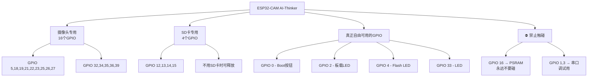
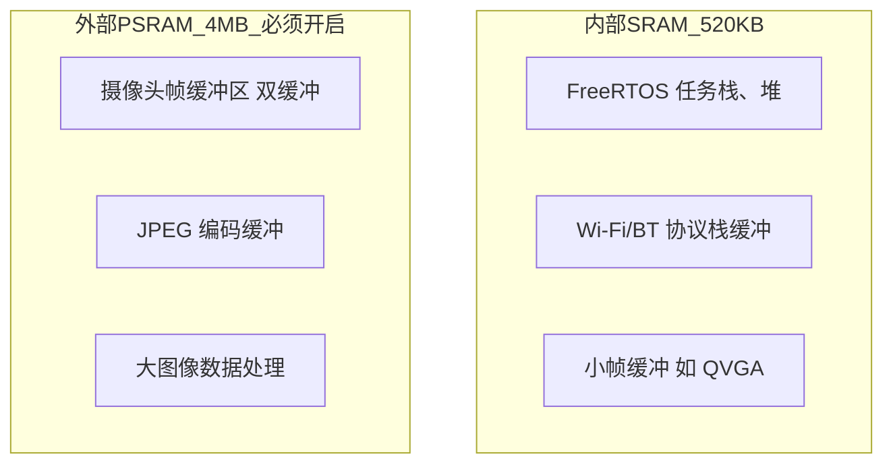
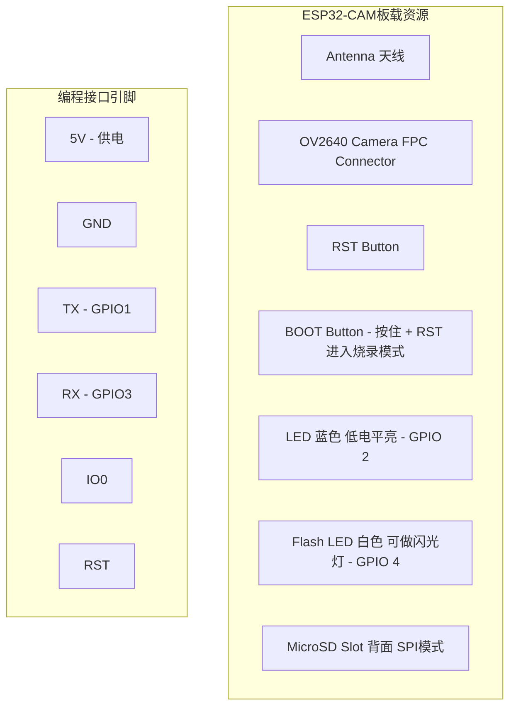
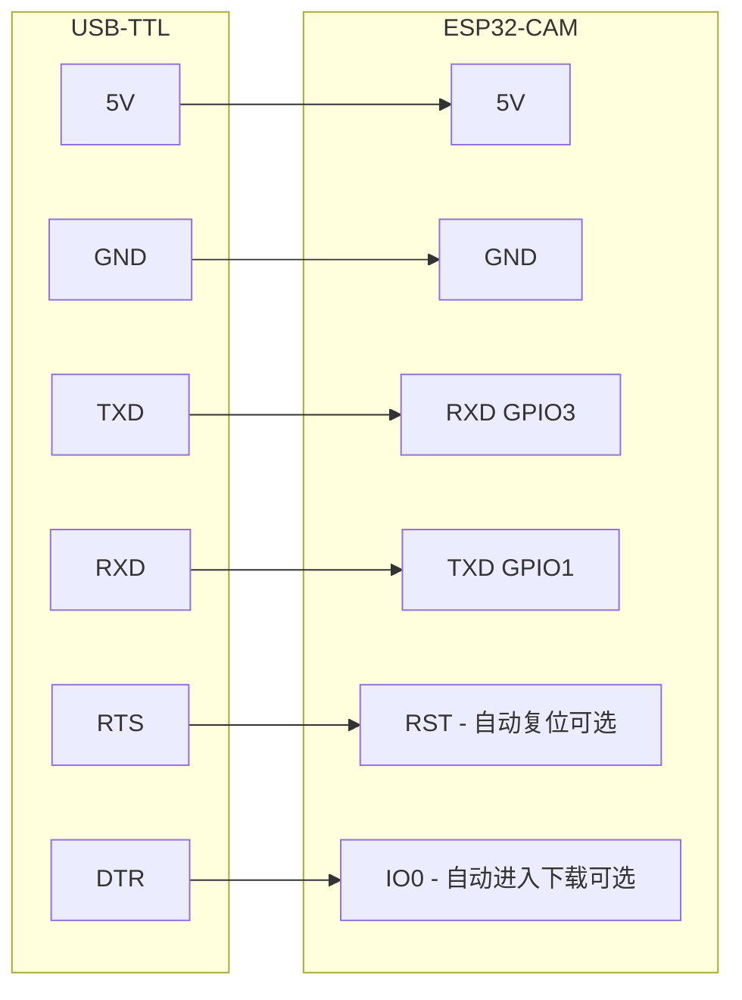

---
tags:
  - 硬件
  - ESP32
  - 摄像头
  - 开发板
created: 2026-04-12
modified: 2026-04-26
status: 已整理
---

# ESP32-D0WDQ6

## 二、ESP32-D0WDQ6 核心参数

| 参数 | 规格 | 说明 |
| --- | --- | --- |
| CPU 架构 | `Xtensa` 双核 `LX6` | `Core 0` (`PRO cpu`) + `Core 1` (`APP cpu`) |
| 主频 | `160MHz` ~ `240MHz` | 可调，默认 `240MHz` |
| SRAM | `520 KB` | 其中 `320KB` 可自由分配 |
| ROM | `448 KB` | 固化启动代码，不可写 |
| 外部 Flash | 板载 `4MB` `SPI Flash` | 存储固件 + 文件系统 |
| Wi-Fi | `802.11 b/g/n`，`2.4GHz` | 支持 `Station` / `AP` / 混合模式 |
| 蓝牙 | `BLE 4.2` + `Classic BT` | 与 `Wi-Fi` 共享天线 |
| 工作电压 | `3.3V`（`I/O`）/ `1.8V`~`3.3V`（可选） | 供电 `5V` via `5V` 引脚 |
| 功耗 | 活跃：`160`~`260mA` / 深睡眠：`10μA` | 摄像头工作时额外 `+30`~`100mA` |

---

## 三、GPIO 完整映射表（AI-Thinker 板）

这是**最关键的内容**，很多初学者踩坑就是因为引脚被占用了不知道：

### 可用 GPIO（共 11 个，非常紧张）

| GPIO | 功能 | 默认用途 |
| --- | --- | --- |
| `GPIO 0` | 可用 | ⚠️ `Boot` 按钮（拉低进入下载模式） |
| `GPIO 1` | `TXD` | 串口发送 |
| `GPIO 2` | 可用 | ⚠️ 板载 `LED`（低电平点亮） |
| `GPIO 3` | `RXD` | 串口接收 |
| `GPIO 4` | 可用 | ⚠️ 摄像头 `Flash LED`（板载） |
| `GPIO 12` | 可用 | ⚠️ `HS2_DATA2`（`SD`卡） |
| `GPIO 13` | 可用 | `HS2_DATA3`（`SD`卡） |
| `GPIO 14` | 可用 | `HS2_CLK`（`SD`卡） |
| `GPIO 15` | 可用 | `HS2_CMD`（`SD`卡） |
| `GPIO 16` | ⚠️ 极特殊 | `PSRAM` 片选信号 |
| `GPIO 33` | 可用 | `LED Flash`（板载常亮，可 `PWM`） |

### 被摄像头独占的 GPIO（OV2640 接口）

| GPIO | 摄像头信号 |
| --- | --- |
| `GPIO 5` | `CAM_SDA`（`SCCB`/`I2C` 数据） |
| `GPIO 18` | `CAM_SCLK`（`SCCB`/`I2C` 时钟） |
| `GPIO 19` | `CAM_VSYNC` |
| `GPIO 21` | `CAM_HREF` |
| `GPIO 22` | `CAM_PCLK` |
| `GPIO 23` | `CAM_HSD` / `CAM_D0` |
| `GPIO 25` | `CAM_D1` |
| `GPIO 26` | `CAM_D2` |
| `GPIO 27` | `CAM_D3` |
| `GPIO 32` | `CAM_D4` |
| `GPIO 34` | `CAM_D5` |
| `GPIO 35` | `CAM_D6` |
| `GPIO 36` | `CAM_D7` |
| `GPIO 39` | `CAM_HSC`（行选通） |

### GPIO 分配总结图

---

## 四、摄像头 OV2640 参数

| 参数 | 规格 |
| --- | --- |
| 传感器 | `1/4` 英寸 `CMOS`，`200` 万像素 |
| 最大分辨率 | `UXGA`（`1600×1200`） |
| 有效输出 | 最高 `2MP`，常用 `UXGA`/`SVGA`/`CIF`/`QVGA` |
| 像素格式 | `YUV422` / `YCbCr422` / `RGB565` / `JPEG`（硬件编码） |
| JPEG 输出 | 板载 `DSP` 硬件压缩，支持 `UXGA@15fps` `JPEG` 直出 |
| 帧率 | `UXGA`: ~`15fps` / `SVGA`: ~`25fps` / `QVGA`: ~`60fps` |
| 镜头视角 | 约 `66°`（可换 `M12` 或鱼眼镜头模组） |
| 接口 | `SCCB`（兼容 `I2C`）配置 + `8-bit` 并行数据输出 |
| SCCB 地址 | `0x30`（写） / `0x31`（读） |

### 分辨率与帧率对照（实测参考）

分辨率选择建议：

| 分辨率 | 像素 | 帧率约 | 推荐用途 |
| --- | --- | --- | --- |
| `QVGA` | `320×240` | `50-60fps` | 人脸检测/运动追踪 |
| `CIF` | `400×296` | `40-50fps` | 快速识别 |
| `VGA` | `640×480` | `25-30fps` | 通用监控 |
| `SVGA` | `800×600` | `20-25fps` | `Web` 流媒体 |
| `XGA` | `1024×768` | `15-20fps` | 静态拍照 |
| `UXGA` | `1600×1200` | `10-15fps` | 最高画质拍照 |

---

## 五、PSRAM（关键特性）

| 参数 | 说明 |
| --- | --- |
| 型号 | `ESP-PSRAM32`（`ESP32` 内部集成方案） |
| 容量 | `4MB`（实际可用约 `3.6MB`） |
| 接口 | 与 `Flash` 共享 `SPI`/`HSPI` 总线 |
| 为什么重要 | 摄像头一帧 `UXGA` 图像 = `1600×1200×2` = `3.75MB`，内部 `520KB` `SRAM` 根本放不下！ |

### 内存分配逻辑

### 配置要点

在 `Arduino IDE` 中必须启用：

- `Tools` → `Partition Scheme` → `"Huge APP (3MB No OTA/1MB SPIFFS)"`
- `Tools` → `PSRAM` → `"Enabled"`

---

## 六、板载硬件资源

`ESP32-CAM AI-Thinker` 实物接口：

---

## 七、电气参数

| 参数 | 值 |
| --- | --- |
| 输入电压 | `5V`（推荐 `5V 2A`） |
| 工作电流（空载） | ~`180mA` |
| 工作电流（摄像头+`Wi-Fi`） | `300`~`500mA` |
| `Flash LED` 电流 | 每颗 ~`100mA` |
| 深睡眠电流 | ~`10μA` |
| `I/O` 高电平 | `3.3V` |
| `I/O` 驱动电流 | 最大 `40mA`/引脚 |
| 工作温度 | `-40°C` ~ `85°C` |
| `PCB` 尺寸 | `27×40.5mm` |

---

## 八、烧录方式（初学者必看）

> [!warning] ESP32-CAM 没有板载 USB-Serial 芯片！
> 你需要一个外部 `USB-TTL` 模块（如 `CH340` / `CP2102` / `FT232`）

### 接线方式

### 手动烧录步骤（无自动复位电路时）

1. `GPIO 0` 接 `GND`
2. 按一下 `RST` 按钮
3. 点击上传
4. 等待 `"Connecting........"` 变成开始写入
5. 烧录完成后断开 `GPIO 0` 的 `GND`
6. 再按一下 `RST`，程序运行

---

## 九、关键避坑总结

| #   | 坑              | 解决方案                               |
| --- | -------------- | ---------------------------------- |
| 1   | `GPIO 16` 不能用  | 被 `PSRAM` 占用，配置为输出会直接 `Hard Fault` |
| 2   | 供电不足导致重启       | 用 `5V 2A` 电源，不要用电脑 `USB` 直连        |
| 3   | 摄像头初始化失败       | 检查 `FPC` 排线是否插紧、方向是否正确（触点朝下）       |
| 4   | 拍照花屏/条纹        | `PSRAM` 未启用，或帧缓冲被覆盖                |
| 5   | 上传报 `Brownout` | 供电电压不足，加电容或换电源                     |
| 6   | 找不到摄像头         | `SCCB` 地址是 `0x30`，不是标准 `I2C` 地址    |
| 7   | `GPIO` 不够用     | 用 `I2C` 扩展器（`PCF8574`）或移位寄存器扩展     |
| 8   | `Wi-Fi` 传输卡顿   | 降低分辨率到 `SVGA` 以下，用 `JPEG` 直出模式     |