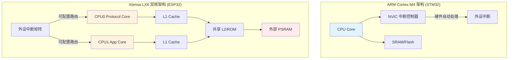
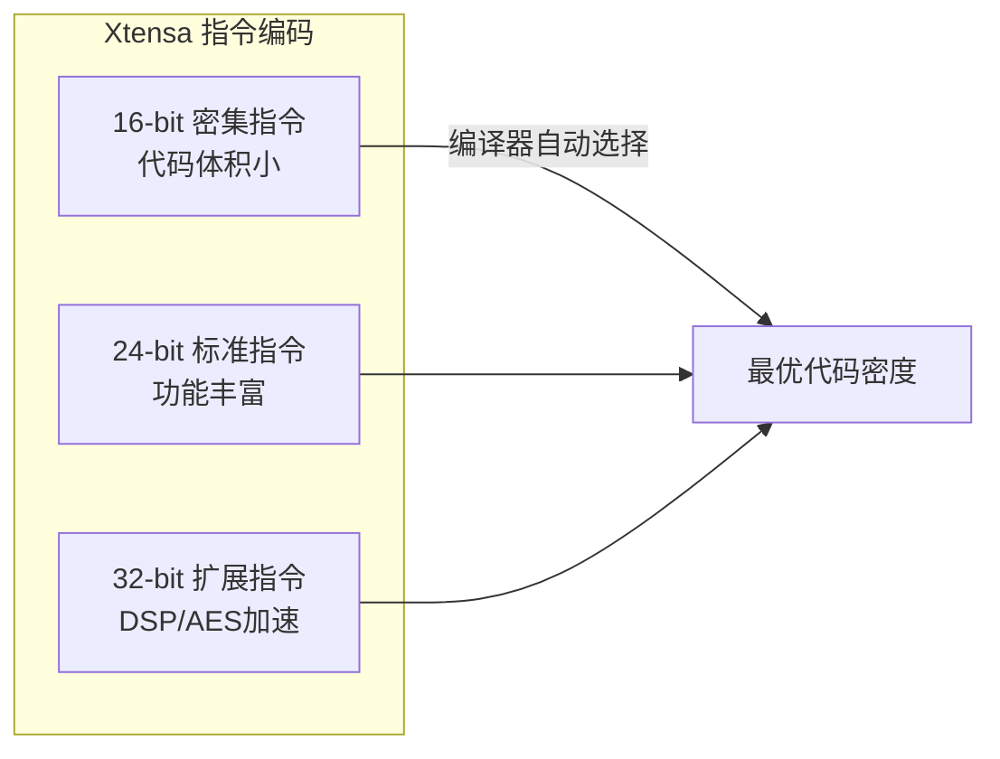
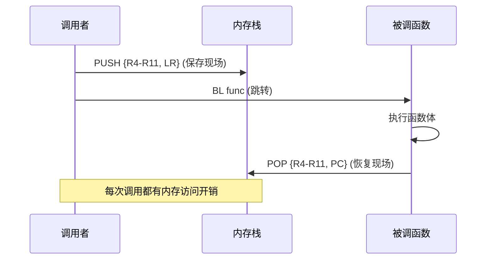
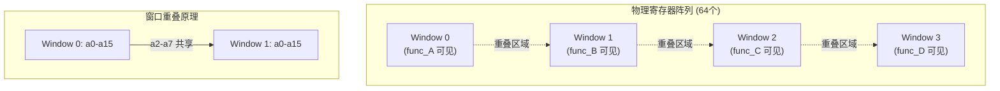
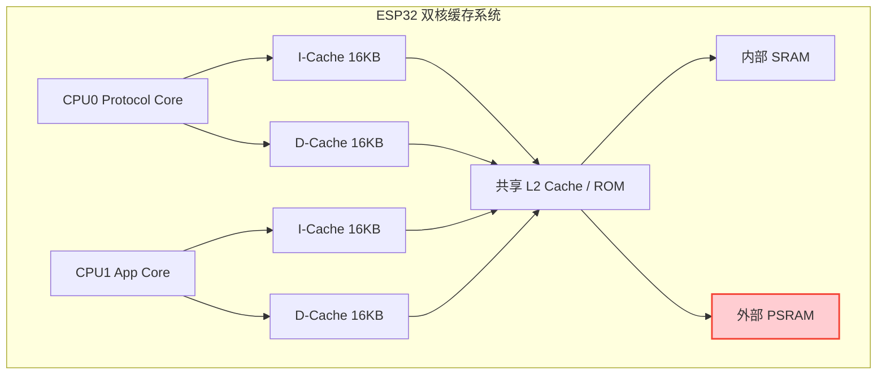
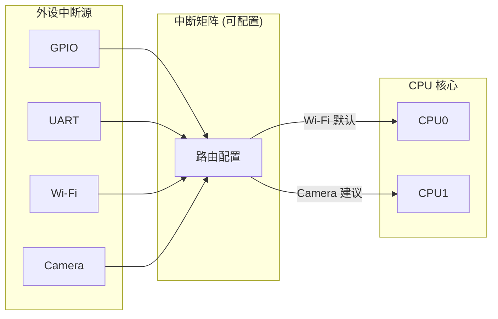

---
aliases:
date: 2026-04-26
tags:
  - 硬件与芯片
---

> [!abstract] 核心本质
> ESP32 采用的 **Xtensa LX6** 架构与 STM32 的 **ARM Cortex-M** 架构存在根本性差异：前者追求**高性能与可配置性**（7级流水线、双核、窗口化寄存器），后者追求**实时性与确定性**（3级流水线、NVIC硬件嵌套）。理解这种差异是驾驭 ESP32-CAM 复杂应用（如 Wi-Fi + 摄像头并发）的基石。

---

## 一、总体架构对比：设计哲学的分野

### 1.1 核心差异矩阵

| 维度 | ARM Cortex-M4 (STM32) | Tensilica Xtensa LX6 (ESP32) |
| :--- | :--- | :--- |
| **设计哲学** | 实时性优先，确定性执行，低功耗 | 性能优先，可配置扩展，高吞吐 |
| **内核数量** | 单核为主 (极少数双核) | **真·对称双核 (SMP)** |
| **主频范围** | 84MHz - 400MHz | 高达 240MHz (双核) |
| **流水线深度** | 3 级 (取指-译码-执行) | **7 级** (超标量设计) |
| **指令集** | Thumb-2 (定长为主) | Xtensa (定长+变长混合，可定制) |
| **寄存器模型** | 16 通用寄存器 + 特殊寄存器 | **窗口化寄存器** (64个物理寄存器) |
| **中断系统** | NVIC (硬件自动嵌套) | 分层架构 (外设级 + CPU级 + 软件分发) |
| **缓存系统** | 通常无 Cache 或简单 Cache | L1 I-Cache + D-Cache (每核独立) |
| **典型应用** | 精准时序控制、电机驱动、低功耗传感 | 物联网网关、流媒体传输、复杂协议栈 |

### 1.2 架构全景图



---

## 二、指令集架构 (ISA)：从"固定菜单"到"自助定制"

### 2.1 编码格式的差异

**ARM Cortex-M** 采用相对固定的指令长度（16-bit Thumb 或 32-bit Thumb-2），解码逻辑简单，适合低功耗设计。

**Xtensa LX6** 采用**可配置的变长指令集**，支持 16/24/32-bit 甚至 64-bit 指令，允许芯片厂商（如乐鑫）添加自定义指令。



### 2.2 特色指令解析

#### A. 窗口化寄存器指令
这是 Xtensa 最独特的机制，通过 `ENTRY` 和 `RETW` 指令实现硬件级的函数调用优化。

#### B. 零开销循环
```asm
// 传统循环 (ARM)
loop:
    ADD r0, r0, #1
    CMP r0, #100
    BLT loop          ; 每次迭代需判断分支

// Xtensa 零开销循环
LOOP a2, end_label   ; 硬件自动计数，无分支开销
    ADD.N a3, a3, 1
end_label:
```
> **性能差异**：传统循环每次迭代 3-5 周期，零开销循环仅需 1 周期。

#### C. 专用地址计算
```asm
// ESP32 专用于数组访问的指令
ADDX4 a2, a3, a4    ; a2 = a3*4 + a4 (int数组)
ADDX8 a2, a3, a4    ; a2 = a3*8 + a4 (double数组)
```
对比 ARM 需要先移位 (`LSL`) 再加法 (`ADD`)，Xtensa 单指令完成。

---

## 三、寄存器模型：窗口化设计的革命

### 3.1 传统压栈模型 (ARM)

ARM 采用传统的内存压栈方式保护现场，每次函数调用都需要访问内存。



### 3.2 窗口化寄存器模型

Xtensa 拥有 64 个物理寄存器，将其划分为 4 个"窗口"（Window），每个函数调用时硬件自动切换窗口。



**核心优势**：
- **零内存访问**：函数调用通过 `ENTRY` 指令切换窗口，参数通过重叠寄存器传递，无需 `PUSH/POP`。
- **极高效率**：对于调用深度 < 4 的函数链，调用开销接近于零。

**致命陷阱**：
- **窗口溢出**：当调用深度超过 4 层，硬件触发 `WindowOverflow` 异常，此时需将最早窗口保存到内存，开销巨大。
- **工程建议**：避免深度递归，改用迭代算法。

---

## 四、流水线架构：深度与代价

### 4.1 流水线级数对比

| 特性 | Cortex-M4 (3级) | Xtensa LX6 (7级) |
| :--- | :--- | :--- |
| **结构** | 取指(F) → 译码(D) → 执行(E) | IF → IR → ID → ALU → MEM → WB → - |
| **主频潜力** | 较低 (< 400MHz) | 较高 (240MHz+) |
| **分支代价** | 1-2 周期 | 3-5 周期 (预测失败) |
| **中断延迟** | 12 周期 (确定性) | 10-20+ 周期 (软件影响) |

### 4.2 流水线冒险

7 级流水线面临更复杂的冒险问题：

1.  **数据冒险**：通过**数据前递** 硬件解决大部分问题，但 `Load-Use` 冒险仍需停顿。
2.  **控制冒险**：分支预测失败代价高昂。
    *   **优化策略**：使用零开销循环、条件移动指令 (`MOVEQZ`) 替代分支。

---

## 五、双核架构：性能与复杂度的博弈

### 5.1 双核缓存架构

ESP32 的双核架构引入了复杂的缓存一致性问题。



### 5.2 缓存一致性陷阱

> [!danger] 致命陷阱：PSRAM 无硬件一致性
> ESP32-CAM 大量使用外部 PSRAM 存储图像数据。**PSRAM 区域没有硬件缓存一致性！**
> - **现象**：CPU0 写入 PSRAM 的数据，CPU1 可能读到 Cache 中的旧值。
> - **解决**：必须使用内存屏障 (`__sync_synchronize()`) 或手动刷新 Cache。

### 5.3 解决方案代码

```c
// 双核共享数据的安全传递
typedef struct {
    uint8_t* frame_buffer;  // 位于 PSRAM
    size_t len;
    volatile bool ready;
} frame_t;

// CPU0: 生产者
void camera_task(void* arg) {
    while(1) {
        capture_to_psram(frame.buffer);
        __sync_synchronize();  // ★ 内存屏障，确保写入完成
        frame.ready = true;
        __sync_synchronize();
    }
}

// CPU1: 消费者
void wifi_task(void* arg) {
    while(1) {
        if(frame.ready) {
            __sync_synchronize();  // ★ 读取前刷新
            send_wifi(frame.buffer);
        }
    }
}
```

---

## 六、中断系统：从"黑盒"到"白盒"

### 6.1 架构对比

| 维度 | ARM NVIC | Xtensa 中断系统 |
| :--- | :--- | :--- |
| **层级** | 单层 (外设直连 CPU) | 三层 (外设级 → CPU级 → 异常) |
| **优先级** | 可编程 (最多256级) | 固定 8 级 (数字越小越高) |
| **嵌套** | 硬件自动处理 | 需软件配合 |
| **向量表** | 硬件自动跳转 | 软件分发 |

### 6.2 双核中断路由

ESP32 的中断矩阵允许将外设中断路由到指定 CPU 核心。



### 6.3 工程避坑

1.  **IRAM_ATTR 强制要求**：ISR 代码必须放在 IRAM，避免 Flash 访问延迟导致中断响应抖动。
2.  **FromISR API**：在 ISR 中必须使用 FreeRTOS 的 `FromISR` 后缀 API。
3.  **优先级反转**：注意 Xtensa 优先级数字越小越高（与 ARM 相反）。

---

## 七、内存架构：IRAM/DRAM/PSRAM 的布局

### 7.1 内存区域划分

| 区域 | 地址范围 | 用途 | 特性 |
| :--- | :--- | :--- | :--- |
| **IRAM** | 0x4008_0000+ | 存放中断代码、关键路径代码 | CPU 直接执行，速度快 |
| **DRAM** | 0x3FFB_0000+ | 存放数据、堆、栈 | 普通 RAM |
| **RTC Memory** | 0x5000_0000+ | 深度睡眠时保持数据 | 低功耗场景 |
| **PSRAM** | 0x3F80_0000+ | 扩展大容量内存 (图像缓冲) | **无 Cache 一致性** |

### 7.2 DMA 与内存对齐

> [!warning] 避坑指南
> DMA 只能访问 DRAM 或 PSRAM，且地址必须**32字节对齐**（Cache Line 大小）。
> 如果数据未对齐，DMA 可能搬运到 Cache 中的旧数据，导致数据错误。

---

## 🔗 知识延伸

- ⬆️ **上位知识**：[[计算机体系结构]]、[[嵌入式系统设计]]
- ⬇️ **下位知识**：[[FreeRTOS任务调度]]、[DMA与Cache一致性](DMA与Cache一致性)
- ➡️ **平级关联**：[ARM Cortx-M4](ARM%20Cortx-M4.md)、[[RISC-V架构]]
- **详细见**：[我现在想要了解一下ESP32-CAM的内核，请你带我一步一步的了解@20260409_221751](../../../copilot/copilot-conversations/我现在想要了解一下ESP32-CAM的内核，请你带我一步一步的了解@20260409_221751.md)