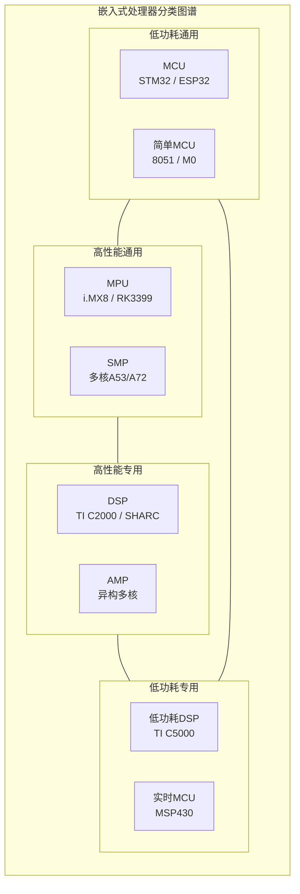
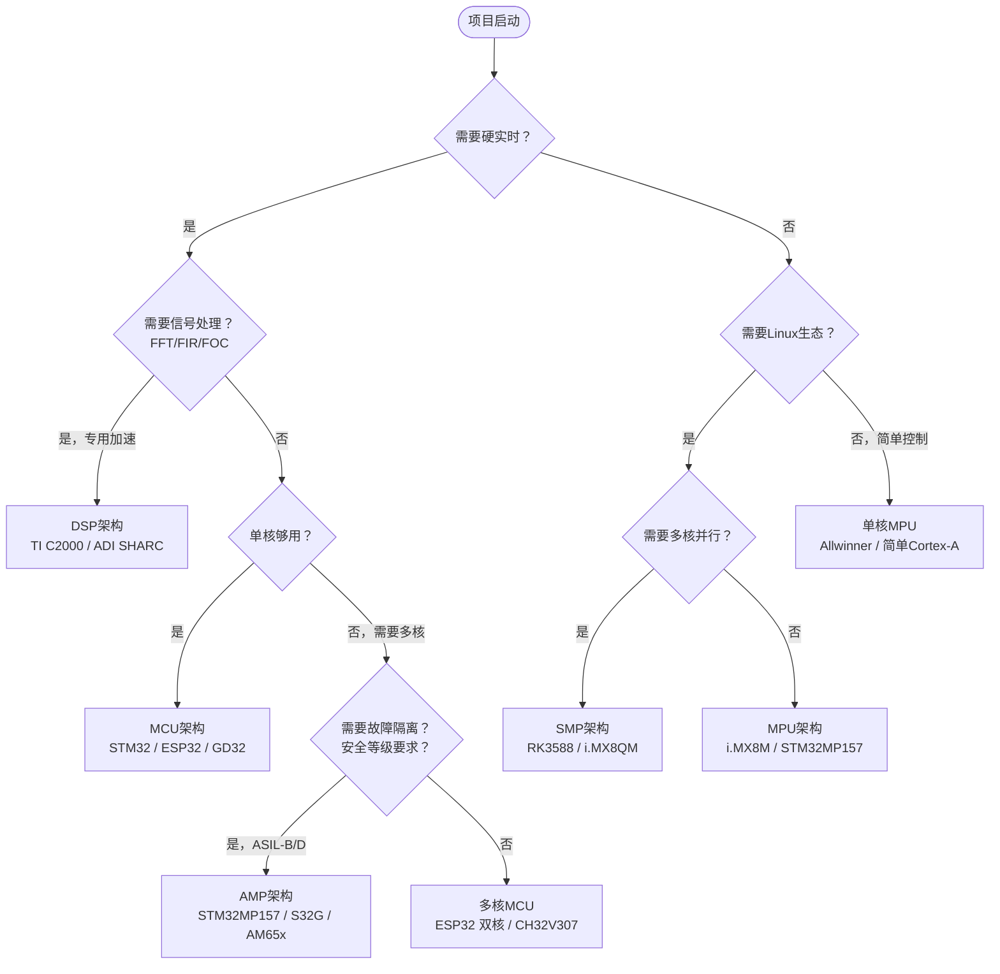
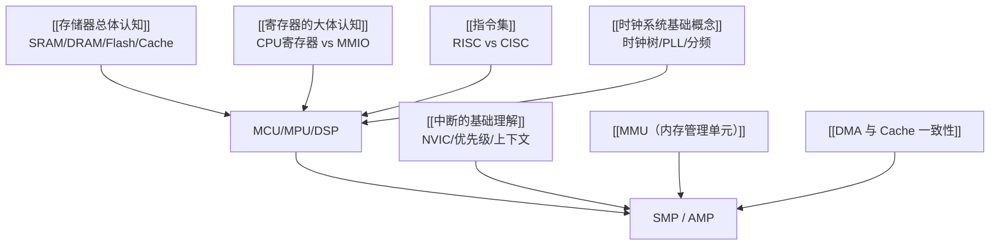

---
aliases:
  - 芯片架构导航
  - 处理器分类
  - 芯片选型
tags:
  - 嵌入式
  - 硬件与芯片
  - 导航
  - MOC
date: 2026-04-28
status: evergreen
related:
  - "[[MCU架构]]"
  - "[[MPU架构]]"
  - "[[DSP架构]]"
  - "[[SMP架构]]"
  - "[[AMP架构]]"
  - "[[ARM Cortx-M4]]"
  - "[[Xtensa LX6 双核架构]]"
---

# 芯片架构总览

> [!abstract] 核心概览
> 从单核到多核、从实时控制到高性能计算，嵌入式处理器按**核心职责**和**核心数量**两个维度划分为五大架构。本文件是芯片模块的入口，帮你建立"什么时候选什么"的认知框架。

---

## 分类维度

嵌入式处理器的分类沿着两个正交的轴展开：

**轴 1 — 核心职责**：MCU（实时控制）/ MPU（高性能通用）/ DSP（信号处理专用）

**轴 2 — 核心数与内存模型**：单核 → SMP（多核共享内存，跑一个OS）/ AMP（多核各自独立，跑不同OS）

> [!note] 现实中的混合体
> 很多芯片不纯粹属于某一类。例如 STM32MP157 = Cortex-A7（MPU）+ Cortex-M4（MCU）的 AMP 系统；ESP32 = 双核 Xtensa SMP + 外设集成的 MCU 定位。分类是理解工具，不是教条。

---

## 五大架构对比表

| 维度 | MCU | MPU | DSP | SMP | AMP |
|------|-----|-----|-----|-----|-----|
| **核心特征** | 单芯片集成 | CPU极致+外扩 | 信号处理加速 | 多核共享一切 | 多核各自独立 |
| **核心类型** | ARM Cortex-M | ARM Cortex-A / RISC-V | TI C2000 / ADI SHARC | 多核Cortex-A | 异构核心组合 |
| **存储模型** | 片内Flash+SRAM | 外扩DDR+eMMC | 多总线哈佛架构 | 共享DDR | 私有区+共享区 |
| **Cache** | 通常无（M7有） | L1+L2+L3层级 | 程序/数据分离 | 共享L2/L3 | 各核私有+共享区 |
| **MMU** | 无（有MPU） | 有（虚拟内存） | 无 | 有 | 部分核心有 |
| **操作系统** | 裸机 / RTOS | Linux / Android | 裸机 / RTOS | Linux / SMP-RTOS | 多OS并存 |
| **实时性** | 确定性（12周期中断） | ms级（Linux调度） | 确定性（单周期MAC） | 取决于调度策略 | 各核独立保证 |
| **开发复杂度** | 低 | 高 | 中 | 高 | 很高 |
| **典型芯片** | STM32F407 | i.MX8M | TI C2000 | RK3588 | STM32MP157 |
| **典型场景** | 工控/IoT/家电 | 边缘网关/HMI | 电机控制/音频 | 智能座舱/NVR | 车载域控/运动控制 |

---

## 选型决策树

---

## 文件索引与学习路径

### 推荐阅读顺序

### 文件说明

| 文件 | 定位 | 核心价值 | 阅读时长 |
|------|------|---------|---------|
| [[MCU架构]] | 概览 | 总线矩阵、存储器布局、低功耗设计、国产替代 | 15min |
| [[ARM Cortx-M4]] | 深度专题 | 寄存器级调试、HardFault分析、Bit-Banding、双栈指针 | 20min |
| [[Xtensa LX6 双核架构]] | 深度专题 | 窗口化寄存器、双核Cache一致性、ESP32中断路由 | 20min |
| [[MPU架构]] | 概览 | MMU/TLB/页表、Cache层次、U-Boot启动链、设备树 | 20min |
| [[DSP架构]] | 概览 | MAC并行、零开销循环、特殊寻址、饱和运算 | 15min |
| [[SMP架构]] | 概览 | MESI协议状态机、大小核架构、伪共享问题 | 20min |
| [[AMP架构]] | 概览 | 内存分区链接脚本、OpenAMP/RPMsg、故障隔离ASIL | 20min |

---

## 知识依赖

理解芯片架构需要以下前置知识：

