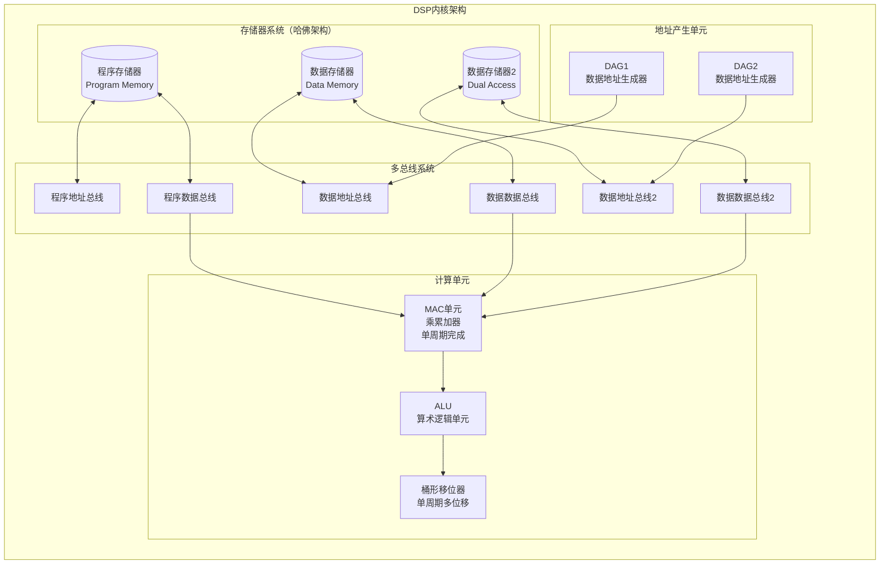
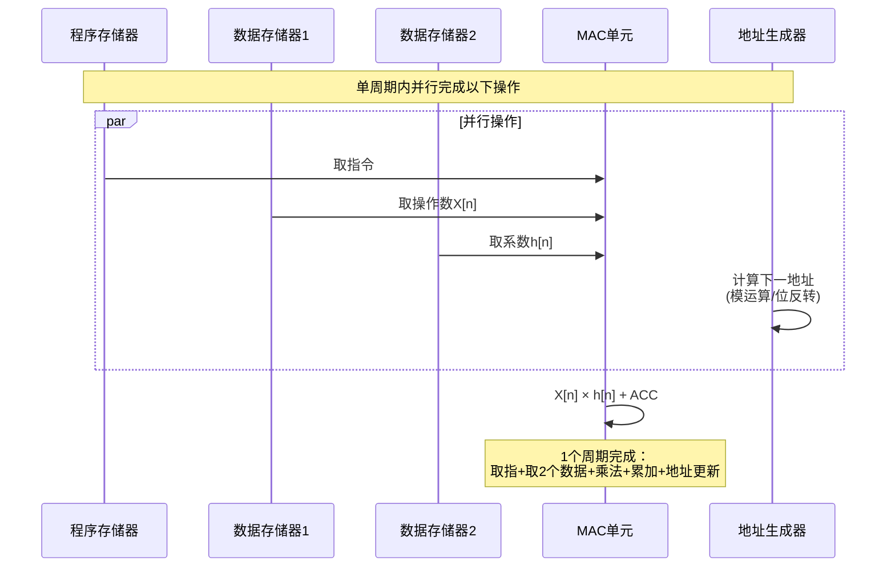
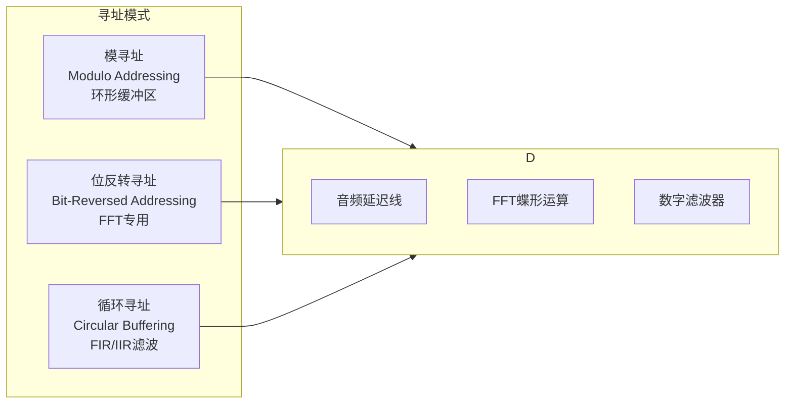
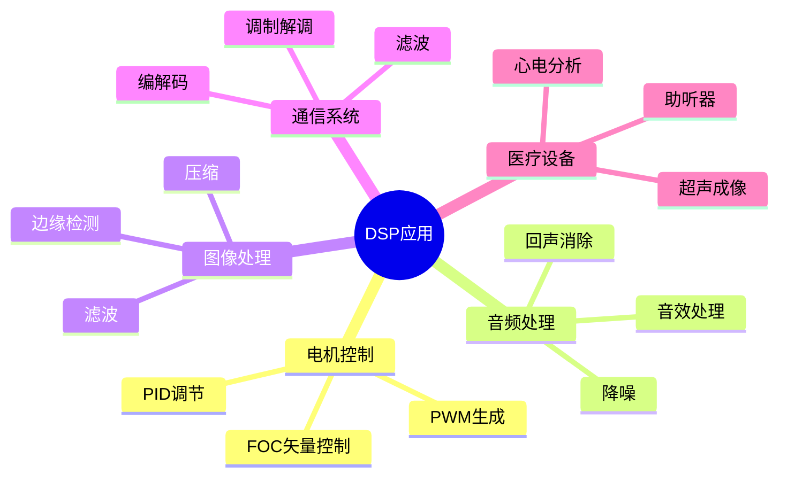
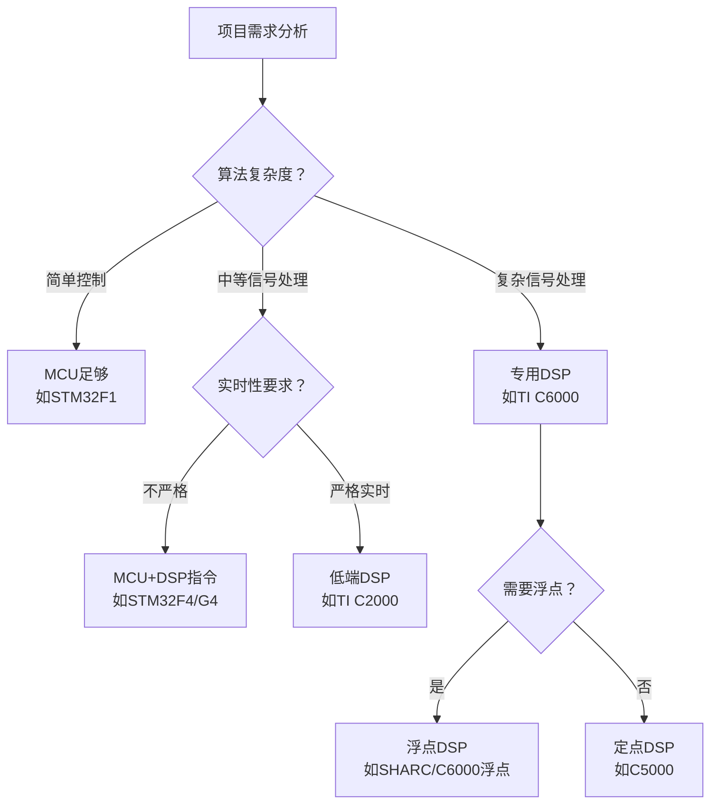

---
aliases:
  - DSP
  - 数字信号处理器
  - Digital Signal Processor
tags:
  - 嵌入式
  - 硬件与芯片
  - DSP
date: 2026-04-28
status: ✅完成
related:
  - "[[../_芯片架构总览]]"
  - "[[../处理器形态/MCU架构]]"
  - "[[../架构与指令集/ARM Cortx-M4]]"
---


> [!abstract] 核心定位
> DSP（数字信号处理器）通过哈佛架构+多总线+硬件 MAC，让 FIR/FFT 等信号处理算法在 N 个周期完成 N 次乘累加。本文件聚焦 DSP 与通用 MCU 的核心差异：硬件并行、零开销循环、特殊寻址模式、饱和运算。

---

## 一、DSP的物理架构：为什么它"天生"适合信号处理？

### 1.1 核心矛盾：通用MCU处理信号的瓶颈

先看一个典型场景：**FIR滤波器**

```c
// 标准FIR滤波器实现
int32_t fir_filter(int16_t *input, int16_t *coeff, int N) {
    int32_t acc = 0;
    for (int i = 0; i < N; i++) {
        acc += (int32_t)input[i] * (int32_t)coeff[i];  // 乘法+累加
    }
    return acc;
}
```

在Cortex-M4上，这段代码的**每一条乘累加操作**需要：
- 取指令（1周期）
- 取数据input[i]（可能等待总线）
- 取数据coeff[i]（可能等待总线）
- 执行乘法（1周期）
- 执行加法（1周期）
- 循环判断与跳转（1-2周期）

**一个N阶FIR滤波器，可能需要 5N~8N 个时钟周期！**

而DSP的设计目标就是：**让这个循环在 N 个周期内完成**。

---

### 1.2 DSP的物理布局：哈佛架构+多总线



**关键设计特点：**

| 特性 | 通用MCU | DSP | 优势 |
|------|---------|-----|------|
| 架构 | 冯·诺依曼（程序数据共用总线） | 改进哈佛（多总线并行） | 可同时取指、取两个操作数 |
| 乘法器 | 可选，多周期 | 硬件乘法器，单周期 | MAC单周期完成 |
| 循环开销 | 软件判断+跳转 | 硬件零开销循环 | 循环边界零额外周期 |
| 地址计算 | 通用ALU | 独立DAG（地址产生单元） | 地址计算与数据运算并行 |
| 数据宽度 | 8/16/32位 | 定点16/32位 或 浮点32/64位 | 针对信号处理优化 |

---

### 1.3 DSP的"杀手锏"：硬件级并行



**这就是DSP的核心竞争力：单周期内完成多个并行操作。**

---

## 二、DSP的设计哲学：为实时信号处理而生

### 2.1 零开销循环

传统MCU的循环：
```asm
; ARM汇编 - 循环需要额外指令
MOV     R0, #100        ; 循环次数
loop:
    ; ... 循环体 ...
    SUBS    R0, R0, #1  ; 计数器减1，设置标志位
    BNE     loop        ; 条件跳转（可能产生流水线气泡）
```

DSP的硬件循环：
```asm
; DSP汇编 - 零开销循环
RPT     #99            ; 硬件循环寄存器，自动递减判断
    MAC     *AR0+, *AR1+, A   ; 循环体，无额外开销
```

**硬件自动管理循环计数器、判断、跳转，不占用任何额外周期。**

---

### 2.2 特殊寻址模式：信号处理的"专用武器"



**位反转寻址示例（FFT）：**

FFT运算要求输入数据按**位反转顺序**排列。传统MCU需要软件计算：
```c
// 软件位反转 - 需要额外计算
for (int i = 0; i < N; i++) {
    int j = bit_reverse(i, log2(N));  // 额外开销
    fft_input[j] = input[i];
}
```

DSP硬件自动完成：
```asm
; DSP自动位反转寻址
FFT_LOOP:
    MOV     *BR0+, *AR1+   ; BR0是位反转指针，硬件自动计算
```

---

### 2.3 饱和运算：防止信号"溢出失真"

```c
// 通用MCU处理溢出
int32_t result = a + b;
if (result > INT16_MAX) result = INT16_MAX;  // 软件判断
if (result < INT16_MIN) result = INT16_MIN;

// DSP硬件饱和
// 硬件自动检测溢出，单周期内完成饱和
```

**音频处理中，溢出会产生严重的"咔嗒"噪声，饱和运算是DSP的标配。**

---

## 三、芯片选型：主流DSP芯片对比

### 3.1 主流DSP厂商与系列

| 厂商 | 系列 | 定点/浮点 | 典型应用 | 特点 |
|------|------|-----------|----------|------|
| **TI** | C2000 | 定点 | 电机控制、电源 | 集成PWM、ADC，控制专用 |
| **TI** | C5000 | 定点 | 语音、音频 | 低功耗，便携设备 |
| **TI** | C6000 | 定点+浮点 | 图像、通信、雷达 | 高性能，多核 |
| **ADI** | SHARC | 浮点 | 专业音频、医疗 | 超高精度浮点 |
| **ADI** | Blackfin | 定点+浮点 | 多媒体、工业 | DSP+MCU混合架构 |
| **NXP** | DSP56000 | 定点 | 音频、通信 | 经典架构 |

---

### 3.2 MCU+DSP混合方案：现代趋势

很多现代MCU已经集成了DSP指令集：

```c
// STM32F4 (Cortex-M4F) 使用DSP指令
#include "arm_math.h"

// CMSIS-DSP库，底层使用DSP指令
arm_fir_instance_f32 fir_inst;
arm_fir_init_f32(&fir_inst, NUM_TAPS, coeff, state, block_size);
arm_fir_f32(&fir_inst, input, output, block_size);
```

**对比：**

| 方案 | 优点 | 缺点 | 适用场景 |
|------|------|------|----------|
| 专用DSP | 极致性能、专用外设 | 开发门槛高、成本高 | 专业音频、雷达、通信 |
| MCU+DSP指令 | 开发简单、成本低 | 性能有上限 | 消费电子、工业控制 |
| FPGA+DSP | 灵活、可定制 | 开发难度最高 | 高端仪器、通信设备 |

---

## 四、嵌入式工程应用：DSP的实际战场

### 4.1 典型应用场景



### 4.2 实战案例：电机FOC控制

TI C2000 专为电机控制优化，核心算法管线：

```c
void FOC_Control(FOC_Handle *h) {
    Clarke_Transform(&h->Iab, &h->Iabc);      // Clarke变换
    Park_Transform(&h->Idq, &h->Iab, &h->theta); // Park变换
    h->Vd = PID_Calc(&h->pid_d, h->Id_ref, h->Idq.d); // PID
    h->Vq = PID_Calc(&h->pid_q, h->Iq_ref, h->Idq.q);
    InvPark_Transform(&h->Vab, &h->Vdq, &h->theta);
    SVPWM_Generate(&h->Vab, h->dc_bus);       // SVPWM调制
}
```

C2000 优势：150ps 分辨率 PWM、12 位 ADC 多通道同步采样、三角函数硬件加速器（TMU）。

### 4.3 实战案例：音频处理

ADI SHARC 专业音频处理链——32/40 位浮点提供 >120dB 动态范围：

```c
void Audio_Chain(float *in, float *out, int frames) {
    Adaptive_Noise_Cancellation(in, frames);  // 自适应降噪
    for (int b = 0; b < NUM_BANDS; b++)
        IIR_Filter(&eq_bands[b], in, frames); // 多段均衡
    Dynamic_Range_Compression(in, frames, &params); // 压缩
    Reverb_Process(in, out, frames, &params);  // 混响
}
```

---

## 五、大师的工程建议

### 5.1 何时选择DSP？



### 5.2 DSP开发避坑指南

| 坑点 | 现象 | 原因 | 解决方案 |
|------|------|------|----------|
| **定点溢出** | 信号突然变成噪声 | 累加器位数不足，运算结果超出表示范围 | 使用饱和运算、Q格式定点 |
| **精度损失** | 滤波器不稳定 | 系数量化截断，极点偏移 | 使用双精度累加器、检查系数量化 |
| **内存对齐** | 性能下降或崩溃 | DSP要求数据对齐到总线宽度边界 | 使用`#pragma DATA_ALIGN` |
| **Cache一致性** | 数据不一致 | DMA写入与CPU访问Cache未同步 | 使用Cache冻结或手动回写 |
| **中断延迟** | 实时性不达标 | 中断嵌套过深或ISR执行时间过长 | 使用DMA、优化中断优先级 |

---

## 总结

| 维度 | 核心特点 |
|------|----------|
| 物理架构 | 哈佛架构+多总线并行、硬件 MAC、独立地址生成单元 |
| 设计哲学 | 单周期乘累加、零开销循环、特殊寻址、饱和运算 |
| 选型考量 | 算法复杂度 + 实时性 → 专用DSP / MCU+DSP指令 / FPGA+DSP |

> [!quote] 本质
> DSP 不是"更快的 MCU"，而是为信号处理重新设计的架构——硬件级并行是其核心竞争力。

## 知识拓扑

- 上层：[[../_芯片架构总览]] — DSP 在处理器全景中的定位
- 关联：[[../架构与指令集/ARM Cortx-M4]] — Cortex-M4F 的 DSP 指令集与 FPU
- 关联：[[../处理器形态/MCU架构]] — MCU+DSP 混合方案（CMSIS-DSP）
