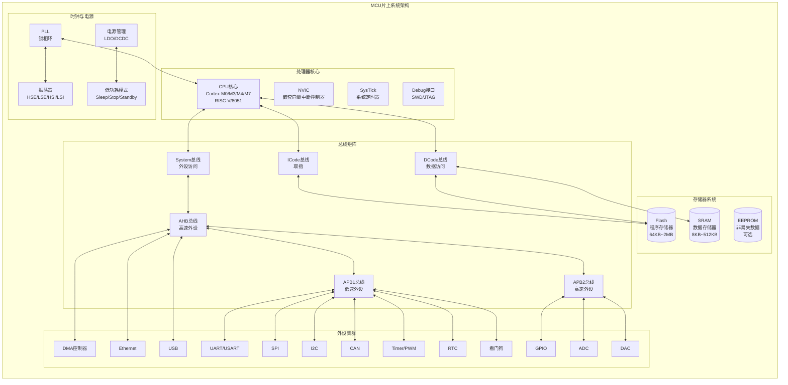
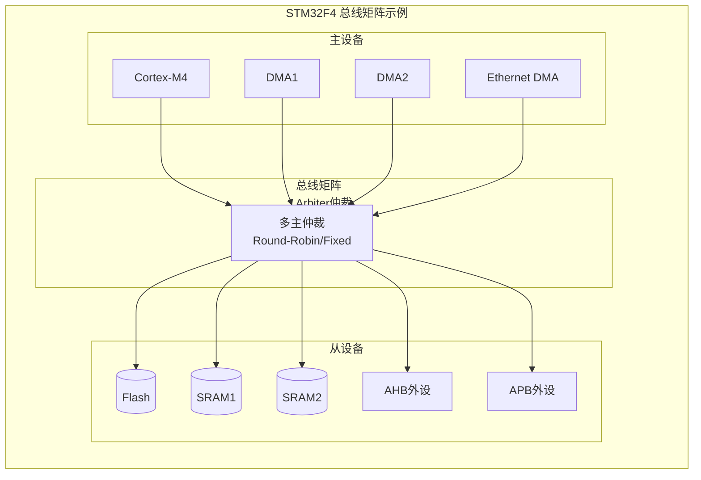
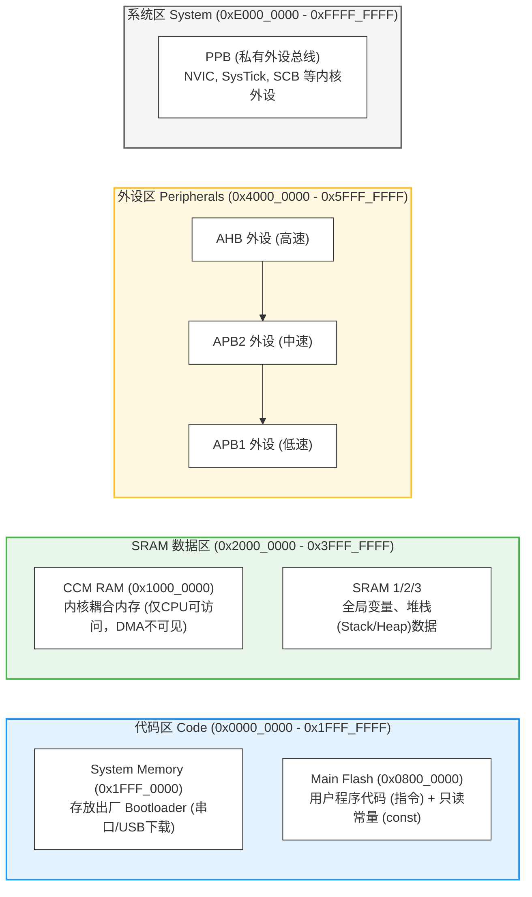
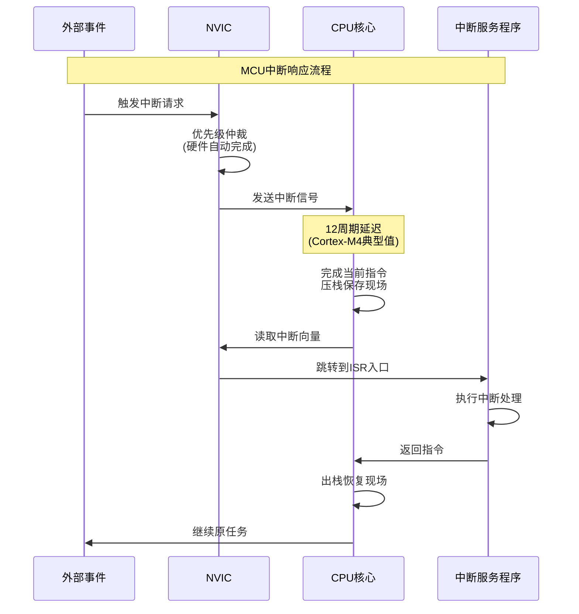
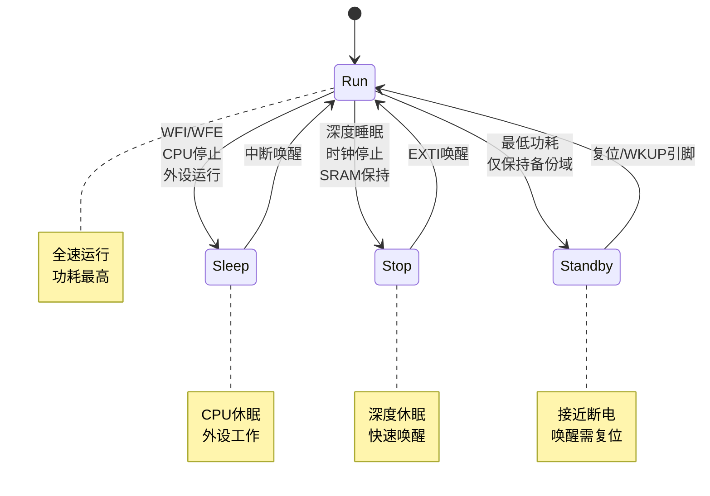
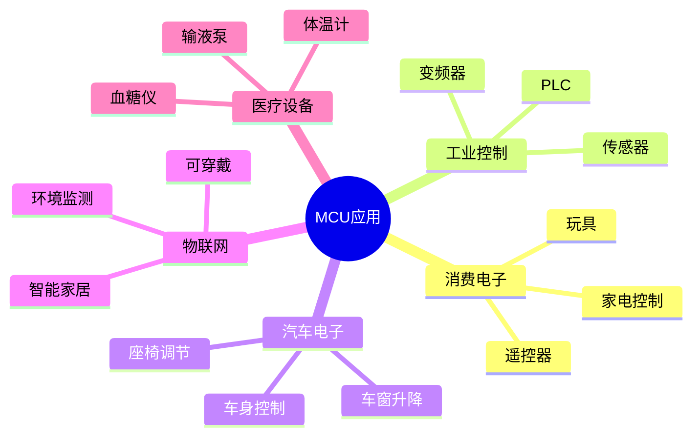
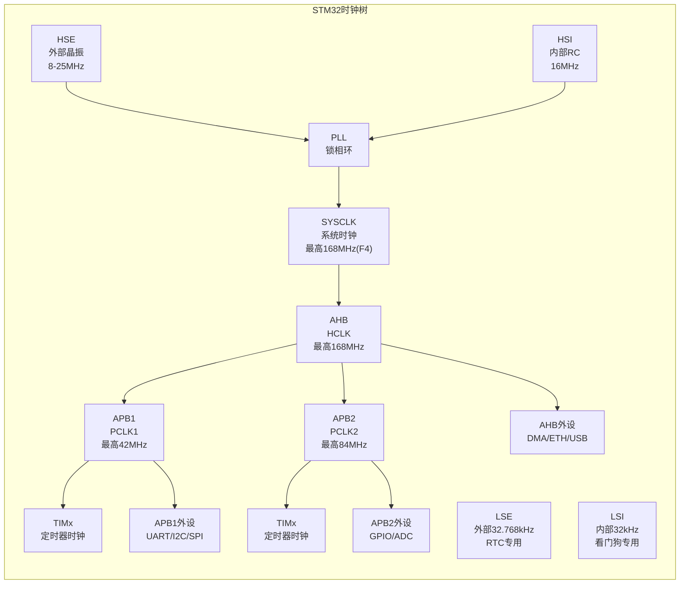
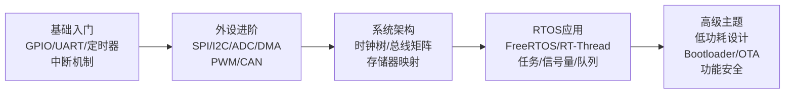
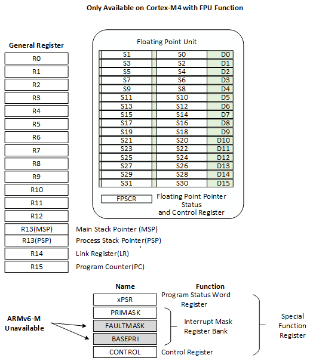

---
aliases:
  - MCU
  - 微控制器
  - Microcontroller
tags:
  - 嵌入式
  - 硬件与芯片
  - MCU
date: 2026-04-28
status: ✅完成
related:
  - "[[_芯片架构总览]]"
  - "[[ARM Cortx-M4]]"
  - "[[Xtensa LX6 双核架构]]"
  - "[[MPU架构]]"
  - "[[../专用处理能力/DSP]]"
---

> [!abstract] 核心定位
> MCU（微控制器）将 CPU、存储器、外设集成在单一芯片上，是嵌入式开发的基石。本文件聚焦 MCU 的物理架构特征：总线矩阵、存储器布局、确定性中断响应、低功耗设计。

---

## 一、MCU的物理架构：小而全的"瑞士军刀"

### 1.1 核心定位：单芯片解决方案

MCU的本质是**将CPU、存储器、外设集成在单一芯片上**，形成完整的微型计算机系统。



---

> [!tip] MCU 与 MPU、DSP 的完整对比见 [[_芯片架构总览]]

---

### 1.3 总线架构：MCU的"血管系统"



**总线层级：**

| 总线 | 速率 | 典型外设 |
|------|------|----------|
| **AHB** | 高速（与CPU同频） | DMA、ETH、USB、Flash控制器 |
| **APB2** | 中速（AHB/2） | GPIO、ADC、TIM高级定时器 |
| **APB1** | 低速（AHB/4） | UART、I2C、SPI、CAN、TIM通用定时器 |

---

### 1.4 存储器布局：MCU的"地图"



**关键地址区域：**

| 区域 | 起始地址 | 用途 | 特点 |
|------|----------|------|------|
| **Flash** | 0x0800_0000 | 程序代码 | 非易失，可擦写 |
| **SRAM** | 0x2000_0000 | 运行数据 | 易失，零等待 |
| **CCM** | 0x1000_0000 | 核心专用数据 | 无DMA，零等待 |
| **外设** | 0x4000_0000 | 寄存器映射 | 位带操作支持 |
| **PPB** | 0xE000_0000 | 内核寄存器 | 仅CPU可访问 |

---

## 二、MCU的设计哲学：确定性、实时性、低功耗

### 2.1 确定性响应：中断延迟可预测



**Cortex-M系列中断延迟：**

| 核心 | 最小延迟 | 典型延迟 | 特点 |
|------|----------|----------|------|
| Cortex-M0 | 16周期 | 16-20周期 | 简单设计 |
| Cortex-M3 | 12周期 | 12-16周期 | 优化流水线 |
| Cortex-M4 | 12周期 | 12-16周期 | 同M3+DSP |
| Cortex-M7 | 12周期 | 12-16周期 | 双发射+Cache |

**对比MPU（Linux）：**
- 典型中断延迟：**数十微秒到毫秒级**
- 原因：调度器延迟、关中断区域、Cache未命中

---

### 2.2 低功耗设计：电池供电的核心诉求



**功耗对比（STM32L4为例）：**

| 模式 | 典型功耗 | 唤醒时间 | 保持状态 |
|------|----------|----------|----------|
| **Run** | 100μA/MHz | - | 全部 |
| **Sleep** | 1.2mA | 7周期 | 全部 |
| **Stop2** | 1.5μA | 5μs | SRAM+寄存器 |
| **Standby** | 0.4μA | 50ms | 仅备份域 |

---

### 2.3 外设集成：单芯片解决方案

```c
// MCU外设初始化典型流程
void MCU_Init(void) {
    // 1. 时钟配置
    RCC_Config();       // PLL配置，系统时钟
    
    // 2. GPIO配置
    GPIO_Config();      // 引脚复用、上下拉
    
    // 3. 外设配置
    UART_Init();        // 串口通信
    SPI_Init();         // SPI外设
    I2C_Init();         // I2C外设
    TIM_Init();         // 定时器
    ADC_Init();         // 模数转换
    
    // 4. 中断配置
    NVIC_Config();      // 优先级设置
    
    // 5. DMA配置
    DMA_Config();       // 数据搬运
}
```

**集成优势：**

| 方案 | BOM成本 | PCB面积 | 可靠性 | 开发周期 |
|------|---------|---------|--------|----------|
| MCU集成 | 低 | 小 | 高 | 短 |
| MPU+外扩 | 高 | 大 | 中 | 长 |

---

## 三、芯片选型：主流MCU对比

### 3.2 主流MCU厂商与系列

| 厂商 | 系列 | 核心 | 主频 | 特点 | 典型应用 |
|------|------|------|------|------|----------|
| **ST** | STM32F0/F1 | Cortex-M0/M3 | 48-72MHz | 性价比高，生态完善 | 工业控制、消费电子 |
| **ST** | STM32F4 | Cortex-M4F | 168MHz | DSP指令，丰富外设 | 电机控制、音频 |
| **ST** | STM32H7 | Cortex-M7 | 480MHz | 双核，高性能 | 工业网关、图像处理 |
| **ST** | STM32L4 | Cortex-M4F | 80MHz | 超低功耗 | 电池设备、IoT |
| **Espressif** | ESP32 | Xtensa双核 | 240MHz | WiFi+BLE集成 | 智能家居、IoT |
| **NXP** | LPC系列 | Cortex-M0/M3/M4 | 50-150MHz | 汽车级认证 | 汽车电子 |
| **GigaDevice** | GD32 | Cortex-M3/M4 | 108-240MHz | 国产替代，高性价比 | 工业控制 |
| **WCH** | CH32 | RISC-V/ARM | 48-144MHz | 超低成本 | 消费电子 |
| **TI** | MSP430 | 16位 proprietary | 25MHz | 超低功耗 | 仪表、传感器 |
| **Nordic** | nRF52 | Cortex-M4F | 64MHz | BLE优化 | 可穿戴设备 |

---

### 3.4 国产替代方案

| 原厂型号 | 国产替代 | 兼容性 | 优势 | 注意事项 |
|----------|----------|--------|------|----------|
| STM32F103 | GD32F103 | 引脚/寄存器兼容 | 主频更高(108MHz) | ADC性能略差 |
| STM32F103 | CH32F103 | 引脚兼容 | 成本极低 | 外设数量减少 |
| STM32F407 | GD32F407 | 引脚/寄存器兼容 | 主频更高(168MHz) | 功耗略高 |
| STM32F4 | APM32F4 | 引脚兼容 | 工业级温度范围 | 生态较小 |
| ESP32 | ESP32-C3/S3 | 软件兼容 | RISC-V架构 | 外设差异 |

---

## 四、嵌入式工程应用：MCU的实际战场

### 4.1 典型应用场景



### 4.2 实战案例：工业控制器

MCU 工业控制器的典型主循环架构——确定性时序是其核心设计目标：

```c
void main_loop(void) {
    while (1) {
        input_scan();       // DI扫描 ~100μs
        adc_sample();       // ADC采样（DMA搬运）~50μs
        control_logic();    // 控制逻辑 ~500μs
        output_update();    // DO更新 ~50μs
        if (modbus_request) modbus_process();
        WDT_Feed();
        wait_for_cycle(10); // 硬件定时器保证10ms周期
    }
}
```

关键设计：DMA 搬运 ADC 数据释放 CPU、硬件定时器保证确定性周期、通信仅在空闲时处理。

---

### 4.3 实战案例：物联网节点

低功耗 IoT 节点的核心设计是"快速醒来干活，干完立即睡觉"：

```c
void iot_node_task(void) {
    while (1) {
        float temp = read_temperature();
        radio_send(pack_data(temp));
        radio_wait_ack(100);
        enter_stop_mode();
        // RTC定时唤醒（如每5分钟）
    }
}
```

功耗分析：活动态 10mA × 100ms ≈ 1mAh，睡眠态 2μA × 299.9s ≈ 0.002mAh，平均约 3.4μA。1000mAh 电池理论寿命约 33 年。

---

## 五、大师的工程建议

### 5.1 MCU开发核心陷阱

| 陷阱 | 表现 | 根因 | 解决方案 |
|------|------|------|----------|
| **栈溢出** | 随机崩溃、HardFault | 局部变量过大/递归过深 | 增大栈空间、使用静态分配 |
| **中断优先级反转** | 高优先级响应慢 | 低优先级占用资源 | 合理设置优先级组 |
| **DMA配置错误** | 数据错乱 | 地址对齐/缓存一致性问题 | 使用`__attribute__((aligned))` |
| **时钟配置错误** | 外设不工作 | 总线时钟未使能 | 检查RCC时钟树 |
| **Flash擦写失败** | 数据丢失 | 擦写时中断干扰 | 擦写前关中断 |
| **看门狗超时** | 系统复位 | 循环时间过长 | 优化代码/分片处理 |

---

### 5.2 时钟树配置详解



**时钟配置要点：**

```c
// STM32F4 时钟配置示例
void SystemClock_Config(void) {
    RCC_OscInitTypeDef RCC_OscInitStruct = {0};
    RCC_ClkInitTypeDef RCC_ClkInitStruct = {0};
    
    // 1. 配置PLL
    RCC_OscInitStruct.OscillatorType = RCC_OSCILLATORTYPE_HSE;
    RCC_OscInitStruct.HSEState = RCC_HSE_ON;
    RCC_OscInitStruct.PLL.PLLState = RCC_PLL_ON;
    RCC_OscInitStruct.PLL.PLLSource = RCC_PLLSOURCE_HSE;
    RCC_OscInitStruct.PLL.PLLM = 8;     // HSE/8 = 1MHz
    RCC_OscInitStruct.PLL.PLLN = 336;   // 1MHz × 336 = 336MHz
    RCC_OscInitStruct.PLL.PLLP = 2;     // 336/2 = 168MHz (SYSCLK)
    RCC_OscInitStruct.PLL.PLLQ = 7;     // 336/7 = 48MHz (USB)
    HAL_RCC_OscConfig(&RCC_OscInitStruct);
    
    // 2. 配置总线分频
    RCC_ClkInitStruct.ClockType = RCC_CLOCKTYPE_HCLK | 
                                   RCC_CLOCKTYPE_SYSCLK |
                                   RCC_CLOCKTYPE_PCLK1 | 
                                   RCC_CLOCKTYPE_PCLK2;
    RCC_ClkInitStruct.SYSCLKSource = RCC_SYSCLKSOURCE_PLLCLK;
    RCC_ClkInitStruct.AHBCLKDivider = RCC_SYSCLK_DIV1;   // 168MHz
    RCC_ClkInitStruct.APB1CLKDivider = RCC_HCLK_DIV4;    // 42MHz
    RCC_ClkInitStruct.APB2CLKDivider = RCC_HCLK_DIV2;    // 84MHz
    HAL_RCC_ClockConfig(&RCC_ClkInitStruct, FLASH_LATENCY_5);
}
```

---

### 5.3 内存分区优化

```c
// 链接脚本内存分区
MEMORY {
    FLASH (rx)  : ORIGIN = 0x08000000, LENGTH = 512K
    SRAM1 (rwx) : ORIGIN = 0x20000000, LENGTH = 96K
    SRAM2 (rwx) : ORIGIN = 0x20018000, LENGTH = 16K
    CCM   (rwx) : ORIGIN = 0x10000000, LENGTH = 64K
}

// 代码中指定变量位置
__attribute__((section(".ccm"))) uint8_t dma_buffer[1024];  // CCM中
__attribute__((section(".sram2"))) uint8_t backup_data[256]; // SRAM2中

// 栈和堆的配置
_stack_size = 0x2000;   // 8KB栈
_heap_size = 0x4000;    // 16KB堆
```

---

### 5.4 学习路径建议



---

## 总结

MCU架构的本质是**单芯片集成、确定性响应、低功耗设计**：

| 维度 | 核心特点 |
|------|----------|
| **物理架构** | CPU+存储器+外设集成，总线矩阵互联 |
| **设计哲学** | 确定性中断响应、低功耗模式、丰富外设 |
| **开发模式** | 裸机轮询或RTOS调度，直接硬件操作 |
| **选型考量** | 性能/功耗/成本平衡，生态与工具链 |

**MCU不是"低性能的CPU"，而是为控制类应用优化的完整系统。**

---

**工程师，你手头有MCU相关的项目吗？是做工业控制、物联网节点，还是消费电子？我可以针对具体场景给你更深入的架构建议。**


