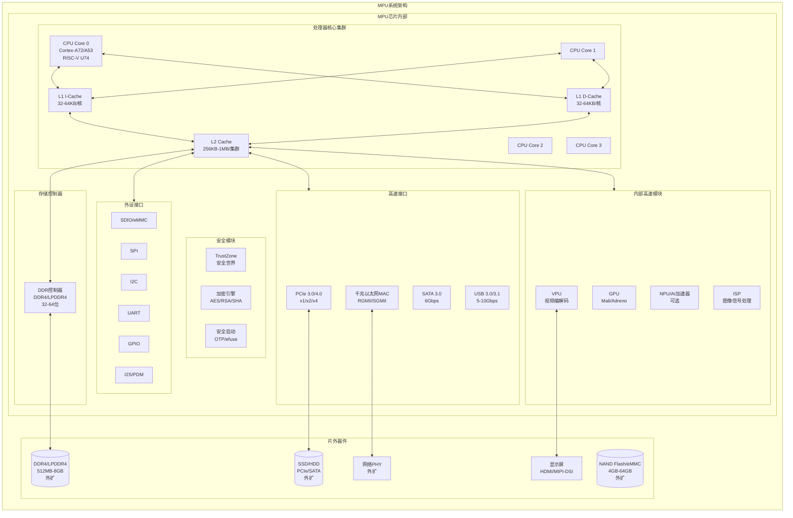
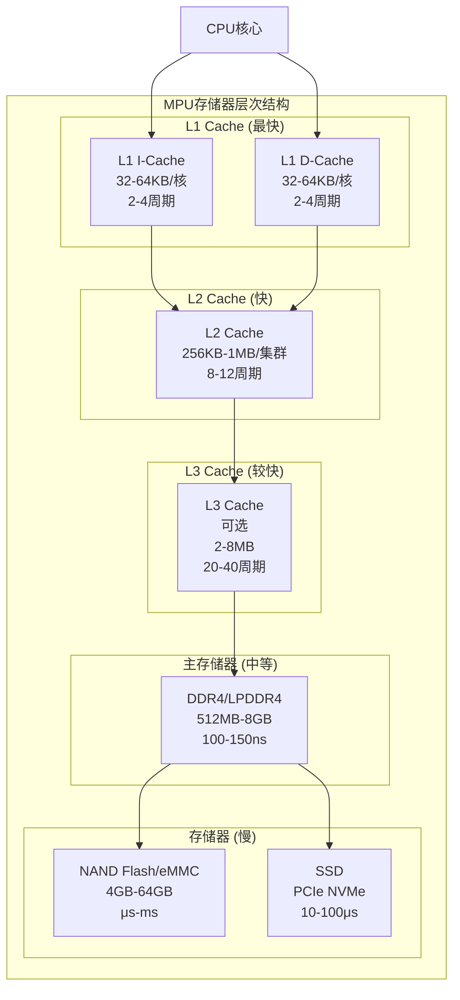
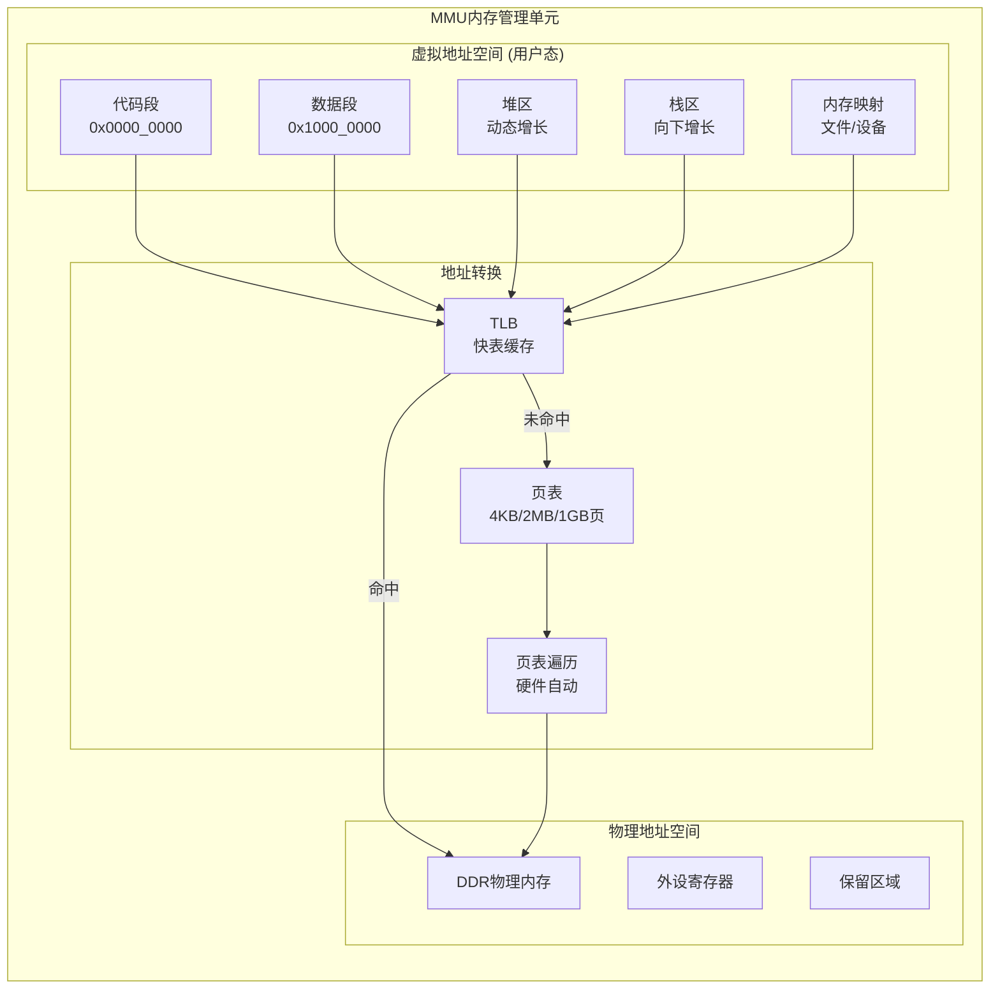
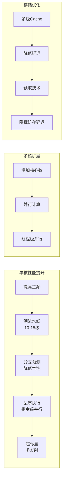
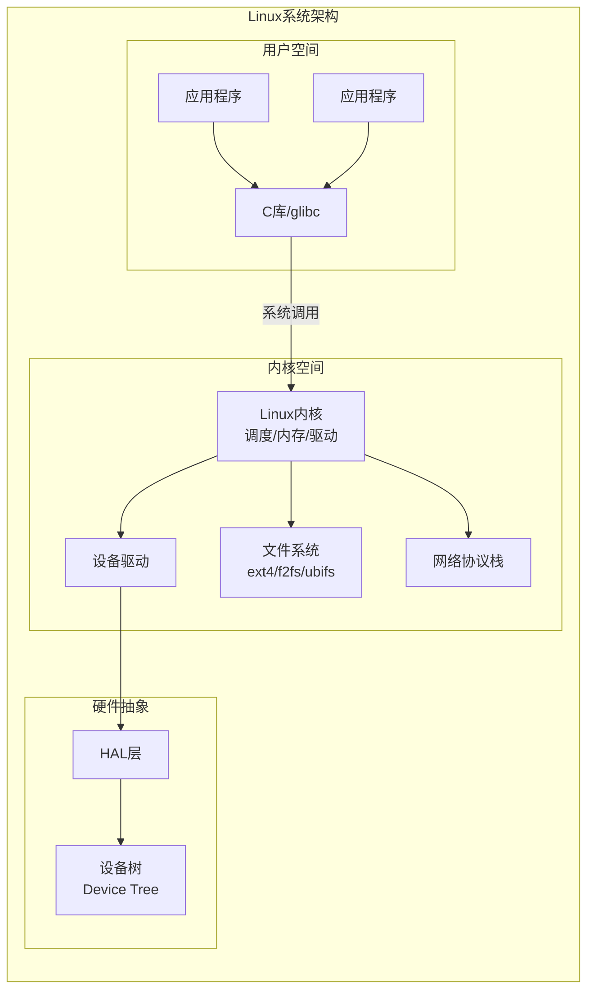
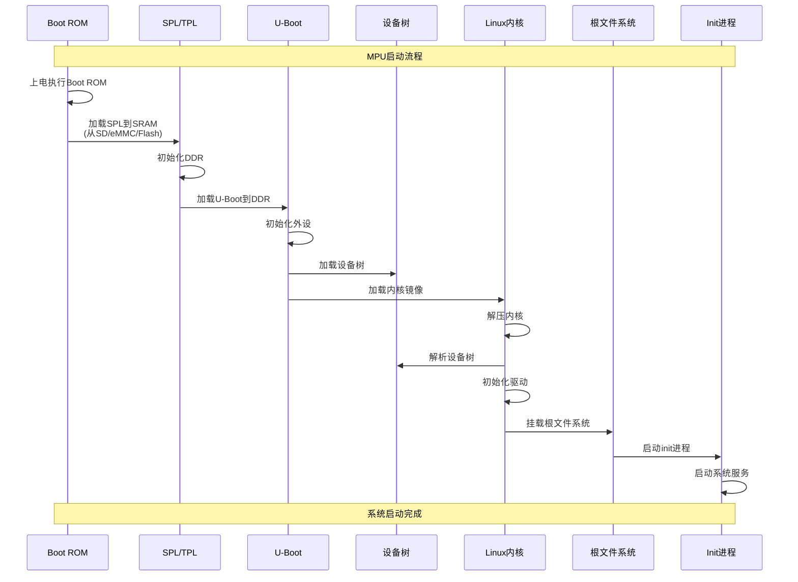
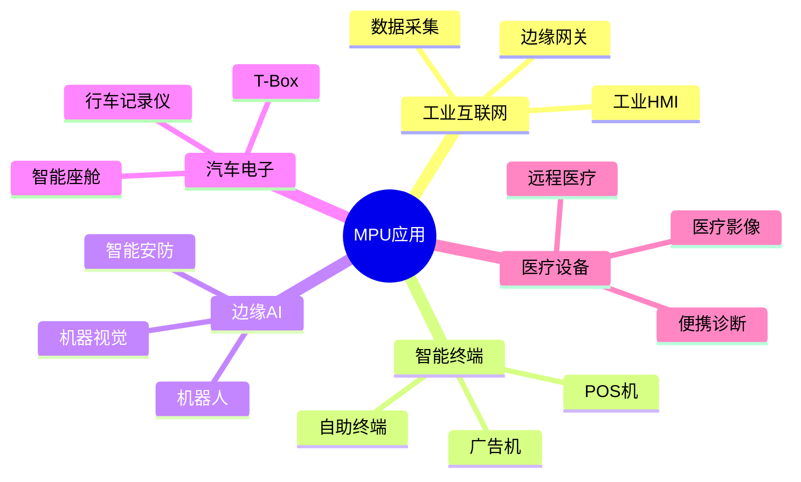
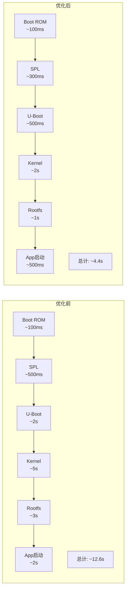

---
aliases:
  - MPU
  - 微处理器
  - Microprocessor
tags:
  - 嵌入式
  - 硬件与芯片
  - MPU
date: 2026-04-28
status: ✅完成
related:
  - "[[_芯片架构总览]]"
  - "[[MCU架构]]"
  - "[[SMP架构]]"
  - "[[AMP架构]]"
  - "[[MMU(内存管理单元)]]"
---

> [!abstract] 核心定位
> MPU（微处理器）将 CPU 核心做到极致，存储器和外设通过高速接口外扩，运行 Linux/Android 等复杂操作系统。本文件聚焦 MPU 与 MCU 的核心差异：MMU 虚拟内存、多级 Cache、U-Boot 启动链、设备树。

---

## 一、MPU的物理架构：外扩一切，追求极致性能

### 1.1 核心定位：高性能计算的核心

MPU的本质是**将CPU核心做到极致，存储器和外设通过高速接口外扩**，形成灵活的高性能计算平台。



---

> [!tip] MPU 与 MCU、DSP 的完整对比见 [[_芯片架构总览]]

### 1.3 存储器层次结构：MPU性能的关键



**访问延迟对比：**

| 存储层级 | 容量 | 访问延迟 | 带宽 |
|----------|------|----------|------|
| L1 Cache | 32-64KB | 2-4周期 | >100GB/s |
| L2 Cache | 256KB-1MB | 8-12周期 | 50-80GB/s |
| L3 Cache | 2-8MB | 20-40周期 | 30-50GB/s |
| DDR4 | 512MB-8GB | 100-150ns | 12-25GB/s |
| eMMC 5.1 | 4-64GB | 100-500μs | 100-400MB/s |
| NVMe SSD | 128GB-1TB | 10-100μs | 1-4GB/s |

---

### 1.4 MMU与虚拟内存：MPU的核心能力



**MMU的核心功能：**

| 功能 | 作用 | 优势 |
|------|------|------|
| **虚拟地址** | 每个进程独立地址空间 | 进程隔离、安全 |
| **分页管理** | 4KB/2MB/1GB页 | 灵活内存分配 |
| **内存保护** | 读写执行权限控制 | 防止非法访问 |
| **按需调页** | 缺页中断加载 | 高效内存利用 |
| **共享内存** | 多进程共享物理页 | 高效IPC |

---

### 1.5 总线架构：高性能数据通路

```mermaid
flowchart TB
    subgraph BusArch["MPU总线架构 (ARM SoC)"]
        direction TB
        
        subgraph Cores["处理器集群"]
            A72_0["Cortex-A72 #0"]
            A72_1["Cortex-A72 #1"]
            A53_0["Cortex-A53 #0"]
            A53_1["Cortex-A53 #1"]
        end
        
        subgraph CacheInterconnect["缓存一致性互连"]
            CCI["CCI-400/500<br/>Cache Coherent Interconnect<br/>硬件缓存一致性"]
            DMC["DMC-500<br/>DDR Memory Controller"]
        end
        
        subgraph SystemBus["系统总线"]
            NIC["NIC-400<br/>Network Interconnect<br/>AXI4总线"]
        end
        
        subgraph Masters["主设备"]
            GPU_M["GPU"]
            VPU_M["VPU"]
            DMA_M["DMA"]
            USB_M["USB"]
        end
        
        subgraph Slaves["从设备"]
            Periph["外设控制器"]
            Security["安全模块"]
            Bridge["APB桥"]
        end
    end
    
    A72_0 --> CCI
    A72_1 --> CCI
    A53_0 --> CCI
    A53_1 --> CCI
    
    CCI --> DMC
    DMC --> DDR["DDR4"]
    
    CCI --> NIC
    GPU_M --> NIC
    VPU_M --> NIC
    DMA_M --> NIC
    USB_M --> NIC
    
    NIC --> Periph
    NIC --> Security
    NIC --> Bridge
```



---

## 二、MPU的设计哲学：吞吐量优先，操作系统接管

### 2.1 高吞吐量设计：Cache与流水线



**Cortex-A72 vs Cortex-M4 流水线对比：**

| 特性 | Cortex-M4 | Cortex-A72 |
|------|-----------|------------|
| 流水线深度 | 3级 | 15级 |
| 发射宽度 | 单发射 | 3发射 |
| 乱序执行 | 无 | 有 |
| 分支预测 | 静态 | 动态2级 |
| L1 Cache | 可选 | 48KB I + 32KB D |
| L2 Cache | 无 | 512KB-1MB |
| MMU | 无 | 有 |

---

### 2.2 操作系统支持：复杂软件生态



**MPU操作系统选择：**

| 操作系统 | 特点 | 适用场景 |
|----------|------|----------|
| **Linux** | 开源、生态丰富、功能完整 | 工业网关、边缘计算 |
| **Android** | 触屏交互、应用生态 | 智能终端、POS机 |
| **RTOS + Linux** | AMP架构，实时+通用 | 工业控制、汽车 |
| **FreeBSD** | 网络性能优异 | 网络设备 |
| **VxWorks** | 实时性、安全认证 | 航空航天、国防 |

---

### 2.3 启动流程：从Boot ROM到Linux



**启动阶段详解：**

| 阶段 | 存储位置 | 功能 | 典型大小 |
|------|----------|------|----------|
| Boot ROM | 芯片内部 | 第一级启动，加载SPL | 32-128KB |
| SPL/TPL | 外部存储 | 初始化DDR，加载U-Boot | 64-256KB |
| U-Boot | 外部存储 | 引导加载，内核参数 | 512KB-2MB |
| Linux内核 | 外部存储 | 操作系统核心 | 5-20MB |
| 设备树 | 外部存储 | 硬件描述 | 20-100KB |
| 根文件系统 | 外部存储 | 用户空间 | 100MB-数GB |

---

### 2.4 设备树：硬件描述的标准方式

```dts
// 设备树示例 (RK3399)
/ {
    compatible = "rockchip,rk3399";
    
    cpus {
        #address-cells = <2>;
        #size-cells = <0>;
        
        cpu0: cpu@0 {
            device_type = "cpu";
            compatible = "arm,cortex-a53";
            reg = <0x0 0x0>;
            clocks = <&cru ARMCLKL>;
        };
        
        cpu4: cpu@100 {
            device_type = "cpu";
            compatible = "arm,cortex-a72";
            reg = <0x0 0x100>;
            clocks = <&cru ARMCLKB>;
        };
    };
    
    memory@0 {
        device_type = "memory";
        reg = <0x0 0x80000000 0x0 0x80000000>;  // 2GB DDR
    };
    
    uart2: serial@ff1a0000 {
        compatible = "rockchip,rk3399-uart";
        reg = <0x0 0xff1a0000 0x0 0x100>;
        interrupts = <GIC_SPI 149 IRQ_TYPE_LEVEL_HIGH>;
        clocks = <&cru SCLK_UART2>, <&cru PCLK_UART2>;
        status = "okay";
    };
};
```

---

## 三、芯片选型：主流MPU处理器对比

### 3.2 主流MPU厂商与系列

| 厂商 | 系列 | 架构 | 核心配置 | 主频 | 典型应用 |
|------|------|------|----------|------|----------|
| **NXP** | i.MX8M Mini | Cortex-A53 | 4核 | 1.8GHz | 工业HMI、边缘网关 |
| **NXP** | i.MX8QM | Cortex-A72+A53 | 2+4核 | 1.6GHz | 汽车IVI、医疗 |
| **Rockchip** | RK3399 | Cortex-A72+A53 | 2+4核 | 1.8GHz | 平板、边缘计算 |
| **Rockchip** | RK3588 | Cortex-A76+A55 | 4+4核 | 2.4GHz | AI边缘、NVR |
| **TI** | AM62x | Cortex-A53 | 4核 | 1.4GHz | 工业控制、HMI |
| **TI** | AM62A7 | Cortex-A53 | 4核+DSP | 1.4GHz | 机器视觉 |
| **ST** | STM32MP157 | Cortex-A7+M4 | 2核+1核 | 650MHz | 工业HMI、低成本 |
| **NVIDIA** | Jetson Orin | Cortex-A78AE | 8核 | 2.2GHz | 自动驾驶、机器人 |
| **AMD** | RZ/G2L | Cortex-A55 | 2核 | 1.2GHz | 工业网关 |

---

### 3.4 国产MPU方案

| 芯片 | 架构 | 核心配置 | 对标产品 | 特点 |
|------|------|----------|----------|------|
| **RK3399** | A72+A53 | 2+4核 | i.MX8QM | 高性价比、生态完善 |
| **RK3588** | A76+A55 | 4+4核 | i.MX8M Plus | 自研NPU、高性能 |
| **RK3568** | A55 | 4核 | i.MX8M Mini | 低功耗、工业级 |
| **全志T507** | A53 | 4核 | AM62x | 超低成本 |
| **晶晨S905** | A53 | 4核 | - | 消费电子、机顶盒 |
| **飞腾FT-2000/4** | ARMv8 | 4核 | - | 国产自主、信创 |

---

## 四、嵌入式工程应用：MPU的实际战场

### 4.1 典型应用场景



### 4.2 实战案例：工业边缘网关

RK3399（2×A72 + 4×A53）上的多服务架构——Linux 多进程模型是 MPU 应用的核心范式：

```
// 系统架构：Linux 多服务进程
// ├── 数据采集服务 (Modbus TCP → 本地消息队列)
// ├── 边缘计算服务 (TFLite 推理, NPU 加速)
// └── 通信服务 (MQTT 上报云端)
```

关键设计：各服务独立进程、MQTT 消息队列解耦采集与上报、NPU 加速 AI 推理。

---

### 4.3 实战案例：智能安防NVR

RK3588（4×A76 + 4×A55 + NPU 6TOPS）的并行处理管线：

```
// 管线架构：V4L2采集 → 多线程处理
// ├── 视频采集线程 (MIPI-CSI, V4L2 MMAP)
// ├── AI检测线程 (RKNN NPU推理, YOLOv5)
// └── 视频存储线程 (MPP VPU硬件编码, H.264)
```

关键设计：V4L2 MMAP 零拷贝采集、NPU 硬件加速推理、VPU 硬件编码释放 CPU。

---

## 五、大师的工程建议

### 5.1 MPU开发核心陷阱

| 陷阱 | 表现 | 根因 | 解决方案 |
|------|------|------|----------|
| **DDR初始化失败** | 无法启动 | 时序参数错误 | 使用厂商DDR工具配置 |
| **设备树错误** | 外设不工作 | 兼容性/地址错误 | 检查dts语法和硬件手册 |
| **Cache一致性** | 数据不同步 | DMA与CPU缓存冲突 | 使用dma_sync_single_for_cpu |
| **电源域配置** | 外设无响应 | 电源域未使能 | 检查PMIC和电源域配置 |
| **热管理** | 系统卡死 | 过热降频 | 优化散热、监控温度 |
| **启动时间过长** | 用户体验差 | 初始化冗余 | 优化启动流程、并行初始化 |

---

### 5.2 启动优化策略



**优化措施：**

| 阶段 | 优化方法 | 效果 |
|------|----------|------|
| SPL | 精简代码、优化DDR训练 | 减少200ms |
| U-Boot | 跳过自检、快速启动模式 | 减少1.5s |
| Kernel | 裁剪模块、并行初始化 | 减少3s |
| Rootfs | 使用initramfs、异步服务 | 减少2s |
| App | 预加载、延迟加载 | 减少1.5s |

---

## 总结

| 维度 | 核心特点 |
|------|----------|
| 物理架构 | 外扩 DDR、多级 Cache、高速接口（PCIe/USB3） |
| 设计哲学 | 高吞吐量、MMU 虚拟内存、操作系统驱动 |
| 开发模式 | Linux/Android，用户空间 + 内核空间分离 |

> [!quote] 本质
> MPU 不是"高性能 MCU"，而是为复杂软件生态和高吞吐计算设计的完整平台。

## 知识拓扑

- 上层：[[_芯片架构总览]] — MPU 在处理器全景中的定位
- 对比：[[MCU架构]] — 实时控制端的设计差异
- 深入：[[MMU(内存管理单元)]] — 虚拟内存机制详解
- 扩展：[[SMP架构]] / [[AMP架构]] — MPU 级多核范式
