---
aliases:
  - AMP
  - 非对称多处理
  - Asymmetric Multiprocessing
tags:
  - 嵌入式
  - 硬件与芯片
  - AMP
  - 多核
date: 2026-04-28
status: ✅完成
related:
  - "[[_芯片架构总览]]"
  - "[[SMP架构]]"
  - "[[MPU架构]]"
  - "[[DMA 与 Cache 一致性]]"
---

> [!abstract] 核心定位
> AMP（非对称多处理）让多个核心各自运行独立系统（Linux / RTOS / 裸机），通过共享内存+中断进行核间通信。本文件聚焦 AMP 的核心技术：内存分区链接脚本、OpenAMP/RPMsg 通信框架、故障隔离与 ASIL 安全等级、Cache 一致性维护。

---

## 一、AMP的物理架构：独立王国，按需结盟

### 1.1 核心矛盾：SMP的局限性

SMP架构面临的挑战：

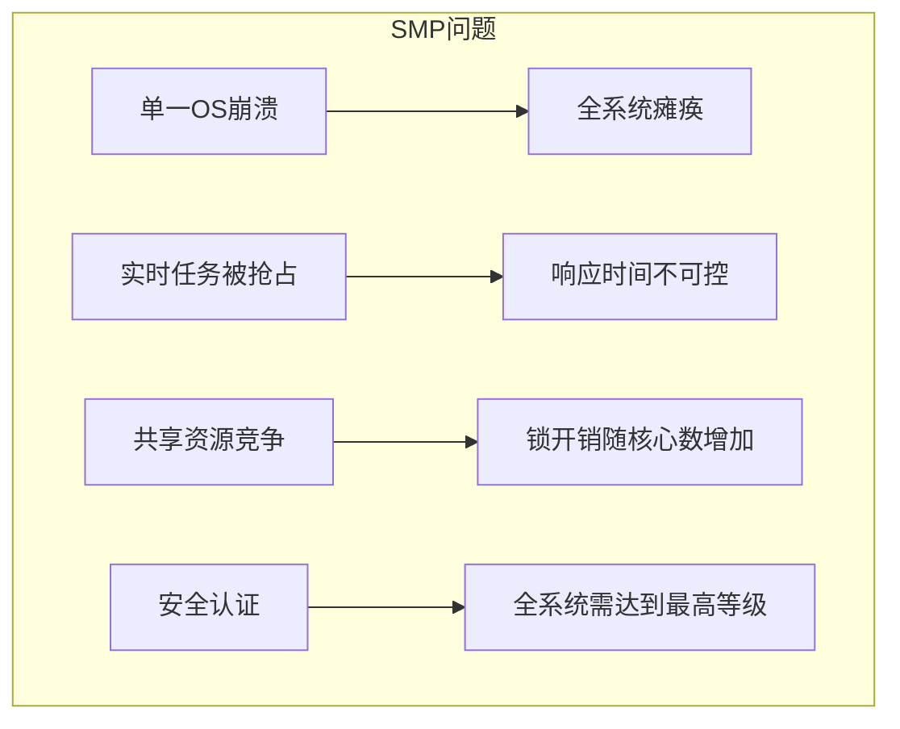

**AMP的解决思路：分而治之，各司其职**

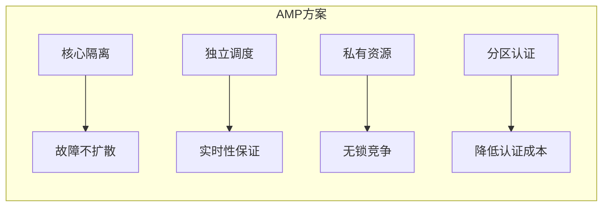

---

### 1.2 AMP的物理布局：独立内存空间 + 共享通信区

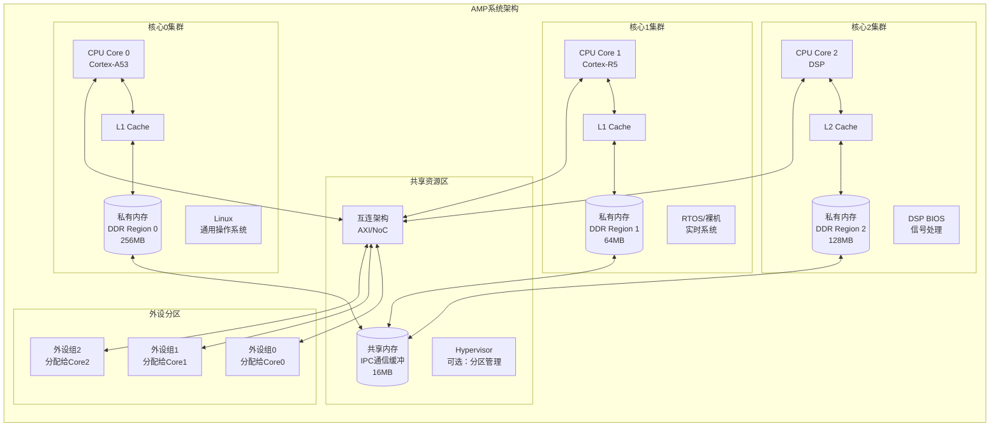

---

> [!tip] AMP 与 SMP、BMP 的完整对比见 [[_芯片架构总览]]

---

### 1.4 内存分区：AMP的核心设计

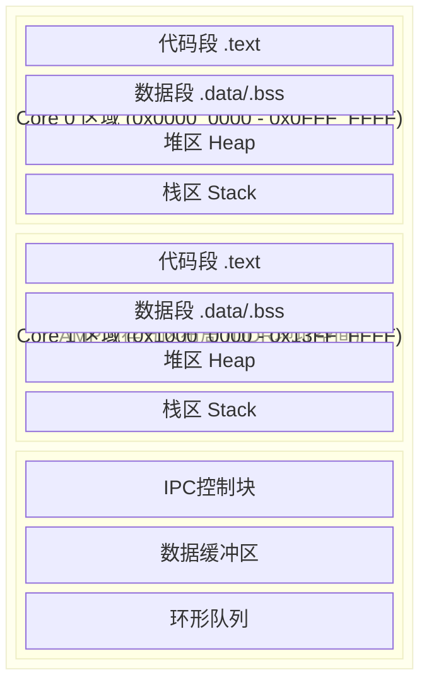

**链接脚本示例：**

```c
// Core 0 链接脚本
MEMORY {
    CODE  (rx)  : ORIGIN = 0x00000000, LENGTH = 128M
    DATA  (rwx) : ORIGIN = 0x08000000, LENGTH = 128M
    SHARED(rwx) : ORIGIN = 0x1F000000, LENGTH = 16M
}

// Core 1 链接脚本
MEMORY {
    CODE  (rx)  : ORIGIN = 0x10000000, LENGTH = 32M
    DATA  (rwx) : ORIGIN = 0x12000000, LENGTH = 32M
    SHARED(rwx) : ORIGIN = 0x1F000000, LENGTH = 16M  // 相同共享区
}
```

---

## 二、AMP的设计哲学：隔离、确定性、异构协同

### 2.1 故障隔离：安全关键系统的基石

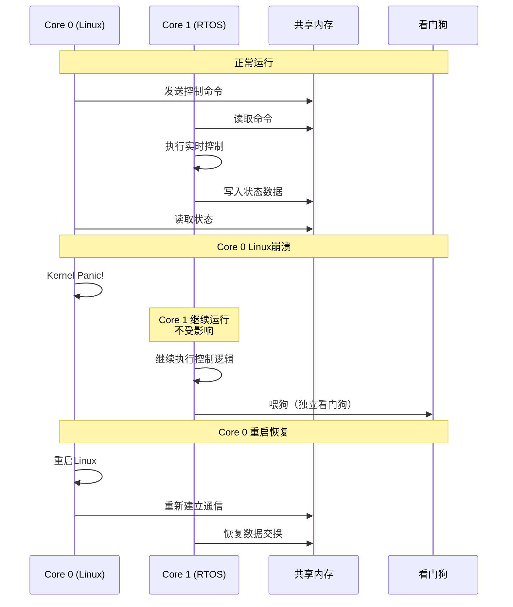

**功能安全等级分区：**

| 核心 | 运行系统 | 安全等级 | 功能 |
|------|----------|----------|------|
| Core 0 | Linux | QM (无要求) | HMI、日志、网络 |
| Core 1 | RTOS | ASIL-B | 通信网关 |
| Core 2 | 裸机 | ASIL-D | 电机控制 |
| Core 3 | 安全监控 | ASIL-D | 看门狗、诊断 |

---

### 2.2 IPC通信：核心间的"外交协议"

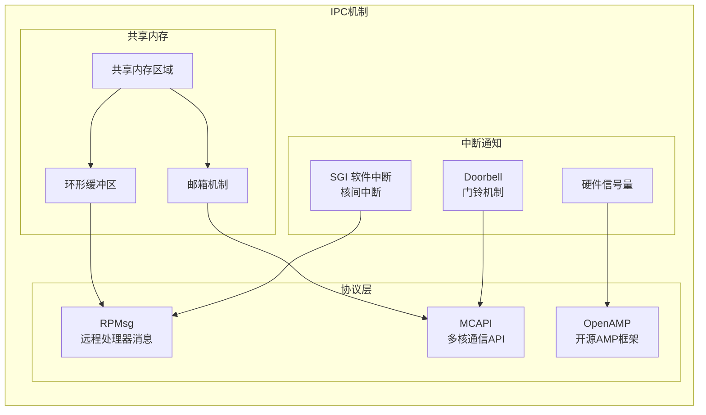

**IPC通信流程：**

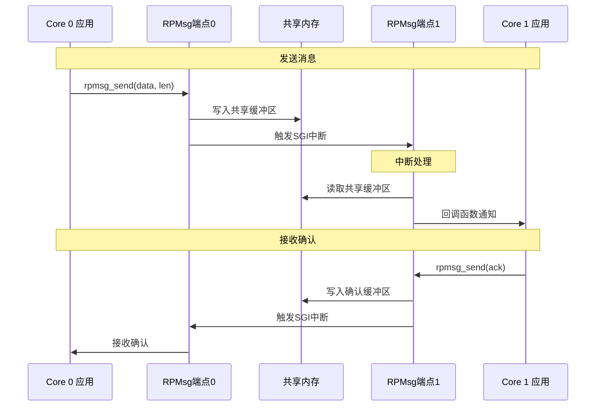

---

### 2.3 OpenAMP框架：标准化的AMP通信

```c
// OpenAMP 通信示例
// Core 0 (Linux主核)
#include <openamp/open_amp.h>
#include <metal/device.h>

struct rpmsg_endpoint ept;
struct rpmsg_virtio_device rvdev;

// 端点回调函数
int endpoint_cb(struct rpmsg_endpoint *ept, void *data, 
                size_t len, uint32_t src, void *priv) {
    printf("Received from remote: %s\n", (char *)data);
    return 0;
}

// 初始化AMP通信
void amp_master_init(void) {
    // 1. 初始化共享内存资源表
    struct metal_device *shm_dev;
    metal_device_open("generic", "shm", &shm_dev);
    
    // 2. 创建RPMsg设备
    rpmsg_virtio_init_shm(&rvdev, shm_dev, ...);
    
    // 3. 创建端点
    rpmsg_create_ept(&ept, &rvdev.rdev, "ep0", 
                     RPMSG_ADDR_ANY, RPMSG_ADDR_ANY,
                     endpoint_cb, NULL);
}

// 发送消息
void amp_send(const char *msg, int len) {
    rpmsg_send(&ept, msg, len);
}
```

```c
// Core 1 (RTOS从核)
#include <openamp/open_amp.h>
#include <metal/device.h>

struct rpmsg_endpoint ept;

// 端点回调函数
int endpoint_cb(struct rpmsg_endpoint *ept, void *data,
                size_t len, uint32_t src, void *priv) {
    // 处理接收到的命令
    process_command(data, len);
    
    // 发送响应
    rpmsg_send(ept, "ACK", 3);
    return 0;
}

// 从核初始化
void amp_remote_init(void) {
    // 1. 初始化资源表（由主核配置）
    remoteproc_resource_init(&rsc_table, ...);
    
    // 2. 创建端点
    rpmsg_create_ept(&ept, &rdev, "ep0",
                     RPMSG_ADDR_ANY, RPMSG_ADDR_ANY,
                     endpoint_cb, NULL);
    
    // 3. 等待主核连接
    while (!is_rpmsg_ept_ready(&ept)) {
        // 等待...
    }
}
```

---

### 2.4 启动流程：主从核协同启动

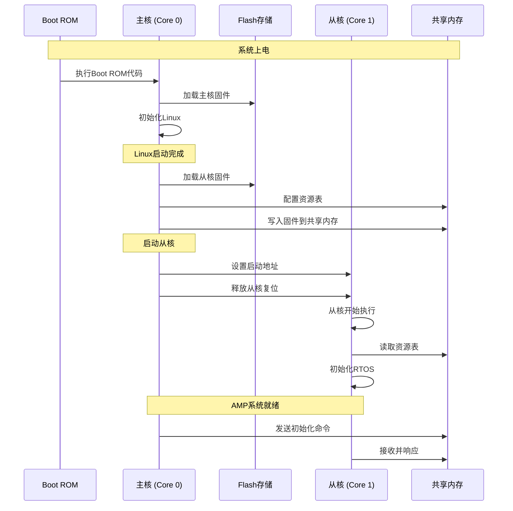

---

## 三、芯片选型：主流AMP处理器对比

### 3.1 主流AMP芯片对比

| 芯片 | 架构组合 | 核心配置 | 典型应用 | 特点 |
|------|----------|----------|----------|------|
| **TI AM6548** | A53 + R5F | 4×A53 + 2×R5F | 工业控制 | PRU实时单元，TSN支持 |
| **NXP i.MX8QM** | A72 + A53 + M4 | 2×A72 + 4×A53 + 2×M4 | 汽车IVI | 大小核+实时核 |
| **STM32MP157** | A7 + M4 | 2×A7 + 1×M4 | 工业HMI | 低成本AMP方案 |
| **Xilinx Zynq MP** | A53 + R5 + FPGA | 4×A53 + 2×R5 + FPGA | 通信、仪器 | 可编程逻辑加速 |
| **Infineon Aurix TC3xx** | TriCore | 3×TriCore | 汽车安全 | ASIL-D原生支持 |
| **NXP S32G2** | A53 + M7 | 4×A53 + 2×M7 | 汽车网关 | ASIL-D，LLCE加速 |
| **TI TMS570** | Cortex-R5 | 2×R5 (锁步) | 航空航天 | 锁步运行，安全认证 |

---

### 3.2 异构AMP架构示例

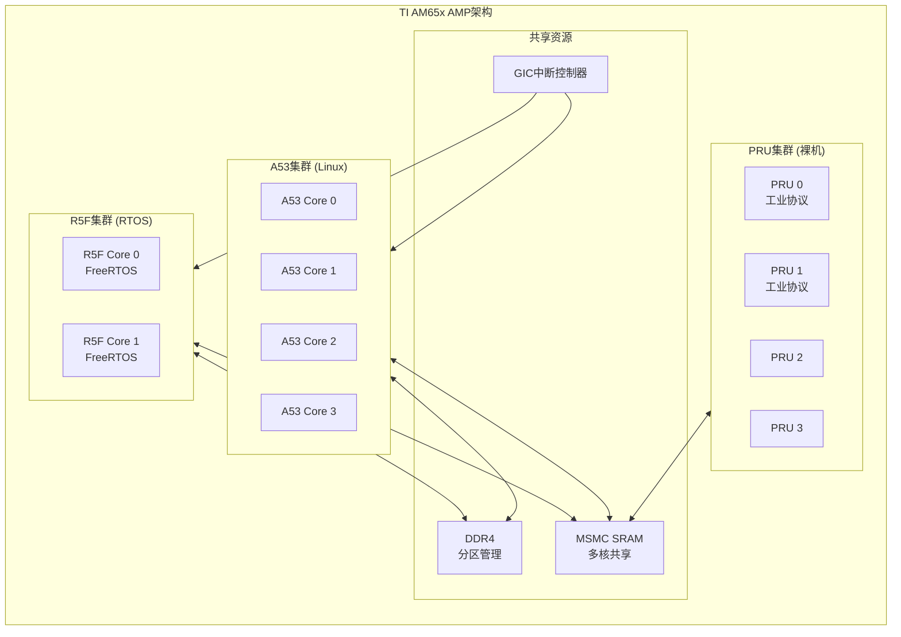

**任务分配示例：**

| 核心 | 操作系统 | 任务 | 安全等级 |
|------|----------|------|----------|
| A53 x 4 | Linux | HMI、数据记录、网络通信 | QM |
| R5F 0 | FreeRTOS | 运动控制、IO处理 | ASIL-B |
| R5F 1 | FreeRTOS | 安全监控、诊断 | ASIL-C |
| PRU 0-1 | 裸机 | EtherCAT主站 | ASIL-B |
| PRU 2-3 | 裸机 | 编码器接口 | ASIL-B |

---

## 四、嵌入式工程应用：AMP的实际战场

### 4.1 典型应用场景

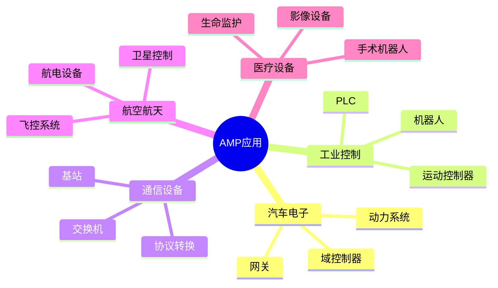

### 4.2 实战案例：汽车域控制器

NXP S32G2（4×A53 + 2×M7）的三层 AMP 架构：

| 核心 | 系统 | 任务 | 安全等级 |
|------|------|------|----------|
| A53 × 4 | Linux | HMI、OTA、诊断 | QM |
| M7 #0 | RTOS | CAN/LIN 网关、PID 控制 | ASIL-B |
| M7 #1 | 安全固件 | 心跳监控、内存完整性、看门狗 | ASIL-D |

关键设计：安全监控核独立于控制核，Linux 崩溃不影响实时控制；核间通过 RPMsg 交换状态数据。

---

### 4.3 实战案例：工业运动控制器

TI AM65x（4×A53 + 2×R5F + 4×PRU）的异构 AMP 分工：

| 核心 | 任务 | 延迟要求 |
|------|------|----------|
| A53 | 用户交互、轨迹规划、HMI | ms级 |
| R5F | PID 闭环控制、状态上报 | 1ms周期 |
| PRU | 编码器四倍频、EtherCAT | 纳秒级 |

数据流：PRU 采集编码器 → 共享内存 → R5F 执行 PID → PWM 输出；A53 通过 RPMsg 下发运动指令。

---

## 五、大师的工程建议

### 5.1 AMP开发核心陷阱

| 陷阱 | 表现 | 根因 | 解决方案 |
|------|------|------|----------|
| **内存踩踏** | 随机崩溃、数据错乱 | 私有内存边界未保护 | MPU配置、内存分区 |
| **IPC死锁** | 核心间通信卡死 | 双向等待、资源竞争 | 超时机制、无锁队列 |
| **缓存一致性** | 数据不同步 | 共享内存未刷新 | Cache维护操作 |
| **启动顺序** | 从核启动失败 | 主从核同步问题 | 握手协议、状态机 |
| **中断路由** | 中断丢失 | 中断控制器配置错误 | 检查GIC亲和性 |
| **资源冲突** | 外设访问异常 | 多核同时访问 | 外设分区、互斥锁 |

---

### 5.2 缓存一致性处理

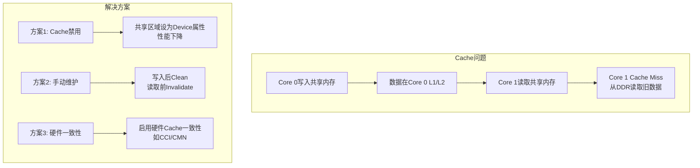

**手动Cache维护代码：**

```c
// 共享内存缓冲区
#define SHARED_BUF_ADDR  0x1F000000
#define SHARED_BUF_SIZE  4096

// Core 0 写入数据后
void core0_write_data(void *data, int len) {
    memcpy((void *)SHARED_BUF_ADDR, data, len);
    
    // Cache Clean: 将L1/L2数据写回DDR
    // ARMv8指令
    __asm__ volatile (
        "dc cvac, %0\n"      // Clean by VA to PoC
        "dsb sy\n"           // Data Synchronization Barrier
        :: "r"(SHARED_BUF_ADDR)
    );
    
    // 通知对端核
    send_sgi(1, SGI_ID_DATA_READY);
}

// Core 1 读取数据前
void core1_read_data(void *data, int len) {
    // 等待通知
    wait_for_sgi(SGI_ID_DATA_READY);
    
    // Cache Invalidate: 使L1/L2缓存失效，强制从DDR读取
    __asm__ volatile (
        "dc ivac, %0\n"      // Invalidate by VA to PoC
        "dsb sy\n"
        :: "r"(SHARED_BUF_ADDR)
    );
    
    memcpy(data, (void *)SHARED_BUF_ADDR, len);
}
```

---

## 总结

| 维度 | 核心特点 |
|------|----------|
| 物理架构 | 独立内存空间 + 共享通信区、外设分区 |
| 设计哲学 | 故障隔离、确定性实时、异构协同 |
| 通信机制 | 共享内存 + 中断通知、OpenAMP/RPMsg 框架 |

> [!quote] 本质
> AMP 不是"多个系统拼在一起"，而是为安全关键和异构计算场景设计的系统级隔离方案。

## 知识拓扑

- 上层：[[_芯片架构总览]] — AMP 在处理器全景中的定位
- 对比：[[SMP架构]] — 对称多核的设计哲学差异
- 深入：[[DMA 与 Cache 一致性]] — AMP 共享内存的 Cache 维护详解
- 关联：[[MPU架构]] — AMP 通常基于 MPU 级处理器实现