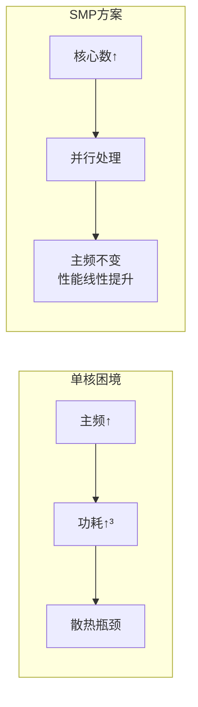
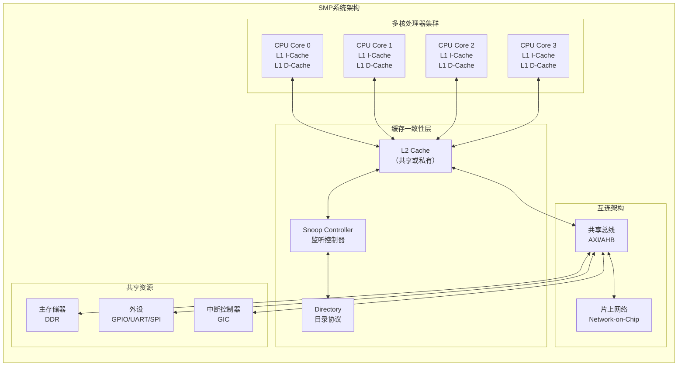
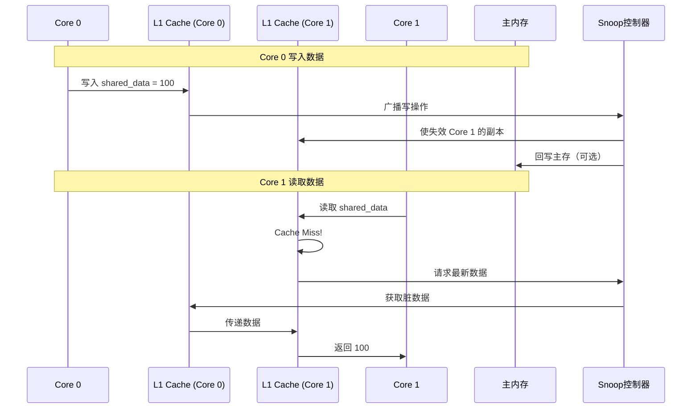
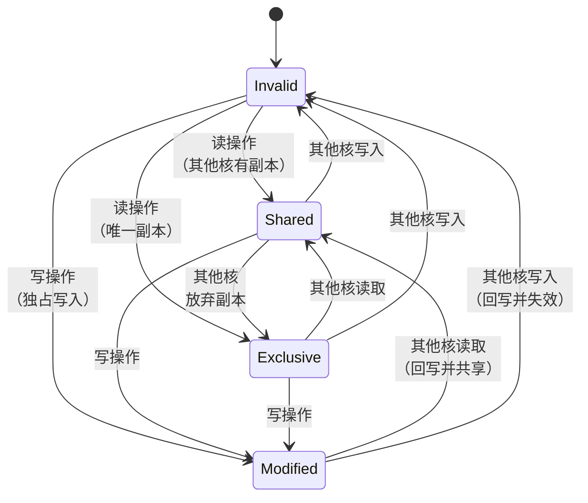
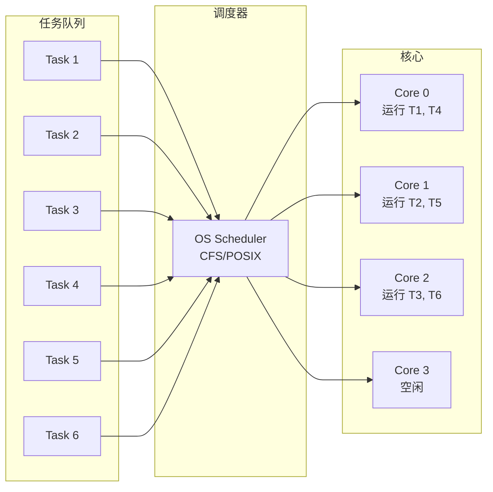
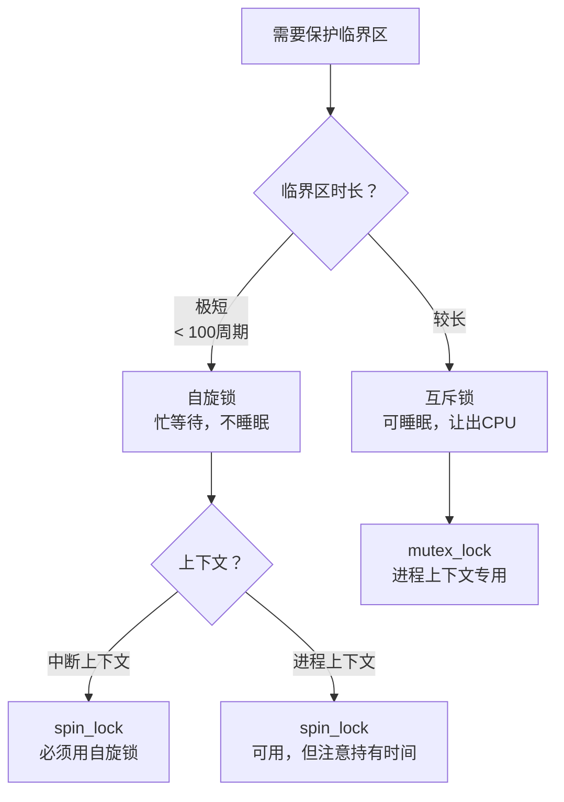
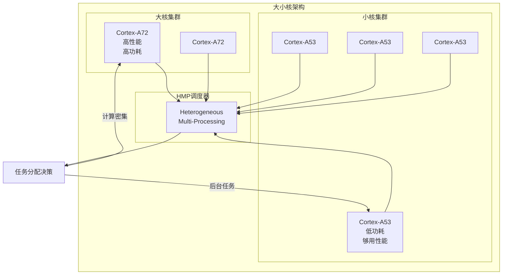
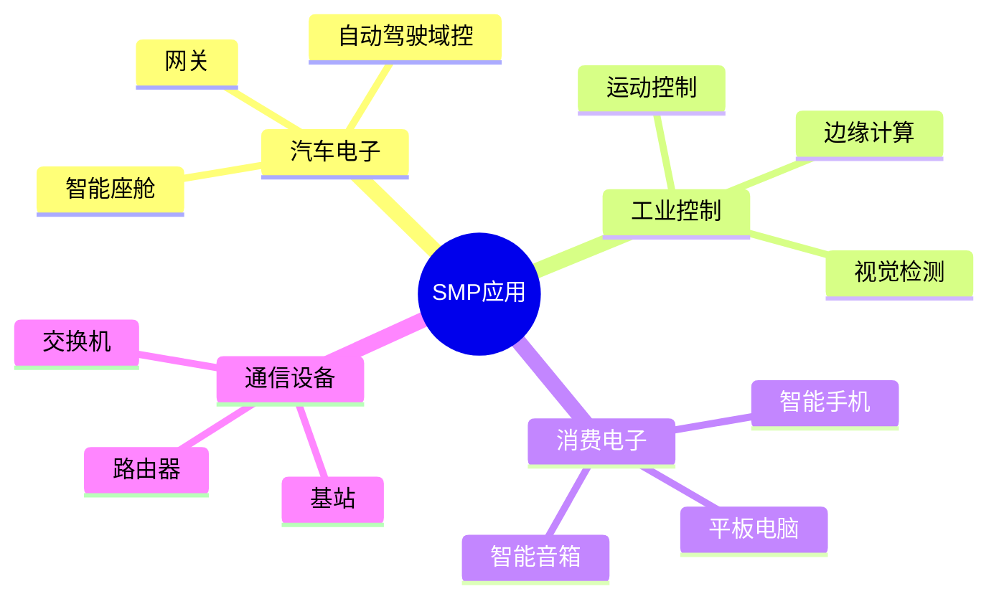
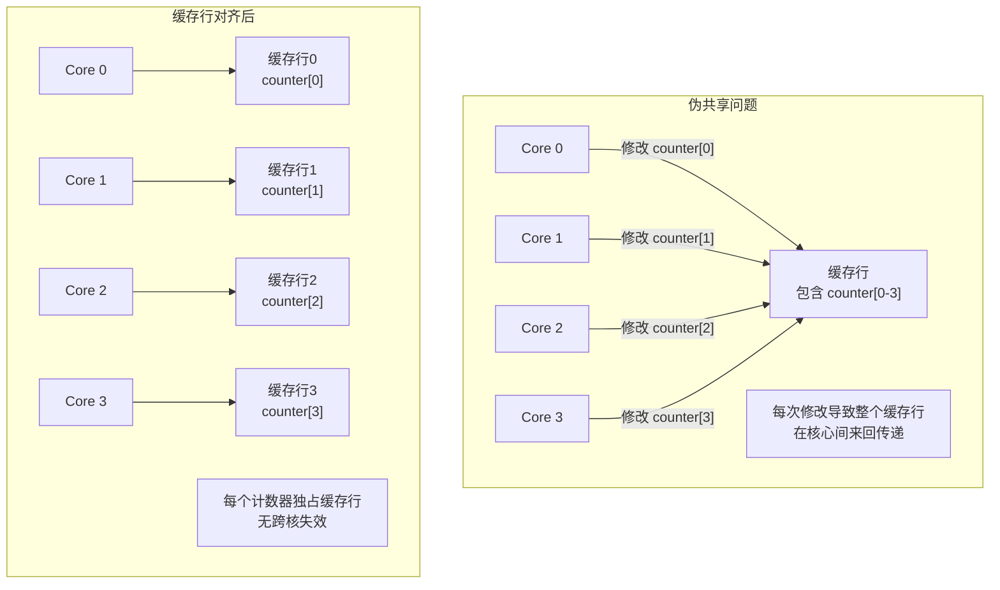

---
aliases:
  - SMP
  - 对称多处理
  - Symmetric Multiprocessing
tags:
  - 嵌入式
  - 硬件与芯片
  - SMP
  - 多核
date: 2026-04-28
status: ✅完成
related:
  - "[[_芯片架构总览]]"
  - "[[AMP架构]]"
  - "[[MCU架构]]"
  - "[[多核并发与Cache一致性]]"
---

> [!abstract] 核心定位
> SMP（对称多处理）让多个核心共享同一内存空间、运行同一操作系统，由 OS 统一调度。本文件聚焦 SMP 的核心技术：MESI 缓存一致性协议、同步原语、大小核架构、伪共享问题。

---

## 一、SMP的物理架构：多核如何"协同作战"？

### 1.1 核心矛盾：单核的性能瓶颈

单核处理器提升性能的三条路：
- **提高主频** → 功耗随频率立方增长，散热无解
- **超标量/流水线** → 复杂度爆炸，边际效益递减
- **多核并行** → **SMP的答案**



---

### 1.2 SMP的物理布局：共享一切，平等竞争



**SMP的核心定义：**
- 所有核心**地位平等**，无主从之分
- 所有核心**共享同一内存空间**，统一编址
- 所有核心**共享同一操作系统**，统一调度
- 所有核心**共享同一外设**，统一访问

---

> [!tip] SMP 与 AMP 的完整对比见 [[_芯片架构总览]]

---

### 1.4 缓存一致性：SMP的"心脏"

**问题场景：**

```c
// Core 0 执行
int shared_data = 100;
cache_flush();  // 数据在L1中

// Core 1 执行（稍后）
int local = shared_data;  // 从哪里读？L1？L2？内存？
```



**MESI协议状态机：**



| 状态 | 含义 | 可读 | 可写 |
|------|------|------|------|
| **M**odified | 已修改，仅本核持有 | ✓ | ✓ |
| **E**xclusive | 独占，未修改 | ✓ | ✓（无总线事务） |
| **S**hared | 共享，未修改 | ✓ | ✗（需总线仲裁） |
| **I**nvalid | 无效 | ✗ | ✗ |

---

## 二、SMP的设计哲学：透明并行，操作系统接管一切

### 2.1 负载均衡：操作系统的核心职责



**调度策略：**

| 策略 | 原理 | 适用场景 |
|------|------|----------|
| **CFS**（完全公平调度） | 红黑树按虚拟运行时间排序 | 通用Linux |
| **SCHED_FIFO** | 实时优先级队列，不抢占 | 实时任务 |
| **SCHED_RR** | 时间片轮转的实时调度 | 实时任务 |
| **Affinity** | 绑定任务到特定核心 | 缓存亲和性优化 |

---

### 2.2 同步原语：多核协作的"交通规则"

```c
// 自旋锁：忙等待，适用于短临界区
spinlock_t lock;
spin_lock(&lock);
// 临界区代码
spin_unlock(&lock);

// 互斥锁：可睡眠，适用于长临界区
struct mutex mtx;
mutex_lock(&mtx);
// 临界区代码
mutex_unlock(&mtx);

// 原子操作：无锁编程基础
atomic_t counter;
atomic_inc(&counter);  // 原子递增

// 内存屏障：防止指令重排
smp_wmb();  // 写内存屏障
smp_rmb();  // 读内存屏障
smp_mb();   // 全内存屏障
```

**自旋锁 vs 互斥锁：**



---

### 2.3 中断亲和性：中断分发到特定核心

```c
// Linux 设置中断亲和性
// 将中断IRQ 42 绑定到 Core 0 和 Core 1
echo "0-1" > /proc/irq/42/smp_affinity

// 代码中设置
struct cpumask mask;
cpumask_clear(&mask);
cpumask_set_cpu(0, &mask);
cpumask_set_cpu(1, &mask);
irq_set_affinity(42, &mask);
```

**设计考量：**
- **网络中断**：绑定到特定核心，提高缓存命中率
- **磁盘I/O**：分散到多核，避免单核瓶颈
- **实时任务**：独占核心，避免中断干扰

---

## 三、芯片选型：主流SMP处理器对比

### 3.1 主流SMP芯片对比

| 芯片 | 架构 | 核心数 | 主频 | 典型应用 | 特点 |
|------|------|--------|------|----------|------|
| **NXP i.MX8QM** | Cortex-A72+A53 | 2+4 | 1.6GHz | 汽车IVI、工业 | 大小核架构 |
| **RK3399** | Cortex-A72+A53 | 2+4 | 1.8GHz | 平板、边缘计算 | 国产化、高性价比 |
| **TI AM6548** | Cortex-A53 | 4 | 1.1GHz | 工业控制 | 集成PRU实时单元 |
| **NXP S32G2** | Cortex-A53 | 4 | 1.0GHz | 汽车网关 | ASIL-D功能安全 |
| **Intel Atom x6000** | x86 Tremont | 4 | 3.0GHz | 工业PC | x86生态兼容 |
| **SiFive U74-MC** | RISC-V U74 | 4 | 1.4GHz | AIoT | 开源架构 |

---

### 3.2 大小核架构：性能与功耗的平衡



**调度策略：**

| 任务类型 | 分配策略 | 原因 |
|----------|----------|------|
| UI渲染 | 大核 | 响应速度优先 |
| 视频编解码 | 大核 | 计算密集 |
| 后台同步 | 小核 | 功耗优先 |
| 音频播放 | 小核 | 计算量小 |
| 游戏 | 大核+小核 | 混合负载 |

---

## 四、嵌入式工程应用：SMP的实际战场

### 4.1 典型应用场景



### 4.2 实战案例：汽车智能座舱

i.MX8QM（2×A72 + 4×A53）的大小核任务分配——通过 CPU affinity 将任务绑定到合适的核心：

```c
// 大核 A72: UI渲染、语音识别、导航（计算密集）
CPU_SET(0, &cpuset); CPU_SET(1, &cpuset);
pthread_setaffinity_np(ui_thread, sizeof(cpuset), &cpuset);

// 小核 A53: 日志、OTA、诊断（后台低功耗）
CPU_SET(2, &cpuset); CPU_SET(3, &cpuset);
pthread_setaffinity_np(log_thread, sizeof(cpuset), &cpuset);
```

---

### 4.3 实战案例：工业视觉检测

多核并行图像处理——按行分割图像，每核处理一个区域：

```c
void parallel_image_process(uint8_t *img, int h, int w) {
    int cores = sysconf(_SC_NPROCESSORS_ONLN);
    for (int i = 0; i < cores; i++) {
        tasks[i] = (ImageTask){img, i*h/cores, (i+1)*h/cores, w};
        pthread_create(&threads[i], NULL, process_region, &tasks[i]);
    }
    for (int i = 0; i < cores; i++) pthread_join(threads[i], NULL);
}
```

关键设计：按行分割避免跨核数据依赖、pthread 并行处理。

---

## 五、大师的工程建议

### 5.1 SMP开发的核心陷阱

| 陷阱 | 表现 | 根因 | 解决方案 |
|------|------|------|----------|
| **伪共享** | 多核性能反而下降 | 不同核频繁修改同一缓存行 | 对齐到缓存行大小（64字节） |
| **锁竞争** | 核心空转，CPU利用率低 | 锁粒度过粗 | 细粒度锁、RCU、无锁数据结构 |
| **缓存一致性风暴** | 总线带宽耗尽 | 频繁跨核数据访问 | 数据局部性优化、NUMA感知 |
| **优先级反转** | 高优先级任务被阻塞 | 锁被低优先级任务持有 | 优先级继承协议 |
| **负载不均衡** | 部分核心过载 | 调度策略不当 | 手动设置亲和性、cgroups |

---

### 5.2 伪共享问题详解

```c
// 问题代码：伪共享
struct Counter {
    int value;  // 4字节
} __attribute__((packed));

struct Counter counters[4];  // 4个计数器，可能共享缓存行

// 多核各自递增
void increment_counter(int id) {
    counters[id].value++;  // 导致整个缓存行失效
}

// 修复：缓存行对齐
struct Counter {
    int value;
    char padding[60];  // 填充到64字节
} __attribute__((aligned(64)));

// 或使用宏
#define CACHE_LINE_SIZE 64
struct Counter {
    int value;
} __attribute__((aligned(CACHE_LINE_SIZE)));
```



---

## 总结

| 维度 | 核心特点 |
|------|----------|
| 物理架构 | 共享内存、统一编址、MESI 缓存一致性协议 |
| 设计哲学 | OS 统一调度、负载均衡、透明并行 |
| 核心挑战 | 同步与锁、伪共享、缓存一致性风暴 |

> [!quote] 本质
> SMP 不是"多个 CPU 拼在一起"，而是一套由硬件缓存一致性 + OS 调度器共同支撑的并行计算生态系统。

## 知识拓扑

- 上层：[[_芯片架构总览]] — SMP 在处理器全景中的定位
- 对比：[[AMP架构]] — 非对称多核的设计哲学差异
- 深入：[[多核并发与Cache一致性]] — MESI 协议与内存屏障详解
- 前置：[[MCU架构]] — 单核架构是理解多核的基础