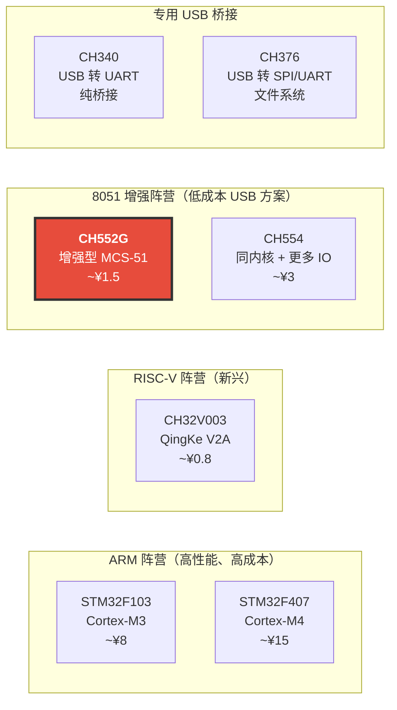
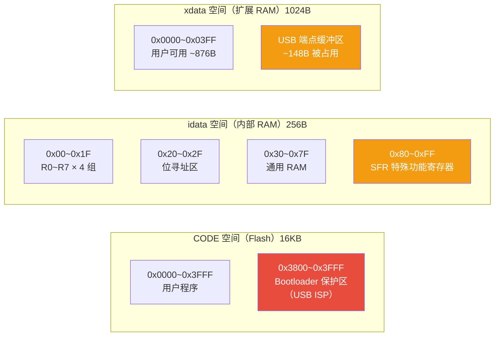
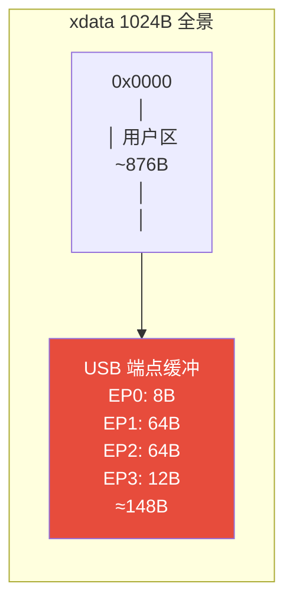
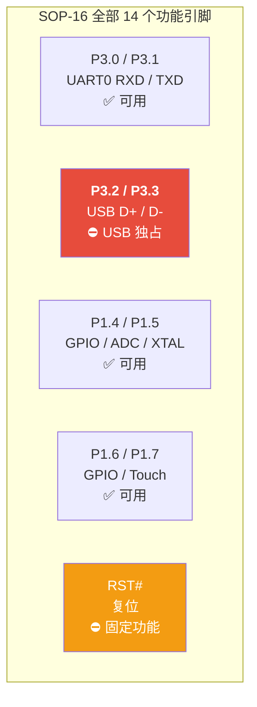
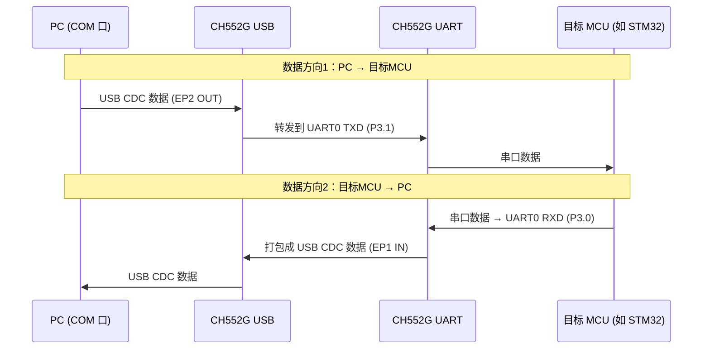
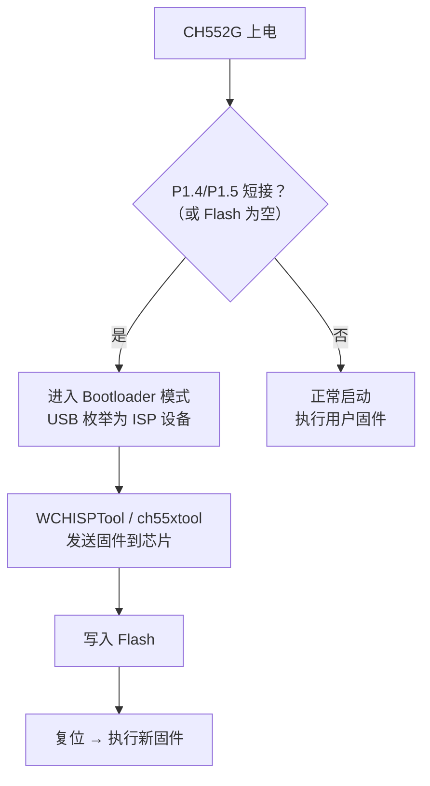

---
tags:
  - 嵌入式/硬件与芯片
  - MCU
  - 8051
  - USB
  - 芯片选型
aliases:
  - CH552
  - 沁恒CH552
related:
  - "[[硬件层]]"
  - "[[枚举与描述符]]"
  - "[[设备类协议与开源软件栈]]"
  - "[[STM32F407ZGT6]]"
  - "[[_芯片架构总览]]"
created: 2026-06-09
updated: 2026-06-09
status: 🔄整理中
---

# CH552G 芯片深度认知与开发指南

> [!abstract] 核心本质
> WCH 沁恒的**增强型 8051 + 内置 USB 2.0 全速控制器**，极低成本（~¥1.5）、极简外围（仅需去耦电容）的 USB 方案芯片。
> 不是 ARM，不是 RISC-V——它是经典 8051 内核的现代化改造，专攻"用最低成本给产品加一个 USB 口"这个场景。

---

## 1. 芯片定位与选型价值

### 1.1 CH552G 在嵌入式生态中的位置



CH552G 不是用来和 STM32 拼算力的，它的生存法则：**"我只要 ¥1.5 就能给你一个可编程的 USB 口"**。

### 1.2 核心卖点

| 卖点 | 说明 | 选型价值 |
| --- | --- | --- |
| 内置 USB 2.0 FS | 4 端点，全速 12Mbps，内置收发器 + D+ 上拉 | 无需外部 USB 桥接芯片，BOM 极简 |
| 超低成本 | 散片 ~¥1.5，量产后更低 | 比 STM32 + CH340 方案便宜一个数量级 |
| 极简外围 | 芯片 + 2 个去耦电容即可工作 | PCB 面积小，适合空间受限产品 |
| 宽电压 | 3.3V ~ 5V | 直接 USB 5V 供电，无需 LDO |
| 内置 Bootloader | 支持 USB ISP 免工具烧录 | 无需 J-Link/ST-Link，插 USB 即烧 |
| 电容触摸 | 6 通道触摸按键 | 适合简单人机交互 |
| ADC | 8 位 4 通道 | 适合简单模拟量采集 |

### 1.3 同系列对比

| 特性 | CH551 | **CH552G** | CH554 |
| --- | --- | --- | --- |
| Flash | 10KB | **16KB** | 16KB |
| xdata RAM | 512B | **1024B** | 1024B |
| USB 端点 | 2 | **4** | 4 |
| 封装 | SOP-16 | **SOP-16** | SOP-16 / TSSOP-20 |
| 触摸通道 | 6 | **6** | 8 |
| ADC | 无 | **8位 4ch** | 8位 4ch |
| 价格 | ~¥1 | **~¥1.5** | ~¥3 |
| 定位 | 极简 USB | **USB + ADC 性价比最优** | 需要更多 IO |

> [!tip] 选型建议
> CH551 砍了 ADC 和 2 个 USB 端点，省 ¥0.5 但功能大减；CH554 多了 IO 但贵一倍。
> **CH552G 是甜点型号**——16KB Flash 足以放下 USB CDC 固件，4 端点支持复合设备，还有 ADC。

### 1.4 适用场景

| 推荐使用 | 不推荐使用 |
| --- | --- |
| USB 转串口 / USB 转SPI 桥接 | 需要运行 RTOS 或 TCP/IP 协议栈 |
| 自定义 HID 设备（游戏手柄、专用输入） | 需要大量 RAM 缓冲（>1KB）的数据处理 |
| 低成本 USB HID 键盘/鼠标 | 需要高速 ADC（12 位以上）的精密采集 |
| 简单 USB 上位机通信（配合 PC 软件） | 需要复杂 GUI 或文件系统的应用 |
| 电容触摸 + USB 二合一方案 | 需要多线程并发处理的复杂逻辑 |

---

## 2. 核心架构：增强型 MCS-51

### 2.1 与经典 8051 的区别

CH552G 的内核不是 1980 年的原始 8051，而是 WCH 重设计的增强版：

| 特性 | 经典 8051（Intel 8051） | CH552G 增强型 MCS-51 |
| --- | --- | --- |
| 指令周期 | 12T（12 个时钟周期 = 1 个机器周期） | **1T~2T**（多数指令 1~2 个时钟周期完成） |
| 最高主频 | 12MHz | **24MHz**（内部 RC） |
| 有效 MIPS | 1 MIPS @ 12MHz | **~24 MIPS @ 24MHz**（理论峰值） |
| 流水线 | 无 | **简化流水线**（取指/执行重叠） |
| USB 控制器 | 无 | **内置 USB 2.0 FS Device** |
| 扩展 RAM | 128B（经典） | **1024B xdata** |
| 中断源 | 5~6 个 | **14 个** |

> [!note] "增强型"到底增强了什么？
> 经典 8051 一条 `MOV` 指令要 12 个时钟周期，CH552G 只需 1~2 个。
> 同样 24MHz 时钟下，CH552G 的实际算力是经典 8051 的 **6~12 倍**。
> 但和 ARM Cortex-M0+ @ 48MHz 比，仍有数倍差距——8051 的指令密度和寄存器数量是硬伤。

### 2.2 与 ARM Cortex-M 的根本差异

| 维度 | CH552G（增强 8051） | STM32F103（Cortex-M3） |
| --- | --- | --- |
| 架构 | 8 位 CISC（复杂指令集） | 32 位 RISC（精简指令集） |
| 寄存器宽度 | 8 位（ACC, B, R0~R7） | 32 位（R0~R15） |
| 寻址空间 | 64KB（16 位地址） | 4GB（32 位地址） |
| 栈模型 | 硬件栈（固定 256B，不可扩展） | 软件栈（RAM 任意位置，可扩展） |
| 中断现场保存 | 软件手动 PUSH/POP | 硬件自动保存 8 个寄存器 |
| 乘法指令 | `MUL AB`（多周期） | 单周期 32×32→32 硬件乘法器 |
| C 编译器 | SDCC / Keil C51 | GCC ARM / Keil MDK |
| 生态规模 | 小众（WCH 生态为主） | 庞大（STM32 HAL + CMSIS） |

> [!important] 什么时候选 CH552G 而不是 STM32？
> 当你的需求是"**给产品加一个 USB 口，成本敏感，功能简单**"时，CH552G 是最优解。
> 任何需要复杂算法、RTOS、大量 RAM、多协议栈的场景，请直接用 ARM。

### 2.3 主频与电压

| 参数 | 规格 | 说明 |
| --- | --- | --- |
| 最高主频 | 24MHz | 内部 RC 振荡器，精度 ±1% |
| 工作电压 | 3.3V ~ 5V | 宽电压，可直接 USB 5V 供电 |
| 低速模式 | 12MHz | 内部分频，省电但不适合 USB |
| USB 要求 | ≥24MHz | USB 全速通信对时钟精度有硬性要求 |

---

## 3. 存储器模型

CH552G 的存储器架构继承自经典 8051，有三个独立的地址空间。理解这个模型是写好 CH552G 代码的基础。

### 3.1 三大存储空间



### 3.2 Flash（16KB）

| 区域 | 范围 | 大小 | 用途 |
| --- | --- | --- | --- |
| 用户程序区 | 0x0000 ~ 0x37FF | ~14KB | 存放用户固件 |
| Bootloader 保护区 | 0x3800 ~ 0x3FFF | ~2KB | USB ISP 引导程序，**不要覆盖** |

> [!tip] 无独立 EEPROM
> CH552G 没有片上 EEPROM。需要持久化存储时，用 Flash 的高地址页模拟。
> 注意 Flash 擦写寿命约 **10 万次**，不要频繁写入。

### 3.3 idata（内部 RAM，256B）

| 区域 | 地址 | 大小 | 用途 |
| --- | --- | --- | --- |
| 寄存器组 | 0x00~0x1F | 32B | R0~R7 × 4 组，可通过 `PSW` 切换 |
| 位寻址区 | 0x20~0x2F | 16B | 支持按位读写（`SETB bit`） |
| 通用 RAM | 0x30~0x7F | 80B | 用户自由使用的 RAM |
| SFR 区 | 0x80~0xFF | 128B | 特殊功能寄存器（ACC, B, P0~P3 等） |

> [!danger] 8051 的硬件栈陷阱
> 8051 的栈指针 SP 是 **递增** 的，且只能在 idata 的 0x00~0xFF 范围内。
> 栈空间极其有限（实际可用约 **80~120B**），C 函数调用层级不能太深，局部变量不能太多。
> 这是 8051 和 ARM 最大的区别之一——ARM 的栈可以放在任意 RAM 区域，8051 的栈被锁死在 256B 内部 RAM 中。

### 3.4 xdata（扩展 RAM，1024B）

1024B 的 xdata 是 CH552G 相比经典 8051（仅有 128B RAM）的重大升级，但有隐藏开销：

| 区域 | 大小 | 说明 |
| --- | --- | --- |
| USB 端点缓冲区 | ~148B | USB 端点 0~3 的 FIFO 缓冲，**硬件占用** |
| 用户可用 | ~876B | 编程时实际可用的 xdata |



### 3.5 内存模型对 SDCC 开发的影响

在 SDCC 编译器中，变量的存储位置需要显式指定：

| 关键字 | 存储位置 | 访问速度 | 适用场景 |
| --- | --- | --- | --- |
| `__data` | idata（0~127） | **最快**（直接寻址） | 频繁访问的小变量、循环计数器 |
| `__idata` | idata（0~255） | 快 | 需要访问 SFR 区附近的变量 |
| `__xdata` | xdata（0~1023） | **较慢**（需 MOVX 指令） | 大缓冲区、USB 数据、不频繁访问的数据 |
| `__code` | Flash | 最慢（只读） | 常量字符串、查找表 |

```c
// SDCC 内存模型示例
__xdata uint8_t usb_rx_buffer[64];   // USB 接收缓冲 → 放 xdata（大且不频繁）
__data uint8_t rx_len;                // 接收长度计数 → 放 data（小且频繁访问）
__code const char device_name[] = "CH552-CDC";  // 字符串常量 → 放 Flash
```

> [!warning] xdata 不够用的后果
> USB CDC 固件本身就要占用大量 xdata（端点缓冲 + 协议栈变量），用户可用的 ~876B 很容易耗尽。
> 如果编译报 `xdata overflow`，需要：
> 1. 减小 USB 端点缓冲大小（牺牲吞吐量）
> 2. 将不频繁访问的变量移到 `__code`（只读）或优化数据结构
> 3. 重新审视是否应该用更大 RAM 的芯片（如 CH554 或 STM32）

---

## 4. 引脚映射（SOP-16 封装）

### 4.1 完整引脚表

CH552G 采用 SOP-16 封装，总共 16 个引脚，其中 2 个电源、14 个功能引脚：

```
              CH552G SOP-16
          ┌─────────────────┐
   VDD ──┤ 1            16 ├── V33
  P1.4 ──┤ 2            15 ├── P1.7
  P1.5 ──┤ 3            14 ├── P1.6
  P1.6 ──┤ 4            13 ├── P3.3 (D-)
  P1.7 ──┤ 5            12 ├── P3.2 (D+)
  RST# ──┤ 6            11 ├── P1.5 (XTAL2)
  P3.1 ──┤ 7            10 ├── P1.4 (XTAL1)
   GND ──┤ 8             9 ├── P3.0
          └─────────────────┘

  ⚠️ 注意：实际 SOP-16 引脚排列请以数据手册为准
     上图仅为示意，具体功能复用见下表
```

| 引脚号 | 端口 | 主功能 | 复用功能 | ADC 通道 | 触摸通道 |
 | --- | --- | --- | --- | --- | --- |
 | 1 | VDD | 电源正（3.3V~5V） | - | - | - |
 | 2 | P1.4 | GPIO | XTAL1（外部晶振）、ADC_CH3 | CH3 | Touch3 |
 | 3 | P1.5 | GPIO | XTAL2（外部晶振）、ADC_CH2 | CH2 | Touch2 |
 | 4 | P1.6 | GPIO | - | - | Touch4 |
 | 5 | P1.7 | GPIO | - | - | Touch5 |
 | 6 | RST# | 复位（**高电平复位**） | - | - | - |
 | 7 | P3.1 | GPIO | TXD0（UART0 发送） | - | - |
 | 8 | GND | 地 | - | - | - |
 | 9 | P3.0 | GPIO | RXD0（UART0 接收） | - | - |
 | 10 | P1.4 | GPIO | XTAL1、ADC_CH3 | CH3 | Touch3 |
 | 11 | P1.5 | GPIO | XTAL2、ADC_CH2 | CH2 | Touch2 |
 | 12 | **P3.2** | GPIO | **USB D+**、ADC_CH0 | CH0 | Touch0 |
 | 13 | **P3.3** | GPIO | **USB D-** | - | Touch1 |
 | 14 | P1.6 | GPIO | - | - | Touch4 |
 | 15 | P1.7 | GPIO | SCL（I2C 时钟） | - | Touch5 |
 | 16 | V33 | 3.3V 输出（内部 LDO） | - | - | - |

### 4.2 引脚复用冲突说明

> [!danger] USB 占用引脚后不可他用
> 当启用 USB 功能时，**P3.2（D+）和 P3.3（D-）被 USB 收发器独占**，不能再作为普通 GPIO 或触摸按键使用。
> 这意味着 SOP-16 封装在 USB 模式下，实际可用 GPIO 非常紧张。



**USB 模式下实际可用 GPIO 汇总**：

| 引脚 | 可用功能 | 备注 |
| --- | --- | --- |
| P3.0 | GPIO / UART0 RXD | 可做串口接收 |
| P3.1 | GPIO / UART0 TXD | 可做串口发送 |
| P1.4 | GPIO / ADC_CH3 / Touch3 | 可做模拟采集或触摸 |
| P1.5 | GPIO / ADC_CH2 / Touch2 | 可做模拟采集或触摸 |
| P1.6 | GPIO / Touch4 | 通用 IO 或触摸 |
| P1.7 | GPIO / Touch5 / SCL | 通用 IO 或触摸 |

> [!tip] USB + UART 双功能典型分配
> USB CDC 桥接场景下：P3.0/P3.1 做 UART，P3.2/P3.3 做 USB，P1.4~P1.7 做控制信号或 ADC。
> **6 个可用引脚刚好够用，一个都不浪费**——这就是 CH552G 的设计哲学。

### 4.3 ADC 通道分布

| 通道 | 引脚 | 说明 |
| --- | --- | --- |
| ADC_CH0 | P3.2（D+） | ⚠️ USB 模式下不可用 |
| ADC_CH1 | P3.3（D-） | ⚠️ USB 模式下不可用 |
| ADC_CH2 | P1.5 | ✅ USB 模式下可用 |
| ADC_CH3 | P1.4 | ✅ USB 模式下可用 |

> [!warning] ADC 精度现实
> 8 位 ADC 分辨率仅 256 级（0~255），参考电压为 VDD。
> 在 5V 供电下，最小分辨率为 ~19.5mV。适合简单检测（电池电压、电位器），不适合精密测量。

### 4.4 触摸按键通道分布

| 通道 | 引脚 | USB 模式下可用 |
| --- | --- | --- |
| Touch0 | P3.2（D+） | ❌ USB 占用 |
| Touch1 | P3.3（D-） | ❌ USB 占用 |
| Touch2 | P1.5 | ✅ |
| Touch3 | P1.4 | ✅ |
| Touch4 | P1.6 | ✅ |
| Touch5 | P1.7 | ✅ |

USB 模式下可用 **4 个触摸通道**（Touch2~Touch5）。

---

## 5. USB 子系统（核心卖点）

> [!important] 这是 CH552G 存在的唯一理由
> 如果不用 USB，你完全可以选更便宜的 CH32V003（RISC-V，¥0.8）。
> CH552G 的价值 = 内置 USB 控制器 + 可编程 + ¥1.5，三者缺一不可。

### 5.1 USB 2.0 Full-Speed Device 概览

| 参数 | 规格 |
| --- | --- |
| USB 版本 | USB 2.0 Full-Speed Device（**仅 Device，不支持 Host/OTG**） |
| 速度 | 12Mbps（全速） |
| 端点数量 | 4 个（EP0 + EP1 + EP2 + EP3） |
| 内置收发器 | 是，无需外部 PHY |
| D+ 上拉电阻 | 内置，软件控制连接/断开 |
| 供电 | 直接从 USB VBUS（5V）取电 |

### 5.2 端点配置

| 端点 | 方向 | 最大包长 | 典型用途 | xdata 缓冲占用 |
| --- | --- | --- | --- | --- |
| EP0 | IN/OUT（控制） | 8B | [[枚举与描述符\|枚举]]阶段控制传输 | 8B |
| EP1 | IN 或 OUT | 64B | CDC 数据发送 / HID 报告 | 64B |
| EP2 | IN 或 OUT | 64B | CDC 数据接收 / 自定义数据 | 64B |
| EP3 | IN 或 OUT | 12B | CDC 中断通知（串口状态） | 12B |

> [!tip] USB CDC 端点典型分配
> USB CDC 类需要 3 种端点：
> - **EP0**：控制传输（枚举、设置波特率等 Line Coding 参数）
> - **EP1 + EP2**：批量传输（数据收发，64B 包长 = 全速最大值）
> - **EP3**：中断传输（通知主机串口状态变化，如 DTR/RTS）
>
> 4 个端点刚好够 CDC 用，但想做 CDC + HID 复合设备就很紧张了。

### 5.3 内置收发器与 D+ 上拉

CH552G 内部集成了 USB 全速收发器和 D+ 上拉电阻，这是其"极简外围"的硬件基础：

```
               CH552G 内部
  ┌──────────────────────────────────────────┐
  │                                          │
  │  P3.2/D+ ──┬── USB 收发器 ── USB SIE    │
  │            │                  (协议引擎)  │
  │            └── [1.5kΩ] ── 软件开关       │
  │                 内置上拉    (UE_CFG0)     │
  │                                          │
  │  P3.3/D- ──── USB 收发器 ── USB SIE     │
  │                                          │
  └──────────────────────────────────────────┘

  软件控制上拉连接：
  ├── 连接：USB_DEVICE_ATTACH()  → 主机检测到设备插入
  └── 断开：USB_DEVICE_DETACH()  → 模拟拔出（用于软复位重新枚举）
```

> [!note] 与 [[硬件层|外部上拉方案]] 的对比
> 通用 USB 方案需要在 D+ 外接 1.5kΩ 上拉电阻（参见 [[硬件层#四、设备插入检测]]）。
> CH552G 把这个电阻和开关集成到芯片内部，**PCB 上 D+/D- 直接连 USB 口即可**，无需任何外围元件。

### 5.4 硬件接线图（USB 接口部分）

```
                    CH552G 最小系统 USB 接线
                    ─────────────────────────

     USB Type-A/B/Micro 插座
     ┌───────────────────┐
     │  VBUS (+5V) ─────────── VDD (Pin 1)     ← 芯片供电
     │  D+        ─────────── P3.2 (Pin 12)    ← 直连，无需上拉
     │  D-        ─────────── P3.3 (Pin 13)    ← 直连，无需上拉
     │  GND       ─────────── GND (Pin 8)      ← 地
     └───────────────────┘

     可选 ESD 保护（靠近 USB 口放置）：
     ┌───────────────────┐
     │  D+ ──┬── TVS (USBLC6-2) ── GND
     │  D- ──┘
     └───────────────────┘

     去耦电容（必须）：
     ┌───────────────────┐
     │  VDD ── 0.1μF ── GND   ← 靠近芯片
     │  V33 ── 0.1μF ── GND   ← 内部 3.3V LDO 输出
     └───────────────────┘
```

> [!warning] USB 信号线布线要求
> 即使在面包板/洞洞板上：
> - D+/D- **必须平行等长**走线，尽量紧挨着走
> - 不要在 D+/D- 下方铺大面积地铜（增加寄生电容）
> - ESD 保护 TVS 管必须**靠近 USB 口**放置，不是靠近芯片
> - 详细原理参见 [[硬件层#三、差分信号]]

### 5.5 支持的 USB 类

| USB 类 | 用途 | CH552G 适合度 | 说明 |
| --- | --- | --- | --- |
| **CDC-ACM** | USB 虚拟串口 | ⭐⭐⭐ **最适合** | 即插即用免驱，Windows 10+ 自动识别，主要应用场景 |
| **HID** | 键盘/鼠标/自定义 | ⭐⭐⭐ 适合 | 免驱，适合自定义输入设备 |
| **自定义设备** | 私有协议 | ⭐⭐ 可用 | 需要写 PC 端驱动（libusb/WinUSB），灵活性最高 |
| CDC + HID 复合 | 串口 + 控制同时 | ⭐ 勉强 | 4 端点紧张，Flash 和 RAM 预算都紧 |
| 大容量存储 MSC | U 盘 | ❌ 不推荐 | RAM 不够做块缓冲，性能太差 |

### 5.6 USB CDC 串口桥接工作原理

这是 CH552G 最典型的应用——把 USB 虚拟成一个 COM 口，透明转发 UART 数据：



> [!tip] CDC 的波特率是"虚拟"的
> USB CDC 的 Line Coding 参数（波特率、数据位、校验位）由主机设置，但对 USB 传输速度无影响——
> USB 全速始终是 12Mbps。这些参数只是通过控制传输**通知**设备端，设备端可选择用或不用。
> 实际 UART 波特率由 CH552G 的 Timer 分频决定，与 USB 侧完全独立。

### 5.7 USB 端点缓冲区与 xdata 内存关系

```
xdata 地址空间 1024B
┌─────────────────────────────────────────────────┐
│  0x0000                                          │
│  │  用户变量区                                    │
│  │  ~876B 可用                                    │
│  │                                               │
│  ├────────────────────────────────────────────── │
│  │  USB EP0 缓冲  8B    ← 固定                   │
│  │  USB EP1 缓冲  64B   ← 可配置 (8~64B)         │
│  │  USB EP2 缓冲  64B   ← 可配置 (8~64B)         │
│  │  USB EP3 缓冲  12B   ← 可配置                  │
│  │                                               │
│  0x03FF                                          │
└─────────────────────────────────────────────────┘

  总计 USB 占用 ≈ 148B，剩余用户可用 ≈ 876B
```

> [!danger] xdata 预算规划
> 一个 USB CDC 桥接固件的大致 xdata 占用：
> - USB 端点缓冲：~148B
> - USB 协议栈变量：~50~100B
> - UART 环形缓冲：~64~128B（如果用的话）
> - 用户变量：剩余 ~500~600B
>
> **非常紧张**。任何 256B 以上的缓冲区都可能直接爆掉 xdata。

---

## 6. 时钟系统

### 6.1 内部 24MHz RC 振荡器（默认）

CH552G 默认使用内部 RC 振荡器，无需外部晶振：

| 参数 | 规格 | 说明 |
| --- | --- | --- |
| 频率 | 24MHz | 出厂校准 |
| 精度 | ±1%（典型） | 满足 USB 全速要求（±1.5%） |
| 温漂 | ±2%（全温度范围） | 极端温度下 USB 可能不稳定 |
| 启动时间 | < 1ms | 上电即用 |

### 6.2 外部晶振选项

当内部 RC 精度不够（极端温度、批量一致性要求）时，可外接晶振：

| 配置 | 连接引脚 | 频率 | 说明 |
| --- | --- | --- | --- |
| 外部晶振 | P1.4（XTAL1）/ P1.5（XTAL2） | 12MHz~24MHz | 常用 12MHz 或 24MHz |
| 外部时钟 | P1.4（XTAL1） | 12MHz~24MHz | 有源晶振，仅用 XTAL1 |

> [!tip] 大多数情况不需要外部晶振
> 内部 RC ±1% 的精度对于 USB 全速通信已经足够（USB 规范要求 ±1.5%）。
> **只有在以下情况才考虑加外部晶振**：
> 1. 工作温度超出 0~70°C（如车载、户外）
> 2. 批量生产中发现 USB 不稳定（RC 振荡器个体差异）
> 3. 需要精确时基（如精确计时、通信协议时序）

### 6.3 内部分频（12MHz 低速模式）

通过寄存器配置可将主频降至 12MHz：

| 模式 | 主频 | USB 可用 | 功耗 | 用途 |
| --- | --- | --- | --- | --- |
| 全速 | 24MHz | ✅ | ~10mA | 默认，USB 通信必须 |
| 低速 | 12MHz | ❌ | ~5mA | 省电模式，非 USB 场景 |

> [!warning] USB 对时钟精度的硬性要求
> USB 全速（12Mbps）的位时间为 83.3ns，时钟偏差超过 ±1.5% 会导致：
> - 主机无法正确解码 NRZI 数据（参见 [[硬件层#六、编码：NRZI + 位填充]]）
> - USB 枚举失败或数据丢包
> - 表现为"设备插入后瞬间消失"或"设备管理器显示未知设备"

### 6.4 时钟配置寄存器速查

| 寄存器 | 功能 | 关键位 |
| --- | --- | --- |
| `CLOCK_CFG` | 时钟配置 | `bOSC_EN_XT`：使能外部晶振 |
| | | `bOSC_EN_INT`：使能内部 RC |
| | | `MASK_SYS_CK_SEL`：系统时钟分频选择 |

```c
// SDCC 示例：切换到外部 12MHz 晶振
SAFE_MOD = 0x55;
SAFE_MOD = 0xAA;              // 进入安全模式
CLOCK_CFG = 0x06;             // 选择外部晶振，不分频
SAFE_MOD = 0x00;              // 退出安全模式
```

> [!danger] 安全模式寄存器
> CH552G 的时钟配置寄存器受到安全模式保护——必须先向 `SAFE_MOD` 连续写入 0x55 和 0xAA 才能修改。
> 如果不进安全模式直接写，写入会被硬件忽略，时钟不会改变。
> 这个机制防止程序跑飞时误改时钟导致系统崩溃。

---

## 7. 外设资源

> [!note] 本章重点标注与 USB 共存时的引脚冲突
> CH552G 的外设资源并不丰富，且 USB 模式下 P3.2/P3.3 被占用后更为紧张。
> 以下逐个列出可用外设及其限制。

### 7.1 UART（双路）

| 参数 | UART0 | UART1 |
| --- | --- | --- |
| 引脚 | P3.0（RXD）/ P3.1（TXD） | P1.6（RXD1）/ P1.7（TXD1） |
| 波特率 | 由 Timer1 或 Timer2 产生 | 由 Timer2 产生 |
| USB 模式下可用 | ✅ | ✅（但占 P1.6/P1.7） |

**USB CDC 桥接典型配置**：UART0 做 USB↔串口转发，波特率由 Timer1 分频产生。

```c
// SDCC: UART0 初始化 @ 115200bps（24MHz 主频）
void UART0_Init(void)
{
    SM0 = 0; SM1 = 1;         // 模式1：8位 UART，可变波特率
    SM2 = 0;                   // 不使用多机通信
    REN = 1;                   // 使能接收

    TMOD &= ~0xF0;
    TMOD |= 0x20;              // Timer1 模式2：8位自动重载
    TH1 = 256 - 24;            // 24000000 / 12 / 32 / (256-TH1) ≈ 115200
    TR1 = 1;                   // 启动 Timer1

    TI = 1;                    // 发送就绪标志
    ES = 1;                    // 使能 UART0 中断
}
```

### 7.2 SPI（硬件，最高 12MHz）

| 参数 | 规格 |
| --- | --- |
| 引脚 | P1.4（SCK）/ P1.5（MOSI）/ P1.6（MISO）/ P1.7（CS） |
| 最高时钟 | 12MHz（主频 24MHz 的二分频） |
| 模式 | 支持 Mode 0 和 Mode 3 |
| USB 模式下可用 | ⚠️ 与 ADC/触摸引脚冲突 |

> [!warning] SPI 占用 P1.4~P1.7
> 使能硬件 SPI 后，P1.4~P1.7 全部被 SPI 占用。
> 如果 USB CDC 桥接同时需要 ADC 或触摸，就必须用软件模拟 SPI 或放弃其中一项。
> **SOP-16 封装的引脚复用冲突是 CH552G 最大的痛点。**

### 7.3 ADC（8 位 4 通道）

| 参数 | 规格 |
| --- | --- |
| 分辨率 | 8 位（0~255） |
| 通道 | 4 路（P3.2/P3.3/P1.5/P1.4） |
| 参考电压 | VDD（3.3V 或 5V） |
| USB 模式可用通道 | 仅 P1.4（CH3）和 P1.5（CH2） |
| 转换时间 | ~4μs @ 24MHz |

```c
// SDCC: ADC 单次采样示例
uint8_t ADC_Sample(uint8_t ch)
{
    ADC_CFG = (ADC_CFG & 0xF8) | ch;   // 选择通道
    ADC_START = 1;                       // 启动转换
    while (ADC_START);                   // 等待完成（硬件自动清零）
    return ADC_DATA;                     // 返回 8 位结果
}
```

### 7.4 电容触摸按键（6 通道）

| 参数 | 规格 |
| --- | --- |
| 通道 | 6 路（P3.2/P3.3/P1.4/P1.5/P1.6/P1.7） |
| USB 模式可用 | 4 路（P1.4~P1.7） |
| 检测原理 | 电容充放电时间差 |
| 灵敏度 | 软件可调 |

> [!tip] 触摸 + USB 二合一场景
> USB 模式下 P1.6/P1.7 做触摸，P1.4/P1.5 做 ADC 或触摸——这是 CH552G 的典型"USB + 触摸"应用组合。
> WCH 官方提供触摸库，直接调用即可，不需要自己写充放电检测算法。

### 7.5 定时器（Timer0/1/2）

| 定时器 | 模式 | 典型用途 |
| --- | --- | --- |
| Timer0 | 13位 / 16位 / 8位自动重载 | 系统 tick、延时 |
| Timer1 | 13位 / 16位 / 8位自动重载 | **UART0 波特率发生器**（USB CDC 场景下固定占用） |
| Timer2 | 16位自动重载 | UART1 波特率或通用定时 |

> [!important] Timer 资源分配优先级
> USB CDC 桥接场景下，Timer1 被 UART0 波特率占用。
> 剩余 Timer0 和 Timer2 供用户使用——一个做系统 tick，一个做其他定时。
> **如果双路 UART 都要用，Timer2 会被 UART1 波特率占用，只剩 Timer0。**

### 7.6 中断系统

CH552G 继承经典 8051 中断向量表，并扩展了 USB 中断：

| 中断号 | 中断源 | 向量地址 | USB CDC 场景下的优先级 |
| --- | --- | --- | --- |
| 0 | INT0（P3.2） | 0x0003 | ❌ USB 占用，不可用 |
| 1 | Timer0 溢出 | 0x000B | ✅ 系统 tick |
| 2 | INT1（P3.3） | 0x0013 | ❌ USB 占用，不可用 |
| 3 | UART0 | 0x0023 | ✅ **高优先级**（串口转发） |
| 4 | Timer1 溢出 | 0x002B | ✅ 波特率发生 |
| 5 | **USB** | 0x0033 | ✅ **最高优先级**（USB 事件） |
| 6 | UART1 | 0x003B | 视需求 |
| 7 | ADC | 0x0043 | 视需求 |
| 8 | Timer2 | 0x0053 | 视需求 |

> [!danger] USB 中断必须有最高优先级
> USB 协议对响应时间有严格要求——主机发出的 SETUP 包必须在 NAK 超时前应答。
> 如果 USB 中断被其他中断阻塞（如一个耗时很长的 UART 中断处理），USB 通信会失败。
> **开发时务必将 USB 中断优先级设为最高。**

---

## 8. 开发工具链

### 8.1 三大工具链对比

| 维度 | **Ch55xduino**（推荐入门） | SDCC（推荐进阶） | Keil C51（官方示例用） |
| --- | --- | --- | --- |
| 类型 | Arduino IDE 插件 | 开源 C 编译器 | 商业 IDE + 编译器 |
| 成本 | 免费 | 免费 | ¥$$（Keil C51 许可） |
| 上手难度 | ⭐ 最低 | ⭐⭐ 中等 | ⭐⭐ 中等 |
| 代码控制力 | 低（Arduino 封装） | **高（寄存器直操）** | 高（寄存器直操） |
| USB 库支持 | 内置（封装好） | 需自行移植/写 | 官方 SDK |
| 调试能力 | 串口 print | 有限（无硬件调试器） | 较好（支持仿真） |
| 社区资源 | Arduino 生态 | 开源社区 | WCH 官方 |
| Flash/RAM 优化 | 差（Arduino 框架开销大） | **好（手动控制每个字节）** | 好 |

### 8.2 Ch55xduino（推荐入门路径）

**为什么推荐**：
- Arduino IDE 熟悉的界面，`setup()` + `loop()` 模式
- 内置 USB CDC/HID 库，几行代码就能跑
- 社区活跃，示例丰富

```cpp
// Ch55xduino: USB CDC 串口桥接（极简版）
#include <USBCH552.h>

void setup() {
    USB.begin();                // 初始化 USB CDC
    USBSerial.begin(115200);    // 设置虚拟串口参数
    Serial0.begin(115200);      // UART0 初始化
}

void loop() {
    // USB → UART
    if (USBSerial.available()) {
        Serial0.write(USBSerial.read());
    }
    // UART → USB
    if (Serial0.available()) {
        USBSerial.write(Serial0.read());
    }
}
```

> [!warning] Ch55xduino 的代价
> Arduino 框架本身就要吃掉不少 Flash（~4~6KB）和 xdata（~200B+）。
> CH552G 总共才 16KB Flash 和 ~876B 用户 xdata，用 Ch55xduino 后资源非常紧张。
> **如果做产品而非原型，建议迁移到 SDCC 原生开发。**

### 8.3 SDCC（推荐进阶 / 产品级）

SDCC（Small Device C Compiler）是 8051 的主力开源 C 编译器：

```bash
# 安装 SDCC（Windows）
# 从 http://sdcc.sourceforge.net 下载安装

# 编译 CH552G 项目
sdcc -mmcs51 --model-small --xram-loc 0x0000 --xram-size 1024 \
     --code-size 0x3800 main.c

# 生成 .hex 文件用于烧录
packihx main.ihx > main.hex
```

**SDCC 开发要点**：
- 必须手动管理 `__data` / `__xdata` / `__code` 内存分配
- 中断服务函数用 `__interrupt` 关键字声明
- SFR 寄存器需要包含 WCH 提供的 CH552.H 头文件
- 没有硬件调试器，靠串口 print 和 LED 指示调试

### 8.4 烧录方式对比

| 方式 | 接口 | 所需工具 | 速度 | 适用场景 |
| --- | --- | --- | --- | --- |
| **USB ISP** | USB（D+/D-） | WCHISPTool 或 ch55xtool | 快 | **最常用**，无需额外硬件 |
| UART ISP | P3.0/P3.1 | USB-TTL + 短接 P1.4/P1.5 | 慢 | 芯片变砖无法 USB 枚举时救砖 |

**USB ISP 烧录流程**：



### 8.5 烧录工具选择

| 工具 | 平台 | 特点 |
| --- | --- | --- |
| **WCHISPTool**（官方） | Windows | GUI 操作，稳定，推荐新手 |
| **ch55xtool**（开源） | Windows / Linux / macOS | 命令行，Python 脚本，可集成 CI |

```bash
# ch55xtool 烧录命令
python ch55xtool.py -f firmware.hex

# 强制进入 Bootloader（如果芯片还在运行用户固件）
# 方法：短接 P1.4 和 P1.5 后重新上电
```

> [!tip] 空片自动进 Bootloader
> 全新的 CH552G（Flash 全空）上电后会自动进入 USB ISP 模式。
> 所以第一次烧录不需要短接任何引脚，直接插 USB 打开烧录工具即可。

---

## 9. 硬件设计避坑指南

### 9.1 最小系统电路

CH552G 的最小系统极其简洁——**芯片本体 + 2 个去耦电容**：

```
              CH552G 最小系统
              ═══════════════

                        CH552G
                    ┌──────────┐
          VDD ─────┤ VDD    V33 ├──── 0.1μF ── GND
         (3.3~5V)  │          │
                   │          │
          GND ─────┤ GND   RST#├──── 10kΩ ── VDD
                   │          │     0.1μF ── GND（可选复位滤波）
                   │          │
                   └──────────┘

          VDD ── 0.1μF ── GND    ← 必须靠近芯片引脚

          总计外围元件：2~3 个电容 + 1 个上拉电阻
```

> [!important] 比 STM32 简单得多
> 对比 STM32F407ZGT6 的最小系统（需要 VCAP 电容、多组去耦、晶振、BOOT 引脚），
> CH552G 只需要 3~4 个被动元件——这也是"极简 USB 方案"的体现。

### 9.2 USB 接口设计

| 要点 | 说明 | 错误后果 |
| --- | --- | --- |
| D+/D- 直连 | CH552G 内置上拉和收发器，无需外接元件 | 加外部上拉会导致信号冲突 |
| 差分走线 | D+/D- 平行等长，阻抗 90Ω±15% | 信号完整性差，USB 不稳定 |
| ESD 保护 | 靠近 USB 口放 TVS（如 USBLC6-2） | 静电损坏芯片（CH552G USB 引脚无 ESD 保护） |
| VBUS 供电 | 直接从 USB 5V 接 VDD | 供电不稳导致复位 |
| 信号线下方 | 不铺大面积铜皮 | 寄生电容增大，信号变差 |

### 9.3 复位电路（高电平复位！）

```
  ⚠️ CH552G 是高电平复位（与 AVR/STM32 的低电平复位相反！）

  正确接法：
                    VDD
                     │
                   [10kΩ]
                     │
  RST# ──────────────┤
                     │
                  [0.1μF]
                     │
                    GND

  上电时：电容充电 → RST# 瞬间高电平 → 复位
  稳态后：电容充满 → RST# 被上拉电阻拉低 → 正常运行

  手动复位按钮：RST# 到 VDD 之间接按钮（按下=高电平=复位）
```

> [!danger] 不要用 AVR 的复位电路！
> AVR（如 ATmega328P）是低电平复位，标准电路是 RST 接 GND 的按钮 + 上拉到 VDD。
> CH552G 是 8051 架构，**高电平复位**——电路接反了芯片永远处于复位状态，不会运行。

### 9.4 3.3V vs 5V 供电注意事项

| 供电方式 | VDD 电压 | USB 可用 | ADC 参考电压 | 注意事项 |
| --- | --- | --- | --- | --- |
| USB VBUS 直供 | 5V | ✅ | 5V | 最简单，ADC 满量程 5V |
| 外部 3.3V LDO | 3.3V | ✅ | 3.3V | ADC 精度更高（分辨率 ~13mV） |
| V33 引脚 | - | - | - | **仅输出**，内部 LDO 产生 3.3V 供外设用 |

> [!warning] V33 是输出，不是输入
> V33（Pin 16）是芯片内部 3.3V LDO 的输出引脚，用于给外部 3.3V 器件供电（最大 ~50mA）。
> **不要把 3.3V 电源接到 V33 引脚**——应该接到 VDD 引脚。

### 9.5 引脚上电默认状态

| 引脚 | 上电默认 | 说明 |
| --- | --- | --- |
| P1.x | 准双向（弱上拉） | 可直接驱动 LED（灌电流） |
| P3.x | 准双向（弱上拉） | USB 电路未使能前是普通 IO |
| RST# | 高电平（复位中） | 复位完成后变低 |

> [!tip] 准双向口驱动 LED
> CH552G 的 GPIO 默认是准双向模式（内部弱上拉 ~30kΩ）。
> 驱动 LED 时推荐**灌电流方式**（LED 阳极接 VDD，阴极接 GPIO，输出低电平点亮）。
| 供电方式 | VDD 电压 | USB 可用 | ADC 参考电压 | 注意事项 |
| --- | --- | --- | --- | --- |
| USB VBUS 直供 | 5V | ✅ | 5V | 最简单，ADC 满量程 5V |
| 外部 3.3V LDO | 3.3V | ✅ | 3.3V | ADC 精度更高（分辨率 ~13mV） |
| V33 引脚 | - | - | - | **仅输出**，内部 LDO 产生 3.3V 供外设用 |

---

## 10. Troubleshooting 排查清单

### 10.1 USB 不枚举

| 现象 | 可能原因 | 排查步骤 |
| --- | --- | --- |
| 插入 USB 后设备管理器无反应 | D+/D- 接反或虚焊 | 用万用表确认 D+/D- 连通性 |
| 设备管理器显示"未知设备" | 固件中未使能 D+ 上拉 | 检查代码是否调用 `USB_DEVICE_ATTACH()` |
| 设备出现后立刻消失 | 描述符错误或 Flash 损坏 | 用 USBTreeView 查看部分枚举信息 |
| 插入瞬间 Windows 报 USB 设备故障 | 时钟精度不够 / 硬件接线问题 | 检查去耦电容是否到位，尝试加外部晶振 |

**深度排查工具**：
- **USBTreeView**：查看设备描述符层级，定位枚举到哪一步失败
- **Wireshark + USBPcap**：抓 USB 数据包，对比正常设备的枚举流程
- **设备管理器 → 详细信息 → 硬件 ID**：确认 VID/PID 是否正确返回

### 10.2 USB 数据丢包 / 不稳定

| 现象 | 可能原因 | 解决方案 |
| --- | --- | --- |
| 数据偶尔丢失 | USB 中断优先级不够高 | 确保 USB 中断优先级 > UART 中断 |
| 通信一段时间后断开 | 中断处理耗时过长 | 缩短 UART 中断处理，使用缓冲区 |
| 大量数据时卡死 | xdata 缓冲溢出 | 减小单次发送量，加流控 |
| 只能发不能收（或反之） | 端点方向配置错误 | 检查 EP1/EP2 的 IN/OUT 方向 |

> [!tip] 逐步排除法
> 1. 先用电脑串口助手测试（排除目标 MCU 因素）
> 2. 发送固定已知数据（如 `0x55 0xAA` 循环），看回显是否正确
> 3. 逐步增加数据量和协议复杂度
> 4. 注意 CDC 的 Line Coding 参数——波特率在 CDC 中是虚拟的，可忽略

### 10.3 GPIO 异常

| 现象 | 可能原因 | 解决方案 |
| --- | --- | --- |
| 引脚输出不对 | 引脚被 USB 复用占用 | 确认 P3.2/P3.3 在 USB 模式下不可用 |
| 引脚电平不稳定 | 引脚模式配置错误 | 确认推挽/准双向/开漏模式选择 |
| 写寄存器无效果 | 写了安全模式保护寄存器 | 需先进安全模式再写 |
| 上电引脚状态异常 | 复位电路问题 | 检查 RST# 上拉和滤波电容 |

**独立测试方法**：脱离 USB，写一个纯 GPIO 闪烁程序，确认引脚本身没问题。

### 10.4 烧录失败

| 现象 | 可能原因 | 解决方案 |
| --- | --- | --- |
| WCHISPTool 找不到设备 | 芯片未进入 Bootloader | 短接 P1.4/P1.5 后重新上电 |
| 烧录后芯片无反应 | 固件超过程序区（覆盖 Bootloader） | 检查 hex 文件大小，确保 < 14KB |
| 反复烧录后完全变砖 | Bootloader 保护区被破坏 | 用 UART ISP 救砖 |
| Linux 下 ch55xtool 报权限错误 | USB 设备权限不足 | 添加 udev 规则或 sudo 运行 |

> [!danger] 永远不要擦除 Bootloader 保护区（0x3800~0x3FFF）
> 这 2KB 存放的是 USB ISP 引导程序。一旦被覆盖，芯片无法通过 USB 烧录，
> 只能用 UART ISP（需要额外的 USB-TTL 模块和引脚短接）才能恢复。
> **SDCC 编译时务必设置 `--code-size 0x3800` 限制代码区大小。**

---

## 11. 面试 / 知识速查

> [!info] 折叠式 Q&A，点击展开查看答案

<details>
<summary><b>Q1：CH552G 的内核是什么？和经典 8051 有什么区别？</b></summary>

增强型 MCS-51（WCH 自研），不是经典 Intel 8051。
核心改进：指令周期从 12T 缩短到 1T~2T，同频算力提升 6~12 倍。
但仍是 8 位 CISC 架构，和 ARM Cortex-M 有代差。

</details>

<details>
<summary><b>Q2：CH552G 为什么能做到"极简外围"？</b></summary>

三个关键集成：
1. 内置 USB 收发器（无需外部 PHY）
2. 内置 D+ 上拉电阻 + 软件开关（无需外部上拉）
3. 内部 24MHz RC 振荡器（无需外部晶振）

结果：芯片 + 2 个去耦电容 = 完整可工作的 USB 设备。

</details>

<details>
<summary><b>Q3：CH552G 的 xdata 只有 1024B，够用吗？USB 占多少？</b></summary>

USB 端点缓冲占用约 148B（EP0:8 + EP1:64 + EP2:64 + EP3:12），剩余用户可用 ~876B。
一个 USB CDC 桥接固件还需要协议栈变量 ~50~100B + UART 缓冲 ~64~128B。
实际留给用户的大约 500~600B，**非常紧张**，必须精打细算。

</details>

<details>
<summary><b>Q4：USB 模式下哪些引脚被占用？还剩多少可用 GPIO？</b></summary>

P3.2（D+）和 P3.3（D-）被 USB 收发器独占。
剩余可用：P3.0/P3.1（UART0）、P1.4/P1.5（ADC/GPIO）、P1.6/P1.7（GPIO/Touch）。
总共 6 个可用引脚，SOP-16 封装下非常紧张。

</details>

<details>
<summary><b>Q5：CH552G 的复位是高电平还是低电平？</b></summary>

**高电平复位**（RST# 引脚，名字有#但实际是高有效）。
这是 8051 架构的特点，与 AVR（低电平复位）和 STM32（低电平复位）相反。
复位电路：10kΩ 上拉到 VDD + 0.1μF 到 GND，按钮接 RST# 到 VDD。

</details>

<details>
<summary><b>Q6：CH552G 和 CH340 的区别是什么？为什么用 CH552G？</b></summary>

CH340 是纯硬件 USB 转 UART 桥接芯片，功能固定不可编程。
CH552G 是可编程 MCU + USB 控制器，可以自定义 USB 行为（CDC/HID/自定义协议）。
选 CH552G 的理由：需要可编程的 USB 功能，而不仅仅是固定桥接。

</details>

<details>
<summary><b>Q7：为什么 USB 中断必须设为最高优先级？</b></summary>

USB 协议对时序有严格要求——主机发出的令牌包必须在规定时间内应答（NAK/ACK/STALL）。
如果 USB 中断被低优先级中断阻塞（如一个耗时长的 UART 中断），
会错过 USB 传输窗口，导致数据丢失或总线超时。
Cortex-M 有硬件自动嵌套，8051 的中断优先级是软件配置的，必须手动保证。

</details>

---

## 知识链接

- [[硬件层]] — USB D+/D- 差分信号、上拉检测、NRZI 编码的物理层原理
- [[枚举与描述符]] — CH552G 上电后主机如何通过 EP0 读取描述符并加载驱动
- [[设备类协议与开源软件栈]] — CDC/HID 类协议规范与 TinyUSB 等开源栈
- [[协议逻辑层]] — USB 事务、包格式的协议层细节
- [[STM32F407ZGT6]] — ARM Cortex-M4 对比参考，理解 8051 与 ARM 的架构差异
- [[ARM Cortx-M4]] — Cortex-M4 内核架构详解，对比 CH552G 的 8051 内核
- [[_芯片架构总览]] — MCU 架构全景定位
- [[../传输层/1. UART的基础理解]] — UART 原理，CH552G USB CDC 桥接的 UART 侧基础
- [[../传输层/3.SPI的基础理解]] — SPI 原理，CH552G 硬件 SPI 引脚复用参考
