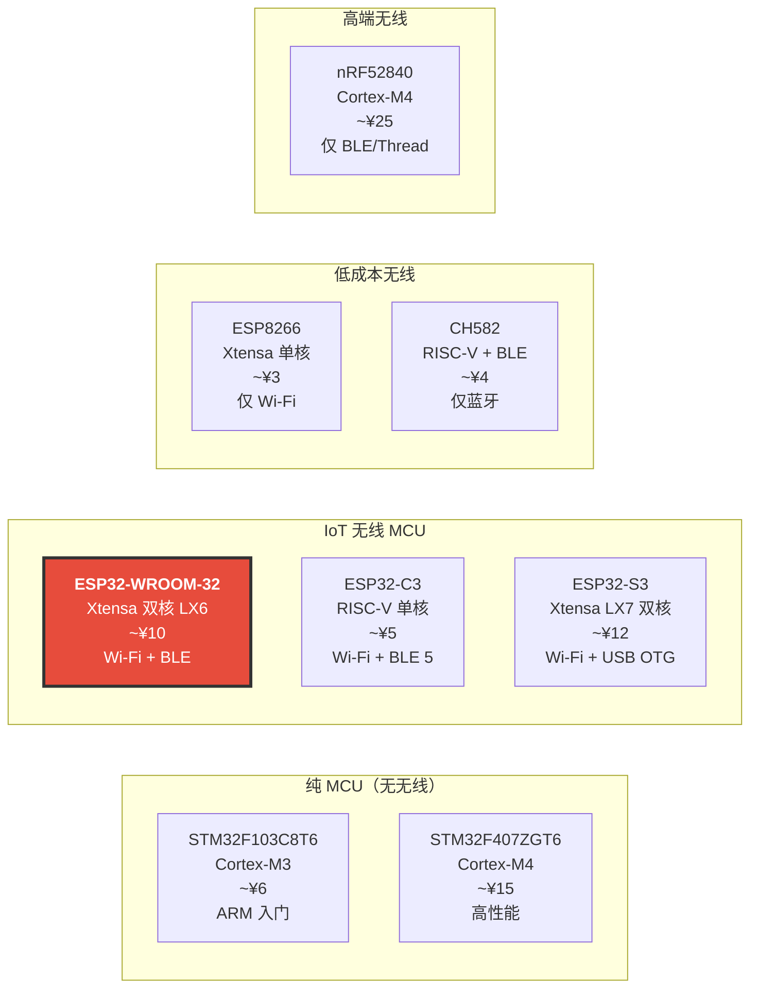
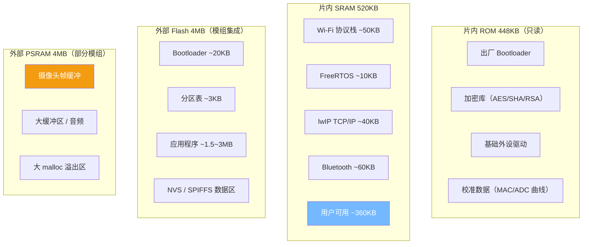
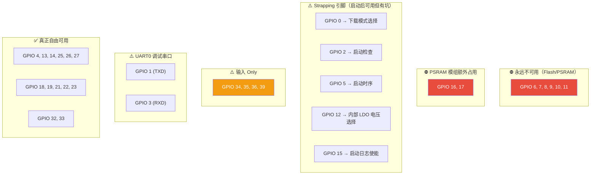

---
tags:
  - 嵌入式/硬件与芯片
  - MCU
  - ESP32
  - Wi-Fi
  - BLE
  - 芯片选型
aliases:
  - ESP32
  - ESP-WROOM-32
  - NodeMCU-32
  - ESP32-DevKitC
related:
  - "[[Xtensa LX6 双核架构]]"
  - "[[ESP32的系统存储]]"
  - "[[WIFI]]"
  - "[[STM32F103C8T6]]"
  - "[[ESP32-D0WDQ6]]"
  - "[[_芯片架构总览]]"
created: 2026-06-10
updated: 2026-06-10
status: 🔄整理中
---

# ESP32-WROOM-32 芯片深度认知与开发指南

> [!abstract] 核心本质
> 乐鑫（Espressif）基于 **Xtensa LX6 双核** 处理器的 Wi-Fi + BLE SoC，240MHz 主频，520KB SRAM + 4MB 外部 Flash。
> 它是 IoT 领域的"国民芯片"——单芯片集成双核 CPU、Wi-Fi、蓝牙、触摸、ADC/DAC，配合成熟的 ESP-IDF 框架，是目前性价比最高的无线 MCU 方案。

---

## 1. 芯片定位与选型价值

### 1.1 ESP32 在嵌入式生态中的位置



ESP32 的生存法则：**"¥10 给你双核 + Wi-Fi + BLE，无线 MCU 性价比之王"**。

### 1.2 核心卖点

| 卖点 | 说明 | 选型价值 |
| --- | --- | --- |
| 双核 240MHz | Xtensa LX6，PRO CPU + APP CPU | 可将 Wi-Fi 协议栈和业务逻辑分核运行 |
| Wi-Fi 802.11 b/g/n | 2.4GHz，Station / AP / 混合 | 单芯片即可做 IoT 设备或软 AP |
| BLE 4.2 + Classic BT | 与 Wi-Fi 共享天线 | 同时支持低功耗蓝牙和经典蓝牙 |
| 520KB SRAM | 片内大容量 RAM | 可运行 TCP/IP 协议栈 + MQTT + 业务逻辑 |
| 外部 PSRAM（可选） | 额外 4MB（部分模组集成） | 图像处理、大缓冲区、音频缓冲 |
| 丰富外设 | Touch / ADC / DAC / LEDC / RMT / TWAI | 覆盖绝大多数传感器和驱动需求 |
| ESP-IDF 框架 | 乐鑫官方 SDK + FreeRTOS | 生产级框架，FreeRTOS 原生集成 |
| 超低功耗 | 深睡眠 ~10μA | 电池供电 IoT 设备可行 |

### 1.3 ESP32 家族对比

| 特性 | ESP8266 | **ESP32-WROOM-32** | ESP32-C3 | ESP32-S3 |
| --- | --- | --- | --- | --- |
| 内核 | Xtensa 单核 | **Xtensa LX6 双核** | RISC-V 单核 | Xtensa LX7 双核 |
| 主频 | 160MHz | **240MHz** | 160MHz | 240MHz |
| Wi-Fi | 802.11 b/g/n | **802.11 b/g/n** | 802.11 b/g/n | 802.11 b/g/n |
| BLE | ❌ | **BLE 4.2 + Classic** | BLE 5.0 | BLE 5.0 |
| SRAM | ~80KB | **520KB** | 400KB | 512KB |
| USB | ❌ | ❌ | ❌ | **USB OTG** |
| 触摸 | ❌ | **10 通道** | ❌ | 14 通道 |
| ADC | 10 位 1 路 | **12 位 18 路** | 12 位 12 路 | 12 位 20 路 |
| DAC | ❌ | **2 路 8 位** | ❌ | ❌ |
| 价格 | ~¥3 | **~¥10** | ~¥5 | ~¥12 |
| 定位 | 最便宜 Wi-Fi | **全能型 Wi-Fi+BLE** | 低成本 RISC-V IoT | 高性能 + USB |

> [!tip] ESP32 vs ESP32-C3 vs ESP32-S3 选型建议
> - **ESP32-WROOM-32**：需要双核 + BLE + Wi-Fi 的通用 IoT 项目（最成熟、资料最多）
> - **ESP32-C3**：成本敏感、不需要双核、只要 BLE 5.0 的新项目（RISC-V 生态成长中）
> - **ESP32-S3**：需要 USB Host/Device、AI 加速指令、更多 GPIO 的新项目
> - **ESP8266**：只需要 Wi-Fi 的极简场景，但要接受生态老化

### 1.4 适用场景

| 推荐使用 | 不推荐使用 |
| --- | --- |
| Wi-Fi/BLE IoT 设备（智能家居、传感器节点） | 实时性要求 < 1μs 的硬实时控制 |
| MQTT/HTTP 上报数据的物联网终端 | 需要 CAN-FD、以太网、USB 的工业场景 |
| 双核并行处理（通信 + 控制） | 需要运行 Linux 的应用（选 MPU） |
| 电池供电 + 深睡眠的低功耗节点 | 需要高精度 ADC（16 位以上）的精密采集 |
| 简单音频处理 / 语音前端 | 高速 USB（USB 3.0）或视频处理 |
| 原型验证和快速开发 | 安全认证要求极高（选专用安全芯片） |

---

## 2. 核心架构：Xtensa LX6 双核

> [!note] 本节为架构概述
> Xtensa LX6 的完整架构分析（窗口寄存器、7 级流水线、中断三层模型、双核缓存一致性）详见 [[Xtensa LX6 双核架构]]。
> 此处只列出选型决策所需的要点。

### 2.1 双核模型

ESP32 的两个 LX6 核心有明确分工：

| 核心 | 名称 | 典型职责 |
| --- | --- | --- |
| Core 0 | **PRO CPU**（Protocol CPU） | Wi-Fi/BT 协议栈、底层中断处理 |
| Core 1 | **APP CPU**（Application CPU） | 用户应用代码、FreeRTOS 用户任务 |

```
  ┌─────────────────────────────────────────────────┐
  │                ESP32 双核架构                     │
  │                                                  │
  │  ┌──────────────┐        ┌──────────────┐       │
  │  │  PRO CPU     │        │  APP CPU     │       │
  │  │  (Core 0)    │        │  (Core 1)    │       │
  │  │              │        │              │       │
  │  │  Wi-Fi 协议栈 │        │  用户任务     │       │
  │  │  BT 协议栈    │        │  MQTT        │       │
  │  │  底层中断     │        │  传感器采集   │       │
  │  └──────┬───────┘        └──────┬───────┘       │
  │         │                       │               │
  │         └───────┬───────────────┘               │
  │                 │                               │
  │         ┌───────┴───────┐                       │
  │         │  共享 L2 Cache │                       │
  │         │  共享 520KB RAM│                       │
  │         │  共享外设总线   │                       │
  │         └───────────────┘                       │
  └─────────────────────────────────────────────────┘
```

> [!important] 双核不是"两倍性能"
> 两个核心**共享** 520KB SRAM 和外设总线，一个核吃满 RAM 另一个核也没得用。
> 双核的真正价值是**隔离**——Wi-Fi 协议栈跑在 PRO CPU 不会阻塞 APP CPU 的业务逻辑。

### 2.2 与 ARM Cortex-M 的横比

| 维度 | ESP32（Xtensa LX6 双核） | STM32F103（Cortex-M3） | STM32F407（Cortex-M4） |
| --- | --- | --- | --- |
| 核心数 | **双核** | 单核 | 单核 |
| 主频 | **240MHz** | 72MHz | 168MHz |
| 浮点 | 单精度硬件 | 软件模拟 | 单精度硬件 FPU |
| SRAM | **520KB** | 20KB | 192KB |
| Wi-Fi | **内置** | 无 | 无 |
| BLE | **内置** | 无 | 无 |
| RTOS | **FreeRTOS 原生集成** | 需移植 | 需移植 |
| 调试 | JTAG（有限） | SWD/JTAG（完善） | SWD/JTAG（完善） |
| 生态 | ESP-IDF（IoT 专用） | HAL 库（通用 MCU） | HAL 库（通用 MCU） |

> [!warning] ESP32 的调试能力是短板
> STM32 有成熟的 SWD 实时调试（断点、变量监视、单步执行）。
> ESP32 的 JTAG 调试支持有限——虽然可以设断点，但断住时 Wi-Fi 协议栈也停了，
> 连接会断开。多数 ESP32 开发者靠 **串口日志** 调试。

### 2.3 主频与功耗

| 模式 | 频率 | 电流（典型） | 说明 |
| --- | --- | --- | --- |
| 全速双核 | 240MHz | 160~260mA | 默认，Wi-Fi 活跃时 |
| 单核省电 | 160MHz | ~120mA | 关闭一个核 |
| 低速模式 | 10~80MHz | ~20mA | 无线关闭时的轻量计算 |
| Light Sleep | - | ~0.8mA | CPU 暂停，RTC 运行，可由 GPIO/定时器唤醒 |
| Deep Sleep | - | **~10μA** | 仅 RTC 运行，可由 RTC GPIO / 触摸 / 定时器唤醒 |

> [!tip] 深睡眠是电池供电 IoT 的关键
> Deep Sleep 10μA 意味着一颗 2000mAh 锂电池理论上可待机 **200,000 小时 ≈ 22 年**。
> 实际工作模式是：醒 → 采集 → 连 Wi-Fi → 上报 → 睡，每次循环几秒。
> 典型场景下一颗电池可用数月到数年。

---

## 3. 存储器模型

> [!note] 本节为存储概览
> 完整的分区表、NVS、SPIFFS、OTA 双分区机制详见 [[ESP32的系统存储]]。
> 此处只列出硬件资源总量和预算分配。

### 3.1 四级存储层次



### 3.2 SRAM 520KB 预算分配

| 消费者 | 占用 | 说明 |
| --- | --- | --- |
| Wi-Fi 协议栈 | ~50KB | 启用 Wi-Fi 时必须预留 |
| Bluetooth（BLE+Classic） | ~60KB | 启用 BT 时必须预留 |
| lwIP TCP/IP 协议栈 | ~40KB | 启用网络时必须预留 |
| FreeRTOS 内核 | ~10KB | 任务栈 + 内核数据结构 |
| **用户可用** | **~360KB** | 仅 Wi-Fi 场景；Wi-Fi+BT 并存时约 ~300KB |

> [!warning] 启用 Wi-Fi 后 RAM 立刻减半
> STM32 的 20KB RAM 是全部给用户的；ESP32 的 520KB 听起来很多，
> 但启用 Wi-Fi + BT + lwIP 后直接吃掉 ~150KB，用户实际可用 ~300~360KB。
> 虽然仍远超 STM32，但不要以为 520KB 全是你的。

### 3.3 Flash 4MB 典型分区布局

| 分区 | 偏移地址 | 大小 | 说明 |
| --- | --- | --- | --- |
| Bootloader | 0x1000 | ~20KB | 一级引导，固化流程 |
| 分区表 | 0x8000 | ~3KB | 描述后续分区布局 |
| 应用程序（OTA A） | 0x10000 | ~1.8MB | 主固件 |
| 应用程序（OTA B） | - | ~1.8MB | 备份固件（OTA 双分区） |
| NVS | 0x9000 | 24KB | 键值对持久存储 |
| SPIFFS / LittleFS | - | 剩余空间 | 文件系统 |

> [!tip] Flash 和 STM32 的根本区别
> STM32 的 Flash 在芯片内部（片上），CPU 直接取指执行。
> ESP32 的 Flash 在芯片外部（SPI NOR Flash），通过 **XIP（eXecute In Place）+ Cache** 机制执行——
> CPU 不是直接读 Flash，而是通过 Cache 换入换出。
> 详见 [[ESP32的系统存储#XIP 机制]]。

### 3.4 PSRAM（可选，部分模组）

| 参数 | 规格 |
| --- | --- |
| 容量 | 4MB（ESP-PSRAM32） |
| 接口 | 与 Flash 共享 SPI/HSPI 总线 |
| 可用模组 | ESP32-WROVER（有 PSRAM）、ESP32-WROOM-32D（**无 PSRAM**） |
| 访问方式 | `heap_caps_malloc(size, MALLOC_CAP_SPIRAM)` |

> [!danger] WROOM-32D 没有 PSRAM！
> 常见的 ESP32-WROOM-32D 模组 **不集成 PSRAM**。
> 只有 ESP32-WROVER 系列模组才有 PSRAM。
> 购买前务必确认模组型号——如果你需要大缓冲区（摄像头、音频），必须选 WROVER。

---

## 4. 引脚映射（ESP32-DevKitC / NodeMCU-32S）

### 4.1 GPIO 总览

ESP32-WROOM-32 模组通过 38 针（2×19）排针引出，但实际可用的 GPIO 并非全部自由：

| 分类 | GPIO | 数量 | 说明 |
| --- | --- | --- | --- |
| **输入 Only** | 34, 35, 36, 39 | 4 | 仅输入，无推挽驱动，无内部上拉 |
| **Strapping 引脚** | 0, 2, 5, 12, 15 | 5 | 启动时被采样决定运行模式，启动后可用 |
| **Flash/PSRAM 占用** | 6~11 | 6 | ⛔ 模组内部 Flash 使用，**绝对不可用** |
| **自由 GPIO** | 1, 3, 4, 13, 14, 16~33（排除上述） | ~21 | 可自由使用的 GPIO |

### 4.2 完整引脚表（ESP32-DevKitC 38 针）

| 引脚# | GPIO | 功能 | 上电默认 | 备注 |
| --- | --- | --- | --- | --- |
| 1 | GND | 地 | - | |
| 2 | 3V3 | 3.3V 电源输出 | - | |
| 3 | EN | 复位（低电平有效） | - | ⚠️ Chip Enable，拉低 = 复位 |
| 4 | VP / GPIO36 | ADC1_CH0 | 高阻 | **输入 Only**，无上拉 |
| 5 | VN / GPIO39 | ADC1_CH3 | 高阻 | **输入 Only**，无上拉 |
| 6 | GPIO34 | ADC1_CH6 | 高阻 | **输入 Only**，无上拉 |
| 7 | GPIO35 | ADC1_CH7 | 高阻 | **输入 Only**，无上拉 |
| 8 | GPIO32 | ADC1_CH4 / Touch9 | - | ✅ 自由 |
| 9 | GPIO33 | ADC1_CH5 / Touch8 | - | ✅ 自由 |
| 10 | GPIO25 | DAC_1 / ADC2_CH8 | - | ✅ 自由 |
| 11 | GPIO26 | DAC_2 / ADC2_CH9 | - | ✅ 自由 |
| 12 | GPIO27 | ADC2_CH7 / Touch7 | - | ✅ 自由 |
| 13 | GPIO14 | HSPI_CLK / ADC2_CH6 / Touch6 | - | ⚠️ Strapping（JTAG） |
| 14 | GPIO12 | HSPI_MISO / ADC2_CH5 / Touch5 | - | ⚠️ Strapping（MTDI，**启动电压选择**） |
| 15 | GND | 地 | - | |
| 16 | GPIO13 | HSPI_MOSI / ADC2_CH4 / Touch4 | - | ✅ 自由 |
| 17 | GPIO9 | ⛔ Flash 占用（SD2） | - | **不可用** |
| 18 | GPIO10 | ⛔ Flash 占用（SD3） | - | **不可用** |
| 19 | GPIO11 | ⛔ Flash 占用（CMD） | - | **不可用** |
| 20 | VIN | 5V 电源输入 | - | 供板载 LDO |
| 21 | GPIO6 | ⛔ Flash 占用（CLK） | - | **不可用** |
| 22 | GPIO7 | ⛔ Flash 占用（SD0） | - | **不可用** |
| 23 | GPIO8 | ⛔ Flash 占用（SD1） | - | **不可用** |
| 24 | GPIO15 | HSPI_CS0 / ADC2_CH3 / Touch3 | - | ⚠️ Strapping（MTDO，**启动日志使能**） |
| 25 | GPIO2 | HSPI_WP / ADC2_CH2 / Touch2 | - | ⚠️ Strapping（必须浮空/低以正常启动） |
| 26 | GPIO0 | ADC2_CH1 / Touch1 | - | ⚠️ Strapping（**下载模式选择**） |
| 27 | GPIO4 | ADC2_CH0 / Touch0 | - | ✅ 自由 |
| 28 | GPIO16 | - | - | ✅ 自由（PSRAM 模组中 ⛔ 被占用） |
| 29 | GPIO17 | - | - | ✅ 自由（PSRAM 模组中 ⛔ 被占用） |
| 30 | GPIO5 | VSPI_CS0 | - | ⚠️ Strapping（启动时序） |
| 31 | GPIO18 | VSPI_CLK | - | ✅ 自由 |
| 32 | GPIO19 | VSPI_MISO | - | ✅ 自由 |
| 33 | GPIO21 | I2C SDA（默认） | - | ✅ 自由 |
| 34 | GPIO3 | UART0 RXD | - | ⚠️ 串口接收（烧录/日志） |
| 35 | GPIO1 | UART0 TXD | - | ⚠️ 串口发送（烧录/日志） |
| 36 | GPIO22 | I2C SCL（默认） | - | ✅ 自由 |
| 37 | GPIO23 | VSPI_MOSI | - | ✅ 自由 |
| 38 | GND | 地 | - | |

### 4.3 引脚冲突矩阵



### 4.4 Strapping 引脚详解

Strapping 引脚在**上电瞬间被硬件采样**，决定芯片进入哪种运行模式。启动完成后可做普通 GPIO 使用，但外部电路不能在启动时将它们拉到错误电平：

| GPIO | Strapping 功能 | 正常运行要求 | 下载模式要求 |
| --- | --- | --- | --- |
| GPIO 0 | 启动模式选择 | **高电平**（Flash 启动） | **低电平**（UART 下载） |
| GPIO 2 | 启动检查 | 必须浮空或低 | 必须低 |
| GPIO 5 | 启动时序 | 高电平（默认上拉） | 高电平 |
| GPIO 12 | 内部 LDO 电压 | **低电平** = 3.3V（正确） | 低电平 |
| GPIO 15 | 启动日志使能 | 高电平 = 使能日志 | 高电平 |

> [!danger] GPIO 12 是最危险的 Strapping 引脚
> GPIO 12（MTDI）决定内部 LDO 输出电压：
> - **低电平**（默认）→ LDO 输出 3.3V → 正常
> - **高电平** → LDO 输出 1.8V → **Flash 无法工作，芯片变砖**
>
> 如果你的外部电路在 GPIO 12 上接了上拉电阻（如 I2C、传感器），
> 上电瞬间 GPIO 12 被拉高，芯片的 LDO 就输出 1.8V，Flash 启动失败。
> **永远不要在 GPIO 12 上加外部上拉电阻！**

### 4.5 输入 Only 引脚限制

GPIO 34、35、36、39 是纯输入引脚，有以下限制：

| 限制 | 说明 |
| --- | --- |
| 无推挽输出 | 不能驱动 LED、继电器等 |
| 无内部上拉/下拉 | 必须外部接上拉/下拉电阻 |
| 典型用途 | ADC 采样、外部数字信号输入、按键检测（外部上拉） |

### 4.6 与 ESP32-CAM（D0WDQ6）的 GPIO 差异

| 维度 | ESP32-WROOM-32（DevKitC） | ESP32-CAM（AI-Thinker） |
| --- | --- | --- |
| 芯片 | ESP32-D0WDQ6（相同） | ESP32-D0WDQ6（相同） |
| 可用 GPIO 数量 | **~21 个** | **~4 个** |
| 被占用原因 | Flash 6 个 | Flash 6 + 摄像头 16 + SD 卡 4 + PSRAM 1 |
| USB-Serial | **板载 CP2102/CH340** | **无**，需外接 USB-TTL |
| 典型用途 | 通用 IoT 开发 | 摄像头 + Wi-Fi 流媒体 |

> [!tip] 选哪个开发板？
> - **学习 ESP32 / IoT 开发** → ESP32-DevKitC（GPIO 充裕、板载 USB-Serial、调试方便）
> - **摄像头项目** → ESP32-CAM（但 GPIO 极紧张，且需要外接 USB-TTL 烧录）
> - 两者芯片完全相同，程序可通用

---

## 5. 无线通信能力

### 5.1 Wi-Fi 概览

| 参数 | 规格 |
| --- | --- |
| 标准 | IEEE 802.11 b/g/n |
| 频段 | 2.4GHz ISM |
| 最大速率 | 150Mbps（理论），实际 ~20~30Mbps（TCP 吞吐） |
| 工作模式 | Station（STA）/ SoftAP / STA+AP 同时 |
| 安全 | WPA/WPA2/WPA3（ESP-IDF v5+） |
| 协议栈位置 | 运行在 **PRO CPU（Core 0）** |

```
  ESP32 Wi-Fi 软件栈层次：

  ┌──────────────────────────┐
  │  用户应用（MQTT / HTTP）   │
  ├──────────────────────────┤
  │  ESP-IDF Wi-Fi API       │
  ├──────────────────────────┤
  │  Wi-Fi 驱动（闭源二进制）   │
  ├──────────────────────────┤
  │  lwIP TCP/IP 协议栈       │
  ├──────────────────────────┤
  │  esp_netif 抽象层          │
  ├──────────────────────────┤
  │  Wi-Fi 硬件 MAC/PHY       │
  └──────────────────────────┘
```

> [!important] Wi-Fi 工程化详解见专题笔记
> ESP32 Wi-Fi 的初始化链、事件驱动架构、状态机、故障排查等工程化内容，
> 详见 [[WIFI]]（1132 行专题笔记）。

### 5.2 蓝牙概览

| 参数 | BLE 4.2 | Classic BT |
| --- | --- | --- |
| 速率 | 1Mbps（BLE 4.2） | 最高 3Mbps（EDR） |
| 典型用途 | 传感器数据、配置传输 | 音频（A2DP）、串口（SPP） |
| 功耗 | 低 | 较高 |
| 与 Wi-Fi 共存 | 共享天线和射频，时分复用 | 同左 |

> [!warning] Wi-Fi 和 BLE 共享射频
> ESP32 只有一根天线和一个射频前端，Wi-Fi 和 BLE 通过**时分复用**共享。
> 两者不会同时收发，而是交替使用射频。在高负载 Wi-Fi 场景下，BLE 延迟会增大。

### 5.3 天线选项

| 天线类型 | ESP32-WROOM-32 模组 | 说明 |
| --- | --- | --- |
| PCB 天线（板载） | ✅ 默认 | 适用于大多数场景，增益 ~2dBi |
| 外部天线（IPEX 接口） | 部分模组支持 | 需要更长距离或穿墙时使用 |

---

## 6. 外设资源

### 6.1 外设总览表

| 外设 | 数量 | 备注 |
| --- | --- | --- |
| UART | 3 路 | UART0（日志/烧录）、UART1/2（通用） |
| SPI | 4 路（HSPI + VSPI + 2 路 GPSPI） | Flash/PSRAM 占用 2 路，用户可用 HSPI/VSPI |
| I2C | 2 路 | 无 F103 的硅缺陷问题 |
| ADC | 2 个（ADC1: 8ch, ADC2: 10ch） | 12 位，ADC2 与 Wi-Fi 冲突！ |
| DAC | 2 路（8 位） | GPIO 25 / GPIO 26 |
| Touch | 10 通道 | 电容触摸 |
| LEDC（LED PWM） | 16 通道 | 高分辨率 PWM（最高 15 位） |
| RMT（红外/单总线） | 8 通道 | 硬件生成/解析自定义波形 |
| PCNT（脉冲计数） | 8 通道 | 硬件计数编码器脉冲 |
| TWAI（CAN） | 1 路 | 兼容 CAN 2.0B |
| 定时器（通用） | 4 个（52 位） | 高分辨率硬件定时器 |
| MCPWM | 6 输出 | 电机控制专用 PWM（三相） |

### 6.2 ADC 通道与 Wi-Fi 冲突

| ADC | 通道 | 引脚范围 | Wi-Fi 冲突 |
| --- | --- | --- | --- |
| ADC1 | 8 通道 | GPIO 32~39 | **无冲突**，Wi-Fi 开启后仍可用 |
| ADC2 | 10 通道 | GPIO 0, 2, 4, 12~15, 25~27 | **有冲突**，Wi-Fi 开启后不可用 |

> [!danger] ADC2 在 Wi-Fi 模式下不可用
> Wi-Fi 驱动需要占用 ADC2 的某些硬件资源，因此 Wi-Fi 开启后 ADC2 的读数**不准确或直接失败**。
> **如果项目需要 ADC + Wi-Fi 同时工作，必须使用 ADC1 的通道（GPIO 32~39）。**

### 6.3 ESP32 独有外设（STM32 没有的）

| 外设 | 功能 | 典型应用 |
| --- | --- | --- |
| **LEDC** | 15 位分辨率 PWM，8 通道独立频率/占空比 | LED 调光、舵机、蜂鸣器 |
| **RMT** | 硬件生成/解析纳秒级自定义波形 | WS2812 灯带、红外遥控、单总线协议 |
| **PCNT** | 硬件脉冲计数器，支持正交解码 | 旋转编码器、流量计 |
| **MCPWM** | 三相互补 PWM + 死区 + 故障保护 | BLDC/PMSM 电机控制（FOC） |
| **TWAI** | CAN 2.0B（与 STM32 CAN 类似） | 工业总线通信 |

> [!tip] RMT 是 ESP32 的"杀手级"外设
> STM32 要驱动 WS2812 灯带需要精确的纳秒级时序（±150ns），通常要占用一个定时器 + 中断或 DMA。
> ESP32 的 RMT 外设可以硬件生成这些波形，CPU 完全不参与——几行代码就能驱动。

### 6.4 UART 详细分配

| UART | 默认引脚 | 用途 | 备注 |
| --- | --- | --- | --- |
| UART0 | GPIO1(TX) / GPIO3(RX) | **日志输出 + 烧录** | 不要重映射到其他引脚 |
| UART1 | GPIO10(TX) / GPIO9(RX) | 通用串口 | ⚠️ 默认引脚被 Flash 占用，**必须重映射** |
| UART2 | GPIO17(TX) / GPIO16(RX) | 通用串口 | PSRAM 模组中需重映射 |

> [!important] UART1 默认引脚不可用
> UART1 的默认 TX/RX 是 GPIO 10/9，这两个引脚被模组内部 Flash 占用。
> 使用 UART1 时**必须通过 `uart_set_pin()` 重映射到其他可用引脚**。

---

## 7. 开发工具链

### 7.1 三大框架对比

| 维度 | **ESP-IDF**（推荐产品级） | Arduino Core（推荐入门） | MicroPython |
| --- | --- | --- | --- |
| 语言 | C / C++ | C / C++（Arduino 语法） | Python |
| 官方支持 | ✅ 乐鑫官方 SDK | 社区维护 | 社区维护 |
| FreeRTOS | **原生集成** | 封装底层 | 不可见 |
| Wi-Fi/BLE API | **最完整** | 基本覆盖 | 基本覆盖 |
| OTA 支持 | **原生** | 需额外库 | 需额外库 |
| 性能优化 | **最好** | 中等（框架开销） | 最差（解释执行） |
| 上手难度 | ⭐⭐⭐（学习曲线陡） | ⭐（最简单） | ⭐（最简单） |
| 适用场景 | **产品级开发** | 原型验证、简单项目 | 教学、快速验证 |

### 7.2 ESP-IDF 开发流程

```mermaid
graph LR
    A["idf.py create-project"] --> B["编写代码<br/>app_main() 入口"]
    B --> C["idf.py build<br/>编译 + 生成 bin"]
    C --> D["idf.py -p COMx flash<br/>烧录到 ESP32"]
    D --> E["idf.py monitor<br/>串口日志监视"]
    E -->|Ctrl+] 退出| F["开发循环"]
    F -->|修改代码| B
```

> [!tip] ESP-IDF 命令详解
> `idf.py` 的完整命令参考（环境搭建、烧录、分区操作、menuconfig）详见 [[../../调试烧录-知识/Cmake-Esp32/基础指令|ESP-IDF 基础指令]]。

### 7.3 烧录方式

| 方式 | 接口 | 所需工具 | 速度 | 说明 |
| --- | --- | --- | --- | --- |
| **USB-Serial**（推荐） | GPIO1(TX) / GPIO3(RX) | 板载 CP2102/CH340 + `esptool` | 快 | DevKitC 板载 USB-Serial，插 USB 即可 |
| UART 手动下载 | GPIO1/GPIO3 + GPIO0 | 外接 USB-TTL + 拉低 GPIO0 | 中 | 无板载 USB-Serial 时使用 |

**自动下载电路**（DevKitC 板载）：

```
  自动下载原理（无需手动按按钮）：

  DTR ──┬── [Q1] ── EN（复位）
        │
  RTS ──┴── [Q2] ── GPIO0（启动模式）

  esptool 通过控制 DTR/RTS 信号自动完成：
  1. GPIO0 拉低 + EN 拉低 → 芯片进入下载模式
  2. EN 拉高 → 芯片从 UART Bootloader 启动
  3. 烧录完成后 GPIO0 释放 → 正常运行
```

### 7.4 sdkconfig 配置系统

ESP-IDF 使用 `sdkconfig` 文件管理所有编译选项（类似 STM32CubeMX 的配置文件）：

| 常用配置项 | 说明 |
| --- | --- |
| `CONFIG_IDF_TARGET` | 目标芯片（esp32 / esp32s3 / esp32c3） |
| `CONFIG_ESP_DEFAULT_CPU_FREQ` | CPU 频率（160/240MHz） |
| `CONFIG_FREERTOS_UNICORE` | 是否只用单核 |
| `CONFIG_ESP32_ENABLE_COREDUMP` | 异常时 core dump |
| `CONFIG_PARTITION_TABLE_OFFSET` | 分区表偏移 |
| `CONFIG_ESPTOOLPY_FLASHSIZE` | Flash 大小（2/4/8/16MB） |

> [!tip] menuconfig 可视化配置
> `idf.py menuconfig` 提供终端菜单界面，与直接编辑 sdkconfig 等效。
> 详见 [[../../调试烧录-知识/Cmake-Esp32/sdkconfig|sdkconfig 配置笔记]]。

---

## 8. 硬件设计避坑指南

### 8.1 最小系统

ESP32-WROOM-32 是一个**模组**（不是裸芯片），内部已集成 Flash、晶振、PCB 天线：

```
  ESP32-WROOM-32 模组最小系统
  ════════════════════════════

  ┌─────────────────────────────────────────┐
  │  ESP32-WROOM-32 模组内部已包含：         │
  │    ├── ESP32-D0WDQ6 芯片                │
  │    ├── 4MB SPI NOR Flash                │
  │    ├── 40MHz 晶振                       │
  │    ├── PCB 天线                         │
  │    └── 屏蔽罩                           │
  │                                         │
  │  你只需要给模组供电 + 2 个电容：          │
  │                                         │
  │  3V3 ───────────── VDD (3.3V)           │
  │  3V3 ── [10μF] ── GND     ← 电源滤波   │
  │  3V3 ── [0.1μF] ── GND    ← 去耦       │
  │                                         │
  │  EN ── [10kΩ] ── 3V3      ← 上拉使能    │
  │  EN ── [0.1μF] ── GND     ← 复位滤波   │
  │  EN ── [按钮] ── GND      ← 手动复位    │
  │                                         │
  │  GND ───────────── GND                  │
  └─────────────────────────────────────────┘

  对比 STM32F103C8T6 的最小系统（需要外接晶振、多个去耦、BOOT 跳线）
  ESP32 模组几乎"即插即用"
```

> [!important] ESP32 是 3.3V 供电，不是宽电压
> ESP32 VDD 范围 3.0~3.6V（典型 3.3V），与 STM32F103 类似。
> USB 5V 必须经过 LDO 降到 3.3V。DevKitC 开发板上已集成 AMS1117-3.3。

### 8.2 Strapping 引脚避坑

| 坑 | 后果 | 解决方案 |
| --- | --- | --- |
| GPIO 12 外接上拉 | LDO 输出 1.8V，Flash 不工作，**变砖** | GPIO 12 **永远不加外部上拉** |
| GPIO 0 外接强下拉 | 每次上电都进入下载模式 | 用 10kΩ 上拉到 3.3V |
| GPIO 2 外接强上拉 | 启动检查失败 | 启动时保持低或浮空 |
| GPIO 15 外接强下拉 | 启动日志禁用（不一定坏事） | 如需看启动日志则上拉 |
| GPIO 5 外接强下拉 | 影响启动时序 | 用 10kΩ 上拉 |

> [!danger] 最容易踩的坑：GPIO 12 上拉
> 重复强调：GPIO 12 接上拉 = 芯片 LDO 切换到 1.8V = Flash 无法启动 = **硬件变砖**。
> 这不是软件问题，是硬件配置错误。唯一的修复方法是去掉 GPIO 12 的上拉电阻。

### 8.3 电源设计

```
  典型供电方案（USB + 电池双供电）：

  USB 5V ──┬── [AMS1117-3.3] ──→ 3.3V ──→ ESP32 VDD
           │
           └── 可选：给外设供电（5V 设备）

  锂电池 3.7V ── [LDO 3.3V] ──→ 3.3V ──→ ESP32 VDD

  ⚠️ Wi-Fi 发射时电流峰值可达 500mA
     LDO 必须能提供至少 500mA 输出
     AMS1117-3.3（最大 1A）够用
     但如果同时驱动 LED、电机等大电流负载，需要更大容量 LDO
```

> [!warning] Brownout Detector（欠压检测）
> ESP32 内置 Brownout Detector，当 VDD 电压低于 ~2.8V 时会自动复位芯片。
> 如果你的 ESP32 频繁重启且日志显示 `brownout detector was triggered`：
> 1. 电源供电能力不足（Wi-Fi 发射瞬间电压跌落）
> 2. USB 线太长/太细（压降大）
> 3. 去耦电容离芯片太远

### 8.4 EN 复位引脚

| 特性 | ESP32 | STM32F103 |
| --- | --- | --- |
| 复位引脚 | EN（高电平有效使能） | NRST（低电平有效复位） |
| 复位电平 | EN = 低 → 复位 | NRST = 低 → 复位 |
| 上拉电阻 | 10kΩ 到 3.3V | 10kΩ 到 3.3V |
| 复位按钮 | EN 到 GND | NRST 到 GND |

两者都是**低电平复位**（EN 低 = 复位，与 CH552G 的高电平复位不同）。

---

## 9. Troubleshooting 排查清单

### 9.1 烧录失败

| 现象 | 可能原因 | 解决方案 |
| --- | --- | --- |
| `esptool` 找不到设备 | USB 驱动未安装 / COM 口错误 | 安装 CP2102/CH340 驱动，检查设备管理器 |
| 连接超时 | GPIO 0 未拉低 / EN 未复位 | DevKitC 自动下载电路故障，手动按 BOOT + RST |
| 擦除失败 | Flash 型号不匹配 | `idf.py erase-flash` 强制擦除 |
| 烧录后黑屏 | 分区表错误 / sdkconfig 配置错误 | 检查 Flash 大小设置是否匹配实际模组 |
| `A fatal error occurred: Invalid head of packet` | 波特率过高 | 降低 `--baud 115200` 重试 |

### 9.2 Wi-Fi 连不上

| 现象 | 可能原因 | 解决方案 |
| --- | --- | --- |
| `WIFI_REASON_AUTH_FAIL` | 密码错误 | 确认 SSID/密码 |
| 信号强度极弱 | 天线未接 / PCB 天线被屏蔽 | 远离金属物，确认天线方向 |
| 连接后频繁断开 | 路由器 5GHz only | ESP32 只支持 2.4GHz |
| `WIFI_REASON_NO_AP_FOUND` | SSID 隐藏或频道不兼容 | 尝试显式指定 BSSID |
| DHCP 超时 | 路由器 DHCP 池满 | 检查路由器设置或用静态 IP |

> [!tip] Wi-Fi 故障排查完整流程
> 详见 [[WIFI]] 笔记中的 7 步故障诊断清单。

### 9.3 Brownout / 频繁重启

| 现象 | 可能原因 | 解决方案 |
| --- | --- | --- |
| `brownout detector was triggered` | 供电不足 | 换更粗的 USB 线，加大去耦电容 |
| 循环重启（Boot Loop） | 应用程序 panic | 查看串口日志中的 backtrace |
| 上电后不断重启 | Strapping 引脚电平错误 | 检查 GPIO 0/2/5/12/15 外部电路 |

### 9.4 内存不足

| 现象 | 可能原因 | 解决方案 |
| --- | --- | --- |
| `Not enough memory` | 堆内存耗尽 | 用 `esp_get_free_heap_size()` 监控 |
| `malloc failed` | 大块分配失败 | 检查是否有内存泄漏，或用 PSRAM |
| 任务栈溢出 | FreeRTOS 任务栈太小 | 增大 `xTaskCreate` 的 stack 深度 |
| Wi-Fi 启动后 OOM | 协议栈吃掉太多 RAM | 检查 Wi-Fi 缓冲区配置（menuconfig） |

> [!tip] 内存调试工具
> ```c
> // 运行时监控内存
> ESP_LOGI("MEM", "Free heap: %d bytes", esp_get_free_heap_size());
> ESP_LOGI("MEM", "Free PSRAM: %d bytes", heap_caps_get_free_size(MALLOC_CAP_SPIRAM));
> ESP_LOGI("MEM", "Min free heap: %d bytes", esp_get_minimum_free_heap_size());
> ```

---

## 10. 面试 / 知识速查

> [!info] 折叠式 Q&A，点击展开查看答案

<details>
<summary><b>Q1：ESP32 的双核架构是怎样的？两个核有什么分工？</b></summary>

Xtensa LX6 双核：PRO CPU（Core 0）运行 Wi-Fi/BT 协议栈和底层中断，APP CPU（Core 1）运行用户应用。
两个核共享 520KB SRAM 和外设总线，不是独立内存空间。
双核的价值是**隔离**——Wi-Fi 协议栈不会阻塞业务逻辑，但不是两倍性能。
详见 [[Xtensa LX6 双核架构]]。

</details>

<details>
<summary><b>Q2：ESP32 的 520KB SRAM 真的全给用户吗？</b></summary>

不是。启用 Wi-Fi 后协议栈吃 ~50KB，BLE ~60KB，lwIP ~40KB，FreeRTOS ~10KB。
用户实际可用 ~300~360KB（取决于启用了哪些无线功能）。
虽然远超 STM32F103 的 20KB，但远没有"520KB 全是我的"那么宽裕。

</details>

<details>
<summary><b>Q3：ESP32 的 Flash 和 STM32 的 Flash 有什么本质区别？</b></summary>

STM32 的 Flash 在芯片内部，CPU 直接取指执行（零等待或固定等待周期）。
ESP32 的 Flash 在芯片外部（SPI NOR Flash），通过 XIP + Cache 机制间接执行——
CPU 先查 Cache，未命中再通过 SPI 读 Flash，延迟不确定。
这导致中断处理函数必须用 `IRAM_ATTR` 放到内部 SRAM 才能保证确定性。
详见 [[ESP32的系统存储]]。

</details>

<details>
<summary><b>Q4：GPIO 12 为什么不能加上拉电阻？</b></summary>

GPIO 12（MTDI）是 Strapping 引脚，上电时被采样决定内部 LDO 输出电压：
低电平 → 3.3V（正常），高电平 → 1.8V（Flash 不工作，芯片变砖）。
如果外部电路在 GPIO 12 上加了上拉，每次上电都会触发 1.8V 模式。
这是硬件级问题，软件无法修复——必须去掉上拉电阻。

</details>

<details>
<summary><b>Q5：ESP32 的 ADC2 为什么在 Wi-Fi 模式下不可用？</b></summary>

Wi-Fi 驱动需要占用 ADC2 的某些内部硬件资源（校准电路/参考电压），
导致 ADC2 的读数不准确或直接失败。
解决方案：需要 ADC + Wi-Fi 并存时，**只用 ADC1 通道**（GPIO 32~39）。

</details>

<details>
<summary><b>Q6：ESP32-CAM 和 ESP32-DevKitC 的区别是什么？芯片相同吗？</b></summary>

芯片完全相同（都是 ESP32-D0WDQ6）。区别在开发板形态：
- DevKitC：~21 个可用 GPIO、板载 USB-Serial、通用 IoT 开发
- ESP32-CAM：仅 ~4 个可用 GPIO（16 个被摄像头占用）、无板载 USB-Serial、专为摄像头设计
程序可通用，但引脚分配完全不同。

</details>

<details>
<summary><b>Q7：ESP32 和 ESP32-S3 的主要区别是什么？</b></summary>

ESP32-S3 的核心升级：
- USB OTG（支持 Host 和 Device）
- LX7 内核（新增 AI 向量扩展指令）
- 更多 GPIO（45 个）
- BLE 5.0（更远距离）
- 更多 ADC 通道（20 路）
但 ESP32-S3 去掉了 DAC 和 Classic BT，不是完全向下兼容。

</details>

<details>
<summary><b>Q8：ESP32 的 Deep Sleep 10μA 是怎么实现的？</b></summary>

Deep Sleep 模式下，主 CPU 和大部分外设断电，仅 RTC（实时时钟）域保持供电：
- RTC 内存保留（可存少量数据）
- RTC GPIO 保持状态
- ULP 协处理器可周期性唤醒做简单采样
唤醒源：定时器、RTC GPIO 中断、触摸中断、ULP 中断
适用于"醒 → 采集 → 上报 → 睡"的低功耗 IoT 场景。

</details>

---

## 知识链接

**架构与内核**
- [[Xtensa LX6 双核架构]] — Xtensa LX6 完整架构分析（窗口寄存器、流水线、中断、双核缓存一致性）
- [[_芯片架构总览]] — MCU 架构全景定位
- [[MCU架构]] — MCU 架构概览，含 ESP32 在 MCU 生态中的定位
- [[ARM Cortx-M4]] — ARM 架构对比参考
- [[指令集]] — ISA 全景，含 Xtensa 可定制指令集

**存储与启动**
- [[ESP32的系统存储]] — 分区表、NVS、SPIFFS、OTA 双分区、XIP 机制完整详解
- [[DMA 与 Cache 一致性]] — PSRAM 缓存一致性问题与解决方案
- [[STM32F407启动源码的理解]] — STM32 启动流程对比参考

**无线通信**
- [[WIFI]] — ESP32 Wi-Fi 初始化链、事件驱动、状态机、故障排查（1132 行专题）
- [[MQTT协议]] — ESP32 MQTT 异步事件驱动架构
- [[TLS加密协议]] — ESP32 TLS/mbedTLS 配置与证书管理
- [[OTA升级]] — ESP32 双分区 OTA 机制与自动回滚
- [[LwIP 网络协议栈]] — ESP32 TCP/IP 协议栈详解

**开发工具**
- [[../../调试烧录-知识/Cmake-Esp32/基础指令|ESP-IDF 基础指令]] — idf.py 命令、环境搭建、烧录操作
- [[../../调试烧录-知识/Cmake-Esp32/sdkconfig|sdkconfig]] — ESP-IDF 编译配置系统
- [[../../调试烧录-知识/Cmake-Esp32/ESP32-D0WDQ6的启动流程和内存详细|ESP32 启动流程]] — 8 步启动流程与内存布局

**同系列开发板**
- [[ESP32-D0WDQ6]] — ESP32-CAM 开发板（摄像头 + GPIO 映射）
- [[STM32F103C8T6]] — ARM Cortex-M3 对比参考
- [[STM32F407ZGT6]] — ARM Cortex-M4 对比参考
- [[CH552G]] — 8051 增强型 USB 方案对比参考