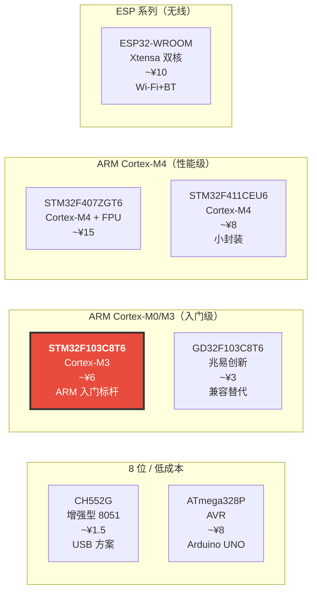
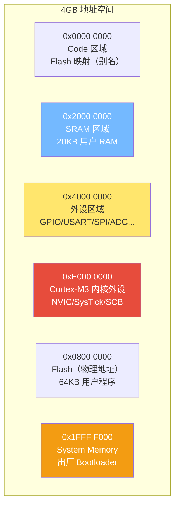
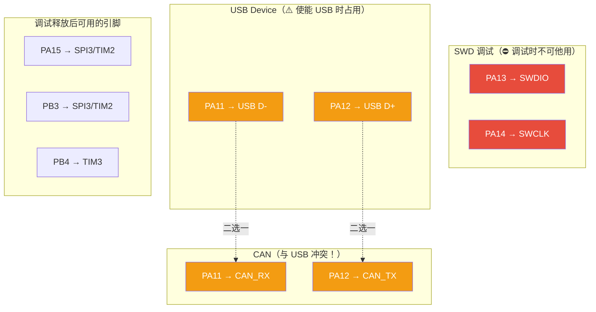
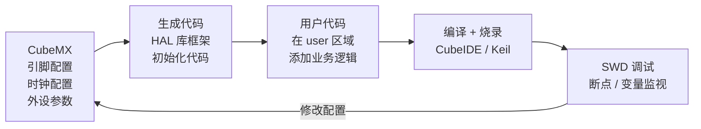

---
tags:
  - 嵌入式/硬件与芯片
  - MCU
  - STM32
  - Cortex-M3
  - 芯片选型
aliases:
  - F103C8T6
  - STM32F103
  - Blue Pill
related:
  - "[[ARM Cortx-M4]]"
  - "[[STM32F407ZGT6]]"
  - "[[_芯片架构总览]]"
  - "[[时钟系统基础概念]]"
  - "[[中断的基础理解]]"
  - "[[STM32F407启动源码的理解]]"
created: 2026-06-10
updated: 2026-06-10
status: 🔄整理中
---

# STM32F103C8T6 芯片深度认知与开发指南

> [!abstract] 核心本质
> 意法半导体（ST）基于 [ARM Cortex-M3](../芯片/架构与指令集/ARM%20Cortx-M4.md) 内核的 32 位 MCU，72MHz 主频，64KB Flash / 20KB SRAM。
> 它是 STM32 系列的"国民芯片"——生态最成熟、资料最丰富、学习成本最低的 ARM 入门选择，也是国产兼容芯片（GD32F103、CH32F103）的标杆参照物。

---

## 1. 芯片定位与选型价值

### 1.1 STM32F103C8T6 在嵌入式生态中的位置



F103C8T6 的生存法则：**"ARM 入门最低门槛，生态资料无出其右"**。

### 1.2 核心卖点

| 卖点 | 说明 | 选型价值 |
| --- | --- | --- |
| ARM Cortex-M3 @ 72MHz | 32 位 RISC，1.25 DMIPS/MHz | 比 8 位 MCU 算力提升一个数量级 |
| 丰富外设 | USART×3、SPI×2、I2C×2、ADC×2、CAN、USB FS | 单芯片覆盖绝大多数通信和控制需求 |
| 生态成熟 | HAL 库 + CubeMX + 海量教程 + 社区 | 开发周期最短，踩坑文档最全 |
| 价格亲民 | Blue Pill 开发板 ~¥10，散片 ~¥6 | 入门学习和简单产品的性价比最优 |
| 国产兼容 | GD32F103、CH32F103 引脚兼容 | 国产替代，供应链安全 |
| 调试方便 | SWD 接口，支持 ST-Link / J-Link | 实时断点调试，开发效率高 |

### 1.3 同族 / 兼容芯片对比

| 特性 | **STM32F103C8T6** | GD32F103C8T6 | CH32F103C8T6 | STM32F407ZGT6 |
| --- | --- | --- | --- | --- |
| 内核 | Cortex-M3 | Cortex-M3（兆易创新） | Cortex-M3（沁恒） | Cortex-M4 |
| 主频 | 72MHz | **108MHz** | 72MHz | 168MHz |
| Flash | **64KB** | 64KB | 64KB | 1MB |
| SRAM | **20KB** | 20KB | 20KB | 192KB |
| FPU | 无 | 无 | 无 | **有（单精度）** |
| USB | FS Device | FS Device | FS Device | OTG FS/HS |
| 价格 | ~¥6 | **~¥3** | ~¥4 | ~¥15 |
| 兼容性 | 原版 | **引脚兼容，寄存器兼容** | 引脚兼容 | 不兼容 |

> [!tip] GD32 vs STM32 的微妙差异
> GD32F103 主频更高（108MHz vs 72MHz），但 Flash 零等待策略不同——GD32 采用广域预取，
> 某些时序敏感代码（如软件 I2C、精确延时）从 STM32 迁移到 GD32 后可能需要调整。
> 实际项目中，大部分代码可直接烧录互换，但**量产前务必在目标芯片上全量测试**。

### 1.4 适用场景

| 推荐使用 | 不推荐使用 |
| --- | --- |
| 嵌入式 ARM 入门学习（首选） | 需要硬件浮点运算（选 F4 系列） |
| 简单电机控制（直流/步进） | 高性能电机控制（FOC/PID 密集，选 F4） |
| 多串口网关/协议转换器 | 需要运行 LwIP 网络（选 F4 或 ESP32） |
| 工业现场总线（CAN、RS485） | 需要大量 RAM（>20KB）的数据处理 |
| 低成本传感器采集与上传 | 需要运行复杂 RTOS + GUI（选 F4/H7） |
| 电子竞赛 / 毕业设计 | 音视频处理、边缘计算 |

---

## 2. 核心架构：Cortex-M3

### 2.1 Cortex-M3 关键特性

STM32F103C8T6 采用 ARM Cortex-M3 内核（ARMv7-M 架构）。相比 Cortex-M4，**M3 没有 FPU 和 DSP 指令**——这是两者最根本的差异。

| 特性 | Cortex-M3（F103） | Cortex-M4（F407） | 影响 |
| --- | --- | --- | --- |
| FPU | **无** | 单精度硬件 FPU | `float` 运算 F103 要靠软件模拟，慢 10~50 倍 |
| DSP 指令 | **无** | 有（MAC/SIMD） | 信号处理（FIR/FFT）无硬件加速 |
| 流水线 | 3 级 | 3 级 | 相同 |
| 中断延迟 | 12 周期 | 12 周期 | 相同 |
| 位带操作 | 有 | 有 | 相同 |
| 主频 | 72MHz | 168MHz | F407 算力是 F103 的 2.3 倍以上 |

> [!important] F103 没有 FPU 意味着什么？
> ```c
> // 这行代码在 F407 上耗时 ~1 个周期（硬件 FPU）
> // 在 F103 上耗时 ~20~50 个周期（软件浮点库模拟）
> float result = a * 3.14f + b * 0.618f;
> ```
> **工程对策**：
> 1. 能用整数就不用浮点（如 PID 用 `int32_t` + 定点小数）
> 2. 必须用浮点时，开启编译器优化（`-O2` / `-O3`）
> 3. 算力不够就换 F4——不要在 F103 上硬算

### 2.2 与其他架构的横比

| 维度 | STM32F103（Cortex-M3） | CH552G（增强 8051） | ESP32（Xtensa LX6） |
| --- | --- | --- | --- |
| 架构 | 32 位 RISC | 8 位 CISC | 32 位 RISC 双核 |
| 主频 | 72MHz | 24MHz | 240MHz |
| 寄存器宽度 | 32 位（R0~R15） | 8 位（ACC/B/R0~R7） | 32 位 |
| 寻址空间 | 4GB | 64KB | 4GB |
| 栈模型 | 软件栈（RAM 任意位置） | 硬件栈（固定 256B） | 软件栈 |
| 中断现场保存 | 硬件自动（8 寄存器） | 软件手动 PUSH/POP | 硬件自动 |
| 浮点 | 软件模拟 | 软件模拟 | 硬件单精度 |
| 无线 | 无 | 无 | Wi-Fi + BLE |
| 典型价格 | ~¥6 | ~¥1.5 | ~¥10 |

### 2.3 三级流水线

Cortex-M3 将指令执行拆分为三个独立阶段：

```
周期:   1       2       3       4       5
      ┌───────┬───────┬───────┬───────┐
取指:  │ INS 1 │ INS 2 │ INS 3 │ INS 4 │
      └───────┼───────┼───────┼───────┤
译码:          │ INS 1 │ INS 2 │ INS 3 │
              └───────┼───────┼───────┤
执行:                  │ INS 1 │ INS 2 │
                      └───────┴───────┘
```

- 大多数指令在 **1~2 个周期** 内完成
- 分支指令会清空流水线（2~3 周期惩罚），M3 有简单的**静态分支预测**缓解

---

## 3. 存储器模型

### 3.1 内存映射总览

Cortex-M3 采用 **统一编址**（4GB 线性地址空间），不像 8051 那样分 CODE/idata/xdata 三个独立空间：



| 区域 | 地址范围 | 大小 | 用途 |
| --- | --- | --- | --- |
| Flash（物理） | 0x0800 0000 ~ 0x0800 FFFF | 64KB | 存放用户程序、常量 |
| SRAM | 0x2000 0000 ~ 0x2000 4FFF | 20KB | 全局变量、堆、栈 |
| 外设寄存器 | 0x4000 0000 ~ 0x4002 3FFF | - | APB1/APB2/AHB 外设 |
| 内核外设 | 0xE000 0000 ~ 0xE00F FFFF | - | NVIC、SysTick、SCB |
| System Memory | 0x1FFF F000 ~ 0x1FFF F7FF | 2KB | 出厂 Bootloader（只读） |
| Option Bytes | 0x1FFF F800 | - | 读保护、写保护配置 |

### 3.2 Flash（64KB）

| 参数 | 规格 | 说明 |
| --- | --- | --- |
| 总容量 | 64KB | 中容量系列（64~128KB） |
| 扇区大小 | **1KB**（每页） | 最小擦除单位 = 1 页 |
| 编程粒度 | 16 位（半字） | 不能按字节写，必须半字对齐 |
| 擦写寿命 | 10,000 次 | 典型值 |
| 读保护 | 选项字节配置 | 防止固件被读出 |
| 等待周期 | 见下表 | 主频越高，等待周期越多 |

**Flash 等待周期（关键参数）**：

| 系统时钟 | 等待周期（WS） | 说明 |
| --- | --- | --- |
| 0~24MHz | 0 WS（零等待） | Flash 读取与 CPU 同速 |
| 24~48MHz | 1 WS | 每次读取插入 1 个等待 |
| 48~72MHz | **2 WS** | **72MHz 运行时必须设 2 WS** |

> [!danger] 忘记设 Flash 等待周期的后果
> 在 72MHz 下如果不设 2 WS（保持默认 0 WS），CPU 从 Flash 读取指令时数据还没准备好，
> 程序会**随机跑飞或进入 HardFault**。CubeMX 会自动配置，但自己写 RCC 初始化时必须记得。

### 3.3 SRAM（20KB）

20KB 是 F103C8T6 的全部 RAM，没有分区，统一从 0x2000 0000 开始：

| 区域 | 典型分配 | 大小（参考） |
| --- | --- | --- |
| .data 段 | 已初始化全局变量 | 视代码量 |
| .bss 段 | 未初始化全局变量（清零） | 视代码量 |
| 堆（Heap） | malloc/free 动态分配 | 通常分配 1~4KB |
| 栈（Stack） | 局部变量、函数调用、中断现场 | 默认 1KB（可调） |

> [!warning] 20KB RAM 的预算意识
> 20KB 听起来比 CH552G 的 1024B 多很多，但对以下场景仍然紧张：
> - 使用 RTOS 时，每个任务栈 512B~2KB，5 个任务就可能占 5KB+
> - DMA 双缓冲（如 ADC 采样 + UART 收发）可能占用 4~8KB
> - USB 端点缓冲 + 协议栈变量 ~2~4KB
>
> **所有变量分配都必须有意识地在链接脚本（.ld）中规划。**

> [!important] F103C8T6 没有 CCM RAM
> STM32F407 有 64KB CCM RAM（零等待、仅 CPU 可访问），F103C8T6 **没有**。
> 也没有 F4 的 SRAM1/SRAM2 分区——20KB 是一块连续的 RAM。

### 3.4 启动模式（BOOT0 / BOOT1）

F103C8T6 通过 BOOT0 和 BOOT1（PB2）引脚选择启动区域：

| BOOT1（PB2） | BOOT0 | 启动区域 | 典型用途 |
| --- | --- | --- | --- |
| x | **0** | **Main Flash**（0x0800 0000） | 正常运行用户程序 |
| 0 | **1** | **System Memory**（0x1FFF F000） | 出厂 Bootloader（UART ISP 烧录） |
| 1 | **1** | **SRAM**（0x2000 0000） | 调试用，程序直接加载到 RAM 运行 |

```
  BOOT 配置原理：

  CPU 上电后，根据 BOOT0/BOOT1 引脚电平，
  将对应区域的起始地址映射到 0x0000 0000，
  然后从 0x0000 0000 读取：
    1. 初始 MSP（主栈指针）
    2. Reset_Handler 地址
  → 跳转执行

  ┌─────────────────────────────────────┐
  │  BOOT0 = 0                          │
  │  0x0000 0000 → 0x0800 0000 (Flash) │  ← 99% 情况
  ├─────────────────────────────────────┤
  │  BOOT0 = 1, BOOT1 = 0              │
  │  0x0000 0000 → 0x1FFF F000 (ROM)   │  ← 串口烧录模式
  ├─────────────────────────────────────┤
  │  BOOT0 = 1, BOOT1 = 1              │
  │  0x0000 0000 → 0x2000 0000 (SRAM)  │  ← RAM 调试模式
  └─────────────────────────────────────┘
```

> [!tip] Blue Pill 开发板的 BOOT 跳线
> Blue Pill 板上有两个跳线：BOOT0 和 BOOT1。
> - 正常使用：BOOT0 跳到 **0**，BOOT1 悬空或跳到 0
> - 串口烧录：BOOT0 跳到 **1**，按复位键，芯片进入 System Memory Bootloader
> - ST-Link/SWD 烧录时不需要改 BOOT 跳线（SWD 直接写 Flash）

> [!danger] BOOT1 = PB2！
> BOOT1 引脚就是 **PB2**。在正常运行模式下，PB2 可以作为普通 GPIO 使用。
> 但如果 BOOT0 = 1 且 PB2 为高电平，芯片会从 SRAM 启动而非 System Memory。
> **串口烧录时如果 PB2 被外部电路拉高，会导致无法进入 Bootloader。**

---

## 4. 引脚映射（LQFP-48 封装）

### 4.1 GPIO 总览

STM32F103C8T6 采用 LQFP-48 封装，GPIO 分为 A、B 两组（PA0~PA15、PB0~PB15），共 32 个 GPIO。

> [!note] 为什么只有 PA 和 PB？
> F103 大容量型号（如 RBT6 128KB）有 PC 口甚至 PD 口，但 C8T6（64KB 中容量）只有 PA 和 PB。
> LQFP-48 封装物理上无法引出更多端口。

### 4.2 GPIO 8 种模式速查

STM32 的 GPIO 比 8051 灵活得多，每个引脚可独立配置为 8 种模式：

| 模式 | 方向 | 上下拉 | 典型用途 |
| --- | --- | --- | --- |
| 推挽输出（Push-Pull） | 输出 | 无 | LED、SPI CLK、普通数字输出 |
| 开漏输出（Open-Drain） | 输出 | 需外部上拉 | I2C SDA/SCL、电平转换 |
| 复用推挽（AF Push-Pull） | 输出 | 无 | USART TX、SPI MOSI、TIM PWM |
| 复用开漏（AF Open-Drain） | 输出 | 需外部上拉 | I2C（硬件 I2C 模式） |
| 浮空输入（Floating） | 输入 | 无 | 外部已有驱动源的信号输入 |
| 上拉输入（Input Pull-Up） | 输入 | 内部上拉 | 按钮检测（低电平有效） |
| 下拉输入（Input Pull-Down） | 输入 | 内部下拉 | 按钮检测（高电平有效） |
| 模拟输入（Analog） | 输入 | 无 | ADC 采样、DAC 输出 |

> [!tip] 对比 8051 的准双向口
> CH552G（8051）的 GPIO 只有"准双向"一种模式，驱动能力弱、配置不灵活。
> STM32 的 GPIO 可以精确控制输出类型、速度、上下拉——这是 32 位 MCU 外设设计的标准水平。

### 4.3 完整引脚表（LQFP-48，按端口分组）

#### PA 口（PA0~PA15）

| 引脚 | 端口 | 主复用功能 | ADC | TIM | 备注 |
| --- | --- | --- | --- | --- | --- |
| 10 | PA0 | WKUP（唤醒）、USART2_CTS、ADC123_IN0 | CH0 | TIM2_CH1 | |
| 11 | PA1 | USART2_RTS、ADC123_IN1 | CH1 | TIM2_CH2 | |
| 12 | PA2 | USART2_TX、ADC123_IN2 | CH2 | TIM2_CH3 | |
| 13 | PA3 | USART2_RX、ADC123_IN3 | CH3 | TIM2_CH4 | |
| 14 | PA4 | SPI1_NSS、USART2_CK、ADC12_IN4 | CH4 | - | ⚠️ DAC 输出（仅大容量） |
| 15 | PA5 | SPI1_SCK、ADC12_IN5 | CH5 | - | |
| 16 | PA6 | SPI1_MISO、ADC12_IN6 | CH6 | TIM3_CH1 | |
| 17 | PA7 | SPI1_MOSI、ADC12_IN7 | CH7 | TIM3_CH2 | |
| 29 | PA8 | USART1_CK、MCO（时钟输出） | - | TIM1_CH1 | ⚠️ MCO 可输出系统时钟 |
| 30 | PA9 | **USART1_TX** | - | TIM1_CH2 | 常用串口发送 |
| 31 | PA10 | **USART1_RX** | - | TIM1_CH3 | 常用串口接收 |
| 32 | PA11 | **USBDM**（USB D-）、CAN_RX | - | TIM1_CH4 | ⚠️ USB 占用 |
| 33 | PA12 | **USBDP**（USB D+）、CAN_TX | - | TIM1_ETR | ⚠️ USB 占用 |
| 34 | PA13 | **JTMS/SWDIO** | - | - | ⛔ SWD 调试专用 |
| 37 | PA14 | **JTCK/SWCLK** | - | - | ⛔ SWD 调试专用 |
| 38 | PA15 | JTDI、SPI3_NSS | - | TIM2_CH1(remap) | 调试释放后可用 |

#### PB 口（PB0~PB15）

| 引脚 | 端口 | 主复用功能 | ADC | TIM | 备注 |
| --- | --- | --- | --- | --- | --- |
| 18 | PB0 | ADC12_IN8 | CH8 | TIM3_CH3 | |
| 19 | PB1 | ADC12_IN9 | CH9 | TIM3_CH4 | |
| 20 | PB2 | **BOOT1** | - | - | ⚠️ 启动模式选择引脚 |
| 39 | PB3 | JTDO、SPI3_SCK | - | TIM2_CH2(remap) | 调试释放后可用 |
| 40 | PB4 | JNTRST、SPI3_MISO | - | TIM3_CH1(remap) | 调试释放后可用 |
| 41 | PB5 | SPI3_MOSI、I2C1_SMBA | - | TIM3_CH2(remap) | |
| 42 | PB6 | **I2C1_SCL**、USART1_TX(remap) | - | TIM4_CH1 | 硬件 I2C 时钟 |
| 43 | PB7 | **I2C1_SDA**、USART1_RX(remap) | - | TIM4_CH2 | 硬件 I2C 数据 |
| 44 | PB8 | I2C1_SCL(remap)、CAN_RX(remap) | - | TIM4_CH3 | |
| 45 | PB9 | I2C1_SDA(remap)、CAN_TX(remap) | - | TIM4_CH4 | |
| 46 | PB10 | I2C2_SCL、USART3_TX | - | - | |
| 47 | PB11 | I2C2_SDA、USART3_RX | - | - | |
| 48 | PB12 | SPI2_NSS、I2C2_SMBA、USART3_CK | - | - | |
| 1 | PB13 | SPI2_SCK、USART3_CTS | - | - | |
| 2 | PB14 | SPI2_MISO、USART3_RTS | - | - | |
| 3 | PB15 | SPI2_MOSI | - | - | |

#### 电源与特殊引脚

| 引脚 | 名称 | 功能 |
| --- | --- | --- |
| 4~9 | VSSA, VDDA, VDD, VSS × 2, VDD | 电源与地 |
| 28 | VDD | 数字电源 |
| 35 | VDD | 数字电源 |
| 36 | VDD | 数字电源 |
| 21~27 | VDD, VSS | 电源 |
| 7 | NRST | **复位（低电平有效）** |
| 5 | OSC_IN | HSE 外部晶振输入 |
| 6 | OSC_OUT | HSE 外部晶振输出 |
| 3 | PB15 / 32 | OSC32_IN / OSC32_OUT（LSE） |

### 4.4 引脚冲突与复用优先级



> [!danger] USB 和 CAN 不可同时使用
> PA11/PA12 同时承载 USB 和 CAN 功能，物理上共享引脚——**两者只能选其一**。
> 如果项目需要 USB + CAN 并存，F103C8T6 做不到，必须选更高型号或 F4。

> [!tip] 释放 JTAG 引脚获取 3 个额外 GPIO
> 默认情况下 PA15、PB3、PB4 被 JTAG 占用。如果只用 SWD（2 线），可以在代码中释放 JTAG 引脚：
> ```c
> __HAL_RCC_AFIO_CLK_ENABLE();
> __HAL_AFIO_REMAP_SWJ_NOJTAG();  // 释放 PA15、PB3、PB4
> ```
> 这 3 个引脚释放后可做普通 GPIO 或 SPI3 使用。

### 4.5 Blue Pill 板载资源

```
            Blue Pill 板载资源
            ═══════════════════

    ┌──────────────────────────────────────┐
    │  STM32F103C8T6 (LQFP-48)            │
    │                                      │
    │  板载 LED：                           │
    │    PC13 → 板载 LED（低电平点亮）       │
    │    ⚠️ C8T6 只有 PC13 一个 PC 口引脚    │
    │                                      │
    │  板载按钮：                           │
    │    NRST → 复位按钮（低电平有效）        │
    │                                      │
    │  晶振：                               │
    │    8MHz HSE（板载）                   │
    │    32.768kHz LSE（板载，部分版本）      │
    │                                      │
    │  调试接口：                           │
    │    4-pin SWD：VDD/GND/SWCLK/SWDIO    │
    │                                      │
    │  USB Micro 接口：                     │
    │    PA11(D-) / PA12(D+)               │
    │    ⚠️ 需外部 1.5kΩ D+ 上拉到 3.3V     │
    │    ⚠️ 部分 Blue Pill 上拉接 3.3V 有误  │
    │                                      │
    │  BOOT 跳线：                          │
    │    BOOT0：0/1 选择                    │
    │    BOOT1：0/1 选择                    │
    └──────────────────────────────────────┘
```

> [!warning] Blue Pill 的 PC13 限制
> C8T6 的 PC13 是唯一引出的 PC 口引脚，且**只能做 GPIO，没有复用功能**。
> 板载 LED 接在 PC13 上，低电平点亮。这个引脚驱动能力较弱（最大 3mA），不适合驱动大电流负载。
> 此外 PC13~PC15 同属一个电源域，同时只能有一个输出、速度限制在 2MHz。

---

## 5. 时钟系统

### 5.1 四个时钟源

| 时钟源 | 频率 | 来源 | 用途 | 精度 |
| --- | --- | --- | --- | --- |
| **HSI**（内部高速 RC） | 8MHz | 芯片内部 | 默认时钟源，无需外部元件 | ±1%（出厂校准） |
| **HSE**（外部高速晶振） | 3~25MHz（常用 8MHz） | 外部晶振/时钟 | PLL 倍频基准，高精度场景 | ±30ppm（晶振决定） |
| **LSI**（内部低速 RC） | ~40kHz | 芯片内部 | 独立看门狗（IWDG）、RTC | ±30%（精度很差） |
| **LSE**（外部低速晶振） | 32.768kHz | 外部晶振 | RTC 实时时钟 | ±20ppm |

### 5.2 PLL 倍频（72MHz 的由来）

F103C8T6 达到 72MHz 的完整时钟路径：

```
  HSE 8MHz ──→ PLL × 9 ──→ 72MHz SYS_CLK
                    │
                    ├──→ AHB 预分频 /1 ──→ 72MHz（DMA、Flash）
                    │
                    ├──→ APB1 预分频 /2 ──→ 36MHz（USART2/3、SPI2、I2C、TIM2~4）
                    │
                    └──→ APB2 预分频 /1 ──→ 72MHz（USART1、SPI1、ADC、TIM1、GPIO）
```

| 总线 | 最高频率 | 挂载外设 |
| --- | --- | --- |
| **SYSCLK** | 72MHz | 系统时钟 |
| **HCLK**（AHB） | 72MHz | DMA、Cortex-M3、Flash |
| **PCLK1**（APB1） | **36MHz** | USART2/3、SPI2/I2S2、I2C1/2、TIM2/3/4、USB |
| **PCLK2**（APB2） | 72MHz | USART1、SPI1、ADC1/2、TIM1、GPIO |

> [!important] APB1 最高只有 36MHz！
> APB1 总线外设（USART2/3、I2C、SPI2、TIM2~4）的时钟频率上限是 **36MHz**，不能超过。
> CubeMX 会自动配置分频系数，但手写 RCC 时：
> - AHB 分频 = 1
> - APB1 分频 = **2**（72/2=36）
> - APB2 分频 = 1
>
> 串口波特率、SPI 时钟频率等都是基于各自的 APB 时钟计算，总线频率不同，波特率公式中的基频就不同。

### 5.3 USB 时钟的特殊要求

F103C8T6 的 USB 外设需要精确的 **48MHz** 时钟：

```
  达到 USB 48MHz 的唯一路径：

  HSE 8MHz ──→ PLL × 9 = 72MHz ──→ USB 预分频 /1.5 ──→ 48MHz ✅

  ⚠️ 不能用 HSI！HSI 8MHz × 9 = 72MHz 理论上可以，
     但 HSI ±1% 的精度对 USB 不够（USB 要求 ±0.25%）
  ⚠️ USB 时钟必须从 PLL 输出获取，且 PLL 必须用 HSE 作为输入源
```

> [!danger] 没有外部晶振 = 没有 USB
> F103C8T6 使用 USB 功能时，**必须接外部 8MHz 晶振（HSE）**。
> 仅用内部 HSI RC 振荡器时，USB 时钟精度达不到要求，通信会失败。
> 这与 CH552G（内部 RC 即可 USB）形成鲜明对比。

### 5.4 时钟安全系统（CSS）

```
  CSS 机制：

  HSE 正常运行 ──────────────────────→ 系统正常
       │
       └── HSE 故障（晶振停振/断线）
            │
            ├── CSS 硬件自动切换到 HSI 8MHz  → 系统不宕机（降速运行）
            ├── 触发 NMI 中断                → 软件可做紧急处理
            └── PLL 自动断开                  → 防止 PLL 失锁输出垃圾时钟
```

> [!tip] 是否需要开启 CSS？
> - 学习阶段：不需要，多一事不如少一事
> - 产品级：**建议开启**，`RCC_ClockSecuritySystemCmd(ENABLE)`，一行代码防止晶振故障导致系统死机

---

## 6. 外设资源概览

> [!note] 本节列出外设清单和关键参数
> 具体的 HAL 库操作方法见 [[../操作库/STM-HAL库/总览|STM-HAL库]] 系列笔记，此处不重复。

### 6.1 USART（3 路）

| 外设 | 总线 | 引脚（默认） | 最高波特率 | 备注 |
| --- | --- | --- | --- | --- |
| USART1 | APB2（72MHz） | PA9(TX) / PA10(RX) | 4.5 Mbps | 速度最快，首选调试串口 |
| USART2 | APB1（36MHz） | PA2(TX) / PA3(RX) | 2.25 Mbps | 支持 LIN/IrDA |
| USART3 | APB1（36MHz） | PB10(TX) / PB11(RX) | 2.25 Mbps | 支持 LIN/IrDA |

> [!tip] USART1 是"高速串口"
> USART1 挂在 APB2（72MHz）上，其他两个挂在 APB1（36MHz）上。
> 高波特率场景（如 2Mbps+）只能用 USART1。

### 6.2 SPI（2 路）

| 外设 | 总线 | 引脚（默认） | 最高时钟 | 备注 |
| --- | --- | --- | --- | --- |
| SPI1 | APB2（72MHz） | PA5(SCK)/PA6(MISO)/PA7(MOSI)/PA4(NSS) | 36MHz | 高速 SPI |
| SPI2 | APB1（36MHz） | PB13(SCK)/PB14(MISO)/PB15(MOSI)/PB12(NSS) | 18MHz | |

### 6.3 I2C（2 路）

| 外设 | 总线 | 引脚（默认） | 最高速率 | 备注 |
| --- | --- | --- | --- | --- |
| I2C1 | APB1 | PB6(SCL)/PB7(SDA) | 400kHz | ⚠️ F103 I2C 有硅缺陷 |
| I2C2 | APB1 | PB10(SCL)/PB11(SDA) | 400kHz | 同上 |

> [!danger] F103 I2C 硅缺陷（重要！）
> STM32F103 的 I2C 外设存在已知的硬件 Bug：
> - 在特定时序下可能进入 BUSY 锁死状态，无法恢复
> - 多主机模式下仲裁可能失效
>
> **常见解决方案**：
> 1. 使用软件 I2C（GPIO 模拟），完全规避硬件 Bug
> 2. 每次操作前检查 BUSY 标志，超时则复位 I2C 外设
> 3. 实在需要硬件 I2C 时，使用最新的 Errata 修补方案
>
> 详见 [[../操作库/STM-HAL库/I2C]] 中的 F1 硅缺陷说明。

### 6.4 ADC（2 个，共用通道）

| 参数 | 规格 |
| --- | --- |
| 分辨率 | **12 位**（0~4095） |
| ADC 数量 | 2 个（ADC1、ADC2） |
| 通道数 | 10 个外部通道（PA0~PA7 + PB0~PB1） |
| 参考电压 | VDDA（通常 3.3V） |
| 采样速率 | 最高 1 Msps（单 ADC） |
| 工作模式 | 独立 / 双 ADC（同步/交替） |

| ADC 通道 | 引脚 | 备注 |
| --- | --- | --- |
| IN0~IN7 | PA0~PA7 | |
| IN8~IN9 | PB0~PB1 | |

> [!tip] ADC 通道分配建议
> ADC1 和 ADC2 共用同一组外部通道，不能同时采样同一通道。
> 实际项目中通常只用 ADC1（轮询或 DMA 模式），ADC2 用于双 ADC 模式下的差分采样。

### 6.5 定时器

| 定时器 | 总线 | 通道数 | 功能 | 备注 |
| --- | --- | --- | --- | --- |
| TIM1 | APB2 | 4 CH | **高级定时器**：死区、中心对齐、PWM | 电机控制首选 |
| TIM2 | APB1 | 4 CH | 通用定时器：32 位计数器可选 | |
| TIM3 | APB1 | 4 CH | 通用定时器 | |
| TIM4 | APB1 | 4 CH | 通用定时器 | |
| SysTick | 内核 | - | 24 位倒计数，系统 tick | RTOS 时基 |

> [!note] F103C8T6 没有基本定时器（TIM6/TIM7）
> TIM6/TIM7 在中容量型号中不存在。如果需要 DAC 触发或简单定时基准，用通用定时器替代。

### 6.6 USB 2.0 Full-Speed Device

| 参数 | 规格 |
| --- | --- |
| 类型 | USB 2.0 FS Device Only |
| 速度 | 12Mbps |
| 端点 | 8 个（EP0 控制 + 7 个可配置） |
| 时钟要求 | 48MHz（必须从 PLL 获取，且 PLL 源为 HSE） |
| 引脚 | PA11（D-）/ PA12（D+） |

> [!warning] F103 USB 的限制
> - 仅支持 Device 模式，不支持 Host/OTG
> - 必须有外部晶振（HSE），不能用内部 RC
> - Blue Pill 板上需要 1.5kΩ D+ 上拉电阻（部分板子有，部分没有）
> - 比 CH552G 的 USB 功能更完整（8 端点 vs 4 端点），但外部元件要求更多

### 6.7 CAN 2.0B

| 参数 | 规格 |
| --- | --- |
| 类型 | CAN 2.0B Active |
| 波特率 | 最高 1Mbps |
| 发送邮箱 | 3 个 |
| 接收 FIFO | 2 个（各 3 级） |
| 引脚 | PA11(CAN_RX) / PA12(CAN_TX) |

> [!danger] CAN 与 USB 引脚冲突
> CAN 和 USB 共享 PA11/PA12，**不能同时使用**。
> 需要 CAN + USB 并存的项目，F103C8T6 无法满足，需选其他型号。

---

## 7. 中断与 DMA

### 7.1 NVIC 中断系统

Cortex-M3 的 NVIC（嵌套向量中断控制器）是 8051 中断系统的现代化升级：

| 特性 | Cortex-M3 NVIC | 8051 中断 |
| --- | --- | --- |
| 中断优先级 | **可编程**（4 位优先级，16 级） | 固定优先级（少数可配置） |
| 中断嵌套 | **硬件自动**（高优先级可抢占低优先级） | 有限支持 |
| 现场保存 | **硬件自动**（8 个寄存器，12 周期） | 软件手动 PUSH/POP |
| 中断向量 | **向量表**（每个中断有独立入口地址） | 固定地址（多个中断共享查询） |
| 尾链优化 | 有（连续中断无需完整出栈/入栈） | 无 |

**优先级分组（重要）**：

| 分组 | 抢占优先级位数 | 子优先级位数 | 效果 |
| --- | --- | --- | --- |
| Group 0 | 0 | 4 | 无嵌套，子优先级排序 |
| Group 1 | 1 | 3 | 2 级嵌套 |
| **Group 2** | **2** | **2** | **4 级嵌套（常用）** |
| Group 3 | 3 | 1 | 8 级嵌套 |
| Group 4 | 4 | 0 | 16 级嵌套，无子优先级 |

> [!tip] 项目中优先级分组只需设置一次
> `HAL_NVIC_SetPriorityGrouping(NVIC_PRIORITYGROUP_2)` 在 `SystemInit` 后调用一次即可。
> **整个项目只能用一种分组方式**，中途不能改。

### 7.2 F103C8T6 中断源速查

| 中断源 | 数量 | 关键外设中断 |
| --- | --- | --- |
| Cortex-M3 内核 | 6 个 | SysTick、NMI、HardFault、PendSV、SVCall |
| 外部中断 EXTI | 19 个 | EXTI0~4（线中断）、EXTI5~9（组中断）、EXTI10~15 |
| USART | 3×1 | USART1/2/3 全局中断 |
| TIM | 4×1 | TIM1~4 全局中断 |
| ADC | 1~2 | ADC1/2 转换完成 |
| USB | 1 | USB 低优先级 / 高优先级 |
| I2C | 2×1 | I2C1/2 事件/错误 |
| SPI | 2×1 | SPI1/2 全局 |
| DMA | 1×2 | DMA1 通道 1~7 中断 |
| CAN | 1 | CAN TX/RX 中断 |

> [!important] EXTI 线与 GPIO 的映射
> ```
> EXTI0  → PA0 / PB0  （任选其一）
> EXTI1  → PA1 / PB1
> EXTI2  → PA2 / PB2
> ...
> EXTI15 → PA15 / PB15
> EXTI5~9   → 共享一个中断向量（需在中断中判断是哪根线）
> EXTI10~15 → 共享一个中断向量（同上）
> ```
> 同一个 EXTI 线号只能选择 PA 或 PB 其中一个，不能同时使用。

### 7.3 DMA 通道映射

F103C8T6 有一个 DMA 控制器（DMA1），包含 **7 个通道**。每个通道固定连接到特定外设：

| DMA1 通道 | 外设请求（源） | 典型用途 |
| --- | --- | --- |
| Channel 1 | ADC1 | ADC DMA 连续采样 |
| Channel 2 | SPI1_RX / USART3_TX | SPI 接收 / 串口发送 |
| Channel 3 | SPI1_TX / USART3_RX | SPI 发送 / 串口接收 |
| Channel 4 | SPI2_RX / USART1_TX | SPI 接收 / 串口发送 |
| **Channel 5** | **SPI2_TX / USART1_RX** | **SPI 发送 / 串口接收（最常用）** |
| Channel 6 | USART2_RX | 串口接收 |
| Channel 7 | USART2_TX | 串口发送 |

> [!warning] DMA 通道是固定的，不能随意分配
> 与 F4 的 DMA 不同（F4 的 DMA 请求可以映射到任意流/通道），F103 的 DMA 通道与外设**硬连线**。
> 例如 ADC1 的 DMA 只能用 Channel 1，没有其他选择。
> 如果 Channel 1 被其他用途占用了，ADC 就不能用 DMA。

### 7.4 DMA + 外设联合使用模式

| 模式 | 适用场景 | 说明 |
| --- | --- | --- |
| ADC + DMA 循环 | 连续多通道采样 | DMA 自动搬运 ADC 数据到数组，CPU 不参与 |
| USART + DMA 正常 | 大数据块收发 | 一次传输指定长度，传输完成触发中断 |
| USART + DMA 循环 | 持续数据流接收 | 配合 IDLE 中断实现不定长接收 |
| SPI + DMA | 高速 SPI 通信 | 全双工 DMA 收发，CPU 完全解放 |

> [!tip] DMA 是释放 CPU 算力的关键
> F103C8T6 只有 72MHz，任何字节级搬运（逐个读 USART RDR 再存到数组）都在浪费算力。
> 能用 DMA 的场景**一定要用 DMA**，特别是 UART 接收和 ADC 采样。

---

## 8. 开发工具链

### 8.1 三大工具链对比

| 维度 | **STM32CubeIDE**（推荐入门） | Keil MDK（行业标准） | GCC ARM（开源方案） |
| --- | --- | --- | --- |
| 成本 | 免费 | ¥$$$（有 32KB 代码限制免费版） | 免费 |
| 集成度 | IDE + CubeMX + 调试器 | IDE + 编译器 + 调试器 | 需自行搭配编辑器 |
| CubeMX | **内置** | 需单独安装 | 需单独安装 |
| 调试体验 | 好（基于 Eclipse/GDB） | **最好**（自有调试引擎） | 中等（OpenOCD + GDB） |
| 编译器 | GCC ARM | ARMCC / ARMCLANG | GCC ARM |
| 代码体积 | 较大（GCC） | **最小**（ARMCC 优化好） | 较大 |
| 平台 | Win / Linux / macOS | 仅 Windows | Win / Linux / macOS |

> [!tip] 初学路径
> 1. **STM32CubeIDE**：零成本、内置 CubeMX、一键生成+编译+调试，入门最快
> 2. 学到一定深度后，可以尝试 **Keil MDK**（代码更紧凑、调试更专业）
> 3. Linux 爱好者或 CI/CD 需求 → **GCC ARM + Make/CMake**

### 8.2 烧录方式

| 方式 | 接口 | 所需工具 | 速度 | 适用场景 |
| --- | --- | --- | --- | --- |
| **SWD**（推荐） | PA13(SWDIO)/PA14(SWCLK) | ST-Link V2（~¥5） | 快 | **日常开发首选** |
| JTAG | PA13/PA14/PA15/PB3/PB4 | J-Link / ST-Link | 快 | 需要 5 线调试时 |
| UART ISP | PA9/PA10 | USB-TTL + BOOT0=1 | 慢 | 无 SWD 工具时的备选 |
| ST-Link USART | SWD 接口 | ST-Link | 快 | ST 官方工具 |

```
  SWD 烧录接线（4 线）：

  ST-Link          Blue Pill
  ┌──────┐        ┌──────────┐
  │ SWDIO ├────────┤ PA13     │
  │ SWCLK ├────────┤ PA14     │
  │ GND   ├────────┤ GND      │
  │ 3.3V  ├────────┤ 3.3V     │
  └──────┘        └──────────┘
```

> [!important] ST-Link V2 仿品（~¥5）完全够用
> 淘宝 ¥5 的 ST-Link V2 仿品可以正常烧录和调试 F103，无需购买正版（¥200+）。
> 但注意部分仿品 firmware 版本较旧，可能需要升级才能被最新版 STM32CubeIDE 识别。

### 8.3 CubeMX 工作流



详见 [[../../工程实践/STM-F103/铁头山羊-平衡小车/HAL库-优化/STM32CubeMX|STM32CubeMX 使用笔记]]。

---

## 9. 硬件设计避坑指南

### 9.1 最小系统电路

F103C8T6 的最小系统比 CH552G 复杂得多：

```
          STM32F103C8T6 最小系统
          ════════════════════════

    1. 电源（4 组 VDD/VSS，LQFP-48 有 4 对）
       每对 VDD/VSS 必须就近放 100nF 去耦电容
       VDDA 必须通过 RC 滤波或 LDO 单独供电（ADC 精度保障）

    2. 复位电路（低电平复位）
                       VDD (3.3V)
                        │
                      [10kΩ]
                        │
       NRST ────────────┤
                        │
                     [100nF]
                        │
                       GND

       手动按钮：NRST 到 GND（按下=低电平=复位）
       ⚠️ 与 CH552G 高电平复位相反！

    3. BOOT 引脚
       BOOT0 → 10kΩ 下拉到 GND（默认 0）
       BOOT1（PB2）→ 正常运行时不用管

    4. HSE 外部晶振（8MHz）
       OSC_IN / OSC_OUT 接 8MHz 晶振
       配 2 个 20pF 负载电容到 GND
       ⚠️ 晶振下方禁止走线

    5. 所有 VDD 连到 3.3V，所有 VSS 连到 GND
       ⚠️ F103 不是宽电压！VDD 必须是 2.0~3.6V
       ⚠️ 直接接 USB 5V 会烧芯片！
```

> [!danger] F103 不是宽电压！
> STM32F103 的 VDD 范围是 **2.0V ~ 3.6V**（典型 3.3V）。
> 如果从 USB 5V 供电，**必须经过 LDO 降压到 3.3V**（如 AMS1117-3.3）。
> 这与 CH552G（3.3V~5V 宽电压）完全不同！
> **直接把 USB 5V 接到 F103 的 VDD 引脚会立即烧毁芯片。**

### 9.2 电源方案

```
  USB 5V 供电的典型方案：

  USB VBUS (+5V)
       │
       ├── [AMS1117-3.3] ──→ 3.3V ──→ VDD, VDDA
       │                     │
       │                   [10μF]
       │                     │
       │                    GND
       │
       └── 可选：直接给外设供电（5V 设备）

  ⚠️ AMS1117 压差约 1.1V，输入 5V 时输出 ~3.9V？不对——
     AMS1117-3.3 固定输出 3.3V，输入需 ≥4.3V
     USB 5V 满足要求 ✅
```

### 9.3 Blue Pill 常见硬件问题

| # | 问题 | 原因 | 解决方案 |
| --- | --- | --- | --- |
| 1 | **USB 不枚举** | D+ 上拉电阻接错（接到 5V 而非 3.3V） | 检查 R10 电阻，确保 D+ 1.5kΩ 上拉到 3.3V |
| 2 | **下载后不运行** | BOOT0 跳线在 1 的位置 | 确认 BOOT0 跳到 0 |
| 3 | **晶振不起振** | 负载电容不匹配 | 8MHz 晶振配 20pF（部分板子用了错误的电容值） |
| 4 | **ADC 读数跳变大** | VDDA 没有滤波 | VDDA 通过 RC 滤波或独立 LDO 供电 |
| 5 | **SWD 连不上** | PA13/PA14 被用户 GPIO 配置覆盖 | 按住复位再连接 SWD，或用 ST-Link Utility 全片擦除 |
| 6 | **芯片发烫** | VDD 接了 5V | 检查电源，确保 VDD = 3.3V |

> [!warning] Blue Pill USB 上拉电阻问题（经典坑）
> Blue Pill 的 USB D+ 上拉电阻（R10）在部分批次中接到了 5V 而非 3.3V。
> USB 规范要求 D+ 上拉接到设备的工作电压（3.3V），接到 5V 会导致：
> - 某些 USB 主机无法正确识别设备速度
> - USB 信号电平偏高，可能损坏主机端口
>
> **检查方法**：用万用表测 R10 另一端是 3.3V 还是 5V。如果是 5V，需要割线飞线改接到 3.3V。

### 9.4 SWD 调试口保护

> [!danger] 绝对不要把 PA13/PA14 当普通 GPIO 用
> PA13（SWDIO）和 PA14（SWCLK）是 SWD 调试专用引脚。
> 如果在代码中将它们配置为普通 GPIO（如推挽输出），**之后再也无法通过 SWD 连接芯片**。
>
> **救砖方法**：
> 1. 按住复位键不放
> 2. 点击 ST-Link Utility 的"Connect Under Reset"
> 3. 连接成功后全片擦除
> 4. 松开复位键，重新烧录正确固件

---

## 10. Troubleshooting 排查清单

### 10.1 HardFault 排查

HardFault 是 STM32 开发中最常见的崩溃，Cortex-M3 会自动保存现场：

```c
// 在 HardFault_Handler 中提取崩溃地址
void HardFault_Handler(void)
{
    uint32_t *stack_ptr;
    __asm volatile ("MRS %0, MSP" : "=r" (stack_ptr));

    uint32_t r0  = stack_ptr[0];
    uint32_t r1  = stack_ptr[1];
    uint32_t r2  = stack_ptr[2];
    uint32_t r3  = stack_ptr[3];
    uint32_t r12 = stack_ptr[4];
    uint32_t lr  = stack_ptr[5];
    uint32_t pc  = stack_ptr[6];   // ← 崩溃地址！在 .map 文件中查找
    uint32_t psr = stack_ptr[7];

    while(1);
}
```

| HardFault 常见原因 | 排查方法 |
| --- | --- |
| 空指针解引用 | 检查 PC 地址附近的指针操作 |
| 数组越界 | 检查数组索引是否超限 |
| 栈溢出 | 增大栈大小（链接脚本中调整） |
| 未初始化外设时钟 | 确认 `__HAL_RCC_xxx_CLK_ENABLE()` 已调用 |
| Flash 等待周期未设 | 确认 72MHz 下 FLASH 延时设为 2 WS |
| 除零 | 检查除法运算的除数 |

### 10.2 时钟启动失败

| 现象 | 可能原因 | 解决方案 |
| --- | --- | --- |
| `HAL_RCC_OscInit()` 返回 HAL_TIMEOUT | HSE 晶振不起振 | 检查晶振焊点、负载电容值 |
| 系统运行在 8MHz（HSI）而非 72MHz | PLL 配置错误或未启动 | 检查 PLLMUL/PLLSRC 设置 |
| USB 不工作 | PLL 未配置或 HSE 未启动 | USB 需要 PLL×9 从 HSE 获取 48MHz |
| 定时器频率不对 | APB1/APB2 分频错误 | 确认 APB1=36MHz, APB2=72MHz |

### 10.3 下载失败

| 现象 | 可能原因 | 解决方案 |
| --- | --- | --- |
| ST-Link 连不上 | SWD 引脚被占用 | "Connect Under Reset" + 全片擦除 |
| 烧录后黑屏 | Flash 等待周期未配置 | 检查 `FLASH->ACR` 寄存器 |
| 烧录后程序不运行 | BOOT0 跳在 1 | 确认 BOOT0 跳到 0，按复位 |
| Option Byte 锁死 | 启用了读保护 | ST-Link Utility → Option Bytes → 取消 RDP |

### 10.4 外设不工作

| 现象 | 最常见原因 | 一句话检查 |
| --- | --- | --- |
| UART 无输出 | GPIO 未配为复用推挽 | `GPIO_MODE_AF_PP` |
| SPI 时钟无波形 | SPI 时钟未使能 | `__HAL_RCC_SPI1_CLK_ENABLE()` |
| I2C 卡 BUSY | F1 I2C 硅缺陷 | 复位 I2C 外设或改用软件 I2C |
| ADC 读数全 0 | 未校准 / 采样时间太短 | `HAL_ADCEx_Calibration_Start()` + 增大采样周期 |
| PWM 无输出 | TIM 未启动 | `HAL_TIM_PWM_Start()` + 确认通道 |
| DMA 不搬运 | DMA 通道选错 / 未使能 | 核对通道映射表，`__HAL_RCC_DMA1_CLK_ENABLE()` |

---

## 11. 面试 / 知识速查

> [!info] 折叠式 Q&A，点击展开查看答案

<details>
<summary><b>Q1：STM32F103C8T6 的内核是什么？与 Cortex-M4 有什么关键区别？</b></summary>

ARM Cortex-M3（ARMv7-M 架构），72MHz，1.25 DMIPS/MHz。
与 Cortex-M4 的关键区别：**没有硬件 FPU 和 DSP 指令**。
浮点运算靠软件模拟，`float` 运算比 M4 慢 10~50 倍。
如果没有大量浮点运算需求，M3 和 M4 的实际体验差距不大。

</details>

<details>
<summary><b>Q2：F103C8T6 的 Flash 和 SRAM 各多大？有什么需要注意的？</b></summary>

Flash 64KB（1KB/页，72MHz 下需 2 WS），SRAM 20KB（无分区，统一编址）。
注意：
1. 20KB RAM 包含 .data + .bss + 堆 + 栈，使用 RTOS 时尤其紧张
2. 没有 F407 的 CCM RAM（零等待 RAM）
3. Flash 等待周期必须手动配置（CubeMX 自动处理）

</details>

<details>
<summary><b>Q3：BOOT0 和 BOOT1 的作用？三种启动模式分别是什么？</b></summary>

BOOT0=0：从 Main Flash 启动（正常模式，99% 场景）
BOOT0=1, BOOT1(PB2)=0：从 System Memory 启动（串口 ISP 烧录）
BOOT0=1, BOOT1(PB2)=1：从 SRAM 启动（调试模式）
注意 BOOT1 就是 PB2，运行时可做 GPIO，但串口烧录时不能被外部拉高。

</details>

<details>
<summary><b>Q4：APB1 和 APB2 有什么区别？为什么 USART1 比 USART2 快？</b></summary>

APB1 最高 36MHz，APB2 最高 72MHz。
USART1 挂在 APB2 上（72MHz 时钟基频），USART2/3 挂在 APB1 上（36MHz）。
高波特率（>2Mbps）只能用 USART1。
外设挂在哪条总线决定了它的最大工作频率和波特率上限。

</details>

<details>
<summary><b>Q5：F103C8T6 的 USB 需要什么条件才能工作？</b></summary>

三个必要条件：
1. **外部 8MHz 晶振（HSE）**——PLL ×9 = 72MHz，再 /1.5 = 48MHz USB 时钟
2. **D+ 上拉电阻 1.5kΩ 到 3.3V**——通知主机这是全速设备
3. **PA11/PA12**——USB D-/D+ 引脚

不能用内部 HSI RC 振荡器（精度不够 ±0.25%）。
这一点 CH552G（内部 RC 即可 USB）更方便。

</details>

<details>
<summary><b>Q6：F103 的 I2C 有什么问题？怎么解决？</b></summary>

F103 的 I2C 外设有硅缺陷：在特定时序下可能 BUSY 锁死，无法通过软件恢复。
解决方案：
1. **软件 I2C（GPIO 模拟）**——完全规避，推荐
2. 硬件 I2C + 每次操作前检查 BUSY 超时 → 超时则复位 I2C 外设
3. 降低 I2C 速率到 100kHz 以下可减少触发概率

</details>

<details>
<summary><b>Q7：CAN 和 USB 能同时用吗？</b></summary>

**不能**。PA11/PA12 同时承载 CAN 和 USB 功能，物理共享引脚。
CAN_RX 和 USBDM 都是 PA11，CAN_TX 和 USBDP 都是 PA12。
需要 CAN + USB 并存时，必须选其他型号（如带有独立 CAN 引脚的 STM32F105/F107）。

</details>

<details>
<summary><b>Q8：如何释放 JTAG 占用的 3 个引脚？</b></summary>

```c
__HAL_RCC_AFIO_CLK_ENABLE();
__HAL_AFIO_REMAP_SWJ_NOJTAG();  // 释放 PA15、PB3、PB4
```
释放后这 3 个引脚可做普通 GPIO 或 SPI3 使用。
SWD 调试仍然可用（只需 PA13/PA14 两根线）。

</details>

<details>
<summary><b>Q9：F103C8T6 的 DMA 有几个通道？通道能随便分配吗？</b></summary>

DMA1 有 7 个通道，每个通道**硬连线**到特定外设请求。
例如 ADC1 DMA 只能用 Channel 1，USART1_RX 只能用 Channel 5。
这与 F4 的 DMA（可灵活映射到任意流）不同，F103 的通道是固定的。
设计时必须查通道映射表，避免冲突。

</details>

<details>
<summary><b>Q10：Blue Pill 直接接 USB 5V 会怎样？</b></summary>

**烧芯片**。F103 VDD 范围是 2.0~3.6V，必须经过 LDO 降到 3.3V。
Blue Pill 板上通常有 AMS1117-3.3，5V 从 5V 引脚输入，经过 LDO 给芯片供电。
千万不要把 5V 接到 3.3V 引脚或直接接 VDD。

</details>

---

## 知识链接

**架构与内核**
- [[ARM Cortx-M4]] — Cortex-M4 架构详解，F103 的 M3 与 M4 的核心差异参考
- [[_芯片架构总览]] — MCU 架构全景定位
- [[指令集]] — ARMv7-M 指令集在 ISA 全景中的位置
- [[MCU架构]] — MCU 架构概览，含 GD32 兼容对比

**存储与启动**
- [[STM32F407启动源码的理解]] — F4 启动流程详解（Reset_Handler → main()），F103 同理
- [[存储器总体认知]] — 存储器分类基础
- [[寄存器的大体认知]] — 寄存器与 MMIO 基础
- [[向量表的基础理解]] — 中断向量表与 Bootloader 切换

**时钟与外设操作**
- [[时钟系统基础概念]] — 时钟源 / PLL / 总线分频的概念层
- [[../操作库/STM-HAL库/时钟系统]] — HAL 库时钟配置 API
- [[../操作库/STM-HAL库/GPIO]] — GPIO 8 种模式的 HAL 配置
- [[../操作库/STM-HAL库/UART]] — USART 轮询/中断/DMA 三种模式
- [[../操作库/STM-HAL库/SPI]] — SPI HAL 配置与 CS 管理
- [[../操作库/STM-HAL库/I2C]] — I2C HAL 配置（含 F1 硅缺陷说明）
- [[../操作库/STM-HAL库/ADC]] — ADC 轮询/中断/DMA 模式
- [[../操作库/STM-HAL库/TIM（定时器）]] — TIM PWM/输入捕获/编码器模式

**中断与 DMA**
- [[中断的基础理解]] — 中断向量表 / NVIC / 优先级基础
- [[DMA(直接存储器访问)]] — DMA 原理与总线仲裁

**工程实践**
- [[../../工程实践/STM-F103/铁头山羊-平衡小车/HAL库-优化/STM32CubeMX|STM32CubeMX]] — CubeMX 配置教程
- [[../../工程实践/STM-F103/铁头山羊-平衡小车/HAL库-优化/工程经验|工程经验]] — F103 平衡小车项目实战经验

**同系列开发板**
- [[STM32F407ZGT6]] — F4 系列高性能对比参考
- [[CH552G]] — 8051 增强型 USB 方案对比参考