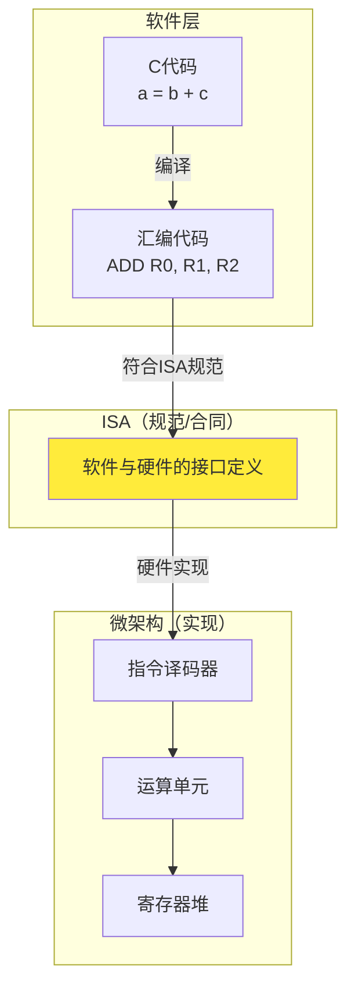
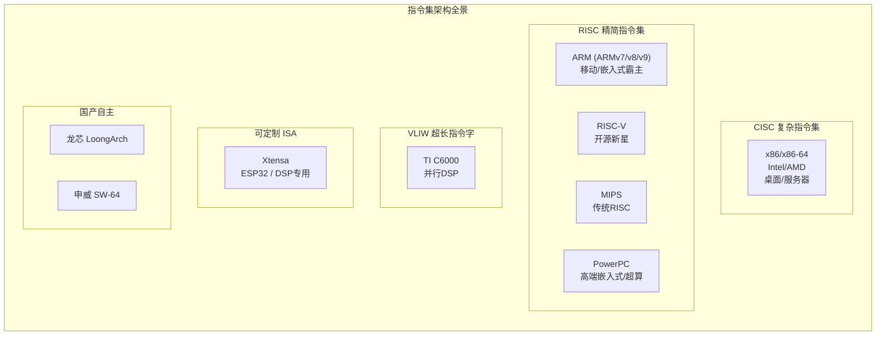
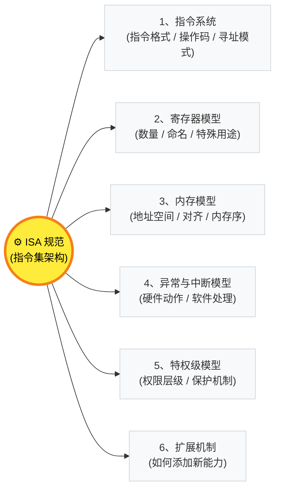
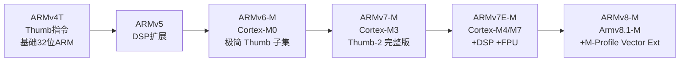
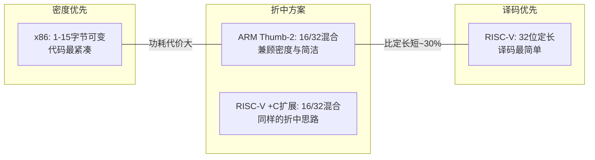

---
aliases:
  - ISA
  - 指令集架构
  - Instruction Set Architecture
tags:
  - 嵌入式
  - 硬件与芯片
  - 指令集
  - ISA
date: 2026-04-28
status: ✅完成
related:
  - "[[_芯片架构总览]]"
  - "[[ARM Cortx-M4]]"
  - "[[Xtensa LX6 双核架构]]"
  - "[[寄存器的大体认知]]"
  - "[[DSP架构]]"
---

# 指令集架构 (ISA)

> [!abstract] 核心定位
> ISA（Instruction Set Architecture）是软件与硬件之间的**合同**——CPU 能理解什么指令、有哪些寄存器、内存怎么访问、中断怎么处理，全都由它规定。同一个 ISA 可以有多种微架构实现（如 Cortex-M3/M4/M7 都是 ARMv7E-M），代码可以在不同芯片间移植。
>
> 本文件按认知路径组织：**先看清 ISA 有哪些种类 → 再理解 ISA 到底负责定义什么 → 最后深入编码细节和工程影响**。

---

## 一、ISA 的本质：软件与硬件的合同



**核心认知**：
- ISA 之上的代码可以**跨芯片移植**（同一 ISA，不同芯片厂商）
- ISA 之下的电路**每代都在变**（同一 ISA，不同微架构）
- ISA 是规范/协议，**不是实体**——它不存在于芯片内部，存在于规范文档中

### ISA vs 微架构

| 概念 | 含义 | 变化频率 | 嵌入式实例 |
|------|------|----------|-----------|
| **ISA** | 指令集规范（"说什么语言"） | 很少变（ARMv7 兼容 10+ 年） | ARMv7E-M 是 ISA |
| **微架构** | 硬件实现方式（"怎么说"） | 每代产品都改进 | Cortex-M3/M4/M7 是不同的微架构 |

| 微架构 | ISA | 流水线 | Cache | FPU | DSP |
|--------|-----|--------|-------|-----|-----|
| Cortex-M3 | ARMv7-M | 3级 | 无 | 无 | 无 |
| Cortex-M4 | ARMv7E-M | 3级 | 无 | 有 | 有 |
| Cortex-M7 | ARMv7E-M | 6级 | 有 | 有 | 有 |

M4 和 M7 使用**同一 ISA**，但微架构差距巨大。C 代码无需修改。详见 [[ARM Cortx-M4]]。

---

## 二、ISA 分类全景

### 2.1 按设计哲学分类



| 类型 | 设计思路 | 代表 | 优势 | 代价 |
|------|---------|------|------|------|
| **CISC** | 一条指令完成复杂操作 | x86 | 代码密度高 | 译码复杂，功耗高 |
| **RISC** | 简单指令+Load/Store | ARM, RISC-V | 流水线友好，低功耗 | 完成功能需更多指令 |
| **VLIW** | 编译器安排并行，一条长指令包含多个操作 | TI C6000 | 硬件简单，并行度高 | 编译器极难写，二进制不兼容 |
| **可定制** | 芯片厂商自行扩展指令 | Xtensa | 领域专用极致优化 | 代码不可移植 |

### 2.2 按应用领域分类

| 应用领域 | 主流 ISA | 典型芯片 | 特点 |
|----------|---------|----------|------|
| **桌面/服务器** | x86-64, ARMv9 | Intel Core, AWS Graviton | 性能优先，生态最强 |
| **移动终端** | ARMv9 | Apple A/M, 骁龙, 天玑 | 能效优先，95%+ 市占 |
| **嵌入式 MCU** | ARMv7-M/v8-M, RISC-V | STM32, ESP32-C3 | 实时性，低功耗，低成本 |
| **汽车电子** | ARMv8-A, PowerPC, RISC-V | NXP i.MX, 芯驰 | 功能安全，高可靠 |
| **AI 加速** | RISC-V + 自研扩展 | 平头哥, 赛昉 | 模块化，按需裁剪 |

> [!note] 嵌入式工程师的核心关注
> 嵌入式领域主要接触 **ARM Cortex-M（ARMv7E-M）**、**RISC-V（RV32IMC）** 和 **Xtensa** 三种 ISA。x86 几乎不会出现在嵌入式场景中，但作为对比参照有助于理解 RISC 的设计哲学。

---

## 三、ISA 负责定义什么

ISA 不是"指令的集合"，它是一份完整的**软硬件接口规范**。以下 6 个维度是任何 ISA 都必须定义的内容：




### 3.1 指令系统：指令格式、操作码、寻址模式

这是 ISA 最直观的部分——定义了 CPU 能执行的所有操作。

**指令格式**决定了二进制位如何分配：

| ISA | 指令长度 | 格式特点 |
|-----|---------|---------|
| ARM Thumb-2 | 16/32 位混合 | 短指令访问低寄存器，长指令全功能 |
| RISC-V | 32 位定长（+C 扩展 16 位） | opcode 始终在 `[6:0]`，字段位置对齐 |
| x86 | 1-15 字节可变 | 必须先读操作码才能知道指令长度 |
| Xtensa | 16/24/32/64 位混合 | 编译器自动选最短编码 |

**操作数风格**：

| ISA | 操作数风格 | 示例 |
|-----|-----------|------|
| ARM / RISC-V / Xtensa | 三操作数：`ADD Rd, Rn, Rm` | 结果不覆盖源，编译器友好 |
| x86 | 双操作数：`ADD EAX, EBX` | 结果覆盖源，指令紧凑 |

**寻址模式**（以 ARM 为例）：

| 寻址模式 | 汇编示例 | 含义 |
|----------|---------|------|
| 立即数 | `MOV R0, #42` | 操作数直接在指令中 |
| 寄存器 | `ADD R0, R1, R2` | 操作数在寄存器中 |
| 寄存器间接 | `LDR R0, [R1]` | 寄存器值作为地址 |
| 带偏移 | `LDR R0, [R1, #4]` | 基址 + 偏移 |
| 前索引 | `LDR R0, [R1, #4]!` | 先算地址再访问，更新基址 |
| 后索引 | `LDR R0, [R1], #4` | 先访问再更新基址 |

### 3.2 寄存器模型：数量、命名、特殊用途

ISA 定义了程序员可见的所有寄存器，这是编译器和汇编开发者最直接打交道的东西。

| ISA | 通用寄存器 | 参数传递 | 特殊寄存器 |
|-----|-----------|---------|-----------|
| **ARM** | R0-R15（16个） | R0-R3（4个） | SP(R13), LR(R14), PC(R15), xPSR |
| **RISC-V** | x0-x31（32个） | x10-x17（8个） | x0(恒零), x1(返回地址), x2(SP) |
| **x86(64)** | RAX-R15（16个） | RDI/RSI/RDX/RCX/R8/R9（6个） | RSP, RBP, RIP, RFLAGS |
| **Xtensa** | a0-a15 窗口化（物理64个） | a2-a7（6个） | a0(返回), a1(SP), 窗口化寄存器 |

**设计权衡**：

| 设计 | 代表 | 编译器视角 | 中断/任务切换 |
|------|------|-----------|-------------|
| 16 个通用寄存器 | ARM | 可能不够用，需要溢出到栈 | 只保存 8 个（M4 硬件自动压栈），延迟低 |
| 32 个通用寄存器 | RISC-V | 优化空间大，减少访存 | 保存更多，切换代价高 |
| 64 物理 + 窗口化 | Xtensa | 函数调用零内存访问 | 窗口溢出时批量保存，延迟不确定 |

ARM Cortex-M 的 12 周期中断延迟，与它只有 16 个寄存器直接相关——寄存器少，硬件压栈就快。详见 [[ARM Cortx-M4]] §2.2。

### 3.3 内存模型：地址空间、对齐、内存序

ISA 定义了 CPU 如何看待内存——不只是"地址是多少"，还包括**访问规则**和**并发行为**。

**地址空间与对齐**：

| ISA | 地址空间 | 对齐要求 |
|-----|---------|---------|
| ARMv7-M | 4GB（32位） | Word 访问需 4 字节对齐，否则 HardFault |
| RISC-V | 取决于 XLEN（32/64位） | 非对齐访问可能触发异常 |
| x86 | 64 位（长模式） | 硬件支持非对齐访问（性能惩罚） |

**内存序模型**——多核场景的关键：

| 模型 | 代表 | 规则 | 对程序员的影响 |
|------|------|------|-------------|
| **强序（TSO）** | x86 | 只允许 Store-Load 重排 | 大部分情况直觉正确 |
| **弱序** | ARM, RISC-V, Xtensa | 允许各种重排 | 必须显式使用内存屏障 |

```c
// 弱序模型下的典型问题
shared_data = 100;          // Step 1: 写数据
__sync_synchronize();       // ★ 内存屏障：确保 Step 1 在 Step 2 之前完成
flag = READY;               // Step 2: 通知对端
// 没有屏障，另一个核可能看到 flag=READY 但 shared_data 还是旧值
```

这就是写 ESP32 双核代码时要用 `__sync_synchronize()` 的根本原因。详见 [[Xtensa LX6 双核架构]] §5.3 和 [[DMA 与 Cache 一致性]]。

### 3.4 异常/中断模型

ISA 定义了中断/异常发生时**硬件自动做什么、软件必须做什么**——这直接决定了中断响应的确定性和延迟。

| ISA | 硬件自动保存 | 向量跳转 | 中断返回 |
|-----|-----------|---------|---------|
| **ARMv7-M** | 8 个寄存器（R0-R3,R12,LR,PC,xPSR） | 硬件查向量表自动跳转 | `BX LR`（特殊值） |
| **RISC-V** | 仅保存 PC 到 mepc | 软件查中断原因（mcause） | `mret` |
| **Xtensa** | 依赖配置，最少保存 PC/PS | 软件分发（三层架构） | `RFI` |

ARM Cortex-M 的 12 周期中断延迟之所以能做到"确定性"，就是因为 ISA 规定硬件自动完成压栈和跳转。详见 [[中断的基础理解]]。

### 3.5 特权级模型

ISA 定义了特权级层级，MPU/MMU 的权限控制基于此：

| ISA | 特权级 | 典型用途 |
|-----|--------|---------|
| **ARMv7-M** | Thread（特权/非特权）+ Handler | 裸机/RTOS，两级够用 |
| **ARMv8-A** | EL0(应用) → EL1(内核) → EL2(Hypervisor) → EL3(安全) | Linux/Android |
| **RISC-V** | U(用户) → S(内核) → M(机器) | 灵活组合 |

Cortex-M 的 Thread 模式下可以切换到非特权 + MPU 保护，实现类似"内核态/用户态"的隔离。详见 [[MPU架构]] 和 [[MMU(内存管理单元)]]。

### 3.6 扩展机制

ISA 不是一成不变的，不同 ISA 选择了不同的扩展路径：

| ISA | 扩展策略 | 优势 | 代价 |
|-----|---------|------|------|
| **ARM** | 官方线性扩展，严格兼容 | 生态统一，代码可移植 | 授权费用，创新速度受限 |
| **RISC-V** | 模块化组合，开源 | 灵活免费，按需裁剪 | 生态碎片化风险 |
| **Xtensa** | 芯片厂商定制指令 | 领域专用极致优化 | 代码完全不可移植 |

详见第五章"扩展与演进"。

---

## 四、编码策略深度解析

ISA 的编码策略——即二进制位如何分配——直接决定了芯片的译码器复杂度、代码密度和功耗。

### 4.1 编码的本质问题

一条指令要在 16 或 32 位里塞入：**操作码 + 寄存器编号 + 立即数/地址**。位数有限，必须取舍。

### 4.2 ARM Thumb-2 编码实例

ARM Cortex-M 只执行 Thumb-2 指令，有两种编码宽度：

**16 位 Thumb `ADD`（只能用 R0-R7）**：
```
| 15 14 13 12 11 10  9  8  7  6  5  4  3  2  1  0 |
|  0  0  0  1  1  0  0 |  Rm(3)  |  Rdn(3)       |
|--- 操作码 (6bit) ----|--- 操作数 -------|
```
- 操作码 6 位，寄存器各 3 位（只能编 0-7）
- 短小精悍，但只能访问"低寄存器"

**32 位 Thumb-2 `ADD`（可用 R0-R15）**：
```
| 31 ... 20 | 19 18 17 16 | 15 ... 12 | 11 ... 8 | 7 ... 4 | 3 ... 0 |
| 操作码前缀 |    Rn(4)    |   Rd(4)   |  imm(4)  |   ...   |   ...   |
```
- 寄存器各 4 位（可编 0-15），立即数空间更大
- 功能完整，但 Flash 占用翻倍

**工程影响**：编译器在 `-Os` 时会优先选 16 位编码，同一份 C 代码用 `-O2` 和 `-Os` 编译出的 bin 文件大小可能差 20%+。

### 4.3 RISC-V 编码：规整之美

opcode 字段始终在 `[6:0]`，所有格式的寄存器字段位置对齐：

```
R-type（寄存器-寄存器运算）:
| 31  25 | 24 20 | 19 15 | 14 12 | 11  7 | 6   0 |
| funct7 |  rs2  |  rs1  |funct3 |  rd   | opcode|

I-type（立即数运算/Load）:
| 31  20 | 19 15 | 14 12 | 11  7 | 6   0 |
|  imm   |  rs1  |funct3 |  rd   | opcode|
```

译码器可以先看 `[6:0]` 确定指令类型，再看 `[14:12]` 确定具体操作，硬件逻辑极其简洁。

### 4.4 x86 编码：复杂性的代价

x86 一条指令最多由 6 个部分拼装：

```
| 前缀(0-4B) | 操作码(1-3B) | ModR/M(0-1B) | SIB(0-1B) | 位移(0-4B) | 立即数(0-4B) |
```

指令长度 1-15 字节，译码器必须先读操作码才能知道这条指令有多长。这导致：
- 译码器是 x86 CPU 中最复杂的部分之一
- Intel 从 Pentium Pro 开始在内部将 x86 指令翻译成类似 RISC 的**微操作（μop）**——本质是"外 CISC 内 RISC"

### 4.5 编码策略对比

| ISA | 指令长度 | 译码复杂度 | 代码密度 | 功耗影响 |
|-----|---------|-----------|---------|---------|
| **ARM Thumb-2** | 16/32 混合 | 中 | 高 | 低 |
| **RISC-V (+C扩展)** | 16/32 混合 | 低 | 中 | 最低 |
| **x86** | 1-15 可变 | 极高 | 最高 | 高 |
| **Xtensa** | 16/24/32/64 可变 | 中 | 高 | 中 |

> [!tip] Xtensa 的变长编码
> ESP32 的 Xtensa LX6 支持 16/24/32/64 位混合编码，编译器自动选择最短编码。详见 [[Xtensa LX6 双核架构]] §2.1。

---

## 五、ISA 的扩展与演进

### 5.1 ARM 的线性扩展路径



| 版本 | 新增能力 | 为什么加 |
|------|---------|---------|
| Thumb-2 (v7) | 16/32 位混合编码 | 纯 16 位 Thumb 功能不够，纯 32 位 ARM 太占 Flash |
| DSP 指令 (v7E-M) | MAC/SIMD/SATURATE | MCU 越来越多地用于电机控制/音频处理 |
| FPU (v7E-M) | 单精度浮点硬件 | 算法从定点向浮点迁移 |
| Helium (v8.1-M) | 向量扩展 | AI 推理、DSP 算法需要 SIMD 加速 |

### 5.2 RISC-V 的模块化设计

RISC-V 不走"线性扩展"路线，而是**模块化组合**：

```
RV32IMAC = RV32I + M + A + C
           │      │   │   └─ 压缩扩展（16位编码，提升代码密度）
           │      │   └───── 原子扩展（多核同步必需）
           │      └───────── 乘法扩展（硬件乘除法）
           └──────────────── 基础整数集（必须，40余条指令）
```

可选扩展：F(单精度浮点) / D(双精度浮点) / V(向量) / B(位操作)

芯片厂商按需组合，不用的扩展不占晶体管。嵌入式场景用 `RV32IMC`（最小实用子集），高性能场景用 `RV64IMAFDV`（全功能）。

### 5.3 Xtensa 的可定制性

Xtensa 走得更远——芯片厂商可以添加**完全自定义的指令**：
- 乐鑫在 ESP32 中添加了 WiFi/BLE 加速指令
- DSP 厂商用 Xtensa 构建专用信号处理器

代价是**代码不可移植**：为 ESP32 写的 Xtensa 代码无法在别人的 Xtensa 芯片上运行。详见 [[Xtensa LX6 双核架构]] §2。

---

## 六、ISA 设计的三个根本权衡

每个 ISA 背后都是权衡，不存在"最优"设计。

### 6.1 代码密度 vs 译码简单



| 策略 | 代表 | 优势 | 代价 |
|------|------|------|------|
| 变长编码 | x86 | Flash/内存占用最小 | 译码器复杂，功耗高，难以并行译码 |
| 定长编码 | RISC-V（无C） | 译码器极简，功耗低 | 代码体积大 30%+ |
| 混合编码 | ARM Thumb-2, RISC-V+C | 兼顾两者 | 译码器需判断指令长度 |

**嵌入式现实**：Flash 是 BOM 成本的一部分，代码密度直接影响芯片选型。这就是为什么 Cortex-M 只支持 Thumb-2 而不支持 ARM（32位）指令集。

### 6.2 寄存器数量 vs 上下文切换代价

（详见 3.2 节寄存器模型中的设计权衡表格）

### 6.3 指令功能 vs 流水线友好

| 设计 | 代表 | 优势 | 代价 |
|------|------|------|------|
| 复杂指令 | x86 `REP MOVSB` 一条完成内存拷贝 | 代码紧凑 | 流水线难以优化，执行时间不可预测 |
| 简单指令 | RISC Load/Store 架构 | 流水线规则，每级 1 周期 | 完成同样功能需要更多指令 |
| DSP 专用指令 | `MAC` 单周期乘累加 | 信号处理效率极高 | 增加硬件复杂度，需专用编译器支持 |

> [!tip] 现代 x86 的解法
> x86 表面是 CISC，但 CPU 内部将复杂指令翻译成类似 RISC 的**微操作（μop）**。本质是"用硬件复杂度换取软件兼容性"。嵌入式芯片没有这个奢侈——晶体管预算有限，所以 ARM/RISC-V 直接用 RISC 设计。

---

## 七、从 C 到机器码：编译链路中 ISA 的影响

### 7.1 编译流水线


### 7.2 指令选择：ISA 有没有这条指令？

```c
int a = b + c;
```

在不同 ISA 下的汇编：

```asm
// ARM Cortex-M (Thumb-2):
ADD  R0, R1, R2          ; 一条指令，三操作数

// x86:
MOV  EAX, EBX            ; 先复制
ADD  EAX, ECX            ; 再加——双操作数，结果覆盖源

// RISC-V:
ADD  a0, a1, a2          ; 三操作数，与 ARM 类似

// Xtensa:
ADD  a2, a3, a4          ; 同上
```

### 7.3 寄存器分配：寄存器够不够用？

| ISA | 参数传递寄存器 | 编译器可用通用寄存器 | 第 N 个参数 |
|-----|-------------|----------------|-----------|
| ARM | R0-R3（4个） | R4-R11（8个） | 第 5 个压栈 |
| RISC-V | x10-x17（8个） | x1-x31（大量） | 第 9 个压栈 |
| x86(64) | RDI/RSI/RDX/RCX/R8/R9（6个） | RAX-R15 | 第 7 个压栈 |

> [!warning] ARM 的 AAPCS 调用约定
> ARM 规定前 4 个参数通过 R0-R3 传递，第 5 个开始压栈。高质量嵌入式代码应控制函数参数不超过 4 个。详见 [[ARM Cortx-M4]] §3.2。

### 7.4 立即数陷阱

ARM 32 位指令中的立即数编码规则（Thumb-2）：`8 位数值 + 4 位循环移位`

```asm
// 可以编码为一条指令（立即数在范围内）
MOV  R0, #0xFF           ; ✅ 8位直接编码
MOV  R0, #0xFF00         ; ✅ 0xFF 左移 8 位

// 需要两条指令（超出编码范围）
MOVW R0, #0x1234         ; 低16位
MOVT R0, #0x5678         ; 高16位 → R0 = 0x56781234
```

大常数占 2 倍 Flash，在中断密集的代码中还会影响 I-Cache 命中率。用查表替代大常数是常见的优化手段。

---

## 八、对嵌入式开发的实际影响速查表

| ISA 特性 | 你的代码受什么影响 | 优化建议 |
|----------|-----------------|---------|
| Thumb-2 混合编码 | Flash 占用是 16/32 位混合 | `-Os` 优化代码密度 |
| AAPCS 调用约定 | 函数参数 > 4 个就压栈 | 控制参数 ≤ 4 个，用结构体传参 |
| 立即数范围有限 | 大常数需要 2 条指令 | 用 `const` 数组查表替代 |
| 条件执行指令 | 减少分支，提升流水线效率 | 简单 `if` 用条件后缀（IT 块） |
| 位操作指令 (CLZ/TBB) | 查表/位操作场景优化 | 熟悉 CMSIS 内联函数 |
| 弱序内存模型 | 多核/DMA 场景数据可能不一致 | 共享数据必须用内存屏障 |

### 推荐资源

- **ARMv7-M Architecture Reference Manual**：Cortex-M 指令集官方文档（Thumb-2 编码）
- **RISC-V Reader**（Patterson/Waterman）：RISC-V 设计哲学入门经典
- **ARM Cortex-M4 权威指南**（Joseph Yiu）：寄存器/异常/调试的工程级详解
- **Intel SDM**：x86 架构权威文档（对比参考）

---

## 总结

> [!quote] 本质
> ISA 不是"指令的集合"，而是一份完整的软件-硬件接口规范。它的设计哲学——编码策略、寄存器数量、指令复杂度、内存序模型——直接决定了芯片的功耗、性能、开发工具链和代码可移植性。

## 知识拓扑

- 上层：[[_芯片架构总览]] — ISA 在处理器全景中的定位
- 深入-ARM：[[ARM Cortx-M4]] — 寄存器组、AAPCS、HardFault、双栈指针
- 深入-Xtensa：[[Xtensa LX6 双核架构]] — 窗口化寄存器、变长编码、零开销循环
- 深入-DSP：[[DSP架构]] — MAC/零开销循环/饱和运算等专用指令
- 关联：[[寄存器的大体认知]] — 寄存器的物理本质（D 触发器 → MMIO）
- 关联：[[中断的基础理解]] — 异常模型与 ISA 的关系
- 关联：[[DMA 与 Cache 一致性]] — 内存序模型与弱序问题
