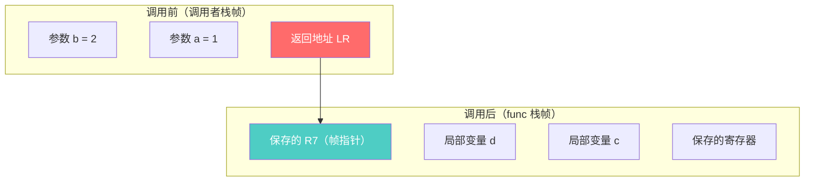
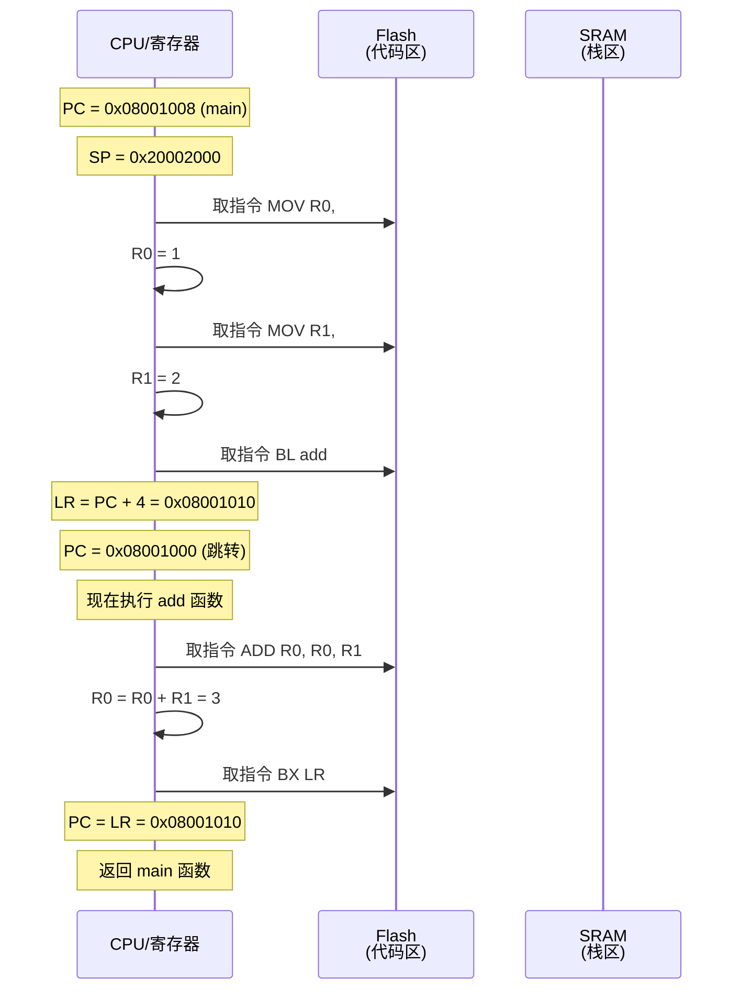
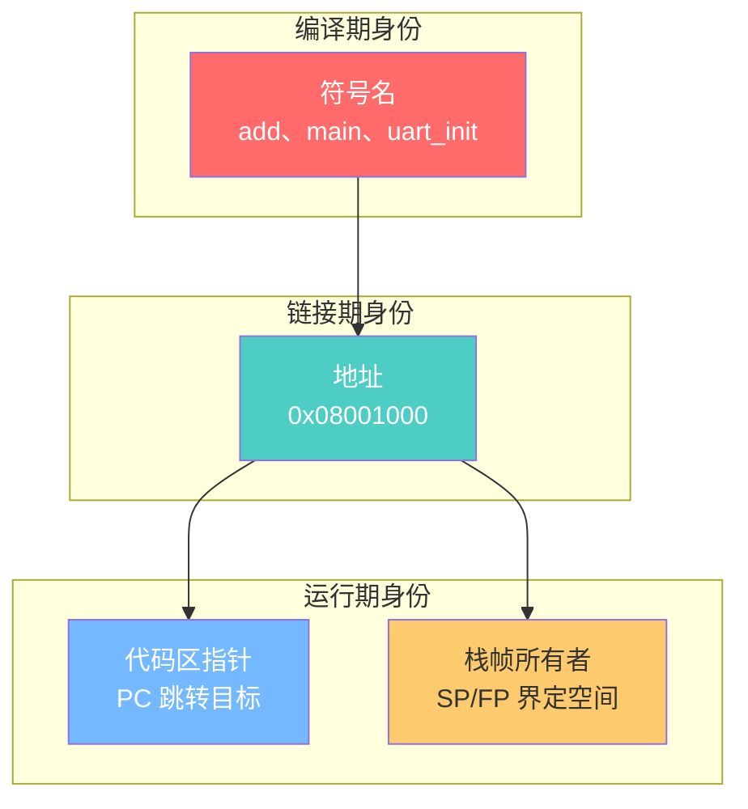
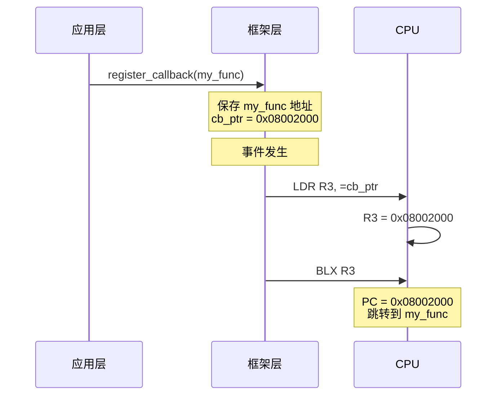
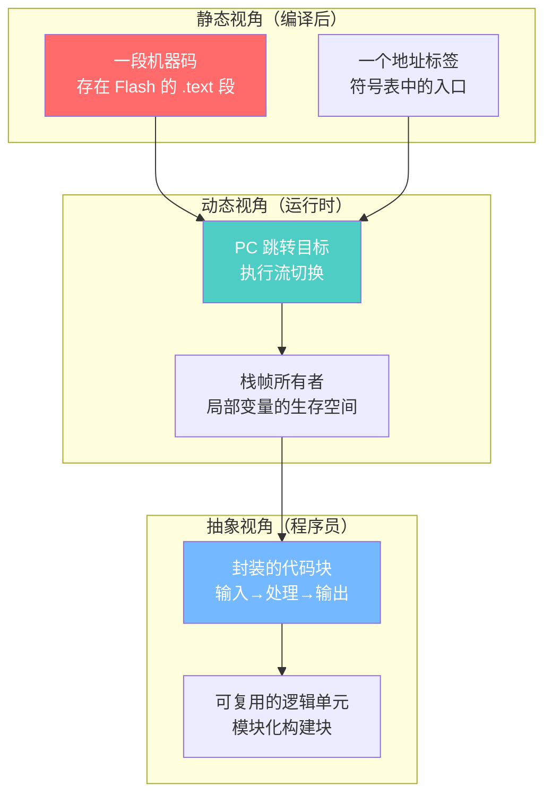

## 【问题诊断】

函数的本质问题，从**编译、链接、运行**三个阶段来剖析。

---

## 【第一阶段：编译后——函数就是一堆字节】

### 函数 = Flash 中的一段机器码

```c
int add(int a, int b) {
    return a + b;
}
```

编译后（ARM Thumb 指令）：

```
地址          机器码          反汇编
────────────────────────────────────────
0x08001000   00 68          LDR    R0, [R0]     ; 取参数 a
0x08001002   01 68          LDR    R1, [R1]     ; 取参数 b
0x08001004   08 44          ADD    R0, R0, R1   ; a + b
0x08001006   70 47          BX     LR           ; 返回
────────────────────────────────────────
总共 8 字节，存在 Flash 的 .text 段
```

**本质**：函数名 `add` 就是地址 `0x08001000` 的**符号标签**。

---

## 【第二阶段：链接后——函数名变成地址】

### 符号表解析

```c
/* 编译后的符号表 */
Symbol              Value        Size    Type
────────────────────────────────────────────────
add                 0x08001000   8       FUNC
main                0x08001008   24      FUNC
uart_init           0x08002000   64      FUNC
```

### 函数调用的本质

```c
int result = add(1, 2);
```

编译器生成：

```asm
/* 调用前：准备参数 */
MOV    R0, #1          ; 参数 a
MOV    R1, #2          ; 参数 b

/* 调用：本质是 PC 跳转 */
BL     0x08001000      ; Branch with Link
                       ; 等价于：
                       ;   LR = PC + 4（保存返回地址）
                       ;   PC = 0x08001000（跳转）
```

**本质**：函数调用 = **PC 寄存器跳转 + LR 寄存器保存返回地址**。

---

## 【第三阶段：运行时——栈帧是函数的"私有空间"】

### 栈帧结构

```c
void func(int a, int b) {
    int c = a + b;
    int d = c * 2;
}
```



### 栈帧的内存布局

```
高地址
┌─────────────────────┐
│     参数 b = 2      │  ← 调用者压栈
├─────────────────────┤
│     参数 a = 1      │
├─────────────────────┤
│   返回地址 (LR)     │  ← BL 指令自动压栈
├─────────────────────┤ ← SP 指向这里（func 入口）
│   保存的 R7 (FP)    │  ← func 压栈
├─────────────────────┤
│   局部变量 d        │
├─────────────────────┤
│   局部变量 c        │
├─────────────────────┤
│   保存的 R4~R11     │  ← 如果 func 用到
├─────────────────────┤ ← SP 指向这里（func 运行中）
│     ...             │
└─────────────────────┘
低地址
```

### 函数入口/出口的汇编

```asm
/* func 入口：建立栈帧 */
func:
    PUSH   {R7, LR}        ; 保存帧指针和返回地址
    SUB    SP, SP, #16     ; 分配局部变量空间
    ADD    R7, SP, #0      ; 设置新的帧指针
    
    /* 函数体 */
    LDR    R0, [R7, #4]    ; 取参数 a
    LDR    R1, [R7, #8]    ; 取参数 b
    ADD    R2, R0, R1      ; c = a + b
    STR    R2, [R7, #-4]   ; 存局部变量 c
    
    /* func 出口：销毁栈帧 */
    ADD    SP, SP, #16     ; 回收局部变量空间
    POP    {R7, PC}        ; 恢复帧指针，跳回调用者
                            ; 等价于：恢复 R7，PC = LR
```

**本质**：函数的"私有空间" = **栈帧**，由 SP 和 FP（帧指针）界定。

---

## 【第四阶段：函数指针——函数地址的"别名"】

### 函数指针的本质

```c
int (*func_ptr)(int, int) = add;  // func_ptr = 0x08001000

int result = func_ptr(1, 2);      // 等价于 add(1, 2)
```

编译后：

```asm
/* func_ptr(1, 2) 的汇编 */
MOV    R0, #1
MOV    R1, #2
LDR    R2, =func_ptr     ; R2 = func_ptr 的地址
LDR    R3, [R2]          ; R3 = func_ptr 的值 = 0x08001000
BLX    R3                ; 跳转到 R3 指向的地址
```

### 函数指针 vs 普通指针

```c
int  value = 100;
int *ptr   = &value;      // ptr 指向数据区（SRAM）

int add(int a, int b);
int (*func_ptr)(int, int) = add;  // func_ptr 指向代码区

/* 内存视角 */
ptr      → 0x20000100 (SRAM)  → 存放数据 100
func_ptr → 0x08001000 (Flash) → 存放机器码
```

**本质**：函数指针 = **存储代码区地址的变量**。

---

## 【第五阶段：完整调用链路】

### 从 main() 调用 add() 的完整过程



---

## 【第六阶段：函数的"身份"解析】

### 函数的三重身份



### 不同视角下的函数

| 视角 | 函数是什么 |
|------|-----------|
| **编译器** | 符号表中的一个条目，有名字、地址、大小 |
| **链接器** | 地址标签，需要重定位 |
| **CPU** | PC 跳转的目标地址 |
| **内存** | Flash 中的一段只读字节 |
| **运行时** | 栈帧 + 执行流 |

---

## 【第七阶段：回调函数的本质】

### 回调函数 = 延迟决定的跳转地址

```c
/* 普通调用：编译时确定地址 */
add(1, 2);  // 编译器知道 add 的地址

/* 回调调用：运行时确定地址 */
typedef int (*callback_t)(int);
void register_callback(callback_t cb);  // cb 的地址运行时才知道

/* 本质 */
// 普通调用：BL 0x08001000（硬编码地址）
// 回调调用：BLX R3（R3 存储运行时传入的地址）
```

### 回调函数的调用过程



---

## 【第八阶段：函数与中断的对比】

### 函数调用 vs 中断响应

| 维度 | 函数调用 | 中断响应 |
|------|---------|---------|
| 触发方式 | 软件（BL 指令） | 硬件（信号触发） |
| 时机 | 程序主动调用 | 随时可能发生 |
| 返回地址 | LR 寄存器 | 栈中（硬件自动压栈） |
| 上下文保存 | 编译器决定 | 硬件自动保存 xPSR/PC/LR/R0-R3 |
| 权限 | 用户态/内核态 | 可能涉及特权级切换 |

### 中断的"伪函数调用"

```asm
/* 中断响应时硬件自动做的事 */
PUSH   {xPSR, PC, LR, R12, R3, R2, R1, R0}  ; 硬件压栈
LR     = 0xFFFFFFF9                          ; 特殊返回值
PC     = 向量表中的地址                       ; 跳转到 ISR

/* ISR 执行 */
ISR_Handler:
    PUSH   {R4-R11}      ; 保存其他寄存器
    ; ... ISR 逻辑 ...
    POP    {R4-R11}
    BX     LR            ; 返回（硬件自动出栈）
```

---

## 【第九阶段：函数的本质总结】

### 一句话定义

```
函数 = Flash 中的一段机器码 + 约定好的入口地址 + 栈帧管理规则
```

### 三层本质



---

## 【大师的工程建议】

### 记忆口诀

```
编译后：函数是 Flash 中的字节序列
链接后：函数是地址标签
运行时：函数是 PC 跳转 + 栈帧
调用本质：保存现场 → 跳转 → 执行 → 恢复现场
```

### 函数指针的危险

```c
/* 函数指针的陷阱 */
typedef void (*func_t)(void);

func_t ptr = (func_t)0x08001000;  // 强制转换地址
ptr();  // 跳转到 0x08001000 执行

/* 危险：如果地址错误 → HardFault */
/* 用途：跳转表、状态机、回调、Bootloader 跳转 */
```

### 函数与栈的关系

```
每次函数调用：
  1. 参数入栈（或寄存器传递）
  2. 返回地址入栈（LR）
  3. 局部变量分配栈空间
  4. 保存的寄存器入栈

栈溢出原因：
  - 递归太深
  - 局部变量太大
  - 嵌套调用太多
```

---

**一句话总结**：函数的本质是**Flash 中的机器码 + 入口地址**，调用函数就是**PC 跳转 + 栈帧管理**，函数指针就是**存储代码区地址的变量**。从 CPU 视角看，函数调用就是**保存现场、跳转执行、恢复现场**三步。